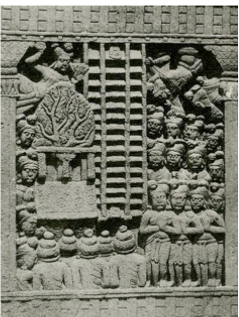

# Teaching the Abhidharma in the Heaven of the Thirty-three, The Buddha and his Mother[^*]

Anālayo

JOCBS 2012(2): 9-35 ©️2012 Anālayo

In what follows I investigate the tale of the Buddha's sojourn in the Heaven of the Thirty-three to teach his mother, based on a translation of a version of this episode in the Samyukta-āgama preserved in Chinese, with a view to discerning the gradual development and significance of this tale.

## Introduction

With the present paper I continue exploring a theme broached in the last issue of the present journal, namely the Buddha's preaching activities in relation to early Buddhist inclusivism, which 'includes' denizens of the ancient Indian pantheon in the early Buddhist world, albeit with some significant changes. [^1] While in the previous paper I studied the motif of Brahmā inviting the Buddha to start teaching, the episode taken up now is a rainy season retreat spent by the Buddha in the Heaven of the Thirty-three to teach his mother and the assembled devas. [^2]

Śakra, the king in the Heaven of the Thirty-three, in a way exemplifies the tendency to inclusivism even more than Brahmā. The ancient Indian warrior god Indra, the slayer of Vṛtra, [^3] undergoes a rather radical transformation in early Buddhist texts and becomes a peaceful and devout Buddhist disciple under the name of Śakra. [^4] In one episode located in the past, even when he has to engage in war, Śakra takes such care to avoid unnecessary harm to living beings that, on being defeated, he halts his retreat and turns round to face the enemy again so as to avoid harming the nests of birds that would be destroyed if he were to continue his flight. [^5] Needless to say, this heroic deed in the name of harmlessness is what then ensures his final victory.

[^*]: I am indebted to Rod Bucknell, Giuliana Martini, Shi Kongmu, Ken Su, Giovanni Verardi and Monika Zin for comments on a draft of this paper.
[^1]: Anālayo 2011a.
[^2]: Another teaching given in the Heaven of the Thirty-three is reported in MN 134 at MN III 200,12, in which case the parallels MĀ 166 at T I 698c20 and T 77 at T I 886b12 speak of the Bamboo Grove at Rājagṛha instead.
[^3]: A summary of this myth can be found in Macdonell 1897/2000: 58-60.

The tale of the Buddha's visit to the Heaven of the Thirty-three, translated below from a Samyukta-āgama collection that has probably been transmitted within the Mūlasarvāstivāda tradition, [^6] shows Śakra and the whole celestial assembly as a pious gathering of respectful Buddhist disciples. Besides a few Sanskrit fragments, [^7] a full Sanskrit version of this tale occurs in the Avadānaśataka, [^8] a text stemming from the same Mūlasarvāstivāda tradition. [^9] The Mūlasarvāstivāda Vinaya also has recorded this episode. [^10]

In the Theravāda tradition, a corresponding narration can be found in brief in the commentary on the Suttanipāta and in the Jātaka collection, [^11] with a more detailed description provided in the Dhammapada commentary. [^12]

A Chinese Āgama parallel to the Samyukta-āgama tale occurs as part of a longer discourse in the Ekottarika-āgama. [^13] The school affiliation of this discourse collection is a subject of continued discussion among scholars and thus at present best considered as undetermined. [^14]

[^4]: Cf. also Anālayo 2010b: 3 and 2011b: 157.
[^5]: SN 11.6 at SN I 224,24 and its parallels SĀ 1222 at T II 333c1 and SĀ2 49 at T II 390a8.
[^6]: On the school affiliation of the Samyukta-āgama cf., e.g., Lü 1963: 242, Waldschmidt 1980: 136, Mayeda 1985: 99, Enomoto 1986: 23, Schmithausen 1987: 306, Choong 2000: 6 note 18, Hiraoka 2000, Harrison 2002: 1, Oberlies 2003: 64, Bucknell 2006: 685 and Glass 2010.
[^7]: SHT V 1145, Sander 1985: 144, describes groups of devas proclaiming their status as streamenterers; SHT V 1146 V 1 to R1, Sander 1985: 145, has preserved the final part of the discourse with Mahāmaudgalyāyana announcing the Buddha's impending return; fragment Or 15009/49, Ye 2009: 125f, sets in towards the end of the episode preserved in SHT V 1145 and then has Mahāmaudgalyāyana's requesting the Buddha to return and the Buddha's reply; SHT III 835, Waldschmidt 1971: 56f, describes the Buddha's descent.
[^8]: The episode is part of tale 86, Speyer 1909/1990: 89,1 to 94,16.
[^9]: Hartmann 1985. The Avadānaśataka version is in fact fairly close to the tale in SĀ 506.
[^10]: T 1451 at T XXIV 346a14 to 347a18 and D 6 da 88a2 to 92a1 or Q 1035 ne 85 a2 to 89 a6.
[^11]: Pj II 570,10 to 20 and Jā 483 at Jā IV 265,17 to 266,5; cf. also Vism 391,1 to 392,20.
[^12]: Dhp-a III 216,17 to 226,3 .
[^13]: EĀ 38.5 at T II 705 b23 (the Buddha goes to the Heaven of Thirty-three) to 707 c 4 (the Buddha has returned to Jambudvīpa); the section corresponding to SĀ 506 (which begins only at T II 706c18 with the four assemblies asking Mahāmaudgalyāyana to be their messenger) has been translated by Bareau 1997: 20-25.

Another version occurs in the Chinese counterpart to the Atṭhakavagga of the Suttanipāta. [^15] Unlike its Pāli parallel, the Chinese counterpart to the Atṭ̣hakavagga accompanies its stanzas throughout with prose narrations. A comparable case would be the Pāli Udāna collection, where the stanzas also come together with prose, whereas Udāna collections of other Buddhist schools consist only of verse material. [^16] Thus the Chinese counterpart to the Atṭhakavagga and the Pāli Udāna collection appear to testify to the same phenomenon, namely the inclusion into a canonical text of material that may originally have been of a more commentarial nature. [^17]

Several other versions of the Buddha's sojourn in the Heaven of the Thirtythree have been preserved in the Chinese canon. [^18]

Out of the various scenes depicted in this episode, his descent back to the human realm, accompanied by Brahmā and Śakra, has become one of the favourite motifs of Indian iconography, [^19] with early specimens extant already from the aniconic period.

[^14]: For a brief survey of aspects of the Ekottarika-āgama cf. Anālayo 2009b. At the SLABS conference held 2010 at SIBA in Sri Lanka, Tsefu Kuan presented several arguments in favour of the hypothesis that the Ekottarika-āgama was transmitted within the Mahāsāṃghika tradition. A position in favour of a Mahāsāṃghika affiliation has also been argued recently by Pāsādika 2010. For a survey of opinions on this topic by Japanese scholars cf. Mayeda 1985: 102f.
[^15]: The tale is part of the fourteenth discourse regarding the nun Utpalavarṇā, T 198 at T IV 184c25 to 185 c 9 , translated in Bapat 1950: 36-42.
[^16]: For a study of this feature cf. Anālayo 2009a.
[^17]: On this phenomena cf. Anālayo 2010a.
[^18]: Cf., e.g., T 156 at T III 136b17 to 137b10, T 200 at T IV 247a1 to a8, and T 694 at T XVI 791 b10 to 792 C 25 (for further references cf. note 72 below); for a detailed survey of relevant texts from the Tibetan canon cf. Skilling 2008.
[^19]: Foucher 1905: 537 comments that "le fait le plus important dans l'imagination populaire nétait ni son ascension, que l'on ne voit nulle part, ni même son séjour, qui manque de pittoresque, mais bien sa 'descente' sur la terre".

The above Bhārhut relief, found on the so-called Ajātaśatru Pillar, depicts the Buddha's descent from the Heaven of the Thirty-three. [^20] At the centre a triple flight of stairs reaches down from heaven, with footsteps of the Buddha depicted on the first and last step of the middle, wider flight of stairs. Above flying devas carry flowers, while the area to the side and below is packed with the expectant crowd that has gathered to welcome the Buddha's return. A tree with a seat stands beside the stairs, as if ready to receive the Buddha for the teaching to be given to the assembled crowd. [^21]

[^20]: Picture from Coomaraswamy 1956 plate XI figure 31 middle section; cf. also Cunningham 1879 plate XVII middle section. For a survey of early representations of the same scene cf., e.g., Fábri 1930: 289, Lamotte 1958/1988: 339, Schlingloff 2000: 478 f and Skilling 2008: 42. Monika Zin informs me that among the recent Kanaganahalli discoveries (on which cf. Zin 2011) an aniconic depiction of the Buddha's descent has been found, which has so far not been published. The relief is about two meters in height and shows a single flight of stairs, the lowest of which carries the Buddha's footprints.
[^21]: Schlingloff 2000: 481 confirms that the stone seat under the fig tree is a pictorial reference to the Buddha's preaching after his return to earth, "auf die Predigt des Buddha nach seinem Herabstieg zur Erde wird durch einen Steinsitz unter einem Feigenbaum hingewiesen". The depiction of a fig tree would fit the reference to an Udumbara tree in SĀ 506 at T II 134c16; cf. also the translation below.

Below, I translate the Samyukta-āgama version, followed by a brief study of selected aspects of its presentation.

## Translation

### [Discourse to Śakra] [^22]

Thus have I heard. At one time the Buddha was spending the rains retreat in the Heaven of the Thirty-three on the Pāṇdukambala Rock, [^23] not far from the Pārijāta, the Kovidāra Tree, teaching the Dharma to his mother and the devas of the Thirty-three. At that time, the venerable Mahāmaudgalyāyana was spending the rains retreat at Śrāvastī in Jeta's Grove, Anāthapiṇ̣ada's Park.

Then [the members of] the four assemblies approached the venerable Mahāmaudgalyāyana, paid respects with their heads at his feet, withdrew to sit at one side and said to the venerable Mahāmaudgalyāyana: "Do you know where the Blessed One is spending the rains retreat?"[^24]

[^22]: SĀ 506 at T II 134a7 to 134c23, for which Akanuma 1929/1990: 58 suggests the title 帝釋. The present discourse need not be a version of the Devāvatāra-sūtra mentioned in the 'Karmavibhangopadeśa', Lévi 1932: 159,18, as the descent scene in SĀ 506 is rather brief, making it less probable that this particular episode would have provided the title of the discourse.
[^23]: SĀ 506 at T II 134 a7 actually reads: 聽色虛軟石. Judging from the corresponding passage in the Avadānaśataka, Speyer 1909/1990: 89,5: pāṇdukambalaśilāyaṃ pārijātasya kovidārasya nātidūre (cf. also the Avadānakalpalatā 14.1, Das 1888: 431,7), the reference in SĀ 506 would be to the pāndukambalaśila, the rock used as throne by Śakra; cf. also the pandukambalasilā mentioned in Jā IV 265,19 and Dhp-a III 217,3. Various descriptions of what is presumably the same place can be found in the parallels, cf., e.g., EĀ 38.5 at T II 705 c 1 (cf. also T II 706c12), T 198 at T IV 184c26, T 200 at T IV 247a1, and the Mūlasarvāstivāda Vinaya, T 1451 at T XXIV 346a1, with its counterpart in D 6 da 88a2 or Q 1035 ne 85 a 3 .
[^24]: EĀ 38.5 at T II 705 c29 precedes this with the members of the four assemblies inquiring from Ānanda, who does not know where the Buddha is residing and eventually directs them on to Aniruddha. Using his divine eye, Aniruddha is still unable to discern the Buddha's whereabouts, as the Buddha has transformed his body in such a way that he cannot be discovered. At the end of the three month period, the Buddha stops this transformation of his body. Thereon Aniruddha is able to see him. He then recommends that the one to be sent to the Heaven should be Mahāmaudgalyāyana. According to Pj II 570,11, however, the Buddha had been requested to return by Anuruddha, while Jā IV 265,21 reports that Mahāmoggallāna had come to tell the Buddha, as does Vism 391,20, preceded by indicating that Anuruddha had found out where the Buddha was. Dhp-a III 218,9 begins with Mahāmoggallāna being asked about the Buddha's whereabouts. Even though Mahāmoggallāna knows, he nevertheless directs the members of the four assemblies to Anuruddha for finding out where the Buddha is; here, too, it is eventually Mahāmoggallāna who approaches the Buddha.

The venerable Mahāmaudgalyāyana replied: "I heard that the Blessed One is spending the rains retreat in the Heaven of the Thirty-three, on the Pāndukambala Rock, not far from the Pārijāta, the Kovidāra Tree, teaching the Dharma to his mother and the devas of the Thirty-three." Then [the members of] the four assemblies, hearing what the venerable Mahāmaudgalyāyana had said, were delighted and joyful. They all rose from their seats, paid respects and left.

Then, when the three months of the rains retreat were over, [the members of] the four assemblies again approached the venerable Mahāmaudgalyāyana, paid respects with their heads at his feet and withdrew to sit to one side. Then the venerable Mahāmaudgalyāyana taught the Dharma to [the members of] the four assemblies in various ways, explaining, teaching, illuminating and delighting them. Having explained, taught, illuminated and delighted them, he remained silent.

Then [the members of] the four assemblies rose from their seats, paid respects with their heads and said to the venerable Mahāmaudgalyāyana: "Venerable Mahāmaudgalyāyana, please know that we have not seen the Blessed One for a long time. We [members of the four] assemblies eagerly long to see the Blessed One. Venerable Mahāmaudgalyāyana, if it is not too troublesome, we would wish that you approach the Heaven of the Thirty-three on our behalf and inquire from the Blessed One on behalf of all of us: 'Do you have little disease and little trouble, are you dwelling at ease and in peace?' Further tell the Blessed One: '[The members of] the four assemblies of Jambudvīpa wish to see the Blessed One, [^25] but they do not have the supernormal power to ascend to the Heaven of the Thirty-three to pay their respects to the Blessed One. The devas of the Thirty-three, [however], do themselves have the supernormal power to come down and be among human beings. We only wish for the Blessed One to come back to Jambudvīpa, out of compassion."

Then the venerable Mahāmaudgalyāyana assented by remaining silent. [134b] Then [the members of] the four assemblies, knowing that the venerable Mahāmaudgalyāyana had assented by remaining silent, all rose from their seats, paid respects and left.

At that time the venerable Mahāmaudgalyāyana, knowing that [the members of] the four assemblies had left, entered concentration, an attainment of such a type that, just as a strong man bends or stretches his arm, so in an instant he disappeared from Śrāvastī and appeared in the Heaven of the Thirty-three, on the Pāṇdukambala Rock, not far from the Pārijāta, the Kovidāra Tree. At that time the Blessed One was teaching the Dharma to the assembly in the Heaven of the Thirty-three, surrounded by an innumerable retinue.

[^25]: On the significance of the term Jambudvīpa cf. Wujastyk 2004.

Then the venerable Mahāmaudgalyāyana, seeing the Blessed One from afar, was thrilled with joy, thinking: 'Today the Blessed One is teaching the Dharma surrounded by the great heavenly assembly, which is no different from [him teaching] a gathering of the assemblies in Jambudvīpa.'

At that time the Blessed One, knowing the thought in the mind of the venerable Mahāmaudgalyāyana, said to the venerable Mahāmaudgalyāyana: "Mahāmaudgalyāyana, it is not on their own account [that they are gathered like this]. When I wish to teach the Dharma to the devas, they right away come together. When I wish them to leave, they right away leave. They come following my intention and go following my intention."[^26]

At that time the venerable Mahāmaudgalyāyana paid respects with his head at the Buddha's feet, withdrew to sit at one side and said to the Blessed One: "Various kinds of devas have come together in this great assembly. Are there in this great assembly of devas those who have earlier heard the Dharma taught by the Buddha, the Blessed One, and attained perfect confidence, who on the breaking up of the body, at death, have come to be reborn here?"

The Buddha said to the venerable Mahāmaudgalyāyana: "So it is, so it is. Among the various devas that have come together in this great assembly there are those who in their previous lives heard the Dharma and attained perfect confidence in the Buddha, the Dharma and the community, who have accomplished noble morality and, on the breaking up of the body, at death, have come to be reborn here."[^27]

Then Śakra, the king of devas, on seeing that the Blessed One and the venerable Mahāmaudgalyāyana had finished speaking to each other in praise of the assembly of devas, said to the venerable Mahāmaudgalyāyana: "So it is, so it is, venerable Mahāmaudgalyāyana. All of the various [devas] that have gathered in this assembly heard the right Dharma in their previous lives and attained perfect confidence in the Buddha, the Dharma and the community, accomplished noble morality and, on the breaking up of the body, at death, have come to be reborn here."

[^26]: EĀ 38.5 at T II 705 C 27 attributes it to the Buddha's concentrative power that they act like this.
[^27]: No such indication is given in EĀ 38.5 , which instead at T II 705 c9 reports that while in the Heaven of the Thirty-three the Buddha had delivered a gradual discourse culminating in the four truths, whereon the devas attained stream-entry. In other words, in this account they obviously had not already been stream-enterers in their former existence.

Then a certain monk, [^28] on seeing that the Blessed One, the venerable Mahāmaudgalyāyana and Śakra, the king of devas, had finished approving of each other, said to the venerable Mahāmaudgalyāyana: "So it is, so it is, venerable Mahāmaudgalyāyana. All of the various devas that have gathered here have heard the right Dharma in their previous lives and attained perfect confidence in the Buddha, the Dharma and the community, accomplished noble morality and, on the breaking up of the body, at death, have come to be reborn here."

Then a deva rose from his seat, [^29] [134c] arranged his garment so as to bare the right shoulder, and with hands held together [in respect] said to the Buddha: "Blessed One, I too accomplished perfect confidence in the Buddha and therefore came to be reborn here." Another deva said: "I attained perfect confidence in the Dharma." Some said they attained perfect confidence in the community and some said they accomplished noble morality, therefore coming to be reborn here. Like this, innumerable thousands of devas declared before the Buddha that they had attained the condition of stream-entry. They all then disappeared from before the Buddha and were no longer seen.

Then the venerable Mahāmaudgalyāyana, soon after knowing that the heavenly assembly had left, rose from his seat, arranged his robes so as to bare the right shoulder, and said to the Buddha: "Blessed One, [the members of] the four assemblies of Jambudvīpa pay respects with their heads at the feet of the Blessed One and inquire from the Blessed One: 'Do you have little disease and little trouble, are you dwelling at ease and in peace?' [The members of] the four assemblies cherish the wish to see the Blessed One. They say to the Blessed One: 'We humans do not have the supernormal power to ascend to the Heaven of the Thirty-three to pay our respects to the Blessed One. However, the devas have great might and power, they are all able to come down to Jambudvīpa. We only wish for the Blessed One to come back to Jambudvīpa, out of compassion for [the members of] the four assemblies."

[^28]: It is unclear to me where this monk suddenly comes from; no comparable reference is found in the corresponding section in the chief parallel versions. A whole discourse dedicated to the Buddha's mother, however, begins by indicating that the Buddha dwelled in the Heaven of the Thirtythree in the company of 1250 monks; cf. T 383 at T XII 1005a7: 與大比丘眾一千二百五十人俱 and the discussion in Durt 2007: 255 [56]. Similarly, another version of the present episode speaks of an innumerably great community of monks being together with the Buddha (and a similarly innumerable number of bodhisattvas) in the Heaven of the Thirty-three, T 694 at T XVI 790a16: 與無量大比丘眾.
[^29]: SĀ 506 at T II 134c1 at this point refers to 天子, corresponding to devaputra. Childers 1875/1993: 115 s.v. devaputto explains that "devaputto ... means simply a male deva"; cf. also Bodhi 2000: 384 note 141, who explains that "devaputta means literally 'son of the devas', but since devas are depicted as arising ... by way of spontaneous birth", a literal translation would not be appropriate.

The Buddha said to Mahāmaudgalyāyana: "You can return and tell the people of Jambudvīpa: 'After seven days the Blessed One shall come back from the Heaven of the Thirty-three to the city of Sāṃkāśya in Jambudvīpa, outside the outer gate at the foot of the Udumbara tree."

The venerable Mahāmaudgalyāyana received the Blessed One's instruction and entered concentration so that, just as a strong [man] bends or stretches his arm, in an instant he disappeared from the Heaven of the Thirty-three and arrived in Jambudvīpa. He said to [the members of] the four assemblies: "People, you should know that after seven days the Blessed One will come from the Heaven of the Thirty-three to the city of Sāṃkāśya in Jambudvīpa, outside of the outer gate at the foot of the Udumbara tree."

As scheduled, on the seventh day the Blessed One came down from the Heaven of the Thirty-three to the city of Sāṃkāśya in Jambudvīpa, to the foot of the Udumbara tree. Devas, nāgas, yakṣas, up to Brahmā devas, all followed him down. At that time, this gathering was given a name. The name was 'the place where the devas descended. [^30]

## Study

Comparing the various versions of the above tale, it is noteworthy that in the Samyukta-āgama discourse this episode occurs on its own, whereas in the other versions it comes embedded in a wider narrative. Moreover, the depiction of the Buddha's descent is rather brief compared to the other versions. All we are told is that the Buddha came down as previously announced and that various celestial beings came down with him. [^31] In most of the other versions, the Buddha's descent is depicted with considerable detail, often with precise indications about the manner in which he traversed the distance between heaven and earth, a description that then leads on to further narratives. Three stairs had been built for his descent by the devas, [^32] so that the Buddha could use the middle flight of stairs, being flanked by Brahmā and Śakra on each side.

[^30]: The ending of the discourse is somewhat abrupt, without the standard conclusion that reports the monks' delight in what the Buddha had taught them.
[^31]: The Avadānaśataka, Speyer 1909/1990: 94,15, and T 156 at T III 137b4 are similar to SĀ 506, in as much as their report of the Buddha's descent does not give any reference to a path or a flight of stairs he used to return to Jambudvīpa.

Iconographic presentations of this episode regularly adopt the same pattern, portraying the Buddha's descent from the Heaven of the Thirty-three with the help of three flights of stairs, as for example in the Bhārhut relief presented above. Allinger (2010: 3) notes that "early Indian depictions - all those preserved are reliefs - almost always show three flights of steps ... in aniconic depictions the stairways are void of figures, while in iconic depictions they are occasionally replaced with a single flight."

Now in the context of the above aniconic portrayal of the Buddha's descent, a flight of stairs is an obvious requirement for the whole image to work. [^33] Without some visible evidence of a path or a flight of stairs it would be difficult to express the idea of a descent as long as the one who descends cannot be portrayed. Thus the depiction of stairs would have had a symbolic function. [^34]

[^32]: The construction of three stairs is mentioned in T 198 at T IV 185c2: 便化作三階, in T 200 at T IV 247a5: 為佛造作三道寶劍, in T 694 at T XVI 792b18: 作三道寶階, in T 1451 at T XXIV 347a1: 作三道寶階 and D 6 da 91 b2 or Q 1035 ne 88b5: skas gsum sprul, and in Dhp-a III 225,3: tīni sopānāni māpesi; cf. also Jā IV 266,1 and Vism 392,2. Stairs are also mentioned in a version of the Buddha's descent from the Heaven of the Thirty-three in fragment SHT III 835, Waldschmidt 1971: 56f, as well as in the Book of Zambasta, 23.142, Emmerick 1968: 360. EĀ 38.5 at T II 707 a28 however, speaks of the construction of three paths, 作三道路, with a variant reading of similar meaning as 作三捊路. Bareau 1997: 22 note 18 takes this to reflect an earlier stage in the description of the Buddha's descent, suggesting that "on peut supposer que cette version a conservé ici un élément du récit primitif, l'escalier étant une précision destinée à rendre la construction en question plus prodigieuse et plus conforme à la solennité de l'événement comme à la souveraineté spirituelle du Bienheureux". Yet, in view of the fact that T 200 and T 694 also employ the expression "path", which then does refer to stairs, the reference in EĀ 38.5 could be a corruption of a similar reference and need not be testifying to an early stage in the evolution of the present motif. On a depiction of the descent scene in which the Buddha uses a tree ladder instead cf. Allinger 1999: 328 .
[^33]: Strong 2010: 976f suggests that "in an 'aniconic' context, a ladder may have simply been a convenient way of representing vertical movement, and once the tradition was established, it was kept even after the appearance of the Buddha image". Ibid. adds that the function of the stairs could also have been to represent a "levelling of the field" between humans and deities and the Buddha". While I find the first of Strong's interpretations convincing, I doubt that a levelling of the field between men and devas would have caused the invention of the stair motif in the first place and I also doubt that the point would be to place the Buddha at the level of other humans. As far as I can see the main thrust of the whole story is rather elevating the Buddha to a level superior even to the highest devas. Thus the levelling of devas and men, it seems to me, is simply a by-product of the elevation of the Buddha.
[^34]: On the symbolism of stairs in general cf., e.g., Guénon 1962: 244-247.

However, in the above Bhārhut relief the stairs already acquire a more literal nuance, given that the Buddha's footprints are explicitly depicted. No doubt the artist(s) intended to portray real stairs that the Buddha actually used to walk down. The pilgrims Fāxiān (法繖) and Xuánzàng (玄奘) in fact describe the remains of the stairs that were believed to have been used by the Buddha on this occasion. [^35]

That the stairs were understood literally is also evident from textual accounts. Notably, several of these textual accounts struggle with the contrast between the ease with which the Buddha and subsequently Mahāmaudgalyāyana ascend to the Heaven of the Thirty-three, and the circumstance that the Buddha does not use the same method on descending. [^36]

The contrast between the Buddha's ability to move around freely in heavenly realms due to his supernatural powers and the construction of stairs for him to descend to Jambudvīpa becomes evident in the version of the present episode found in the Chinese counterpart to the Atṭhakavagga. The narration reports that, just before his descent, the Buddha tours the different heavens by employing the usual form of locomotion by mental power, illustrated with the standard simile of someone who bends or stretches an arm. [^37] Yet, he does not use the same for the last part of his journey back to earth.

The Ekottarika-āgama explicitly tackles this issue, as it reports Śakra's instruction that stairs should be constructed so that the Buddha does not need to employ supernormal powers to arrive at Jambudvīpa. [^38]

[^35]: Fāxiān (法繖) reports that the three stairs had mostly disappeared into the ground, T 2085 at T LI 859 c 19 , but the last seven steps were still visible, around which a monastery was constructed. Xuánzàng (玄奘) then refers to the monastery which has the triple stairs in its precincts, T 2087 at T LI 893 a24.
[^36]: Expressed in terms of the above Bhārhut relief, the mode of locomotion by way of stairs, indicated with the Buddha's footsteps, contrasts with the ease with which the devas fly around freely on both sides of the stairs. This contrast might explain the need to depict Brahmā and Śakra as also using stairs, whom several texts and iconographic presentations then show to be attending on the Buddha, equipped with an umbrella and a fly whisk respectively; their attendant status is reflected in the Bhārhut relief in the smallness of their rows of stairs, compared to the middle row used by the Buddha. The pictorial reference to Brahmā and Śakra clarifies that it is a matter of conscious choice that steps are being used. Strong 2010: 970 formulates the puzzling aspect of the textual accounts in this manner: "why does the Buddha ... need (or appear to need) a set of stairs to come down again to earth? Why does he not just fly or float down?" The assumption by Karetzky 1992: 179 that, using the staircase, "the Buddha both ascends to heaven to preach ... and descends to earth" does not appear to be supported by the textual and iconographic sources.
[^37]: T 198 at T IV 185 b21: 如力士屈伸臂頃。

The Mūlasarvāstivāda Vinaya, which also reports some inter-celestial travels by the Buddha just before his descent, turns to this problem in an even more explicit manner. It reports Śakra asking the Buddha if he wishes to descend to Jambudvīpa by supernatural power or on foot. [^39] The Buddha opts for going on foot, whereon Śakra gets three flights of stairs made. The Mūlasarvāstivāda Vinaya continues with the Buddha reflecting that some non-Buddhists might misinterpret this, thinking that due to arousing attachment while being in the Heaven of the Thirty-three the Buddha has lost his ability to use his supernatural powers. In order to forestall such ideas, the Buddha then decides to descend half the way to Jambudvīpa by supernatural power and the other half on foot. [^40] Evidently tradition felt that the Buddha's descent from heaven by way of stairs required an explanation.

Now the idea of employing stairs would have occurred originally when representing the Buddha's descent in art, where at least in aniconic depiction such a motif arises naturally. [^41] However, the same is not the case for texts. In fact the above passages make it clear that in textual accounts the motif of the stairs was felt as something of a misfit, making it highly improbable that the idea of stairs could have come from a textual source. Instead, it would have originally arisen as a symbol in an aniconic context and was subsequently taken literally.

In other words, it seems to me that we have here an instance of crossfertilization between text and art, where an already existing tale is concretized in art and this in turn influences textual accounts.

[^38]: EĀ 38.5 at T II 707a28: "see to it that the Tathāgata does not need supernatural powers to reach Jambudvīpa", 觀如來不用神足至閻浮地; the assumption by Teiser 1988: 139 that the Buddha "has given up the 'spiritual feet' (shen-tsu) that allow him to fly" seems to be based on a misunderstanding of this passage. Bareau 1997: 22 f translates the same as "car je considère que le Tathāgata ne (doit) pas utiliser ses bases de pouvoirs surnaturels (ṛddhipāda) pour arriver sur la terre du Jambudvīpa", to which he adds in note 19 that "apparemment, les dieux veulent épargner au Buddha la peine de se servir de ses propres moyens surhumains. Ils veulent ainsi l'honorer et montrer qu'ils sont ses serviteurs, donc ses inférieurs".
[^39]:: T 1451 at T XXIV 346c28: 為作神通為以足步 and D 6 da 91 b 1 or Q 1035 ne 88b4: ci rdzu 'phrul gyis 'bab bam 'on te zhabs kyis gshegs?
[^40]:: T 1451 at T XXIV 347a10: 我今宜可半以神通半為足步往瞻部洲 and D 6 da 91 b6 or Q 1035 ne 89a2: de nas bcom ldan 'das bar bar ni zhabs kyis bar bar ni rdzu 'phrul gyis so.
[^41]: Foucher 1949: 276 f suggests that the artist(s) may have taken a hint from earthen ramps found in the area; cf. also Lamotte 1958/1988: 340.

If this should be correct, then those texts that have incorporated a description of stairs would be later than those which do not have any such reference. In the case of the two Āgama discourses that portray the Buddha's sojourn in the Heaven of the Thirty-three, the Ekottarika-āgama version does in fact show additional features of lateness, besides its description of the three paths by which the Buddha descended. It also reports that the sadness caused by the Buddha's absence led to the construction of Buddha statues, a story that would have come into being only once the iconic phase of Buddhist art had begun. Thus it seems safe to assume that the Ekottarika-āgama version reflects the influence of later elements, [^42] whereas the Samyukta-āgama discourse translated above appears to testify to an earlier stage in the narrative development of this episode. [^43] Hence a study of the tale in the form preserved in the Samyukta-āgama might give us a glimpse of the main functions of the tale at an early stage in its development.

Now the central function of the tale appears to be similar in kind to the inclusivism evident in the Ariyapariyesanā-sutta, in that ancient Indian gods act in a way that is subservient to the Buddha and that endorses his teaching. The tendency to 'elevate' the Buddha is in fact quite evident in the present tale, where he 'ascends' to heaven. The request of the four assemblies for the Buddha to come back, complaining that humans do not have the ability of devas to travel between realms, further emphasizes the difference between the abilities of average humans and those of the devas. In view of such superiority of the devas, it is only natural that the four assemblies are delighted to know that the Buddha is spending the rainy season retreat in such a superior realm, that he has quite literally gone to heaven. Yet, on arrival in heaven Mahāmaudgalyāyana realizes that the Buddha teaches the devas in just the same way as he would teach in Jambudvīpa. That is, from the lofty perspective of the Buddha as a teacher, devas and men are similar. This elevates him all the more above them. In fact his role as a teacher of men and devas alike is one of the epithets in the standard descriptions of recollection of the Buddha, [^44] confirming that tradition considered this to be one of the Buddha's inspiring qualities.

[^42]: Another case of art influencing a narrative description in the Ekottarika-āgama has been suggested by Zin 2006: 344, in that a reference in EĀ 42.3 at T II 749 a24 to a large square stone, 大方石, the Buddha is on record for having miraculously removed "may well have been inspired by the reliefs" that depict this stone as square.
[^43]: This is significant in so far as the Ekottarika-āgama was translated fifty years earlier than the Samyukta-āgama. Clearly, the time of translation does not necessarily reflect the date of closure of a text; cf. in more detail Anālayo 2012.

The Buddha then tops this observation by indicating that the denizens of the Heaven of the Thirty-three come when he wants them to come and go when he wants them to go. This would also include Śakra, whom the discourse shows to have been present on this occasion. The ancient Indian warrior god has thus been subdued to such an extent that at a mere thought of the Buddha he obligingly comes and goes, almost like a string puppet.

Thus a central motif of the present narration appears to be the arousing of reverence for the Buddha's supremacy. A succinct pictorial presentation of this motif can be found in an aniconic presentation of the Buddha's descent, found in Mathurā, where the only person depicted worships the middle row of the three rows of stairs (the one by which the Buddha descends). [^45]

Following such clear indications of the Buddha's supremacy, the Samyuktaāgama discourse turns to providing a celestial endorsement for the Buddha's teaching. After Mahāmaudgalyāyana's inquiry we learn that the reason why these devas have been reborn in the Heaven of the Thirty-three is that they had earlier been disciples of the Buddha and had attained stream-entry. Lest there be any doubt about this, the same indication is repeated by Śakra and others, a repetition that in an oral setting would not have failed to impress the central message on the audience: Being a disciple of the Buddha can lead to rebirth in the Heaven of the Thirty-three (if not higher). This serves to replace whatever means contemporary Indian society may have considered effective for accomplishing the aim of rebirth in the Heaven of the Thirty-three.

Besides these aspects of inclusivism, however, there is still another intriguing feature in the above narration that deserves closer inspection. The Samyuktaāgama discourse begins by indicating that the Buddha was teaching the Dharma to his mother and to the devas in the Heaven of the Thirty-three. Thus in addition to the tendency to elevate the Buddha's status by presenting him as a teacher of devas, another important function of the above tale is related to the theme of filial piety. In fact the version of the present episode in the Chinese counterpart to the Atṭhakavagga explicitly indicates that the Buddha had gone to spend the rainy season retreat in the Heaven of the Thirty-three after recollecting the suffering his mother had during her pregnancy, wherefore he wished to stay there to teach her. [^46] The Ekottarika-āgama further dramatizes this element, as it begins by reporting that Śakra visits the Buddha and reminds him of the five actions that, according to tradition, all Buddhas need to accomplish, one of which is to deliver his parents. This clear hint is then followed by indicating that the Buddha's mother is now in the Heaven of the Thirty-three and wishes to hear the Dharma. [^47]

[^44]: Cf., e.g., AN 3.70 at AN I 207,5 and two of its parallels, MĀ 202 at T I 771 a28 and T 87 at T I 911b15.
[^45]: Joshi: 2004 plate 28.

Epigraphic records indicate that the concept of filial piety was of considerable relevance for Indian Buddhists, [^48] an indication that finds further support in several early discourses. [^49] Hence to accord importance to this notion need not be seen as representing the influence of Chinese thought on the present discourse, [^50] but could well have been an element already present in the Indic original on which the translation of the Samyukta-āgama was based. Nevertheless, a Chinese audience would certainly have been very receptive to this message, [^51] which would account for the popularity of this episode in Chinese sources.

The notion that the Buddha settled his debt of filial duty to his mother by ascending to heaven to teach her - it is not entirely clear to me why she could not have come down to Jambudvīpa to listen to any of his talks, as according to the texts is customary for others who dwell in heaven - is related to the well-known notion that she passed away soon after giving birth. [^52] The mother's early death appears to have been such a generally accepted detail of the Buddha's biography that the Mahāpadāna-sutta and its Sanskrit parallel consider it to be a rule that seven days after giving birth to a future Buddha the mother will pass away. [^53] According to the Mahāvastu and the Pāli commentarial tradition, before taking birth Gautama bodhisattva had in fact ascertained that his mother would survive his birth only seven days. [^54]

[^46]: T 198 at T IV 185a7: 念得懷妊勤苦，故留說經。
[^47]: EĀ 38.5 at T II 703b20: 今如來母在三十三天，欲得聞法.
[^48]: Schopen 1984/1997.
[^49]: Strong 1983 and Guang Xing 2005.
[^50]: According to Faure 1998: 24, "the apparent lack of filial piety of the Buddha raised serious issues. In response to this criticism, Chinese Buddhists worked hard to assert a typically Buddhist form of filial piety: the Buddha even went to heaven, we are told, to preach the Dharma to his mother".
[^51]: As Durt 1994: 53 comments, in an ancient Chinese setting one may well imagine "how compelling must have been the beautiful myth of the apparition of the Buddha to his mother".
[^52]: The reasons various traditions adduce for her early death are that a) it had to happen, b) the womb that had given birth to the bodhisattva needed to remain pure and c) she would have died of a broken heart had she been still alive at the time of his going forth; cf. Foucher 1949: 66f, Rahula 1978: 201 f and Obeyesekere 1997: 475.
[^53]: DN 14 at DN II 14,3 and the Mahāvadāna-sūtra fragment 360 folio 129 V3, Waldschmidt 1953: 21. Windisch 1908: 139 argues that the formation of this rule makes it probable that a kernel of historical truth could be found in the report that the Buddha's mother passed away soon after giving birth.

A problem with this notion, as pointed out by Bareau (1974: 249), is that elsewhere the discourses record that the bodhisattva's mother cried when he went forth. [^55] If his mother had already passed away seven days after his birth, she would stand little chance of being present and weeping when her son had grown up and decided to leave the household life. According to the Mahāvastu, the bodhisattva's father even warned his son that if he were to go forth, his mother would die of grief. [^56] Judging from these accounts, it seems as if the bodhisattva's mother was still alive at the time when her son went forth. [^57]

A closer examination of other passages in the Mahāvastu suggests an alternative explanation. The Mahāvastu describes how, on the night of his going forth, the bodhisattva tells his attendant Chandaka to return to Kapilavastu and convey his regards to his father, to Mahāprajāpatī Gautamī, and to his other kinsmen. [^58] Mahāprajāpatī Gautamī was the Buddha's aunt and, according to the traditional account, had acted as his foster mother after his real mother had passed away. [^59] In reply to the bodhisattva's request to give greetings to his father and fostermother, Chandaka asks the bodhisattva if he does not feel any yearning for his "mother" and father. [^60] The context makes it clear that Chandaka's reference to the bodhisattva's "mother" does not mean his actual mother, but his fostermother. In fact, when conveying these greetings Chandaka does not speak of the bodhisattva's mother, but instead of his aunt Mahāprajāpatī Gautamī. [^61] Thus in the Mahāvastu the expression "mother" refers to the bodhisattva's fostermother. [^62]

[^54]: Senart 1890: 3,18 and Ps IV 173,12.
[^55]: DN 4 at DN I 115,17, DN 5 at DN I 131,29, MN 26 at MN I 163,29, MN 36 at MN I 240,26, MN 85 at MN II 93,19, MN 95 at MN II 166,30 and MN 100 at MN II 212,1 describe that the bodhisattva went forth even though his "mother and father were weeping with tearful faces", mātāpitunnaṃ assumukhānaṃ rudantānaṃ. The same is recorded in DĀ 22 at T I 95b19 and DĀ 23 at T I 98a20 (parallels to DN 4 and DN 5): "the father and mother wept", 父母 ... 津泣, and in MĀ 204 at T I 776 b3 (parallel to MN 26): "the father and mother cried", 父母嘲哭, a circumstance also reported in the Dharmaguptaka Vinaya, T 1428 at T XXII 779c15, and in the Mahāvastu, Senart 1890: 68,20 and 117,19 .
[^56]: Senart 1890: 140,8: "[your] mother and I will die", mātā cahaṃ ... maraṇaṃ nigacchet.
[^57]: Bareau 1974: 250 concludes that perhaps the bodhisattva's mother "a effectivement assisté au départ de son fils pour la vie ascétique et qu'elle est morte quelque temps plus tard, pendant que l'ascète Gautama recherchait la Voie de la Délivrance, avant qu'il ne revînt".
[^58]: Senart 1890: 165,1: pituś ca śuddhodanasya saṃdiśati mahāprajāpatīye gautamīye sarvasya ca jñätivargasya.
[^59]: This is reported, for example, in the canonical versions of the account of the founding of the order of nuns; cf. the Dharmaguptaka Vinaya, T 1428 at T XXII 923a7, the Mahāsānghika Vinaya, Roth 1970: 14,9, the Mahīśāsaka Vinaya, T 1421 at T XXII 185c11, the Mūlasarvāstivāda Vinaya, T 1451 at T XXIV 350c20, a Sarvāstivāda discourse (the episode is not given in full in the corresponding Vinaya, T 1435 at T XXIII 291a1), MĀ 116 at T I 605c13, and the Theravāda Vinaya, Vin II 254,38 (cf. also AN 8.51 at AN IV 276,17).

Similarly, the reference to the bodhisattva's mother in the discourses that report his going forth could be to his aunt and fostermother Mahāprajāpatī Gautamī, not his real mother. On this assumption, it would not have been the bodhisattva's actual mother who cried when he went forth, but rather his fostermother. [^63] The Mahāvastu in fact reports that, when the bodhisattva went forth, Mahāprajāpatī Gautamī cried so much that her eyes were affected. [^64]

However, Bareau (1974: 209) points out still another problem with the description of the early death of the Buddha's mother in the Pāli discourses. The problem is that the Pāli discourses report that the bodhisattva's mother was reborn in Tuṣita Heaven. [^65] This does not fit too well with the different versions of the tale of the Buddha's visit, including the Pāli commentarial tradition, which agree that she was rather staying in the Heaven of the Thirty-three.

According to early Buddhist cosmology, the devas of the Tuṣita realm are longlived and even a short fraction of time spent in Tuṣita heaven equals long time periods on earth, [^66] so that it would not be possible to assume that behind this inconsistency stands the idea that the bodhisattva's mother arose first in Tușita and then, still during the lifetime of the Buddha, passed away from there to arise in the inferior Heaven of the Thirty-three. Had she been living in Tușita at the time the Buddha decided to visit her, however, it would certainly have been more natural for him to be depicted as going directly to that realm, instead of approaching the Heaven of the Thirty-three.

[^60]: Senart 1890: 165,3: mātuh pituh na utkanthitam syā te.
[^61]: Senart 1890: 189,13: pitaram ... mātusvasāye pi sarvasya jñātivargasya.
[^62]: Similarly, in the Gotamī-apadāna 17.31, Ap II 532,1, Gotamī addresses the Buddha saying that she is his mother, aham sugata te mātā. According to Dash 2008: 154, it is a general pattern that "whenever the mother of the Buddha is mentioned, mostly it points to Mahāpajāpatī ... Mahāpajāpatī was revered and accepted as the mother of the Buddha more than Mahāmāyā by the text compilers, commentators and translators".
[^63]: Oldenberg 1881/1961: 366 note 49 comes to the same conclusion.
[^64]: Senart 1897: 116,7; cf. also T 190 at T III 909c28. According to the 'Karmavibhanga', Lévi 1932: 59,10, however, it had been the bodhisattva's father whose eyes were affected by sorrowing over the going forth of his son.
[^65]: MN 123 at MN III 122,2: bodhisattamātā kālam karoti, tusitam kāyam (Se: tusitakāyam) uppajjatī ti (Be, Ce and Se: upapajjatī ti); cf. also Ud. 5.2 at Ud 48,6.
[^66]: AN 3.70 at AN I 214,3 and its parallels MĀ 202 at T I 772c9, T 87 at T I 911c27 and SĀ 861 at T II 219bs indicate that the lifespan of beings in the Tuṣita realm lasts for four thousand years, and a single day of these Tuṣita type of years corresponds to four hundred years on earth, a relationship described similarly in the Āyuhparyanta-sūtra, Matsumura 1989: 80,25 (Skt.) and 94,29 (Tib.), with the Chinese parallel in T 759 at T XVII 602c14. According to Ps V 7,8, seven years had passed since his awakening when the Buddha went to the Heaven of the Thirty-three and taught the Abhidharma to his mother; Mochizuki 1940: 35 indicates that other sources agree that the Buddha spent his seventh rains retreat in the Heaven of the Thirty-three; cf. also Skilling 2008: 38. Thus, from the viewpoint of tradition, by the time of the Buddha's visit to the Heaven of the Thirty-three only a tiny fraction of a single day in Tușita had passed since Māyā had been reborn there.

The Mahāpadāna-sutta indicates that from the perspective of the Theravāda tradition it is a rule that the mother of a Buddha arises in Tușita after she dies, whereas according to its Sanskrit counterpart the mother of a Buddha will be reborn in the Heaven of the Thirty-three. [^67] The Lalitavistara and several Chinese sources similarly indicate that the mother of Gautama Buddha was reborn in the Heaven of the Thirty-three. [^68] Thus the problem with the Buddha's visit to his mother in the Heaven of the Thirty-three, although she had not been reborn in this realm, applies mainly to the Theravāda tradition. [^69]

The Atthasālinī confirms that it was indeed in the Heaven of the Thirty-three that the Buddha visited his mother, which he did in order to teach her the Abhidharma. [^70] According to the Ceylonese chronicle Mahāvamsa, Buddhaghosa wrote the Atthasālinī while he was still in India, before coming to Sri Lanka. [^71] This gives the impression that the Atthasālinī's attempt to authenticate the Abhidharma by presenting it as a teaching delivered by the Buddha to his mother may have availed itself of an Indian tradition according to which the Buddha's mother had been reborn in the Heaven of the Thirty-three. Otherwise there would be little reason for the Atthasālinī to locate the Buddha's mother in a realm where according to the discourses of the Theravāda tradition she had not been reborn.

[^67]: DN 14 at DN II 14,4: bodhisattamātā kālam karoti, tusitaṃ kāyaṃ uppajjati (Be, Ce and Se: upapajjati, ayaṃ ettha dhammatā; whereas according to its counterpart in the Mahāvadāna-sūtra fragment 360 folio 129 V3, Waldschmidt 1953: 21: [m]āt[ā] ja[ne]trī kālagatā ... tridaśe (d)evanikāye u(papannā). Monier-Williams 1899/1999: 458 s.v. tridaśa explains that the term is used in relation to devas as a "round number for $3 \times 11$ ".
[^68]: That the Buddha's mother was reborn in the Heaven of the Thirty-three is reported in the Lalitavistara, Lefmann 1902: 98,4, T 156 at T III 136c26 (though interestingly with a variant reading referring to Tușita, 兜率), T 529 at T XIV 805a19, T 643 at T XV 677a28, T 1753 at T XXXVII 259c8, T 2037 at XLIX 898b25 and T 2041 at T L 90a20. Notably, a reference in EĀ 36.5 at T II 708b21 to the Buddha's return after having taught the devas and his mother reports that he arrived from Tușita, 從兜術天來下, with a variant reading that speaks of the Heaven of the Thirty-three,從忉利天來下, which Deeg 2005: 269 note 1328 considers to be the preferable reading. That the Buddha returned from Tușita is also reported in the Pratimālakṣana, Banerjea 1933: 9,1, a text in which the Buddha gives details as to how a statue of himself should be constructed.
[^69]: Tușita would seem to be a more natural choice for allocating the rebirth of the Buddha's mother, however, since the Heaven of the Thirty-three often carries associations of sensual pleasure in early Buddhist thought. In view of the nuance of purity associated with the motif of her early death (cf. above note 52), it would seem preferable for her rebirth to be taking place in a realm that does not evoke associations of Śakra sporting with his celestial damsels, as, e.g., reported in SĀ 505 at T II 133c2; cf. also MN 37 at MN I 252,17 and Anālayo 2011b: 161 note 18.

Now what according to a range of sources the Buddha taught his mother in the Heaven of the Thirty-three were the discourses, or the Dharma, but not the Abhidharma. [^72] In other words, the idea of employing the tale of the Buddha's visit to his mother as an authentication of the Abhidharma appears to be a peculiarity of the Theravāda tradition. [^73] Nevertheless, this innovative idea plays on central themes inherent in the episode of the Buddha's sojourn in the Heaven of the Thirty-three, namely filial piety and celestial approval for the Buddha's teaching.

[^70]: As 1,4: vasanto tidasālaye. Pe Maung Tin 1976: 1 note 2 explains that tidasa, "thirty", is a frequent substitution in verse for tāvatimsas; cf. also Haldar 1977: 24 and, for other instances, e.g., SN 1.11 at SN I 5,ult., SN 9.6 at SN I 200,18, SN 9.18 at SN I 234,21+24, Thī 121 and Thī 181.
[^71]: Mahāvaṃsa 37.225; cf. also Rhys Davids 1900/1922: xxvii, Malalasekera 1928/1994: 98, Bechert 1955: 355, Law 1973: 407 and Norman 1978: 42. Pind 1992: 136f, however, argues against attributing this work to Buddhaghosa; for a critical review of arguments raised by Bapat 1942: xxxvff against identifying Buddhaghosa as the author of the Atthasālinī cf. Hayashi 1999.
[^72]: A digital search of the CBETA edition (stopping at volume XXV in order to avoid unduly inflating this footnote) shows that the Buddha visited his mother to teach her the discourses, 説經, according to T 198 at T IV 184c26 and T 529 at T XIV 805a19. He taught her the Dharma and the discourses, 説法經, according to T 156 at T III 136c26, T 383 at T XII 1013b6, T 441 at T XIV 224c22. He taught her the Dharma, 説法, according to T 159 at T III 294a28, T 192 at T IV 39c24 (cf. also T 193 at T IV 86c23), T 197 at T IV 168c12, T 200 at T IV 247a2, T 203 at T IV 450a24, T 208 at T IV 534a16, T 294 at T X 857a10, T 374 at T XII 542a11, T 384 at T XII 1015b18, T 412 at T XIII 777c12, T 643 at T XV 647c3, T 694 at T XVI 791b10, T 806 at T XVII 751a21, T 816 at T XVII 799c21, T 1419 at T XXI 941b8, T 1451 at T XXIV 346a16, T 1507 at T XXV 37c28. None of these texts mentions the Abhidharma. The Divyāvadāna, Cowell 1886: 394,5 and 401,22, similarly reports that the Buddha descended from the Heaven of the Thirty-three after having taught his mother the Dharma, dharmaṃ deśayitvā; cf. also the Pratimālakṣaṇa, Banerjea 1933: 9,2, the Book of Zambasta 23.18, Emmerick 1968: 346, and the Buddhacarita 20.56, Johnston 1936/1995: 56 .
[^73]: Foucher 1949: 275 comments that "des théologiens ingénieux trouvèrent de leur côté l'occasion excellente de faire prêcher au Bouddha, pendant cette céleste retraite, le texte de l'Abhidharma, et d'authentifier ainsi, sans crainte de contradiction, la troisième des trois Corbeilles des Écritures sacrées". Davidson 1990/1992: 304 explains that "the Theravādas adapted an old story about the Tathāgata travelling to the Trayatriṃśa heaven during a rains retreat to preach the dharma to his mother ... the Theravādas utilized this popular filial legend as a basis for identifying the first teaching of their Abhidhamma-pitaka". Buswell 1996: 80 notes that "this filial legend was therefore a convenient foil for the Theravādins to use in accounting for the time and provenance of the preaching of their Abhidhamma". Skilling 2008: 51 comments that the "bold assertion that the Buddha taught the Abhidhamma to his mother ... in Trayastriṃśa ... is unique to the Mahāvihāra. No other Buddhist school chose to locate the teaching of the Abhidharma in the Trayastriṃśa abode ... there was no suggestion that the Abhidharma was taught anywhere but in Jambudvīpa". As Salomon 2011: 167 concludes, "this story would seem to be an ex post facto creation intended to allay concerns about the canonical status of the abhidharma".

Proposing that the Abhidharma was originally taught in heaven thus results in a celestial seal of authentication, evidently needed for granting canonicity to what from a historically perspective clearly reflects late developments. At the same time, it also quite visibly enhances the Abhidharma as something superior to other canonical teachings. With this enhancement, the Buddha's settling of his filial duty also acquires a special dimension, since he repays his debt of gratitude to his mother not merely by giving her an ordinary discourse - for which, as mentioned above, she might just have come down to Jambudvīpa - but rather he delivers to her the supposedly superior doctrine of the Abhidharma. [^74]

In this way, Śakra and his heavenly assembly, among them the Buddha's mother, play an important role as an empowerment of the teaching of the Abhidharma, comparable to the role Brahmā plays in the Ariyapariyesanā-sutta to sanction the Buddha's teaching of the Dharma. These two instances point to the same tendency to inclusivism, whereby central figures in the ancient Indian pantheon make their contribution to the authentication and spread of what tradition considered to be the word of the Buddha.

[^74]: Dhp-a III 222,6 indicates that the delivery of the Abhidharma teachings was especially meant for his mother, atha satthā devaparisāya majjhe nisinno mātaraṃ ārabbha 'kusalā dhammā akusalā dhammā 'ti abhidhammapiṭakaṃ paṭthapesi, thereby establishing her in the attainment of stream-entry, Dhp-a III 223,17. According to Dhp-a III 216,15 this is a pattern followed by all Buddhas, i.e., going to heaven to teach their mother the Abhidharma.

### Abbreviations

| | |
| :-- | :-- |
| Ap | Apadāna |
| AN | Añguttara-nikāya |
| As | Atthasālinī |
| Be | Burmese edition |
| Ce | Ceylonese edition |
| D | Derge edition |
| DĀ | Dīrgha-āgama (T 1) |
| Dhp-a | Dhammapada-atṭhakathā |
| DN | Dīgha-nikāya |
| EĀ | Ekottarika-āgama (T 125) |
| Jā | Jātaka |
| MĀ | Madhyama-āgama (T 26) |
| MN | Majjhima-nikāya |
| Pj | Paramatthajotikā |
| Ps | Papañcasūdanī |
| Q | Peking edition |
| Se | Siamese edition |
| SĀ | Saṃyukta-āgama (T 99) |
| SĀ [^2] | (other) Saṃyukta-āgama (T 100) |
| SHT | Sanskrithandschriften aus den Turfanfunden |
| SN | Saṃyutta-nikāya |
| T | Taishō edition (CBETA) |
| Thī | Therīgāthā |
| Ud | Udāna |
| Vin | Vinayapitaka |
| Vism | Visuddhimagga |

### References

* Akanuma, Chizen 1929/1990. The Comparative Catalogue of Chinese Āgamas \& Pāli Nikāyas. Delhi: Sri Satguru.
* Allinger, E. 1999. "Observations on a Scene from the Life of the Buddha at Tabo Monastery". In C.A. Scherrer-Schaub and E. Steinkellner (ed.), Tabo Studies II, Manuscripts, Texts, Inscriptions, and the Arts, 321-335. Roma: Istituto Italiano per l'Africa e l'Oriente.
* - 2010. "The Descent of the Buddha from the Heaven of the Trayastriṃśa Gods, One of the Eight Great Events in the Life of the Buddha". In E. Franco and M. Zin (ed.), From Turfan to Ajanta: Festschrift for Dieter Schlingloff on the Occasion of his Eightieth Birthday, 3-13. Lumbini International Research Institute.
* Anālayo 2009a. "The Development of the Pāli Udāna Collection". Bukkyō Kenkyū, 37: 39-72.
* - 2009b. "Zeng-yi A-han". In W.G. Weeraratne (ed.), Encyclopaedia of Buddhism, 8 (3): 822-827. Sri Lanka: Department of Buddhist Affairs.
* -2010a. "The Influence of Commentarial Exegesis on the Transmission of Āgama Literature". In K. Meisig (ed.), Translating Buddhist Chinese, Problems and Prospects, 1-20. Wiesbaden: Harrassowitz.
* -2010b. "Once again on Bakkula". Indian International Journal of Buddhist Studies, 11: 1-28.
* - 2011a."Brahmā's Invitation, The Ariyapariyesanā-sutta in the Light of its Madhyama-āgama Parallel". Journal of the Oxford Centre of Buddhist Studies, 1: 12-38.
* - 2011b. "Śakra and the Destruction of Craving - A Case Study in the Role of Śakra in Early Buddhism". Indian International Journal of Buddhist Studies, 12: 157-176.
* - 2012. "The Historical Value of the Pāli Discourses". Indo-Iranian Journal (forthcoming).
* Banerjea, Jitendra Nath 1933."Pratimālakṣaṇam". Journal of the Department of Letters, University of Calcutta, 23: 1-84.
* Bapat, P.V. and Vadekar, R.D. 1942. Aṭ̣hasālinī, Commentary on Dhammasaṅgaṇī, The First Book of the Abhidhammapitaka of the Buddhist of the Theravāda School. Poona: Bhandarkar Oriental Series No. 3.
* - 1945 (part 1), 1950 (part 2). "The Arthapada-Sūtra Spoken by the Buddha". Visva-Bharati Annals, 1: 135-227 and 3: 1-109.
* Bareau, André 1974. "La jeunesse du Buddha dans les Sūtrapiṭaka et les Vinayapiṭaka anciens". Bulletin de l'École Française d'Extrême Orient, 61: 199-274.
* - 1997. "Le prodige accompli par le Buddha à Saṃkaśya selon l'Ekottara-Āgama". In S. Lienhard et al. (ed.), Lex et Litterae, Essays on Ancient Indian Law and Literature in Honour of Professor Oscar Botto, 17- 30. Torino: Edizione dell'Orso.
* Bechert, Heinz 1955. "Zur Geschichte der buddhistischen Sekten in Indien und Ceylon". La Nouvelle Clio, 7-9: 311-360.
* Bodhi, Bhikkhu 2000. The Connected Discourses of the Buddha, A New Translation of the Saṃyutta Nikāya. Boston: Wisdom Publication.
* Bucknell, Roderick S. 2006. "Samyukta-āgama". In W.G. Weeraratne (ed.), Encyclopaedia of Buddhism, 7 (4): 684-687. Sri Lanka: Department of Buddhist Affairs.
* Buswell. R.E. Jr. et al. 1996. "The Development of Abhidharma Philosophy". In K. Potter et al. (ed.), Encyclopaedia of Indian Philosophies, Vol. VII, Abhidharma Buddhism to 150 AD, 73-119, Delhi: Motilal Banarsidass.
* Childers, Robert Caesar 1875/1993. A Dictionary of the Pali Language. Delhi: Asian Educational Services.
* Choong, Mun-keat 2000. The Fundamental Teachings of Early Buddhism, A Comparative Study Based on the Sūtrānga Portion of the Pāli Samyutta-Nikāya and the Chinese Samyuktāgama. Wiesbaden: Otto Harrassowitz.
* Coomaraswamy, Ananda K. 1956: La sculpture de Bharhut. Paris: Vanoest.
* Cowell, E.B., Neil, R.A. 1886. The Divyāvadāna, A Collection of Early Buddhist Legends, Now First Edited from the Nepalese Sanskrit Mss. in Cambridge and Paris. Cambridge: Cambridge University Press.
* Cunningham, Alexander 1879. The Stūpa of Bharhut, A Buddhist Monument Ornamented with Numerous Sculptures Illustrative of Buddhist Legend and History in the Third Century B.C. London: Allen and Co.
* Das, Sarat Chandra 1888. Avadāna Kalpalata, A Collection of Legendary Stories About the Bodhisattvas by Kshemendra. Calcutta: Bibliotheca Indica, vol. 1.
* Dash, Shobha Rani 2008. Mahāpajāpatī, The First Bhikkhunī. Seoul: Blue Lotus Books.
* Davidson, Ronald M. 1990/1992. "An Introduction to the Standards of Scriptural Authenticity in Indian Buddhism". In R.E. Buswell (ed.), Chinese Buddhist Apocrypha, 291-325. Delhi: Sri Satguru.
* Deeg, Max 2005. Das Gaoseng-Faxian-Zhuan als religionsgeschichtliche Quelle, Der älteste Bericht eines chinesischen buddhistischen Pilgermönchs über seine Reise nach Indien mit Übersetzung des Textes. Wiesbaden: Otto Harrassowitz.
* Durt, Hubert 1994. Problems of Chronology and Eschatology, Four Lectures on the Essay on Buddhism by Tominaga Nakamoto (1715-1746). Kyoto: Istituto Italiano di Cultura, Scuola di Studi sull' Asia Orientale.
* - 2007. "The Meeting of the Buddha with Māyā in the Trāyastriṃśa Heaven, Examination of the Mahāmāyā Sūtra and its quotations in the Shijiapu - Part I". Journal of the International College for Advanced Buddhist Studies, 11: 266-245 [45-66].
* Emmerick, R.E. 1968. The Book of Zambasta, A Khotanese Poem on Buddhism. London: Oxford University Press.
* Enomoto, Fumio 1986. "On the Formation of the Original Texts of the Chinese Āgamas". Buddhist Studies Review, 3 (1): 19-30.
* Fábri, C.L. 1930. "A Græco-Buddhist Sculpture Representing the Buddha's Descent from the Heaven of the Thiry-three Gods". Acta Orientalia, 8 (4): 287-293.
* Faure, Bernard 1998. The Red Thread, Buddhist Approaches to Sexuality. Princeton: Princeton University Press.
* Foucher, Alfred 1905 (vol. 1). L'art gréco-bouddhique du Gandhâra, Étude sur les origines de l'influence classique dans l'art bouddhique de l'Inde et de l'Extrême-Orient. Paris: Ernest Leroux.
* -1 1949. La vie du Bouddha, D'après les textes et les monuments de l'Inde. Paris: Payot.
* Glass, Andrew 2010. "Gunabhadra, Bāoyūn, and the Saṃyuktāgama". Journal of the International Association of Buddhist Studies, 31 (1-2): 185-203.
* Guang Xing 2005. "Filial Piety in Early Buddhism". Journal of Buddhist Ethics, 12: 81-106.
* Guénon, René 1962. Symboles fondamentaux de la science sacrée. Paris: Gallimard.
* Haldar, J.R. 1977. Early Buddhist Mythology. New Delhi: Manohar.
* Harrison, Paul 2002. "Another Addition to the An Shigao Corpus? Preliminary Notes on an Early Chinese Saṃyuktāgama Translation". In Sakurabe Ronshu Committee (ed.), Early Buddhism and Abhidharma Thought, In Honor of Doctor Hajime Sakurabe on His Seventy-seventh birthday, 1-32. Kyoto: Heirakuji shoten.
* Hartmann, Jens-Uwe 1985. "Zur Frage der Schulzugehörigkeit des Avadānaśataka". In H. Bechert (ed.), Zur Schulzugehörigkeit von Werken der Hīnayāna-Literatur, Erster Teil, 1: 219-224. Göttingen: Vandenhoeck \& Ruprecht.
* Hayashi, Takatsugu 1999. "On the Authorship of the Aṭthasālinī". Bukkyō Kenkyū, 28: 31-71.
* Hiraoka, Satoshi 2000. "The Sectarian Affiliation of Two Chinese Saṃyuktāgamas". Indogaku Bukkyōgaku Kenkyū, 49 (1): 506-500.
* Johnston, Edward Hamilton 1936/1995 (vol. 3). Aśvagoṣa's Buddhacarita or Acts of the Buddha, Part III, Cantos XV to XXVIII Translated from the Tibetan and Chinese Versions. Delhi: Munshiram Manoharlal.
* Joshi, N.P. 2004. Mathurā Sculptures, An Illustrated Handbook to Appreciate Sculptures in the Government Museum, Mathurā. Delhi: Sundeep Prakashan.
* Karetzky, Patricia Eichenbaum 1992. The Life of the Buddha, Ancient Scriptural and Pictorial Traditions. Lanham: University Press of America.
* Lamotte, Étienne 1958/1988. History of Indian Buddhism, From the Origins to the Saka Era. S. Webb-Boin (trsl.). Louvain-la-Neuve: Institut Orientaliste.
* Law, Bimala Churn 1973. "Buddhaghosa". In G.P. Malalasekera (ed.), Encyclopaedia of Buddhism, 3 (3): 404-417. Sri Lanka: Department of Buddhist Affairs.
* Lefmann, S. 1902. Lalita Vistara, Leben und Lehre des Çākya-Buddha, Textausgabe mit Varianten-, Metren- und Wörterverzeichnis. Halle: Verlag der Buchhandlung des Waisenhauses.
* Lévi, Sylvain 1932. Mahākarmavibhanga (La Grande Classification des Actes) et Karmavibhangopadeśa (Discussion sur le Mahā Karmavibhanga). Paris: Ernest Leroux.
* Lü, Cheng. 1963: "Āgama". In G.P. Malalasekera (ed.), Encyclopaedia of Buddhism, 1 (2): 241-244. Sri Lanka: Department of Buddhist Affairs.
* Macdonell, Arthur A. 1897/2000. Vedic Mythology. Delhi: Munshiram Manoharlal.
* Malalasekera, G.P. 1928/1994. The Pāli Literature of Ceylon. Kandy: Buddhist Publication Society.
* Matsumura, Hisashi 1989. "Āyuhparyantasūtra, Das Sūtra von der Lebensdauer in den verschiedenen Welten, Text in Sanskrit und Tibetisch, Nach der Gilgit Handschrift herausgegeben". In Sanskrit-Texte aus dem buddhistischen Kanon: Neuentdeckungen und Neudeditionen, 1: 69-100. Göttingen: Vandenhoeck \& Ruprecht.
* Mayeda [=Maeda], Egaku 1985. "Japanese Studies on the Schools of the Chinese Āgamas". In H. Bechert (ed.), Zur Schulzugehörigkeit von Werken der HīnayānaLiteratur, Erster Teil, 94-103. Göttingen: Vandenhoeck \& Ruprecht.
* Mochizuki, Shinko 1940. "The Places of Varṣāvasāna during Forty-five Years of the Buddha's Career after his Enlightenment". In Studies on Buddhism in Japan, 2: 29-44. Tokyo: International Buddhist Society.
* Monier-Williams, M. 1899/1999. A Sanskrit-English Dictionary, Etymologically and Philologically Arranged, With Special Reference to Cognate Indo-European Languages. Delhi: Motilal Banarsidass.
* Norman, K.R. 1978. "The Role of Pāli in Early Sinhalese Buddhism". In H. Bechert (ed.), Buddhism in Ceylon and Studies on Religious Syncretism in Buddhist Countries, 28-47. Göttingen: Vandenhoeck \& Ruprecht.
* Oberlies, Thomas 2003. "Ein bibliographischer Überblick über die kanonischen Texte der Śrāvakayāna-Schulen des Buddhismus (ausgenommen der des MahāvihāraTheravāda)". Wiener Zeitschrift für die Kunde Südasiens, 47: 37-84.
* Obeyesekere, Gananath 1997. "Taking the Myth Seriously: The Buddha and the Enlightenment". In J.U. Hartmann et al. (ed.), Bauddhavidyāsudhākaraḥ: Studies in Honour of Heinz Bechert on the Occasion of his 65th birthday, 473-482. SwisstalOdendorf: Indica et Tibetica.
* Oldenberg, Hermann 1881/1961. Buddha, Sein Leben, Seine Lehre, Seine Gemeinde. München: Wilhelm Goldmann Verlag.
* Pāsādika, Bhikkhu 2010. "Gleanings from the Chinese Ekottarāgama Regarding School Affiliation and Other Topics". In K. Meisig (ed.), Translating Buddhist Chinese, Problems and Prospects, 87-96. Wiesbaden: Harrassowitz.
* Pe Maung Tin 1976. The Expositor (Atthasālinī), Buddhaghosa's Commentary on the Dhammasangani, The First Book of the Abhidhamma Pitaka. London: Pali Text Society.
* Pind, Ole Holten 1992. "Buddhaghosa - His Works and Scholarly Background". Bukkyō Kenkyū, 21: 135-156.
* Rahula, Telwatte 1978. A Critical Study of the Mahāvastu. Delhi: Motilal Banarsidass.
* Rhys Davids C.A.F. 1900/1922. A Buddhist Manual of Psychological Ethics. Hertford: Royal Asiatic Society.
* Roth, Gustav 1970. Bhikṣuṇī-Vinaya, Including Bhikṣuṇī-Prakīrṇaka and a Summary of the Bhikṣu-Prakīrṇaka of the Ārya-Mahāsāmghika-Lokottaravādin. Patna: K.P. Jayaswal Research Institute.
* Salomon, Richard 2011. "An Unwieldy Canon: Observations on some Distinctive Features of Canon Formation in Buddhism". In M. Deeg et al. (ed.), Kanonisierung und Kanonbildung in der asiatischen Religionsgeschichte, 161-207. Wien: Verlag der Österreichischen Akademie der Wissenschaften.
* Sander, Lore and Waldschmidt, E. 1985. Sanskrithandschriften aus den Turfanfunden, Teil 5. Stuttgart: Franz Steiner.
* Schlingloff, Dieter 2000. Ajanta, Handbuch der Malereien/Handbook of the Paintings 1, Erzählende Wandmalereien/Narrative Wall-Paintings, Vol. I, Interpretation. Wiesbaden: Harrassowitz.
* Schmithausen, Lambert 1987. "Beiträge zur Schulzugehörigkeit und Textgeschichte kanonischer und postkanonischer buddhistischer Materialien". In H. Bechert (ed.), Zur Schulzugehörigkeit von Werken der Hīnayāna-Literatur, Zweiter Teil, 304-406. Göttingen: Vandenhoeck \& Ruprecht.
* Schopen, Gregory 1984/1997. "Filial Piety and the Monk in the Practice of Indian Buddhism, A Question of 'Sinicization' Viewed from the Other Side". In G. Schopen (ed.), Bones, Stones and Buddhist Monks, Collected Papers on the Archaeology, Epigraphy, and Texts of Monastic Buddhism in India, 56-71. Honolulu: University of Hawai'i Press.
* Senart, Émile 1890 (vol. 2), 1897 (vol. 3). Le Mahāvastu, Texte sanscrit publié pour la première fois et accompagné d'introductions et d'un commentaire. Paris: Imprimerie Nationale.
* Skilling, Peter 2008. "Dharma, Dhāraṇī, Abhidharma, Avadāna: What was taught in Trayastriṃśa?" Annual Report of the International Research Institute for Advanced Buddhology at Soka University, 11: 37-60.
* Speyer, J.S. 1909/1970 (vol. 2). Avadānaçataka, A Century of Edifying Tales Belonging to the Hinayāna. Osnabrück: Biblio Verlag.
* Strong, John 1983. "Filial Piety and Buddhism: The Indian Antecedents to a 'Chinese' Problem". In P. Slater and D. Wiebe (ed.), Traditions in Contact and Change, Selected Proceedings of the XIVth Congress of the International Association for the History of Religions, 171-186. Calgary: Canadian Corporation for Studies in Religion.
* - 2010. "The Triple Ladder at Samkāśya, Traditions about the Buddha's Descent from the Trāyastriṃśa Heaven". In E. Franco and M. Zin (ed.), From Turfan to Ajanta: Festschrift for Dieter Schlingloff on the Occasion of his Eightieth Birthday, 967-978. Lumbini International Research Institute.
* Teiser, Stephen F. 1988: The Ghost Festival in Medieval China. Princeton: Princeton University Press.
* Waldschmidt, Ernst 1953 (vol. 1). Das Mahāvadānasūtra, Ein kanonischer Text über die sieben letzten Buddhas. Berlin: Akademie Verlag.
* - 1971. Sanskrithandschriften aus den Turfanfunden, Teil 3. Stuttgart: Franz Steiner.
* - 1980. "Central Asian Sūtra Fragments and their Relation to the Chinese Āgamas". In H. Bechert (ed.), The Language of the Earliest Buddhist Tradition, 136174. Göttingen: Vandenhoeck \& Ruprecht.
* Windisch, Ernst 1908. Buddha's Geburt und die Lehre von der Seelenwanderung. Leipzig: B.G. Teubner.
* Wujastyk, Dominik 2004. "Jambudvīpa: Apples or Plumes?" In C. Burnett et al. (ed.), Studies in the History of the Exact Sciences in Honour of David Pingree, 287-301. Leiden: Brill.
* Ye Shaoyong 2009. "The Sanskrit Fragments Or. 15009/1-50 in the Hoernle Collection". In S. Karashima and K. Wille (ed.), Buddhist Manuscripts from Central Asia, The British Library Sanskrit Fragments, 2: 105-127. Tokyo: International Research Institute for Advanced Buddhology, Soka University.
* Zin, Monika 2006. "About Two Rocks in the Buddha's Life Story". East and West, 56 (4): 329-358.
* - 2011. "Narrative Reliefs in Kanaganahalli, Their Importance for Buddhist Studies". Marg, 63 (1): 12-21.
