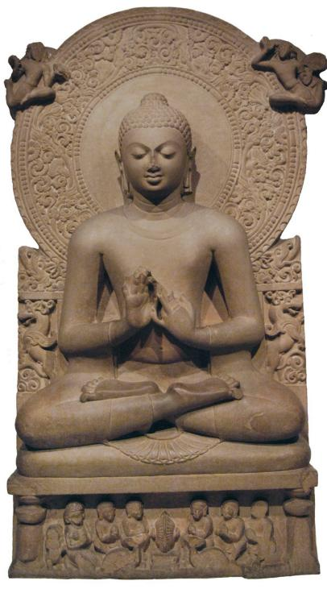
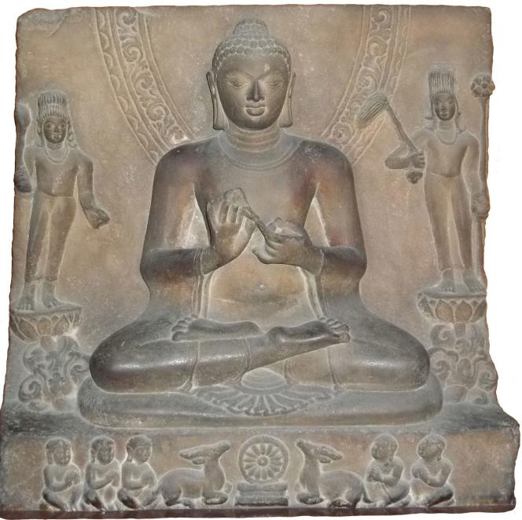

# The Chinese Parallels to the Dhammacakkappavattana-sutta (2)* 

Anālayo

JOCBS. 2013 (5): 9-41. © 2013 Anālayo

### Abstract

In what follows I continue translating and studying the canonical parallels to the Dhammacakkappavattana-sutta that have been preserved in Chinese translation.

## Introduction

With the present paper I continue studying the Chinese parallels to the discourse known as the Dhammacakkappavattana-sutta. In the previous paper dedicated to the same topic, [^1] I examined parallels found in the Samyukta-āgama (1), in the Mūlasarvāstivāda Vinaya (2), in the Madhyama-āgama (3), and in the Sarvāstivāda Vinaya (4). [^2] The remaining parallels to be covered in this paper are:

5\) Ekottarika-āgama - Two versions of the Discourse on Turning the Wheel of Dharma are found in the Ekottarika-āgama: The first of these two versions occurs as a discourse on its own among the Twos of the Ekottarika-āgama. [^3] The second Ekottarika-āgama version is part of a longer discourse that reports the events after the Buddha's awakening, found among the Threes of the same collection. [^4] While the Ekottarika-āgama collection is at present best reckoned as being of uncertain affiliation, an association with the Mahāsānghika tradition is the most often voiced hypothesis. [^5]

[^1]: I am indebted to Rod Bucknell, Sāmaṇerī Dhammadinnā, Shi Kongmu, and Monika Zinn for helpful suggestions and to Stephen Batchelor and Robert Sharf for commenting on the parts of the present paper in which I criticize them. Needless to say, I am solely responsible for whatever error still remains in my presentation.
[^1]: Anālayo 2012.
[^2]: In order to facilitate cross-reference to the previous paper, I continue with the numbering employed earlier and thus start off with the number 5 for the Ekottarika-āgama versions.
[^3]: EĀ 19.2 at T II 593 b24 to 593 c 10 .

6\) Mahīśāsaka Vinaya A version of the Discourse on Turning the Wheel of Dharma is found in the Mahīśāsaka Vinaya, preserved in Chinese translation, where it forms part of a biography of the Buddha. [^6]

7\) Dharmaguptaka Vinaya Like the Mahīśsaka Vinaya, the Dharmaguptaka Vinaya also has a version of the present discourse embedded in its biography of the Buddha, extant in Chinese. [^7]

I begin by translating the two discourses from the Ekottarika-āgama.

## 5) Translation of the first Ekottarika-āgama Discourse [^8] 

Thus have I heard. At one time the Buddha was at Vārānasī in the Deer Park, the [Dwelling of] Seers. Then the Blessed One said to the monks: [^9] "There are these two things that one training in the path ought not to become involved with. What are the two things? They are: the state of being attached to sensual pleasures and their enjoyment, which is lowly and the state of the commoner; and all these [self-inflicted] pains with their manifold vexations. These are reckoned the two things that one training in the path ought not to become involved with.

[^4]: EĀ 24.5 at T II 619 a8 to 619 b19; for a French translation of the relevant section of EĀ 24.5 cf. Bareau 1988: 81f.
[^5]: Cf. the survey of opinions on this topic held by Japanese scholars by Mayeda 1985: 102f and recent contributions by Pāsādika 2010 and Kuan 2012, Kuan 2013a, Kuan 2013b, and Kuan 2013c; for narrative affinities with the Sarvāstivāda tradition cf. Hiraoka 2013.
[^6]: T 1421 at T XXII 104b23 to 10522; translated into French by Bareau 1963: 174f.
[^7]: T 1428 at T XXII 788 a6 to 788 c 7 ; translated into French by Bareau 1963: 175-177.
[^8]: The translated discourse is EĀ 19.2 at T II 593b24 to 593 c 10.
[^9]: EĀ 19.2 gives no explicit indication that these are the five monks. The corresponding parts in the Vinaya versions translated below also do not explicitly mention the five monks, even though the context makes it clear that they form the audience of the discourse. This makes it probable that the same applies to EĀ 19.2, in that the lack of an explicit reference to the five monks may well be a sign that this discourse is an extract from a longer account. The tale of how the five left the bodhisattva when he gave up his ascetic practices is recorded in EĀ 31.8 at T II 671 c 5 , thus the reciters of the Ekottarika-āgama were aware of the situation that, according to the traditional account, formed the background to the Buddha's exposition on the two extremes.

"Having left behind these two things in this way, I have myself reached the all-important path that leads to the attainment of full awakening, to the arising of vision, [593c] to the arising of knowledge, [whereby] the mind attains appeasement, attains the penetrative knowledges, accomplishes the fruits of recluse-ship, and reaches Nirvāṇa.

"What is the all-important path that leads to attainment of full awakening, that arouses vision, arouses knowledge, [whereby] the mind attains appeasement, attains the penetrative knowledges, accomplishes the fruits of recluse-ship, and reaches Nirvāṇa? It is this noble eightfold path, namely right view, right thought, right speech, right action, right livelihood, right effort, right mindfulness, and right concentration - this is reckoned as the path that I reached.

"I have now attained right awakening, arousing vision, arousing knowledge, the mind attaining appeasement, attaining the penetrative knowledges, accomplishing the fruits of recluse-ship, and reaching Nirvāṇa. Monks, you should train in this way, abandon the above [mentioned] two things and cultivate this important path. Monks, you should train in this way."

Then the monks, who had heard what the Buddha had said, were delighted and received it respectfully.

## Translation of the second Ekottarika-àgama Discourse [^10] 

At that time the Blessed One said to the five monks: "You should know there are these four truths. What are the four? The truth of duhkha, the truth of the arising of duhkha, the truth of the cessation of duhkha, and the truth of the path leading out of duhkha.

"What is reckoned as the truth of duhkha? It is this: Birth is duhkha, old age is duhkha, disease is duhkha, death is duhkha, [as well as] grief, vexation, affliction, worry and pains that cannot be measured; association with what is disliked is duhkha, dissociation from what is loved is duhkha, not getting what one wishes is also duhkha; stated in brief, the five aggregates of clinging are duhkha - this is reckoned as the truth of duhkha.

"What is the truth of the arising of duhkha? It is grasping conjoined with craving that leads to acting carelessly with a mind that keeps being lustfully attached - this is reckoned as the truth of the arising of duhkha.

[^10]: The translated part is an extract from EĀ 24.5, found at T II 619 a8 to 619 b19.
"What is the truth of the cessation of duhkha? Being able to bring about that this craving is eradicated and ceases without remainder, so that it will not arise again - this is reckoned as the truth of the cessation of duhkha.

"What is reckoned as the truth of the path leading out of duhkha? It is the noble eightfold path, namely right view, right thought, right speech, right action, right livelihood, right effort, right mindfulness, and right concentration. This is reckoned as the teaching of the four truths.

"Again, five monks, with this teaching of the four truths, in regard to things not heard before, vision arose [in me] about the truth of duhkha, knowledge arose, understanding arose, awakening arose, clarity arose and wisdom arose. Again, the truth of duhkha is real, it is certain, it is not vain, it is not false, it is certainly not otherwise than as it has been declared by the Blessed One - therefore it is reckoned as the truth of duhkha.

"In regard to things not heard before, vision arose [in me] about the truth of the arising of duhkha, knowledge arose, understanding arose, awakening arose, clarity arose, and wisdom arose. Again, the truth of the arising of duhkha is real, it is certain, it is not vain, it is not false, it is certainly not otherwise than as it has been declared by the Blessed One - therefore it is reckoned as the truth of the arising of duhkha.

"In regard to things not heard before, vision arose [in me] about the truth of the cessation of duhkha, knowledge arose, understanding arose, awakening arose, wisdom arose, and clarity arose. Again, the truth of the cessation of duhkha is real, it is certain, it is not vain, it is not false, it is certainly not otherwise than as it has been declared by the Blessed One - therefore it is reckoned as the truth of the cessation of duhkha.

"In regard to things not heard before, vision arose [in me] about the truth of the path leading out of duhkha, knowledge arose, understanding arose, awakening arose, [619b] clarity arose, and wisdom arose. Again, the truth of the path leading out of duhkha is real, it is certain, it is not vain, it is not false, it is certainly not otherwise than as it has been declared by the Blessed One - therefore it is reckoned as the truth of the path leading out of duhkha.

"Five monks, you should know, those who do not understand as they really are these four truths in three turnings and twelve modes do not accomplish the supreme and right truth, perfect and right awakening. Because I discerned these four truths in three turnings and twelve modes, coming to understand them as
they really, therefore I accomplished the supreme and right truth, perfect and right awakening."

At the time when this teaching was being spoken, Ājñāta Kauṇ̣̣inya attained the pure eye of Dharma, eliminating all dust and stain. Then the Blessed One said to Kauṇ̣̣inya: "Have you now reached the Dharma, have you attained the Dharma?" Kauṇ̣̣inya replied: "So it is, Blessed One, I have attained the Dharma, I have reached the Dharma."

Then the earth spirits, having heard these words, made the proclamation: "Now at Vārānasī the Tathāgata has turned the wheel of Dharma that devas and men, Māras and Māra's [retinue] of devas, humans and non-humans are unable to turn. Today the Tathāgata has turned this wheel of Dharma. Ājñāta Kauṇ̣̣inya has attained the ambrosial Dharma."

Then the Four Heavenly Kings heard the proclamation made by the earth spirits and in turn proclaimed: "... Ājñāta Kauṇ̣̣inya has attained the ambrosial Dharma."

Then the devas of the Thirty-three heard it from the Four Heavenly Kings, the Yāma devas heard it from the devas of the Thirty-three ... up to ... the Tuṣita devas in turn heard the proclamation ... up to ... the Brahmā devas also heard the proclamation: "At Vārānasī the Tathāgata has turned the wheel of Dharma that has not been turned by devas and men, [^11] Māras and Māra's [retinue] of devas, humans and non-humans. Today the Tathāgata has turned this wheel of Dharma." Then [Kauṇ̣̄inya] came to be called Ājñāta Kauṇ̣̣inya.

### Study 

The first of the above two discourses from the Ekottarika-āgama reports only the rejection of the two extremes and thus is similar in this respect to the Madhyamaāgama parallel to the Ariyapariyesanā-sutta, [^12] translated and discussed in my previous article. These two discourses - the first of the two Ekottarika-āgama versions and the Madhyama-āgama parallel to the Ariyapariyesanā-sutta - have been interpreted by Bareau as evidence that some reciters were not aware of the four noble truths as the theme of the Buddha's first discourse, or even refused to consider it as such. [^13] Just as in the case of the Madhyama-āgama passage, so too in the present case his hypothesis is flawed by the methodological problem that Bareau did not consider all relevant versions: his discussion does not take into account the second Ekottarika-āgama discourse translated above. [^14] Given that this second version is part of the same discourse collection and does have an exposition of the four truths, it becomes obvious that the reciters of the Ekottarika-āgama were aware of the four truths as the theme of the Buddha's first discourse and did not refuse to consider it as such. Thus, like the cases discussed in my previous paper, the first Ekottarika-āgama discourse is probably best understood as an extract from a longer account of the events surrounding the delivery of the Buddha's first teaching. [^15]

[^11]: The present passage does not mention their inability to turn the wheel of Dharma.
[^12]: MĀ 204 at T I 777c25 to 778a2. EĀ 19.2 is located among the Twos of the Ekottarika-āgama collection, which is in keeping with the circumstance that the main topic of this discourse is the rejection of the two extremes.

Besides confirming that Bareau's hypothesis is in need of revision, [^16] the fact that the second Ekottarika-āgama version refers to the four truths is of further significance in that the truths are not described as "noble". This qualification is used in the Ekottarika-āgama discourse only for the eightfold path, not for any of the truths.

The absence of the qualification "noble" in relation to the four truths is a recurrent feature of discourses found elsewhere in the Ekottarika-āgama collection, and also of discourses in a partial Samyukta-āgama collection (T 100), as well as in a range of individually translated discourses preserved in Chinese. [^17] This makes it possible that at an early stage the qualification "noble" was not used invariably when the four truths were mentioned.

[^13]: According to Bareau 1963: 181, MĀ 204 and EĀ 19.2 "nous montrer qu’à une lointaine époque, une partie au moins de docteurs du Bouddhisme ignoraient quel avait été le thème du premier sermon ou refusaient de considérer comme tel les quatre saintes Vérités."
[^14]: Schmithausen 1981: 202 note 11 already pointed out that EĀ 24.5 has the portions of the first discourse that are not found in EĀ 19.2.
[^15]: This would in fact be in line with an observation made by Bareau 1963: 9 himself that such short discourses appear to be extracts from longer accounts, "les petits Sūtra contenus dans le Samyuktāgama, Samyuttanikāya, Ekottarāgama et Aṅguttaranikāya ... ces Sūtra courts apparaissent bien plutôt comme des extraits commodes tirés des textes plus longs." It seems to me that this observation provides a considerably more convincing explanation of the situation than his hypothesis that the four noble truth are a later addition.
[^16]: Zafiropulo 1993: 111 even goes so far as to consider it paradoxical to doubt the relationship of the noble truths to the Buddha's awakening: "Tassociation des Āryasatyāni à l'événement de la Saṃbodhi du Maître est tellement bien attestée, qu'il semblerait quasi paradoxal (au sens étymologique du mot) de vouloir essayer de la minimiser ou de la mettre en doute."
[^17]: For a more detailed survey with references cf. Anālayo 2006: 149 f notes 17 to 24.

In fact the full expression "noble truth" does appear to have been added in some contexts. This can be deduced from observations made by several scholars in regard to the Pāli version of the Dhammacakkappavattana-sutta. [^18] The Dhammacakkapavattana-sutta presents the second noble truth as something that needs to be abandoned: "this noble truth of the origin of duhkha should be abandoned". [^19] Yet, what needs to be abandoned is the origin of dukkha, not the noble truth itself. This statement would therefore be more meaningful without a reference to the "noble truth", i.e., it should read simply: "this origin of duhkha should be abandoned."

Norman (1984: 386f) suggests that in such contexts the expression ariyasacca was added later. He considers such an addition of the expression ariyasacca to have been inspired by occurrences of the expression ariyasacca in short statements found elsewhere. Examples he gives for such short statements is a reference to teaching "the four noble truths ... duhkha, its arising, the path, and its cessation"; [^20] or a succinct statement of the type "the four noble truths: the noble truth of duhkha, the noble truth of the arising of duhkha, the noble truth of the cessation of duhkha, and the noble truth of the path to the cessation of duhkha." [^21] The occurrence of the expression "noble truth" in such short statement would then have led to the same expression being used also in other passages, where it was not original found.

[^18]: SN 56.11 at SN V 421,25+29 employs the expressions dukkhasamudayam ariyasaccam and dukkhanirodham ariyasaccam (as does the Burmese edition). From a grammatical viewpoint this is puzzling, as one would rather expect the nominative singular masculine form dukkhasamudayo and dukkhanirodho (which is in fact the reading found in the Ceylonese and Siamese editions); cf. also the discussion in Weller 1940, Johansson 1973/1998: 24, Norman 1984, Anālayo 2006: 150f, and Harvey 2009: 218 f .
[^19]: SN 56.11 at SN V 422,12: tam kho pan' idam dukkhasamudayam (Ce and Se: dukkhasamudayo) ariyasaccam pahātabban ti. The logical problem with this formulation has been highlighted by Woodward 1979: 358 note 1 and Norman 1984.
[^20]: Th 492: cattāri ariyasaccāni ... dukkham samudayo maggo nirodho, on which Norman 1984: 390 note 8 comments that "the order of the last two items is reversed for metrical reasons"; on similar reversals in the order of referring to the third and fourth truth cf. Anālayo 2011b: 26f.
[^21]: DN 34 at DN III 277,8: cattāri ariyasaccāni: dukkham ariyasaccam, dukkhasamudayam ( Ce and Se : dukkhasamudayo) ariyasaccam, dukkhanirodham (Ce and Se: dukkhanirodho) ariyasaccam, dukkhanirodhagāminī patipadā ( Be, Ce, and Se: patipadā) ariyasaccam. Norman 1984: 379f mentions Th 492 and the passage from DN 34 as examples for what he refers to as the "mnemonic' set", on which Norman 1984: 387 then comments that "the word ariya-sacca ... its presence in the 'mnemonic' set doubtless led to its introduction there [i.e. in passages such as SN 56.11] by analogy."

Norman's reconstruction does not mean that the teaching on the four truths as such is a late addition; [^22] and it certainly does not imply that early Buddhism did not have a notion of truth as such. [^23] Norman's discussion means only that an early version of the first teaching given by the Buddha in the form of the four truths did not employ the expression ariyasacca to designate each of these four singly when explaining their implications.

Such additions of the expression ariyasacca, taken from one context and added to other passages, would be a natural occurrence for material that was orally transmitted over long periods. Oral tradition tends to stereotype, thereby facilitating memorization, with at times little sensitivity to the individual context. [^24] Thus it would not be surprising if the expression ariyasacca or the qualification "noble" was originally found in some contexts only, but during oral transmission came to be applied to other passages.

The influence of the tendency to stereotype is also relevant for the remainder of the Dhammacakkappavattana-sutta and its parallels. As Gombrich (2009: 103f) points out, "the 'first sermon' that has come down to us is chock full of metaphors and technical terms which the Buddha at that stage had not yet explained ... the disciples who made up the original audience could have had no idea what the Buddha was talking about when he used these terms." [^25]

Just as in the case of the four truths, this does not mean that the teachings expressed by these technical terms - for example, 'the five aggregates of clinging' - were not given at all and should be considered later additions in themselves. It means only that the texts we have in front of us are not verbatim records of what the Buddha said, but rather are the products of a prolonged oral transmission.

[^22]: After a detailed survey of Norman's discussion, Anderson 1999/2001: 20 comes to the unexpected conclusion that "Norman's evidence, however, demonstrates that the four noble truths were not part of the earliest form of the Dhammacakkappavattana-sutta."
[^23]: Pace Batchelor 2012: 92f, who reasons that "one implication of Norman's discovery is that the Buddha may not have been concerned with questions of 'truth' at all ... if Mr. Norman is correct, the Buddha may not have presented his ideas in terms of 'truth' at all."
[^24]: As von Hinüber 1996/1997: 31 explains, "pieces of texts known by heart may intrude into almost any context once there is a corresponding key word."
[^25]: Cf. also Rewata Dhamma 1997: 40.

## 6) Translation from the Mahīśāsaka Vinaya [^26] 

The Buddha further said [to the five monks]:27 "In the world there are two extremes that one should not become involved with. The first is lustful attachment to craving for sensual pleasures, proclaiming that there is no fault in sensual pleasures. The second is the wrong view of tormenting the body, which has not a trace of the [true] path.

"Abandon these two extremes and obtain the middle path that gives rise to vision, knowledge, understanding, and awakening, and that leads to Nirvāṇa! What is the middle path? It is the eight[fold] right [path]: right view, right thought, right speech, right action, right livelihood, right effort, right mindfulness, and right concentration. This is the middle path.

"Again, there are four noble truths: the noble truth of duhkha, the noble truth of the arising of duhkha, the noble truth of the cessation of duhkha, and the noble truth of the path to the cessation of duhkha.

"What is the noble truth of duhkha? [104c] It is this: birth is duhkha, old age is duhkha, disease is duhkha, death is duhkha, sadness and vexation are duhkha, association with what is disliked is duhkha, dissociation from what is loved is duhkha, loss of what one wishes for is duhkha, in short, the five aggregates of clinging are duhkha. This is the noble truth of duhkha.

"What is the noble truth of the arising of duhkha? It is craving for existence, [^28] which comes together with the arising of defilements, delighting with attachment in this and that. This is the noble truth of the arising of duhkha.

"What is the noble truth of the cessation of duhkha? It is the eradication of craving, its cessation and extinction without remainder, Nirvāṇa. This is the noble truth of the cessation of duhkha.

"What is the noble truth of the path to the cessation of duhkha? It is the eight[fold] right path. This is the noble truth of the path to the cessation of duhkha.

"Regarding this Dharma, which I had not heard before, vision arose, knowledge arose, understanding arose, awakening arose, insight arose, and wisdom arose. Regarding this Dharma, which I had not heard before and which should be understood, vision arose ... up to ... wisdom arose. Regarding this Dharma, which I had not heard before and which has been understood, vision arose ... up to ... wisdom arose.

[^26]: The translated part is taken from T 1421 at T XXII 104b23 to 105a2.
[^27]: The five monks are explicitly mentioned in the preceding phrase, T 1421 at T XXII 104b23: 五人.
[^28]: T 1421 at T XXII 104c3: 有愛. As already noted by Choong 2000: 166, Delhey 2009: 69 note 4, and Anālayo 2011a: 70 note 216, the three types of craving regularly listed in such contexts in the Pāli canon - craving for sensual pleasures, for existence and for annihilation - are only rarely mentioned in parallel versions.

"Regarding this noble truth of duhkha ... regarding this noble truth of duhkha which should be understood ... regarding this noble truth of duhkha which I had not heard before and which has been understood, vision arose ... up to ... wisdom arose.

"Regarding this noble truth of the arising of duhkha ... regarding this noble truth of the arising of duhkha which should be eradicated ... regarding this noble truth of the arising of duhkha which I had not heard before and which has been eradicated, vision arose ... up to ... wisdom arose.

"Regarding this noble truth of the cessation of duhkha ... regarding this noble truth of the cessation of duhkha which should be realized ... regarding this noble truth of the cessation of duhkha which I had not heard before and which has been realized, vision arose ... up to ... wisdom arose.

"Regarding this noble truth of the path to the cessation of duhkha ... regarding this noble truth of the path to the cessation of duhkha which should be developed ... regarding this noble truth of the path to the cessation of duhkha which I had not heard before and which has been developed, vision arose ... up to ... wisdom arose.

"[When] I had understood as it really is this wheel of Dharma in three turnings and twelve modes I had attained supreme and full awakening."

When this teaching was delivered, the earth quaked six times and Kaundinya attained among all teachings the pure eye of Dharma that is remote from stains and free from dust. The Buddha asked: "Kauṇdinya, have you understood? Kauṇḍinya, have you understood?" Kauṇ̣̣inya replied: "Blessed One, I have understood."

On hearing this, the spirits of the earth told the spirits in the sky, the spirits in the sky told the devas of the Four Heavenly Kings, the devas of the Four Heavenly Kings told the devas of the Thirty-three and so on in turn up to the Brahmā devas, saying: "Now at Vārānasī the Buddha has turned the supreme wheel of Dharma that had not been turned before, that recluses, brahmins, devas, Māra, Brahmā, and the whole world had not turned before." All the devas were delighted and sent down a rain of various kinds of flowers. [105a] Everywhere there was a brilliant
light as if stars had fallen to the ground and in mid air the [devas] performed divine music.

### Study 

A noteworthy feature of the Mahīśāsaka Vinaya version is its description of a rain of flowers, a brilliant light, and divine music. None of the other versions preserved in Chinese - translated in this article and the preceding one - report such miraculous events. However, a description that is to some degree comparable occurs in the Pāli version of the Dhammacakkappavattana-sutta. According to the Pāli account the turning of the wheel of Dharma resulted in earthquakes throughout the ten-thousand-fold world system and an immeasurably brilliant light appeared in the world and surpassed the majesty of the devas. [^29]

The absence of any reference to earthquakes or else to celestial flowers and divine music in the canonical parallel versions makes it fairly safe to conclude that these are probably later developments. [^30] The same does not seem to be the case, however, for the acclamations of the turning of the wheel of Dharma in various celestial realms, [^31] which are reported in all canonical versions. [^32] Elsewhere the discourses collected in the Pāli Nikāyas and Chinese Āgamas abound with references to various devas. These discourses report that the Buddha and his disciples repeatedly went to the heavens for shorter or longer visits to discuss various topics with devas, or that they were visited by devas who wanted to ask a question or make some statement. In view of such passages there seems to be little ground for assuming that the celestial acclamations of the turning of the wheel of Dharma must in principle be later than the remainder of the discourse. [^33]

[^29]: SN 56.11 at SN V 424,4: ayañ ca dasasahassī (Be: dasasahassī) lokadhātu sañkampi (Ee: saṃkampi) sampakampi sampavedhi, appamāṇo ca ulāro (Se: olāro) obhāso loke pātur ahosī atikkamma (Se: atikkammeva) devānaṃ devānubhāvan ti. Earthquakes are also mentioned in several biographies of the Buddha preserved in Chinese translation; cf. T 189 at T III 644c20, T 190 at T III 812b20, and T 196 at T IV 149a10, often together with other miraculous occurrences such as a great light, divine music, or a rain of flowers.
[^30]: According to Przyluski 1918: 424, Waldschmidt 1944: 107, Frauwallner 1956: 158, and Bareau 1979: 79, listings of three causes for earthquakes found in some discourses appear to be earlier than listings of eight causes for earthquakes. This conclusion would be supported by the finding that earthquakes are not reported in the Chinese canonical parallels to SN 56.11, except for the Mahīśāsaka Vinaya version, as only the listings of eight causes mention the turning of the wheel of Dharma as an occasion for the earth to quake. For a study of earthquakes in Buddhist literature cf. Ciurtin 2009 and Ciurtin 2012.
[^31]: Bareau 1963: 182 considers these descriptions to be late: "la mise en mouvement de la Roue de la Loi remue le monde des dieux de la terre à l'empyrée ... ceci confirme l'hypothèse émise plut haut et selon laquelle le texte du premier sermon serait postérieur au récit primitif de l'Éveil."
[^32]: Celestial acclamations are not mentioned in T 191 at T III 954b2, which reports only that eighty thousand devas attained stream-entry.

The picture that in this way emerges from a comparative study of the Chinese parallels to the Dhammacakkappavattana-sutta seems to me to exemplify a general pattern: It is undeniable that supernatural occurrences - encounters with celestial beings and psychic abilities - are an integral part of the teachings of early Buddhism in the way these have been preserved in the texts. It would not do justice to the material at our disposal if we were to consider only the doctrinal teachings as authentic aspects of early Buddhism and summarily dismiss the miraculous aspects as later accretions. On the other hand, however, this should not blind us to the fact that some miracles are the result of later developments. [^34] Just as the texts do not support a total dismissal of miraculous elements as invariably late, they equally clearly show that with the passage of time some of these elements become more prominent. Examples in the present case are the earthquakes and the rain of divine flowers, etc.

Besides the reference to earthquakes, another peculiarity of the Dhammacakkappavattana-sutta in relation to the celestial repercussions of the turning of the wheel of Dharma is that the devas proclaim that this wheel cannot be turned back by anyone in the world. [^35] Most of the Chinese parallel versions instead indicate that this wheel had not been turned by others or that others were unable to turn it. [^36] The idea that others might try to interfere with the turning of the wheel is found only in the Dhammacakkappavattana-sutta. This could be the result of an error in transmission, whereby an original reading "cannot be turned", appavatiyaṃ, became "cannot be turned back", appativattiyaṃ. [^37]

[^33]: In the context of a discussion of supernormal powers, Fiordalis 2010/2011: 403 comments that "scholars have been too quick to conclude ... that Buddhism rejects the miraculous wholesale in favor of some sort of rational humanism that reflects modern predilections."
[^34]: A passage that could be testifying to a gradual evolution of miracles can be found at the end of AN 8.30 at AN IV 235,21, which concludes with a set of stanzas indicating that the Buddha had come to visit his disciple Anuruddha, who was living at quite a distance, by way of his mind-made body, manomayena kāyena; cf. also Th 901. The description of his actual arrival at the beginning of the discourse employs the standard pericope that compares disappearing from one spot and reappearing elsewhere to someone who might flex or bend an arm, AN 8.30 at AN IV 229,8. The same pericope is also found in the parallel MĀ 74 at T I 541a1, which in its concluding stanzas indicates that the Buddha "with body upright his mind entered concentration and traversing space he immediately arrived", MĀ 74 at T I 542a20: 正身心入定, 乘虛怨來到, a description that reads slightly more like an actual celestial travel. The same impression becomes stronger in the case of another parallel. While this version does not have the concluding stanzas, it earlier describes the Buddha's arrival as involving actual flying, T 46 at T I 835c21: 飛. In yet another parallel, EĀ 42.6 at T II 754 a28, however, it is rather Anuruddha who approaches the Buddha, and he does so by conventional means. While this of course requires more research, it seems possible to me that some such descriptions of miracles developed gradually from a previous stage that only envisaged feats or journeys by way of the mind-made body.

## 7) Translation from the Dharmaguptaka Vinaya [^38] 

"[Five] Monks, [^39] one gone forth should not be involved with two extremes: delighting in and developing craving for sensual pleasures; or the practice of self-[inflicted] suffering, which is an ignoble teaching that afflicts body and mind, and which does not enable one to accomplish what is to be done.

"Monks, having left these two extremes behind, there is a middle path for vision and understanding, for knowledge and understanding, for perpetual quietude and appeasement, for accomplishing penetrative knowledge and attaining full awakening, for accomplishing [real] recluse-ship and proceeding [towards] Nirvāṇa.

"What is called the middle path for vision and understanding, for knowledge and understanding, for perpetual quietude and appeasement, for accomplishing penetrative knowledge and attaining full awakening, for accomplishing [real] recluse-ship and proceeding [towards] Nirvāṇa? It is this noble eight[fold] right path: right view, right thought, [^40] right speech, right action, right livelihood, right effort, right mindfulness, and right concentration. This is the middle path for vision and understanding, for knowledge and understanding, for perpetual quietude and appeasement, for accomplishing penetrative knowledge and attaining full awakening, for accomplishing [real] recluse-ship and proceeding [towards] Nirvāṇa.

[^35]: SN 56.11 at SN V 423,20: appativattiyaṃ (Be and Se: appaṭivattiyaṃ) samaṇena vā brāhmaṇena vā ... kenaci vā lokasmin ti.
[^36]: An exception is the Kṣudrakavastu version, which merely states that this turning of the wheel is of great benefit for others; cf. T 1451 at T XXIV 292c7 = T 110 at T II 504b14 and Anālayo 2012: 40.
[^37]: An original reading appavatiyaṃ would be in line with the reading apravartyaṃ found in the corresponding passage in the Sanghabhedavastu, Gnoli 1977: 136,24 and in the Mahāvastu, Senart 1897: 334,15 .
[^38]: The translated part is taken from T 1428 at T XXII 788 a 6 to 788 c 7 .
[^39]: While the present passage does not explicitly indicate that the five monks are meant, this is explicitly indicated a little earlier, T 1428 at T XXII 787 c28: 佛告五人言.
[^40]: The listing of the path factors in T 1428 at T XXII 788a12 has as its second member 正業 and as its fourth 正行. On the assumption that the listing corresponds to the standard sequence of the path factors, I take 業, which usually renders just karman, in the alternative sense of abhisaṃskāra, listed by Hirakawa 1997: 660 as one of the possible equivalents for 業. In a discourse in the Ekottarika- āgama (translated by Zhú Fóniàn, 笂佛念, who also translated T 1428), 五業 also stands in the place for right thought and 五行 in the place for right action; cf. EĀ 17.10 at T II 586b6.

"[There are] four noble truths: What are the [four] noble truths? They are the noble truth of duhkha, the noble truth of the arising of duhkha, the noble truth of the cessation of duhkha, and the noble truth of the path leading out of duhkha.

"What is the noble truth of duhkha? Birth is duhkha, old age is duhkha, disease is duhkha, death is duhkha, association with what is disliked is duhkha, [^41] dissociation from what is loved is duhkha, not to get what one wishes is duhkha, said in short, the five aggregates of clinging are duhkha. This is the noble truth of duhkha. Again, the noble truth of duhkha should be understood. I have already understood it. [For this], the eight[fold] right path should be cultivated: right view, right thought, right speech, right action, right livelihood, right effort, right mindfulness, and right concentration.

"What is the noble truth of the arising of duhkha? Craving, which is the condition for being born, together with sensual desire related to the experience of pleasure. [^42] This is the noble truth of the arising of duhkha. Again, this noble truth of the arising of duhkha should be eradicated. I have already realized its eradication. [For this], the eight[fold] right path should be cultivated: right view ... up to ... right concentration.

"What is called the noble truth of the cessation of duhkha? The perpetual cessation of this craving, its fading away, its eradication, its giving up, release from it, deliverance from it, its perpetual cessation, its appeasement, and detachment from it. [^43] This is the noble truth of the cessation of duhkha. Again, this noble truth of the cessation of duhkha should be realized. I have already realized it. [For this], the eight[fold] right path should be cultivated: right view ... up to ... right concentration.

"What is the noble truth of the path leading out of duhkha? It is this noble eight[fold] path: right view ... up to ... right concentration. This is the noble truth of the path leading out of duhkha. Again, this noble truth of the path leading out of duhkha should be cultivated. I have already cultivated this noble truth of the path leading out of duhkha.

[^41]: Adopting a correction suggested in the CBETA edition of 俏 to 俏.
[^42]: Adopting the variant 受 instead of 受.
[^43]: My translation follows the indication in Hirakawa 1997: 669 that 稞原 renders ālaya.

"[This is] the noble truth of duhkha, a teaching not heard before; knowledge arose, vision arose, awakening arose, understanding arose, [788b] insight arose, wisdom arose, and I attained realization. Again, this noble truth of duhkha should be understood, a teaching not heard before, knowledge arose ... up to ... wisdom arose. Again, I have already understood the noble truth of duhkha, a teaching not heard before, knowledge arose, vision arose, awakening arose, understanding arose, insight arose, and wisdom arose. This is the noble truth of duhkha.

"This is the noble truth of the arising of duhkha, a teaching not heard before, knowledge arose, vision arose, awakening arose, understanding arose, insight arose, and wisdom arose. Again, this noble truth of the arising duhkha should be eradicated, a teaching not heard before, knowledge arose ... up to ... wisdom arose. Again, I have already eradicated this noble truth of the arising of duhkha, a teaching not heard before, knowledge arose ... up to ... wisdom arose. This is the noble truth of the arising duhkha.

"This is the noble truth of the cessation of duhkha, a teaching not heard before; knowledge arose ... up to ... wisdom arose. Again, this noble truth of the cessation duhkha should be realized, a teaching not heard before, knowledge arose ... up to ... wisdom arose. Again, I have already realized this noble truth of the cessation of duhkha, a teaching not heard before, knowledge arose ... up to ... wisdom arose. [This is the noble truth of the cessation duhkha.]

"This is the noble truth of the path leading out of duhkha, a teaching not heard before; knowledge arose ... up to ... wisdom arose. Again, this noble truth of the path leading out of duhkha should be cultivated, a teaching not heard before, knowledge arose ... up to ... wisdom arose. Again, I have already cultivated this noble truth of the path leading out of duhkha, a teaching not heard before, knowledge arose ... up to ... wisdom arose. [This is the noble truth of the path leading out of duhkha.] These are the four noble truths.

"As long as I had not cultivated these four noble truths in three turnings and twelve modes, not understood them as they really are, I had not accomplished the supreme and complete awakening. When I had understood these four noble truths in three turnings and twelve modes as they really are, I had accomplished the supreme and complete awakening and I was without doubts and obstructions.

"When the Tathāgata proclaims these four noble truths and there is nobody among the assemblies who realizes them, then the Tathāgata has not turned the wheel of Dharma. When the Tathāgata proclaims these four noble truths and there is someone among the assemblies who realizes them, then the Tathāgata has turned the wheel of Dharma that recluses and Brahmins, Māra, the devas [of the retinue] of Māra, devas and men in the world are not able to turn.

"Therefore an effort should be made to cultivate the four noble truths: the noble truth of duhkha, the noble truth of the arising of duhkha, the noble truth of the cessation of duhkha, and the noble truth of the path that leads out of duhkha. You should train like this."

At the time when the Blessed One proclaimed this teaching to the five monks, Ājñāta Kauṇ̣̣inya attained the arising of the eye of Dharma, eliminating stains and dust. Then the Blessed One, knowing what Ājñāta Kauṇ̣̣inya had attained in his mind, said these words: "Ājñāta Kauṇ̣̣inya already knows, Ājñāta Kauṇ̣̣inya already knows." From then onwards he was called Ājñāta Kauṇ̣̣inya.

Then the spirits of the earth heard what the Tathāgata had said and proclaimed together: "Just now the Tathāgata, the arhat, the perfectly awakened one, being at Vārānasī, at the Seers' [Dwelling-place], in the Deer Park, has turned the supreme wheel of Dharma that had not been turned before, [788c] which recluses and Brahmins, Māra, the devas [of the retinue] of Māra, devas and men are not able to turn."

When the spirits of the earth made this proclamation, the Four Heavenly Kings heard it ... the devas of the Thirty-three ... the Yāma devas .... the Tuṣita devas ... the Nirmānarati devas ... the Paranirmitavaśavartin devas in turn made this proclamation: "Just now the Tathāgata, the arhat, the perfectly awakened one, being at Vārānasī, at the Seers' [Dwelling-place], in the Deer Park, has turned the supreme wheel of Dharma that had not been turned before, which recluses and Brahmins, Māra, the devas [of the retinue] of Māra, devas and men are not able to turn." At that time in an instant this proclamation was made in turn [by the various devas] and reached as far as the Brahmā devas.

### Study 

The Dharmaguptaka Vinaya version highlights that the setting in motion of the wheel of Dharma takes place once "the Tathāgata proclaims these four noble truths and there is someone among the assemblies who realizes them." This in fact reflects the main point of the discourse, whose purpose in all versions is to show how the Buddha communicated his own realization of Nirvāṇa in such a way to his five former companions that one of them was able to attain stream-entry. [^44]

Understood in this way, the motif of the wheel of Dharma expresses the conjunction of a core teaching of early Buddhism with its actual and successful practice. The importance accorded by tradition to this motif is widely reflected in its popularity in Buddhist art. [^45]

Figure 1: Turning the Wheel of Dharma (1) Sārnāth, courtesy John C. Huntington

[^44]: According to the Abhidharmakośabhāṣya, Pradhan 1967: 371,4 (6.54c), the wheel of Dharma refers to the path of vision, i.e., stream-entry; cf. also the Abhidharmakośavyākhyā, Wogihara 1971: 580,24 .
[^45]: For a survey cf., e.g., Schlingloff 2000: 62f; in fact even seals used by Mūlasarvāstivāda monastics to represent the community should according to the Vinaya prescriptions carry the wheel image; cf. Schopen 1996/2004: 232.

A well-known representation is the above Gupta period image from Sārnāth, which shows the seated Buddha with his hands in the gesture of setting in motion the wheel of Dharma. The ornamented halo surrounding the Buddha is flanked by a deva on each side, one of whom appears to be raising his right hand to his ear as if listening. If this is indeed the case, then this could be a pictorial reference to hearing the celestial proclamation that the Buddha has set in motion the wheel of Dharma.

The Buddha is flanked by two winged lions. While these probably have just an ornamental function as a support for the crossbars, given the present narrative context they bring up an association with the motif of the lion's roar. [^46] Below the seated Buddha in the centre is the wheel of Dharma, with an antelope on each side, reflecting the location of the first sermon at the Mṛgadāva. [^47] The wheel is surrounded by the first five disciples, who listen with respectfully raised hands.

What is remarkable about this image is that the five monks are seated together with a woman and a child or perhaps a dwarf. According to Huntington (1986: 40), "the female and the dwarf/child are probably donor figures present as patrons of the image." If the woman represented should indeed be the donor of the stele, [^48] then this would be yet another pointer to the important role of female donors in ancient Indian art. [^49]

Such a pictorial reference to a woman and a child or a dwarf is absent from another relief that depicts the same scene. Here we find the main elements of the first image: The seated Buddha with his hands in the gesture of setting in motion the wheel of Dharma, flanked by two celestial attendants, and below the Buddha the wheel of Dharma, with an antelope on each side and the five first disciples listening with respectfully raised hands.

[^46]: Pandey 1978: 29f notes other examples where representations of the first sermon depict lions. Winged lions are also found in a Sanskrit fragment of the Daśabala-sūtra, illustrating a description of the ten powers of a Tathāgata, cf. table I, located between pages 386 and 387 in Waldschmidt 1958. In the early discourses these ten powers are regularly reckoned as the basis for the Buddha's ability to roar a lion's roar and set in motion the brahmacakra; for references and a more detailed study of the motif of the lion's roar cf. Anālayo 2009.
[^47]: According to Schlingloff 2000: 63, the animals depicted in such representations are blackbuck antelopes (antilope cervicapra), krṣ̣nasāra.
[^48]: On the tendency for donors to be represented in Indian art in the 9th to 12th centuries cf. Bautze-Picron 1995: 63. For other instances where depictions of the human audience of the first sermon vary from the count of five cf. Pandey 1978: 43.
[^49]: Cf., e.g., Vogel 1929/1930: 13-15, Law 1940, Dutt 1962: 128-131, Willis 1985, Roy 1988, Schopen 1988/1997: 248-250, Dehejia 1992, Willis 1992, Singh 1996, Barnes 2000, Shah 2001, Skilling 2001, Osto 2008: 110-113, Kim 2012, Mokashi 2012, and Rao 2012: 133-160.

Figure 2: Turning the Wheel of Dharma (2) Calcutta, courtesy Ken and Visakha Kawasaki

The employing of a scheme of four truths when setting in motion the wheel of Dharma, depicted in these two reliefs, appears to be based on an analogy with Indian medical diagnosis. Although we do not have certain proof that ancient Indian medicine had such a scheme, [^50] this needs to be considered in light of the fact that extant āyurvedic treatises in general stem from a later period. Since the comparison of the four truths to medical diagnosis is explicitly made in several early Buddhist texts, [^51] it seems probable that some such diagnostic scheme was known and in use in daily life at the popular level. [^52]

[^50]: Cf. Har Dayal 1932/1970: 159, Filliozat 1934: 301, and Wezler 1984: 312-324. Already Oldenberg 1881/1961: 374 note 2 had expressed doubts if the fourfold scheme was a case of borrowing by the Buddhists.

The significance of employing such a diagnostic scheme needs to be considered within the narrative setting of the present discourse. Needless to say, with the sources at our disposition it is not possible to reconstruct what actually happened. This does not mean, however, that it is meaningless to study the narrative with an eye to its internal coherence.

According to the narrative setting of the Dhammacakkappavattana-sutta and its parallels, the recently awakened Buddha had set himself the task of conveying his realization of Nirvāṇa to his five former companions. These five would have seen asceticism as the path to deliverance and considered a deviation from ascetic practices as inevitably corresponding to sensual indulgence. In such a context, the teaching of a middle path that avoids these two extremes is a natural starting point. It may well be, as suggested by some versions, that the five needed some time to ponder over this, to them, new approach to liberation, [^53] where the appropriate attitude of right view (factor 1) informs one's intention (factor 2) conduct (factors 3 to 5 ) and meditative cultivation of the mind (factors 6 to 8 ), the whole thus becoming an eightfold path.

With the eightfold path disclosed, [^54] it would be natural for the Buddha to base his teaching on what would have been common ground among ancient Indian śramana traditions, namely the quest for a solution to the problem of duhkha. [^55] When attempting to explain his discovery to his audience, it would thus have been logical for the Buddha to first of all explain his understanding of the fact of duhkha (1st truth).

[^51]: For a more detailed discussion cf. Anālayo 2011 b.
[^52]: Zysk 1995: 149 comments that "there is little doubt that the system of Buddhist monastic medicine and Hindu āyurveda derived from a common source. Contrary to the view accepted by most orthodox Hindus, the origin of this shared system of healing is to be found among the ancient communities of heterodox wandering ascetics, or śramanas."
[^53]: Cf. Anālayo 2012: 35 f.
[^54]: The narrative setting makes it only natural that the middle path is taken up first and that this path is then later integrated in the full exposition of the four truths, pace Pande 1957: 227, who reasons that "the section on the Four Truths comes suddenly upon the preceding one, and in fact contains a second, more comprehensive, summary of the doctrine with the result that the eightfold path is needlessly repeated. This repetition shows that when §§ 4-5 were composed there was as yet no intention of speaking of the 'four truths', for, if that had been the case, the sermon would most probably have begun with them and let the path come in its proper place." Instead, as Dessein 2007: 21 points out, "as the eight constituent parts of the noble path can all be seen as characteristic for a 'middle mode of progress', while this is not the case for the three other truths, it is not unlikely that the fourth truth was the first to be proclaimed by the Buddha" (although Dessein then continues with the in my view unconvincing conclusion that the four truths as a set would be a later modification).

The first truth presents the five aggregates of clinging as a summary of the fact of duhkha, [^56] which would make it clear that a translation of this term as "suffering" fails to convey adequately the range of meaning of duhkha in this context. [^57] The five aggregates of clinging are unsatisfactory, but they are not always suffering. [^58] The fact that none of the five aggregates is capable of yielding lasting satisfaction can be understood through introspection, confirming that they are indeed duhkha in this sense. The translation "suffering", however, turns the quality of duhkha from something to be understood into something to be believed, since introspection properly carried out will reveal that the five aggregates are not always suffering.

[^55]: Cf., e.g., the Thānañga 1.45, Jambūvijaya 1985: 9,2, according to which Mahāvīra's attainment of liberation implied that he had eradicated all duhkha. As Hamilton 1997: 279 points out, "in the religious milieu in which he lived in north India in the fifth century BCE the Buddha was not alone in such a quest. What makes him different from most of his contemporaries is that in solving the problem [of duhkha], and in teaching others how to achieve the same solution, he did not extend his frame of reference beyond subjective experience."
[^56]: Those of the Chinese versions (translated in my two papers) that explain the first noble truth do consider the five aggregates of clinging as a summary of the preceding instances of duhkha (while the relevant passage in T 1450 at T XXIV 128b5 is abbreviated, cf. Anālayo 2012: 24, the corresponding passage in Gnoli 1977: 137,24 makes it clear that the same holds also for the Sanghabhedavastu). Thus, these versions do not support the hypothesis by Vetter 1998, based on some variant readings in Pāli texts that add *pi* after the reference to the five aggregates of clinging, that the five aggregates of clinging are just considered to be an alternative instance of duhkha; cf. also Anālayo 2011a: 805 note 239.
[^57]: Gunaratna 1968/1973: 5 f points out that "the popular rendering of dukkha as 'suffering' is not quite satisfactory since the word 'suffering' is likely to convey the idea of pain only ... the word dukkha must awaken in our minds not only thoughts of pain and distress, but also all those thoughts about the unsatisfactory and illusory nature of the things of this world ... [about] their failure to satisfy completely." Cf. also Anālayo 2003: 244f.
[^58]: SN 22.60 at SN III 69,16 and its parallel SĀ 81 at T II 21 a3 (translated with references to further parallels in Anālayo 2013) agree in indicating that each aggregate is not entirely painful, but also productive of happiness, which is why living beings become attached to them. Passages such as these make it plainly evident, I think, that duhkha as a term to characterize all conditioned experiences needs to be translated in a way that clearly marks a difference from its use in reference to what are painful feelings or experiences.

Much less are the five aggregates consistently "pain", [^59] which in my view is an even worse translation of duhkha. Such a rendering is easily confused with pain as one of the three feelings. The five aggregates of clinging are duhkha only in the sense of being "unsatisfactory", since even when they result in an experience of pleasure and joy, this will not be able to provide lasting satisfaction.

Besides building on the commonly accepted fact of duhkha, the Buddha was about to teach to the five something "not heard before", according to a recurrent reference in the various versions. This conveys that what he had discovered was substantially different from contemporary religious doctrines and philosophies. Therefore, when communicating his discovery, he had to find new ways of expression that differed from the philosophies and doctrines proposed by his contemporaries. At the same time, however, his teaching had to rely to some degree on concepts and ideas already known in order to be understood. In other words, in teaching the middle way he himself had to follow a midway in his use of concepts and expressions.

In such a situation the employment of a scheme presumably known to his audience as a form of medical diagnosis has its proper place. Independently of whether or not one accepts the traditional report that this teaching originated with the Buddha, the employment of such a scheme reflects a thoroughly pragmatic approach: it points directly to a psychological attitude towards duhkha and its solution. The use of a medical diagnosis scheme thus provides the appropriate frame for the essential teaching that the cause for the arising of duhkha is to be found within one's own mind, that one's own craving is responsible for duhkha (2nd truth). [^60] Not only the cause, but also the solution, the cessation of duhkha, can be found within one's own mind (3rd truth). The final goal is thus not something that takes place only after death, but instead something that can be realized here and now. Such realization here and now then requires the middle path approach delineated in the eightfold path (4th truth). Expressed in medical terms, the core teaching could be represented in this way:

[^59]: The translation "pain" was used by Rhys Davids 1880/2000: 52 in his rendering of the Dhammacakkappavattana-sutta, alternating with the translation "suffering". For recent arguments in favour of the translation "pain" cf. Harvey 2009: 213-216.
[^60]: According to Batchelor 2012: 95, however, the implication of the second noble truth described in the first discourse is that "craving is what arises from dukkha, rather than the other way round." His suggestion is based on identifying the five aggregates mentioned in the first noble truth with links like consciousness and name-and-form, etc., that in the standard presentation of dependent arising, pratītya samutpāda, lead to the arising of craving. His line of reasoning is based on considering only interim links in the standard formulation of pratītya samutpāda, without taking into account the beginning and end points. According to the beginning point, the root cause for craving is ignorance. In the case of an arahant, then, consciousness and name-and-form, etc., are still duhkha, yet this does not lead to the arising of craving, precisely because of the absence of ignorance. According to the end point, craving leads via birth, old age, and disease (mentioned explicitly as instances of duhkha in the first noble truth) to "the arising of this whole mass of duhkha". There can thus be little doubt that the standard presentation of pratītya samutpāda intends to show that ignorance leads via craving to duhkha, not that duhkha leads to craving. In support of his hypothesis, Batchelor 2012: 96 mentions Sn 862 to 874 as what he considers to be an "earlier version" of pratītya samutpāda. Yet, Sn 862 to 874 do not explicitly mention either craving or duhkha as a general characteristic of existence (Sn 873 does use the term, but this reference is to a type of feeling mentioned alongside sukha, not to the general characteristic). Thus this discourse is of no direct relevance to the question of the relationship between craving and duhkha. A discourse that is of direct relevance to this question is SN 12.23 at SN II 31,34 (for a study and translation cf. Bodhi 1980), where pratītya samutpāda is taken beyond the arising of duhkha in order to show what arises from duhkha. Instead of presenting duhkha as leading to the arising of craving, however, according to this discourse duhkha is the proximate cause for "faith" or "confidence", śraddhā, which eventually leads to liberation; a presentation similarly found in its parallels MĀ 55 at T I 491a7: 習音便有信 and D 4094 ju 50a6 or Q 5595 tu 54b4: sdug bsngal gyi rgyu can gyi dad pa; cf. also the Abhidharmakośabhāṣya, Pradhan 1967: 39,2: duhkhopaniṣac chraddhā. Thus the conclusion by Batchelor 2012: 100 that "the problem with craving is not that it causes suffering (although obviously sometimes it does) but that it prevents one from entering the eightfold path" (which then leads him to the idea that "the ceasing of craving gives rise to the eightfold path", p. 101) is contrary to the position taken in the early Buddhist canonical discourses.

| | |
| :-- | :-- |
| disease: | duhkha |
| pathogen: | craving |
| health: | Nirvāna |
| cure: | eightfold path |

The suggestion that the scheme of the four truths was inspired by popular medical diagnosis certainly does not diminish the value of the actual insight into them. [^61] What is actually realized is the attainment of Nirvāna, the cessation of duhkha, and it is only in order to express this realization in a form comprehensible to others that the scheme of the four truths has its place. With the attainment of Nirvāṇa duhkha is fully understood (as one knows what is beyond duhkha), craving is eradicated, the cessation of duhkha is realized, and the cultivation of the eightfold path reaches its consummation. [^62]

[^61]: Halbfass 1991/1992: 245 reasons that "if the 'four noble truths' had, indeed, been borrowed from an earlier medical scheme, the intense sense of discovery, of a new and overwhelming insight, which the early Buddhists and apparently the Buddha himself attached to the 'four truths', would be hard to understand."

In this way, the four noble truths as what according to tradition marks the beginning of the Buddha's teaching activities have the realization of Nirvāna as their foundation. Independent of whether one considers texts like the Dhammacakkappavattana-sutta and its parallels to be descriptive or prescriptive, a meditative 'experience' - the realization of the cessation of duhkha through the attainment of Nirvāṇa - clearly assumes a central role for the foundational teachings in early Buddhist thought. [^63]

[^62]: Schmithausen 1981: 218 sees a contrast between "Liberating Insight as a comprehension of the four Noble Truths ... [and] a fundamentally different view according to which Liberating Insight is considered to be ... an anticipatory experience, or a comprehension based on such an experience, of Nirvāṇa". In reply, Stuart 2013: 25 convincingly argues that "the cessation model and the realization-of-the-truths model ... may very well have originally been positive and negative sides of the same coin." (His argument concerns in particular the cessation of perception and feeling, but the same would hold also for the cessation of duhkha experienced with the attainment of Nirvāṇa in general). Stuart 2013: 44 adds that in spite of the apparent difference between a "state of cessation and a ... realization of the Four Noble Truths, the practice said to lead to these states may very well have originally been singular."
[^63]: Cf., e.g, Gómez 1987: 355, who explains that the Buddha's awakening "represents the human experience around which the religion would develop its practices and ideals. This was the experience whereby Śākyamuni became an 'Awakened One' (buddha). His disciples came to believe that all aspects of Buddhist doctrine and practice flow from this experience of awakening (bodhi)." Yet, according to Sharf 1995: 246 and 259 "the Buddhist emphasis on 'inner experience' is in large part a product of modern and often lay-oriented reform movements", being "a product of twentiethcentury reforms inspired in part by Occidental models." Here he uses the term 'experience' in a Western philosophical sense as something that entails phenomenal properties. Now the observation by Sharf 2000: 271 that this notion of "religious experience is a relatively late and distinctly Western invention" does not mean that religious experiences were not a central feature of early Buddhism before Western scholars began to describe them. In fact, it seems to me that an appreciation of the role of 'experience' in early Buddhist thought needs to approach the matter from the viewpoint of the concepts and ideas that are used within the Buddhist tradition, instead of imposing modern Western concepts. Here a central term would be āyatana, which stands for experience through any of the six senses (the five bodily senses and the mind considered as a sixth sense), for the meditative experience of the immaterial spheres during deep concentration, and for the experience of Nirvāṇa. As regards the last, SN 35.117 at SN IV 98,3 speaks of a "sphere of experience that should be known", äyatane veditabbe, namely - and I wonder if this can be appreciated based on Western concepts of 'experience' - precisely the cessation of the six senses and their corresponding perceptions. According to the commentary Spk II 391,3, this description refers to Nirvāṇa. The parallel SĀ 211 at T II 53b12 similarly reads 入處當覺知, where 入處 corresponds to āyatana, and當覺知 to "should be realized". Ud 8.1 at Ud 80,9, in a discourse explicitly introduced as being related to the topic of Nirvāna, emphatically asserts that "there is that sphere of experience", atthi ... tad āyatanam. This is then followed by describing that therein the four elements representative of ordinary experience as well as the notions informing the immaterial spheres are absent; cf. also Uv 26.24f, Bernhard 1965: 329, and T 213 at T IV 791a9. Therefore I would contend that modern day 'vipassanä' traditions, with all their idiosyncrasies, can nevertheless be seen to stand in a continuum with early Buddhist thought in their quest for Nirvāna as a "sphere of experience that should be known". In relation to a different topic, Bretfeld 2012: 275 makes the pertinent observation that "we have to be cautious that the rhetoric of 'construction' and 'invention' does not draw our attention only to the historical breaks or make us lose the sight of the continuities as well as the amount of Asian agency and traditional resources involved in these processes." For a critical reply to Sharf from the viewpoint of the Tibetan tradition cf. Gyatso 1999.

In order to convey that this realization takes place as the culmination of a path of practice, the threefold turning has its place. Here the parallel versions employ different ways of presenting these three turnings: they either apply the three turnings to one truth after the other, or else they relate each turning to all four truths. Presented schematically, the basic grid looks as follows (through which some versions work row by row, while others go through it column by column): [^64]

| duhkha | arising of duhkha | cessation of duhkha | path |
| :-- | :-- | :-- | :-- |
| should be understood | should be eradicated | should be realized | should be cultivated |
| has been understood | has been eradicated | has been realized | has been cultivated |

The Sarvāstivāda and Mūlasarvāstivāda versions list all four truths and only then take up the three turnings. The Dharmaguptaka, Mahišāsaa and Theravāda versions present the first truth in terms of the three turnings and then turn to the next truth, etc. The second Ekottarika-āgama discourse, however, just refers to the three turnings and the resulting twelve modes, without working through them in detail, so that it falls into neither of the two groups. Perhaps the second Ekottarika-āgama discourse here preserves an earlier presentation, when the three turnings and twelve modes were just mentioned, without being worked out in full, [^65] similar in type to the brief reference to the five aggregates or the bare listing of the factors of the eightfold path in the previous part of the discourse. This would not imply that the idea of three turnings as such is late, but only that a full exposition of this idea may not have been part of the discourse from the outset. [^66]

[^64]: I am indebted to Rod Bucknell (email 27 April 2012) for drawing my attention to this pattern.
[^65]: Feer 1870: 431 comments that "tous le textes sont d'accord pour nous représenter l'évolution duodécimale comme partie intégrante, comme partie essentielle de la première prédication du Buddha", yet "je ne puis voir là une des formes primitives de l'enseignement." Schmithausen 1981: 203 suggests that "it is not likely that this rather sophisticated and schematic account of the Enlightenment of the Buddha is the original one."

Even though the full exposition given in most versions might be late, the fact that it is a formalized mode of presentation in itself is not necessarily a sign of lateness. Ong (1982/1996: 34f) explains that in an "oral culture, to solve effectively the problem of retaining and retrieving carefully articulated thought, you have to do your thinking in mnemonic patterns, shaped for ready oral recurrence ... in an oral culture, to think through something in non-formulaic, non-patterned, non-mnemonic terms ... would be a waste of time, for such thought, once worked through, could never be recovered with any effectiveness." Thus formulaic presentations of the above type need not invariably be a sign of lateness, but could be a reflection of the oral setting in which these presentations came into existence. [^67]

The reference to the three turnings makes it clear that the scheme of four truths serves as a shorthand for what is, in actual practice, a more or less prolonged development. This begins with the recognition that something needs to be done about these four truths: The fact of duhkha needs to be fully understood, craving needs to be eradicated, the cessation of duhkha needs to be realized, and the eightfold path needs to be cultivated. This development continues until it eventually finds its culmination when duhkha has indeed been fully understood, craving has indeed been eradicated, the cessation of duhkha has indeed been realized, and the eightfold path has been successfully cultivated to its consummation point. Having completed this trajectory himself, and having enabled others to follow the same trajectory, the Buddha had, according to the traditional account, set in motion the wheel of Dharma.

[^66]: Such a full exposition would be a natural occurrence in orally transmitted texts and need not be motivated by any particular agenda, pace Bronkhorst 1993/2000: 106, who comments that it is "likely that these ... are later additions to the text", which he then considers to be "evidence that the Buddhist themselves did not feel comfortable about recognizing the Four Noble Truths as liberating insight" and therefore (if I understand him correctly) felt a need to elaborate on them.
[^67]: Bareau 1963: 180, however, holds that "Texamen des Vérités selon les trois cycles et les douze aspects, par sa sécheresse et sa logique, sent déjà nettement l'Abhidharma."

## Abbreviations 

| | |
| :-: | --- |
| Be | Burmese edition |
| Ce | Ceylonese edition |
| D | Derge edition |
| DN | Dîgha-nikāya |
| Ee | PTS edition |
| EĀ | Ekottarika-āgama (T 125) |
| MĀ | Madhyama-āgama (T 26) |
| Q | Peking edition |
| Se | Siamese edition |
| SĀ | Saṃyukta-āgama (T 99) |
| SN | Saṃyutta-nikāya |
| Sn | Sutta-nipāta |
| Spk | Sāratthappakāsinī |
| T | Taishō edition (CBETA) |
| Th | Theragāthā |
| Ud | Udāna |
| Uv | Udānavarga |

## References

* Anālayo 2003. Satipaṭthāna, the Direct Path to Realization. Birmingham: Windhorse.
* -_ 2006. "The Ekottarika-āgama Parallel to the Saccavibhanga-sutta and the Four (Noble) Truths". Buddhist Studies Review, 23.2: 145-153.
* -_ 2009. "The Lion's Roar in Early Buddhism - A Study based on the Ekottarikaāgama Parallel to the Cūḷasīhanāda-sutta". Chung-Hwa Buddhist Journal, 22: 3-23.
* -_ 2011a. A Comparative Study of the Majjhima-nikāya. Taipei: Dharma Drum Publishing Corporation.
* -_ 2011b. "Right View and the Scheme of the Four Truths in Early Budhism, The Saṃyukta-āgama Parallel to the Sammādiṭthi-sutta and the Simile of the Four Skills of a Physician". Canadian Journal of Buddhist Studies, 7: 11-44.
* -_ 2012. "The Chinese Parallels to the Dhammacakkappavattana-sutta (1)". Journal of the Oxford Centre of Buddhist Studies, 3: 12-46.
* - 2013. "On the Five Aggregates (3) - A Translation of Saṃyukta-āgama Discourses 59 to 87". Dharma Drum Journal of Buddhist Studies, 13 (forthcoming).
* Anderson, Carol S. 1999/2001. Pain and its Ending, The Four Noble Truths in the Theravāda Buddhist Canon. Delhi: Motilal Banarsidass.
* Bareau, André 1963. Recherches sur la biographie du Buddha dans les Sūtrapiṭaka et les Vinayapitaka anciens: De la quête de léveil à la conversion de Śāriputra et de Maudgalyāyana. Paris: École Française d'Extrême Orient, vol. 1.
* -1979: "La composition et les étapes de la formation progressive du Mahāpari-nirvānasūtra ancien". Bulletin de l'École Française d'Extrême Orient, 66: 45103.
* -1 1988. "Les débuts de la prédication du Buddha selon l'Ekottara-Āgama". Bulletin de l'École Française d'Extrême Orient, 77: 69-96.
* Barnes, Nancy J. 2000. "The Nuns at the Stūpa: Inscriptional Evidence for the Lives and Activities of Early Buddhist Nuns in India". In E.B. Findly (ed.), Women's Buddhism, Buddhism's Women: Tradition, Revision, Renewal, 17-36, Boston: Wisdom.
* Batchelor, Stephen 2012. "A Secular Buddhism". Journal of Global Buddhism, 13: 87107.
* Bautze-Picron, Claudine 1995. "Between Men and Gods, Small Motifs in the Buddhist Art of Eastern India, an Interpretation". In K.R. van Kooij and H. van der Veere (ed.), Function and Meaning in Buddhist Art, Proceedings of a Seminar held at Leiden University, 21-24 October 1991, 59-79, Groningen: Egbert Forsten.
* Bernhard, Franz 1965. Udānavarga. Göttingen: Vandenhoeck \& Ruprecht, vol. 1.
* Bodhi, Bhikkhu 1980: Transcendental Dependent Arising, A Translation and Exposition of the Upanisa Sutta, Kandy: Buddhist Publication Society.
* Bretfeld, Sven 2012. "Resonant Paradigms in the Study of Religions and the Emergence of Theravāda Buddhism". Religion, 42.2: 273-297.
* Bronkhorst, Johannes 1993/2000. The Two Traditions of Meditation in Ancient India. Delhi: Motilal Banarsidass.
* Choong, Mun-keat 2000. The Fundamental Teachings of Early Buddhism, A Comparative Study Based on the Sūtrānga Portion of the Pāli Samyutta-Nikāya and the Chinese Samyuktāgama. Wiesbaden: Otto Harrassowitz.
* Ciurtin, Eugen 2009. "The Buddha's Earthquakes [I]. On Water: Earthquakes and Seaquakes in Buddhist Cosmology and Meditation, With an Appendix on Buddhist Art". Stndia Asiatica, 10.1/2: 59-123.
* -_ 2012. "'Thus Have I Quaked': The Tempo of the Buddha's Vita and the Earliest Buddhist Fabric of Timelessness [The Buddha's Earthquakes II]". In D. Boschung
* and C. Wessels-Mevissen (ed.), Figurations of Time in Asia, 21-54. München: Wilhelm Fink Verlag.
* Dehejia, Vidya 1992. "The Collective and Popular Basis of Early Buddhist Patronage: Sacred Monuments, 100 BC-AD 250". In B. Stoler Miller (ed.), The Powers of Art: Patronage in Indian Culture, 35-45. Oxford: Oxford University Press.
* Delhey, Martin 2009. "Vakkali: A New Interpretation of His Suicide". Journal of the International College for Postgraduate Buddhist Studies, 13: 67-107.
* Dessein, Bart 2007. "The First Turning of the Wheel of the Doctrine: Sarvāstivāda and Mahāsāmghika Controversy". In A. Heirman et al. (ed.), The Spread of Buddhism, 15-48. Leiden: Brill.
* Dutt, Sukumar 1962. Buddhist Monks and Monasteries of India, Their History and Their Contribution to Indian Culture. London: George Allen and Unwin.
* Feer, Léon 1870: "Études bouddhiques. Les quatres vérités et la prédication de Bénarès". Journal Asiatique, 6 (15): 345-472.
* Filliozat, Jean 1934. "La médecine indienne et l'expansion bouddhique en ExtrêmeOrient". Journal Asiatique, 224: 301-307.
* Fiordalis, David V. 2010/2011. "Miracles in Indian Buddhist Narratives and Doctrine". Journal of the International Association of Buddhist Studies, 33.1/2: 381408.
* Frauwallner, Erich 1956. The Earliest Vinaya and the Beginnings of Buddhist Literature. Roma: Istituto Italiano per il Medio ed Estremo Oriente.
* Gnoli, Raniero 1977. The Gilgit Manuscript of the Sanghabhedavastu, Being the 17th and Last Section of the Vinaya of the Mūlasarvāstivādin. Rome: Istituto Italiano per il Medio ed Estremo Oriente, vol. 1.
* Gombrich, Richard F. 2009. What the Buddha Thought. London: Equinox.
* Gómez, Luis O. 1987. "Buddhism in India". In M. Eliade (ed.), The Encyclopedia of Religion, 2: 351-385. New York: Macmillan Publishing Company.
* Gunaratna, V.F. 1968/1973. The Significance of the Four Noble Truths. Kandy: Buddhist Publication Society (online PDF version).
* Gyatso, Janet 1999. "Healing Burns with Fire: The Facilitations of Experience in Tibetan Buddhism". Journal of the American Academy of Religion, 67.1: 113147 .
* Halbfass, Wilhelm 1991/1992. Tradition and Reflection: Explorations in Indian Thought. Delhi: Sri Satguru.
* Hamilton, Sue 1997. "The Dependent Nature of the Phenomenal World". In K.L. Dhammajoti et al. (ed.), Recent Researches in Buddhist Studies, Essays in Honour of Professor Y. Karunadasa, 276-295, Colombo: Y. Karunadasa Felicitation Committee.
* Har Dayal 1932/1970. The Bodhisattva Doctrine in Buddhist Sanskrit Literature. Delhi: Motilal Banarsidass.
* Harvey, Peter 2009. "The Four Ariya-saccas as 'True Realities for the Spiritually Ennobled'- the Painful, its Origin, its Cessation, and the Way Going to This Rather than 'Noble Truths' Concerning These". Buddhist Studies Review, 26.2: 197 -227.
* Hinüber, Oskar von 1996/1997. A Handbook of Pāli Literature. Delhi: Munshiram Manoharlal.
* Hirakawa, Akira 1997: Buddhist Chinese-Sanskrit Dictionary. Tokyo: Reiyukai.
* Hiraoka, Satoshi 2013. "The School Affiliation of the Ekottarika-āgama". In Dhammadinnā (ed.), Research on the Ekottarika-āgama (Taishō 125), 71-105, Taipei: Dharma Drum Publishing Corporation.
* Huntington, John 1986. "Sowing the Seeds of the Lotus, A Journey to the Great Pilgrimage Sites of Buddhism, Part II, The Rṣ̣ipatana Mṛgadāva ('Deer Park') near Vārāṇasī". Orientations, 17: 28-43.
* Jambūvijaya, Muni 1985. Thānaṃgasuttaṃ and Samavāyāṃgasuttaṃ. Bombay: Shrī Mahāvīra Jaina Vidyālaya.
* Johansson, Rune E.A. 1973/1998. Pali Buddhist Texts, Explained to the Beginner. Richmond: Curzon.
* Kim, Jinah 2012. "Unheard Voices: Women's Role in Medieval Buddhist Artistic Production and Religious Practices in South Asia". Journal of the American Academy of Religion, 80.1: 200-232.
* Kuan, Tse-fu 2012. "A Geographical Perspective on Sectarian Affiliations of the Ekottarika Āgama in Chinese Translation (T 125)". Journal of the Oxford Centre for Buddhist Studies, 2: 179-208.
* -_ 2013a. "Legends and Transcendence: Sectarian Affiliations of the Ekottarika Āgama in Chinese Translation". Journal of the American Oriental Society, (forthcoming).
* -_ 2013b. "Mahāyāna Elements and Mahāsāṃghika Traces in the Ekottarikaāgama (Zengyi ahanjing 增壹阿含經, T 125)". In Dhammadinnā (ed.), Research on the Ekottarika-āgama (Taishō 125), 133-194, Taipei: Dharma Drum Publishing Corporation.
* -_ 2013c. "The Pavāraṇā Sutta and 'Liberation in Both Ways' as against 'Liberation by Wisdom'". Bulletin of the School of Oriental and African Studies, 1-25.
* Law, Bimala Churn 1940. "Bhikshunis in Indian Inscriptions". Epigraphia Indica, 25: 31-34.
* Mayeda [=Maeda], Egaku 1985. "Japanese Studies on the Schools of the Chinese Āgamas". In H. Bechert (ed.), Zur Schulzugehörigkeit von Werken der HīnayānaLiteratur, Erster Teil, 94-103. Göttingen: Vandenhoeck \& Ruprecht.
* Mokashi, Rupali 2012. "Unveiling Bhikkhunīs in Oblivion: What Deccan Cave Inscriptions Reveal about the Ancient Bhikkhunī Sangha". Present, The Voices and Activities of Theravada Buddhist Women, 5.1: 15-26.
* Norman, K.R. 1984. "The Four Noble Truths: A Problem of Pāli Syntax". In L.A. Hercus (ed.), Indological and Buddhist Studies, Volume in Honour of Professor J. W. de Jong on his 6oth birthday, 377-391, Delhi: Sri Satguru.
* Oldenberg, Hermann 1881/1961. Buddha, Sein Leben, Seine Lehre, Seine Gemeinde. München: Wilhelm Goldmann Verlag.
* Ong, Walter J. 1982/1996. Orality \& Literacy, The Technologizing of the Word. London: Routledge.
* Osto, Douglas 2008. Power, Wealth and Women in Indian Mahāyāna Buddhism; The Gaṇdavyūha-sūtra. London: Routledge.
* Pande, Govind Chandra 1957. Studies in the Origins of Buddhism. University of Allahabad, Department of Ancient History.
* Pandey, Deena Bandhu 1978. The Dharmachakrapravartana in Literature and Art. New Delhi: Oriental Publishers \& Distributors.
* Pāsādika, Bhikkhu 2010. "Gleanings from the Chinese Ekottarāgama Regarding School Affiliation and Other Topics". In K. Meisig (ed.), Translating Buddhist Chinese, Problems and Prospects, 87-96. Wiesbaden: Harrassowitz.
* Pradhan, P. 1967. Abhidharmakośabhāsya of Vasubandhu. Patna: K.P. Jayaswal Research Institute.
* Przyluski, Jean 1918: "Le Parinirvāna et le funérailles du Buddha, II. Le dernier voyage du Buddha", Journal Asiatique, 11.12: 401-456.
* Rewata Dhamma 1997. The First Discourse of the Buddha, Turning the Wheel of Dhamma. Boston: Wisdom.
* Rhys Davids, T. W. 1880/2000. Early Buddhism. Delhi: Bharatiya Publishing House.
* Rao, Vinay Kumar 2012. Women in Buddhist Art. Delhi: Agam Kala Prakashan.
* Roy, Kumkum 1988. "Women and Men Donors at Sanchi: A Study of the Inscriptional Evidence". In L.K. Tripathi (ed.), Position and Status of Women in Ancient India, 1: 209-223. Varanasi: Banaras Hindu University, Department of Ancient Indian History, Culture and Archaeology.
* Schlingloff, Dieter 2000. Ajanta Handbook of the Paintings, Narrative Wall-paintings, Vol. I Interpretation. Wiesbaden: Harrassowitz.
* Schmithausen, Lambert 1981. "On some Aspects of Descriptions or Theories of 'Liberating Insight' and 'Enlightenment' in Early Buddhism". In K. Bruh and A. Wezler (ed.), Studien zum Jainismus und Buddhismus, Gedenkschrift für Ludwig Alsdorf, 199-250. Wiesbaden: Franz Steiner.
* Schopen, Gregory 1988/1997. "On Monks, Nuns and 'Vulgar' Practices: The Introduction of the Image Cult into Indian Buddhism". In G. Schopen (ed.), Bones, Stones and Buddhist Monks, Collected Papers on the Archaeology, Epigraphy, and Texts of Monastic Buddhism in India, 238-257, Honolulu: University of Hawai'i Press.
* 1996/2004: "The Lay Ownership of Monasteries and the Role of the Monk in Mūlasarvāstivāda Monasticism". In G. Schopen (ed.), Buddhist Monks and Business Matters, Still More Papers on Monastic Buddhism in India, 219-259. Honolulu: University of Hawai'i Press.
* Senart, Émile 1897. Le Mahāvastu, Texte sanscrit publié pour la première fois et accompagné d'introductions et d'un commentaire. Paris: Imprimerie Nationale, vol. 3 .
* Shah, Kirit K. 2001. The Problem of Identity: Women in Early Indian Inscriptions. New Delhi: Oxford University Press.
* Sharf, Robert H. 1995. "Buddhist Modernism and the Rhetoric of Meditative Experience". Numen, 42: 228-283.
* -_ 2000. "The Rhetoric of Experience and the Study of Religion". Journal of Consciousness Studies, 7.11/12: 267-287.
* Singh, Upinder 1996: "Sanchi: The History of the Patronage of an Ancient Buddhist Establishment". Indian Economic Social History Review, 33.1: 1-35.
* Skilling, Peter 2001. "Nuns, Laywomen, Donors, Goddesses: Female Roles in Early Indian Buddhism". Journal of the International Association of Buddhist Studies, 24.2: 241-274.
* Stuart, Daniel M. 2013: Thinking About Cessation: The Prṣthapālasūtra of the Dīrghāgama in Context. Wien: Arbeitskreis für Tibetische und Buddhistische Studien, Universität Wien.
* Vetter, Tilmann 1998. "Explanations of dukkha". Journal of the International Association of Buddhist Studies, 21.2: 383-387.
* Vogel, J. 1929/1930. "Prakrit Inscriptions from a Buddhist Site at Nagarjunikonda". Epigraphia Indica, 20: 1-37.
* Waldschmidt, Ernst 1944. Die Überlieferung vom Lebensende des Buddha, Eine vergleichende Analyse des Mahāparinirvānasūtra und seiner Textentsprechungen. Göttingen: Vandenhoeck \& Ruprecht, vol. 1.
* -1958. "Ein Zweites Daśabalasūtra". Mitteilungen des Institutes für Orientforschung, 6: 382-405.
* Weller, Friedrich 1940. "Über die Formel der vier edlen Wahrheiten". Orientalistische Literaturzeitung, 43.3/4: 73-79.
* Wezler, A. 1984. "On the Quadruple Division of the Yogaśāstra, the Caturvyūhatva of the Cikitsāśāstra and the 'Four Noble Truths' of the Buddha". Indologia Taurinensia, 12: 289-337.
* Willis, Janice D. 1985. "Nuns and Benefactresses: The Role of Women in the Development of Buddhism". In Y.Y. Haddad and E.B. Findly (ed.), Women, Religion and Social Change, 59-85, New York: State University of New York Press.
* -_ 1992. "Female Patronage in Indian Buddhism". In B. Stoler Miller (ed.), The Powers of Art: Patronage in Indian Culture, 46-53. Oxford: Oxford University Press.
* Wogihara, Unrai 1971. Sphuṭārthā Abhidharmakośavyākhyā by Yaśomitra. Tokyo: Sankibo, vol. 2.
* Woodward, F.L. 1979. The Book of the Kindred Sayings, Part V. London: Pali Text Society.
* Zafiropulo, Ghiorgo 1993. L'illumination du Buddha, De la quête à l'annonce de l'éveil, Essais de chronologie relative et de stratigraphie textuelle. Innsbruck: Institut für Sprachwissenschaft der Universität Innsbruck.
* Zysk, Kenneth G. 1995. "New Approaches to the Study of Early Buddhist Medicine: Use of Technical Brāhmanic Sources in Sanskrit for the Interpretation of Pali Medical Texts". Pacific World, New Series, 11: 143-154.
