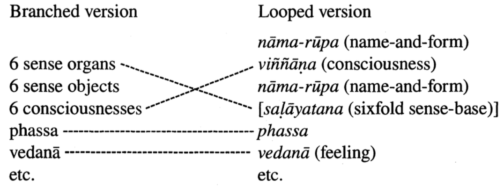
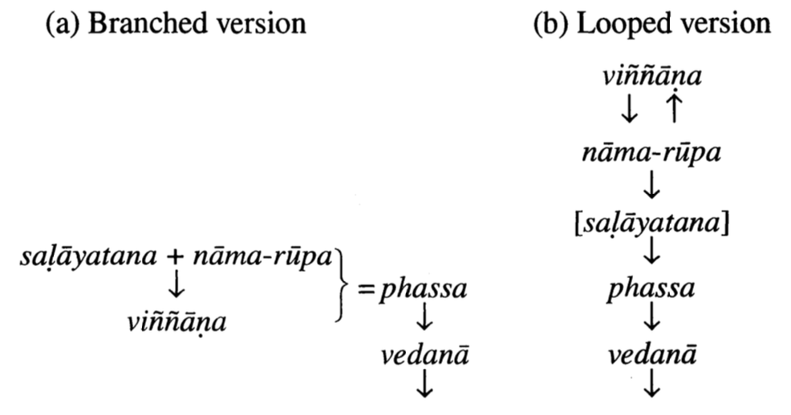
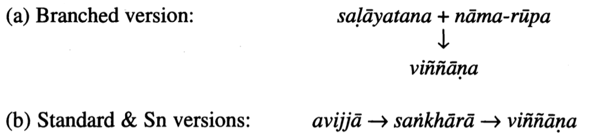
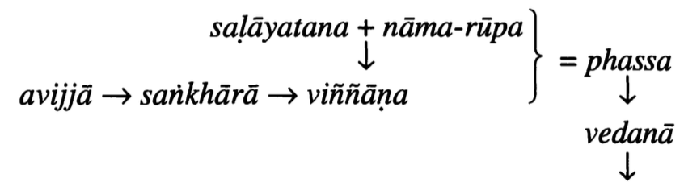

# Conditioned Arising Evolves: Variation and Change in Textual Accounts of the Paṭicca-samuppāda Doctrine

Roderick S. Bucknell 

JIABS Vol 22 Issue 2 pp. 311-342

The doctrine of "Conditioned Arising" (Pali: paṭicca-samuppāda) continues to attract attention in Buddhist studies for several good reasons, most importantly because it occupies a central place in the Buddhist doctrinal structure yet presents some formidable problems of interpretation. One source of these problems is the existence of several different versions of the doctrine. How this variation might be accounted for is a question that has been addressed by a succession of scholars throughout this century. Much remains to be done toward clarifying such issues, and the present article is a further attempt in that direction. It presents a comparative analysis of four versions of the PS (paticca-samuppāda) doctrine found in the Pali sutras and in their Chinese and Sanskrit counterparts, and on that basis it offers an explanation of how those versions may have developed from earlier forms. [^1]

## The standard version

The doctrine of Conditioned Arising is best known in the following form: [^2]

- Conditioned by ignorance (avijjā-paccayā) are activities (sañkhārā).
- Conditioned by activities is consciousness (viññāṇa).
- Conditioned by consciousness is name-and-form (nāma-rūpa).
- Conditioned by name-and-form is the sixfold sense-base (saḷāyatana).
- Conditioned by the sixfold sense-base is contact (phassa).
- Conditioned by contact is feeling (vedanā).
- Conditioned by feeling is craving (taṇhā).
- Conditioned by craving is clinging (upādāna).
- Conditioned by clinging is becoming (bhava).
- Conditioned by becoming is birth (jāti).
- Conditioned by birth are aging-and-death (jarā-maraṇa), grief, lamentation, pain, sorrow, and despair.

[^1]: This article is based on a paper presented at the First Joint Australian and New Zealand Religious Studies Conference at Lincoln University, New Zealand, in July 1996. I am grateful to Paul Harrison, Choong Mun-keat, and Antonio Ferreira-Jardim for directing me to relevant literature.
[^2]: The translations of terms are provisional. The source (one of many available) is Pali SN 2: 1-4, with Chinese counterpart SA 85a-b and Sanskrit counterpart Tp 157-164 \& 98. Here "Tp" denotes Chandrabhal TRIPATHI: Fünfundzwanzig Sütras des Nidānasamyukta (= Sanskrittexte aus den Turfanfunden VIII), Berlin: Akademie Verlag 1962. In text references, DN, MN, SN, AN = Pali Dīghanikāya, etc. (PTS editions); DA, MA, SA, EA = Chinese Dīrghāgama etc. (Taishō edition; DA and MA in vol. 1, SA and EA in vol. 2); DA' etc. = extra Chinese versions of individual sutras. Identification of counterparts follows Akanuma Chizen, The Comparative Catalogue of Chinese Āgamas and Pāli Nikāyas, (1929) Delhi: Sri Satguru Publications 1990.

Thus is the arising of this entire mass of suffering.

This series of twelve items, linked by the pattern "X-paccayā Y" (conditioned by X [is/are] Y), purports to explain the origin of suffering (dukkha). In effect, it is an elaboration of the second noble truth, tracing the chain of causal dependence back beyond craving (taṇhā ) to its ultimate origin in ignorance (avijjā). [^3]

Often the series is presented in reverse, the causal chain being traced backward from aging-and-death to birth, from birth to becoming, and so on to ignorance. Again, the series, whether in forward order or in reverse, is often stated in negative form: through the ceasing of ignorance, activities cease; and so on down to the ceasing of aging-and-death and of "this entire mass of suffering." [^4] In such cases, the description amounts to an elaboration of the third noble truth. [^5]

Textual presentations of the standard PS formula occasionally include explanations of its twelve component items. These exhibit a few disagreements between Pali and Chinese/Sanskrit versions of the same sutra, as shown in the following summary. In cases of disagreement, the textual sources are indicated; and for ease of presentation, the two components of nāma-rūpa are separated. [^6]

[^3]: Identity with the second noble truth is made explicit at AN 1:177.5-14.
[^4]: Reverse and negative formulations at MN 1: 261-4 = MA 768 a-c.
[^5]: Negative formulation identified with third noble truth at AN 1:177.15-26.
[^6]: At MN 1: 49-54 = EA 797b-c and SN 2: 2-4 = SA 85a-b = Tp 157-164 (Tp definitions agree with SA).

1\. avijjā: ignorance concerning suffering, its arising, its ceasing, and the way that leads to its ceasing

2\. sañkhārā: activities of body, speech, and mind (citta)

3\. viññāṇa: consciousness associated with eye, ear, nose, tongue, body, and mind (mano)

4a\. nāma:
    - SN, MN = EA : feeling, perception, volition, contact, mind-work (vedanā, saññā, cetanā, phassa, manasikāra)
    - SA: feeling, perception, activities, consciousness (vedanā, saññā, sañkhārā, viññāṇa)

4b. rūpa: the four great elements (earth, water, fire, air) and materiality derived from them

5\. saḷāyatana: eye, ear, nose, tongue, body, mind (mano)

6\. phassa: contact of eye, ear, nose, tongue, body, mind

7\. vedanā:

- SN, MN: feeling arising from contact of eye, ear, nose, tongue, body, mind
- SA, EA: feeling that is pleasant, unpleasant, neither-pleasant-norunpleasant

8\. taṇhā:

- SN, MN: craving for forms, sounds, odors, tastes, tactile objects, mental objects (dhammā)
- SA: craving for sensuality, form, the formless (kāma, rūpa, arūpa)
- EA: craving for sensuality, becoming, non-becoming (kāma, bhava, vibhava)

9\. upādāna: clinging to sensuality, views, rules and vows, selftheory

10\. bhava: becoming in the realms of sensuality, form, the formless

11\. jāti: birth, rebirth, ...

12\. jarā-maraṇa: aging, decrepitude, ... ; death, decease, ...

In the case of item 4, nāma-rūpa, there is a partial discrepancy between the two explanations of nāma, on which more will be said later. In the case of item 7 , vedanā, it appears that the two explanations amount to two different ways of classifying the same mental factor: either according to the categories of feeling itself (pleasant, unpleasant, neutral), or according to the sense organs that give rise to it. No disagreement is necessarily implied regarding the identity of the item vedanā itself. In the case of item 8, taṇhā, the three explanations differ in how they classify the possible objects of craving; as before, this does not appear to signify disagreement about the item itself (taṇhā). More substantial disagreements in some of the definitions are found in other textual sources; however, they are associated with disagreements about the composition of the chain of conditioned arising itself, to which topic we now turn.

## Other versions of the series 

The twelve-membered formula summarized above is referred to here as "the standard version" because it is by far the most frequently attested account of PS. Some less common variations on this basic theme also claim attention.

A common source of variation is simple abbreviation of the series. Sometimes the chain that culminates in birth-and-death is made to begin only at item 5 , the sense organs, [^7] or even at item 9 , clinging. [^8] It is likely that abbreviation of this sort merely amounts to a less than complete representation of the process: only that portion of the series was described which was relevant in the context within which the discourse in question was delivered. [^9] Such cases will not be considered here. More in need of attention are cases where items are omitted from within the series or are listed in a different sequence. [^10] Three such cases of substantial departure from the standard sequence will be examined.

The first case is the following, found in just four Pali sutras and their Chinese/Sanskrit counterparts, most notably the lengthy Mahānidānasutta. [^11] For ease of comparison, the numbering system of the standard version is retained in presenting this version.

[^7]: E.g. SN 2: 36.30-37.21.
[^8]: E.g. SN 3: 94.4-11.
[^9]: Erich FrauWALLNER takes such cases as evidence that the standard version is a combination of two shorter series. Geschichte der indischen Philosophie, vol. 1 (Salzburg: O. Miller 1953), pp. 197-199.
[^10]: Sometimes extra items, e.g. sañ̄̄a and cetanā, are included within the series; e.g. SA 84a25-b1. Such cases cannot be considered in this brief study.
[^11]: DN2: 55-63 = DA 61b = DA' 242b-c = MA 578b-9c = MA' 844b-5b; DN 2:30-35 = Fu 32-35(left) = DA 7b-c; SN 2:112-15 = SA 81a-b = Tp 107-9; SN 2:104-6 = SA 80b-c = Fu 32-35 (right, contra Tp 97-98). ("Fu" = FUKITA Takamichi, "Bonbun 'Daihonkyō' engisetsu no fukugen ni tsuite" [On restoring PS in the Sanskrit Mahāvadāna-sūtra], Bukkyō Shigaku Kenkyū 24.2 (1982): 26-43.)

> 4\. nāma-rūpa (name-and-form) \
> 5\. viññāṇa (consciousness) \
> 6\. nāma-rūpa (name-and-form) \
> [5\. saḷāyatana (sixfold sense-base)] \
> 7\. phassa (contact) \
> 8\. vedanā (feeling) \
> 9\. taṇhā (craving) \
> 10\. upādāna (clinging) \
> 11\. bhava (becoming) \
> 12\. jāti (birth) \
> 13\. jarā-marana etc. (aging-and-death etc.)

The bracketing of item 5 is to indicate that this link is not always present: it is missing in the Mahānidāna-sutta (in Pali and in three of the four Chinese versions) [^12] but present in the other sources. However, the main feature of this version of the PS formula is that items 1 and 2 of the standard list are missing, their place being taken by a repetition of item 4. For example, in the Mahānidāna the Buddha, having traced the chain back, link by link, from aging-and-death to contact (phassa), then states that contact is conditioned by name-and-form (nāma-rūpa), name-and-form is conditioned by consciousness (viññāṇa), and consciousness is conditioned by name-and-form. Consciousness and name-and-form are represented as conditioning each other mutually, and this causal loop is confirmed when the series is reiterated in summary in the forward direction: [^13]

> Conditioned by name-and-form is consciousness.
> 
> Conditioned by consciousness is name-and-form.
> 
> Conditioned by name-and form is contact... .

[^12]: Saḷāyatana is lacking at DN 2: 56.19-26 = DA 61b20 = DA'243b5-7 = MA579c4-7 but present at MA'845a24-28. The anomalous inclusion of the standard version (with saḷāyatana) at DA 60b12-29 is likely to represent a late addition, according to Tilmann VETTER: "Zwei schwierige Stellen im Mahānidānasutta: Zur Qualität der Überlieferung im Pāli-Kanon," Wiener Zeitschrift für die Kunde Südasiens 38 (1994): 137-160, p. 141. VETTER also notes (p. 142, n. 21) that the MA' version of the sutra is relatively late historically and shows signs of sectarian modification.
[^13]: DN 2: 56.31-32 = DA 61b20 = DA'243c2-3 = MA 580a1-2 = MA'845b11-12; DN 2: 32.32-3 = Fu 35(left); SN 2: 114.18-20; SN 2: 104.33-5 = SA 80c3-6 = Fu 35 (right).

There exist some instances of equivocation about the beginning of the series. In one of the sources cited above, we find that where the Pali sutra has the loop, its Chinese/Sanskrit counterpart has a simple linear series beginning with viñ̃ana in both backward and forward listings, i.e. it omits the initial occurrence of näma-rūpa; and then, in a concluding paragraph the Pali switches to an eleven-membered linear series beginning with sañkhärā (activities), while the Chinese/Sanskrit has the full twelve-membered series beginning with avijjā (ignorance). [^14]

Another example is provided by two sutras, numbers 49 and 50 in the Nidāna-samyutta of SN, both of which are titled Ariyasāvaka-sutta. [^15] Sutra no. 50 has the standard series beginning at avijjā. No. 49 is identical with no. 50 except that, in some editions, it begins the series not at avijjā but at viññāṇa (without the loop). In the PTS edition, the editor states in footnotes to no. 49 that the first two items (avijjā and sañkhārā) were present in the Burmese source manuscript but not in the two Sinhalese ones. [^16] Each of these two sutras is represented by the same counterpart in the Chinese SA, namely SA sutra no. 350.[^17] This situation is not uncommon in the Nikāyas/Āgamas; even within this same samyutta one finds two further cases where two consecutive and nearly identical Pali sutras have a single Chinese counterpart. [^18] The natural interpretation of such cases is that the two closely similar Pali sutras are divergent derivatives of a single earlier Pali sutra. In the case of the cited sutras 49 and 50, the divergence evidently arose out of uncertainty about the beginning portion of the PS series.

As if to deny such cases, some accounts of the looped version state explicitly that the chain of causation goes no further back than the loop:

[^14]: SN 2: 106 = SA 80c12-16 = Fu 39 (right).
[^15]: SN 2:77-79 \& 79-80. The uddāna (SN 2: 80.17) has dve ariyasāvake.
[^16]: SN 2:78, nn. 1 \& 3; The Book of the Kindred Sayings, Part II (trans. Mrs. RHYs DAVIDS, London: Routledge \& Kegan Paul 1982), p. 54, nn. 1-3. The Nalanda edition (SN vol. 2, p. 66, n. 1) says sutta 49 lacks avijjā and sañkhārā in the Siamese canon.
[^17]: SA 98 b .
[^18]: SN\#12.53 \& 54 =  SA\#285 and SN\#12.55 \& 56 = SA\#284, at SN 2:86-89 = SA 79b-80b. Contrast the situation where two non-identical consecutive Pali sutras taken together (joined end-to-end) are represented in a single Chinese sutra; e.g. SN\#12.1-2 = SA \#298 at SN 2:1-4 = SA 85a-b = Tp 157-164 (note 2, above). Such are the complications involved in identifying Pali-Chinese counterparts.

"This consciousness turns back at name-and-form; it goes no further."[^19] Yet one can also find this statement followed almost immediately in the same sutra by a listing of the standard version, in which the series does go further back. [^20] These contradictions represent a serious problem of interpretation.

Of the four instances of the complete looped version, only one provides explanations of the individual links, namely the Mahānidānasutta (in Pali and Chinese). Those explanations agree with the ones cited earlier for the standard version, except in the cases of viññāṇa and nāma-rūpa. [^21] Whereas the sutras quoted earlier explain viññāṇa as consciousness associated with the sixfold sense-base, the Mahānidāna explains it as consciousness that descends into the mother's womb at the moment of conception. [^22] And where the sutras quoted earlier have, for nāma-rūpa, definitions that disagree partially regarding the nāma component, the Mahānidāna has no definition at all. Instead it has, in four of the five cited versions of the sutra, a discussion of the relationship between nāma-rūpa and phassa (contact), which will be examined below.

The second of the three alternatives to the standard series to be considered here might be called "the Sutta-nipāta version" because its only occurrence is in a sutra of the Sn (Sutta-nipātá), one that has no known Chinese counterpart. [^23] This version was early recognized by LA VALLEE POUSSIN as important in providing possible clues to the early development of the PS series. [^24] The sutra in question says of each item that it is a condition for the arising of suffering (dukkha). It does not explicitly link each item with the next; however, the sequence in which the items appear in such statements matches closely that of the standard version, as can be seen from the following summary of the Sn series:

[^19]: SN 2: 104.30-31 = SA 80c3 = Fu 35 (right); DN 2:32 = Fu 35 (left).
[^20]: E.g. SA 80c3-4 \& 9-16.
[^21]: As regards the explanations of the other items, the Pali Mahānidāna agrees with the Pali sutras cited for the standard version, and the Chinese agree with the Chinese - except for some discrepancies in the case of tanha. The Pali at first lists six types of tanha based on the sense objects (DN 2: 58.12-13), but later lists three: kāma-taṇhā, bhava-taṇhā, vibhava-taṇhā (DN 2: 61.27-28); DA lists the same three (DA 60c13); and the other Chinese sources list just the first two of them: kāma-taṇhā and bhava-taṇhā (DA'243a19-20 = MA 579b22 = MA' 845 a8-9). In the Chinese, the identification of two kinds of tanha is immediately followed by the phrase "these two dharmas," and in the DN version the identification of three kinds is incongruously followed by the same phrase (ime dve dhammā, DN 2:61.33). It is likely, therefore, that DN formerly listed just the two kinds, despite Buddhaghosa's suggestion that the phrase refers to a different two kinds of taṇhā (Sumangalavilāsinī 500).
[^22]: DN 2: 63 = DA 61b9-12 = DA' 243b18-22 = MA 579c17-20 = MA'845b6-8.
[^23]: Sn139-149, \#728-751.

> upadhi (substrate) \
> 1\. avijjā (ignorance) \
> 2\. sañkhārā (activities) \
> 3\. viññāṇa (consciousness) \
> 4\. phassa (contact) \
> 5\. vedanā (feeling) \
> 6\. taṇhā (craving) \
> 7\. upādāna (clinging) \
> 8\. bhava (becoming) \
> 9\. jāti (birth) \
> 10\. maraṇa (death) \
> ārambhā (exertions) \
> āhārā (nutriments) \
> iñjitā (movements)

This omits 4. nāma-rūpa (name-and-form) and 5. saḷāyatana (sixfold sense-base), and it adds at the ends four items not found in the standard version. [^25]

The one remaining version of the PS series to be considered here is represented in the following formulation, found in much the same wording in many different sutras. [^26]

> And what, monks, is the arising of suffering? \
> Conditioned by the eye (cakkhu) and visible forms (rūpa) arises eye-consciousness (cakkhu-viññāṇa). \
> The coming together of the three is contact (phassa). \
> Conditioned by contact is feeling (vedanā). \
> Conditioned by feeling is craving (taṇhā). \
> Conditioned by craving is clinging (upādāna). \
> Conditioned by clinging is becoming (bhava). \
> Conditioned by becoming is birth (jāti). \
> Conditioned by birth are aging-and-death (jarā-maraṇa), ... \
> Thus is the arising of suffering.

[^24]: Louis DE La VALLÉe POUSSIN: Théorie des Douze Causes (London: Luzac 1913), pp. 1-5.
[^25]: Following iñjitā a further four items are named, but with no reference to causal dependence; the word paccayā is absent. Thus, iñjitā is where the causal chain ends.
[^26]: E.g. SN 4: 86.17-87.27 = SA 54c22-25.

The whole is then repeated in turn with each of the remaining five sense organs, sense objects, and classes of consciousness: "Conditioned by ear and sounds, ear-consciousness arises," and similarly for the nose and odors, the tongue and tastes, the body and tactile objects, and the mind (mano) and mind objects (dhammas).

The resemblance of this to the three versions already noted becomes more apparent if we bring together the six repetitions of the passage, and apply the definitions examined earlier. Eye, ear, nose, tongue, body, and mind are together the sixfold sense-base, i.e. they can be collectively identified with saḷāyatana, item 5 of the standard version. The corresponding six classes of consciousness (eye-consciousness etc.) are together identical with viññāṇa, item 3 of the standard version. For the six sense objects (visible forms etc.) a counterpart in the standard version is not immediately apparent. Despite this, a close overall correspondence exists, as is evident from the following summary representation of the quoted version using the numbering of the standard version:

> 1\. six sense organs (= saḷāyatana) plus six sense objects (= ?) \
> 2\. six consciousnesses (= viññāṇa) \
> 3\. phassa \
> 4\. vedanā \
> 5\. taṇhā \
> 6\. upādāna \
> 7\.  bhava \
> 8\.  jāti \
> 9\.  jarā-maraṇa

Clearly, we have here another version of the PS formula. For reasons that will soon become apparent, it will henceforth be called "the branched version."

The familiar twelve-membered account of PS is, therefore, just one among several versions. Alongside this standard version there also exist the looped version (with or without saḷāyatana), the Sn version, and the branched version; and one can find in the Nikāyas/Āgamas several other series which differ more markedly from the standard account of PS and which might be included in a more comprehensive comparative study. The present examination of just four closely similar versions therefore represents only a partial attempt to account for such variation.

As regards their content, the versions selected here for study fall naturally into two groups. The standard and Sn versions agree in tracing the chain of causation back to activities and ignorance; the branched and looped versions agree in not mentioning those two links. This grouping is recognized in the analysis that now follows; the branched and looped versions will be considered together, followed by the standard and Sn versions.

## The branched and looped versions 

In the branched version the causal chain originates with the sense organs and their corresponding objects: "Conditioned by the eye and visible forms arises eye-consciousness." The subsequent repetitions complete the set of six senses (the five physical senses and the mind), as shown:

| | | |
| :--: | :--: | :--: |
| cakkhu (eye) | + rūpa (form) | → cakkhu-viññāṇa (eye-consciousness) |
| sota (ear) | + sadda (sound) | → sota-viññāṇa (ear-consciousness) |
| ghāna (nose) | + gandha (odor) | → ghāna-viññāṇa (nose-consciousness) |
| jivhā (tongue) | + rasa (flavor) | → jivhā-viññāṇa (tongue-consciousness) |
| kāya (body) | + photṭhabba (tactile) | → kāya-viññāṇa (body-consciousness) |
| mano (mind) | + dhamma (image) | → mano-viññāṇa (mind-consciousness) |

The coming together of the three items in each horizontal set (e.g. eye, visible forms, eye-consciousness) is equated with contact (phassa, i.e. eye-contact etc.), which then conditions feeling (vedanā), and so on. It was briefly noted above that comparison with other versions of PS is facilitated if one combines the items in each vertical set. Such combination is recognized explicitly in some textual accounts. For example, the three sets of six are sometimes referred to as the six internal sense-bases (cha ajjhatikāni āyatanāni = eye etc.), six external sense-bases (cha bāhirāni āyatanāni = visible forms etc.), and six consciousness groups (cha viññāṇa-kāyā). [^27] The first of these sets of six is also recognized in the widely used term sal-āyatana (sixfold sense-base). Furthermore, in the Pali tradition, as seen earlier, accounts of PS which explain the component items define vedanā and taṇhā in terms of the six sense fields, thereby implicitly recognizing the same summation of six separate series. Such considerations justify recognizing the three sets of six, shown above, as constituting a single triad: 6 sense organs +6 sense objects →6 consciousnesses. Applying this to the branched version means that it and the looped version compare as shown in Figure 1.

[^27]: E.g. MN 3: 280-1 = MA 562b-c, DN 3: 243-4 = DA' 231b-c. The sixfold grouping continues as far as taṇhā. Also cf. the three consecutive samyuttas at SN 3: 225-240, each of which is clearly derived from a single sutra. In each the six senses are covered not by repeating the entire series for each sense field but by specifying the six sense fields within each item.

Between the two versions, there is complete correspondence from phassa to the end of the series; and, as Figure 1 reveals, the items preceding phassa match up partially. The correspondence between the two "consciousness" items is actually defective. Accounts of the looped version explain viñ̃ana as consciousness that descends into the mother's womb at conception; the definition of viññāṇa in terms of the six senses is associated not with the looped version but with the standard version. On the other hand, as noted earlier, sutras dealing with the looped version often switch between it and the standard version as if there were little to distinguish them. This suggests that the difference in definition sense consciousness versus rebirth consciousness - may be less significant than it appears. This question will be re-examined later. For the present, suffice it to note the broad correspondence evident in Figure 1. Just one item in each series remains completely unpaired, namely the six sense objects on the left, and nāma-rūpa on the right. Accordingly, attention now focuses on the meaning of the term nāma-rūpa.

Since accounts of the looped version provide no definition of nāmarūpa, we turn first to the definitions of this item that accompany accounts of the standard version. These indicate that the second component, rūpa, refers to the four great elements (earth, water, fire, air) and their derivatives. This is one of several meanings borne by the word rūpa according to context. In another usage rūpa means "visible form," i.e. the object of eye-consciousness; this is the case in the opening sentence quoted above: "Conditioned by eye (cakkhum) and visible forms (rüpe)." [^28] However, the definitions indicate that the rūpa in nāma-rūpa has the other meaning; it denotes physicality, materiality.

[^28]: On the ambiguity of rūpa cf. D. SEYFORT RUEGG: "Some reflections on the place of philosophy in the study of Buddhism," JIABS 18.2 (1995): 145-181, p. 146.

As for nāma (literally "name"), one of the two available definitions (that given in SA) equates it with the second to fifth of the five khandhas, the five aggregates into which the person or being is often analyzed. The first of the khandhas is rūpa, defined as physicality, as above; the remaining four, vedanā, saññā, sañkhārā, viññāṇa (feeling, perception, activities, consciousness), are mental. Thus, on this definition nāma-rūpa represents a classification of the khandhas into mental and physical. The other definition (given in SN, MN, and EA) equates nāma with vedanā, saññā, sañkhārā, phassa (contact), and manasikāra (mind-work), which again are all mental factors. Thus, the available definitions, despite disagreeing with each other, appear to justify the common free translation of nāma-rūpa as "mind and body." [^29]

These textual explanations of nāma-rūpa are problematic. In addition to the disagreement regarding the definition of nāma, there are discrepancies arising out of the place of nāma-rūpa in the PS series. Both definitions indicate that nāma encompasses vedanā (feeling), yet vedanā is said to arise further down the causal series; and one of the two definitions indicates that nāma also encompasses phassa (contact), which again is further down the series. (In the standard version nāma-rūpa is item 4, while phassa and vedanā are items 6 and 7.) These discrepancies could be explained away by suggesting that the causal links are not to be understood as strictly ordered, but that would amount to a serious weakening of the notion of causal dependence (idappaccayatā), which the PS doctrine is said to exemplify.

A further anomaly concerning nāma-rūpa is that, as noted above, the Mahānidāna-sutta, while providing definitions for all the other items in the looped version, fails to provide one for nāma-rūpa; instead it goes into a discussion of the causal connection between nāma-rūpa and the next item, phassa (saḷāyatana is omitted). That discussion is dealt with by REAT (1987) in an instructive study of the notion of nāma-rūpa. [^30] REAT translates the Pali passage in question as follows: [^31]

[^29]: E.g. Maurice WALSH: Thus Have I Heard: The Long Discourses of the Buddha (London: Wisdom 1987), p. 223 (translation of Pali Mahānidāna-sutta).
[^30]: N. Ross ReAt: "Some Fundamental Concepts of Buddhist Psychology," Religion 17 (1987): 15-28.
[^31]: DN2: 62 = DA 61b = DA'243b =  MA 579c. Quoted in Dharmaskandha in Chinese: T\#1537 at T26: 509b16-27 ("T" = Taishō edition); and in Sanskrit: Siglinde DIETZ: Fragmente des Dharmaskandha: Ein Abhidharma-Text in Sanskrit aus Gilgit (= Abhandlungen der Akademie der Wissenschaften in Göttingen, Philologisch-Historische Klasse, 3. Folge, Nr. 142) (Göttingen: Vandenhoeck \& Ruprecht 1984), pp.42-43. The passage is lacking in the other Chinese counterpart, MA' 845 , which has the intervening saḷāyatana. REAT, who considers only the Pali, elides the third of the four questions, which is fortuitously appropriate because the Chinese versions (and Dharmaskandha) lack this question. They also lack the phrases "in the form-group" and "in the namegroup" (as noted by VETTER, pp. 147-8), which yields a more coherent reading; e.g.: "If those qualities by which the form-group is manifested were absent, would there be the manifestation of sensual contact?"

- If, Ānanda, those qualities, characteristics, signs, and indications by which the name-group (nāma-kāya) is manifested ... were absent, would there be the manifestation of verbal contact (adhivacana-samphassa) in (i.e. "with regard to") the form-group (rūpakāya)?
- There would not, venerable sir.
- If, Ānanda, those qualities etc. by which the form-group is manifested ... were absent, would there be the manifestation of sensual contact (patigha-samphassa) in the name-group?
- There would not, venerable sir. ...
- And if, Ānanda, those qualities etc. by which name-and-form are manifested ... were absent, would there be any manifestation of (any kind of) contact (phassa)?
- There would not, venerable sir.
- Therefore, Ānanda, this is the cause, the basis, the origin, the condition of contact, namely name-and-form.

REAT reasons that this identifies nāma and rūpa as two classes of object of consciousness: nāma is conceptual (adhivacana); rūpa is sensory (patigha, literally "impact"). He links this terminology to the general Indian idea of "the interdependence of concept (nāma) and thing conceptualized (rūpa), or name and named," citing the usage of the term nāma-rūpa in the pre-Buddhist Upaniṣads. [^32] He concludes that "adhivacana (verbal) and paṭigha (sensual), as categories of phassa, are an alternative to the more commonly enumerated six kinds of phassa, and thus that nāma-rūpa is a dual categorization of the six types of objects of consciousness." [^33]

REAT is saying that the term nāma-rūpa refers to a grouping of the six types of sense objects into two categories: the rūpa category, comprising physical sense objects of the five types (visible forms, sounds, odors, flavors, tactile objects), and the nāma category, comprising non-physical sense objects (dhammas, mind objects). The textual basis for his argument is strengthened by the fact that the same account of the causal connection between nāma-rūpa and phassa appears in three of the four extant Chinese counterparts of the Pali Mahānidāna-sutta. [^34] The argument itself is supported by similar conclusions reached by YINSHUN in an earlier (1981) discussion of the same problem of interpreting nāmarūpa, this time in relation to a variant of the branched version. [^35]

[^32]: ReAT, pp. 18, 22.
[^33]: ReAT, p. 25.

YINSHUN, who bases his analysis entirely on Chinese sources, quotes the following passage from a sutra in the Saṃyuktāgama: [^36]

> Within the body there is this consciousness (shi = viññāṇa), and outside the body there is name-and-form (ming-se = nāma-rūpa). Conditioned by these two arises contact. Contacted by these six sense-contacts, the ignorant, untaught worldling experiences painful and pleasurable feelings variously arisen.

YINSHUN draws the natural conclusion: "Consciousness and name-andform are opposed as subject and object." [^37] In other words, the term nāma-rūpa denotes the sense objects.

The reference to nāma-rūpa as located "outside the body" is in keeping with the terminology noted earlier, in which the sixfold sense-base is "inside" and the corresponding objects (which would include even the objects of the mind sense-base, manāyatana) are "outside." [^38] Clearly, then, the passage that YINSHUN quotes is discussing a variant of the branched version in which the six senses are combined; the six sense objects are collectively covered by the term nāma-rūpa.

[^34]:  Also in quotes in Dharmaskandha; see note 31, above. REAT's reasoning (based only on the Pali) is criticized, but with little foundation, by Peter HARVEY: The Selfless Mind: Personality, Consciousness and Nirvana in Early Buddhism (Richmond: Curzon 1995), pp. 131-2; and by Sue HAMILTON: Identity and Experience: The Constitution of the Human Being According to Early Buddhism (London: Luzac 1996), p. 126.
[^35]: [Shi] YINSHUN: Weishi-xue tan yuan [Studies in the Origins of the Vijñānavāda] (= Miaoyunji No. 3) (Taipei: Zhengwen 1981), pp. 16-17, 20-22. REAT was evidently unaware of YINSHUN's work.
[^36]: SA 83c25-27 = SN 2:24.1-4 = Tp 141-2, my translation. YINSHUN (p.21) quotes the original text, but amends the Taishō punctuation to yield the meaning: "... Within there is this consciousness-body (viññāṇa-kāya), and outside there is name-and-form ..." However, the Sanskrit (not mentioned by YINSHUN) supports the Taishō punctuation (see note 39, below). In any case, the discrepancy does not affect YINSHUN's argument.
[^37]: YINSHUN, p. 21.
[^38]: MN 3: 280-1 = MA 562b. On mind objects (dhammā) as located externally (bāhirā) cf. MN 1: 191.15-18 = MA 467a13-15.

The Sanskrit counterpart of the quoted Chinese passage differs only slightly in meaning. For the first sentence it has: "Thus, this (is) his body with consciousness, and outside (is) name-and-form." [^39] The Pali counterpart, however, differs significantly. It reads: "Thus indeed, this (is) the body, and outside (is) name-and-form." [^40] Lacking the reference to consciousness, the Pali is less readily recognizable as an account of the beginning of the branched version. Nevertheless, it confirms the essential point on which YINSHUN's reasoning depends: nāma-rūpa is located "outside."

In any case, there is another Pali passage that points to just this interpretation of nāma-rūpa, a point that was noticed earlier again (1971) by WATSUJI. [^41] Set in the context of guarding against the false notions of "I" and "my," this often-repeated passage reads: "Lord, how knowing, how seeing, is there no I-making, my-making, or tendency to conceit, with regard to this body with consciousness and, outside, all nimittas?"42 The italicized phrase parallels "this his body with consciousness, and outside name-and-form," quoted above from the Sanskrit, but with nāma-rūpam replaced by sabbanimittesu (Chinese: yiqie xiang), "all nimittas." Of the meanings of nimitta given in the Pali-English Dictionary the appropriate one here is certainly "outward appearance, mark, characteristic, attribute, phenomenon (opp. essence)." [^43] And the reference is likely to be to all visible forms, sounds, etc., in other words to the totality of sense objects.

These observations by WATSUJI, YINSHUN, and REAT indicate that nāma-rūpa, far from signifying "mind-and-body" or something similar, is a collective term for the six types of sense object. [^44] (The reference, in the case of rūpa, is evidently not to the physical objects of the world around us, but rather to the sense data - patterns of color and shape, auditory impressions, and so on - that impinge on us via the sense organs.) None of the three researchers suggests why the definitions of nāma-rūpa given in the sutras conflict with this interpretation, a question that will be examined below. Nevertheless the case for the interpretation is strong.

[^39]:  ity ayañ cāsya savijñānakah kāyo [ba]hirdhā ca nāmarūpam. Tp 142.
[^40]: iti ayaṃ ceva kāyo bahiddhā ca nāmarūpaṃ. SN 2:24.1-2. REAT (p.18) also quotes this passage in support of his interpretation.
[^41]: WATSUJI Tetsurō: Genshi Bukkyō no Jissen Tetsugaku [Practical Philosophy of Early Buddhism] (Tokyo: Iwanami Shoten 1971), pp. 228-231.
[^42]: imasmiñ ca saviññāke kāye bahiddhā ca sabbanimittesu; e.g. SN 2: 252= SA 50c; SN 3: 135-7 = SA 2:5a-b = SA 2:50c-51a; AN 1: 132-3 = SA 2:255b256a. Cf. the wording in notes 39 and 40 , above.
[^43]: PED, p. 367.
[^44]: The same understanding of nāma-rūpa is taken for granted, without supporting discussion, by MIZUNO Kōgen: Primitive Buddhism (Ube: Karinbunko 1969), pp. 142-144; and YAMADA Ishii: "Premises and Implications of Interdependence", in Somaratna BALASOORIYA et al. (eds.), Buddhist Studies in Honour of Walpola Rahula (London: Gordon Fraser 1980: 267-293), p. 272. It is rejected, again without supporting discussion, by Lambert SChMItHAUSEN: "The Early Buddhist Tradition and Ecological Ethics", Journal of Buddhist Ethics 4 (1997), http://jbe.la.psu.edu/4/schml.html, note 67. Relevant here is a variant of the standard version of PS at Vibhanga 138.30-32: "... viññāṇapaccayā nāmam, nāmapaccayā chattthāyatanam, chattthāyatanapaccayā phasso, ..." This associates nāma with "the sixth sense-base" (chatthāyatana). It thus supports the proposition that nāma-rūpa represents a classification of sense objects into mental (sensed via the sixth sense-base) and physical (sensed via the other five bases).

This revised understanding of nāma-rūpa has implications for the questions raised earlier concerning the relationship between the branched and looped versions. If adopted, it makes the correspondence between the two versions even closer than is shown in Figure 1. A further connecting line can now be inserted, joining " 6 sense objects" on the left with "nāma-rūpa" on the right. There is now a complete pairing of items between the two versions, though with questions remaining concerning the discrepant definitions of nāma-rūpa and viññāṇa.

The difference in sequence proves, on examination, to be not quite as Figure 1 may suggest. For the looped version the description follows the same "X-paccayā Y" pattern throughout, with each item conditioned by the item preceding it in the list: "Conditioned by name-and-form is consciousness. Conditioned by consciousness is name-and-form. Conditioned by name-and-form is the sixfold sense-base..." and so on. The pattern of dependency relationships in the looped version can, therefore, be represented as shown in Figure 2, section (b). The arrows represent the conditional relationship: the item ahead of each arrow is conditioned by, or dependent on, the item behind the arrow. The whole has a simple linear structure except at its beginning, where the pair of arrows represents the reciprocal relationship between viññāṇa and nāma-rūpa. [^45]

[^45]: Similar notation is adopted by YINSHUN, p. 24; VETTER, p. 144; and Bhikkhu BODHI: The Great Discourse on Causation: The Mahānidāna Sutta and Its Commentaries (Kandy: Buddhist Publication Society 1995), p. 43.

In the case of the branched version the pattern of relationships is less uniform: "Conditioned by the eye and visible forms arises eye-consciousness. The coming together of the three is contact. Conditioned by contact is feeling... ." The first two items named, the sense organ and its object, are not linked by any dependency relationship; neither is said to be a condition for the other. These two together condition the arising of the next item, viññāṇa (consciousness). Those three together are the next item, phassa (contact). Phassa conditions the arising of vedanā (feeling), and so on thereafter in linear series to the end. The pattern of relationships is, therefore, properly represented by a branching structure, as in Figure 2, section (a).

From vedanā to the end the branched and looped versions agree; and, as demonstrated above, the seeming discrepancies in the composition of their early portions are largely due to differing terminology. Consequently, an adequate comparison of the early portions of the two versions can be achieved by applying the terminology of the looped version to the components of the branched version, and setting the resulting structures side by side, as in Figure 2.

Between these two structures there is close resemblance but also substantial difference, difference which is the more noteworthy because of the emphasis on precise identification of dependency relationships that characterizes the PS doctrine. This combination of similarity and difference demands explanation. There are, broadly speaking, two possibilities:

(a) The two versions accurately represent two distinct teachings imparted by the Buddha, which happen to have much in common.

(b) The two versions represent a single teaching imparted by the Buddha, the present differences between them being due to faulty transmission of the tradition.

Favoring explanation (a) is the apparent discrepancy in the significance of viññāṇa in the two versions. The viññāṇa of the branched version is the summation of the six types of consciousness associated with the sense organs, which makes that version read like an account of the psychological process of sensory perception. In contrast, the looped version, for which viññāṇa is defined as rebirth consciousness, reads like an account of events associated with the process of physical rebirth. [^46] Against this, however, is the fact, noted earlier, that sutras dealing with the looped version often switch between it and the standard version, for which viññāṇa is defined as consciousness associated with the six senses.

[^46]: These two correspond to two different understandings of PS (specifically, of the standard version) that are current among practicing Buddhists. Prominent Sangha representatives of the two positions are: for the microcosmic, psychological interpretation, BUDDHADASA Bhikkhu: Paticcasamuppada: Practical Dependent Origination, Nonthaburi, Thailand: Vuddhidhamma Fund 1992 (e.g. p. 14 ); and for the macrocosmic, physical interpretation, NYANATILOKA: Buddhist Dictionary (Colombo: Frewin 1972), pp. 128-136 (esp. p. 131).

As for explanation (b), according to which the branched and looped versions developed out of a single earlier version through faulty transmission, this is by no means incompatible with the existence of two different definitions of viññāṇa. The postulated rearrangement of the items preceding phassa (contact) might have been accompanied by a redefinition of one of those items (i.e. viññāṇa), or might even have been the cause of that redefinition. On the other hand, the suggestion that such rearrangement and redefinition occurred can be taken seriously only if the details of the postulated changes can be spelled out and shown to be reasonable in light of all relevant data.

An evaluation of the relative merits of the two possible explanations will, therefore, depend crucially on how adequately it can be demonstrated that the branched and looped versions could have developed out of a single earlier account - as proposed in explanation (b) - given what is known of conditions relating to transmission of the memorized Dharma within the early Sangha. That issue will now be explored.

The simplest form of postulate (b) is that one of the existing versions, either the branched or the looped, has preserved the source form intact, while the other represents a modification of it. [^47] Near its beginning, the branched version is specific about the nature of each relationship; it indicates several different types of relationship, namely those represented in Figure 2 (a) by the signs +, ↓, \}, =. It is this diversity that defines the branching structure. The looped version, however, recognizes only one type of relationship, expressed in the fixed formula " X paccayā Y" repeated at each linkage, and uniformly represented in Figure 2 (b) by the arrow sign. It is this uniformity that defines its basically linear structure.

[^47]: The "source form" is not supposed to be the form of the doctrine taught by the Buddha. It is simply the postulated common ancestor of the two existing versions and is, in its turn, subject to possible interpretation as derived from some still earlier form.

In respect of this feature, it is not hard to see how, in the oral transmission of the teaching, the diverse descriptions in the beginning part of the branched version could have developed into the uniform descriptions in the looped version, particularly in situations where the series was being chanted in reverse order. One can postulate broadly the following line of development. The "X-paccayā Y" pattern, which applies at each linkage as one moves backward from jarā-maraṇa to jāti, from jāti to bhava, and so on, originally applied only as far as phassa (as in the present branched version). However, chanting monks, mechanically repeating the memorized formula with little understanding of its purport, mistakenly applied the same pattern to the remaining items, all the way back to the beginning (as in the present looped version). In thus regularizing the wording of the chanted material, the monks responsible unintentionally simplified the structure: the branching arrangement became a simple linear series.

A line of development that could have effected the converse structural change is difficult to envisage. In other words, it is easy to see how the branched version could have yielded the essentially linear structure of the looped version by simple loss and regularization, but it is hard to see how the reverse could have happened. This postulated process of change is, as yet, vague on detail, but it suffices to make the main point: in respect of the issues considered thus far, it is more likely that the looped version developed out of the branched version than that the reverse happened. This recognized, an attempt will now be made to fill in the details.

In Figure 2, the branched version is shown with the six senses combined, in order to reveal its relationship with the looped version; e.g., the item viñ ñāna (consciousness) in the depiction of the branched version represents the summation of eye-consciousness, ear-consciousness, etc. Existing textual accounts of the branched version do not explicitly combine the six senses in this way. They say: "Conditioned by the eye and visible forms arises eye consciousness. ... Thus is the arising of suffering." And then they go through the entire series again with each of the five remaining senses. However, given the examples cited earlier where viñ ñāna and other items are defined in terms of the six senses collectively, it is clearly reasonable to suggest that such a combined account might have formerly existed. Its wording would have followed
the pattern seen in the existing accounts; that is, it would have begun more or less as follows: [^48]

a) Saḷāyatanaṃ ca pațicca nāma-rūpaṃ ca uppajjati viññāṇam. (Conditioned by the sixfold sense-base and name-and-form, arises consciousness.)

b) Tinnan sañgati phasso. (The coming together of the three is contact.)

c) Phassa-paccayā vedanā. (Conditioned by contact is feeling.)

d) Vedanā-paccayā taṇhā. (Conditioned by feeling is craving.)

Now, it is an observable fact that, with one partial exception (discussed below), accounts of the branched version present it only in forward sequence, while accounts of the looped version present it initially in reverse sequence and then in forward sequence. The relationship between the forward and reverse presentations of the looped version (as also of the much better attested standard version) is such that the reverse presentation is obtained from the forward presentation by reversing the sequence of the separate statements while leaving those statements themselves unchanged. For example, where the forward sequence concludes thus: "... Bhava-paccayā jāti. Jāti-paccayā jarā-maranam." the reverse sequence begins thus: "Jāti-paccayā jarā-maranam. Bhava-paccayā jāti. ..."

Let us consider the effect of applying this principle in reversing the postulated combined branched version (in which the six senses are brought together). What is involved can be seen in the following reversed presentation of the above four statements. (**Bold** is used to highlight the items whose relationships are being stated.)

d) **Vedanā**-paccayā **taṇhā**. (Conditioned by **feeling** is **craving**.)

c) **Phassa**-paccayā **vedanā**. (Conditioned by **contact** is **feeling**.)

b) Tinnan sañgati **phasso**. (The coming together of the three is **contact**.)

a) **Saḷāyatanaṃ** ca pațicca **nāma-rūpaṃ** ca uppajjati **viññāṇaṃ**. (Conditioned by the **sixfold sense-base** and **name-and-form**, arises **consciousness**.)

The progression from statement (d) to statement (c) presents no problem. But to go on from that to statement (b), "The coming together of the three is contact," would make no sense, because "the three" are not named until the following statement (a).

At this point, according to the postulate advanced above, monks reciting the formula responded by mechanically applying the same "Xpaccayā Y" pattern to the remaining items (shown bold). This yielded a variety of results. Along one line of development, Tinnam sangati **phasso** was replaced by **Saḷāyatana**-paccayā **phasso**, using the first of the three items from statement (a); and the series was then completed by continuing similarly with the two remaining items: **Nāma-rūpa**-paccayā **saḷāyatanaṃ**. **Viññāṇa**-paccayā **nāma-rūpam**. Along a second line of development, *saḷāyatana* was overlooked, so that Tinnam sangati **phasso** was replaced by **Nāma-rūpa**-paccayā phasso, followed by **Viññāṇa**-paccayā **nāma-rūpam**. In both cases, further uncertainty arose from an awareness that the new final statement contradicted the imperfectly remembered source version, according to which nāma-rūpa was a condition for viññāṇa, rather than the reverse. This situation was covered by adding, usually but not always, one further statement: **Nāma-rūpa**-paccayā viññāṇam. The result was the looped version, with or without saḷāyatana.

The looped version is attested in sutra collections representing both the Pali tradition (SN, DN) and the Sarvāstivāda (SA). [^49] Consequently, the developments hypothetically outlined above probably must be supposed to have occurred before the sectarian split that yielded those two traditions, i.e. well before the Pali tradition's Third Council in the third century B.C. [^50]

The proposed reconstruction supposes that, at the time of the transformation, there existed a variant of the branched version in which the six senses were combined to yield a single series. Implied is that this variant employed nāma-rūpa as a collective term for all six classes of sense object. This is an important point because, whereas the terms for the six individual sense objects are likely to have been well understood by any Sangha member, the more technical term nāma-rūpa appears (from the conflicting definitions of it) to have been a source of some confusion since early times. Such confusion would have facilitated modification of the causal relationships involving nāma-rūpa. For example, the obscure "Conditioned by consciousness is name-and-form" could have enjoyed a plausibility not shared by the transparent and counterintuitive "Conditioned by eye-consciousness are visible forms."

[^49]: The continuing doubts about whether SA (T\#99) really is Sarvāstivādin have little effect on the argument, and will not be discussed here. The same applies for subsequent statements relating to the sectarian affinities of other Chinese āgama texts.
[^50]: Borrowing from one school to another after their separation cannot be ruled out, making a later date also possible.

The proposed reconstruction also implies that the practice of reciting the causal series in reverse order was an innovation, and indeed that this new practice was the immediate cause of the distortions. It was earlier noted in passing that there does exist one partial exception to the generalization that the branched version is found only in the forward sequence. This exception occurs in one of the four Chinese counterparts of the Pali Mahānidāna-sutta, namely that contained in DA (the full Chinese translation of Dīrghāgama). It will be recalled that the Pali account describes, initially in reverse sequence, the looped version without the sixfold sense-base (saḷāyatana). The relevant DA account begins by doing the same; but, having traced the series back to the link between contact and feeling, it digresses, as follows: [^51]

> The Buddha said to Ānanda: "Conditioned by contact is feeling. What is the meaning of this? Ānanda, if there were no eye, no visible form, and no eye consciousness, would there be contact?"
> 
> He answered: "There would not."
> 
> "If there were no ear, sound, and ear consciousness, ... no mind, mind object, and mind consciousness, would there be contact?"
> 
> He answered: "There would not."
> 
> "Ānanda if all beings lacked contact, would there be feeling?"
> 
> He answered: "There would not."

There follow explanations of the link between name-and-form and contact (corresponding to REAT's quote from the Pali), and of the reciprocal link between consciousness and name-and-form.

The quoted section begins with a question about how feeling (vedanā ) is conditioned by contact (phassa). Incongruously, however, the answer given deals mainly with how contact is dependent on the coming together of each sense organ with its corresponding object and consciousness. In effect, the looped version is here combined with a portion of the branched version. While the overall causal sequence is stated in reverse, the components of each sense triad from the branched version are named in the original forward sequence (eye, visual form, eye consciousness; etc.). After this digression into the branched version, the account of the looped version resumes: contact is conditioned by name-and-form, and so on back to consciousness and again name-and-form.

It is generally accepted that the Chinese DA represents the Dharmaguptaka school, whose divergence from the Pali tradition probably happened well after that of the Sarvāstivāda. [^52] This unique variant of the looped version is, therefore, probably too late historically to be interpreted as a transitional form between the branched and looped versions. It appears, rather, to represent a combining of the branched version with its already well established looped derivative, perhaps in an attempt to reconcile two different memorized versions of the Mahānidāna known within the Dharmaguptaka tradition.

The hypothetical reconstruction set out above demonstrates that the existing looped version, together with its several variants, can be explained as a distorted derivative of a form of the branched version in which the six senses were combined. It thereby demonstrates that the differences between the existing branched and looped versions can be accounted for in terms of processes of change that could well have happened in the course of the early oral transmission of the teaching. Further implications of this finding will be suggested in the course of examining the two remaining versions of the PS formula identified here for study.

## The standard version and the Sutta-nipāta version 

The version of the PS formula preserved in the Sutta-nipāta agrees with the standard version in tracing the causal series back beyond viñ ñāna (consciousness) to sañkhārā (activities) and avijjā (ignorance). It differs from the standard version in omitting nāma-rūpa (name-and-form) and saḷāyatana (sixfold sense-base), and adding extra items at the beginning and end of the series:

[^52]: See Ernst WALDSCHMIDT: "Central Asian Sūtra Fragments," in Heinz BECHERT (ed.), The Language of the Earliest Buddhist Tradition (Göttingen: Vandenhoeck \& Ruprecht 1980): 136-164, p. 136.

| Standard | Sutta-nipāta |
| :-- | :-- |
|  | upadhi |
| avijjā | avijjā |
| sañkhārā | sañkhārā |
| viññāṇa | viñ̃̃̃āna |
| nāma-rūpa |  |
| saḷāyatana | phassa |
| phassa | vedanā |
| vedanā | taṇhā |
| taṇhā | upādāna |
| upādāna | bhava |
| bhava | jāti |
| jāti | jarā-maraṇa |
| jarā-marana |  |
|  | ārambhā |
|  | āhārā |
|  | iñjitā |

The extra items in the Sn version are not attested in any other account of the PS series. They are, therefore, likely to be relatively late additions, especially given that several further items are mentioned as following iñjitā (movements) without being made part of the series proper. [^53] No attempt will be made here to interpret these extra items in the Sn version. In the following discussion they will be passed over, leaving a series that differs from the standard version only in omitting nāma-rūpa and saḷāyatana.

In deriving viññāṇa from sañkhārā (activities) and avijjā (ignorance), both of these versions differ substantially from the branched version, as shown in Figure 3. However, the standard version, including as it does nāma-rūpa and saḷāyatana, differs less markedly from˝ the looped version, being identical with it from viññāṇa to the end. Consequently,
the problems considered earlier when the branched version was compared with the looped version present themselves again, in much the same form, when the branched version is compared with the standard version. It is clear that much the same response to those problems is applicable here. That is, one can reason along the same lines that the existing arrangement of the standard version, in which näma-rūpa and saḷāyatana follow viññāṇa in linear series, is likely to have developed out of an earlier arrangement in which they preceded viññāṇa, as in the branched version. The absence of a loop in the present case simplifies the argument slightly. The presence, in the standard version, of an extra sub-chain (avijjā → sañkhārā → ) feeding into viññāṇa does not affect the argument; this sub-chain simply accompanies viññāṇa throughout the postulated changes. Consequently, application of the earlier reasoning to the present case points to hypothetical derivation of the existing standard version from an earlier form that differed from the branched version only in having the extra sub-chain. That earlier form is shown in Figure 4.

[^53]: The linguistically conservative character of Sn does not rule out the possibility that its contents underwent development over time. There is evidence that the initial upadhi (also given as upadhī) may represent a repetition of upādāna; cf. SN2: 107.28-108.25 = SA 82b9-14 = Tp 124-6, where upadhi replaces upādāna. The set of extra items in Sn is roughly matched in the Mahānidāna by a subsidiary series of items (pariyesanā, lābha, etc.) said to be conditioned by taṇhā: DN 2: 58.31-59.3 = DA 60c19-22 = DA'242b18-23 = MA 579a1-6 = MA'844c16-23.

In this postulated earlier form of the standard version the arising of viññāṇa is traced to two different sources: on one hand to the sense organs and their objects (saḷāyatana and näma-rūpa), and on the other hand to activities (sañkhärā), which in their turn are conditioned by ignorance (avijjā). The branched version represents the former source, and the Sn version is now seen to represent the other source (activities and ignorance).

This yields the following simple picture of how the different versions of the PS formula relate to one another: the branched version derives viññāṇa from the sense organs and sense objects; the Sn version derives viññāṇa from activities and ignorance; and the ancestor of the standard version derived it from both sources. The ancestor of the standard version was, in effect, a combination of the branched version and the Sn version. To describe it from another perspective, the branched version fails to mention one of the two sources of viññāṇa recognized in the ancestral standard version, while the Sn version fails to mention the other; each omits one of the two branches leading to viññāṇa. The Sn version's omission of näma-rūpa and saḷāyatana, appearing as a gap in the linear series, is thereby explained as simply a by-passing of one of the two main branches. Also explained is the statement, associated with the looped version, that the causal series cannot be traced further back than näma-rūpa - this despite the existence (sometimes in the very same sutra) of the standard version, in which the series does appear to go further back. As Figure 4 portrays it, nāma-rūpa is indeed as far as the causal series can be traced along the branch in question. The statement that no further cause can be found beyond nāma-rūpa is not, after all, incompatible with the status of avijjā as the beginning of the (standard) series, since nāma-rūpa and avijjā are the tips of two different branches. The structure represented in Figure 4 thereby resolves some otherwise puzzling contradictions in the textual accounts. It has considerable explanatory power.

As regards supporting data, the explanation just advanced for the development of the standard version differs in one important respect from that advanced earlier for the development of the looped version. Whereas the proposed ancestor of the looped version still exists (as the branched version), the proposed ancestor of the standard version is nowhere attested as such; we do not find in the Nikāyas/Āgamas explicit descriptions of the structure depicted in Figure 4. However, there does exist some less direct textual evidence for this structure. It is to be found within the earliest stratum of the Abhidharma literature, the Suttantabhājanīya portion of the Pali Vibhanga and its counterparts in the Śāriputra Abhidharma (Dharmaguptaka) and the Dharmaskandha (Sarvāstivāda). [^54]

In its section on the PS doctrine the Vibhanga begins by presenting the standard version. It then explains the twelve items by reproducing verbatim the definitions from the Pali sutras cited near the beginning of this article (SN and MN) - but with one exception: for nāma the Vibhanga gives a different definition again, equating it with just three of the four non-physical aggregates (khandha), namely feeling, perception, and activities (vedanā, saññā, and sañkhārā). [^55] The Śāriputra Abhidharma does the same, except that it agrees with the Pali sutras in defining näma as comprising feeling, perception, volition, contact, and mind-work (vedanā, saññā, cetanā, phassa, manasikāra). [^56]

[^54]: Consisting largely of nearly verbatim quotes from the Nikāyas/Āgamas, and having evidently been put together before the first sectarian split in the Sthavira tradition, this textual corpus rates as hardly less reliable than the Nikāyas/Āgamas themselves in representing early Buddhism. Besides Chinese versions of the Śāriputra Abhidharma and Dharmaskandha, we have a Sanskrit manuscript from Gilgit containing the section of the Dharmaskandha that deals with PS. Śāriputra Abhidharma at T28:525-719\#1548; Dharmaskandha at T26:453-514\#1537, and (PS section only) DIETZ (1984; see note 31, above). On these texts, see Erich FrauWALLNER: Studies in Abhidharma Literature and the Origins of Buddhist Philosophical Systems (trans. Sophie Francis KIDD) (1995: Albany, State University of New York Press), pp. 15-21, 43-48, 97-116; also pp. 20 \& 39, where their common origin is postulated.

The Dharmaskandha, the third of our early Abhidharma sources, is exceptional as regards treatment of PS. It presents what amounts to the standard version with two additional causal connections inserted, namely those marked with * in the following representation (the significance of ¶ will be explained shortly). [^57]

| | | | |
| :--: | :--: | :--: | :--: |
|  | avijjā | → | sañkhārā |
| ¶ | sañkhārā | → | viññāṇa |
|  | viññāṇa | → | nāma-rūpa |
| ¶ | nāma-rūpa | → | viññāṇa* |
|  | nāma-rūpa | → | saḷāyatana |
| ¶ | nāma-rūpa | → | phassa* |
| ¶ | saḷāyatana | → | phassa |
| ¶ | phassa | → | vedanā |
| ¶ | vedanā | → | taṇhā |
|  | taṇhā | → | upādāna |
|  | etc. |  |  |

Of the two additional causal connections the first, nāma-rūpa → viññāṇa, is familiar as the extra link responsible for the loop of the looped version; the second, nāma-rūpa → phassa, is as in the Mahānidāna account of the looped version, which omits saḷāyatana. [^58] The inclusion of these two additional links was, therefore, probably intended to make the Dharmaskandha account cover both variants of the looped version as well as the standard version. (The Sn version appears not to be attested in the Sarvāstivādin corpus.)

[^55]:  Vibh 135-138; nāma-rūpa defined at 136.7-9; probable sources of sutra quotes suggested on p. 437. Perhaps it was felt that viññāṇa, the one remaining nonphysical aggregate, ought to be omitted because it had already been named as the condition for the arising of nāma-rūpa. Buddhaghosa gives the same definition at Vism 558.
[^56]: T28: 606a-612b; definition of nāma-rūpa at 608b9-10.
[^57]: T26: 505a-513c = DIETZ 24-70; extra links at 507c25-, 509a10- = DIETZ 35-, 40 -
[^58]: At MA 579c4-7. MA is thought to be Sarvāstivādin.

Whereas the Vibhanga and the Śāriputra Abhidharma explain each of the links by quoting the brief sutra definition of the relevant item, the Dharmaskandha explicates in some detail by quoting lengthier sutra passages. For six of the causal connections, namely those marked with ¶ in the above list, the passages quoted are drawn from the sutra account of the branched version: "Conditioned by eye and visible forms arises eye-consciousness. The coming together of the three is contact. Conditioned by contact is feeling. ..."59 On each occasion the quote covers all six sense fields and continues as far as is appropriate for the point reached in the series. For example, in those cases where the second item in the causal connection is contact (phassa), the quote goes as far as contact.

The Dharmaskandha's application of the branched version in explaining the standard and looped versions provides general support for the essentially similar approach adopted in the present analysis. More specific support can be found in the pattern of that application, in particular the Dharmaskandha's conspicuous failure to use the branched version in explaining viñ̃ãna → nāma-rūpa and nāma-rūpa → saḷāyatana. This correlates with the claim implicitly made here that these two links in the standard version are doctrinally suspect, that they are artifacts generated as the earlier structure (Figure 4) was mechanically converted into a linear series. [^60] Thus, the Dharmaskandha's treatment of PS not only resembles the present analysis in interpreting the standard version in terms of the branched version; it also supports some specific aspects of the interpretation advanced here.

The above observations indicate that in the period when the relevant portion of the Dharmaskandha was being compiled, knowledge of the standard version coexisted with a residual memory of the branching structure from which it was derived. For the present this is as close as we can get to finding direct textual evidence of the inferred ancestor of the existing standard version, portrayed in Figure 4.

[^59]: Quotes from branched version begin at T26: 507a4, c25, 509a10, b26, c14, 510a13 = DIETZ 31, 35, 40, 43, 44, 46. Pali parallels for quoted passages are indicated in DIETZ's footnotes.
[^60]:This application of the branched version in explaining the standard version extends only as far as taṇhā; and the classification of items in the branched version in terms of the six sense fields also extends only as far as taṇhā (cf. note 27, above). What principle may underlie this correlation is not immediately apparent.

## Semantic issues 

It remains to consider two outstanding questions relating to the meanings of terms: why nāma-rūpa, here interpreted as denoting the six classes of sense object, is defined in the texts as meaning, in effect, "mind-andbody"; and why viññāṇa is defined in the texts sometimes as the six classes of sense consciousness (the meaning adopted in the present analysis) and sometimes as rebirth consciousness. It is noteworthy that nāma-rūpa and viññāṇa are two of the three items identified here as involved in the rearrangement whereby the originally branching structure became a linear series. (The third is saḷāyatana, which could hardly be interpreted as anything other than the six sense organs.) Regarding the possibility of a causal link between the semantic ambiguity and the structural rearrangement, the following considerations are relevant.

The branched version in its combined form would have begun thus: "Conditioned by the sixfold sense-base (saḷāyatana) and the six sense objects (nāma-rūpa) arises consciousness (viññāṇa)." Applying these meanings of the terms to the derivative looped version would have yielded the following understanding of its first three statements: "Conditioned by the six sense objects is consciousness. Conditioned by consciousness are the six sense objects. Conditioned by the six sense objects is the sixfold sense-base (or contact, in the Mahānidāna)." If these meanings of the terms were known to Sangha members at the time, some of the statements would have seemed to contradict common sense. (How could consciousness be the condition for external sense objects? How could sense objects be the condition for the sense organs?) If, however, the signification of nāma-rūpa - literally, and misleadingly, "name-and-form" - had already been forgotten, then these incongruities would not have been apparent, thus facilitating the rearrangement, as suggested earlier.

In either case the natural response would have been to give the troublesome terms meanings that would make the new causal series intelligible. Since the end of the series explicitly related to the process of rebirth in samsāara, it was natural to interpret its beginning in the same terms. Accordingly, viññāṇa in this context became the consciousness that descends into the mother's womb at conception, while nāma-rūpa became the mind-body complex that then takes shape and, after developing sense organs (saḷāyatana), experiences contact (phassa) and so on. With the terms reinterpreted in this way, the beginning of the rearranged series would have acquired a seeming coherence and relevance.

This discussion has centered on the term nāma-rūpa and the confusion it appears to have generated. One is led to ask why the Buddha would have chosen to denote the totality of sense objects by a word that literally meant "name-and-form," thus creating a terminology that was inherently susceptible to misinterpretation. [^61] The answer may lie in REAT's observation that the nāma-rūpa of early Buddhism was close in meaning to the nāma-rūpa of the pre-Buddhist Upaniṣads. The Upaniṣadic nāma-rūpa figures in an account of the manifestation of the universe. [^62] Perhaps the Buddha appropriated and adapted this important term precisely so that his teaching of Conditioned Arising would be recognized as a response to the doctrines of his opponents. [^63]

## Conclusions 

This examination of four versions of the pațicca-samuppāda doctrine has demonstrated that two of the four, those referred to here as the branched and looped versions, show evidence of being derived from a single earlier form. One can readily propose a viable hypothetical reconstruction of the process whereby the looped version could have developed out of the branched version - more precisely, out of a variant of the branched version in which the six senses were combined. Crucial to that reconstruction is the proposition (already advanced by YINSHUN and REAT, and hinted at by WATSUJI) that nāma-rūpa was formerly understood as denoting the totality of sense objects.

It has also been shown that application of this finding to the standard twelve-membered version of the doctrine points to derivation of the well-known linear series from an earlier structure that was even more elaborately branching than the "branched version." This further finding incidentally provides a simple explanation for the differences among the versions examined here: it shows the standard version as a combination of the Sutta-nipāta version and the branched version. The analysis has also identified, as an important element in the process of transformation, a scholastic reinterpretation of the doctrinal import of the early part of the causal series, entailing redefinition of nāma-rūpa, and of viññāṇa as well in the case of the looped version.

[^61]: This terminology also had the disadvantage of not conforming to the usual order of listing the sense objects: elsewhere the convention was to list material objects (rūpa) before mental objects (nāma), as in the branched version of PS.
[^62]: Bṛhadāraṇyaka-upaniṣad 1.4.7; cf. REAT, p. 18.
[^63]: Cf. GOMBRICH's portrayal of the Buddha as consistently implementing such a strategy, e.g. as identifying a Buddhist counterpart for the "threefold knowledge" of the Brahmins. Richard F. Gombrich: How Buddhism Began: The Conditioned Genesis of the Early Teachings (= SOAS Jordan Lectures in Comparative Religion XVII) (London: Athlone 1996), pp. 29-30.

Consideration of relevant historical landmarks indicates that the inferred modifications of the paticca-samuppäda formula may have already been completed before the Pali tradition's Third Council. However, because doctrinal borrowing between traditions cannot be ruled out, it is also possible that the changes date from a later period, though certainly from a time when preservation of the canon still depended on oral transmission. In any case, the evidence points to a remarkably early and drastic hiatus in the transmission of this highly esteemed piece of Buddhist doctrine.

Figure 1. Correspondences in content between branched and looped versions:

Figure 2. Contrast in structure between branched and looped versions:

Figure 3. Derivation of viññāṇa in different versions:

Figure 4. Inferred structure of ancestor of standard version:
