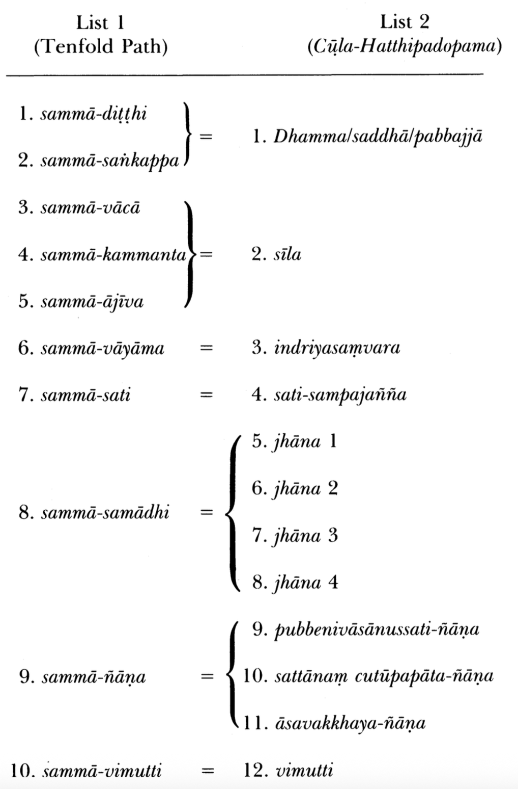
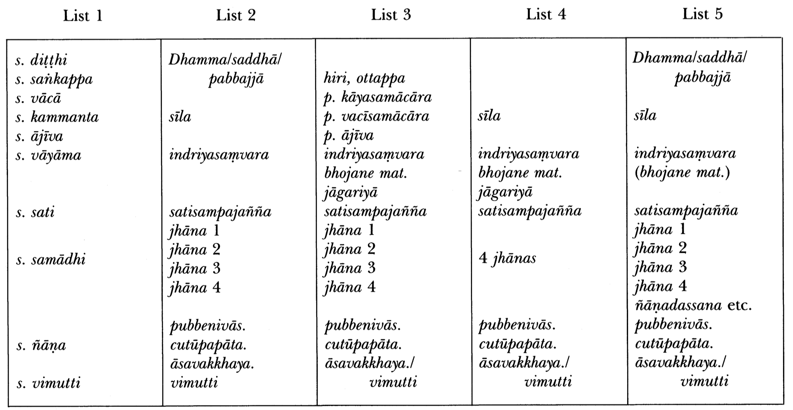
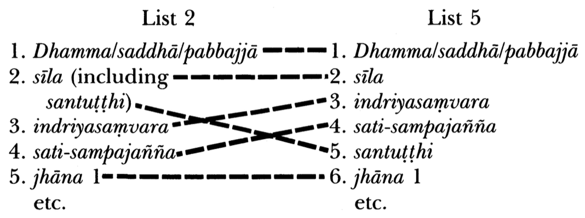
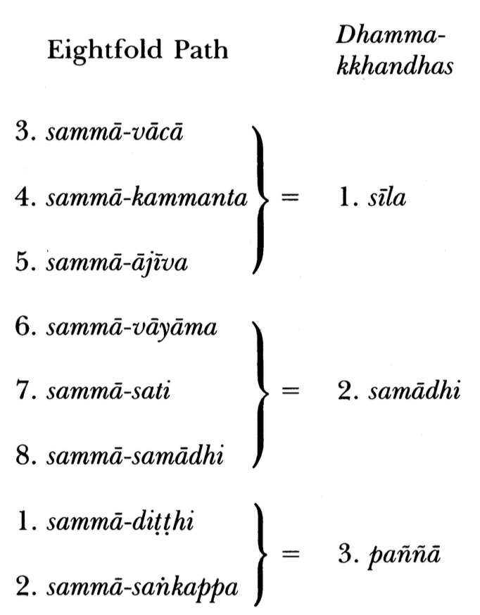
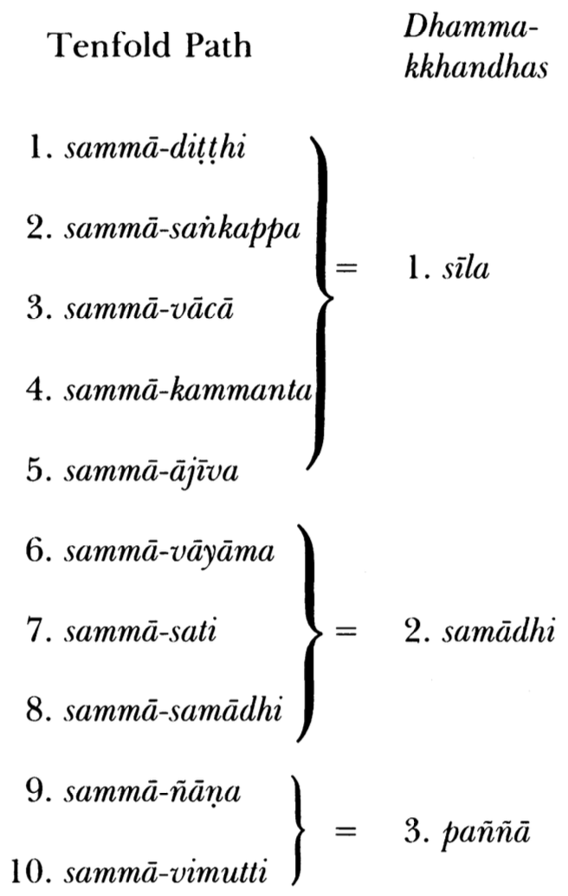
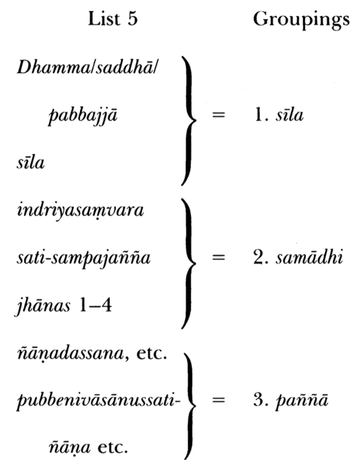

# The Buddhist Path to Liberation: An Analysis of the Listing of Stages[^*] 

by Rod Bucknell

JIABS Vol 7 Issue 2 pp. 7-40

The noble eightfold path (ariya atṭangika magga) is generally considered, by practising Buddhists and scholars alike, to be a complete summary of Gotama's course of practice leading to the cessation of suffering. However, there are in the Tipiṭaka several other lists of stages which are demonstrably also statements of that course of practice, and which, while broadly resembling the eightfold path, differ from it in omitting certain stages and/or including certain others. In this paper, a selection of these alternative lists of stages is subjected to a comparative analysis, some aspects of Gotama's course of practice are reinterpreted accordingly, and it is argued that the noble eightfold path does not entirely deserve the high status usually accorded it. [^1]

Five lists of stages, chosen for their overall resemblance to the eightfold path, are dealt with. They are drawn from the first four nikäyas of the Sutta-piṭaka. List 1 occurs there some sixty times, List 2 three times, Lists 3 and 4 each occur once only, and List 5 occurs ten times. However, the importance of these lists of stages is considerably greater than their relatively infrequent occurrence would suggest, as the analysis that now follows will demonstrate.

## List 1

The most obvious candidate for inclusion in this comparative study is the following list of ten stages, found in each of the first four nikäyas. [^2] It differs from the eightfold path only in having two further items following right concentration:

| No | Item |
| --: | :-- |
| 1. sammā-ditṭhi | (right view) |
| 2. sammā-sañkappa | (right aspiration) |
| 3. sammā-vācā | (right speech) |
| 4. sammā-kammanta | (right action) |
| 5. sammā-ājīva | (right livelihood) |
| 6. sammā-vāyāma | (right effort) |
| 7. sammā-sati | (right mindfulness) |
| 8. sammā-samādhi | (right concentration) |
| 9. sammā-ñāna | (right insight) |
| 10. sammā-vimutti | (right liberation). |

This list is given various names-"the noble path," "the ten qualities of an adept," "the ten states conducing to the ending of the cankers (āsavas)," etc. [^3] Here, it will be called, for convenience, "the tenfold path."

At some of its occurrences, the tenfold path is stated to be superior to the eightfold path. For example, in the Maggasamyutta Gotama says:

> I will teach you, monks, the worthy and the still more worthy than the worthy. . . . And who, monks, is the worthy? Herein, monks, a certain one has right view, right aspiration, . . . right concentration. This one, monks, is called "the worthy." And who, monks, is the still more worthy than the worthy? Herein, monks, a certain one has right view, right aspiration, . . . right concentration, right insight, right liberation. This one, monks, is called "the still more worthy than the worthy." [^4]

Similarly, in the Mahācattārīsaka-sutta, the only sutta that deals with the tenfold path at any length, a listing of the ten maggangas or path-factors is followed immediately by the statement: "In this way, monks, the course of the learner (sekha) is possessed of eight components, and that of the perfected one (arahant) of ten components." [^5] In addition, as C.A.F. Rhys Davids pointed out half a century ago, [^6] the Añguttara implicitly assigns superior status to the tenfold path by discussing it far more frequently: while in the Eights the eightfold path is listed only twice, [^7] in the Tens the tenfold path is listed no fewer than fiftyfour times. [^8]

The existence of this tenfold path suggests that the eightfold path is incomplete. Unfortunately, the Tipitaka contains no detailed stage-by-stage explanations of the tenfold path comparable to those given for the eightfold path; [^9] the two extra path-factors, sammā-ñāṇa and sammā-vimutti, are nowhere explained. It seems safe to infer that the tenth factor, sammāvimutti (right liberation), refers to the summum bonum, nibbāna. If this suggestion is correct, the absence of sammā-vimutti from the eightfold path is no real defect, since-it can be arguedthe path is the way to the final realization and therefore need not include that realization. There remains, however, the ninth factor, sammā-ñāṇa (right insight, or wisdom, or knowledge). This factor appears to be of crucial importance. Its name indicates that it has to do with the development of intuitive wisdom, a vital prerequisite to liberation; and its penultimate position in the list suggests that it is a very advanced stage, more advanced, for example, than mastery of the jhānas, with which sammāsamādhi (the eighth factor) is equated. [^10]

On this question of serial position in the list, the following paragraph from the Mahācattārīsaka-sutta is informative:

> As to this, monks, right view comes first. And how, monks, does right view come first? From right view proceeds right aspiration, from right aspiration proceeds right speech, from right speech proceeds right action, from right action proceeds right livelihood, from right livelihood proceeds right effort, from right effort proceeds right mindfulness, from right mindfulness proceeds right concentration, from right concentration proceeds right insight, from right insight proceeds right liberation. [^11]

The path is therefore sequential; the order of listing represents the sequence in which the factors are developed in practice. [^12] This sequence is more or less as one would expect, with more fundamental and straightforward practices preceding more specialized and sophisticated ones. For example, while the major moral precepts (stages $3,4,5$ ) apply even to lay followers practising at a relatively elementary level, the jhānas (stage 8) are normally practised only by monks; and the development of right insight (stage 9) would imply a high degree of spiritual advancement. (The status of right view (stage 1) in this respect is less evident; it will be discussed below.)

The Mahācattārīsaka-sutta also indicates that the path series is cumulative; factors already established are maintained as new, more advanced factors are developed, at least as far as right concentration:

> And what, monks, is ariyan right concentration with its causal associations and accompaniments? It is this: right view, right aspiration, ... right mindfulness; whatever mental onepointedness, monks, is accompanied by these seven, this is called ariyan right concentration with its causal associations and accompaniments. [^13]

This, too, is as one would expect. Clearly, the monk does not, for example, abandon right livelihood (stage 5) in order to give all his attention to right effort (stage 6); rather, his right livelihood facilitates his right effort and is in turn enhanced by it. The path is therefore both sequential and cumulative.

From this, it is clear that the ninth factor, right insight, is developed after right concentration, that is, after the jhānas have been mastered. This is in keeping with the sequence implied in the various extant broad outlines of the Buddhist course of practice, for example the often-stated threefold division into sīla, samādhi, and pañ̃ña (morality, concentration, and insight), [^14] and the twofold division into samatha and vipassanā (tranquillity meditation and insight meditation); [^15] insight always comes after concentration.

The above discussion suggests that the eightfold path, lacking right insight, is incomplete. However, it may be that right insight is not (as implied above) an active practice to which the meditator must direct his energies after he has mastered right concentration. Perhaps it is, like right liberation, a fruit of the practice of the preceding eight stages, something that will arise spontaneously once the eight have been perfected-in which case its omission from the path is no real defect. Accounts of the tenfold path throw no light on this question, since they never explain the individual stages. Some understanding of the nature of right insight can, however, be arrived at through comparison with other lists of stages, as will now be shown.

## List 2

The second of the five lists to be considered occurs at three different places in the Majjhima. [^16] Its three occurrences are identical as regards content, though differing slightly in mode of presentation. We examine first the presentation in the Cūla-Hatthipadopama-sutta, the Lesser Discourse on the Simile of the Elephant's Footprints. [^17] That sutta relates how a brahman named Jāṇussoṇi goes to see Gotama after hearing his attainments praised in terms of a simile: Just as an elephant-tracker, seeing in the forest a great footprint, long and broad, knows that a great elephant has passed that way, so people seeing the "footprints" of the Tathāgata know him to be a fully self-awakened one. Gotama explains to Jāṇussoṇi the nature of these "footprints" by describing a series of twelve stages in an aspirant's progress to liberation. The series may be summarized as follows. [^18]

1. Dhamma/saddhā/pabbajjā: A layman hears a Buddha teach the Dhamma, comes to have faith in him, and decides to take ordination as a monk.
2. sīla: He adopts the moral precepts.
3. indriyasaṃvara: He practises "guarding the six sense-doors."
4. sati-sampajañña: He practises mindfulness and self-possession (actually described as mindfulness of the body, kāyānussati).
5. jhāna 1: He finds an isolated spot in which to meditate, purifies his mind of the hindrances (nīvarana), and attains the first rūpa-jhāna.
6. jhāna 2: He attains the second jhāna.
7. jhāna 3: He attains the third jhāna.
8. jhāna 4: He attains the fourth jhāna.
9. pubbenivāsānussati-ñāna: He recollects his many former existences in saṃsāra.
10. sattānaṃ cutūpapāta-ñāna: He observes the death and rebirth of beings according to their karmas.
11. āsavakkhaya-ñāna: He brings about the destruction of the āsavas (cankers), and attains a profound realization of (as opposed to mere knowledge about) the four noble truths. [^19]
12. vimutti: He perceives that he is now liberated, that he has done what was to be done.

The description of stage 5 (jhāna 1) begins with a résumé of the preceding three stages: "Equipped with this ariyan moral conduct [stage 2], equipped with this ariyan guarding of the sensedoors [stage 3], equipped with this ariyan mindfulness and selfpossession [stage 4], he...." This affirms the cumulative nature of the series up to that point. The description of each of the stages 5 to 12 concludes with the statement: "This, brahman, is a footprint of the Tathāgata. . . ." There are, therefore, eight "footprints."

To discover how this series of stages relates to the tenfold path, the two lists will now be compared, item by item, making use of Gotama's definitions of the path-factors as given in the Mahā-Satipaṭthāna-sutta. [^20]

Stage 1 in the "footprint" series has three components: (i) hearing a Buddha teach, (ii) coming to have faith in him, and (iii) deciding to take ordination as a monk. Of these, (i) and (ii) imply acquiring a basic knowledge of, and confidence in, the Buddha's teaching. Now the first factor of the tenfold path, sammā-dittthi (right view), is defined as knowledge about the four noble truths. [^21] Since the four noble truths constitute the essence of the Buddha's teaching, it follows that the first pathfactor, sammā-dittthi, is functionally equivalent to components (i) and (ii) of stage 1 in the "footprint" series. [^22]

The second path-factor, sammā-sainkappa (right aspiration or resolve), is defined as aspiration towards renunciation, nonhatred, and non-harming. Of these three, the second and third (aspiration towards non-hatred and non-harming) are expected of all Buddhists, being presupposed in the adoption of the sillas. The first (aspiration towards renunciation) is less generally expected, being the essence of the decision to become a monk. The first aspect of right aspiration is therefore equivalent to component (iii) of stage 1 in the "footprint" series. It follows that stage 1 of List 2 is broadly equivalent to the first and second path-factors together.

Stage 2 of List 2, adopting the moral precepts (silla), corresponds to right speech, action, and livelihood together, that is, to the third, fourth, and fifth path-factors.

Stage 3, guarding the six sense-doors, consists, according to the sutta, in preventing the arising of unskilful mental states in response to stimuli received through the six senses. Now the sixth path-factor, sammā-vāyāma (right effort), is defined as the practice of the four padhānas (exertions): (i) preventing the arising of unarisen unskilful mental states, (ii) eliminating already arisen unskilful states, (iii) encouraging the arising of unarisen skilful states, and (iv) consolidating already arisen skilful states. The first of these four is identical with guarding the sensedoors. Consequently, stage 3 corresponds to the first component of the sixth path-factor.

Stage 4, mindfulness and self-possession, is actually described as mindfulness of the body, that is the first of the four components of the seventh path-factor, sammā-sati. (The remaining three are mindfulness of feelings (vedanā), mind (citta), and dhammas.)

Stages 5 to 8 cover the development of the four jhānas. These four are therefore collectively equivalent to the eighth path-factor, sammā-samādhi, which is defined as mastery of the jhānas.

Stages 9 to 12 are described in the sutta as follows. [^23]

Stage 9:

> Thus with the mind composed, quite purified, . . . immovable, he directs and bends down his mind to the knowledge and recollection of former habitations. He recollects a variety of former habitations, thus: one birth, two births, three . . . four . . . five . . . ten . . . twenty . . . thirty . . . forty . . . fifty . . . a hundred . . . a thousand . . . a hundred thousand births, and many an eon of integration, and many an eon of disintegration, and many an eon of integration-disintegration: "Such a one was I by name, having such and such a clan, such and such a colour, so was I nourished, such and such pleasant and painful experiences were mine, so did the span of life end. Passing from this, I came to be in another state where I was such a one by name, . . . so did the span of life end. Passing from this I arose here." Thus he recollects divers former habitations in all their modes and detail.

Stage 10:

> With the mind composed, . . . he directs and bends down his mind to the knowledge of the passing hence and the arising of beings. With the purified deva-vision surpassing that of men, he sees beings as they pass hence or come to be; he comprehends that beings are mean, excellent, comely, ugly, well-going, ill-going, according to the consequences of deeds, and thinks: "Indeed these worthy beings who were possessed of wrong conduct in body, speech, and mind, . . . at the breaking up of the body after dying, have arisen in a sorrowful state, a bad bourne, the abyss, Niraya Hell. But these worthy beings who were possessed of good conduct in body, speech, and mind, . . . at the breaking up of the body after dying, have arisen in a good bourne, a heaven world." Thus with the purified deva-vision surpassing that of men does he see beings as they pass hence and as they arise.

Stage 11:

> With the mind composed, . . . he directs and bends down his mind to the knowledge of the destruction of the cankers. He realizes as it really is: This is suffering. . . . This is the arising of suffering. . . . This is the cessation of suffering. . . . This is the course leading to the cessation of suffering. He realizes as it really is: These are the cankers. . . . This is the arising of the cankers. . . . This is the cessation of the cankers. . . . This is the course leading to the cessation of the cankers.

Stage 12:

> Knowing thus, seeing thus, his mind is freed from the canker of sense-pleasures, . . . of becoming, . . . of ignorance. In freedom the knowledge comes to be: I am liberated; and he comprehends: Destroyed is birth, brought to a close in the Brahma-faring, done is what was to be done, there is no more of being such or so.

These four stages of List 2 are together identical with the three supernormal knowledges (vijjās) that Gotama attained on the night of his enlightenment. In the Tipitaka, Gotama frequently recounts how, having stilled his mind by practising the
jhānas, he developed a series of three supernormal knowledges, one in each of the three watches of the night. [^24] The first knowledge is identical with stage 9 of List 2, the second with stage 10, and the third with stages 11 and 12 together.

In List 2, the set of three stages 9 to 11 is preceded by the jhānas and followed by liberation; and, similarly, in the tenfold path the ninth factor, sammā-ñāṇa, is preceded by the jhānas (sammā-samādhi) and followed by liberation (sammā-vimutti). Since, in addition, stages 9 to 11 all bear names ending in "-ñāṇa," it is clear that the three are together equivalent to the ninth path-factor, sammā-ñāṇa.

It follows from the above that Lists 1 and 2 are related as shown in Table 1. Some of the correspondences shown are only partial: indriyasaṃvara (guarding the sense-doors, stage 3 of List 2) is only the first of the four aspects of sammā-vāyāma (right effort); and, similarly, sati-sampajañña (stage 4) is only the first of the four aspects of sammā-sati. Nevertheless the correspondence is so close as to indicate that Lists 1 and 2 are differently worded accounts of a single course of practice. The two lists differ mainly in emphasis: List 1 tends to subdivide earlier stages (e.g., dividing sīla into three components), while List 2 tends to subdivide later stages (e.g., dividing sammā-ñāṇa into three).

A further correlation between Lists 1 and 2 has to do with their cumulative nature. List 2 is explicitly stated to be cumulative as far as jhāna 1 (stage 5); the description of that stage begins: "Equipped with this ariyan moral conduct, . . . guarding of the sense-doors, . . . mindfulness and self-possession, . . " Similarly, as noted above, the account of List 1 given in the Mahācattārīsaka-sutta indicates that the tenfold path is cumulative as far as right concentration. Thus, in both List 1 and List 2 the series is stated to be cumulative as far as the practice of the jhānas.

The above analysis of List 2 is based on the presentation found in the Cūla-Hatthipadopama-sutta. There exist two other presentations of List 2, which, however, differ only trivially from the above. In the Cūla-Sakuludāyi-sutta, [^25] the refrain "This, brahman, is a footprint of the Tathāgata . . ." is replaced by "This is a thing superior and more excellent, for the sake of realizing which monks fare the Brahma-faring under me"; and
this refrain occurs only seven times instead of eight, because stages 11 and 12 are combined into a single item. In the Kanda-raka-sutta [^26] there is no such refrain, so that it is unclear how many stages are recognized. But these are the only differences among the three occurrences of List 2; the total course of practice described is identical.

## List 3

In the Mahā-Assapura-sutta, Gotama instructs his monks in the "things that are to be done by recluses and brahmans," giving the following list. [^27]

1. hirilottappa: The recluse or brahman cultivates a sense of shame and fear of blame.
2. parisuddha kāya-samācāra: He cultivates pure conduct of body.
3. parisuddha vacī-samācāra: He cultivates pure conduct of speech.
4. parisuddha mano-samācāra: He cultivates pure conduct of mind.
5. parisuddha ājīva: He cultivates pure livelihood.
6. indriyasaṃvara: He guards the six sense-doors.
7. bhojane mattaññutā: He exercises restraint in eating.
8. jāgariyā: He practises wakefulness.
9. sati-sampajañña: He is mindful and self-possessed.
10. jhāna 1: He attains the first jhāna.
11. jhāna 4: He attains the fourth jhāna.
12. pubbenivāsānussati-ñāna: He recollects his former existences.
13. sattānaṃ cutūpapāta-ñāna: He observes the death and rebirth of beings.
14. àsavakkhaya-ñāna/vimutti: He destroys the āsavas, realizes the four noble truths, and perceives that he is liberated.

The description of stage 1 begins with the question: "And what, monks, are the things to be done by recluses and brahmans?"; and the descriptions of stages 2 to 10 begin with "And what, monks, is there further to be done?" For the remaining stages, 11 to 16 , this formula is lacking. There are, therefore, apparently ten "things to be done," of which the tenth com-
prises the four jhānas and the three knowledges, including liberation.

Each stage up to the ninth closes with a summary of the stages thus far completed:

Stage 1: "We are endowed with a sense of shame and fear of blame."

Stage 2: "We are endowed with a sense of shame and fear of blame; our conduct of body is quite pure."

Stage 3: "We are endowed with a sense of shame and fear of blame; our conduct of body is quite pure; our conduct of speech is quite pure."

And so on up to:

Stage 9: "We are endowed with a sense of shame and fear of blame; our conduct of body is quite pure; . . . we are intent on wakefulness; we are mindful and self-possessed. . . ."

No such summarizing formula is provided for stages 10 to 16. This situation resembles that already noted in Lists 1 and 2: the series is stated to be cumulative as far as jhāna 1.

Four of the stages of List 3, namely stages 1, 4, 7, and 8, introduce terms not encountered in Lists 1 or 2 . Stage 1 consists in cultivating a sense of shame (hiri) and fear of blame (ottappa). These two qualities are explained elsewhere as follows:

> He [the ariyan disciple] comes to have shame (hiri); he is ashamed of wrong conduct of body, of wrong conduct of speech, of wrong conduct of mind. . . . He comes to fear blame (ottappa); he fears blame for wrong conduct of body, for wrong conduct of speech, for wrong conduct of mind. . . . [^28]

Hiri and ottappa as described would clearly be conducive to adherence to precepts and conventional codes of morality; their position in List 3, immediately before the sīlas (stages 25), is therefore as one would expect. Again, hiri and ottappa have much in common with sammā-sañkappa of List 1 (aspiration towards non-harming, etc.), which similarly comes immediately before the sīlas. Stage 7, restraint in eating, is a special case of guarding the sense-doors-in effect "guarding the tastedoor." This is made clear in the concluding words of the textual description, which emphasize control of unskilful mental states: "Thus, I will eliminate old feeling and will not give rise to new feeling." [^29] It is, therefore, appropriate that in the list this stage is located next to guarding the sense-doors. Stage 8, wakefulness, is closely allied to both guarding the sense-doors and satisampajañña: the monk practising it attempts to cleanse his mind of obstructive states, and is described as sato sampajāno. [^30] Here, again, the position in the list is appropriate. Thus, each of the stages 1,7 , and 8 is located in the series where it seems logically to belong, and the three add little that is new.

The remaining new item, pure conduct of mind (parisuddha mano-samācāra, stage 4) is less straightforward. Being a mental discipline or condition, pure conduct of mind appears out of place among the physical sillas. That it should follow pure conduct of body and speech is not, in itself, anomalous, firstly because mental discipline (the samādhi group) always follows physical discipline (the silla group); and secondly because the triad "body, speech, and mind" (items 2, 3, and 4 of List 3) occurs frequently in sutta references to conduct. (It occurs, for example, in the explanation of hiri/ottappa quoted above, and in the description of the second knowledge, observing the death and rebirth of beings (stage 10 of List 2).) What is anomalous about the position of pure conduct of mind in List 3 is the fact that it is followed by pure livelihood; a mental discipline or condition is thus illogically located between two forms of physical discipline.

Pure livelihood is a widely recognized category of silla. Several suttas in the Dīgha describe the well-disciplined monk as ". . . equipped with skilful action of body and speech, pure in livelihood . . ."; [^31] and the silla section of the eightfold or tenfold path comprises right speech, action, and livelihood. There exist, therefore, two widely recognized triads relating to conduct: (i) pure conduct of body, speech, and mind; and (ii) right speech, action, and livelihood. The set of items 2 to 5 in List 3, in which pure conduct of body, speech, and mind is illogically followed by pure livelihood, therefore has the appearance of a hybrid, produced by combining these two triads thus:

| Triad (i) | + | Triad (ii) | → | Composite |
| :-- | :-: | :-- | :-: | :-- |
| pure conduct of body | | right speech | | pure conduct of body |
| pure conduct of speech | | right action | | pure conduct of speech |
| pure conduct of mind | | right livelihood | | pure conduct of mind   pure livelihood |

The likely significance of this will be considered below. First, however, we examine a second anomaly to be found in the early part of List 3. It concerns the item hiri/ottappa. In other lists where hiri and ottappa occur, they are invariably reckoned as two separate items-unlike, for example, sati-sampajañña, which is always reckoned as a single item. Examples are to be found in the pañca balāni (five powers): saddhā, hiri, ottappa, viriya, pañña (faith, shame, fear of blame, energy, insight), [^32] and the satta saddhammā (seven excellent qualities): saddhā, hiri, ottappa, bahussuta, viriya, sati, pañña (faith, shame, fear of blame, hearing much, energy, mindfulness, insight). [^33]

Two anomalies in the early part of List 3 have now been noted: (a) the illogical positions of pure conduct of mind and pure livelihood, suggesting a combination of the two familiar triads; and (b) the atypical treatment of hiri and ottappa as a single stage. These two anomalies are in one respect complementary: the first amounts to the addition of an extra stage, the second effectively reduces the total number of stages by one. This suggests that the two are perhaps associated aspects of a single textual corruption. The observed facts can be accounted for with the following hypothesis:

The list of ten "things to be done by recluses and brahmans" formerly began thus:

1. hiri
2. ottappa
3. pure conduct of body
4. pure conduct of speech
5. pure livelihood
6. guarding the sense-doors etc.

Monks responsible for memorizing and transmitting this list were also familiar with the triad of conduct in body, speech, and mind. Since the list contained the first and second members of this triad, they added the third member; and to compensate for the resulting increase in the number of "things to be done," they simultaneously combined hiri and ottappa into a single item. This corruption-which may have been carried out largely unconsciously-went undetected because the list occurred only once in the entire Tipiṭaka (in the Mahā-Assapurasutta). [^34] Hence the list as we now have it.

Even without allowing for textual corruption in the manner postulated above, it is evident that List 3 is essentially equivalent to Lists 1 and 2. This can readily be seen in Table 2, which sets out the lists in parallel. In its earlier part, List 3 more closely resembles List 1, recognizing the same broad division of sila; in its latter part, it more closely resembles List 2, giving the same full enumeration of the jhānas and knowledges. Thus, Lists 1,2 , and 3 represent, with certain differences in emphasis, one and the same course of practice.

## List 4

In the Sekha-sutta, Ānanda is called on by Gotama to teach a "learner's course" to a group of disciples. [^35] Ānanda begins by enumerating the stages 1 to 6 listed below. Then, after explaining them one by one, he states that an ariyan disciple who has completed this "learner's course" becomes "one for successful breaking through," like a chick that is ready to break out of the egg-shell. He then describes three "breakings through," making nine stages in all:

1. sila: An ariyan disciple adopts the moral precepts.
2. indriyasaṃvara: He guards the sense-doors.
3. bhojane mattaññutā: He exercises restraint in eating.
4. jāgariyā: He practises wakefulness.
5. satta saddhammā: He develops the seven "excellent qualities."
6. jhāna: He attains without difficulty the four jhānas.
7. pubbenivāsānussati-ñāna: He recollects his former existences.
8. sattānaṃ cutūpapāta-ñāna: He observes the death and rebirth of beings.
9. āsavakkhaya-ñāna/vimutti: He destroys the āsavas and perceives that he is liberated.

The clear division of the list into two sections (stages 1-6 and stage 7-9 ) is emphasized in several ways. First, there is a difference in the refrains which conclude the descriptions of the stages: stages 1 to 6 conclude with "It is thus, Mahānāma, that an ariyan disciple . . ."; while stages 7 to 9 conclude with "This is the first (. . . second . . . third) breaking through as a chick's from the egg-shell." Second, at the end of his discourse Ānanda states that stages 1 to 6 constitute carana (practice), while stages 7 to 9 constitute vijjā (insight, wisdom). Third, the description of stage 7 is prefaced with a résumé of the stages mastered thus far: "When, Mahānāma, an ariyan disciple is thus equipped with moral conduct, is one who thus guards his sense-doors, . . . is one who thus acquires at will, without trouble, without difficulty, the four jhānas, . . ."

The only item in List 4 that has not been encountered in earlier lists is satta saddhammā, the seven excellent qualities. The seven are given as saddhā, hiri, ottappa, bahussuta, viriya, sati, pañnaā (faith, sense of shame, fear of blame, hearing much, energy, mindfulness, insight), and each is briefly defined. (This list, and the definitions for hiri and ottappa, are as quoted above in the discussion of List 3.)

The presence of satta saddhammā in fifth position in List 4 disrupts an otherwise close correspondence with Lists 1, 2, and 3 ; the resemblance among the four lists would have been virtually complete had the fifth position of List 4 been occupied not by satta saddhammā but by sati-sampajañña. The item satta saddhammā is itself a list of separate items. Such lists within lists are common; for example, each of the stages sīla, sati-sampajañña, and sammā-samādhi embraces a set of sub-stages, which are often enumerated in full in the explanations accompanying lists. However, the case of the saddhammas is different in two important respects: (a) Two of the seven saddhammas duplicate stages already present in the larger list (i.e., in List 4 as a whole): viriya (energy) is described in the sutta as "for getting rid of unskilled mental states, for acquiring skilled mental states . . .", indicating that it duplicates guarding the sense-doors, stage 2 of List 4;[^36] and pañña (insight, wisdom) appears to duplicate stages 7 to 9, which Ānanda groups under the heading vijjā. (b) A further three of the seven saddhammas are inappropriately placed in the larger list: saddhā, hiri, and ottappa properly belong before sīla (stage 1 of List 4), as was shown in the discussion of Lists 2 and 3. Of the two remaining saddhammas, one, bahussuta (hearing much), has not been encountered before, and its status vis-à-vis the other stages is difficult to evaluate. The other, sati (mindfulness), is the only one of the seven that is located where it appears to belong, for as noted above, the satta saddhammā occupy the spot where one would expect to find sati-sampajañña.

The existence of the anomalies (a) and (b) above indicates that we probably have here another case of textual corruption. The superficial similarity of the terms satta saddhammā and satisampajañña suggests that the corruption may have taken place as follows: The "learner's course" formerly had, as its fifth stage, sati-sampajañña. Later, this term was accidentally replaced by the superficially similar satta saddhammā, either through mishearing in chanting or through misreading in the copying of manuscripts; and later again, as part of a general explicatory elaboration, a listing of the individual saddhammas was added. This corruption went unnoticed because List 4 occurred only once in the Sutta-pitaka.

If allowance is made for this postulated textual corruption, List 4 comes into close correspondence with Lists 1, 2, and 3. (See Table 2.) As regards content, it most closely resembles List 3, differing from it only in lacking hiri/ottappa. As regards the clear division into two sections, it is identical with List 1: in List 4 the stages up to and including the jhānas are referred to as the learner's course-also as carana (practice)-and set apart from the stages that follow them; and, as noted above, in List 1 the stages up to and including sammā-samādhi are similarly referred to as the learner's course-more commonly as the noble eightfold path-and set apart from the stages that follow them.

On the other hand, there is one respect in which List 4 disagrees with the other lists. In Lists 1, 2, and 3 the summaries of stages already mastered, which affirm the partially cumulative nature of the series, is prefaced to the jhānas; but, in List 4, it is prefaced to the first of the three knowledges, one stage lower in the series. In spite of this, it is apparent that List 4 is yet another statement of the same sequence of stages leading to liberation.

## List 5

The fifth and last list to be considered occurs in the Sāmañ-ñaphala-sutta [^37] and elsewhere (see below). Gotama, questioned by King Ajātasattu regarding the "fruits of the life of a recluse," replies with the following series of stages:

1. Dhamma/saddhā/pabbajjā: A layman hears a Buddha teach the Dhamma, comes to have faith in him, and decides to take ordination as a monk.
2. sīla: He adopts the moral precepts.
3. indriyasaṃvara: He guards the six sense-doors.
4. sati-sampajañña: He is mindful and self-possessed.
5. santutṭhi: He is content with his meagre robes and almsfood.
6. jhāna 1: He attains the first jhāna.

...

9. jhāna 4: He attains the fourth jhāna.
10. ñānadassana: He develops knowledge and insight into the nature of the body and into the distinction between it and the mind.
11. manomaya kāya: He practises calling up a mind-made body.
12. iddhividha: He develops certain miraculous physical powers, such as the ability to walk on water.
13. dibbasota: He develops the "divine ear," the ability to hear distant sounds.
14. cetopariya-ñāna: He acquires the "knowledge that penetrates others' minds."
15. pubbenivāsānussati-ñāna: He recollects his former existences.
16. sattānaṃ cutūpapāta-ñāna: He observes the death and rebirth of beings.
17. āsavakkhaya-ñāṇa/vimutti: He destroys the āsavas, realizes the four noble truths, and perceives that he is now liberated.

(Some texts add bhojane mattaññutā (restraint in eating) after indriyasaṃvara.)[^38]

The description of each of the stages 2 to 5 opens with the question "And how, O king, does the monk . . ?" and closes with the corresponding answer "Thus, O king, does the monk. . ." This question-and-answer format is then abandoned; each of the remaining stages, 6 to 17 , instead closes with the refrain, "This, O king, is an immediate fruit of the life of a recluse." Stages 2 to 5 are summarized in a preface to stage 6 (jhāna 1): "Equipped with this ariyan moral conduct [stage 2], equipped with this ariyan guarding of the sense-doors [stage 3], equipped with this ariyan mindfulness and self-possession [stage 4], equipped with this ariyan contentment [stage 5], he. . . "39 Thus, in this respect, List 5 is in complete agreement with Lists 1, 2, and 3.

List 5 contains six stages not found in the other four lists. The first of them is stage 5, santutthi (contentment), described as a readiness on the part of the monk to make do with his meagre robes and alms-food, travelling everywhere with them, as a bird with its two wings. [^40] Actually, a paragraph identical in wording with the description of this stage does occur in List 2; however, it is not there recognized as a separate stage, but, instead, is included as the last of the many sub-items under the heading silla. [^41] The relationship between Lists 2 and 5 in respect of santutthi is, therefore, as shown in Table 3. This situation suggests that in one or the other of these two lists santutthi has been shifted. However, it is not easy to say which of the two positions of santutthi is more appropriate and therefore likely to be the earlier. On the one hand, santutthi is of a type with the sillas since it has to do with two of the monk's basic requisites, his robes and his alms-food-whence it is appropriately placed, as in List 2; and on the other hand, santutthi appears to be a form of mental discipline, resembling the elimination of the mental hindrances (nšvaraṇa), which is a prerequisite to the attainment of the first jhāna-whence its position in List 5 seems equally appropriate. Thus, on this criterion, neither of the two lists can be seen as more likely to have preserved the earlier arrangement. It may be that in an earlier form of List 5 santutthi was combined with silla as in List 2, and later became separated from it and shifted to a new position two places further down the list; or it may be that the shift took place in the reverse direction in the development of List 2. Examination of other lists containing santutthi does little to clarify the matter. There exists a list (it departs too widely from the "path" pattern to be eligible for inclusion in the present study), in which santutthi is located between viriya ( = indriyasaṃvara) and sati. [^42] This position is intermediate between those of List 2 and List 5, which lends support to the suggestion that santutthi has undergone a shift. However, the question whether the movement was upwards or downwards in the series remains unresolved. [^43]

The remaining five new items in List 5, grouped as stages 10 to 14 between the jhānas and the three knowledges, are all supernormal powers. They are said to be possessed by the Buddha; however, their importance in the attaining of enlightenment and liberation is doubtful. According to Gotama's frequently repeated account of his own enlightenment, [^44] he proceeded directly from mastery of the jhannas (stage 9 of List 5) to recollection of his former existences (stage 15); no mention is made there of attainments corresponding to stages 10 to 14 . In the case of the iddhis (stage 12), Gotama actually warns against their practice as dangerous and a potential obstruction to progress. For example, in the Kevaddha-sutta he says: "It is because I see danger in the practice of the iddhis that I loathe and abhor and am ashamed of them." [^45] It therefore appears that the five items 10 to 14 are optional extras rather than essential stages on the path to liberation. [^46]

If we bracket out these five items, as well as the inconsistent stage 5 , santutthi, the result is a sequence indentical with that of List 2. (Those versions of List 5 which add bhojane mattaññutā after indriyasaṃvara are in that respect in agreement with Lists 3 and 4. See Table 2.)

List 5 is repeated in nine other suttas, all grouped with the Sāmaññaphala in the Silakkhandha-vagga of the Dīgha. [^47] The list therefore dominates that vagga, occurring in ten of its thirteen suttas (suttas 2-8,10-12). However, as is usual in cases where a list is reiterated in closely grouped suttas, needless repetition of lengthy portions of text is avoided by liberal use of the abbreviatory device *pe*, the Pali equivalent of our sign ". . ." (Since List 5, with its many sub-lists and explanations, extends over some twenty pages of text, the saving in space is considerable.) The list is therefore set out in full only at its first occurrence, that is, in the Sāmaññaphala. In effect, then, List 5 occurs only once in the Tipiṭaka, a fact that is relevant to the question of possible textual corruption involving santutthi. The only noteworthy differences among the ten occurrences of List 5 have to do with the mode of division into groups of stages. Mostly, the division is as in the Sāmaññaphala, with a clear split after stage 5; however, in three suttas it is different. In the Ambattha-sutta there is a split into two groups of stages, 1-9 and 10-17, called, like their counterparts in List 4, carana and vijjā respectively; [^48] and, in the Kassapasīhanāda- and Subha-suttas, there is a split into three groups, 1-2,3-9, and 10-17, called respectively sīla, samādhi (or citta-sampadā), and pañ̃̃ā. [^49] The significance of these groupings will be considered below.

## Summary and assessment 

This completes the preliminary comparison of Lists 1 to 5. The demonstrated relationships among them are summarized in Table 2. There, Lists 3 and 4 are shown as they would have been before the postulated corruptions, and List 5 is shown with the inconsistent santutthi omitted.

To conclude on the basis of Table 2 that the five lists are essentially identical entails a certain circularity of argument: the far-reaching correspondence apparent in the table is in part a consequence of minor modifications to Lists 3, 4, and 5 to correct for postulated textual corruptions; and it is in part in order to account for observed departures from perfect correspondence that those corruptions are postulated. However, observed departures from perfect correspondence are not the only basis for the inference that there has been textual corruption in some of the lists. In each case, there exist associated anomalies sufficient in themselves to indicate corruption, as well as conditions that clearly would have been conducive to corruption. Thus, in List 4, which has the seven saddhammas where the other four lists have mindfulness and self-possession, there exists the associated anomaly that two of the seven saddhammas duplicate stages already present in the list, while a further three are inappropriately located in the total sequence; and the superficial resemblance between the terms satta saddhammā and sati-sampajañña, combined with the fact that List 4 occurs only once in the Tipitaka, provides an adequate basis for explaining how the corruption could have come about. As an interpretative procedure, postulating textual corruption is naturally to be used only with caution. The subjective element which such postulation necessarily entails is minimized by the technique adopted here of comparing several broadly similar lists of items. The present study thus illustrates a methodology that may prove more generally applicable as an objectively based means for identifying corruptions in Buddhist texts.

Even after allowance has been made for textual corruption, there remain several factors tending to mask the essential identity of the five lists shown in Table 2. The most obvious one is inconsistency in terminology: often one and the same practice or attainment is referred to by different terms. Some of the synonymies are self-evident and trivial, for example, "sammā sati (List 1) = sati-sampajañña (Lists 2-5)." Others become apparent only when reference is made to the available definitions, for example, "sammā-vāyāma (List 1) = indriya-saṃvara (Lists 2-5)= viriya (one of the seven saddhammas)." Recognizing such synonymies is clearly an important step in interpreting Buddhist doctrine. It is greatly facilitated by the comparative procedure adopted here.

A second obscuring factor is variation, from list to list, in the degree of fineness with which the total course of practice is divided up. For example, where List 1 has the single stage sammā-samādhi, Lists 2, 3, and 5 each recognize four stages, jhāna 1, . . jhāna 4. In this case, the needed equation, "sammāsamādhi = the four jhānas," is readily established, thanks to definitions provided in the texts. However, in the case of less well documented practices it is not so simple. An important example is the equation, "sammā-ñāna (List 1) = the three knowledges (Lists 2-5)." This identity, though it can be inferred with some confidence, is not immediately apparent, and consequently has hitherto not been generally recognized.

In the case of the last-mentioned identity, another obscuring factor is inconsistency in the treatment of the final attainment, vimutti. In List 1, and in the Cūla-Hatthipadopama presentation of List 2, vimutti is set apart as a separate stage; elsewhere, it is comprehended under the third knowledge. This kind of inconsistency is widespread. For example, Lists 3 and 4 (and variant versions of List 5 as well) have restraint in eating (bhojane mattaññutā) as a separate stage following guarding the sense-doors, of which it is a special case. The result is an appearance of difference between lists where no real difference exists. This phenomenon accounts also for the lack, in List 4, of an evident counterpart for the stage Dhamma/saddhā/pabbajjā of Lists 2 and 5: the seemingly missing stage is in fact comprehended under sila. Evidence that this is so comes from two sources. The first is the mode of grouping the stages of List 5 as presented in the Kassapasīhanäda- and Subha-suttas. There, as noted above, the stages are recognized as falling into three groups, termed silla, samādhi (or citta-sampadā), and pañña, the first point of division being located after the stage silla, and the second after jhāna 4. The silla group, therefore, embraces the stages Dhamma/saddhā/pabbajjā and silla-from which it is evident that Dhamma/saddhā/pabbajjā was regarded not as a separate stage but as a subdivision of the stage silla. The second source of evidence is the fact that the cumulative summaries for Lists 2 and 5 do not include an item Dhamma/saddhā/pabbajjā. This indicates again that hearing a Buddha teach the Dhamma, coming to have faith in him, and deciding to become a monk were reckoned as subsumed under the heading of silla. All of this serves to point out that the recognizing (in the early part of this study) of Dhamma/saddhā/pabbajjā as a stage distinct from silla, was merely an expedient device designed to reduce the lengthy textual accounts to a manageable form. While it seems reasonable that hearing a Buddha teach, and so on, should be recognized as a stage distinct from adoption of the moral precepts, it appears that the compiler(s) of the lists saw it otherwise: in the texts those earliest experiences and practices of the aspirant are treated as part of the stage silla.

In view of the existence of so many obscuring factorsalong with the textual corruptions identified earlier-it is little wonder that the essential identity of the lists in question has hitherto generally escaped notice. Nevertheless, the overriding consistency among the five lists is unmistakable.

A striking example of this consistency is to be found in the cumulative summaries which are provided with all of the five lists. Except in List 4, the summaries consistently embrace all stages from the beginning down to the first jhāna. The probable significance of this fact becomes apparent when one considers what the higher stages of the path would entail in practical terms. A monk practising the jhannas or the three knowledges would still be possessed of silla, guarded sense-doors, and mindfulness. However, whereas the attainment of the first jhāna would not entail abandoning these earlier stages, attainment of the second jhāna would entail abandoning the first jhāna. So much can be inferred from accounts of the jhānas: the factor vitakka-vicāra, present in jhāna 1, is absent from jhāna 2; [^50] jhānas 1 and 2 cannot, therefore, be practised simultaneously. Similar reasoning applies for the remaining jhannas. In the transition from the jhannas to the first of the three knowledges, much the same situation appears to exist. Descriptions of the first knowledge indicate rich and varied mental content (detailed memories of former existences); [^51] the attaining of this knowledge, therefore, clearly entails abandoning the mental onepointedness (cittass' ekaggatā) of the jhānas. [^52] These admittedly speculative inferences regarding the nature of the higher practice are in keeping with the fact that the cumulative summaries accompanying the lists extend as far as the first jhāna but not beyond it. The exceptional case of List 4 , in which the summaries extend to the first knowledge, remains unexplained.

The reasoning presented in the preceding paragraph indicates that the first jhāna is in one respect a pivotal point in the course of practice. As far as the first jhāna, the series is cumulative: each stage is added to its predecessors; thereafter, the series is partly substitutive: each stage replaces its immediate predecessor. This may explain why, in three of the five lists, there is a marked difference in the mode of presentation beginning with jhāna 1. In List 2, the term "footprint of the Tathāgata" is applied to each of the stages from jhāna 1 to the end, but not to the stages preceding jhāna 1 ; in List 3 each of the stages up to and including jhāna 1 , but none of the stages following it, is described as a "thing to be done"; and, in List 5 as presented in the Sāmaññaphala-sutta, the term "fruit of the life of a recluse" is applied to each of the stages from jhāna 1 to the end but not to the stages preceding it. (The same phenomenon is found in five other suttas containing List 5, though different terms are used.)[^53]

This recognizing of the stages beginning with jhāna 1 as constituting a group apart from the remainder is not found in Lists 1 and 4 ; there, as noted earlier, it is the stages following jhāna 4, i.e., the three knowledges and vimutti, that are set apart. The lists examined therefore divide up the total course of practice in two main ways. One way (List 2, List 3, and most versions of List 5) is apparently intended to emphasize the transition, at jhāna 1 , from a cumulative series to a substitutive; the other (List 1, List 4, and some versions of List 5) is apparently intended to emphasize the unique and very advanced nature of the three knowledges and resulting liberation.

This last point is relevant to a suggestion made early in this paper regarding the noble eightfold path: as a summary of Gotama's course of practice, the eightfold path, lacking as it does the stages sammā-ñāṇa and sammā-vimutti, appears to be incomplete. This raises the problem why this incomplete account of the course of practice should have been given so much prominence in the Tipitaka.

One possible explanation would be that right insight (sammā-ñāṇa), despite its seemingly crucial importance in the course of practice, perhaps does not really need to be mentioned. This would be the case if, as many present-day Buddhists assume, the three knowledges are not meditative techniques which the meditator must take up after mastering the jhannas, but, instead, are spontaneously arising insights which come of themselves once the mind has been properly prepared for them through jhāna practice. This possibility appears, however, to be incompatible with the nature of the three knowledges as described in the texts. The Tipitaka account of recollection of former existences (the first of the three), though too brief to provide much guidance on this point, does suggest an effortful, intentional practice: ". . . he directs and bends down his mind (cittam abhinīharati abhininnämeti) to the knowledge and recollection of former habitations. . ."54 The more detailed Visuddhimagga account does make clear that the practice entails a systematic, active attempt to recall past experiences, and gives practical advice on how this should be done. [^55] The notion that insight will arise spontaneously once the jhannas have been perfected also appears to be at odds with the recognition of insight meditation (vipassanā) as a discrete mode of practice following on, and superior to, concentration practice (samatha). Again, if insight arises spontaneously in the manner suggested, then there is nothing to distinguish Gotama's course of practice from those of his early teachers (from whom he learnt the jhannas), or, indeed, from those of the meditative yoga schools, in which the perfecting of jhāna is the principal practical goal. [^56] It was precisely its emphasis on insight as an achievement superior to jhāna that set Gotama's teaching apart from those of other samanas. As Pande rightly says, "His [Gotama's] originality appears to have consisted in the association of Samādhi and Pañna in order to advance from the Jhānas to the Three Vijjās and Sambodhi." [^57] Clearly, this advance from the jhannas to the three vijjās (knowledges) does not come about spontaneously.

A second possible explanation for the high status accorded the eightfold path is provided by the widely accepted notion that insight (paññā) is covered by the first stage, sammā-dittthi (right view). [^58] This interpretation is rendered superficially plausible by the fact, noted earlier, that the texts equate sammādittthi with knowledge of the four noble truths. However, the knowledge of the four noble truths with which sammā-dittthi is identified is merely described as dukkhe ñanam, dukkhasamudaye ñanam, . . .-knowledge about suffering, knowledge about the arising of suffering, etc. [^59] By contrast, the knowledge of the four noble truths which characterizes enlightenment, that is which comes with the third of the three knowledges, is described thus: So idaṃ dukkhan ti yathābhūtaṃ pajānāti, ayaṃ dukkhasamudayo ti yathābhūtaṃ pajānāti . . .-He knows as it really is, "This is suffering"; he knows as it really is, "This is the arising of suffering"; etc. [^60] This second description indicates a penetrating and direct realization, very different from the mere "knowledge about" represented by sammā-dittthi. This suggests that sammā-dittthi is an intellectual understanding of the truths sufficient to motivate a beginner to set out on the path, while sammā-ñāna (as perfected in the third knowledge) is the direct inner realization of the truths which brings liberation.

Those who would equate sammā-dittthi with the paññā group usually account for the anomaly that sammā-dittthi comes first in the eightfold path rather than last by maintaining that the order of listing the path-factors is without significance: the eight factors, it is said, must be developed together rather than in a definite sequence. [^61] However, this claim conflicts with the textual statements, quoted in the analysis of List 1, regarding the sequential-and partly cumulative-nature of the path. It also conflicts with the abundant evidence provided by Table 2 for the importance of sequence in the course of practice.

The notion that sammā-dittthi, the first-named stage of the eightfold path, corresponds to the attainment of paññā (insight) is of great antiquity, appearing already in the Cūla-Vedallasutta. [^62] In that sutta, a nun named Dhammadinnā is asked to explain how the eightfold path is related to the well-known division of the practice into three categories, sīla, samādhi, and pañ̃̃a (moral discipline, mental discipline, and insight). She answers that the two are related as shown in Table 4. This explanation entails a distortion of the sequence of listing: the first two path-factors have to be transferred to the end of the list. In spite of this, Dhammadinnā's interpretation has been widely accepted by commentators down to the present day. [^63]

From the foregoing discussion it is evident that the cause of the difficulty lies in the absence of the vital ninth and tenth stages. When one considers the tenfold path rather than the eightfold, it becomes clear that the true correspondences are as shown in Table 5. [^64] Support for this interpretation is to be found in the Kassapasīhanäda- and Subha-suttas. As noted above, those two suttas group the stages of List 5 into three sections as shown in Table 6. This mode of division is identical with that proposed here for the tenfold path.

There is a third possible explanation for the prominence given in the Tipitaka to the incomplete eightfold path. It may be that Gotama recognized that the practice of right insight (samma-ñāṇa) was too difficult for most people, and therefore intentionally omitted it from his discourses except when instructing monks already well advanced in meditation. The eightfold path would thus have been the popular version, while the tenfold path (or its equivalents, Lists 2 to 5) was taught only to elite groups of advanced practitioners. This suggestion, however, raises some difficult and controversial issues which cannot be pursued further here. [^65]

The present study has shown that the eightfold path is but one of several differently worded statements of Gotama's course of practice leading to liberation. Five alternative lists of stages have been examined; however, a preliminary survey of the Sutta-pitaka indicates the existence of a further forty or more lists, all representing more or less completely the same path to liberation, and therefore all eligible for inclusion in an expanded version of the analysis presented here. [^66] (The seven saddhammas and the five powers, both discussed earlier, are examples. [^67] It appears, then, that in teaching his path of practice, Gotama made use of many different, though essentially equivalent, summarizing lists of stages, but that for some unclear reason one of those lists, the noble eightfold path, was favoured by his followers to such an extent that it came to overshadow completely the many alternative versions.

Perhaps more important than the above specific conclusions regarding the textual accounts of the path is the demonstration of the efficacy of the methodology employed. It has been shown that comparison of broadly similar lists of stages can be a powerful tool in Buddhist textual analysis. Though applied here to a sample of just five lists, the technique is demonstrably applicable to the wider corpus of lists mentioned above, and to a variety of other lists of doctrinal items as well.

Table 1. Correspondences between Lists 1 and 2.

Table 2. Correspondences among the five lists. Lists 3 and 4 are shown as they would have been before the postulated corruptions came about, and List 5 is shown with the inconsistent santuṭ̣hi omitted.

Table 3. Position of santutṭhi in Lists 2 and 5.

Table 4. Correspondence between the eightfold path and the three dhammakkhandhas, according to Dhammadinnā.

Table 5. Proposed correspondence between the tenfold path and the three dhammakkhandhas.

Table 6. Groupings of stages according to the Kassapasīhanādaand Subha-suttas.

## NOTES 

[^*]: I am grateful to N. Ross Reat and Martin Stuart-Fox of the University of Queensland for reading an earlier draft of this paper and offering valuable suggestions for improvement.

[^1]: The noble eightfold path (sammā-ditthi, -sañkappa, -vācā, -kammanta, -ājīva, -vāyāma, -sati, -samādhi), as the fourth of the four noble truths realized by Gotama in his enlightenment, figures prominently in the "first sermon" (S v 420-425 ) and many other suttas. The high status accorded it therefore appears, on the surface, well deserved.
[^2]: D ii 217 , iii 271,291,292, M i 44,446-447, ii 29 , iii 76 , S ii 168 , v 20 , A ii 89 , v 212-310. Translations are my own unless otherwise stated.
[^3]: A v 244,222,237.
[^4]: S v 20 .
[^5]: M iii 76 .
[^6]: C.A.F. Rhys Davids, Introduction to vol. 5 of The Book of the Gradual Sayings (Añguttara-nikāya), transl. F.L. Woodward (London: Luzac \& Co., 1955), pp. x-xi.
[^7]: A v 189,346 .
[^8]: A v 212-310. In most cases, however, the list appears merely as "sammā-ditthi . . . pe . . . sammā-vimutti" and is accompanied by only one or two lines of text.
[^9]: E.g., at D ii 312-313.
[^10]: D ii 313 .
[^11]: M iii 75-76.
[^12]: This statement appears to conflict with the widely held view, early expressed by the nun Dhammadinnā (M i 301), that the first two path-factors, sammā-ditthi and sammā-sañkappa, are equivalent to the third dhammakkhandha, pañ̃̃a. This question will be discussed toward the end of the analysis.
[^13]: M iii 71 .
[^14]: D i 206 etc.
[^15]: D iii 273 etc.
[^16]: M i 179-184, 344-348, ii 38-39.
[^17]: M i 175-184.
[^18]: The terms Dhamma/saddhā/pabbajjā, sīla, etc., are adopted here to stand in for the sometimes very lengthy descriptions given in the sutta.
[^19]: So idaṃ dukkhan ti yathābhūtaṃ pajānāti, ayaṃ dukkhasamudayo ti yathābhūtaṃ pajānāti, . . (M i 183)
[^20]: D ii 312-313.
[^21]: Dukkhe ñānaṃ, dukkhasamudaye ñānaṃ, . . . .
[^22]: Here, again, the nature of sammā-ditthi comes into question. This important point will be taken up towards the end of the analysis.
[^23]: The translation follows closely that of I.B. Horner, departing from it mainly for the sake of consistency in terminology. See I.B. Horner (transl.) The Middle Length Sayings, vol 1 (London: Luzac \& Co., 1967), pp. 28-29.
[^24]: E.g., M i 22-23.
[^25]: M i 339-349.
[^26]: M ii 29-39.
[^27]: M i 271-281.
[^28]: M i 356 .
[^29]: M i 273.
[^30]: M i 274.
[^31]: E.g., D i 63. The inversion of bodily action and speech as between this list and List 1 is trivial; the pañcasila agrees with List 3 in putting bodily action before speech.
[^32]: A iii 9, v 123-124. The better-known set of five powers listed at D ii 120, etc., does not include hiri and ottappa.
[^33]: D iii 252, M i 356.
[^34]: Had the earlier list occurred in several suttas in different nikäyas, palpable discrepancies would have resulted, thereby alerting the memorizers to the corruption. Thus, generally speaking, infrequent occurrence of a textual passage would be conducive to corruption of it.
[^35]: M i 353-359.
[^36]: M i 356. The identity of viriya with sammā-vāyāma and indriyasaṃvara, already apparent from the description quoted, is further indicated by the definition of sammā-vāyāma given at D ii 312 (. . . chandaṃ janeti vāyamati viriyaṃ ārabhati . . .) and the definitions of viriya and sammā-vāyāma given at Dhammasangani 11,12 .
[^37]: D i 62-85.
[^38]: See D i 62, note 3. The counterpart of List 5 in the Chinese Tripitaka similarly includes this item, and further differs from the standard Pali version in omitting santutthi. (See Taishō No. 1(20) = A Mo Chou Ching.)
[^39]: D i 71 .
[^40]: D i 71 .
[^41]: M i 180 .
[^42]: A v 23-29, 89-91. The list runs: silla, . . . viriya, santutthi, sati, pañña. As shown above, viriya can be identified with indriyasaṃvara. (Cf. note 36 above.)
[^43]: The Chinese version of List 2 has santutthi as a stage in its own right between silla and indriyasaṃvara, thus providing a further intermediate form between List 2 and List 5. (See Taishō No. 26(146) = Hsiang Chi Yü Ching.)
[^44]: E.g., M i 21-23.
[^45]: D i 213. Paradoxically, this condemnation of the iddhis is followed by the same list of seventeen stages (List 5), one of which is again mastery of the iddhis.
[^46]: In the Chinese version (Taishō No. 1(20)) these five items are set apart under the group heading shêng fa, "superior dhammas."
[^47]: D i 100, 124, 147, 157-158, 159-160, 171-174, 206-209, 214-215, 232-233.
[^48]: D i 100. It is possible that the same division is followed in the Sonadanda, but extensive use of pe obscures the situation (See D i 124.)
[^49]: D i 171-174, 206-209.
[^50]: See, e.g., D i 73-76.
[^51]: See the description quoted earlier. The possible significance of the three knowledges in terms of meditative practice is discussed in Rod Bucknell and Martin Stuart-Fox, "The 'three knowledges' of Buddhism: Implications of Buddhadasa's interpretation of rebirth," Religion, 13 (1983), pp. 99-112.
[^52]: The lists always place recollection of former existences directly after jhāna 4, described as pure ekaggatā.
[^53]: D i 147, 157-158, 159, 214-215, 232-233.
[^54]: D i 81 .
[^55]: Visuddhimagga 412.
[^56]: Patañjali defines yoga as "cessation of the movements of mind" (yogas cittavrttinirodhah). (Yogasūtra i 2).
[^57]: Govind Chandra Pande, Studies in the Origins of Buddhism 2nd rev. ed. (Delhi: Motilal Banarsidass, 1974), p. 538, note 145.
[^58]: On this interpretation see, for example, Nyanatiloka, The Word of the Buddha (Kandy: Buddhist Publication Society, 1971), pp. 26-27; also T. O. Ling, A Dictionary of Buddhism (New York: Charles Scribner's Sons, 1972), pp. 109-111, where sammā-dithti is taken as having a double reference, including both initial faith in the Buddha (saddhā) and the final liberating insight (paññā).
[^59]: D ii 312 .
[^60]: M i 183.
[^61]: E.g., T.O. Ling, A Dictionary of Buddhism, p. 110.
[^62]: M i 301. According to Pande, the Cūla-Vedalla is relatively late among the Majjhima suttas, and "shows very clearly the tendencies of scholastic systematization." Pande, Studies in the Origins of Buddhism, pp. 134, 179.
[^63]: Buddhaghosa adopted it as the framework for his Visuddhimagga.
[^64]: Rarely, four rather than three groups (dhammakkhandhas) are recognized: sīla, samādhi, pañña, vimutti (D ii 122, iii 229, A ii 1, 78, 141). This version permits an equating of the ninth path-factor with pañña, and the tenth with vimutti.
[^65]: A discussion of these issues is presented in Rod Bucknell and Martin Stuart-Fox, "Did the Buddha impart an esoteric teaching?" forthcoming.
[^66]: Such an analysis is currently in preparation.
[^67]: That the saddhammas are such a list of stages is evident from the demonstration, presented above, that the saddhammas largely duplicate the stages of List 4.
