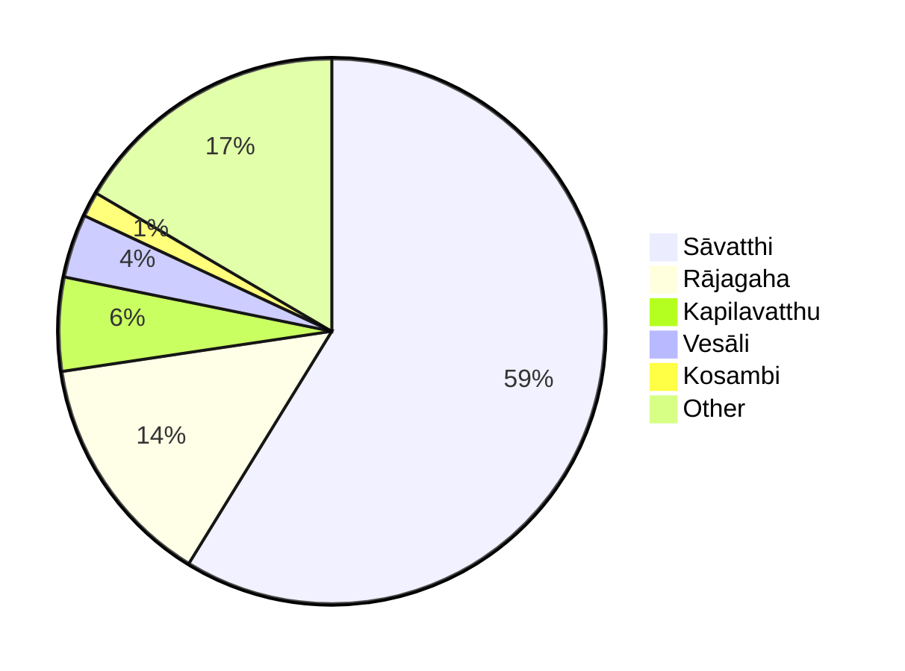

# Early Buddhism and the Urban Revolution 

by Balkrishna Govind Gokhale

JIABS Vol 5 Issue 2 pp. 7-22

## I.

It is now generally accepted that early Buddhism rode to popular acceptance on the crest of a significant urban revolution that swept across large parts of the Gangetic region in the sixth century B.C. A variety of conditions brought this revolution into being. The progressive clearing of forests brought larger areas into agricultural production. The use of iron tools, beginning from about the seventh century B.C., increased agricultural productivity, leading to larger commodity surpluses available for exchange in trade and commerce. The easy availability of metals, copper and silver, led to an increasing use of coinage, facilitating both short-haul and long-distance trade. These early punch-marked coins were issued by guilds of bankers and merchants and later by tribal oligarchies. The emergence of well-defined trade routes bound together far-flung areas of the subcontinent. All these helped create a new and powerful class of merchants and bankers, the greatest of whom was Anāthapindika of Sāvatthi, a contemporary of the Buddha and one of his greatest patrons. His purchase of the Bamboo Forest from Prince Jeta and his construction of a great monastery for the Buddha in Sāvatthi is a celebrated event in the early history of Buddhism. Along with this new mercantile class, a new kind of state was also beginning to emerge about the time when the Buddha was completing his long ministry of forty-five years. The most prominent representatives of this political transformation were the kings Bimbisāra of Magadha (circa 545-493 B.C.) and Pasendi of Kosala, both of whom were claimed by the Buddha as his personal friends and patrons. The power of these monarchies, especially Magadha, was based on new kinds of armies and instruments of war as well as the expressed needs of the new mercantile class. [^1]

Two distinct sets of generalizations may be made about the changes going on in the structure of society in the Gangetic plains during this period. First, there were two kinds of transitions: a) a transition in overall social structure from tribe to class; and b) a transition from a subsistence economy to an economy of relative surplus. Secondly, four different types of urban formations had begun to emerge: a) commercial towns based on an extensive exchange of commodities (Sāvatthi); b) bureaucratic towns, with their major activity being related to administrative functions (Rājagaha); c) tribal towns, being mainly confederate centers of tribal oligarchies and their clan subdivisions (Kapilavatthu); and d) transportation centers, based on routes of portage (Ujjeni). Inevitably, there is some overlapping of activities in these urban centers, but the typology seems to be both conceptually viable and practically reasonable.

The literature of the Buddhists in Pāli reflects this revolution. Whereas the major Upaniṣads compiled before the rise of Buddhism have for their background a rural milieu, the literature of the early Buddhists breathes a new urban spirit. Early Buddhism contains a paradox which, however, is more apparent than real. If the mahäbhinikkhamana of the Buddha-literally the Great Going Forth-represented a turning away from the world of everyday life, his first sermon at the Deer Park of Isipatana near Banaras, in a sense, was a reaffirmation of that very everyday life which alone could make the Turning of the Wheel of Law, Dhammacakkapavattana, empirically relevant. The argument made here is that the two major events in the early life of the Buddha are meaningful only in relation to one another. Similarly, the institutions of renunciation and confirmation, pabbajjā and upasampadā, are meaningful only in relation to one another, and the institution of rain-retreat - vassā-vāsa - which created the institution of the monastery (āvāsa) led to the "socialization" of what had begun primarily as an a-social movement.

The purpose of the present paper is to examine and analyse the specific association between early Buddhism and the new urbanism. It is based on statistical data of associations between early Buddhism and its new urban setting. The argument will be presented in two parts. In the first part, the statistical data on urban centers, cities, towns and market-townsnagara and nigama-found in suttas and/or gāthās will be offered. The second part will deal with the implications of these urban associations and any reasonable conclusions that may be drawn from the statistical data.

## II. 

Before the statistical evidence is presented, some explanation of the methodology used in collecting the data will be appropriate. The texts selected for examination are the texts of the Vinaya Pitaka (excluding the Mahāvagga and the Cullavagga), the Dīgha and the Majjhima Nikāyas, the Udāna, the Dhammapada and the Thera and the Therī Gāthās. In the case of the Vinaya Pitaka, the pārājika, pācittiya, pātidesanīya and sekhiya regulations were considered to be crucial for the formation of the Buddhist monastic community. The Dīgha and Majjhima collections contain the major doctrines of early Buddhism. The Udāna is a major single collection of the Buddha's "inspired" or mystical statements. Likewise, the Dhammapada, apart from being the single most important work for the general Buddhist community, monastic and lay, is a significant text for the articulation and exposition of early Buddhist ethical norms and attitudes. These texts probably range in time from the First or Rājagaha Council, whose historicity is assumed here, to circa 200 B.C., that is, after the death of Asoka (circa 274-232 B.C.). The Thera and Therī Gāthās must be assumed to date from after 200 B.C., as they contain verses of persons who lived during the time of Asoka, but the collections themselves must have been completed before 100 B.C. These collections are also significant because they preserve the statements made by a group that may be characterised as the early Buddhist "elite." [^2]

A question may be raised here about the exclusion of texts such as the Samyutta and the Añguttara Nikāyas and other texts from the Khuddaka Nikāya, notably the Sutta Nipāta. The bulk of the material in the first two Nikāyas is drawn from earlier texts such as the Dīgha and the Majjhima and hence most of the place names associated with the suttas contained in them may be assumed to have already occurred in the earlier texts. Their inclusion, therefore, would not have added anything of significance to our data. Parts of the Sutta Nipāta undoubtedly belong to the earliest stratum of the Pāli literary tradition, but in many cases the association of suttas is neither clear nor reliable. Other texts, such as Cariyā Pitaka, the Jātaka or the Vimāna and Peta Vatthus, need not detain us here. They are obviously much later than texts selected here and the evidence on associations with places would be of doubtful validity for our purpose here.

Next we may turn to the method adopted in collecting the statistical data. Every place name associated with the delivery of the rule or sutta was carefully noted, and in the case of the Dhammapada the information on place of delivery was taken from the commentary. The authenticity of place-association has been assumed, as it is based on a long tradition of faithful text-transmission with little possibility of interpolation or extrapolation. The references were then grouped in terms of places associated with each reference, and the places were categorised as cities and towns (nagara), market-towns (nigama), villages (gāma) and rural areas or countryside (janapada).

The total number of place names thus collected is 1009 . Of these, 842(83.43\%) refer to five cities, while the rest, 167 (16.57\%), cover 76 separate places, cities, market-towns, villages and countryside. Of the 1009 references, 593 (58.77\%) are to Sāvatthi, 140 (13.87\%) to Rājagaha, 56 (5.55\%) to Kapilavatthu, 38 (3.76\%) to Vesāli and 15 (1.48\%) to Kosambi. Plotting the places on a map reveals an irregularly shaped triangle with its apex in Campā, the southern side extending to Ujjeni and the northern to Mathurā - the northern side being irregular, as its northernmost point is Kapilavatthu. Outside of this triangle, places as distant as Suppāraka and Bharukaccha on the western coast and Patiṭthāna in the far south also occur in our sample; but these are associated with disciples such as some theras and therīs, and the group led by Bāvāri that figures in the Pārāyana Vagga of the Sutta Nipāta. The large number of references to Sāvatthi can be easily understood, as the Buddha is said to have spent as many as twenty-five rain-retreats (vassas) in that one city. In terms of size and character of the places, 35 may be called cities and towns, 8 market-places, 45 villages and 3 countryside. Though villages are more numerous than cities and towns in this computation, in frequency of reference towns far outnumber villages.

What initial conclusions may we draw from these figures? We must assume that during his ministry of forty-five years, the Buddha must generally have established himself in one place during the rainy season and been peripatetic during the rest of the year. Are we to assume that the majority of the texts in our sample were delivered during the rain-retreats? Or, is it possible that we have preserved in our sample only the major part of the Buddha's preaching that was associated with these cities? It is reasonable to assume that not everything that was said by the Buddha has been preserved for us in our texts. The task of preservation of the Buddha's statements was left to his followers who, soon after his demise we are told, gathered at Rajāgaha in the First Council. If the traditional Cullavagga account is to be believed, Upāli was responsible for the compilation of the Vinaya, and Ānanda for the Dhamma. [^3] Upāli and Ānanda undoubtedly drew upon the recollection of many of the assembled members of the Council either for corroboration or augmentation of their own contributions. This has a bearing on the nature of early Buddhism as preserved in the Pāli tradition, and will be dealt with later.

# III. 

Among the cities discussed here, Sāvatthi has the pride of place, being mentioned 593 times (58.77\% of our sample). By another computation, which includes materials from all four Nikāyas, 871 suttas were delivered in Sāvatthi; of these, 844 are associated with the Jetavana monastery, 23 with the Pubbārama and 4 with the suburbs. The total is compiled from 6 suttas in the Dīgha, 75 in the Majjhima, 736 in the Samyutta and 54 in the Anguttara Nikāya. This need cause little surprise, since the commentaries explain that the Buddha spent 25 vassāvāsas in Sāvatthi, 19 in the Jetavana and 6 in the Pubbārama. [^4] In fact, King Pasendi of Kosala proudly claimed that the Buddha was as much a Kosalan as was the king himself.

Sāvatthi has been identified with Sahet-Mahet on the banks of the river Rapti near the border between the Gonda and Baharaich districts of Uttar Pradesh. The city had three gates, south, east and north, the biggest market place being located between the southern gate and the Anāthapindika monastery built on Prince Jeta's land. Access to the city across the Aciravatī river was provided by a bridge of boats. The river carried a considerable volume of commercial traffic conducted by professional carriers, and it was also a source of livelihood for numerous fisher folk. Buddhaghosa mentions that Sāvatthi had a population of 57,000 families. If we assume that each family had at least four members, Sāvatthi would then have had a population of 228,000 , which is clearly grossly exaggerated. Realistically, we may reduce the figure by three-fourths and assume that the population may have been in the neighborhood of 57,000 , which would still make the city a major urban center of the times.

Sāvatthi was a commercial center of great importance during the Buddha's time. The fact that it was the home of Anāthapindika, the greatest merchant-banker of the age, is an indication of the accumulation of mercantile capital in the city. Wellrecognized routes connected it with all other major urban centers, even as far to the south as Patiṭthāna. While a considerable volume of commodity production within the environs of the city may be asumed, the more important activity may have been in commodity-exchange, as the city was very conveniently located for distribution of goods along the sub-Himalayan highlands on the one hand and the riverine territories to the south. It was probably the most important center of early Buddhism before the rise of imperial Magadha. A number of celebrated personalities, monks, nuns, laymen and laywomen were either natives of the city or were first converted to the faith there.

The fact that the Buddha spent as many as 25 vassāväsas in Sāvatthi raises some intriguing questions. Why did the Buddha return to the city for the rain-retreat over such an extended period of his career? One obvious reason may have been the presence of powerful patrons such as Anāthapindika and Visākhā, as well as King Pasendi. His hometown, Kapilavatthu, lay far to the north, and Rājagaha had equally obvious disadvantages. Rājagaha was the capital of the parricide Ajatāsattu before he began the construction of Pāṭaliputta. Besides, Rājagaha at this time was, in terms of commercialization and urbanization, less distinguished than Sāvatthi. The Buddha could have frequented Kosambi more than he actually did, but, again, Kosambi was no match for Sāvatthi. The choice of Sāvatthi, therefore, was deliberate for a variety of reasons, not the least important being the high degree of mercantilism and urbanism represented by the city. It was in Sāvatthi, as our evidence indicates, that the first contours of the new urbanism, with its new powerful classes of merchant-bankers and kings, began to take shape. It was this combination that became the basic support of the early Buddhist movement and it was this class coalition that lent its distinguishing character to the philosophical content of the movement. This new urbanism created complex problems of individual, familial and social relationships which early Buddhism sought to address with its emphasis on moral values and individual ethical and spiritual culture. This, in part, may explain the relatively a-metaphysical predilection of the early Buddhist movement. [^5]

Next in importance to Sāvatthi was Rājagaha. It is mentioned 140(13.87\%)$ times in our sample. It is identified with Rājgir in Patna district of Bihar. The southern part was girt by five hills and was fortified, while the northern part was inhabited by commoners. The most celebrated spots in the city mentioned in our texts were the Veluvana (bamboo forest), the Tapodanārāma on lake Tapoda, and the Jīvakaambavana and Nālandā on the outskirts of the city. Nālandā later became famous as the seat of the great university. The Buddha spent the first, third, fourth, seventeenth and twentieth rain-retreats at Rājagaha.

Rājagaha was important primarily for being the capital of the rising Magadhan monarchy. It must have attracted merchants and bankers, though its commercial importance does not compare with that of Sāvatthi or Ujjeni. Both Bimbisāra and his son and successor Ajātasattu were supporters of the Buddha, the former more so than the latter. Another famous supporter was Jīvaka, the royal phsyician and surgeon. Rājagaha reflects the importance of royal and bureaucratic support for the success of the early Buddhist movement. [^6]

The third city was Kapilavatthu, the "home"-town of the Buddha. It was the capital of the Sākyan realm and it was here that the Buddha spent his childhood and early adult life. It is generally identified with Piprawa, near Lumbini in Nepal, close to Rummindei, in the Nepalese Tarai, where is located the Asokan pillar commemorating the Emperor's visit to the birthplace of the Buddha in the twentieth year of his reign (circa 250 B.C.). The Buddha returned to Kapilavatthu in the very first year after his enlightenment, "converting" his father Suddohdana to the new faith. Later Buddhist texts lavishly describe the greatness and wealth of the city, filled with market-places and gardens and impressive gate-ways. Obviously, a great deal of poetical exaggeration is involved in such accounts, developed centuries after the Buddha's passing. While some trade at Kapilavatthu cannot be ruled out, it is doubtful if the city compared with Sāvatthi and Ujjeni or even Rājagaha in commercial importance. [^7]

There are 38(3.76\%) references to Vesāli in our sample. Vesāli was the capital of the Vajjian confederacy. The Buddha first visited it during the fifth year after his enlightenment. Vesāli is identified with the village of Basarh in the Muzaffarpur district of Bihar. Though the city was a great center of Jainism, the Buddha, too, had numerous followers there. There are references to a great famine at Vesāli. The city, according to literary accounts, was surrounded by three walls and had three gates with watch-towers. It was at Vesāli that the Vajjiputtaka monks raised the "ten points" that led to the Second Council and the great schism. As the capital of the confederacy, Vesāli must have been home to numerous "Rājas" as well as to the celebrated courtesan Ambapāli. The Buddha himself referred to Vesāli as charming (ramanīya), with a number of shrines, such as Udena, Gotamaka, Sattamba, Bahuputta, Sārandada and Cāpāla. [^8]

The city of Kosambi has 15(1.48\%) references in our sample. It was the capital of the kingdom of the Vatsas or Vamsas, ruled by Parantapa, a contemporary of the Buddha. Udena, Parantapa's successor, is the hero of the cycle of stories centering on Udena's romantic involvement with Vāsavadattā, the daughter of Canda Pajjota, the king of Ujjeni celebrated in Pāli and Sanskrit literature. Kosambi is identified with Kosam, near Allahabad, on the Yamuna river. It was the capital of a Mauryan province, as indicated by its being the original site of Asokan inscriptions, including the well-known schism edict. Commercially, Kosambi was as important as Sāvatthi, as it was an important staging point connecting Kosala and Magadha from the south and west. In the well-known Sutta Nipāta list of points followed by Bāvari's disciples from Māhissati to Vesāli, the route goes from Ujjeni and Vedisa, to Kosambi, to Sāvatthi, and finally to Vesāli. Kosambi had at least four great monasteries, the Kukkutārāma, the Ghositārāma, the Pāvārika mango grove and the Badarikārāma, the first three named after three prominent citizens of Kosambi. Kosambi was the scene of the first schism among monks. When recalcitrant monks refused to heed the Buddha's advice on reconciliation, the Buddha left the place in disgust and retired to the Pārileyyaka forest. The Pāli texts mention several families of bankers of Kosambi, and also numerous nāgas. Kosambi was obviously a storm-center of monastic disputes, as indicated by the Kosambi episode mentioned above and the edict bearing on an actual or impending schism during the time of Asoka. Kosambi also figures in the accounts of the Vajjian heresy of Vesāli, when Yasa Kākandaputta, on his expulsion by the Vajjian monks, went to Kosambi and sent messages to orthodox monks of various centers in the west. [^9]

Ujjeni, one of the leading cities of the times, is mentioned only four times in our sample, and these references come from the Thera and Therī Gāthās, which must be dated considerably later than the life-time of the Buddha. It was the capital of the kingdom of Avanti, ruled by Canda Pajjota. It was a major point on the trade route connecting the south with the north, east and west. It has been identified with modern Ujjain in Madhya Pradesh. The Buddha never visited it, though Ujjeni was the home of several of his prominent disciples, such as Mahākaccāna, Isidāsi and Padumāvati. Mahākaccāna was ranked among the ten leading male disciples of the Buddha, especially honored for his skill in expounding the Dhamma. From the Vinaya account, it is clear that Buddhism had few followers in Avanti during the lifetime of the Buddha. A large community eventually grew in Avanti, after Sona Kutikaṇna, a disciple of Mahākaccāna, went to see the Buddha at Sāvatthi and, at the behest of his teacher, Mahākaccāna, narrated the conditions of life and the Order in Avanti-which were so very different from those in the majjhimadesa. The main points made in this presentation were that Avanti had few monks, so that it was difficult to muster a chapter of ten fully-ordained monks for the ordination ceremony of new entrants; the soil was rough and hard, requiring shoes with thick linings; the people frequently bathed; sheep, goat and deer-skins were used as coverlets; and robes were gifted to designated monks. These conditions necessitated the modification of several rules regarding ordination, use of coverlets and shoes, and other matters pertaining to monastic life. The Buddha made the requested modifications to suit conditions in Avanti and the south. The mention of plentiful cattle and black soil is interesting, as it gives us an indication of the economic importance of these two factors. [^10]

The other important city mentioned in our sample is Campā ( 6 times). It lay on a river of the same name, a tributary of the Gangā, and is identified with a site some 24 miles to the east of Bhāgalpur, in Bihar. It was well known as a commercial center and capital of the kingdom Añga before its annexation by Magadha. Merchants from Campā traveled to Suvaṇṇabhumi, the Malayan Peninsula, for trade. The Buddha visited the city several times, as did the monks Sariputta and Vamgisa. Campā had a considerable number of monks resident in its āvāsas, as indicated by the fact that an entire Khandaka (IX) of the Mahāvagga is associated with the city. The section deals with the validity or otherwise of certain official acts of the sangha. Campā seems to have lost a great deal of its earlier importance even during the lifetime of the Buddha, as a result of its being incorporated by the rising kingdom of Magadha, under Bimbisāra. [^11]

Besides these cities and towns, a number of nigamas also figure in our accounts as being associated with the preaching activities of the Buddha. There are at least seven such nigamas mentioned by name: Kammāsadamma, Thullakoṭthita, Āpaṇa, Nādikā, Assapura, Vegalimga and Medalumpa. To these may be added Ālavī, which was both a town in its own right and also a nigama. Of these, Kammāsadamma and Thullakoṭthita were located in the Kuru region; their prosperity lay in their rich agricultural produce, the basis of a considerable regional trade.

The term nigama is specifically used to indicate a predominantly mercantile town, its major economic activity being the exchange of commodities by merchants and bankers. Some texts make a distinction between nigamas that were primarily centers of monetary transactions controlled by bankers (sethis) and those that had some banking but specialised in exchange of goods. The fact that a number of such functionally specialised centers had sprung up may be taken as an indication of the development of mercantilism and urbanism during the Buddha's time and after. Only a considerable surplus in commodity production could lead to extensive trade, accumulation of mercantile capital and the emergence of a powerful class of merchants and bankers. This new class was in search of new ethical values and a "religious weltanschauung" of a significantly different character than the one contained in the old Vedic religion. [^12]

Finally, there was the gäma, the primordial village. In this category, a distinction is made between the ordinary gäma and a Brähmanagäma (a Brahman village). A gäma ranged from a single household sheltering an extended family to several hundred homes inhabited by a large number of families. Its territorial limits were defined by hills and rivers, forests and/or walls and ditches. The principal occupations were agriculture; arts and crafts for manufacturing tools, implements and other articles largely for local use; and cattle-keeping.

The Brähmangäma is a familiar phenonenon in the Nikāya literature. The literal translation would be "Brāhmaṇa-village" which may mean either a village owned and/or dominated by Brāhmaṇas, or a village in which the Brāhmaṇas predominated by virtue of their numbers. There is evidence for both renderings. The process of the development of such Brāhmaṇa gāmas can only be speculated on. They may have begun as settlements created by Brāhmaṇa enterprise, or they may have been designated by the state as areas given over to Brāhmaṇa occupation and economic exploitation. Some Brāhmaṇas also enjoyed Brahmadeyya lands, described as full of people; replete with pastures, tree-groves and food-grains; and given over to Brāhmaṇas by kings as their exclusive domain as a matter of royal patronage of Brāhmaṇical learning and ritual. The Buddha delivered a number of his discourses in the course of his encounters with these wealthy Brāhmaṇas in their Brāhmaṇagāmas. [^13]

That the economy was advanced to a stage of considerable commodity production and exchange is reflected in the diversity of products and occupations mentioned in early Buddhist literature. A list of cereals, grasses, dyes, oil seeds, trees and flowering shrubs, birds and reptiles and small and large biped and quadruped animals collected from the Vinaya literature alone gives us an impressive 124 different items. Most of them figured in local as well as long-distance trade. [^14] The frequent references to copper, tin, bronze, iron, gold and silver are evidence of development of metal technology. The caravan leader (satthaväha), with his large assemblage of bullock-carts (usually stated as 500 in round numbers) and draft animals, winding his way through forests and across deserts of the seas to Southeast Asia, is a familiar figure in the Jätakas. We may assume that caravan leaders, merchants and bankers were as ubiquitous during the time of the Buddha, though not as numerous, as in the succeeding periods.

This picture of the social and economic background of early Buddhism is significantly different from that of the Vedic, Upaniṣadic and early Epic times. Early Buddhism and Jainism belonged to the urban milieu far more than did the earlier Vedicism or later Brahmanism (Hinduism) of post-Maurya times. [^15]

# IV.

What conclusions may we draw from the evidence set forth above? Our sample survey makes it clear that the culture portrayed in our existing texts is decisively urban, much more so than the preceding and succeeding phases of the civilization of ancient India. The Buddhism of our texts is a Buddhism predominantly of the cities, towns and market-places. Its social heroes are the great merchant-bankers and the new kings, perhaps in that order of importance. This Buddhism drew its major social support from these classes and, in turn, reflected their social and spiritual concerns. These classes needed a new spiri-tual-social orientation and value-system, which early Buddhism provided with its opposition to the old Vedic theology, sacrificial ritual, the dominance of the priest, and the emerging menacingly rigid social hierarchy. They needed new socially-oriented ethical values, in which the individual (and his family) rather than the varna-jāti were the center-piece, and the Buddha articulated such values. It is fashionable to portray the Buddha as the first great reformer in Indian social history, striving to attack and destroy the "caste" system. This is an instance of reading modern (or contemporary) social values into ancient texts, and it is a gross over-simplification. The Buddha did ignore caste distinctions in the matter of admission to and treatment of individuals within the sangha. Outside of it his attitude was pragmatic, if not ambivalent. He seems to use the varna-jāti terminology of his times in his references to existing society and only tends to rank the Khattiya as higher than the Brāhmaṇa. He ridicules Brāhmaṇa pretensions to ritual purity and social eminence and insists that a person be judged by his individual virtue rather than his familial, class or social origins. [^16] This was precisely the demand of the new urban social classes who felt closer to the Buddha than to the traditional Brāhmana and sacrifice-dominated Vedic cults. These classes were not much interested in speculative metaphysics, for their emphasis was on practical and everyday concerns of making good in this world and assuring one's welfare in the next. That is one of the reasons why so much of early Buddhism is addressed to ethical concerns rather than speculative metaphysics. The Buddha seems to have offered moral justification for social well-being and success. The later metaphysical Buddhism of the Ābhidhamikas and Mahāyānists was a product of an age of "villagism" and the emergent quasi-"feudal" society. The metaphysical gain became a social loss, for what Buddhism gained in speculative metaphysics, it lost in its social roots. This is reflected both in the increasing trend of using Sanskrit as a vehicle for religious articulation and the widening gulf between the monastery and the laity. The urban revolution did not create Buddhism, but it was certainly vital for its early popularity and material support. A decay of that urbanism sapped some of the socially vital foundations of the Buddhist movement.

Finally, the arguments stated above cannot be disassociated from the nature of the collation and transmission of the early
Buddhist Pāli texts. Sāvatthi, as noted above, was associated with many of the suttas of the four Nikäyas, which led Mrs. Rhys Davids to suggest that either the Buddha "mainly resided there or else Sāvatthi was the earliest emporium (library?) for the collection and preservation (however this was done) of the talks." G. P. Malalasekera agrues that "The first alternative is more likely, as the Commentaries state that the Buddha spent twenty-five rainy seasons in Sāvatthi-this leaving only twenty to be spent elsewhere." [^17] If it is assumed that the Buddha spent only the rainy season in one fixed place such as Sāvatthi, what has happened to the statements he must certainly have made during the eight months of the dry season when he is supposed to have traveled from one place to another? Undoubtedly many such statements are still preserved in other parts of the Canon, but their number does not seem to be sufficiently large to account for preaching activity over eight months every year. Statistically, the number of suttas delivered in urban centers, even in our limited sample, is overwhelmingly large (83.43\%) while the rest (16.57\%) are distributed over 76 different places, among which are included some towns, nigamas, villages and the "countryside" (janapada). The share of rural areas in the total sample is thus very small. It will not be unreasonable to conclude that even during the lifetime of the Buddha the rule of living in a fixed location only for the rainy season, with the rest of the year to be spent moving from one place to another, had become the ideal rather than the reality. The localisation of the āvasas had become a fact of the early Buddhist monastic life even during the lifetime of the Buddha, as evidenced by such usages as "Kosambaka bhikkhu." It will not be hazardous, on the basis of our evidence, to assume that most of the Buddha's preaching was done in urban centers where he may have spent extensive periods of time even outside of the vassāvāsa period. The Buddha and his followers maintained an extensive and continuous contact with lay devotees during his lifetime and the period of a few decades after his demise. But, by the beginning of the fourth century B. C., Buddhism had become localised in fixed and well-endowed monasteries, first drawing upon lay mercantile support but later, and increasingly, dependent upon royal endowments. When the state began to be "feudalised" after the end of the Maurya empire, the sangha was also consequently "feudalised," as it depended on endowments of land. By the time Mahāyāna came onto the scene, this process of "feudalisation" was far advanced and it left its own philosophical (especially metaphysical) imprint on the character of the evolving Buddhism itself.

Inscriptional evidence from the Asokan and the SungaKānva periods sheds some interesting light on the urban-lay nexus of early Buddhism and its development up to the beginning of the Christian era. In his Bairat (Bhabrd) inscription, Asoka recommends seven texts as deserving special attention. The emphasis seems to be on texts that are of direct relevance to the laity. In the inscriptions from Sanchi and Bharut the two terms that are frequently mentioned are the dhammakathika and the pañcanekāyika. The first refers to a preacher of the Dhamma and may be taken to mean a preacher to the laity. The second means one who has mastered (or memorised?) the five Nikäyas and may be taken to refer to a specialised monastic function related to the transmission of the Buddhist scriptures. The sangha, on this evidence, had two distinct functions, that of preaching to the laity and of regulating monastic life and preserving and transmitting sacred texts from generation to generation. Already, however, the monastic function was beginning to receive greater attention than relations with the laity. This may partially reflect the large number of donors coming from villages and the countryside rather than the great urban centers which, presumably, were already in a state of decay in the post-Asokan period. This consolidation of the monastic tradition led to the development of the Abhidhamma tradition of early Buddhism, a school more geared to monastic thinking and life than to the everyday needs of the laity. The sangha seems to have begun its phase of "ruralization," when it was subject to increasing dependence on royal and "feudal" support. This becomes the major characteristic in the history of Mahāyāna Buddhism, especially of the Gupta and the postGupta periods. Thus, the decline of urbanism and the consequent loss of economic and social power by the mercantile classes had a direct impact on the nature and developement of Buddhism in India. [^18]

## NOTES 

[^1]: For details of these developments, see D. D. Kosambi, The Culture and Civilization of Ancient India (London, 1965), pp. 103 ff.; a more recent development of this theme is offered by Jaimal Rai in his The Rural-Urban Economy and Social Changes in Ancient India (Delhi, 1974), pp. 165 ff.
[^2]: On the chronology of these texts, see M. Winternitz, A History of Indian Literature (New York 1971), II, pp. 17 ff.; for the dates of the Buddha and Asoka, see B. G. Gokhale, Asoka Maurya (New York, 1971), pp. 35, 63; also see B. G. Gokhale, Buddhism in Maharashtra, (Bombay, 1976), pp. 23 ff.; on these "elite" groups, see B. G. Gokhale, "The Early Buddhist Elite," Journal of Indian History, XLIII/II (August 1965), pp. 391-402.
[^3]: J. Kashyap (ed.), The Cullavagga (Nalanda, 1956), pp. 406-409.
[^4]: See G. P. Malalasekera, Dictionary of Pali Proper Names (London, 1960), II, pp. 1126-1127; hereafter referred to as DPPN.
[^5]: DPPN, II, pp. 1126-1127; B. N. Chaudhury, Buddhist Centres in Ancient India (Calcutta, 1969), pp. 71-74 (hereafter abbreviated as BCAI); Balram Srivastava, Trade and Commerce in Ancient India (Varanasi, 1968), pp. 75-76.
[^6]: BCAI, pp. 99-105; DPPN, II, pp. 721-724.
[^7]: BCAI, pp. 43-45; DPPN, I, pp. 516-520; B. G. Gokhale, Asoka Maurya (New York, 1966), pp. 75, 164.
[^8]: BCAI, pp. 56-60; DPPN, II, p. 940-943; J. Kashyap (ed.), The Digha Nikāya (Nalanda, 1958), II, pp. 92-93.
[^9]: BCAI, pp. 85-87; DPPN, I, pp. 692-695; Gokhale, op. cit., p. 163.
[^10]: BCAI, pp. 182-184; DPPN, I, pp. 344-345; also see B. C. Law, Ujjayini in Ancient India (Gwalior, 1944), pp. 2-4, 13-15, 32-33; J. Kashyap (ed.), The Mahāvagga (Nalanda, 1956), pp. 214-217; T. W. Rhys Davids and H. Oldenberg (trans.), Vinaya Texts (Delhi, 1965), pp. 32-40.
[^11]: BCAI, pp. 122-123: DPPN, I, pp. 855-856; J. Kashyap (ed.), The Mahāvagga, pp. 327 ff .
[^12]: For the term nigama, see Jaimal Rai, op. cit., pp. 160-161.
[^13]: For the Brāhmanagamas, see B. G. Gokhale, "Brahmanas in Early Buddhist Literature," in Journal of Indian History, XLVIII/1, pp. 51-61.
[^14]: See G.S.P. Misra, The Age of Vinaya (New Delhi, 1972), pp. 249-260; also see Balram Srivastava, op. cit., pp. 268-283.
[^15]: For the reemergence of "villagism" see D. D. Kosambi, op. cit., pp. 103 ff .
[^16]: For the Buddha and the "caste" system of his times see B. G. Gokhale, Buddhism in Maharashtra, pp. 26 ff.
[^17]: DPPN, II, p. 1127.
[^18]: See B. G. Gokhale, op., cit., p. 162; for inscriptional evidence of the Śunga-Kānva period, see H. Luders, Appendix to Epigraphia Indica (Calcutta, 1912), X, Nos. 347, 1248, 299, 867.
