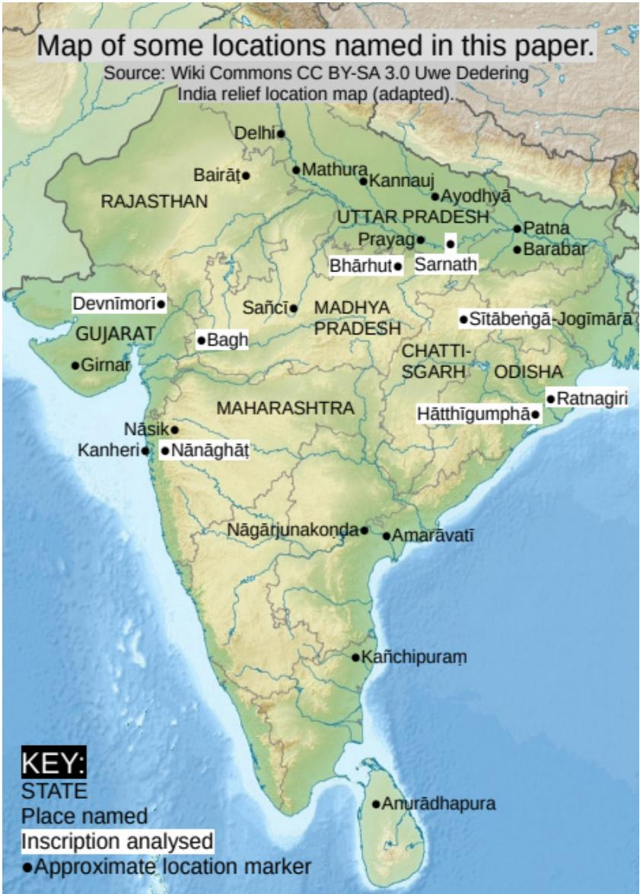

# Light on Epigraphic Pali: More on the Buddha Teaching in Pali

*Stefan Karpik*

JOCBS 23: 41–89 ©2023 Stefan Karpik

**Abstract**—The view that the Buddha spoke Māgadhī, as reflected in the Eastern Aśokan inscriptions, is a myth of 20th century scholarship. Computer searches of the sources are now possible, and disprove that myth; in general, the term ‘Māgadhī’ was scrupulously avoided in the Pali commentaries. If attention is given instead to Salomon’s ‘central- western epigraphic Prakrit’, it can be seen as a later reflex of Pali by a method of presentation unique to this paper. Accordingly, it should be merged with the existing category of Epigraphic Pali and serious attention given to the Theravada tradition that the Buddha spoke Pali. An outline of the development of Buddhist canons in India is provided on the hypothesis that Pali was the original Buddhist language for them all. This does not necessarily mean that Theravada texts are the most authentic Buddhist texts.

**Keywords:** The Buddha, canon literature, Pali, Prakrit, epigraphy, Māgadhī, Monumental

## The problem:

> One day, someone saw Mulla Nasrudin searching on the ground and asked:
> 
> ‘What have you lost?’ ‘My key.’
> 
> ‘Where did you drop it?’ ‘In my house.’
> 
> ‘Then, Mulla, why are you looking here?’
> 
> ‘There is more light here.’[^1]

The relevance of this story is that the current consensus on the origins of Pali has focused on the Aśokan inscriptions and ignored Epigraphic Prakrit. Why wouldn’t they? The Aśokan inscriptions are glittering: they are among the first inscriptions in India; they show an emperor in all his pomp and also in his humanity, e.g. his difficulty in eating less meat and his repentance for his conquest of the Kaliṅgas; they show the different accents spoken in India by bureaucrats, messengers and stone-masons in the mid-third century BCE, and they are readily found in single volumes by different editors. In contrast, Epigraphic Prakrit is dull; it consists mainly of the names and identities of donors; it is a standard language with little dialectical variety; it is scattered throughout many journals and volumes that cover a mere fraction of the whole. I sympathise with the Pali scholars of the 20th century, but they made a major error in trying to relate Pali to the eastern Aśokan inscriptions. This paper aims to correct this situation: the Aśokan inscriptions were an anomaly in the sweep of Indian epigraphy as their linguistic varieties are no longer recorded after the Mauryan period; on the other hand, Epigraphic Prakrit was the standard inscriptional language of India for several centuries before Sanskrit began to supersede it in the 2nd century CE. Most importantly, Epigraphic Prakrit is a later form of Pali, as I aim to demonstrate in this paper.

[^1]: Story adapted from Shah (1966: 9).

## The Māgadhī myth

It might be claimed that the analogy with the Mulla Nasrudin story is unfair because scholars had good reason for overlooking Epigraphic Prakrit in favour of the Aśokan inscriptions, namely the evidence that the Pali commentarial tradition had claimed the Buddha spoke Māgadhī. Norman (1983: 3) described the language of the eastern Aśokan inscriptions as ‘Māgadhī’, albeit distinct from the grammarians’ Māgadhī, and (1983: 145 n.85) cited Mahāvaṃsa XXXVII 244 (*māgadhāya niruttiyā*)[^2] as proof that Pali was ‘Māgadhī’[^3]. In fact, an oblique case of *māgadhī* should be *māgadhiyā* instead of *māgadhāya*, as Norman must have known, but must have judged as irrelevant. Actually, the Mahāvaṃsa refers to the ‘Magadha language’, not to Māgadhī and that is a significant difference, as will be shown. Furthermore, the Mahāvaṃsa did not say the *māgadhā nirutti* was translated at the First, Second or Third Council, or when the scriptures were written down in the 1st century BCE, or at any point. Norman was selectively relying on the Mahāvaṃsa as evidence that *māgadhā nirutti* was not Pali, an interpretation its writers would never have recognised. However, von Hinüber (2005: 181) among others followed this false trail by wrongly agreeing that the Mahāvaṃsa calls Pali ‘Māgadhī’ and by similarly regarding the Eastern Aśokan dialect as the referent of Māgadhī.[^4]

Arguments against equating Pāli and Māgadhī have been made already (Karpik 2019a: 20–38), but I wish to make one additional point: the Māgadhī myth was developed before computer searches of Pali texts were possible. Such searches can now challenge three facets of that myth:

[^2]: Norman gives a reference without quoting the text, but I presume this is what he referred to.
[^3]: The Māgadhī myth had existed at least since Lévi (1912) argued the original Buddhist canon was in the Eastern Aśokan dialect. Norman to his credit was attempting to provide evidence for this claim.
[^4]: Von Hinüber (1985a: 66) recognised that he was making an assumption when he called ‘Māgadhī, traditionally used in ancient Ceylon, a notorious misnomer’, while equating the Eastern Aśokan dialect with Māgadhī. What he did not realise is that there is no evidence that in ancient Ceylon the term ‘Māgadhī’ was ever used.

1. Pind (2021: 101–102) has argued that *bhikkhave* is not a Māgadhism, but a non-emphatic form of *bhikkhavo*.[^5] He concludes (2021: 105): ‘... it is necessary to study the language of the Tipiṭaka as a language *sui generis* and not as a random patchwork of borrowings from other linguistic environments, inter alia “eastern” ones.’[^6]
2. The Buddha, who was a Kosalan, is recorded as being in Kosala vastly more often than in Magadha in a large sample of the early Buddhist texts, i.e. the first four Nikāyas;[^7]
3. The term ‘Māgadhī’ is nowhere to be found in the Tipiṭaka or its commentaries or sub-commentaries according to the online Digital Pali Reader (DPR). Instead there are at least fourteen circumlocutions, such as (I give one reference per work, in stem form if there are several endings in that work) the following:[^8]

[^5]: I assume Pind (2021: 84) was using a computer search when he stated: ‘There are well over 26,000 instances of *bhikkhave* in the Pāli canon.’ Karpik (2019a: 36–38) also comes to a similar conclusion, that *bhikkhave* had a different pragmatic function from *bhikkhavo*, the former to introduce a new topic, the latter to invite a response.
[^6]: For example, Pind (2021: 84) criticises Lüders (1954 §1) for claiming *seyyathā* is a Māgadhism: ‘This in itself raises the obvious question why they would consistently utilise a particle that allegedly would stem from an “eastern” MI dialect in a “western” MI linguistic context. The only conclusion to draw from the evidence is that the early compilers of the Pāli canon preferred to use *seyyathā* because they did not consider this particle as dialectically incompatible with the canonical language.’ Even if Māgadhisms could be proved, they do not prove that the Buddha’s language was Māgadhī; they could be transmission errors by a Māgadhī speaker or borrowings: Trask (2010: 26) observes that the Anglo-Saxon *hi* was replaced by Old Norse *they*, *them* and *their*, and (2010: 96–98) there are hundreds of words of Danish origin in English; this does not mean that English was originally Old Norse or Danish.
[^7]: The details are at Karpik (2019a: 20–26). To be fair, Salomon (2018: 16–17) had already come to a similar conclusion based on a much smaller sample created without the help of computers by Gokhale (1982). However, Salomon did not comment on his conclusion’s potential challenge to the Māgadhī myth, and perhaps a larger sample will enable more scholars to challenge that myth.
[^8]: Where PTS page or verse numbers are not available on the DPR, DPR section numbers within the text (prefixed §) or paragraph numbers from the search box (prefixed ‘para.’) are provided. The abbreviations are in the style of von Hinüber (2008), especially pp. 250–253.

### **Fourteen ways of not saying ‘Māgadhī’**

* *magadhabhāsā*[^9] (Sp i 255, Sp-ṭ §47, Sadd i 56, Vin-vn-pṭ §903)
* *māgadhanirutti* (Pāc-y §285)
* *māgadhabhāsā* (Sp i 255, Sp-ṭ para.82, Vmv para.42, Pālim-nṭ para.62, Mūla-s-ṭ para.1, Sv-pṭ i 20, Sv ii 560, Ps ii 35, Ps-pṭ para.61, Spk-pṭ para.59, Mp-ṭ para.73, Vv-a 174, As-mṭ para.25, Vibh-a 387, Vism-mhṭ para.18, Sadd i 56, Abhidh-av-nṭ §1189, Moh 186)
* *māgadhamūlāya bhāsāya* (Mūla-s-ṭ para.8)
* *māgadhavacanato* (Vin-vn-pṭ §1209)
* *māgadhavohāra* (Sp-ṭ para.111, Kkh-ṭ para.48, Pāc-y §285, Sadd i 144)
* *māgadhā bhāsā* (Abhidh-av-nṭ §1189)
* *māgadhāya niruttiyā* (Mhv XXXVII 244) *pace* Norman and von Hinüber
* *māgadhikabhāsā* (Abhidh-av-nṭ §1186, Moh 186)
* *māgadhikāya niruttiyā* (Pālim §46)
* *māgadhikāya sabhāvaniruttiyā* (Vmv para.70, Padarūpasiddhi §60)
* *māgadhikavohāre* (Vin-vn-pṭ § 94)
* *māgadhikāya sabbasattānaṃ mūlabhāsāya* (Ud-a 138, It-a i 126, Vism 441-2, Sadd i 208)
* *māgadhiko vohāro* (Sp vi 1214)

[^9]: The reading *magadhabhāsā* is that of the PTS, but it is *māgadhabhāsa* in DPR at Sp i 255 and Sadd i 56.

There are also six non-Magadha designations of Pali:

### **Six ways of not saying ‘Magadha Language’**

* *ariyaka* (Vin iii 27, Sp i 250, Kkh-ṭ para.48)
* *ariyavohāro* (Sp i 255)[^10]
* *tantibhāsaṃ* (Dhp-a i 1)
* *mūlabhāsā* (Vin-vn-pṭ para.39, Pāc-y §218, Mūla-s para.2, Mūla-s-ṭ para.1)
* *pāḷibhāsaṃ* (Vin-vn-pṭ para.82)[^11]
* *sabhāvanirutti bhāsāya* (Mūla-s-ṭ para.8)

Out of the above twenty names, the early designations of what we now call ‘Pali’, according to the Tipiṭaka and its commentaries, are:

### **Names for ‘Pali’ in the Canon and Commentaries**

* *ariyaka* (Vin iii 27), the term used by the Buddha himself for his language.
* *ariyavohāro* (Sp i 255)
* *tantibhāsaṃ* (Dhp-a i 1)
* *magadhabhāsā* (Sp i 255), where the commentator equates *magadhabhāsā* with *ariyaka*.
* *māgadhikāya sabbasattānaṃ mūlabhāsāya* (Ud-a 138, It-a i 126)
* *māgadhiko vohāro* (Sp vi 1214)

[^10]: Crosby (2004: 110 n.2) states that *ariyavohāro* does not refer to the language generally. I have not referred to contexts, e.g. not lying, where it is not a language name as the word means ‘noble speech’ in those. Similarly, *mūlabhāsā* is sometimes a language name contrasted with another language and sometimes a language description. I have taken *jinavacana* as equivalent to *buddhavacana* and neither as a language name*.*
[^11]: Vin-vn-pṭ is the Vinayatthasārasandīpanī, a commentary on the Vinayavinicchaya handbook, which Crosby (2004) regards as having the earliest extant use of *pāḷibhāsā* as a language. Von Hinüber (2008: 156) dates Vin-vn-pṭ to the 12th century CE. Crosby provides subsequent examples which are not currently on the DPR.

Remarkably, as the twenty names show, there was no standard designation for the language of the canon, certainly not *māgadhī*,[^12] which currently occurs in the DPR only in a single poem, probably late, inserted in three obscure works unpublished by the PTS and which surely means *māgadhabhāsā*.[^13] This contrasts with twenty non-Māgadhī designations, six of them from early texts. Currently, many scholars assume that the Magadha circumlocutions were merely alternative ways of saying ‘Māgadhī’, whereas I argue they were fourteen alternative ways of deliberately shunning that particular term. It is inconceivable that the authors of the above texts did not know the term ‘Māgadhī’, so I must conclude that they were studiously avoiding that term for the simple reason that they did not mean ‘Māgadhī’.

What they meant was what the Buddha himself described as the *samañña*, the standard language,[^14] of *Ariyaka*, the Aryan language,[^15] which, aping the concept of Bronkhorst (2007), was the language of Greatest Magadha, a western variety which we now call ‘Pali’. I believe they are harking back to the time of the Mauryan Magadhan empire at the time of Aśoka, who ruled c. 268–232 BCE, when Magadha was practically the whole of the Indian subcontinent, encompassing the entire *Ariyaka* speaking population, and when Buddhism came to Sri Lanka.[^16] The Vinaya commentary actually equated *Ariyaka* and *māgadhabhāsa* (Sp i 255). Dating from the time of the missionary efforts of Aśoka’s son, Mahinda, in Sri Lanka and King Devānaṃpiyatissa’s gifts to Aśoka, ‘Magadha’ was likely to be an ancient Sri Lankan designation for north or mainland India, much as foreigners often call the UK ‘England’ and the Netherlands ‘Holland’, although they are merely parts of a whole. These historical overtones were especially relevant to scholars finalising the commentaries during the Gupta Magadhan empire, which under Chandragupta II, who ruled c. 375– 415 CE, also encompassed much of the sub-continent.[^17] We can conclude that the *māgadhabhāsā* is far more likely to be an early form of Epigraphic Prakrit/Pali, which was used for many centuries throughout India both in Buddhist and non-Buddhist contexts, than the obscure Eastern Aśokan dialect which vanished from the inscriptional record within decades and which was probably unknown in Sri Lanka.[^18] Twentieth-century scholars would not have followed the false trail of Pali being a westernised, Sanskritised Eastern Aśokan dialect if they had the possibility of computer searches or had paid sufficient attention to Epigraphic Pali. They never had solid evidence for ‘Māgadhī’ in Pali texts or for connecting Pali to the language of the eastern Mauryan bureaucracy. They also failed to use an emic approach to enter the thought world of ancient Sri Lankans for whom ‘Magadha’ was the vast empire of the time when Buddhism arrived in Sri Lanka. Instead of being cautious about their strange proposition that the Mahāvaṃsa or any Pali source provides evidence that the Buddha did not speak Pali, such scholars found the lure of the Aśokan inscriptions too tempting; hence the Māgadhī myth.

[^12]: Here I argue against almost every authority, most recently against Oberlies (2019: 43), ‘For the Theravāda tradition has always claimed that the language spoken by the Buddha was Māgadhī — i.e. an eastern language’, and Bodhi (2020: 1), ‘The Theravāda tradition identifies Pāli with Māgadhī, the language of the state of Magadha, where the Buddha often stayed.’ These are simply unsubstantiated myths which are repeated so often that they appear true.
[^13]: There is a single poem of uncertain date, probably 2nd millennium, occurring in at least three works of secondary literature: *sā māgadhī mūlabhāsā | narā yāyādikappikā || brahmāno cāssutālāpā | sambuddhā cāpi bhāsare ||*; ‘This Māgadhī is the original language. Men of whatever age, Brahma Gods who have not heard a word and fully enlightened ones speak it.’ It is found in a Kaccāyana grammar, the Padarūpasiddhi §60, where Māgadhī is equated to *māgadhikāya sabhāvaniruttiyā*, ‘the original Magadha speech’; Norman (1983: 164) dates this work to the 13th century. Both the Vinayālaṇkāraṭīkā (§46) and the Mūlasikkhāṭīkā Ganthārambhakathāvaṇṇanā (para.8) discuss *mūlabhāsā* and quote the poem. Neither makes an attribution to the poem, which is inserted into a prose commentary on other verses. Von Hinüber (2008:158, §337) attributes the former work to 17th century Burma, but (2008: 157, §333) regards the Khuddasikkhā and Mūlasikkhā as separate works and does not attribute a place or time to the Mūlasikkhā or even mention its *ṭīkā*; Müller (1883: 86) states that the Mūlasikkhā was known in 12th century Sri Lanka, but does not include the *ṭīkā* with his text. In all three cases, the poem is not integral to the texts, so it may be a later insertion and its dating cannot be secure. As the poem is unattributed and absent from primary texts, I assume it is not an early text. This is the only example currently in the DPR of the word *māgadhī*, which I take as poetic license *metri causa* for *māgadhabhāsā* and similar circumlocutions because *māgadhī* is not found in prose.
[^14]: MN 139 *Araṇavibhaṅgasutta*, M iii 230. This passage has been mistranslated by Lamotte and others into an injunction to avoid standard language, rather than, as is correct, its diametrical opposite, to adhere to standard language (Karpik 2019a: 46–48).
[^15]: The term *ariyaka* is given in DOP i 236b as ‘the Ariya language’. The Buddha describes the language of the Buddhist order as *Ariyaka* at Vin iii 27. Levman (2021: 302 n. 438) reads *ariyaka* as ‘an Aryan language’, but I would counter as follows: the commentary (Sp i 255) explains that the text includes miscommunication between speakers of the same language: *tattha* ***ariyakaṃ*** *nāma ariyavohāro, māgadhabhāsā.* ***milakkhakaṃ*** *nāma yo koci anariyako andhadamiḷādi.* ***so ca na paṭivijānātī*** *ti bhāsantare vā anabhiññātāya buddhasamaye vā akovidatāya imaṃ nāma atthaṃ esa bhaṇatī ti na paṭijānāti*, ‘“Aryan” is the name of the Aryan tongue, the Magadha language. “Foreign” is the name of anything non-Aryan: Andha, Tamil, etc. “He does not understand” means through lacking knowledge in a different language or through lacking experience in Buddhist custom he does not understand that this person is speaking with that meaning’; the commentary sees *Ariyaka* as a unitary language and contrasts it with non-Ariyaka languages like Andha and Damiḷa; it mentions only one Aryan language, māgadhabhāsa, not varieties like Māgadhī or Kosalī; this is confirmed by the sub-commentary Sp-ṭ para.111: *anariyako ti māgadhavohārato añño*, ‘“non-Aryan” means different from the Magadha tongue’; an argument that all varieties of *Ariyaka* in the Buddha’s day were mutually comprehensible is presented in Karpik (2019a:15–17, 58–69).
[^16]: An animation of the expansion of Magadha from the Buddha’s day to Aśoka’s is to be found at https://www.wikiwand.com/en/Kingdom\_of\_Magadha#Media/File:Magadha\_Expansion\_1.gif
[^17]: Here I follow Raychaudhuri (2006: 445) who described the Gupta empire as the second Magadhan Empire and (2006: 469) Pāṭaliputra as the original Gupta metropolis. Devahuti (1970: 34) also wrote: ‘… Magadha was historically the seat of paramount kings and the symbol of supremacy.’ However, Thapar (2003: 282–288) believes the imperial Guptas originated in the western Ganges plain and the Magadha Guptas were a minor family restricted to the principality of Magadha; in my view, that would make the imperial Guptas all the more likely to claim Magadha as their own. Verardi (2014:180 n. 37) rejects the notion of Ayodhyā as a settled Gupta capital and thinks the Gupta capital was often itinerant. Still, I believe the following are settled facts: (a) Magadha was part of the Gupta empire; (b) its capital, Pāṭaliputra, was a thriving city when Faxian visited c. 405 CE; (c) Samudragupta had a *praśasti* to himself inscribed on the Aśokan pillar moved to Allahabad/Prayag, thus linking his empire to the memory of Aśoka’s; (d) according to Devahuti (1970: 217), even after the Guptas, ‘Magadha’ was so prestigious that in 641 CE King Harsha assumed the title of ‘King of Magadha’ although his capital in Kannauj was nearer to Delhi than Pāṭaliputra, modern Patna. Whatever the historical intricacies, the optics for Gupta era Pali commentators would be an empire demonstrating the reality of their traditions on the Aśokan empire and justifying the continued use of *māgadhabhāsā* for the language of a vast area of India.
[^18]: Wynne (2019: 9–10) suggests that the standard Buddhist language was a western, Kosalan variety, which I connect to Pali and Epigraphic Pali. To my knowledge, there is no mention of the Aśokan inscriptions in the Pali commentaries, still less of their language. In c. 400 CE, when the commentaries were being finalised, visitors from Sri Lanka to the pilgrimage sites of northern India would have seen inscriptions on Aśokan pillars, but may not have been able to read them since the Aśokan and Gupta scripts are significantly different from each other; they may not also have been able to date them, since *Devānampiya* and *Piyadasi* were titles used by several rulers (Hultzsch 1925: xxxi). Even if they could overcome these hurdles, they are more likely to name as *māgadhabhāsā* the widespread Epigraphic Pali inscriptions, so similar to their canon’s language, from Buddhist sites like Bhārhut, Sāñcī, etc., than inscriptions in an obscure, extinct, local dialect.

**Fig. 1.** *Map of some locations in this paper (Source: Wiki Commons CC BY-SA 3.0 Uwe Dedering India relief location map, adapted)*

## Epigraphic Prakrit/Pali

If my interpretation of *māgadhabhāsā* is correct, there should have been a standard widespread language very closely related to canonical Pali in existence from Aśoka’s mission to Sri Lanka evident in inscriptions. Such a language did indeed exist, but there is no standard term for it: Bühler (1883: 78–79) called it ‘Pali’, Senart (1892: 258) ‘Monumental Prakrit’, Pischel (1957: §7) ‘Leṇa Prakrit’, and Salomon (1998: 265ff) ‘central-western epigraphic Prakrit’. It is usually described in journals simply as ‘Prakrit’ and there are hundreds of inscriptions in this language, with Salomon (1998: 77) giving as examples the inscriptions of Buddhist sites such as Bhārhut, Sāñcī, Nāgārjunakoṇḍa and Amarāvatī and secular inscriptions from Hāthīgumphā and Nāsik; there are many more sites. Senart (1892: 258) states:

> In the period which extends from the 2nd century before our era to the 3rd century A.D., all the inscriptions which are not in Sanskṛit or Mixed Sanskṛit are couched in a dialect which may be designated by the name of Monumental Prākṛit.

I believe ‘Epigraphic Pali’ is the most accurate description of this language. Relating this variety to Pali is the, doubtless controversial, main innovation of this paper. In fact, my definition of Epigraphic Pali is: an inscription with the same vocabulary and grammar as canonical Pali, and displaying the same phonetic changes when compared to Vedic or Sanskrit.[^19]

Here is the first of nine examples of Epigraphic Pali:

[^19]: Franke (1902: 126-7) concluded, as I do, that Pali was a natural language and (1902: 150-154) a direct descendant of Vedic. However, he claimed to demonstrate the former by showing the similarities of Pali, which he called *literarische Pāli*, ‘literary Pali’, to *Gesamt-Pāli*, ‘general Pali’, his term for Prakrit or MIA (1902: vi). I believe that, with this broad definition, he weakened his first conclusion: for example, he included the eastern Aśokan inscriptions in *Gesamt-Pāli* although they have grammatical terminations (e.g. *a*- declension singular nominative -*e*, and ablative -*ate*) and sound differences (e.g. *kubhā* instead of Pali *guhā* and extensive *r* > *l*) which are rarely, or not at all, found in Pali or Epigraphic Pali. I claim my definition of Epigraphic Pali is more precise than *Gesamt-Pāli*, thus strengthening Franke’s first conclusion by leaving very few changes untypical of Pali; moreover, it supports my further claim of Pali being the standard language of the Buddha’s time, evidenced by the dominance of Epigraphic Pali in Indian inscriptions for centuries.

### 1. Bhārhut, Madhya Pradesh. Stupa pillar inscription A1 (in full), 2nd century BCE

(Lüders et al. 1963: 11)

|  |  |
| --- | --- |
| Text | 1. Suganaṁ raje raño Gāgīputasa Visadevasa   2. pauteṇa Gotiputasa Āgarajusa puteṇa   3. Vāchhiputena Dhanabhūtina kāritaṁ toranāṁ   4. silākaṁmaṁto cha upaṁno |
| English translation (Lüders et al.) | During the reign of the Sugas (Śungas) the gateway was caused to be made and the stonework (i.e. carving) presented[^20] by Dhanabhūti, the son of a Vācchī (Vātsī), son of Āgaraju (Āngārdyut), the son of a Gotī (Gauptī) and grandson of king Visadeva (Viśvadeva), the son of Gāgī (Gārgī).[^21] |
| Edited text (corrections by Lüders et al.) | 1. Suṅgānaṁ[^22] [^23] raje raño Gāgīputasa Visadevasa   2. poteṇa[^24] Gotiputasa Āgarajusa puteṇa[^25]   3. Vāchhiputena Dhanabhūtina kāritaṁ toraṇaṁ[^26]   4. silākaṁmaṁto cha upaṁno |
| Modern spelling[^27] | 1. Suṅgānaṃ rajje rañño Gāgīputtassa Vissadevassa[^28]   2. poteṇa Gotiputtassa Āgarajussa putteṇa   3. Vāchiputtena[^29] Dhanabhūtinā[^30] kāritaṃ toraṇaṃ   4. silākammanto ca uppanno |
| My Pali translation (Differences from modern spelling in bold) | 1. Suṅgānaṃ[^31] rajje rañño Gāgīputassa Vissadevassa   2. pote**n**a[^32] Gotiputassa Āgarajussa putte**n**a   3. Vāchiputtena Dhanabhūtinā kāritaṃ toraṇaṃ   4. silākammanto ca uppanno |
| Sound change(s) from Pali | *pote**n**a* > *pote**ṇ**a and putte**n**a* > *putte**ṇ**a. na* > *ṇa* (see Geiger §42.5, Pischel §224 for examples). |

The direction of the sound change shows that the inscription is in a later form of Pali; it is shown early in Pali words by Geiger and later in the literary Prakrits by Pischel. The inscription shows an extension of a change already started in canonical Pali, which completes to all instances of *n*, perhaps five centuries later, as evidenced in the Bagh inscription given below. This slow process is not unique to Pali; Aitchison (2001: 92-93) gives the example of French words ending in vowel plus *n* changing pronunciation into a nasalised vowel without *n* over a 500-year period.

[^20]: ‘Presented’ is an unusual translation of *uppanno*; I would expect ‘promoted’ or ‘organised’ in this context. However, I don’t understand the correct nuance and perhaps Lüders and his team did.
[^21]: Falk (2006: 149) gives an interesting translation (slightly edited): ‘This gate was made by Dhanabhūti, son of a mother from the (Bhṛgu) Vātsa gotra and of Āgaraju (Āṅgārdyut), himself son of a mother from the Gaupta gotra and of king Viśvadeva, himself son of a mother from the (Bhāradvāja) Gārga gotra.’ He emphasises that it is the mother’s lineage which defines status and conjectures (2006:148): ‘it seems as if a ruler without a mother from a traditional brahmin family was lacking something.’
[^22]: *ṅ* was inserted according to Lüders et al. (1963: xxiii §24(a)) since the *anusvāra* is often omitted in *ṅg* and *ṅgh* clusters.
[^23]: The change from *a* to *ā* was suggested by Lüders et al. (1963: xvi §6,14 n.1) to conform with other Bhārhut inscriptions.
[^24]: Change suggested by Lüders et al. (1963: 11 n.2) as the diphthong *au* does not occur elsewhere at Bhārhut and was thought to be a stonemason’s accident.
[^25]: ‘The cerebral nasal *ṇ* is, however, in all cases changed to *n*, except in the inscriptions A1 and A2’ (Lüders et al. 1963: xix §12(c)). This might suggest that the pillar inscription is a late part of the site. This is strengthened by the observation of Sircar (1965: 89): ‘The absence of the Śuṅga king’s name in the inscription may suggest that the Śuṅga power was then on the decline.’
[^26]: Change suggested by Lüders et al. (1963: xv §5 (II), 11 n.3) as the *nā* (𑀦𑀸) is the result of an engraver’s omission of the top left bar of *ṇa* (𑀡) *i*n Brāhmī script.
[^27]: Early Brāhmī script does not indicate double consonants (Lüders et al. 1963: xxi §17) and uses the *anusvāra* for a nasal in a consonant cluster (Lüders et al. 1963: xxiii §*24(d)*). Lüders transliterated *c* as *ch* and *ch* as *chh*.
[^28]: Lüders et al. (1963: xxiii §21(c)) suggest *Vissadeva* (*ss* medially).
[^29]: Lüders et al. (1963: xxi n1) state: ‘In a few cases where we have a long vowel before the assimilated cluster, the single consonant does not stand for the double one.’ It is also worth noting that the simplification of the Sanskrit name also follows the rules of Pali phonetics: *Vātsī* > *Vāchī,* 1. *āts* > *acch* (Geiger §57, p. 50, §5a), 2. *acch* > *āch* (Geiger §5.b)
[^30]: Lüders et al. (1963: xv §6): ‘[the vowel ā] is represented as a short vowel in some cases mostly due to the negligence of the scribe and should in fact be taken to stand for a long vowel in such cases.’
[^31]: None of the proper names are attested in Pali dictionaries, except *vissa* and *deva* in Vissadeva.
[^32]: *Pota*, ‘the young of an animal’, does not have the meaning ‘grandson’ attested in Pāli dictionaries, but it could also be a formation from Sanskrit *pautra*, ‘grandson’ (1. *au* > *o*, Geiger §15; 2. *tr* > *tt* regressive assimilation, Geiger §53.2; 3. *tt* > *t* to preserve the Law of Morae, Geiger §5.b); *pauta* was in fact the original reading, but was emended by the editors as a mason’s mistake.

I follow a unique procedure in showing the connection between canonical and epigraphic Pali:

1. I provide both edited text and modernised spelling. These steps make the identification of Pali easier.
2. A translation into Pali is offered. This too is uncommon, as the standard comparison is with Sanskrit, as in Sircar (1965).
3. Sound changes from Pali to the inscription are documented and compared to known phonological changes from Vedic or Sanskrit to Pali and the literary Prakrits.
4. To provide a fairly random sample, I choose the beginning of the inscription in each case, except to answer certain critics.

One such critic would have been Lévi (1912: 496–497). Out of over 200 Bhārhut inscriptions, Lévi selected *Anādhapeḍiko* for *Anāthapiṇḍako*, *Maghādeva* for *Makhādeva*[^33] and *avayesi* for *avādesi*[^34] as examples of an older pre-canonical language which was later Sanskritised to produce Pali. However, he did not consider the possibility that Pali might be the older variety, basing his argument on the false premise that Pali is late.[^35] These sound changes do not have the correct time sequence if Pali were a first millennium phenomenon; therefore, he assumed they must have been Sanskritised and, as they are allegedly Sanskritised, the first of these pairs must be the original pre-canonical language. However, one gets a simpler and more elegant argument if one takes Pali as a 5th century BCE standard language and applies sound changes found in Pali and other language varieties: I cite Geiger §38.4 and Pischel §203 *tha* > *dha* (the sound change that Lévi questioned[^36]) for *Anā**th**apiṇḍako* > *Anā**dh**apeḍiko*; Geiger §38.1a and Pischel §202 *kha* > *gha* for *Ma**kh**ādeva* > *Ma**gh**ādeva* and Geiger §36 *d* > *y* for *avā**d**esi* > *ava**y**esi*.[^37] My view is that Pali is a snapshot of the language at a particular stage of development, when the Buddha was teaching and in the 4th century when the canonical texts were being composed, and the Bhārhut inscriptions are a snapshot at a later stage of development of sound changes that were already unfolding in Pali, but not in every possible instance all at once. According to the principle of Occam’s Razor, this is the better, simpler hypothesis and avoids speculation regarding Sanskritisation.

[^33]: *Makhādeva* is found in the DPPN; the Burmese edition has *Maghadeva.*
[^34]: In Lüders et al. (1963) they are at: B32, p. 105 (*Anādhapeḍiko*); B57, p. 149 (*Maghādeva*); B51, p. 131 (*avayesi*).
[^35]: Lévi may have been influenced by his countryman, Senart (1892: 271–272) who, on the mistaken assumption that a standard language must be a literary language, argued that Pali, as well as the Jain canon, was a literary language of the 3rd century CE or later modelled on the literary Prakrits. However, see Karpik (2019a: 58–69) for a description of how a standard language could have developed naturally in Indo-Aryan. \
Lévi (1912: 512) also believed that the title *Lāghulovāde musāvādaṃ adhigicya* of the sutta recommended to the sangha by Aśoka in the Bhabra/Bairāṭ-Calcutta inscription (probably MN 61, *Ambalaṭṭhikārārāhulovāda Sutta*, in Pali) was a sample of the original language of the canon. I see this argument as naïve, as if calling the sutta ‘Advice to Rāhula on lying’ would suggest that the original was in English. Yet he did have a more substantial point: there are sound changes that should not allow a derivation from Pali or Sanskrit of the Aśokan title, which he called a Magadhan dialect. He correctly pointed out that the *gh* of *Lāghula* (Pali *Rāhula*) is a form earlier than Pali (Geiger §37); I can also point to the Aśokan inscriptions at the Barabar Caves where a cave is *kubhā* (Pali, Sanskrit *guhā*), which must be related through Proto-Indo-European to Latin *cavus* and English *cave*; the *k* is the earlier form, *g* the later (Geiger §38.1). (On the other hand, he also noted the more advanced *adhigicya*, compared to Sanskrit *adhikṛtya* and Pali *adhikicca*. In addition, he stated that *r* > *l* is a Māgadhism, but Pali has both *r* > *l* and *l* > r according to Geiger, §44, §45; he claimed the same for the nominative masculine singular *-e* termination, but this is found sporadically in the Northwest and in Pali and this inscription actually comes from the West, from Rajasthan.) He therefore took these archaic features as proof of later Sanskritisation in both the Pali and Sanskrit canons of the Eastern Aśokan dialect, but I take them as proof that the original Buddhist language was not in in that dialect.

A western-central dialect at Bhārhut in central India is no great surprise, nor is a similarity to Pali in inscriptions at a Buddhist site. However, in eastern India, we have the same dialect in a secular context from a king with Jain sympathies:

[^36]: As for *-peḍiko* versus -*piṇḍiko*, Lévi did not discuss it. Geiger §6.3 has Sanskrit to Pali *siṃha* > *sīha* and *viṃśatī* > *vīsati*, so one would expect -*pīḍiko*; there could also be another change -*pīḍiko* > -*peḍiko* on the analogy of Geiger §10 *Uruvilvā* > *\*Uruvillā* > *\*Uruvella* > *Uruvelā.* Furthermore, Lüders et al. (1963: xvii §7 (III)) note *i* > *e* in another simplified cluster, *Viśvabhu* > *Vesabhu*, so I assume this is a genuine sound change, not a spelling mistake.
[^37]: Lévi (1912: 497) regarded this last example as ‘*absolument décisif*’, ‘absolutely decisive’. He quotes Pischel §186–87 *d* > *ẏ* for *ava**y**esi* where there is indeed the analogous Sanskrit *hṛdaya* > *hiẏaẏa* in Jain dialects (*hadaya* in Pali), which he argues ‘proves’ Pali’s eastern origins. There are problems with this: (1) *d* > *y* exists within Pali (Geiger §36 *khādita* > *khāyita)*; (2) it is not certain that *y* and *ẏ* are equivalent in central India in the last two centuries BCE (*ẏ* is a weakly articulated *y*); (3) the inscription is not in a Jain context to justify this specific sound; (4) it fails to exclude the possibility that Pali is earlier than the inscription.

### 2. Hāthīgumphā Cave, Odisha. Khāravela inscription (in part), 1st century BCE

(Barua 1929: 7).[^38]

|  |  |
| --- | --- |
| Text edited by Barua | Namo ar(i)haṃtānaṃ[.] Namo sava-sidhānaṃ[.] Airena mahārājena mahāmeghavāhanena Ceta-rāja-vaṃsa-vadhanena pasatha-subha- lakhanena caturaṃta-(rakhaṇa[^39])-guṇa-upatena Kaliṃgā-dhipatinā siri-Khāravelena paṃdarasa-vasāni siri-kaḍāra-sarīravatā kīḍitā kumāra-kīḍikā[.] |
| My literal translation | Honour to Arahats. Honour to all Siddhas. By his lordly and great majesty, the Mahāmeghavāhanan, descendant[^40] of the royal line of Ceta, with a praised auspicious sign, with the virtue of protecting the four quarters, by the Lord of Kaliṅga, Sir Khāravela, for fifteen years with his light-brown body princely sport was played. |
| Modern spelling | Namo arihantānaṃ. Namo savva-siddhānaṃ. Airena mahārājena mahāmeghavāhanena Ceta-rāja-vaṃsa-vaddhanena pasattha- subha-lakkhanena caturanta-rakkhaṇa-guṇa-upatena Kaliṅgā- dhipatinā siri-Khāravelena pandarasa-vassāni siri-kaḍāra- sarīravatā kīḍitā kumāra-kīḍikā. |
| My Pali translation | Namo ar**a**hantānaṃ. namo   sa**bb**a-siddhānaṃ. Ayirena mahārājena mahāmeghavāhanena ceta-rāja-vaṃsa-vaddhanena pasattha- subha-lakkhanena caturanta-rakkhaṇa-guṇop**e**tena Kaliṅgā- dhipatinā siri-Khāravelena pa**nn**arasa-vassāni siri-kaḍāra[^41]- sarīravatā kī**ḷ**itā kumāra-kī**ḷ**ikā. |
| Sound changes | *ar**a**hantānaṃ* > *ar**i**hantānaṃ*. *a* > *i. i* is the most common *svarabakti* vowel (Geiger §30, Pischel §133), in this particular case, Sanskrit arhat > arihat.    *sa**bb**a* > *sa**vv**a. bb* > *vv. bb* is unique to Pali (Geiger §51.3); *b* > *v*  (Pischel §201).    *ayirena* > *airena*. 1. Metathesis of *r* and *y ariya* > *ayira* (Geiger §47.2).  2. Dropping of intervocalic y (Pischel §186).    *guṇ**o**p**e**tena* > *guṇ**a**-**u**p**a**tena*. 1. *o* > *a-u*. Sandhi absent from compound. 2. *e* > *a* is an anomalous change, but the reading is uncertain; Sircar (1965:214) has *upitena*, Jayaswal & Banerji (1933:79) have *opahitena*.    *pan**n**arasa* > *pan**d**arasa*. *n* > *d* Anomalous change. Possibly a portmanteau word combining Pali *pannarasa* and *pañcadasa*, alternatives for ‘fifteen’, because *pannarasa* does not have the *d* that suggests *dasa* ‘ten’.    *kī**ḷ**itā* > *kī**ḍ**itā* and *kī**ḷ**ikā* > *kī**ḍ**ikā. ḷ* > *ḍ* (See discussion below.) |

Barua (1929: 158) noted Pali is close to Vedic in retaining *ḷ* instead of adopting Sanskrit *ḍ*. However, the Hāthīgumphā inscription (H) conforms to Sanskrit (Skt) and Ardha-Māgadhī (AMg) in this regard. Vedic *krīḷa* and Pali *kīḷikā*, ‘sport’, become *krīḍā* (Skt), *kīḍiyā* (AMg) and *kīḍikā* (H). Vedic *krīḷitā* and Pali *kīḷitā*, ‘played’, become *krīḍitā* (Skt), *kiḍḍā* (AMg) and *kīḍitā* (H). This sound change is especially interesting because it places Pali as earlier than Classical Sanskrit, Ardha-Māgadhī and the Hāthīgumphā inscription.[^42] Oberlies (2019: 18-42) documents many other Vedic features in Pali not found in Classical Sanskrit and these too suggest the antiquity of Pali.

For this inscription, I cannot find a rule for every sound change, as is typical of natural languages: for example, in English, some people say *ashume*, /əˈʃu:m/, for *assume,* /əˈsju:m/ or /əˈsu:m/, and *amacher*, /ˈamətʃə/, for *amateur*, /ˈamətə/ or /ˈamətjʊə/, and it is unclear which variants will prove to be regular, which sporadic and which extinct; similarly, Geiger (§60–64) gives details of sporadic aberrations in Pali. Nevertheless, Barua (1929: 157) wrote: ‘Leaving the spelling and pronunciation of a few words out of consideration, we can say that their language is Pāli, and nothing but Pāli.’ Jayaswal & Banerji (1933: 73) state: ‘The language of the record is a very near approach to the canonical Pali.’ Sircar (1965: 213) describes the language as ‘Prakrit resembling Pāli.’ Norman (1993a: 87) concurs: ‘There is, in fact, very little difference between Pāli, shorn of its Māgadhisms and Sanskritisms, and the language of the Hāthīgumphā inscription.’ While I seriously doubt that there are a significant number of Māgadhisms or Sanskritisms in Pali, Norman’s acknowledgement of the closeness of Pali and this inscription is welcome.

[^38]: Salomon (1998: 257) regards Barua’s work as an example of an important or model monograph, although he omitted it from his index of inscriptions (1998: 336).
[^39]: This part of the inscription is hard to read. Sircar (1965: 214) has *luṭha(ṇa)*, while Jayaswal & Banerji (1933: 79) have *luṭhita*, both presumably meaning ‘roam’ or ‘reach’.
[^40]: Literally ‘increaser’ or ‘prolonger’. PED *vaddhana* is a variant of *vaḍḍhana* ‘increasing, augmenting, fostering; increase, enlargement, prolongation’.
[^41]: The meaning of *kaḍāra*, ‘tawny’ is given by the PED under the heading *kaḷāra*. Neither DOP nor CPD gives kaḍāra.
[^42]: Oberlies (2019: 19) has *kīḷati* in his discussion of Vedic features in Pali. However, Pischel §240 reverses the historical situation stating that as a rule *ḍ* becomes *ḷ*, but there is no agreement among grammarians; Geiger §35 also reverses the historical order. Part of the problem must be that although Classical Sanskrit is for good reasons considered to be Old Indo-Aryan and the Prakrits and Pali as later Middle Indo-Aryan, this feature of Classical Sanskrit changed before it did so in Pali and some Prakrit. For further discussion on *ḍ* and *ḷ*, see Karpik (2019a: 54).

However, Norman (1983: 4–5) does not identify it as a form of Pali: ‘The language of the Hāthīgumphā inscription, although it agrees with Pāli in the retention of most intervocalic consonants and in the nominative singular in *-o*, nevertheless differs in that the absolutive ending is *-(t)tā*, and [...] there are no consonant groups containing *-r-*.’ I believe these are changes one would expect from a natural language. Pali has the sound change, *tv* > *tt*, from Sanskrit *sattva*, *catvāriṃśat*, *-tva* (abstract noun suffix) > Pali *satta*, *cattārīsa*, *-tta*;[^43] it is not surprising that this same change later spread to the absolutive -*tvā* > *-ttā* (Pischel §298)*.* We see this change in line 3 of the inscription where we have Pali *acintayit**v**ā* > (H) *acittayit**t**ā* (in modern spelling, *acitayitā* in the inscription)*.* As for dropping *r* in clusters, these are rare in Pali and the obvious candidate for this inscription is the Pali loanword from Sanskrit *brāhmaṇa*,[^44] which in line 8 appears as *bamhaṇa* with simplification of the initial consonant cluster, the long vowel shortened according to the Law of Morae and metathesis of *h* and *m* on the analogy of Geiger §49.1 (Skt.) *sāyāhna* > Pali *sāyaṇha*, ‘evening’. Norman appears to be saying in this context that there is no continuity between Pali and the language of this inscription, but his argument does not stand up if we compare English from different periods:

|  |  |
| --- | --- |
| Shakespeare (1623) First Folio. (Folger copy no. 68 p. 156 Hamlet) | Modern English (by author) |
| This aboue all; to thine owne ſelfe be true: And it muſt follow, as the Night the Day, Thou canſt not be falſe to any man. | This above all: to your own self be true, And it must follow, as the night the day, You cannot be false to any man. |

[^43]: This change has been overlooked by Geiger (1994) and Oberlies (2019), though not by Pischel. Von Hinüber (1982: 133–135) confirms the change.
[^44]: *Brāhmaṇa* as a loanword is discussed in Karpik (2019a: 57).

If I understand Norman correctly, he appears to be saying the equivalent of: ‘Although modern English agrees with Shakespearean English in some respects, it nevertheless differs because it does not use *thine*, *thou* and *canst* and therefore they cannot be called the same language.’ I think few native English speakers would agree with this proposition as the showing of films of Shakespeare plays in cinemas in English-speaking countries without modern English sub-titles should demonstrate. Norman goes on to claim that, because of the differences, Pali was an artificial, ecclesiastical language, but I claim the opposite, that it was a natural evolving secular language as evidenced by Epigraphic Pali.

Von Hinüber (1982) also claimed the *-tvā* absolutive demonstrated that Pali was an artificial language, but I regard his arguments as outdated:

1. he claimed (1982: 133–135) that the *-tvā* absolutive was a later Sanskritisation because it did not follow the sound change of Old Indo-Aryan *-tv* to Pali -*tt* evidenced in *sattva* > *satta* and *catvāra* > *cattāra*; however, Aitchison (2001: 84–85) criticises the view that a sound change happens at the same time in all instances, and dates that view to the Neo-Grammarians of the 1870s; as we have seen, she (2001: 92–93) gives the example of French words ending in vowel + *n* changing pronunciation into a nasalised vowel without *n* over a 500- year period. However, the situation can be more complex than this: Trask (2010: 11–12) discusses *r* dropping in British English, where ‘farther’ and ‘father’ sound identical; it was recorded in London in the early 1800s in the work of the poet, John Keats, and it spread throughout England and Wales and to the eastern United States; however, Millar (2012: 17–26) records that *r* dropping reversed in New York city in the mid 20th century because it became perceived as less prestigious; it is not clear to me if this sound change will ever completely spread throughout the English speaking world, but it will surely take more centuries to do so, if at all.[^45] I believe that canonical Pali -*tvā* did later change naturally to *-ttā* in Epigraphic Pali, thus completing the *tv* >*tt* change; this is the simplest and most elegant hypothesis according to Occam’s Razor and historical sociolinguistics provides parallels for a piecemeal lengthy process;[^46]

2. von Hinüber (1982: 135–137) suggested that 5 nominative agent nouns in *-(t)tā* with *abhijānāti* and *sarati* could be mistaken readings for an absolutive in *-ttā*; Pind (2005) used computer searches to examine 45 such instances and found no evidence for such a *-ttā* absolutive in Pali sources; for example, he (2005: 511 §12) pointed out that the alleged *-ttā* absolutive occurs only in the anomalous sentence final position and found it difficult to understand (2005: 508 §6) that it appears only in conjunction with *abhijānati* and *sarati* and, furthermore, that only in this circumstance did it escape the alleged Sanskritisation of thousands of other instances into *-tvā*.[^47] A case against the existence of the *-ttā* absolutive in canonical Pali can also be found in Karpik (2019b:107–108);

3. von Hinüber (1982: 137–138) regarded *katvā* and *disvā* as proof of artificiality as they cannot be derived from Sanskrit according to phonetic laws. I suggest either he is incorrect[^48] or they are ‘backformations’, where a native speaker creates pseudo-derivational rules; Gaeta (2010: 153) gives examples of backformations in natural languages, for example, deriving ‘burgle’ from the French loanword ‘burglar’ or German *notlanden* ‘to make an emergency landing’ from *Notlandung* ‘an emergency landing’. Backformations are so common in natural languages that they are discussed in several elementary textbooks on linguistics, e.g. Hudson (2000: 263–264) gives ‘televise’, ‘burger’, ‘-athon’, ‘-gate’ and ‘-holic’ as backformations and suggests they arise from metanalysis, a process whereby learners (including adults) analyse the data of their language somewhat differently from the previous generation;

4. while I agree with von Hinüber (1982: 138) that there was some Sanskritisation of Pali, I don’t regard it as proof of artificiality. The Sanskritisation is probably accidental, minimal and, in my view, inevitable as a consequence of the many *tatsama*s in Pali and Sanskrit and of a manuscript tradition approaching two millennia maintained mainly by non-native speakers who often knew Sanskrit;

5. while I suspect that von Hinüber (1982: 139) is correct in finding faint evidence for awareness of a *-ttā* absolutive in Hybrid Sanskrit, my interpretation is different: this absolutive is found in Epigraphic Pali inscriptions and demonstrates the natural evolution of Pali from canonical *-tvā* to later *-ttā* found in epigraphy, the literary Prakrits and, presumably, in later speech.

[^45]: Millar (2012: 29–41) provides two more examples of sounds changes in English spread across centuries.
[^46]: The discipline of historical sociolinguistics is widely thought to have its beginnings in 1982 with the work of Suzanne Romaine, so von Hinüber was not at fault for being unaware of its findings.
[^47]: Wynne (2013: 151–155) did not answer these arguments when, on the grounds that many *-ttā* forms are not derived from the verbal root, he rejected Pind’s understanding of the alleged absolutives as all agent nouns. However, variant formations are common in Pali and native Pali speakers ignorant of grammatical fictions like verbal roots may well have created backformations of this rare form. In my view, coupled with the existence of the parallel construction in Sanskrit using the agent noun in sentence final position, Pind’s arguments are stronger.
[^48]: Karpik (2022: 133) suggests possible derivations and points out that Geiger §209 calls *katvā* and *disvā* ‘historical forms’. However, whether they are truly historical forms or backformations, they are not proof of an artificial language.

To emphasise the secular nature of Pali, here is an example of a 3rd century BCE Epigraphical Pali inscription; it is engraved on a cave wall by an open- air theatre and is a poem on the subject of hearing poetry in spring, perhaps in that theatre; it has what may be the earliest extant use of the *daṇḍa* as a punctuation mark:

### 3. Sītābeṅgā Cave, Chhattisgarh. Wall inscription (in full), 3rd Century BCE

(Bloch 1906: 124)

|  |  |
| --- | --- |
| Text | 1. adipayaṁti hadayaṁ \| sabhāva-garu kavayo e rātayaṁ …   2. dule vasaṁtiyā \| hāsāvānūbhūte \| kudasphataṁ evaṁ alaṁg. [t.] |
| My translation | 1. Truly respected poets set the heart alight. They at night …   2. At the spring festival when laughter and desire[^49] arise, they thus hang (garlands) rich in jasmine.[^50] |
| Corrections by Bloch | 1. adipayaṁti hadayaṁ \| sabhāva-garu kavayo [y]e rātayaṁ …   2. dule vasaṁtiyā \| hāsāvānūbhūte \| kudasphataṁ evaṁ alaṁg[enti] |
| Modern spelling | 1. adipayanti hadayaṃ \| sabhāva-garu kavayo ye rātayaṃ …   2. dule vasantiyā \| hāsāvānūbhūte \| kudasphataṃ evaṃ alaṅgenti. |
| My Pali translation | 1. **ā**d**ī**payanti hadayaṃ sabhāva-garu-kavayo, ye r**attā**yaṃ …   2. dolāya vasantassa hās**a**vānu**bbh**ūtāya ku**n**da**ph**ītaṃ evaṃ ālaṅgenti.     (2. dule vasantiyā hās**a**van**ubbh**ūte ...[^51]) |
| Sound changes | _**ā**d**ī**payanti_ > _**a**d**i**payanti_, etc. This and other changes in vowel length may be *metri causa* or spelling mistakes.[^52] (Falk edited this instance as *ādīpayanti*.)[^53]    *r**at**tā* > *r**āt**a*. Compensatory lengthening (Geiger §5.b).[^54]    _**ubb**hūte_ > _**ūb**hūte_. Compensatory lengthening (Geiger §5.b).    *ku**n**daphītaṃ* > *kuda**s**phataṃ*. 1. *n* > *ø*. Anomalous loss of nasal or incorrect reading. 2. *ph* < *sph*. Retention of sibilant or incorrect reading.[^55] |

[^49]: Bloch (1906) and Falk (1991) translate *vāna* as ‘music’, but I cannot find this meaning in Pali or Sanskrit dictionaries. I am following *vāna*2 in the PED, while they appear to follow Sanskrit *vāṇa* and assume *vāna* is an equivalent.
[^50]: Bloch’s translation is: ‘Poets venerable by nature kindle the heart, who … [*rātayaṁ* untranslated]. At the swing (festival) of the vernal (full-moon), when frolics and music abound, people thus (?) tie (*around their necks garlands*) thick with jasmine flowers.’
[^51]: This is the translation if Pali was known to have variants of *dula* for Sanskrit *dola*, ‘swing festival’ and *vasanti* for *vasanta.* Although the corpus of Pali literature is vast, it cannot be presumed to document every variant form and it already shows many variants with different pronunciations and genders.

Bloch (1906: 131) says of this poem: ‘Its language is closely related to the so-called Lena-dialect or the Prākrit of the other cave inscriptions. This dialect stands nearer to the Śaurasenī of the dramas in certain points, such as the retention of *r*, the final *o*, and the dental sibilant *s* instead of the palatal *ś*.’ Pali, too, has these same features. Falk (1991: 273) calls the language ‘western’ in contrast to the adjoining Jogīmārā cave inscription in Māgadhī, also of the Aśokan period. While the reading of the second line is disputed, the first line is obviously in Pali, even canonical Pali. This means that the traditional division of Aśokan-era dialects into Eastern, Western and North-western is incomplete, as Pali and Māgadhī are also attested at this site, while Sanskrit and Ardha-Māgadhī must have also have existed then. It also implies that Pali existed before the 3rd century BCE, the time of the earliest inscriptions in India.

Here is an inscription on sacrifice to Vedic gods; it looks more like Pali than Sanskrit:

[^52]: Salomon (1998: 64–65) refers to ‘extremes of carelessness in the planning and execution’ of early Indian inscriptions in general.
[^53]: Falk (1991: 271–272), unlike Bühler, worked from copies; he edited the text on palaeographic and metrical grounds as: \
1\. *ādīpayaṃti hadayaṃ sabhävagarukavayo e ?? ta yaṃ(?)* \
2\. *dūle vāsaṃtīyä hāsāvānūbhūte kuṃdeṣu taṃ eva ālagitaṃ,* meaning: ‘*Sie entflammen das Herz, die Dichter, die aus ihrer Natur heraus ehrwürdig sind.* *; wenn die Schaukel des Frühlingsfestes erstanden ist unter Lachen und Musik, wird es [das Herz des Zuschauers] in die Jasmin-Sträucher gehängt.*’, ‘They set the heart alight, the poets, who by their very nature are venerable ; when the Spring Festival swing is up amid laughter and music, it [the heart of the audience] will be hung in the jasmine bushes’ (My translation via Google Translate). He claims that the motif of the heart hanging in a tree is well known from the 4th book of the Pañcatantra and he identifies the metre as an unusual Āryā. As no-one can complete the poem, I don’t see his or other interpretations presented here as conclusive, but I offer them as an example of the difficulty of reading some epigraphs.
[^54]: ‘Compensatory lengthening’ is the term of Oberlies (2019: 28, §3(22)).
[^55]: Falk has *kundeṣu taṃ* for *kundasphātaṃ*, but, in my view, *ṣ* for *s* would be a spelling mistake if that is the correct reading.

### 4. Nānāghāṭ Cave, Maharashtra. Wall inscription (in part), 1st century BCE

(Bühler 1883: 60)

|  |  |
| --- | --- |
| Text | 1. [oṁ namo prajāpati]no Dhaṁmasa namo Idasa namo Saṁkaṁsana-Vāsudevānaṁ Chaṁda-sūtānaṁ [mahi]mā[v] atānaṁ chatuṁnaṁ chaṁ lokapālānaṁ Yama-Varuna-Kubera- Vāsavānaṁ namo kumāra-varasa Vedisirisa ra[ñ]o   2. ... [v]īrasa sūrasa apratihatachakasa Dakhi[nāpa]ṭha[patino].... |
| My translation | 1. [*Om honour*] to Dharma [*Lord of created beings*]; adoration to Indra, honour to Saṅkarṣaṇa and Vāsudeva, the children of the Moon, who turned towards earth,[^56] and to the four guardians of the world, Yama, Varuṇa, Kubera and Vāsava; honour to king Vediśri, the best of royal princes!   2. … of the brave hero, whose succession is unbroken, [*of the lord of*] the Deccan ... |
| Modern spelling | 1. oṃ namo prajāpatino Dhammassa namo Idassa namo Saṅkaṃsana-Vāsudevānaṃ Canda-sūtānaṃ mahim āvattānaṃ catunnaṃ caṃ lokapālānaṃ Yama-Varuna-Kubera-Vāsavānaṃ namo kumāra-varassa Vedisirissa rañño   2. ......vīrassa sūrassa apratihatacakkassa Dakkhināpaṭhapatino.... |
| My Pali translation | 1. oṃ namo **p**ajāpatino Dhammassa namo Idassa namo Saṅkaṃsana-Vāsudevānaṃ Canda-s**u**tānaṃ mahim āvattānaṃ catunnaṃ **ca** lokapālānaṃ Yama-Varuna-Kubera-Vāsavānaṃ namo kumāra-varassa Vedisirissa rañño   2. ......vīrassa sūrassa a**p**atihatacakkassa Dakkhināpaṭhapatino.... |
| Sound changes | _**p**ajāpatino_ > *p**r**ajāpatino* and *apatihatacakkassa* > *apratihatacakkassa*. *p*  > *pr* (See discussion below on retention of *r*)    *s**u**tānaṃ* > *s**ū**tānaṃ*. *u* > *ū* (Bühler (1883: 61 n.3) thought the long *ū* was a fissure in the rock, a scribal mistake or the influence of local dialect)    *ca* > *ca**ṃ*** (Bühler (1883: 60 n.1) simply says to read ca for *caṃ*) |

[^56]: Bühler translates *mahimāvatānaṃ* as ‘endowed with majesty’, and Sircar (1965: 195) has *mahimavadbhyāṃ* as his Sanskrit equivalent. However, I read it as *mahim āvattānaṃ* ‘who turned towards Earth’, referring to the legend that Saṁkarshaṇa and Vāsudeva were two of the five heroes of the Vṛṣṇi clan of the Mathura area (Quintanilla 2009: 212). Shaw (2007: 53–55) states that, when the Bhagavata cult evolved from *vīravāda* (hero doctrine) to *vyūhavāda* (manifestation doctrine), the members of the Vṛṣṇi clan were no longer seen as earthly beings. The inscription appears to state the two heroes were gods of lunar descent who manifested themselves on earth, while perhaps remaining in heaven, and it thus belongs to the *vyūhavāda* tradition. This would explain why only the two heroes have an epithet in this list of gods, the reason being to explain their new status as deities to any who might think they were mere heroes.

The only non-Pali feature of this inscription is the retention of *r* in line 2 *apratihatachakasa*, in *prajāpatino* in line 1 (conjectured) and in line 4 *putradasa* and line 5 *vrata* (not given above). This feature is also found in the Devnīmorī and Bagh inscriptions (given further below) and in the Girnar Aśokan inscriptions. All come from the Gujarat-Maharashtra-Madhya Pradesh area and I take it as a local dialectical variation and not as a Sanskritisation. I follow Ollett (2017: 44), who writes: ‘The “Sanskritization” of Middle Indic finds a better explanation in the fact that Sanskrit forms—which need not necessarily have been recognized as belonging to the Sanskrit language at all—were often the common denominator among the locally dominant languages …’. The fact that the gods Ida and Saṅkaṃsana are not given their Sanskrit names, Indra and Saṅkarṣaṇa, adds weight to Ollett’s view.

## Inscriptions of quotations from Pali texts

So far, we have seen Epigraphic Pali used in Buddhist, Jain, Vedic/Brahmanic and secular contexts. This suggests that its predecessor, Pali, was also a non- ecclesiastical language. The sound changes indicate that Pali is earlier and this also goes for the next five inscriptions. They are all quotations from a canon, but some have even more sound changes, suggesting that even canonical Pali continued to evolve in some circles. The first two from Sarnath are very close to canonical Pali, the last three from Devnīmorī, Ratnagiri and Bagh are less so. Salomon (1998: 80–81) calls the first four ‘Pali’, despite the changes; he regards them as having ‘cultic’ status.

### 5. Sarnath, Uttar Pradesh. Stone umbrella inscription (in full), 2nd–3rd century CE

(Konow 1981: 292)

|  |  |
| --- | --- |
| Text | 1. Chatt[ā]r=imāni bhikkhavē ar[i]yasachchāni   2. katamāni chhattāri dukkha[ṁ] dikkhavē arāyasachcha[ṁ]   3. dukkhasamudaya ariyayachchaṁ dukkhanirōdhō ariyasachchaṁ   4. dukkhanirōdha-gāminī cha paṭipadā ari[ya]sachchaṁ |
| Translation by Konow | Four, ye monks, are the noble axioms. And which are those four? The axiom (about) suffering ye monks, the axiom (about) the cause of suffering, the axiom (about) the suppression of suffering, and the axiom (about) the path leading to suppression of suffering. |
| Modern spelling | 1. cattārimāni bhikkhave ariyasaccāni   2. katamāni chattāri dukkhaṃ dikkhave arāyasaccaṃ   3. dukkhasamudaya ariyayaccaṃ dukkhanirodha[^57] ariyasaccaṃ   4. dukkhanirodhagāminī ca paṭipadā ari[ya]saccaṃ |
| Pali from SN v 425 (SN 56.1, Be)  Quotation not found by Konow | cattārimāni, bhikkhave, ariyasaccāni. katamāni **c**attāri? dukkhaṃ ar**iya**saccaṃ,  dukkhasamudaya**ṃ** ariya**sa**ccaṃ, dukkhanirodha**ṃ** ariyasaccaṃ dukkhanirodhagāminī paṭipadā ariyasaccaṃ. |
| Sound changes | None. Konow regarded *dikkhave*, *arāyasaccaṃ*, *ariyayaccaṃ* as spelling mistakes and thought the scribe did not understand the original. *chhattāri* (line 2) and the omission of anusvāra are obvious mistakes also. I wonder if perhaps this was the inaccurate dictation of a non-MIA native speaker visiting the famous pilgrimage site.  Tournier (2023: 416 n.44, 46) read the text as identical with the Pali above, except that the inscription has an extra *bhikkhave* in line  2 and an extra *ca* in line 4, which he thought might be evidence for a Sammitīya transmission. I regard the inscription as poorly executed canonical Pali. |

[^57]: Konow gave *nirodha* as an alternative. This matches the preceding *samudaya*, both without anusvāra, and also the Pali quotation that he was unable to find without the possibility of computer searches.

### 6. Sarnath, Uttar Pradesh. Slab inscription (in full), 3rd–4th century CE

(Konow 1981: 293)

|  |  |
| --- | --- |
| Text | 1. Yē dhammā hētu-prabhavā   2. tēsaṁ hētuṁ tathāga-   3. tō avōcha tēsaṁ cha   4. yō nirōdhō ē-   5. vaṁ vādi mahā-   6. śramaṇō. |
| My translation | Whatever springs from a cause, the Tathāgata told their cause.  Whatever is their end, the great ascetic has told it. |
| Modern spelling | Ye dhammā hetuprabhavā tesaṃ hetuṃ tathāgato avoca tesaṃ ca yo nirodho evaṃ vādi mahāśramaṇo |
| Pali from Vin i 40 (Be) | ye dhammā hetup**p**abhavā, tesaṃ hetuṃ tathāgato **āha**  tesañ ca yo nirodho, evaṃvādī mahā**s**amaṇo |
| Sound changes | Konow called this ‘mixed Pali’, pointing out that *prabhavā* and *śramaṇo* are not Pali. Von Hinüber (2015: 6) calls the inscription ‘hybrid Pali’. He and Tournier (2023: 416 n.45) both read *avaca* for avoca, but both forms are found in the Theravada Pali canon, with *avaca* most frequently prefaced by *mā*. However, *avoca*/*avaca* for *āha* indicates a non-Theravada transmission and, indeed, Tournier (2023: 415–417) argues for a Sammitīya transmission. The final word, *sŕamaṇo* suggests Sanskritisation and so *prabhavā* should be considered Sanskritic. |

Here is a late example of Epigraphic Pali with many sound changes:

### 7. Devnīmorī, Gujarat. Relic casket inscription (in part), 4th–5th century CE[^58]

(Tournier 2023: 424–430)

|  |  |
| --- | --- |
| Text as read by Tournier | 1. evam me sūta eka samaya bhagavā sāvatthiya viharati jetavaṇe a[ṇ]ādhapiṇdikassa ārām[e] tattha hu bhagavā bh[i]kkhū āmantrettā bhikkhave ti bhant[e] ti   2. te bhikkhū bhagavato praccaṁs ṁs[ū]ṁ bhagavā etad avoca padīccasamūpādaṁ vo bhikkhave desesaṁ ta sādhu su[ṁ] sūṇādha maṇasīkarodha bhāsissām. |
| My translation | 1. This is what I heard. At one time the Blessed One was staying at Sāvatthi at Jeta’s Grove, Anāthapiṇḍika’s Park. Right there, after the Blessed One addressed the monks, saying: ‘Monks’, ‘Sir’   2. the monks replied to the Blessed One. The Blessed One said this: ‘Monks, I shall teach you dependent origination. Listen well to it and pay attention, I will speak.’ |
| Text restored by Tournier, with one edit[^59] | 1. evam me suta(ṁ). eka(ṁ) samaya(ṁ) bhagavā sāvatthiya(ṁ) viharati jetavaṇe aṇādhapiṇḍikassa ārāme. tattha hu bhagavā bhikkhū āmantrettā bhikkhave ti bhante ti   2. te bhikkhū bhagavato praccasūṃsū. bhagavā etad avoca. paḍīccasamūpādaṁ vo bhikkhave desesaṁ. ta(ṁ) sādhu suṁsūṇādha maṇasīkarodha bhāsissām(i). |
| Pali from S ii 1 (PTS from GRETIL)  The inscription deviates from the Pali sutta later on | 1. Evam me sutaṃ \|\| ekaṃ samayaṃ Bhagavā Sāvatthiyaṃ viharati Jetavane A**n**ā**th**apiṇḍikassa ārāme \|\| \|\| **Tatra kho** Bhagavā bhikkhū āman**tesi** Bhikkhav**o** ti \|\| Bha**da**nte ti   2. te bhikkhū Bhagavato **pa**ccas**sosuṃ** \|\| \|\| Bhagavā etad avoca   \|\| Pa**ṭi**ccasam**up**pādam vo bhikkhave des**issāmi** \|\| ta**m** s**uṇāth**a  sādhu**kam** ma**n**as**i**karo**th**a bhāsissā**mī**ti \|\| |
| Sound changes | *n* > *ṇ* in *A**n**āthapiṇḍikassa* > *A**ṇ**ādhapiṇḍikassa* (Geiger §42.5, Pischel §224)   *th* > *dh* in *Anā**th**apiṇḍikassa*, *suṇātha*, *karotha* > *Aṇā**dh**apiṇḍikassa*, *suṁsūṇā**dh**a*, *karo**dh**a* (Geiger §38.4, Pischel §203)   *tatra* > *tattha*. Both are Pali words. However, as this pericope always begins with *tatra* in the Pali canon, *tattha* suggests a non- Theravada transmission.   _**kh**o_ > _**ho**_ > *h**u***. 1. Unvoiced aspirate replaced by *h* (Geiger §37 and Pischel §188); 2. *o* > *u* (Geiger §15.3).   *āman**tesi*** > *āmant**r**et**t**ā*. 1. ungrammatical change from finite verb to absolutive, *āmantetvā* in Pali; 2. retention of *r* in local dialect;[^60]    3. -*tvā* > -*ttā* (Pischel §298).   *bhikkhav**o*** > *bhikkhav**e*** and *bha**da**nte* > *bh**an**te*. A computer search easily confirms Pind (2021), that in Pali suttas this pericope starts with the emphatic *bhikkhavo* and *bhad(d)ante* and continues with unemphatic *bhikkhave* and *bhante*. The inscription has only the unemphatic forms, which again suggests a non-Theravada transmission.   _**pa**ccassosuṃ_ > _**pra**ccasūṃsū_. Dialectical retention of r in Vedic *prati* > Pali *paṭi* > Pali *pacca* before a vowel.   *paccass**osuṃ*** > *praccas**ūṃsū***. Tournier corrected *sūta* to *sutaṃ* in the first sentence and here too we might read *praccasuṃsu*; von Hinüber (1985b: 192) read *praccasuṃsū*. Metathesis in the ending; the change is analogous to Pali *agamuṃ*/*agamiṃsu*.   *pa**ṭi**ccasam**up**pādam* > *pa**ḍī**cca-sam**ūp**āda*. 1. *ṭ* > *ḍ* (Pischel §198); 2. *ī* is probably a spelling mistake as later in the inscription we have *paḍi*- twice; 3. *upp* > *ūp* is a variant with compensatory lengthening (Geiger §5.b).   *des**issāmi***[^61] > *des**esaṃ***. 1. *iss* > *īs* is a variant with compensatory lengthening of vowel quantity (Geiger §5.b); 2. *īs* > *es* (Geiger §11); 3. -*aṃ* is an alternative Pali ending to -*āmi* (Geiger §150).   _**su**ṇātha_ > _**suṁsū**ṇā**d**ha_. 1. Possible unattested intensive verb on the model of *caṅkamati*, intensive of *kamati*; 2. for *th* > *dh*, see above. *sādhu**kam*** > *sādhu*. Perhaps for *sādhuṃ*, an abbreviated form of *sādhukam*.   *ma**n**as**i**karo**th**a* > *ma**ṇ**as**ī**karo**dh**a* 1. *n* > *ṇ* (Geiger §42.5, Pischel §224);   2. *i* > *ī* is perhaps a spelling mistake, as above, though DPR gives *manasī* in Th and Ja; 3. for *th* > *dh*, see above. |

[^58]: Sircar (1965: 511) gives 205 CE. Salomon (1998: 333) offers 376? CE.
[^59]: Tournier reads *praccaṁs(ū)ṁsūṁ* without any comment on this unusual form. Although the image provided is not of high resolution (590x590 pixels), at 5x magnification I believe it is possible to discern that what he reasonably took as three anusvāras are actually one anusvāra in the centre with a sharply defined circular outline and two blemishes of the surface without a sharp outline. Certainly, von Hinüber (1985b: 188) read it that way with *praccasuṃsū*. Later on, in a part of this inscription not quoted here, Tournier (2023: 427) reads *praccasūṁsū* and I adopt that reading for this line.
[^60]: PED gives *āmanteti* as a denominative verb from *ā* + *mantra*, which explains *r* retention*.*
[^61]: According to DOP, Be only has *desessāmi* instead of *desissāmi*, which might render my derivation incorrect if *desessāmi* is the original form; *desessāmi* could be the original under Geiger §151.3, which later became *desissāmi*, perhaps under Geiger §155; it is not clear if Oberlies (2019: 486–487) regards *desessāmi* as original or if his layout is merely for ease of presentation. Either way, *desessaṃ* in the inscription conforms to changes already present in canonical Pali.

Von Hinüber (1985b: 190) thought the *th* > *dh* change indicated a language ‘slightly younger’ than standard Pali. I differ and see here a language perhaps seven hundred years later than canonical Pali with many changes, almost all of which are typical of Pali. For example, Geiger §38.4 shows from Sanskrit *vyathate*, *grathita* > Pali *pavedhati*, *gadhita* (and *gathita*) that the change *th* > *dh* was happening in the earliest Pali, and we see it spreading from canonical *Anā**th**apiṇḍikassa* to *Anā**dh**apeḍiko* at Bhārhut and persisting as *Aṇā**dh**apiṇḍikassa* here (with the -*peḍiko* at Bhārhut apparently reversed). Von Hinüber (1985b: 190) also noted that *hu* is found in Buddhist Hybrid Sanskrit, so I infer a link between Pali and that language.

Here is the same inscription from the opposite side of India:

### 8. Ratnagiri, Odisha. Slab inscription (in part), 5th century CE

(von Hinüber 1985b: 193)

|  |  |
| --- | --- |
| Text   [supplemented by von Hinüber] | 1. [e]vaṃ me su[taṃ ekaṃ samayaṃ bhagavā sāvatthiyaṃ]   2. viharati ja[tavane ānāthapiṇḍikassa[^62] ārame]   3. tatra ko bha(ga)[vā bikkhū āmantesi bhikkhavo ti bhante ti]   4. te bhikkhū bha(ga)[vato paccassosuṃ bhagavā etad avo]   5. ca paḍi(ḥ)casa(mu/ū)[ppādaṃ vo bhikkhave desisā]   6. mi taṃ s[u](ṇ)[ātha sādhukaṃ manasi] (k)[a](r)[otha bhāsissā]   (m) [īt]y [e?] |
| Translation | As for Devnīmorī |
| Pali | As for Devnīmorī |
| Sound changes | *J**e**ta* > *J**a**ta*. Anomalous change, but von Hinüber writes that the inscription is not clear.    *k**ho*** > *ko* Rare loss of aspirate (Geiger §40.2) or von Hinüber (1985b: 194) states of *ko*: ‘… which may be a mistake hard to explain.’    *pa**ṭ**iccasam**up**pādam* > *pa**ḍ**i**ḥ**ca-sam**ūp**āda*. 1. *ṭ* > *ḍ* (Pischel §198); 2. Von Hinüber states the use of the visarga to indicate a double consonant seems known only in this inscription, see below; 3. *upp* > *ūp* is a variant with compensatory lengthening of vowel quantity (Geiger §5.b).    *it**i*** > *it**y***. The y is probably followed by *e* of *evaṃ* (Geiger §70.2a). |

[^62]: I presume *ānāthapiṇḍikassa* is a printing error for *anāthapiṇḍikassa*, otherwise von Hinüber (1985b) would have c*om*mented on it.

Von Hinüber (1985b: 195) comments: ‘… in *du(ḥkha)* [later in the inscription] the *visarga* marks a double consonant. This makes the latter word look like Sanskrit. Therefore, by this purely graphical rule, non-genuine Sanskritisms could intrude into Middle Indic and help to pave the way for a more far reaching Sanskritisation.’

I regard as Pali this inscription from Bagh, first published in 2003 and re-edited by Tournier (2023):

### 9. Bagh, Madhya Pradesh. Slab inscription (in full), 5th–6th century CE

Tournier (2023: 441)

|  |  |
| --- | --- |
| Text [supplemented by Tournier] | 1. ye dhammā hetuprabhavā tesaṁ hetuṁ tathā   2. ga[t]o avaca tesaṁ ca yo [ṇ]ir[o]dh[o] evaṁvādī   3. mahassamaṇ[o ti]. cattāri im(ā)[ṇi] bh(i)kkhave   4. ayirasaccāṇi yāṇi mayā saïṁ abhiña ca sacchika   5. ttā abhisaṁbuddhāṇi. katam[ā]ṇi [ca]ttāri. dukkhaṁ ayirasacca[ṁ]   6. dukkhasamu[da]y[o] dukkhaṇirodho dukkha[ṇ]irodhag[ā]miṇi paḍipadā 7. ayirasa[c](c)[aṁ]. imāṇi h[o] bhikkhave cattāri aïrasaccā[ṇi] |
| My translation | Whatever springs from a cause, the Tathāgata told their cause.  Whatever is their end, the great ascetic has told it.  There are, monks, four noble truths which I fully understood after recognising and realising them myself. What four? The noble truth of suffering, the arising of suffering, the cessation of suffering and the noble truth of the path leading to the cessation of suffering.  These, monks, are the four noble truths. |
| Pali from Vin i 40 (Be) plus adapted text from SN 56.13, S v 425 (Be)  [*putting in italics my Pali*  *translation of the part of the Bagh text without an equivalent in the*  *Theravada transmission*] | 1. ye dhammā hetup**pa**bhavā, tesaṃ hetuṃ tathā-   2. gato **āha** tesañca yo **n**irodho, evaṃvādī   3. mah**ā**samaṇo (Vin I 40). cattārimā**n**i, bhikkhave,   4. a**r**iyasaccā**n**i [*yā**n**i mayā sa**ya**ṃ abhi**ñ**ñā sacchika-*   5. *t**v**ā abhisambuddhā**n**i*]. katamā**n**i cattāri? dukkhaṃ a**riy**asaccaṃ,   6. dukkhasamudayo dukkha**n**irodho[^63] dukkha**n**irodhagāminī pa**ṭ**ipadā 7. a**riy**asaccaṃ ... imā**n**i **k**ho, bhikkhave, cattāri a**r**iyasaccā**n**i (SN 56.13 adapted). |
| Sound changes | *hetup**pa**bhavā* > *hetu**pra**bhavā*. *pa* > *p**r**a*. Retention of pr in local dialect.   *āha* > *avaca*. Evidence of a non-Theravada transmission. Tournier (2023: 441–443) plausibly argues for a Sammitīya transmission.   *n* > *ṇ* in _**n**irodho, imā**n**i, saccā**n**i, yā**n**i, abhisambuddhā**n**i, katamā**n**i, gāmi**n**ī_ > _**ṇ**irodho, imā**ṇ**i, saccā**ṇ**i, yā**ṇ**i, abhisambuddhā**ṇ**i, katamā**ṇ**i, gāmi**ṇ**ī_ (Geiger §42.5, Pischel §224).   *mah**ā**samaṇo* > *mah**ass**amaṇo* 1. Regressive assimilation of -_**sŕ**amaṇo_ > -_**ss**amaṇo_ (Geiger §53.2); normally the word is *samaṇo* in Pali, but -*ssamaṇo* in a compound (Geiger §51.2). 2. Compensatory shortening of *mah**ā*** > *mah**a*** conforming to the Law of Morae (Geiger §6.2).   *a**riy**asaccāni* > *a**yir**asaccāṇi*. Metathesis of *r* and *y* (Geiger §47.2), although *ayira* is found in canonical Pali.[^64]   *sayaṃ* > *saïṃ*. Saṃprasāraṇa *ya* > *i* in an unaccented syllable (Pischel §151).   *abh**iññā*** > *abh**iña***. 1. *iññ* > *īñ* (Geiger §5b); 2. *ī* > *i* a spelling mistake or shortening of second long syllable (Geiger §23) 3. *ā* > *a* spelling mistake, the other absolutive *sacchikattā* has *ā*.   *sacchikat**v**ā* > *sacchikat**t**ā*. -*tvā* > -*ttā* (Pischel §298).   *pa**ṭ**ipadā* > *pa**ḍ**ipadā*. *ṭ* > *ḍ* (Pischel §198).   _**k**ho_ > *ho*. Unvoiced aspirate replaced by *h*, (Geiger §37, Pischel §188).   *a**r**iya* > *aïra*. 1. Metathesis of *r* and *y ariya* > *ayira* (Geiger §47.2). 2. Dropping of intervocalic *y* (Pischel §186). |

[^63]: Be (SN 56.13) Saṃyutta Nikāya, mahāvaggo, 12. saccasaṃyuttaṃ, 2. dhammacakkappavattanavaggo 3. khandhasuttaṃ has *dukkhasamudayo ariyasaccaṃ dukkhanirodho ariyasaccaṃ as a v.l. to dukkhasamudayaṃ ariyasaccaṃ, dukkhan*irodhaṃ ariyasaccaṃ.

We now have in the last five inscriptions (5–9) what I believe is a complete set from India of quotations from Pali canons published so far.[^65] I say ‘canons’ because I accept Tournier’s claim that Devnīmorī and Bagh are Sammitīya transmissions, but I believe *pace* Tournier that the first Sarnath inscription is probably a Theravada transmission taken to a pilgrimage site. The affiliation of the Ratnagiri and the *ye dhammā* Sarnath inscriptions is unclear to me.

[^64]: Though *ayira* is a rare variant in the Pali canon, with *sacca* it is always *ariyasaccaṃ*.
[^65]: The *ye dhammā* formula has only been found in India at Sarnath and Bagh, so far as I am aware. On the other hand, there are many examples of the *ye dharmā* formula on clay seals, bricks and miniature stupas in India and elsewhere; Boucher (1991) provides many references.

## Epigraphic Pali as a category

Konow called the Sarnath inscriptions ‘Pali’ and ‘Mixed Pali’. Von Hinüber called the second Sarnath inscription ‘Hybrid Pali’ and the Devnīmorī and Ratnagiri quotations ‘Continental Pali’. Salomon (1998: 80–81) not only calls only the inscriptions at Sarnath, Devnīmorī and Ratnagiri ‘Pali’, he even describes them as ‘canonical Pali’, despite many sound changes. Why then does he call the Bhārhut inscription with only a single sound change ‘central-western epigraphic Prakrit’ (Salomon 1998: 267), but Devnīmorī with far more sound changes ‘Pali’? He is firm on this distinction, wishing to restrict ‘Pali’ to canonical Pali; Salomon (1998: 80 n.29) states: ‘It should be noted that in some early (and even some more recent) epigraphic publications the term “Pali” has been inaccurately used to refer to various other MIA dialects.’[^66] However, he makes no effort to justify this sharp division and my claim is that he cannot justify it on linguistic grounds, since every inscription presented in this paper is obviously in Pali. His distinction only serves to maintain the fiction the Pali was an artificial ecclesiastical language, but the reality was that its later developments in inscriptions show it as a widespread, non-sectarian, natural and evolving language.

This is a debate between (hair-)splitters and lumpers, analogous to that between Darwin (1857) and his correspondents. Splitters wish to make demarcations and tend to complexity, lumpers wish to draw out similarities and tend towards simplification.[^67] In this instance, I believe the splitters have gone too far and are missing the underlying unity of Pali and central- western epigraphic/Monumental/Leṇa Prakrit. This has the consequence of not allowing them to see the possibility and indeed the probability that ‘Pali’ is at least as old as inscriptions in India, and thus that the Buddha spoke Pali. I believe splitters have been misled by the Māgadhī myth and Pali canon misreadings based on that myth.[^68]

[^66]: Skilling (2021: 43) also has this tendency of seeing the similarity to Pali in inscriptions and then rejecting it, for he says of label inscriptions in South Asia, including Bhārhut: ‘The labels are all in Prakrit – none are in Pali properly speaking.’
[^67]: Although Darwin used simple language, this is not a trivial problem, as the existence of a journal such as *Cladistics* demonstrates. McMahon & McMahon (2005), a geneticist and a linguist, were in the early stages of development of techniques for a computational cladistics approach to languages and dialects, which they (2005: 238) regarded as additions, not replacements, to linguistic knowledge, experience and insight.
[^68]: The Māgadhī myth was the implicit background for serious misreadings of *sakāya niruttiyā* (Karpik 2019a: 39–45) and *samaññaṃ nātidhāveyya* (Karpik 2019a: 46–48). My interpretation of the *sakāya niruttiyā* passage at Vin ii 139 is that there are hundreds of prose Pali suttas which include verse, and two Brahmin monks, educated in Vedic verse, noticed this and proposed to the Buddha ‘*buddhavacanaṃ chandaso āropema*’, ‘let us elevate the Buddha’s words with verse’, intending to versify entire suttas and thus reduce the likelihood of corruptions; it had nothing to do with ‘translation’, which is not a meaning given for *āropeti* in the PED or DOP (though it is in the CPD); von Hinüber (2021: 113) translates *āropento* in the proem to the Vinaya commentary as ‘having raised [from Sinhala to Pali]’ instead of ‘having translated’. Later, however, in Chinese sources the *sakāya niruttiyā* passage was taken as permission to translate. Because of the Māgadhī myth, many scholars have misread the *sakāya niruttiyā* passage as translation from Māgadhī to other language varieties and then reversed the meaning of *samaññaṃ nātidhāveyya* at MN 139 (*Araṇavibhaṅgasutta*, M iii 230) from the correct ‘you should not go against standard language’ to the opposite. Certainly, Salomon (2018: 59) adopts the common misunderstanding of Vin ii 139 as meaning that the Buddha’s words ‘should be learned “in one’s own dialect” (*sakāya niruttiyā*), that is in the local vernacular’.

I am now in a position to answer Skilling (2021: 38):

> No-one has been able to identify an ancient ‘Pāli-land’ once populated by ‘Pāli speakers’. For this there may be good reason, since the evidence suggests that rather than a displaced ‘natural’ language, Pāli is an artificial and hybrid literary language. […] The premise of this essay is that Pāli inscriptions have been found only in Southeast Asia ...

I answer Skilling as follows: The Buddha was a Kosalan and spent more time there than anywhere else, according to the first four Nikāyas. He spoke in a standard western dialect which spread across India, excepting perhaps the North West, as is shown by epigraphic evidence. The bureaucracy of the Mauryan Empire used the Eastern Aśokan variety in the first inscriptions of the Ganges basin, but this variety could not have been widely spoken beyond the Mauryan bureaucracy as it vanished from the inscriptional record with that Empire in less than a century; since the Buddha died before the Mauryan empire, he is unlikely to have spoken it and therefore Pali could not be an artificial formation from it. Pali is not in evidence in the Aśokan inscriptions because it was a standard, trans-regional language and probably less suitable for devolved bureaucracies headquartered in Taxila, Ujjain and Patna with their separate, perhaps pre-Mauryan, traditions. However, the western Aśokan inscriptions at Girnar are very similar to Pali,[^69] and combined with the Sītābeṅgā inscription, they strongly suggest that Pali existed when inscriptions were first made in India. That there are so few inscriptions in canonical Pali is due to the fact that it was an oral tradition, like the Vedas and Jain Āgamas, developed before writing was common in India; it merely appears to be an ecclesiastical language because only some Buddhists have preserved this standard vernacular in its fifth-century BCE form. Pali inscriptions in India could be numbered in the hundreds, as one would expect of the homeland of Buddhism, if one uses the definition of Epigraphic Pali proposed here.

[^69]: Talim (2010: xii) converts the Girnar inscriptions into Pali as she considers: ‘[Girnar] Aśokan edicts are more in Pāli; maybe 75% in Pāli, 20% in Prākrit dialects and 5% in Sanskrit.’ Although I am sympathetic to her case, I would not include the Girnar inscriptions in Epigraphic Pali because it is hard to fit them in a line of descent from Pali to the central-western epigraphic Prakrit; for example, it is not clear how the Pali gerundive *-bba* could change to Girnar *-vya* or how the Girnar absolutive *-tpa* could change to Hāthīgumphā, Devnīmorī and Bagh *-tta.*

Skilling is, of course, not alone: Norman (1993b: 158) argued that the Devnīmorī inscription should not be called Pali because its deviations from canonical Pali would not fall within the limits of scribal variation. However, this assumes that Pali was never a natural language and defines Pali as if it were only the exact language of the Theravada canon, thus severing its connections to the wider linguistic landscape. In my view, labels for non- Theravada varieties, like ‘Sammitīya MIA’[^70] and ‘central-western Epigraphic Prakrit’[^71] are needlessly vague, rather like calling an epitaph quotation from the King James Bible ‘Church of England Germanic’ or ‘Southern England epigraphic dialect’. More precise would be ‘Sammitīya Pali’ and ‘Epigraphic Pali’. Epigraphic Pali can be accurately defined through its relationship to canonical Pali as another MIA dialect alongside the Aśokan dialects, Ardha- Māgadhī and the literary Prakrits. It is only because of excessive splitting in some academic circles that Skilling can make the implausible claims that Pali inscriptions have been found only in Southeast Asia and that Pali is an artificial language. These are odd results, which suggest that their particular definition of Pali is defective.

[^70]: A term used by Tournier (2023: 417 n.46). To his credit, he compares the Sarnath, Devnīmorī and Bagh inscriptions with Pali, not Sanskrit, so my describing their language as a variety of Pali does not seem extreme.
[^71]: ‘Central-western epigraphic Prakrit’ is potentially misleading, for, as we have seen, this language is not confined to the centre and west of India. Salomon acknowledges this, for after pointing to dialectical and stylistic variations, he states (1998: 77): ‘But all in all, the standard epigraphic or “Monumental” Prakrit can be treated as essentially a single language whose use spread far beyond its place of origin, and which should not be taken to represent the local vernacular of every region and period where it appears.’

The question then arises as to why the traditional Theravada belief in the Buddha speaking Pali has been censured. One reason is that the first inscriptions in the Ganges basin were in the Eastern Aśokan dialect and this was assumed to be the Buddha’s language;[^72] another is acceptance of the Māgadhī myth and its corollary of Pali being an artificial, ecclesiastical language; another is that many familiar with the editorial principle of *lectio difficilior potior*, ‘the more difficult reading prevails’, may find complex narratives like westernised, Sanskritised Māgadhī more convincing and are naturally drawn to splitting; splitters may have also feared, as I fear, accusations of pro-Theravada sectarian bias for reviving the practice of calling early inscriptions ‘Pali’.[^73]

## Implications of Epigraphic Pali

The implications of Epigraphic Pali are that Pali was not originally an ecclesiastical language, but a naturally evolving non-sectarian standard language used across India for many centuries and in many contexts. The narrative of Sanskritised Māgadhī was promoted by Lévi (1912: 511) to eliminate sterile debates on the authenticity of the Pali or the Sanskrit canon; therefore, rejecting it appears at first glance to reopen this uncomfortable doctrinal issue. Lévi’s solution was that neither canon was authentic, meaning not in the original language; my solution is that, if all canons were originally in Pali, the language of the Buddha, that should not confer priority to any canon. To that end, I propose the following outline of the transmission of Buddhist texts.

Gombrich (2018: 69ff) has argued that the Buddha spoke Pali.[^74] Similarly, Karpik (2019a) has argued that there is no evidence to reject the Theravada tradition that the Buddha taught in Pali. This implies that the oral texts of all Buddhist schools were originally in Pali, though perhaps with slightly different transmissions which were eventually adopted by different schools and with local dialectical features.[^75] I suggest these transmissions were treated differently by native MIA speakers and non-native MIA speakers in the centuries after the Buddha’s death.

[^72]: This was the view of von Hinüber (1985a: 61) and Oberlies (2019: 43) for example. However, I follow Cousins (2013: 120–121): ‘The significant point is that the Eastern or Eastern-influenced dialect of all other Mauryan inscriptions in India cannot have been the local or ordinary spoken dialect of most people in the majority of the places where it is used. That this is so is indicated rather clearly by the fact that no post-Mauryan inscriptions in this dialect are extant.’ I wonder if this dialect was that of the first Mauryan rulers, but dropped out of fashion with the expansion of the empire. Aśoka was viceroy in Ujjain and his children, if brought up there, may not have spoken that Eastern dialect.
[^73]: For example, Bühler (1883: 78–79) calls the language of some Kanheri inscriptions ‘Pali’*.*
[^74]: Richard Gombrich informed me by email of a further argument that Pali reciters aspired to the Buddha’s speech rather as the King’s English was the reference standard for English. I have found that Vale (2016: 34–35) identifies August 1417 as the time when letters in Chancery English appeared from Henry V’s signet office, some of which were in the king’s own hand. The phrase, ‘the King’s English’, in Shakespeare (2006: 957), *The Merry Wives of Windsor*: ‘Here will be an old abusing of God’s patience and the King’s English,’ reflected a distant reality. There is therefore some justification in historical sociolinguistics for Pali to have taken a similar course.

In native MIA native speaker communities, oral Pali texts may well have been written down in other varieties of MIA, e.g. Gāndhārī, Buddhist Hybrid Gāndhārī and Buddhist Hybrid Sanskrit.[^76] Thus, at first there were two tracks simultaneously: an oral Pali tradition used for text recitation and a modernised language track for note taking. Salomon (2011: 183) writes of some Gāndhārī texts:

> These manuscripts thus seem to serve more as prompts to stimulate the reader’s memory of the text than as the primary records of them. This sort of extremely abridged text ... is presumably a manifestation of the lingering orality which pervades Buddhist scribal traditions, whereby written texts tended to function as supplements to, rather than as replacements for, recitation and memorization.

[^75]: Tournier (1923: 442) plausibly argues from their language that the Devnīmorī and Bagh inscriptions were a Sammitīya transmission, including (2023: 436) their retention of *r*, shown also in the Aśokan Girnar inscriptions, all in the west, which was a stronghold for that sect. I add that Nānāghāṭ, also in the west, has *r* retentions*.*
[^76]: Salomon (2001: 242) describes the language of some British Library scrolls as: ‘a sort of “Gāndhārī translationese” with clearly discernible traces of the phonology and morphology of a substratum language of the midland MIA type, from which the texts were evidently more or less mechanically translated into Gāndhārī’. I take the midland MIA language to be canonical or Epigraphic Pali. Similarly, Edgerton (1953: 13 §1.105(2)) thought the underlying dialect of Buddhist Hybrid Sanskrit had similarities with Pali, but also important differences. I take the differences to be a modernisation of Pali. Ollett (2017: 38–45) argues from epigraphic data that Hybrid Sanskrit was not an incompetent attempt at Sanskrit, but an attempt at a common Prakrit denominator across dialects; he states (2017: 44): ‘On this account, Sanskritization did not begin as Sanskritization at all, but as a regression to the linguistic mean.’ Bronkhorst (1993: 408) argues that some Buddhists: ‘looked upon the language of their [Hybrid Sanskrit] sacred texts as fundamentally identical with classical Sanskrit.’

My hypothesis is that these prompts expanded to full written texts and, eventually, canons in contemporary language varieties[^77] for the purpose of private devotion, study and instruction in much the same way as many may prefer reading a modern English Bible to the archaic King James version. As it is improbable that the language of such a revered figure as the Buddha was immediately completely discarded, which would be contrary to Indian custom or the Buddha’s instructions[^78] or practicality,[^79] these modernised written texts, exemplified in Devnīmorī, Ratnagiri and Bagh, were at first in parallel to the increasingly archaic Pali recitations and services, but eventually may have replaced them in parts of *Ariyaka* speaking India when Pali was becoming unintelligible to the uneducated, perhaps in the 4th century CE[^80]. When the dialects did become too divergent for easy understanding, Pali had become a separate ecclesiastical language, difficult to understand except to the educated, and, as the language of education became predominantly Sanskrit during the 1st millennium, this divergence opened the way for increasing Sanskritisation of texts to facilitate public debate with Brahmins[^81] and to conform with wider society;[^82] the *ye dhammā* Sarnath inscription marks the early stages of this trend and the Patna Dharmapada is an important milestone in the Sanskritisation of Pali.[^83]

However, in Dravidian speaking southern India and its neighbour, Sri Lanka, the situation was very different: Pali was from the first a separate, foreign ecclesiastical language in this zone. This is obvious for Dravidian speaking areas, but it also seems that Sinhala had already diverged considerably from Pali before the Common Era;[^84] furthermore, according to Pali sources, Aśoka’s son, Mahinda, brought the commentaries to Sri Lanka and translated them into Sinhala, presumably to meet local needs.[^85] The contact between the Sinhala and Dravidian language communities in this zone[^86] would have reinforced the perception of Pali as a foreign introduction. Therefore, there was never internal pressure within the Buddhist communities of this zone to modernise the language of canonical written texts. Furthermore, on both the island and the southern mainland, the Theravada community was as ideologically conservative with its ecclesiastical language as with its Vinaya[^87] with the consequence that Pali could be a means of communication between the mainland and island monastic communities. The fate of Pali as an ecclesiastical language on the mainland is not, to my knowledge, recorded and so my working hypothesis must be that it continued in ritual use in much the same way as in modern Theravada communities beyond c. 400 CE when the writer of the Vinaya commentary translated the Sinhala commentaries into Pali for the benefit of mainlanders.[^88] Thus the foreignness of Pali, combined with Theravada ideology and its value as a common language ensured its survival in Sri Lanka and South India. By the mid-first millennium the Theravada Pali canon, as evidenced by the first Sarnath inscription, contrasted with other Buddhist canons in various stages of modernisation/standardisation/Sanskritisation.

[^77]: Dīp V 50 may refer to this process where it states that some time after the Second Council other sects altered the collection of suttas: *nāmaṃ liṅgaṃ parikkhāraṃ ākappakaraṇāni ca pakatibhāvaṃ vijahetvā tañ ca aññaṃ akaṃsu te*, ‘they abandoned its original nature regarding nouns, genders, basics and proper usage and made it something different.’
[^78]: Karpik (2019a: 14–15)
[^79]: Karpik (2019a: 13)
[^80]: Salomon (1998: 85) says of the early Christian era: ‘… it is questionable whether the MIA dialects of the time were really so different; from the available literary and inscriptional data, it would appear that they were not yet so widely divergent as to present major difficulties of communication.’
[^81]: Verardi (2011: 205–214) describes public debates that had serious, painful consequences; unfortunately, the language used is not discussed, but Sanskrit is the most likely candidate from the Gupta era onwards.
[^82]: The reasons for Sanskritisation are wider than intelligibility and were not a solely Buddhist phenomenon according to Salomon (1988: 84–86).
[^83]: Tournier (2023: 435–440) dates this trend from the 4th century CE onwards and compares the Devnīmorī inscription, which he considered ‘close to canonical Pāli’ to later Sammitīya sources, such as the Patna Dharmapada and the Maṇicūḍajātaka of Sarvarakṣita.
[^84]: By the time of Aśoka, Sinhalese had developed separately from the mainland for centuries. It is therefore a cousin of Epigraphic Pali, if Pali is considered the parent. Gair (1988: 5–7) states: ‘Otherwise, the [phonological] system very closely resembles the Middle-Indo-Aryan one except for the lack of a voiced and voiceless aspirated stop series contrasting with the unaspirated ones. This is a peculiarly Sinhala feature with respect to Indo-Aryan, since in the languages of that family within India itself none has lost that feature completely. This dramatic change occurred before the earliest inscriptions, and it is probably the strongest candidate for substratum phonological influence from the Dravidian family, which, it will be noted, also lacks aspirates.’ Sircar (1965: 241– 242) offers a 2nd to 1st century BCE cave inscription near Anurādhapura. The corrected reading is: \
*Devanapiya maharaja Gamiṇi-Tisaha puta Devanapiya Tisa-Abayaha leṇe agata anagata catu disa sagasa dine.* \
My Pali translation is: \
*Devānampiya-mahārāja-Gāmini-Tissassa putta-Devānampiya-Tissa-Abhayassa leṇaṃ āgatānāgata- cātuddisa-saṅghassa dinnaṃ*. \
Wickremasinghe (1912: 144) translates: ‘The cave of Devanapiya Tisa Abaya, son of the great king Devanapiya Gamiṇi Tisa, is given to the Buddhist priesthood from the four quarters, present and not present.’ (Normally, if it were in Pali, *āgatānāgata* would mean ‘past and future’.) Geiger (1938) states: (§8) that long vowels and *anusvāra* are generally not marked; (§35) aspirated consonants are de-aspirated and conjunct consonants are made single; (§95.1) the direct singular a-stem ending is *-e*; (§95.3) the oblique singular a-stem is -*asa* or -*aha*.
[^85]: Kemper (1991: 33) suggests that: ‘… no ancient account outside Sri Lanka identifies Mahinda as Aśoka’s son.’ Regarding the person and time, here may be mythic elements to this story, given in Sv i 1, verses 6–8, As 1–2 verses 13–15 and Mhv XXXVII 228–230, but it is likely to have a kernel of truth: von Hinüber (2021: 114–118) concludes: ‘To sum up, there is some direct and indirect evidence supporting the assumption that old explanations of the canonical texts were brought from India and were translated into Sinhalese.’ I believe writing would be needed to effect such a translation, possibly centuries before the Tipiṭaka was written down in Sri Lanka in the 1st century BCE; Coningham et al. (1996) have concluded from radio-carbon dating of Brāhmī inscribed potsherds that there was in fact writing in Sri Lanka in the early 4th century BCE, pre-dating the Aśokan inscriptions by more than a century; one sherd, 17332, from the early 4th century reads *devasa*, ‘Deva’s’. Furthermore, Abeywardana et al. (2019: 99) considered 80 records from the Mahāvaṃsa and 131 from the Cūlavaṃsa when they concluded: ‘The inscriptions, classical texts and chronicles of Sri Lankan historiography were written with a specific agenda, however, they provide trustworthy information on the development of the ancient water harvesting system.’
[^86]: Although Indrapala (1969: 63) plausibly concludes that major Tamil settlements in Sri Lanka occurred as late as the 13th century CE, he does not consider integrated settlements; while acknowledging the presence of Tamil traders from the 2nd century BCE, he tendentiously dismisses (1969: 46) the Tamil kings of Sri Lanka, Sena, Guttika and Elāra, as ‘adventurers’ although they reigned collectively for 66 years (c. 177–155 and c. 145–101 BCE) and despite praise to them all for ruling righteously (Dīp XVIII 47–50); furthermore, there were five Tamil kings between c. 43 and c. 29 BCE and six Tamil kings between c. 433 and c. 460 CE (all the above approximate dates from Mendis 1940: 150–152). I do not claim these contacts amounted to a South Indian–Sri Lankan cultural zone, but I argue that the conditions for mutual influence between mainland and island Buddhist communities were present. For example, Mhv XXXVII states that Saṅghamitta Thera came from the continent to consecrate King Mahāsena (c. 334–362 CE); Mp v 98 states that Buddhaghosa’s commentary (on the Aṅguttara Nikāya) written at the Mahāvihāra at Anurādhapura in Sri Lanka was requested by a monk called Jotipāla who had lived together with Buddhaghosa in Kañchipuraṃ in Southern India.

This outline does not judge the authenticity of the Pali or Sanskrit canons on linguistic grounds; that judgment needs to be made on other criteria, if at all. Although it diverges greatly from the current academic consensus, I make no apologies for that. As Salomon (2018: 99) explains:

[^87]: Dīp V 36 accuses the Vajjiputtakas of altering doctrines and Vinaya, and V 38 of altering language.
[^88]: Sp i 2 Verses 8–9 *saṃvaṇṇanā Sīharadīpakena, vākyena esā pana saṅkhaṭattā, na kiñci atthaṃ abhisambhuṇāti, dīpantare bhikkhujanassa yasmā, || tasmā imaṃ pālinayānurūpaṃ, saṃvaṇṇanaṃ dāni samārabhissaṃ.* ‘But as that commentary was composed in the language of the island of Sīhara (var. Sīḥaḷa-) and none of the meaning reaches a monastic on the continent, therefore I will now begin this commentary in the manner of the texts (*pālinayānurūpaṃ*).’ Dhp-a i 1 Verses 5–9 have a similar sentiment. Von Hinüber (2021: 119–123) collects evidence of Theravada activity on the mainland of India.

> This reconstruction of the gradual shift [from Gāndhārī manuscripts of individual sutras] towards written canons is admittedly provisional, and it is not at all unlikely that future discoveries and deeper analyses of the manuscripts already known will modify, perhaps even discredit, this scenario. But this is a risk scholars must take when all they have to work with are the random scraps of information that happened to have survived from antiquity; in such situations, hypotheses are made to be broken.

Modern computer searches now suggest that the old hypothesis that Pali is Sanskritised, Westernised Māgadhī is broken. Similarly, the evidence above for the transmission of texts in India is indeed scrappy and my outline, too, may well need future revision; but I must take that risk. However, the evidence for Pali as a standard, wide-spread evolving language is not scrappy. There is no shortage of Pali texts and there are hundreds of inscriptions across India that could be linked to Pali in the way already demonstrated above. Well- documented sound changes show that Monumental Prakrit is a later form of Pali and accordingly it should be recognised as Epigraphic Pali. As originally all Buddhist scriptures were in Pali, this paper returns us to exactly where I believe Lévi always wanted us: questions of authenticity cannot be resolved on the grounds of language. He arrived at that destination by denying any Buddhist canon was in the original, I arrive at the same place by claiming all early texts were originally in Pali. My hypothesis that the Buddha taught in Pali is therefore a non-sectarian statement, even though this is also a Theravada tradition. The difference here is simply a new appreciation of Pali, for as T.S. Eliot (2006: 414) writes:

> We shall not cease from exploration \
> And the end of all our exploring \
> Will be to arrive where we started \
> And know the place for the first time.

### Abbreviations

Abhidh-av-nṭ Abhidhammatthavikāsinī (Commentary on Abhidhammāvatāra)

As Atthasālinī (Commentary on Dhammasaṅgaṇī)

As-mṭ Atthasālinī-mūlaṭīkā

Be Burmese edition (used by DPR)

CPD Critical Pali Dictionary

Dhp-a Dhammapada-aṭṭhakathā

Dīp Dīpavaṃsa

DOP Dictionary of Pali

DPPN Dictionary of Pali Proper Names

DPR Digital Pali Reader

Geiger Geiger (1984). *A Pāli Grammar*

GRETIL Göttingen Register of Electronic Texts in Indian Languages

It-a Paramatthadīpanī (Itivuttaka-aṭṭhakathā)

Ja Jātaka and Jātaka-aṭṭhakathā

Kkh-ṭ Vinayatthamañjūsā (Commentary on Kaṅkhāvitaraṇī) M(N) Majjhima Nikāya

Mhv Mahāvaṃsa (and Cūlavaṃsa)

MIA Middle-Indo-Aryan

Moh Mohavicchedanī

Mp Manorathapūraṇī (Aṅguttaranikāya-aṭṭhakathā) Mp-ṭ Sāratthamañjūsā (Commentary on Mp)

Mūla-s Mūlasikkhā

Mūla-s-ṭ Mūlasikkhāṭīkā

Pāc-y Pācityādiyojanā

Pālim Pāḷimuttakavinayavinicchayasaṅgaha (Vinayasaṅgaha) Pālim-nṭ Vinayālaṇkāraṭīkā (Commentary on Pālim)

PED Pali-English Dictionary

Pischel Pischel 1957 *Comparative Grammar of the Prākrit Languages*

Ps Papañcasūdanī (Majjhimanikāya-aṭṭhakathā) Ps-pṭ Līnatthappakāsanā (Commentary on Ps)

PTS Pali Text Society

S(N) Saṃyutta Nikāya

Sadd Saddanīti

Sp Samantapāsādikā (Vinaya-aṭṭhakathā)

Spk Sāratthappakāsinī (Saṃyuttanikāya-aṭṭhakathā) Spk-pṭ Līnatthappakāsanā (Commentary on Spk)

Sp-ṭ Sāratthadīpanī (Commentary on Sp)

Sv Sumaṅgalavilāsinī (Dīghanikāya-aṭṭhakathā) Sv-pṭ Līnatthappakāsanā (Commentary on Sv)

Th Theragāthā

Ud-a Paramatthadīpanī (Udāna-aṭṭhakathā) Vibh-a Sammohavinodanī (Vibhaṅga-aṭṭhakathā) Vin-vn Vinayavinicchaya

Vin-vn-pṭ Vinayatthasārasandīpanī (Commentary on Vin-vn)

v.l. varia lectio (variant reading)

Vmv Vimativinodanī

Vin Vinaya

Vism Visuddhimagga

Vism-mhṭ Paramatthamañjūsā (Commentary on Vism) Vv-a Paramatthadīpanī (Vimānavatthu-aṭṭhakathā)

### References

Abeywardana, Nuwan, et al. (2019). Evolution of the dry zone water harvesting and management systems in Sri Lanka during the Anuradhapura Kingdom; a study based on ancient chronicles and lithic inscriptions. *Water History* (2019) 11:75–103. https://doi.org/10.1007/s12685-019-00230-7.

Aitchison, Jean (2001). *Language change: progress or decay?* 3rd Edition. Cambridge: Cambridge University Press.

Barua, Benimadhab (1929). *Old Brāhmī Inscriptions in the Udayagiri and Kaṇḍagiri Caves.* Calcutta: Calcutta University Press.

Bloch, T. (1906). Caves and Inscriptions in Rāmgarh Hill. *Archaeological Survey of India, Annual Report 1903–04.* Calcutta: Office of the Superintendent of Government Printing, India, pp. 123–131.

Bodhi, Bhikkhu (2020). *Reading the Buddha’s Discourses in Pāli.* Somerville: Wisdom Publications.

Boucher, Daniel (1991). The *Pratītyasamutpādagāthā* and Its Role in the Medieval Cult of the Relics. *Journal of the International Association of Buddhist Studies* 14: 1–27.

Bronkhorst, Johannes (1993). Buddhist Hybrid Sanskrit: the original language. In Mishra, Kameshwar Nath, ed. *Aspects of Buddhist Sanskrit (Proceedings of the International Symposium on the Language of Sanskrit Buddhist Texts, Oct. 1–5, 1991).* Sarnath, Varanasi: Central Institute of Higher Tibetan Studies, pp. 396–414.

⸺ (2007). *Greater Magadha: Studies in the Culture of Early India.* Leiden: Brill. Bühler, Georg (1883). Inscriptions by Professor G. Bühler. Chapter XII of

*Archaeological Survey of Western India, Volume V.* London: Trübner & Co.

Coningham, R. A. E. et al. (1996). Passage to India? Anuradhapura and the Early Use of the Brahmi Script. *Cambridge Archaeological Journal* 6(1): 73–97.

Crosby, Kate (2004). The Origin of Pāli as a Language Name in Medieval Theravāda

Literature. *Journal of the Centre for Buddhist Studies, Sri Lanka* 2: 70–116.

Cousins, Lance S. (2013). The Early Development of Buddhist Literature and Language in India. *Journal of the Oxford Centre for Buddhist Studies* 5: 89–135.

Darwin, Charles (1857). Letter no. 2130. *Darwin Correspondence Project*, accessed on

11 May 2023, [https://www.darwinproject.ac.uk/letter/?docId=letters/DCP-](http://www.darwinproject.ac.uk/letter/?docId=letters/DCP-) LETT-2130.xml.

Digital Pali Reader [https://www.sirimangalo.org/digital-pali-reader/.](http://www.sirimangalo.org/digital-pali-reader/) Devahuti, D. (1970). *Harsha: A Political Study.* Oxford: Clarendon Press.

Edgerton, Franklin (1953). *Buddhist Hybrid Sanskrit Grammar and Dictionary Volume I:*

*Grammar.* Delhi: Motilal Banarsidass Publishers Private Limited.

Eliot, Thomas Stearns (2006). Little Gidding pt. 5. In Andrews, Robert, ed., *The New Penguin Dictionary of Quotations.* London: Penguin Books, p. 414. [First published as *Little Gidding.* London: Faber & Faber, 1942.]

Falk, Harry (1991). Kunstdichtung in den Höhlen von Rāmgarh. *Asiatische Studien: Zeitschrift der Schweizerischen Asiengesellschaft = Études asiatiques: revue de la Société Suisse-Asie* 45: 257–276. [http://doi.org/10.5169/seals-146919.](http://doi.org/10.5169/seals-146919)

⸺ (2006). The Tidal Waves of Indian History. In Olivelle, Patrick, ed. *Between the Empires: Society in India 300BCE to 400CE.* New York: Oxford University Press, pp. 145–166.

Franke, Rudolph Otto (1902). *Pāli und Sanskrit: in ihrem historischen und geographischen Verhältnis auf grund der Inschriften und Münzen*. Strassburg: Karl J. Trübner. https://archive.org/details/bub\_gb\_kysYAAAAYAAJ.

Gaeta, Livio (2010). Analogical Change. In Luraghi, Silvia & Bubenik, Vit, eds., *Continuum Companion to Historical Linguistics.* London, New York: Continuum International Publishing Group, pp. 147–160.

Gair, James W. (1988). Sinhala, an Indo-Aryan Isolate. In Lust, Barbara C., ed., *Studies in South Asian Linguistics: Sinhala and Other South Asian Languages.* Oxford: Oxford University Press, pp. 1–12.

Geiger, Wilhelm (1938). *A Grammar of the Sinhalese Language.* Colombo: The Royal Asiatic Society, Ceylon Branch.

⸺ (1994). *A Pāli Grammar, Translated into English by Batakrishna Ghosh, Revised and*

*Edited by K.R. Norman.* Oxford: The Pali Text Society.

Gokhale, Balakrishna Govind (1982). Early Buddhism and the Urban Revolution.

*Journal of the International Association of Buddhist Studies* 5,(2): 7–22.

Gombrich, Richard F. (2018). *Buddhism and Pali*. Oxford: Mud Pie Books.

Göttingen Register of Electronic Texts in Indian Languages https://gretil.sub.uni- goettingen.de/gretil.html.

Hudson, Grover (2000). *Essential Introductory Linguistics*. Malden & Oxford: Blackwell Publishers.

Hultzsch, Eugen (1925). *Corpus Inscriptionum Indicarum Vol. I: The Inscriptions of Aśoka.*

Oxford: Clarendon Press.

Indrapala, K. (1969). Early Tamil Settlements in Ceylon. *The Journal of the Ceylon Branch of the Royal Asiatic Society of Great Britain & Ireland* 13: 43–63. [http://www.](http://www/) jstor.org/stable/43483465.

Jayaswal, K. P. & Banerji R. D. (1933). The Hathigumpha Inscription of Kharavela.

*Epigraphia Indica* Vol. XX 1929–30, pp. 71–89*.*

Karpik, Stefan (2019a). The Buddha Taught in Pali: A working hypothesis. *Journal of the Oxford Centre for Buddhist Studies* 16: 10–86.

⸺ (2019b). A Reply to Bryan Levman’s “The Language the Buddha Spoke.” *Journal of the Oxford Centre for Buddhist Studies* 17: 106–116.

⸺ (2022). Pali Facts, Fictions and Factions. *Journal of the Oxford Centre for Buddhist Studies*. 22: 121–141.

Kemper, Steven (1991). *The Presence of the Past: Chronicles, Politics, and Culture in*

*Sinhala Life.* Ithaca and London: Cornell University Press.

Konow, Sten (1981). Two Buddhist Inscriptions from Sarnath. *Epigraphia Indica, Vol. IX (1907–1908).* New Delhi: Archaeological Survey of India, pp. 291–293.

Lévi, Sylvain (1912). Observations sur une langue précanonique du bouddhisme.

*Journal Asiatique,* Novembre–Décembre 1912: 495–514.

Levman, Bryan G. (2021). *Pāli and Buddhism: Language and Lineage.* Newcastle-upon- Tyne: Cambridge Scholars Publishing.

Lüders, Heinrich (1954). *Beobachtungen über die Sprache des Buddhistischen Urkanons.*

Berlin: Akademie-Verlag.

⸺, Waldschmidt, E. & Mehendale, M.A. (1965). *Corpus Inscriptionum Indicarum Vol. II, Part II: Bharhut Inscriptions.* Ootacamund: Government Epigraphist for India.

McMahon, April & McMahon, Robert (2005). *Language Classification by Numbers.*

Oxford: Oxford University Press.

Mendis, G. C. (1940). *The Early History of Ceylon: or The Indian Period of Ceylon History.*

4th Edition. Calcutta: Y.M.C.A. Publishing House.

Millar, Robert McColl (2012). *English Historical Sociolinguistics.* Edinburgh: Edinburgh University Press.

Müller, Edward (1883). Khuddasikkhā and Mūlasikkhā edited by Dr. Edward Müller.

*Journal of the Pali Text Society* 1883, pp. 86–132*.*

Norman, K. Roy (1983). *Pāli Literature.* Weisbaden: Otto Harrassowitz.

⸺ (1993a /1994). The Languages of Early Buddhism. In *Collected Papers, Volume V,*

*K.R. Norman.* Oxford: Pali Text Society, pp. 146–168. [First published in *Premier Colloque Étienne Lamotte*. Louvain: Publications de l’Institut Orientaliste de Louvain. 1993, pp. 83–99.]

⸺ (1993b /2001). Review of The Oldest Pāli Manuscript. Four Folios of the Vinaya-Piṭaka from the National Archives, Kathmandu, by O. von Hinüber, Mainz, Akademie der Wissenschaften und der Literatur; Stuttgart, Franz Steiner Verlag, 1991. In *Collected Papers Volume VII, K.R. Norman*. Oxford: Pali Text Society, pp. 152–158. [First published as *Journal of the Royal Asiatic Society* 3(2) 1993: 281–284.]

Oberlies, Thomas (2019). *Pāli Grammar: The Language of the Canonical Texts of Theravāda Buddhism. Vol. 1: Phonology and Morphology.* Bristol: The Pali Text Society.

Ollett, Andrew (2017). *Language of the Snakes: Prakrit, Sanskrit, and the Language Order*

*of Premodern India.* Oakland: University of California Press.

Pind, Ole Holten (2005). On the Evidence of Unrecognised Absolutives in the Pāli

Canon. *Zeitschrift Der Deutschen Morgenländischen Gesellschaft* 155(2): 497–518.

⸺ (2021). Did the Buddha address the monks in Māgadhī? *Journal of the Oxford Centre for Buddhist Studies*. 20: 83–106.

Pischel, Richard (1957). *Comparative Grammar of the Prākrit Languages. Translated from the German by Subhadra Jhā*. Delhi: Motilal Banarsidass. [First published as *Grammatik der Prakrit-Sprache*. Strassburg: Verlag von Karl J. Trübner, 1900.]

Quintanilla, Sonya Rhie (2007). *History of Early Stone Sculpture at Mathura, ca. 150 BCE–100 CE.* Leiden: Brill.

Raychaudhuri, Hemchandra (2006). *Political History of Ancient India: From the Accession*

*of Parikshit to the extinction of the Gupta Dynasty.* New Delhi: Cosmo Publications.

Salomon, Richard (1998). *Indian Epigraphy: A Guide to the Study of Inscriptions in Sanskrit, Prakrit, and the other Indo-Aryan Languages.* New Delhi: Munshiram Manoharlal.

⸺ (2001). “Gāndhārī Hybrid Sanskrit”: New Sources for the Study of the

Sanskritization of Buddhist Literature. *Indo-Iranian Journal* 44: 241–252.

⸺ (2011). An Unwieldy Canon: Observations on Some Distinctive Features of Canon Formation in Buddhism. In Deeg, Max et al., eds., *Kanonisierung und Kanonbildung in der asiatischen Religionsgeschichte.* Vienna: Verlag der Österreichischen Akademie der Wissenschaften, pp. 161–207.

⸺ (2018). *The Buddhist Literature of Ancient Gandhāra: An Introduction with Selected*

*Translations.* Somerville MA: Wisdom Publications.

Senart, Émile (1892). The Inscriptions of Piyadasi, Translated by G. A. Grierson, B.C.S., and revised by the Author. *The Indian Antiquary: A Journal of Oriental Research.* Vol. XXI. 1892, pp. 1–13, 85–92, 101–106, 145–156, 171–177, 203–210,

243–250, 258–276.

Shah, Idries (1966). *The Exploits of the Incomparable Mulla Nasrudin.* London: The Octagon Press.

Shakespeare, William (1623). *Shakespeares Comedies, Histories & Tragedies.* London: Iaggard & Blount. First Folio (Folger copy no. 68, p. 156 Hamlet) https:// [www.folger.edu/the-shakespeare-first-folio-folger-copy-no-68#page/](http://www.folger.edu/the-shakespeare-first-folio-folger-copy-no-68%23page/) Tragedies%2C+page+156+/mode/2up accessed 26/01/2023.

⸺ (2006) Merry Wives of Windsor. In Andrews, Robert, ed., *The New Penguin Dictionary of Quotations.* London: Penguin Books, p. 957. [First published as *Shakespeares Comedies, Histories & Tragedies.* London: Iaggard & Blount, 1623.]

Shaw, Julia (2007). *Buddhist Landscapes in Central India: Sanchi Hill and Archaeologies of Religious and Social Change, c. Third Century BC to Fifth Century AD.* London: The British Association for South Asian Studies.

Sircar, Dines Chandra (1965). *Select Inscriptions bearing on Indian History and Civilization Vol. I.: From the Sixth Century B.C. to the Sixth Century A.D.* 2nd Edition. Calcutta: Calcutta University Press.

Skilling, Peter (2021). Epigraphic Pali as a Southeast Asian Geographic Zone. *Journal of Buddhist Studies* Vol. 18: 37–52.

Talim, Meena (2010). *Edicts of King Aśoka: A New Vision.* New Delhi: Aryan Books International.

Thapar, Romila (2003). *The Penguin History of Early India: From the Origins to AD 1300.*

New Delhi: Penguin Books India Pvt. Ltd.

Tournier, Vincent (2023). A 4th/5th-Century *sūtra* of the Saṁmitīya Canon? On the So-Called “Continental Pāli” Inscription from Devnimori. In Cicuzza, Claudio, ed., *Proceedings of the Third International Pali Studies Week, Paris 2018, Materials for the Study of the Tripiṭaka, vol. 18*. Bangkok & Lumbini: Fragile Palm Leaves Foundation & Lumbini International Research Institute, pp. 403–470.

Trask, R. Larry (2010). *Why Do Languages Change? Revised by Robert McColl Millar.*

Cambridge: Cambridge University Press.

Vale, Malcolm (2016). *Henry V: the Conscience of a King*. New Haven & London: Yale University Press.

Verardi, Giovanni (2011). *Hardships and Downfall of Buddhism in India.* New Delhi: Manohar.

Von Hinüber, Oskar (1982/ 2009). Pāli as an Artificial Language. In *Oskar von Hinüber: Kleine Schriften. Teil I*. Falk, Harry and Slaje, Walter, eds., Wiesbaden: Harrassowitz Verlag, pp. 451–458. [First published in *Indologica Taurinensia* 10 (1982): 133–140.]

⸺ (1985a/ 2009). Pāli and Paiśacī as variants of Buddhist Middle Indic. In *Oskar von Hinüber: Kleine Schriften. Teil I*. Falk, Harry and Slaje, Walter, eds., Wiesbaden: Harrassowitz Verlag, pp. 505–521. [First published in *Bulletin d’Études indiennes* 3 (1985): 61–77.]

⸺ (1985b/ 2009). Epigraphical Varieties of Continental Pāli from Devnīmorī and Ratnagiri. In *Oskar von Hinüber: Kleine Schriften. Teil I*. Falk, Harry and Slaje, Walter, eds., Wiesbaden: Harrassowitz Verlag, pp. 489-504. [First published in *Bukkyō to ishūkyō—Kumoi Shōzen hakushi koki kinen / Buddhism and Its Relation to Other Religions: Essays in Honour of Dr. Shozen Kumoi on His Seventieth Birthday* Kyoto: Heirakuji Shoten, 1985, pp. 185–200].

⸺ (2005). The Oldest Literary Language of Buddhism. *Selected Papers on Pāli Studies:*

*O. von Hinüber.* Oxford: The Pali Text Society, pp. 177–197. [First published in

*Saeculum* 34(1983): 1–9.]

⸺ (2008). *A Handbook of Pali Literature.* Third Indian Edition*.* Delhi: Munshiram Manoharlal Publishers Pvt. Ltd.

⸺ (2015). An Inscribed Avalokiteśvara from the Hemis Monastery, Ladakh. *Annual Report of the International Research Institute for Advanced Buddhology at Soka University* ARIRIAB Vol. XVIII (March 2015): 3–9.

⸺ (2021). Translating the Theravāda Commentaries: Why, How, for Whom? In Cox, Colette, ed., *Translating Buddhism: Historical and Contextual Perspectives.* Albany: State University of New York Press, pp. 109–126.

Wickremasinghe, Don Martino de Zilva (1912). *Epigraphia Zeylanica: being Lithic and*

*other Inscriptions of Ceylon Vol 1.* London: Henry Frowde.

Wynne, Alexander (2013) A Preliminary Report on the Critical Edition of the Pāli Canon being prepared at Wat Phra Dhammakāya. *Thai International Journal of Buddhist Studies* 4: 135–170.

⸺ (2019). Once more on the language of the Buddha. *Journal of the Oxford Centre for Buddhist Studies* 17: 8–10.