# The language the Buddha spoke

*Bryan Levman*

JOCBS. 2019(17): 63–105. ©2019 Bryan Levman

### Abstract

This paper argues that the Buddha did not speak Pāli *per se,* but an earlier version of the language – a dialect or *koine* – which, although very similar to Pāli, differed somewhat in word form, morphology and sometimes semantic content. Comparing the different recensions of Pāli (Sinhalese, Thai, Burmese, etc.) to each other and also to parallel Prakrit transmissions uncovers earlier layers and allows us to reconstruct the earlier forms, by comparing cognate sound correspondence sets and reconstructing their earlier ancestors. While it is true that Pāli was affected by the synchronic forces of linguistic diffusion from both coeval Indo-Aryan dialects and non Indo-Aryan indigenous languages, diachronic forces (change over time) are just as important for us to understand earlier forms of the language and how it arrived at its present stage of development.

## Article

The language in which the Buddha taught[^1] is once again up for discussion in the Academy, with the publication of a new monograph by Richard Gombrich (2018) and a long article by Stefan Karpik (2019) in the *Journal of the Oxford Centre for Buddhist Studies,* edited by Prof. Gombrich. Gombrich suggests that “Pāli reflects the idiosyncratic language used by the Buddha as he toured northeast India,” (84) and Karpik arrives at the same conclusion, rejecting various scholars’ assertions like von Hinüber’s unequivocal “The Buddha did not speak Pāli,” (2006: 209).

[^1]: The Buddha no doubt knew many languages and used them for the appropriate audience. For example, there is evidence that the Buddha’s Sakya clan may have been Munda and/ or Dravidian speaking (see Levman 2013), and undoubtedly the Buddha spoke in the autochthonous languages when that was all his audience understood. There were also many Indo Aryan dialects in north-eastern India at the time of the Buddha (Māgadhī, ArdhaMāgadhī, to name the two most well-known) which the Buddha probably knew, either as a native speaker or as a second/third language learner. By “the language the Buddha spoke” I am specifically referring to the idiom, dialect or *koine* which evolved into Pāli, the only complete record we have of the Buddha’s teachings. It would be hard to believe that during his almost fifty years of teaching, he did not also teach in other languages, but Pāli and its precursor(s) is the only one that has survived as a complete record of his teachings and is therefore the subject of this article. To be wholly accurate I should call this putative *koine* which underlies Pāli “the earliest recoverable language of Buddhism”, for we cannot go back any further than this, given the data currently available to us, nor do we have any hard evidence that the Buddha spoke in this idiom; but it is a logical and parsimonious inference based on the evidence.

It has been some time since the subject of the earliest language of Buddhism received so much attention. Gombrich and Karpik are to be commended for venturing into a subject which has been a sticky wicket for decades and bringing it to the public’s attention once again. The last time was the symposium held in July 1976 in Göttingen; its results were published in 1980 as “The Language of the Earliest Buddhist Tradition” (Bechert). Several of the great scholars of the day took part, including *inter alios* Lamotte, Brough, Norman, Waldschmidt, Alsdorf, Bechert, Roth and Caillat.

Some, like Norman, argued that

> it seems clear that there was no single language or dialect used by the Buddha for his preaching, and it is therefore incorrect to talk of an “original language” of Buddhism, although it may be possible to deduce something about the characteristics of the language in which one particular text was composed. Since the synonymous variant readings may all have been uttered by the Buddha at varying times, as circumstances demanded, it does not seem possible to say that one, and only one, version of a verse or phrase is correct, or “original” (1980b:75).

There was, however, a long European scholastic tradition that believed that underlying Pāli might be found the original words of the Buddha (or at least something closer to the original words), and as most are aware, Buddhaghosa identified *buddhavacanaṃ* with Māgadhī = Pāli, which he called the original language of the Buddha. But most modern scholars have disagreed with Buddhaghosa. Starting with Sylvain Lévi in 1912, there have been a long list of scholars that have discovered an earlier linguistic stratum underlying Pāli which scholars who assert that “the Buddha spoke Pāli” must account for. Lamotte himself, whose chapter on the formation of the Buddhist languages formed the basis for the symposium’s discussions (see Bechert’s Preface to the symposium pp. 7-8) saw Pāli as a composite language composed of many different dialects and linguistically post-Asokan in derivation (1955 [1988]: 563, 567).

It should not be surprising that the *tilakkhaṇa* apply to the Buddha’s words too: they change over time.

## Earlier Layer

With so little primary evidence available, any work on linguistic origins is fraught with difficulties and subject to much potential confusion. My view – and I do not claim to speak for other Buddhist academics – is that there is clearly an earlier layer underlying Pāli which can be discovered through the standard techniques of comparative linguistics, and that the Buddha did not speak Pāli but an earlier version of the same which is in fact very close to the Pāli we now have, but different to some extent in lexemic content and morphology, and even meaning, while possessing the same basic structure of a MI demotic SOV (subject-object verb) dialect. These principal areas of difference are:

1. Lexemic: many of the words were the same or very similar (like *dhamma* and *buddha*, for example) but many were different (like *n(ṇ)iv(v)aṇa* for *nibbāna*, *bāhana* for *brāhmaṇa* to name two common examples);
2. Inflectional: some of the inflectional endings were also different (like varied nom. sing. endings in *-e, -o, -a* or *-u,* rather than just *-o*; and third person sing. verb forms ending in *-a(e)di* or *-a(e)yi* rather than the “standard” *-a(e)ti*); and
3. Semantic: many Pāli words are ambiguous in meaning because of their derivation from an earlier, polysemous form. I provide dozens of examples of these ambiguities in my 2014 monograph (and there are more below in this article), but to give one example here: in the famous description of *nibbāna* in the *Kevaddhasutta* (DN 1, 22312) as *sabbato-pahaṃ* (usually translated as “shining everywhere”), the Sinhalese canon (in PTS) has preserved the earlier, simplified *koine* form, where the *-h-* has replaced an aspirated stop. This has been interpreted as *pabhaṃ* in the Burmese recension (< Skt. *pra + bhā,* “shining forth (everywhere)” where *-h- < -bh-*); as *pṛthuṃ* in another Sanskritized recension (“expansive, extensive, spacious (everywhere)” < Skt *pṛth*, “to extend” where *-h- < -th-*; as *prabhu* (= *bdga po,* “lord (of everywhere”) by the Tibetans who translate *bdga po*; and the commentary relates it to the noun *papaṃ* (“water, a place where one drinks” = *titthaṃ*, “ford”; var *paphaṃ* per Sadd 62221), related to *patha* (“pathway (to everywhere”) which is the meaning of *paha* in AMg, another eastern Prakrit (Levman 2014: 378-387; and Norman 1987: 23-31). So, from one underlying form (*-paha*) come many meanings, traces of which are preserved in the Pāli. All these forms can be derived from *-pahaṃ* which presumably was the “original” word the Buddha spoke.

The reader will notice that these three above categories (lexemic, inflectional and semantic) are all interdependent: one simplified verb ending in a glide *-a(e)yi,* where the distinguishing stops have been removed, can have different meanings according to which stop is added back in to “translate” the word into one’s own dialect, and often several meanings are possible, leading to semantic ambiguity. We will see more examples of this process below.

My own opinion is that the Buddha did not speak Pāli, but something earlier than it, but cognate with it. I believe this is what von Hinüber meant when he made the above statement, that the Buddha did not speak Pāli, for elsewhere he has stated that “the very earliest language of Buddhism, which most likely was close to the language of the Buddha himself, was an eastern Middle Indic” which he called “Buddhist Middle Indic” (1983a: 9). Pāli developed from Buddhist Middle Indic. As Wynne concludes in his 2004 study, “there are indeed many different conceptual and chronological strata within the various collections of early Buddhist literature” (p. 124).

In this article I propose to provide some of the evidence for this earlier linguistic layer which has been omitted from Karpik’s article. He suggests that the variants we find in the Pāli transmission can be accounted for by the model of a “single, somewhat fluid, oral transmission”:

> the transmission would have been recited by speakers of several varieties who would accidentally introduce their idiosyncrasies, which could become the norm if they were common enough. Inevitably, involuntarily and largely unconsciously the sounds and morphology of the transmission would shift across geographical areas and across centuries through natural variation and transmission errors (19).

In fact I think that much of the variation we find in the received Pāli transmission can be accounted for by the nature of the linguistic stratum underlying it: what I have called a *koine.* This I have defined as “an inter- dialect language which reduced linguistic variability by dialect levelling and simplification, through elimination of interdialect phonological differences which impede understanding, and harmonization of the different dialects to a common language intelligible across all dialects” (2016: 1). When this *koine* was rendered in Pāli variations arose endemic to the “translation” process, if I may use the word in its broadest sense of “change”. The theory that Pāli was, or was derived from, a *koine* is not a new hypothesis, as we shall see below.

Agreeing with Karpik, Gombrich suggests that “it is much simpler to suppose that such variation is a natural feature of recording a language over a number of decades, over a large geographic area.”[^2] There are in fact many elements involved in the variation: dialect idiosyncrasies as Karpik suggests (diffusionary influences within the Indian linguistic area); diachronic changes, as I will be illustrating in detail below; and the influence of foreign word borrowing, assimilated to a foreign IA phonetic structure -- to name the three principal ones. I will be discussing all of these below, although I will be focusing on change over time, which is omitted from Karpik’s article. It is a very complex linguistic situation and a very fluid one (see Emeneau’s work in Dil, 1980) and I don’t think one can name any one cause to account for all the variation we see. While it may be simpler to posit all variation as due to coeval linguistic variation, it is not the most parsimonious explanation, as it leaves all change as random and not subject to any linguistic laws. In fact I think there are laws of linguistic evolution at work here, the uncovering of which allow us better to understand the canon and the various layers in it.

I will not here be discussing what Karpik calls the “Single or Multiple Transmission Theories” (SOTT and MOTT). I have always believed in the former, as I think most scholars do; even K. R. Norman, who has indeed sometimes mused about MOTT, implicitly adopts SOTT in much of his work on linguistic derivation (for example, 1980a). As Karpik has pointed out, the MOTT theory is not testable (2019: 73).

[^2]: Gombrich, personal communication.

There are indeed some scholars, as Karpik points out (p. 11) who have “misidentified the language of the Buddha with Māgadhī”, but I would not call it an “academic consensus”. Some believe that an eastern dialect (Māgadhī or another) underlies Pāli; others believe that Pāli owes more of its genesis to a north-western dialect (Waldschmidt *et alii*, see below); others, like Lamotte, see Pāli as a composite dialect, or identify Pāli as a *koine* (Geiger), or see a *koine* as underlying Pāli (like myself). I think most Middle Indic linguists know that Māgadhī per se (*strictu sensu*) could not have been identical with Pāli or its immediate precursor, as it is so different from Pāli. Pāli was not Māgadhī (a dialect of north-eastern India) but *Māgadhabhāsā*, the trans-regional language of Buddhism.[^3] The Buddha no doubt did speak Māgadhī (among other dialects and languages), but that was not the dialect that developed into Pāli. Pāli developed from the *koine* which was an amalgam of all the dialects of north India, and that is the earliest discoverable language of Buddhism. There has indeed been confusion on this issue – *māgadhabhāsā* vs. Māgadhī – as in Geiger’s 1916 work, where he recognizes that Pāli is very different from Māgadhī, but still opts to use that term for the dialect: “this language could have therefore been well called Māgadhī even if it avoided the gross dialectal peculiarities of this language” (1916 [2004] p. 5). Geiger believed that the language in which the Buddha preached

> was however surely no purely popular dialect, but a language of the higher and cultured classes which had been brought into being already in pre-Buddhistic times through the needs of inter- communication in India. Such a *lingua franca* naturally contained elements of all the dialects, but was surely free from the most obtrusive dialectical characteristics (ibid, 4-5).

[^3]: The *Pāli-Myanmar Dictionary* (*Pāli Mayanma Abhidhan,* page 9, lists the principal differences between Māgadhī and the *māgadhabhāsā* of Buddhaghosa. The Burmese circumvent this issue by distinguishing between the Māgadha language, which is the language of the Buddha (*māgadhabhāsā*) and the Māgadhī language which is the vernacular demotic of the kingdom of Magadha, appearing in treatises like the *Rūpasiddhi*, in an early drama of Aśvaghoṣa, in Kālidāsa’s *Sākuntala* and various grammars (p. 8). They acknowledge that the two are different dialects, but do not try to explain their phonological relationship.

In other words, his view then, over a century ago, was very close to my own view presented in this article. With Geiger, the identification of *māgadhabhāsā* with Māgadhī is because it had some of the features of the language; but then, as we shall see, the pre-Pāli *koine* had features of all the dialects, east, west, north and north-west. The oft-noted composite nature of Pāli (starting with Lamotte, see above) and the inability of scholars to localize it to any one area of north India, are due to the fact that Pāli has its source in an underlying, super-regional *koine*, which, by definition, possessed features common to all dialects in a simplified form.

I propose herewith to review some of the principal theories about Pāli over the last century and then provide some examples of the comparative method which I believe points to the existence of this *koine* or *lingua franca,* which developed into Pāli.

Sylvain Lévi was the first to propose that within Pāli was preserved an earlier layer which he called “*une langue précanonique du bouddhisme*”, arguing that Buddhist Sanskrit and Pāli

> *n’apparaissent plus que comme les héritiers tardifs d’une tradition antérieure, récitée ou rédigée dans un dialecte disparu, qui avait atteint déjà un étage avancé d’usure phonétique* (... they appear only as the late inheritors of an earlier tradition, recited or compiled in a dialect which has disappeared, which had already attained an advanced stage of phonetic change [lit: “wear and tear”] (1912: 511).

What Lévi meant by *usure phonetique* was intervocalic lenition (weakening), that is, the change of intervocalic unvoiced stops to voiced stops or glides and their complete elimination. When these were later redacted, the editors were not sure what the original consonant was and ambiguities in spelling and meaning resulted, which can be clearly seen in the variant forms of the transmission. An example he gives is the Pāli word *opapātika* (“spontaneous rebirth” ) which in Buddhist Sanskrit became *aupāpaduka*, wrongly derived per Lévi from the root *upa + pad,* “to be born” while *opapātika* comes from *upa + pat,* “reappearance, an unusual rebirth”. Lévi suggests that the original word from which both *opapātika* and *aupāpaduka* derived was the Prakrit[^4] *uvavāya* (AMg *uvavāia* or *uvavāiya*)*,* the intervocalic *-y-* being rendered as *-t-* in Pāli and *-d-* in Skt., with subsequent etymological confusion. He provides many other such examples in this seminal study.[^5] The weakening and loss of intervocalic consonants was one of the principal phonetic characteristics of Lévi’s “*langue précanonique du bouddhisme*” this lenition being *prima facie* evidence for the advanced phonological evolution of this earlier dialect.

[^4]: I define “Prakrit” as the vernacular, demotic languages of north India which developed from and alongside Old Indic and which are collectively labelled by linguists as “Middle Indic”. They all manifest a series of simplifications and changes from OI, the most comprehensive record of which (but by no means complete as it does not include Pali which is itself a Prakrit) is provided by Pischel in his 1900 monograph, *A Grammar of the Prākrit Languages* (hereinafter “Pischel”). As the great 12th century polymath Hemacandra defined it, *prakṛtiḥ saṃskṛtaṃ | tatra bhavaṃ tata āgataṃ vā prākṛtam,* “Sanskrit is the basis, what originated from it or what is derived from it, is called Prākrit” (trans. by Pischel §1). The word derives from the Skt. *prākṛta*, meaning *inter alia,* “original, natural, unrefined, provincial, natural” (MW). Middle Indic is not a language, as Karpik suggests (p. 11), equating it with Pali, but an umbrella term for Pali, the literary Prakrits and the corresponding inscriptions, per von Hinüber (2001: §1). It is a *Sprachstufe* (linguistic stage) between Old Indic and New Indic.

The weakening and loss of intervocalic consonants was most prevalent in the north-west of India, as is evident in Asoka’s edicts in Shāhbāzgaṛhī (Sh) in the north-west of present day Pakistan (Levman 2010a). While scholars have opined that Pāli is closest to the western dialect in Girnār (Gir; in present day Gujarat), this in fact does not seem to be the case. Lamotte was the first to outline all these similarities, but as I have noted elsewhere (Levman 2014: 50-53) most of these characteristics are also present in the northwestern dialects of Sh and Mānsehrā (M), and/or the northern dialect of Kālsī (K). Besides, a detailed study of one arbitrarily chosen Rock Edict (number 4) shows that 43% of the words in the northern and north-western dialects (K, Sh and M, taken cumulatively), but only 19% of the Gir vocabulary, are closest to Pāli (Levman 2010b). To give two telling examples of important words: Gir preserves the form *atpā* for self (< Skt. *ātman*) while Pāli has *atta*, the same as K and Sh. For the word *brāhmaṇa*, Pāli has been re-Sanskritized, which form is closest to Sh and M. Other significant differences between Pāli and Gir. are the loss of conjunct consonants such as *-sṭ-, pr-, tr-* and *kr-* in Pāli, all of which are preserved in Gir. (Levman 2010a: 74-75; Norman 1983: 4; Norman 1997 [2006]: 128).

[^5]: Edgerton, BHSD, 162, disagrees with Lévi and says that his argument is inconclusive; nevertheless, the process of comparing cognate words in the transmission and explaining phonological differences by postulating a common underlying derivation is a standard technique in comparative linguistics. Norman (1989b:376) believes that Pāli *opapātika* is actually a hyperform and the correct form should have been *\*opapādika*, the redactor changing the intervocalic *-d-* to *-t-* because he/she thought that the *-d-* had been mistakenly voiced from an original *-t-* and “corrected it”. This is called a “hyperform” (forms which are unlikely to have had a genuine existence in any dialect, but which arose as a result of wrong or misunderstood translation techniques,” ibid: 376). In both Lévi’s interpretation and Norman’s an earlier, underlying form is evident which changed into the present exemplar.

The re-Sanskritization of *brāhmaṇa* is I think an epitome of what was going on with the dialects at that time. Karpik (p. 57) claims that *brāhmaṇa* is not a Sanskritization but simply a loan word into Pāli from Vedic and Sanskrit. In fact, *brāhmaṇa* in Pāli is similar to the northwest term *bramaṇa* (Sh and M), providing some evidence of possible borrowing from that area. However, as I have shown in a detailed study elsewhere (Levman 2014: 362-66), all the other Asokan edicts have lost the *br-* initial conjunct and in the *gāthās br-* does not make position (make a preceding vowel long), indicating that the normal Prakrit pronunciation of the word was without the initial conjunct. I reconstruct this as *\*bāhaṇa* “which was popularly derived from the verb *bāheti* (“to ward off (evil)” < denominative from *bahi*, “outside” ), but was more likely a pun on the two Skt verbs *bṛh* “to grow strong” and *bṛh* “to root up” whose MI form was in both cases *bahati* (or *bāhati* in caus. form)” (p. 365). The fact that *brāhmaṇa* happened to agree with the north- west tendency (present in all Dardic languages of the north-west Indus) to preserve the consonant + *r* conjunct was a happy coincidence, because sociolinguistically the north-west dialects were the most prestigious. I think this is the case for several possible reasons, which I detailed in a 2014 study (p. 352-53; 366):

1. writing was first developed in the Gandhāra area utilizing the Aramaic script. Kharoṣṭhī was older than Brāhmī and quite possibly its precursor and model (Salomon 1998: 46, 54). If Buddhist teachings were first written down in this dialect - because of the rapid spread of Buddhism northwest through the existing trade routes - it is not surprising that the local orthography and pronunciation would have had a major influence on the dialect transmission to other parts of India.
2. sociolinguistically, the north and northwestern dialects were considered superior to those of the east. Although it is a well known fact that the Vedic writings contain many dialects (Bloomfield & Edgerton 1932; 20), it was the dialect of the northwest which predominated in terms of social status.[^6] Pāṇini was himself a north-westerner and it is of course this dialect which he established as the standard in his grammar; the dialect of the eastern tribes was considered inferior to the purer speech of the north and north west.[^7] Norman suggests that the change was made for specific religious reasons, “because of the strongly anti-brahmanical flavour of the Buddha’s teaching,” to ensure that the members of the brahmanical caste who were addressed in the Pāli scriptures recognized their name, which they might not have recognized in its MI form (1989a: 36).

[^6]: See for example, statements in the *Kauṣītaki-Brāhmaṇa* that those who want to learn the best speech go to the north (west), since the best known speech is spoken there, in Keith 1920 [1971]: \
387\. Also Oldenberg, 1882: 400, note: “With the Buddhists the capital of the Gandhāras, Takkasilā, figures constantly as the place to which anyone travels, when he desires to learn something good, e.g. “Tat. Aṭṭh.” ii, 2: 39 etc. and already in the *Vinaya Piṭaka:* “*Mahāvagga*,” viii, 1, 5 seq.” The latter reference is to the story of Jīvaka Komārabhacca, who trained in Taxilā and became a famous doctor who treated, *inter alios,* King Bimbisāra and the Buddha (Vin 1, 268-81).

The influence of this dialect on Pāli is therefore an expected sociolinguistic fact (Levman 2014; 52-53)

Karpik himself quotes two well-known quotes from Brahmanical texts about the low status and incomprehensibility of the eastern dialects (50) and mentions a number of prominent Buddhist figures who studied in the north-west (p. 66, 633). He also correctly points out that the nom. sing *-e* ending which various authors have called a “Magadhism” could also well have originated from Gāndhārī (p. 35 quoting Brough 1962: §75, 76; hereinafter GDhp), where it was a standard form along with *-o, -u* and *-a.* In fact, I have argued this too, but in a different context, for I suggest that the *koine* that I postulate as an underlying, earlier layer to Pāli was strongly influenced by the north-western or most prestigious dialect (2014: 64; 2018: 140) and other scholars have as well (Waldschmidt 1932; 1980: 137; Dschi 1944: 141-2; Bernhard 1970: 57; Norman 1976: 117-27; Pulleyblank 1983: 84). Corroborating this are recent studies of Chinese translations of the *Āgamas* which go back to a north-western dialect as their source document (von Hinüber 1983b; Karashima1992; Boucher 1998; Levman 2018).

[^7]: In the Buddhist *Ambaṭṭhasutta*, the brahman Ambaṭṭha insults the Sakyans, the sub-Himalayan eastern tribe to which the Buddha belonged. They are “fierce, rough-spoken, touchy and violent. Being of menial origin, being menials, they do not honour, respect, esteem, revere or pay homage to Brahmins” (Walshe 1995: 113). Jakob Wackernagel 1896 [1895]: vol 1, §53 (c) points out how words containing *-riṣ-* were changed to *-rṣ-* to avoid the epenthetic vowel which was felt to be an eastern vulgarism. This explains why two different forms of the word *pariṣad/parṣad* survive and why in P there are different reflexes for the Skt word *puruṣa.* See Geiger 1916 [2005], §30.3, hereinafter Geiger. Per Deshpande, 1979: 254, “The non-Aryans are hated for being *mūra-deva* ‘with dummy gods, *śiśna-deva*, ‘phallus worshippers’ *adeva* ‘godless,’ etc. and are particularly accused of being *mṛdhra-vācaḥ* ‘with obstructed speech’. See also Oldenberg 1882: 391-411 for a still relevant discussion on the hostility between the eastern non-Brahmanical (and in part non-Aryan) stocks and the western *vaidikas*.

In addition to Lévi, several other scholars have identified this earlier layer underlying Pāli, which influenced some of the lexemic content of Pāli. Smith called it a “*koine* of which Pāli and Ardhamāgadhī represent the oldest normalisations” (1952: 178), Geiger a *lingua franca,* a *Verkehrssprache* or a *Kunstsprache* (Geiger 1916:3-4), Lüders a *Kanzleisprache* (presumably the administrative language of the Mauryan empire, 1954: 7), Bechert, a “poetic language (*Dichtersprache*) which was probably super-regional in use” (1980: 34); von Hinüber, Buddhist Middle Indic, which he defined as a “a *lingua franca* that developed much later than the lifetime of the Buddha” (1983a: 9; 2004: 625) It is true, as Karpik notes, that most of these scholars felt the underlying language was based on an eastern dialect. Lüders called it Old Ardhamāgadhī (1954: 7), Alsdorf called it Ardhamāgadhī (1980:17), Norman Old Māgadhī (1980b: 71).

## *Koine*

We have no direct evidence of a *koine* in use during the Buddha’s time. In fact we have no linguistic evidence at all from that time, as the Asokan edicts post-date the Buddha’s death by about 150 years. But it is highly likely that such a dialect existed for trade and administrative purposes; we do have a lot of evidence for the use of an administrative and trade Greek *koine* in the Mediterranean world (4th century BCE and onwards) and the use of an Aramaic *lingua franca* in the western Persian empire (5th - 3rd century BCE), which certainly may have paralleled and influenced their IA usage (Levman 2016).

By comparing cognate words in parallel passages of surviving witnesses we can isolate an underlying proto-form which accounts for the variability in the surviving transmissions. We can prove they are related to a common ancestor and reconstruct the word’s phonological content. It is this comparative method which led to William Jones’ discovery of the Indo-European language group (Allen 2002: 58-74) and which forms the basis of the geological science of evolutionary biology, the identification of common ancestry through the analysis of shared features; so rather than exploring the method further here, I will instead give some examples. Interested readers who would like to know more about the method should consult Chapter 3 of my 2014 monograph and the references therein. A short summary is also provided in Levman 2016: 4-8. Michael Witzel also provides an excellent short introduction to the scientific method of historical linguistics in his 2005 article (pp. 359-353).

## Mutual intelligibility

I have hinted above at the fact that the dialects were not mutually intelligible (page 68). Karpik devotes a lot of space to his assertion that they were. If indeed that is the case, then a *koine* would theoretically not be necessary. Unfortunately Karpik’s assertion cannot be proven by any objective measure, nor can mine. All I can say is that as a relatively fluent reader of Pāli, I cannot read and understand Ardhamāgadhī or Gāndhāri, to name two coeval dialects in north India at the time. Karpik may well argue that this is because I am not a native speaker and hearing is quite different from reading, an oral transmission providing other clues as to meaning, suprasegmental articulation for example, or physical gesticulation not present in a written text. One must also keep in mind that many of the speakers of these dialects were, like myself, not native speakers but learned the language as a second or third medium (Levman 2016: 11), and had to adapt their often very different native phonology to the MI system. They were proto-Munda, proto- Tibetan or proto-Dravidian speakers, that is, non-Aryans who formed the majority of the population at the time of the Buddha. So it is highly unlikely that even if they were able to comprehend an eastern dialect they would also be able to understand the same words in a western or northern dialect. The default would be the *lingua franca* or *koine* which removed problematic, difficult to parse consonants and replaced them with simple glides or aspirates. Dravidian speakers, for example, made no distinction between voiced and unvoiced stops, so the *koine* replaced them with a glide or left them out altogether; nor could Dravidian, Munda, or Tibetan speakers hear aspirated stops which were missing in their native language, and we have evidence that these were presented as aspirates only (*-h-*) in the *koine*. In support of his argument that Pāli was a single, fixed transmission interwoven with dialect idiosyncrasies, Karpik provides several examples from the English language of dialect variation which are mutually understandable. Gombrich also suggests that “take any large work written in English a hundred years ago and compare it with another large work published just now in America, and surely you will find similar linguistic variation (as in Pāli)”.[^8] So the discussion then turns on how one defines the “same language” – if Pāli is construed over a broader timescale to include the linguistic variation we find therein, then there is no such thing as an earlier or later layer, but simply natural variation within the same language “bandwidth”.

[^8]: Gombrich, personal correspondence.

Indeed this is another sticky wicket in linguistics or any descriptive science which theorizes change over time. It is, for example, a well-known problem in palaeontology (the study of ancient life) – when does one species evolve into another? Are the species we find in the fossil record truly distinct, or is one simply a variant (a sub-species) of the other? Palaeontologists decide on the criterion of interbreeding, as a measure of distinctness; when one species can no longer interbreed with its variant, then both are distinct. In linguistics one criterion we use is intelligibility; that is, when one dialect is no longer understandable by the speakers of another, then we would argue they are distinct. So, to use the example from English, one might argue that English in the last four centuries forms a natural continuum, as one language with variation, from Shakespeare’s time to the present; others might argue that Shakespearean English cannot be understood by most without a gloss, so should be excluded from the continuum. All would agree, I think, that Chaucerian English and Old English (the language of Beowulf) are separate languages or dialects altogether.

On this analogy one might argue that Pāli with all its internal variation is simply one language continuum from the time of the ministry of the Buddha to the time it was formalized, probably around the time Mahinda took the *buddhavacana* and commentary to Sīhaḷadīpa circa 250 BCE. This would represent a period of approximately 200 years. In this Gedanken-Experiment one might argue that all the variation we see in Pāli and in the dialects from which this variation was derived and in which *buddhavacana* was presumably transmitted – like ArdhaMāgadhī for loss of intervocalics or loss of aspirated stops and Gāndhārī for intervocalic lenition, etc.,[^9] - was understandable by any “normal” MI speaker. Pāli in this broad sense is more of a continuum of language than a discrete one. Thus all phonological change in Pāli – and variation is quite significant (*vide* Geiger pp. 1-66) – and even in its sister dialects would be “natural variation” as Karpik proposes.

There are problems with this hypothesis.

[^9]: We have manuscript evidence from the first century BCE for *Buddhavacana* preserved in Gāndhārī, and although, we have no evidence of *Buddhavacana* in ArdhaMāgadhī, one would assume that it was transmitted in that dialect as well, being the normal *Mahāvīravacana* of the Jains. As to whether these dialects go back to the time of the Buddha, we don’t know, but it is not an unreasonable hypothesis.

It is by no means certain that the dialects are mutually intelligible. This will be discussed in more detail below.

1. The record is incomplete. The analogy with English is perhaps not a good one, as we have an exact record of change in English phonology at least since Chaucer’s time, but the record with Pāli is in comparison non-existent. The degree of change over time can only be inferred from internal evidence and comparison of parallel transmissions. It is an axiom of palaeontology (and in this case of MI linguistics) that much more of the (fossil) record has been lost than preserved, and with *buddhavacana* we are working with only a small percentage of the total data set.

2. Pāli shows many signs of interference with its natural development; that is, one may argue that Pāli is not a “natural language” at all, but an artificial one which has been edited by monks for theological purposes, normalized and harmonized, and contains numerous Sanskritizations and composite elements. Many scholars have noted these features in Pāli (Lamotte 1958 [1988]: 563; Bechert 1980: 33; von Hinüber 1982: 133-140; Norman 1983: 4; Norman 1988: 15; von Hinüber, 1996: 190) and it is the subject of my own monograph in 2014. Although much of the canon has been harmonized, thanks to variant Pāli recensions and *buddhavacana* preserved in other traditions (Gāndhārī, BHS, Chinese, Tibetan, the *madhyadeśa* Prakrit of the Patna Dhp, etc.), scholars still have a rich record to draw on to show the existence of different strata within the Pāli transmission. This is why scholars have argued that Pāli is a “translation” of earlier forms, but while “translation” may be too strong a term, “change” certainly isn’t.
3. Pāli shows a lot of change over time following standard regular, phonological principles of evolution. This allows scholars to reconstruct earlier stages in the language development and postulate underlying forms which condition later ones. This is linguistics’ version of *paṭicca samuppāda,* the Buddha’s insight of conditioned arising.

I think that, like most things in this world, the answer lies in the middle. Pāli does manifest change from linguistic diffusion influenced by other dialects, but also shows diachronic change over time. This paper is largely concerned with the latter question. To return to the question of mutual intelligibility:

Bollée compares some AMg verses with corresponding verses in Pāli (1983: VI, to take one simple example where the words closely correspond:

> Pāli: *sukhumaṃ sallaṃ dur-ubbahaṃ* (*Theragāthā* v. 124) \
> AMg: *suhume salle dur-uddhare* (*Sūtrakṛtāṅgam* 1, 2, 2, 11)

These phrases both mean the same thing (“a fine dart, hard to extract” (Norman 1969 [1995]: 17), but for someone to be able to parse one as the other, he/she must understand that in AMg the neuter nom. sing ends in *-e,* not in *-aṃ* as in Pāli (and not confuse the *-e* ending with the locative, which it is in Pāli), and that *dur-ubbahaṃ* (“hard to extract”) has the same meaning as *dur-uddhare,* which at first glance seems hard to accept, considering the phonological differences between *-ubbahaṃ* and *-uddhare.* The word *-ubbahaṃ* is derived from Skt *udvahati* (*< ud + vah,* “to draw out, carry out or carry up”) which in Pāli becomes -*uvvahati >* -*ubbahati*,[^10] but in Amg -*uddhare* is derived from a different root *ud + dhṛ* (“to bring out of, to draw out”) which is why *-uddhare* has an aspirate (while *-ubba-* doesn’t) and an *-r-* in the word (-*uddhṛ >* *-uddhare*). So even a native speaker could certainly be forgiven if he/she didn’t understand the equivalence in meaning of -*ubbahaṃ* and *-uddhare*. The word *suhume* is simply the AMg reflex of Skt. *sūkṣma* (“fine, thin, narrow”) which in Pāli appears as *sukhumaṃ*. The conjunct *-kṣ-* ordinarily changes to *-kkh-* in the Prakrits, but here changes to *-kh-* probably under the influence of the epenthetic *-u-* which has been added between the *-kṣ-* and the *-m-* in *sūkṣma* (*sūkṣma >* *sukkhma >sukhuma*). In AMg and many of the Prakrits including the *koine* we have been discussing, an aspirated stop (*-kh-*) changes to an aspirate only (*-h-,* Pischel §188) so the word *suhume* in AMg would probably be understandable as another form of *sukhumaṃ*, as there is no other logical alternative.

[^10]: The question of directionality of change of *bb- <> vv* was raised by Karpik (p. 55) where he infers that Pali retains the older form (-*bb*-) which changes to -*vv*-. I have looked at this question in Levman 2015 where I point out (p. 100) that the oldest Prakrit and Pali inscriptions and mss have -*vv*- instead of -*bb*-and there is no evidence of -*bb*- in the Asokan inscriptions; however, I suggest that the answer to the conundrum of directionality may well lie in the fact that the *-v-* and *-b- akkharas* (sounds) were not sonically differentiated, that is, they were not phonemic in early Pali or the dialect(s)/*koine* on which Pali was based (p. 101). For example, the pun on *-vv-* and *-bb-* in Sn verse 537 “only works in a dialect where *-bb- > -vv-* or vice versa” (Norman 1992 [2006]: 263). The pun Norman is referring to are the two words *parivajj-* “to shun, avoid, keep away from” < Skt. *pari + √vṛj* in causative; and *paribbājaka,* “mendicant” < Skt. *pari + √vraj,* wander about”. Thus the whole issue of directionality or time precedence may well be moot.

Although both these stanzas voice the same thought, the other three lines are quite different in terms in terms of word content, so I omit their discussion here.[^11]

Another example of mutual unintelligibility within the Pāli tradition occurs

in Dhp 335:

> *yaṃ esā sahatī jammī taṇhā loke visattikā* \
> *sokā tassa pavaḍḍhanti abhivaṭṭhaṃ va bīraṇaṃ*
> 
> Whomsoever this fierce craving, attachment to the world, overpowers, his sorrows increase like *bīraṇa* grass when rained upon (Norman 1997 [2004]: 49).

There are four variants to *abhivaṭṭhaṃ* in the different Pāli recensions: *abhivaṭṭaṃ* (PTS = Sinhalese)*, abhivaḍḍhaṃ* or *abhivuṭṭhaṃ* (Thai), *abhivuḍḍhaṃ* (Cambodian). There are two choices for the meaning: “rained upon” (*abhivaṭṭaṃ*, *abhivaṭṭhaṃ* or *abhivuṭṭhaṃ* < *abhivṛṣṭa*) “rained upon”) and “increased/grown” (*abhivaḍḍham, abhivuḍḍhaṃ < abhivṛddha* ). Though the “normal” translation (and per the commentary) is with the first meaning (*sokā tassa pavaḍḍhanti abhiva(u)ṭṭ(h)aṃ/abhiva(u)ḍḍhaṃ va bīraṇaṃ*, “his sorrows increase like the *bīraṇa* grass when rained upon”), the second meaning is equally clear (“his sorrows increase like the *bīraṇa* grass when grown/prospered”). And the speaker may have intended both meanings to be understood.

It is by no means rare in the Pāli canon to have so many variant forms survive in the different recensions. There are thousands of cases like this. How are we to account for this? In the present case there are four possibilities that I can envisage:

[^11]: For more comparisons between Pāli and AMg see Oberlies’ new book, *Pāli Grammar* (pages 11-14). Oberlies suggests that both these dialects have a common base, that is a “Gangetic Middle Indic *lingua franca*”.

1. random drift caused by “speakers of several varieties” (Karpik 2019: 17)
2. the variants are renditions of words in an earlier dialect (or dialects) or *koine*, where, as Lévi suggests, lenition had reached an advanced degree; like, for example, Gāndhārī, which voices most intervocalic stops. This would account for the confusion between *-ṭṭh-* and *-ḍḍh-* in the present instance.
3. the variants are derived from earlier exemplars in a dialect or *koine* where intervocalic consonants were replaced with a *-y-* glide or nothing whatsoever. It would then be up to the hearer to replace the *-y-* glide with whatever consonant he/she thought was suitable (see below).
4. the variants are derived from an earlier dialect which replaced all aspirated stops with a simple aspirate. Again, this is a common feature of many of the Prakrits, including AMg and Gāndhārī. It would then be up to the listener to decide which aspirated stop best suited the context.

These last 3 factors would have been constrained and conditioned by the large number of hearers who spoke MI as a second language. As noted above, for many of these a voiced or unvoiced stop distinction was not phonemic, nor was an aspirated stop part of their consonantal inventory. There are also other typologies for linguistic change which I discuss below (page 28: sibilant levelling, assimilation of consonant clusters, interchange of glides with nasals, palatals, and liquids, etc.).

In the present case the words were probably transmitted as simple aspirated retroflex stops *abhivaḍhaṃ or abhivuṭhaṃ*). That is how the conjuncts *-ḍḍh-* or *-ṭṭh-* are simplified in Gāndhārī, which would presumably be close to the *koine* form, for the reasons outlined above.[^12] The alternation in the first vowel between *-a-* and *-u-,* is due to the presence in the underlying Vedic of the vocalic *-ṛ-* which becomes *-a-, -u-* or *-i-* in the Prakrits Pischel §47-53). Typically, *-ṭh- >* *-ḍh-* intervocalically (Pischel §198, 239), but that does not tell us anything about priority in this particular instance, whether the earlier transmission was

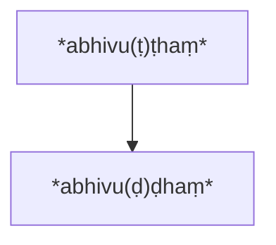

[^12]: In the Gāndhārī *Dhammapada* (GDhp, Brough 1962) *vṛṣṭi* is represented by *vuṭhi* (verse 219, 220) and *vṛddha* by *vrudha* (verse 146)

which is the normal derivation in the Prakrits (lenition) or

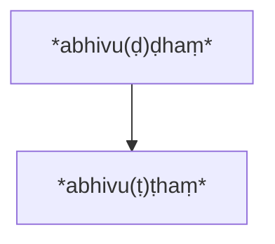

which would be a hypercorrection, that is, a monk/nun hearing *abhivuḍḍhaṃ* and knowing that intervocalic aspirates are often weakened (that is, voiced), “restored” the verb to its “original” form *abhivuṭṭhaṃ*, which he/she had decided was correct according to context. Or the changes might be coeval

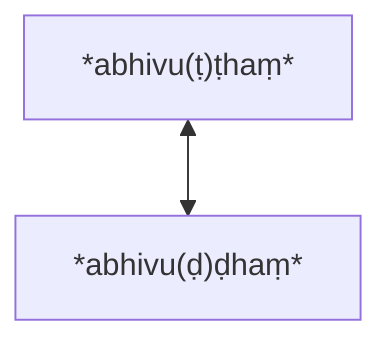

and not represent a directional time line at all, but simply dialect confusion amongst speakers (*bhāṇakas*) and hearers, which is Karpik’s suggestion (above, page 68). In this particular instance all we can be certain of is that there has been change, and that the change leads to ambiguity, so we cannot say for certain “what the Buddha said” or “what the Buddha meant”, whether “rained upon” or “increased” (as the *bīraṇa* grass is omnipresent in India and very fast- growing) or both. In favour of the second interpretation (“increased”) is the verb *pavaḍḍhanti* which appears in line 3 of the *gāthā* (“his sorrows increase”) and gives the parallelism “his sorrows increase as *bīraṇa* grass increases,” so typical of the Dhp.

There are two other MI versions of this *gāthā*, one the so-called “Patna *Dhammapada*” (PDhp), and the other the *Udānavarga* (UV), a completely Sanskritized version of the Dhp. The PDhp has *ovaṭṭhā* for Pāli’s *abhivaṭṭhaṃ*, the *o-* representing a contraction of *ava-* (the prefix of Vedic *ava + vṛṣ,* “rain upon”). The UV has *avavṛṣṭa* which is the past participle of the Vedic verb *ava + vṛṣ.* Gāndhārī, as we have opined above (footnote 12), would have *abhivuṭḥa/e* or *ovuṭha/e* (neuter sing.) depending on which prefix (*abhi- or ava- > o*-) it was using. The reader may judge for him/herself whether these are mutually intelligible.[^13]

[^13]: Karpik disagrees with von Hinüber’s conclusion (1983a: 7) that *-tvā* is a Sanskritization in Pāli (Karpik, p. 56-57). The *Patna Dhammapada,* which is generally considered to be later than Pāli (von Hinüber calls it “more Sanskritized than Pāli, but at the same time more Middle Indic than BHS” 1989: 365-66), yet retains the *-ttā* absolutives typical of the Prakrits (Pischel § 582). There is some evidence as well that the *-ttā* suffix for the absolutive has been preserved in Pāli in the word *mantā*, which Buddhaghosa treats as an absolutive of the verb *man*, “to think, investigate” *mantā ti upaparikkhitvā,* “*mantā* means having investigated” (Sv 3, 89216). The normal Pali form is *matvā*; *mantā* is an alt. form which occurs in Pāli and AMg; the latter also has the usual form *mattā* (Levman 2014: 288; Mylius 2003: 496). Geiger (§ 210A) provides several other examples. Karpik’s historical argument (that Pāli preserved the *tv-* conjunct from Vedic as an original feature) is questionable, as Pali does not preserve this conjunct anywhere else except in the absolutive (and the personal pronoun *tvaṃ* which also has an alt. *tuvaṃ* with epenthetic *-u-*), strongly suggesting that it is a Sanskritisation.

A simpler, and more clear-cut example is one which Norman gives from the *Sabhiyasutta* of the *Sutta Nipāta.* In the two versions that have come down to us in Pāli and BHS of the *Mahāvastu*, parallel passages have two phonologically cognate words, *virato* (“ceased”) and *virajo* (“free from impurity”). Norman concludes that the words “must go back to a common ancestor, which can only have been the Pkt form *virayo*” (1980a: 175).

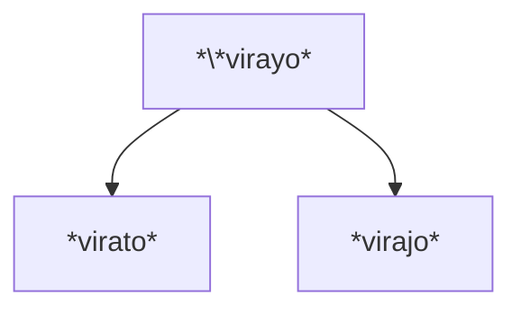

Lévi gives another simple example of the use of the *-y-* glide in the underlying language as a substitute for an intervocalic stop. Here the name of Sakka is preserved as Kosiya in Pāli (“owl” DN 2, 2703-4), which is the shared, common ancestor of both Kauśika in BHS (Levi, p. 499), and Kosika in Pāli, which appears as an epithet of the Buddha in the *Apadāna* 41415.

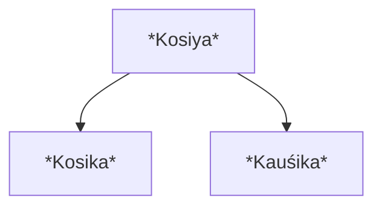

Another example which Lévi felt was “absolutely decisive” (*absolument décisif)* to demonstrate an earlier phonological layer underneath Pāli is the word *avādesi* (“he played (the lute”) in *Jātaka* 62, while the Bharhut *stūpa* preserves the form *avāyesi* (Lévi 1912: 497; Cunningham, p. 66, plate 26).

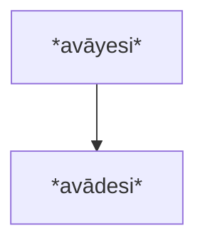

The date of the Bharhut *Jātakas* (third century BCE, Cunningham ibid: 14-17) is “much more ancient than the Pāli version of Ceylon” (Cunningham, ibid: 49), the earliest written recension of which dates to the first century BCE (Norman 1983: 5). Some of the Jātaka stories are very ancient and are un-Buddhistic in origin (Chalmers 1895 [2008]: xxiii; Norman ibid: 78-79). This particular *Jātaka*, about misogyny, has in fact nothing to do with Buddhism, and probably pre-dates it.

In my 2014 dissertation, I have provided many similar examples pointing to the necessary existence of a common denominator underlying *-y-* glide to account for later variation. Another clear example is GDhp 148, where the Gāndhārī form has *aya payedi pranina* (“drive the life of creatures”) where the verb *payedi* appears to be similar to or the same as the underlying *koine* form, as it results in several different variants:

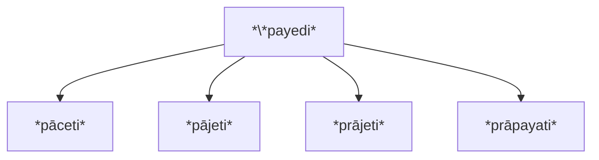

Pāli (Dhp 135) has *pāceti* with *pājeti* as a variant (< S *pra + aj,* “to drive forward, urge on”); the first is simply a variant of the second with lenition of -*c- > -j-.* The PDhp (verse 200) has *prājeti* with the Sanskritization of the initial *p- > pr-.* The UV (1.17) has *prāpayati* (< Skt *prāp,* “to lead or bring, to cause to reach of obtain”), which appears to be a back-formation from *prāpeti,* the intervocalic glide being interpreted as a labial stop rather than a palatal one (*-y-* *> -p-*)*.* Here it seems unequivocal that “the word the Buddha spoke” must have been *\*payeti or \*payedi or \*paye’i.*[^14]

In the *Ambaṭṭhasutta* (DN 1, 10519-20) the Buddha says that the questions Ambaṭṭha asks, “I will make clear with answers” (*ahaṃ veyyākaraṇena sobhissāmi*). The Pāli has several variants, including *sodhissāmi, sodissāmi, sodhāssāmi, and sovissāmi* (DTS, p. 96, footnote 1)*.* The verb *sobhissāmi* derives from *sobhati* (< Skt *śubh* “to shine, to be splendid”, caus. “to make resplendent, adorn, grade, to make clear”); the verb *sodhissāmi < sodheti,* caus. of *śudh* “to be purified” caus. “to make clean, to purify, examine, search, seek, correct”). The common denominator of these two forms would be *\*sohissāmi.* The change of *sodhissāma > sodissāmi,* that is loss of aspiration (Pischel §213; GDhp §43, 49) is probably later, as is the fairly common Prakrit change of *-dh-* *> -v-* (Norman 2006: 157). The reconstructed derivation is therefore

[^14]: Lüders, Norman and von Hinüber all discuss this verse. Lüders 1954 § 140; von Hinüber 1981: 822; Norman 1997 [2004]: 100.

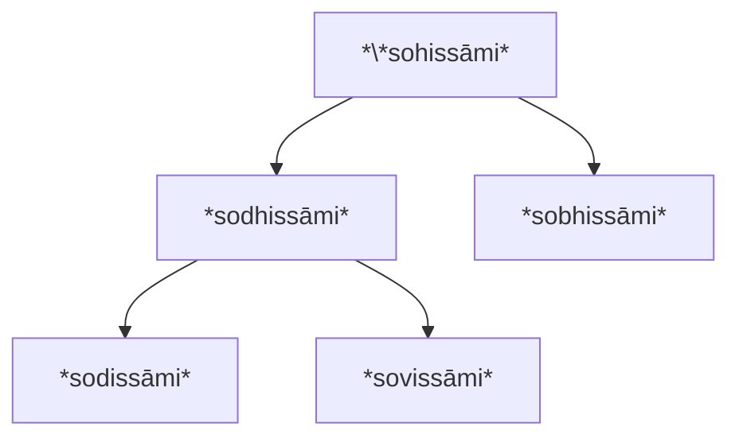

There are still some elements which are not clear about this particular passage, i. e. why the causative form was not used in *so(d)bhisssāmi* (*sobhessāmi < sobhessāmi < śobhayiṣyāmi*). The form *sodhāssāmi* seems to be a relic of the causative (*sodhāssāmi < sodhayiṣyāmi*), but the *-ayi-* form usu. changes to *-e-* not *-ā-* (*sodhessāmi*; von Hinüber 2001: §146).[^15]

A more complex example occurs in the *Mahāparinibbāna sutta* where the Buddha tells ānanda that he is eighty years old and his body is falling apart, “held together with straps” (*vegha-missakena*, DN 2,10014). There are six variant readings for the first word (*vegha-, vedha-, vekha-, veṭha-, vekkha-, and veḷu-*) in the Sinhalese, Thai, Burmese, and Cambodian traditions. Five of these can be explained by an underlying source word *\*veha,* where the aspirated stops have been dropped and replaced with an aspirate only.[^16]

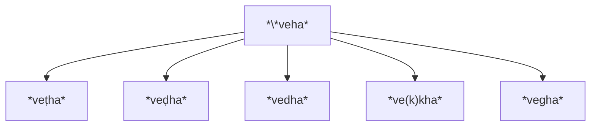

\**veha* is the lowest common denominator to five of the six variants, allowing each dialect speaker to restore the relevant stop, according to how the word was pronounced in his/her dialect. The original Vedic word on which the compound is based is either *vleṣka* or *veṣta*, both meaning “band” or “noose.” Which of these words did the Buddha use? Probably *\*veha-,* which is why scholars say, “The Buddha did not speak Pāli.” “Natural variation” (Karpik) would not produce five different types of aspirated stops (dental, retroflex voiced and unvoiced and velar voiced and unvoiced); a more cogent explanation must be sought in terms of derivation from a common-aspirate only source.

[^15]: The PTS also has two other variants which are not easily derivable from *\*sohissāmi, sossāmi* and *soladdhissāmi.* The former (“I will hear”) results from *-h- > Ø* which is possible but not a normal change; the latter seems to be a form of the verb *labh* (“to get, obtain,” p.p. *laddha*, “obtained, received”), which I cannot parse.
[^16]: The sixth variant, *veḷu* (“bamboo”), seems to be a comment on what the straps are made of, incorporated by mistake into the main text. The change of *\*veha > veḍha* would likely be via *veṭha* (Pischel §198, 239). See also GDhp §40-42 for Gāndhārī.

The BHS version of the sutta preserves yet another variant: *dvaidha-niśrayena* (“depending on two things”). The word *niśrayena* is clearly phonologically related to *missakena* and suggests that both reflexes go back to a source word

*\*Nissayena* (N = nasal) which the Pāli redactor heard as *missayena*, replacing the intervocalic *-y-* with a *-k-* to give the common word *missakena*, “mixed or combined with”. The BHS redactor heard the *nasal* as *n-* and interpreted the geminate *-ss-* as a Prakrit form of the OI conjunct *-śr-* to arrive at *niśrayena* “dependent on”. Both make sense in the context. Whatever first word the BHS redactor had in his examplar --\**veha,* or *vedha* -- appears to have been back- formed to *dvaidha*, the *-e-* taken to represent an Old Indic lost diphthong *-ai-* (not present in Pāli or the Prakrits) and the initial *v-* (mistakenly) taken to represent the conjunct *dv-.* The expression “dependent on two things” makes no sense in the context. (See Levman 2009 for a fuller discussion.)

Another example is the hyperform[^17] *isi-patana* (“descent of the seers”) and *isi-vadana* (“conversation of the seers”) which are mistranslations of Vedic *ṛṣya-vṛjana* (“antelope enclosure or pasture”):

> This is to be derived *< isi-vayana < isi vajana < ṛṣya-vṛjana.* There is no way in which *vṛjana* can develop *> patana,* and we are dealing with a form produced by a redactor who did not recognise the word *vayana*, but knew that -*v-* sometimes developed *< -p-,* and *-y-* developed *< -t-.* He therefore back-formed *patana < vayana* (Norman 1989b: 375).

There is another variant form *isi-vadana* (“speaking of the seers”). The underlying source word was \**isi-vayana:*

[^17]: Norman defines a hyperform as a “form which is unlikely to have had a genuine existence in any dialect, but which arose as a result of wrong or misunderstood translation techniques” (1989b: 375)

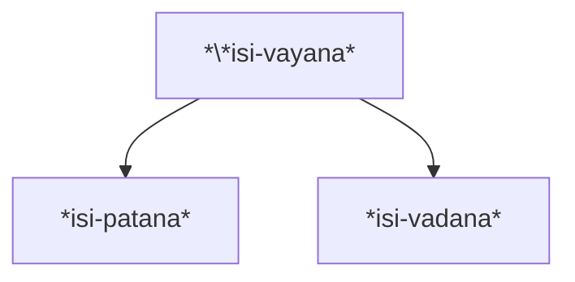

Interestingly, the commentary retains the correct etymology of the compound *migadāya* (*migānaṃ abhaya-dāna-vasena,* “on account of giving a fearless retreat to animals”) while inventing fake etymologies for *isi-patana* and *isi- vadana,* the location in question being a place where the seers “landed” (*patana*) and/or “conversed” (*vadana*) according to the commentary (Levman 2014: 394–396). *Isipatana* (also known as Deer Park) was just outside of Benares and the location of the Buddha’s first sermon.[^18]

Things are not always this easily reconstructible. Often there is evidence for more than one transmission. In the *Sakkapañhasutta* Sakka, the King of the Gods, asks the celestial musician Pañcasikha to attract the attention of the Buddha, who is in deep meditation, with a song. Pañcasikha sings a love song comparing secular and spiritual love. The sixth stanza reads:

> *tayi* ***gedhita****cittosmi, cittaṃ vipariṇāmitaṃ.paṭigantuṃ na sakkomi, \
> vaṅkaghastova ambujo* (DN 2 2667-8)
> 
> “My heart is greedy for you, it is changed; \
> I cannot resist, like a fish who has swallowed a hook.”

The word *gedhita* has three variants: *ganthita, gacita* and *gaṇita.* They are all past participles with adjectival meanings.

> *gedhita < gijjhati*, “to be greedy” (“My heart is greedy for you”)
> 
> *ganthita < ganthati,* “to tie, bind, fasten” (“My heart is bound to you”)
> 
> *gacita < gajati,* “to be drunk or confused” (“My heart is drunk with you”)
> 
> *gaṇita < gaṇeti,* “to count, reckon, take notice of, regard” (“My heart is reckoned in you”)

[^18]: Karpik (p. 72) suggests that “native speaker hyper-corrections based on a confusion over whether the place name \**isivayana* meant ‘gathering of the seers’ or ‘wild-animal enclosure’ are an alternative explanation” to Norman’s “proof of translation”. But that is exactly what a hyper correction is: not understanding what a phrase means, inferring an incorrect meaning and changing the phonetics of the word to match that meaning. The point is that a change from the original *\*isi-vayana* has taken place.

All of these descriptives fit in the context, and all are phonologically related. They point to an underlying *koine* form which removed some of these phonemic differences, like that between a voiced and unvoiced stop or a stop and aspirate, as some dialect users could not hear this distinction. So the earlier *koine* form was a “common denominator” version of the four adjectives where each dialect speaker was left to interpolate the correct phoneme from his dialect. For example, the aspirated stops *-th-* and *-dh-* were replaced with the simple aspirate *-h-* in the *koine* (*\*gahita* or *\*gehita*), and intervocalic stops, like *-c-* and *-j-* were replaced with a simple glide *-y-.* (*\*gayita*). Nasalization of vowels was common and haphazard. The exact transmission sequence in this example is not immediately clear and not easily reconstructible, but it does show the reader how variations crept into the *buddhasāsana* transmission. However it is unlikely that one source word can account for all these variants. Source words *\*gahita* or *\*gehita* can account for *gedhita* and *ganthita,* while the underlying word *\*gayita* would account for *gacita* and *gaṇita.*

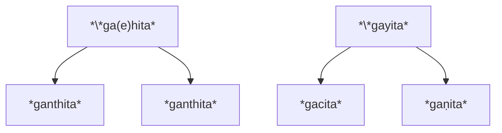

One still has to account for the nasalization of *ganthita,* the change of *-a- >* *-e-,* and the retroflex *-ṇ-* in *gaṇita*, which is not usually substituted for a glide in Prakrit.[^19]

A similar tangled phonological example (but reducible to a single source word) with several variants occurs in the *Mahānidānasutta* (DN 2, 55) where the Buddha is reported to have said that because of not understanding dependent origination, this generation has become *tantākulakajātā kulagaṇṭhikajātā muñjapabbajabhūtā.* The first compound means “become like entangled thread’ (*tanta-ākulaka-jātā*) and the third means “become like reeds and bulrushes”. But the second appears to be inconsistent as it says, “become like a knot in the family” (*kula-gaṇṭhika-jātā*) which doesn’t seem to make sense. Both the Burmese and the PTS (based on the Sinhalese recension) have alternate readings, *gulā-guṇṭhika- jātā and guṇa-gaṇṭhika-jāta,* and *guḷa-guṇḍika-jāta,* which indicates that the *bhāṇaka* (reciter) tradition wasn’t sure about what the correct transmission was. Examining them, it appears that *g-* was heard as *k-* by some dialect speakers who didn’t have the phonemic distinction between voiced and unvoiced stops. The word *guḷa* means a “ball” and *guḷā* means a “bird who has an entangled nest”; the word *kula* means “family” or “lineage”. *gaṇṭhikā* means a “knot” (< Vedic *grath/granth* “fasten, tie or string together”) and *guṇṭhika* and also *guṇṭhita* have the meaning “covered over with” (< Vedic *gudh* “wrap, envelop, cover” and also < *guṇṭh* “to enclose, envelop, surround, cover” p.p. *guṇṭhita*).

[^19]: In Gāndhārī, the intervocalic aspirate (*-h-*) can sometimes act as a syllable divider, or glide substitute for an intervocalic stop (see footnote 21). So, if the *koine* was similar in this respect to Gāndhārī then *\*ga(e)hita* is a possible single underlying source word.

All of these forms can be accounted for by reconstructing a proto-form *\*guṇa-ga/u(N)hiya.*[^20]

*guṇa* has the meaning of “ball, cluster, string” and in the Prakrits changes to *guḷa,* which has the same meaning (Pischel 243). *\*ga/u(N)hiya*[^21] *> guṇḍhika/guṇṭhika/ guṇṭhita* (“covered with”) depending on how one construes the aspirate as voiced or unvoiced > *gaṇṭhika* (“fastened”) is a similar phonological form, but with a different meaning because of the vowel replacement. So, although we’re not sure of the phonological form, the meaning is probably what Cone 2010: 59 suggests, “become enveloped in a tangled ball; knotted in a ball; in a tangle of threads”, all with a question mark. Edgerton (BHSD, sv *guṇāvaguṇṭhitabhūta*) provides even more alternate forms, including *guḍā-guñjika-bhūta* and many others. *guḍā* is simply another word for *guḷa* (“ball”), the change *-ḍ- > -ḷ-* being quite common in the Prakrits (Pischel §240); he considers *guñjika* “uninterpretable”. The first word (*guṇa/guḷa/guḍa*) means ball or string/thread and the second is a mixture of two verbs, “knotted” and “covered”, so Cone’s definition and Edgerton’s – “entangled *-nth- > -dh-*) or to nasal only in the case of a voiced stop *-nd- > -n- or -ndh- > - n̄-* (=*nh*) GDhp in (or like; a maze or tangle of) cords (threads)” are close to the mark.

[^20]: The alternation of vowel *-a- <> -u-* is apparently due to the presence of a vocalic *-ṛ-* in the postulated verb *\*gṛnth,* see Cone 2010: 57, sv *\*guṇṭheti* vol. 2.
[^21]: The N stands for a nasal which may or may not have been present, as *gudh* had no nasal, but *guṇṭh* did and *grath/granth* came in both varieties. The *-h-* usually represents an aspirated stop appearing as aspirate only, common in the Prakrits and the *koine* (Pischel §188; GDhp §40-42), but might also be an intervocalic glide (see below). The change of *\*ga/u(N)hiya* to *guṇḍhika* would likely be through *gunṭhika* (Pischel §198, 239). Compare the development of nasal + stop in Gāndhārī, which develops to stop or aspirated stop in the case of an unvoiced stop (*-nt- > -d-;* § 46. Also note that in Gāndhārī the *-h-* is used in place of *alif* (the letter which represents an implicit glide) or *-y-* as a syllable divider (GDhp §37, §39), so the *-h-* in *\*ga/u(N)hiya* might also be interpreted as a sign for a stop that has been weakened to the point of disappearing.

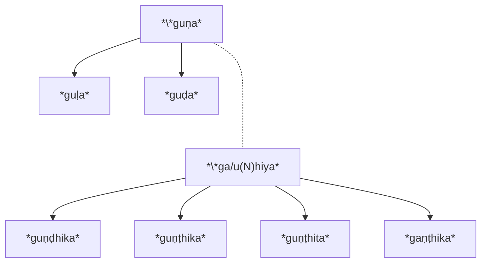

The “proof” of this derivation lies in the fact that *\*ga/uNhiya* is the lowest common denominator of all these four forms. It also explains Edgerton’s “uninterpretable” *guñjika* form, which is only another development of the hypothetical *\*ga/uNhiya* proto-form where the *N > ñ* or > Ø and the *-h- >* *-j-.* The root is *guj* or *guñj* meaning “to buzz” or “to hum”, which would give the compound the meaning “become like a buzzing ball,” probably referring to a swarm of insects. Another form which could also be derived is *gumphita* (< Vedic *guph* or *gumph,* “to string together, to tie”), which would give the compound the meaning of “tangled strings” (“like strings strung together”). Or *guñjika* is a variant form of *ku/añjika*, with lenition of the initial velar consonant *k- > g-,* meaning “fibrous plant” (see below).

The commentary here also illuminates the problems in transmission:

> ***gulāgaṇṭhikaṃ*** *vuccati pesakārānaṃ kañjiya-suttaṃ; gulā nāma sakuṇikā, tassā kulāvako ti pi eke. Yathā hi tad ubhayam pi ākulaṃ aggena vā aggaṃ mūlena vā mūlaṃ samānetuṃ dukkaran ti purima-nayen’eva yojetabbaṃ.* Sv 49530-33.
> 
> *gūlāgaṇṭhikaṃ* means the *kañjiya* (a fibrous plant) string used by weavers. The word *guḷā* means a she-bird, some say her nest also. “For just as both of them (the bird and the nest) are tangled together, it is difficult to distinguish, either the top from the top (presumably of the bird) or the root from the root (of the nest).”[^22] The phrase should be understood as the former meaning (i. e. *tantākulakajāta*, “entangled like a ball of string”).

The word *kañjiya* commonly means “rice-gruel” but here that makes no sense. Woodward, at Spk 2, 9616, footnote 5, commenting on this word, calls it “apparently in Skt. a fibrous plant” and MW (sv *kāñjikā*) has three alternative meanings to rice gruel, “a medicinal plant, an edible legume, a kind of creeping plant.” Note that this word is straightforwardly derivable from \**ga/u(N)hiya,* with the fortition of *g- > k-,* and treating the consonant *-h-* as an intervocalic *-y-* glide *> -j-. kañjiya* is another derivative of the underlying word, adopted by the commentator to explain the meaning of the compound (as a “ball of (tangled) strings” in this case).

[^22] The Pali is itself difficult to unravel. The *ṭīkā* says that “both of them” (*tadubhayaṃ*) refers to the weaver’s string and the nest, but it seems to make more sense as referring to the bird and the nest as above. The verbal infinitive *samānetum*, which usually means “to bring together” or “to put together” here means “to separate, to distinguish” (*vivecetuṃ*) per the *ṭīkā* (DN-ṭ 2, 118).

Which words did the Buddha speak? Edgerton (BHSD, p. 213) suggests the “original was most likely *guṇṭhita*; but possibly *guṇṭhika* (Pāli, prob. based on a Middle Indic *guṇṭhiya*, really = *guṇṭhita*), or *guṇḍita* (Amg. *guṇḍia, guṇḍiya*).” In fact, to account for all these variant forms, the earlier form and lowest common denominator is clearly derivable as \**ga/u(N)hiya* as we have shown, and this would be the closest word to what the Buddha actually said. We can now expand the derivation chart to include these two new words, the variant *guñjika* and the commentator’s *kañjiya*:

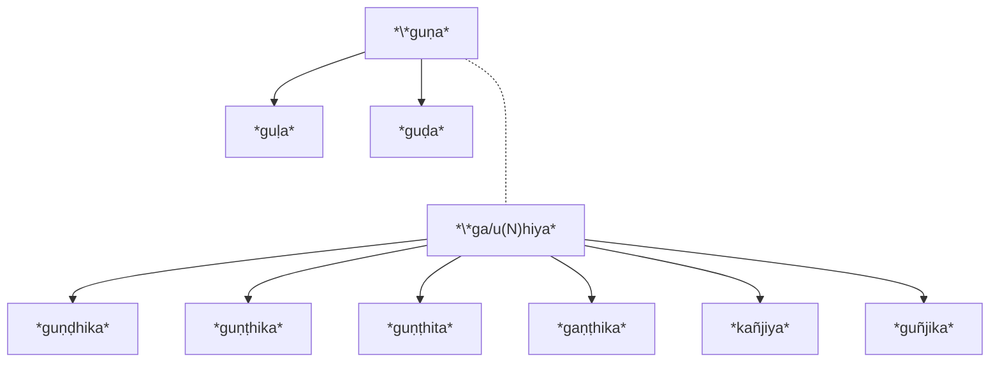

## Other examples

Even though there are thousands of variants in the canon, most have been interpreted, harmonized and “corrected” by generations of learned monks. The reason we still have so many left is that the different Pāli traditions (Sinhalese, Burmese, Thai, Cambodian and Laos) have preserved them in their own texts (often the most complex ones, resistant to an easy explanation), and we have many parallel texts in other dialects (Gāndhārī, and Buddhist Sanskrit in varying degrees of Sankritization) which also preserve parallel cognate forms. Most of the examples cited above have been from the Pāli canon. One finds the same phenomenon when one compares the Pāli recension with other recensions that have come down to us, for example the Sanskrit *Mahāparinirvānasūtra* (MPS; Waldschmidt 1950-51) and the Pāli *Mahāparinibbānasutta* (MPP). Comparing the two versions we find numerous examples of phonologically cognate words that have been interpreted differently. One example I discussed above (*vedha* et al., and *dvaidha*). Some other examples from the two *suttas* follow:

|  |  |  |  |  |
| --- | --- | --- | --- | --- |
| **MPS** | **Meaning** | **MPP** | **Meaning** | **Underlying form** |
| *dvīpa* | island | *dīpa* | light/island  (pun) | *dīpa* |
| *kośaṃ* | shell | *kavacaṃ* | armour | *\*kosaṃ* |
| *saṃraṃjanīyaḥ* | delightful | *sārāṇīyo* | delightful | *\*sālāyanīya?*  (Lüders, 1954: 87) |
| *samuddhṛtā* | rooted out | *samūhatā* | destroyed | *samūhatā* |
| *cinna* (=*chinna*) | cut off | *tiṇṇa* | transcended | *tiṇṇa?* |
| *Śālavrataṃ (var.*  *Śālavanaṃ)* | shrine name | *Sārandadaṃ* | shrine name | ? problematic |
| *āvilāyati* | is wearied | *āgilāyati* | is wearied | *\*āẏilāyati* or  *\*āvilāyati* |
| *pradeśa-vaktā* (<  *vac,* to speak) | to tell | *padesa-vattī* (<  *vṛt,* to move), see Sv 2, 5909 | to move | *\*vattī/ā* |
| *abhiprāyaṃ* | intention | *adhippāyo* | intention | *\*ahip(p)āya* |
| *aughena* | flood | *odhinā* | limit | *\*ohinā* |
| *avigopitaṃ* | undisturbed | *avikopitaṃ* | undisturbed | *\*aviẏopita* or  *\*aviopita* |
| *kumbhe* | reliquary | *tumbaṃ* | reliquary | *\*tumba* (Munda  word) |

A full discussion of the above with references may be found in Levman 2014a. Once again, although it may be argued (as Karpik does) that all these changes result from natural dialect variation (and are therefore all “Pāli”), the techniques of comparative historical linguistics suggest otherwise: that the variation is due to descent from a common ancestor, resulting in cognate sound correspondence sets. This hypothesis then allows scholars to both reconstruct a diachronic time line of change over time, and posit an underlying linguistic form which gave rise to variants. While is clear that there is a lot of synchronic variation (linguistic diffusion) in the Pāli canon, that is only one factor at work in the formation of the canon as it has been handed down to us. More on methodology below.

## Non-Aryan words

There is another problem in the canon which neither linguistic diffusion nor change over time can resolve; that is, when the underlying word has a non- Aryan source, the variants and ambiguities can be quite baffling. Consider the word *jaḷogi,* which occurs in the *Cullavagga* (Vin 2, 30111), and is defined as a “an alcoholic drink which is not [yet] alcoholic, [that is] has not arrived at the condition of being intoxicating”.[^23] Horner translates the word as “unfermented toddy” (1952 [2001]: vol. 5, 407). By looking at all the different parallel sources, it is clear that no one knows what the word means. The *ṭīkā* says that *jaḷogi* means “a young spirit...that which has not arrived at an intoxicating state [but] has been made with a collection of intoxicating ingredients; is it permissible to drink it?”.[^24] The Dharmagupta version calls it an alcoholic drink which it transliterates as *ja-l*ә*w-ga*.[^25] The Mahīśāsaka sect also transliterates the same, and defines it as “an alcoholic drink which is not done yet”.[^26] The Sarvāstivādin sect seems to translate it as “impoverished residence” and says that the “lack of local resources causes us to drink spirits”.[^27] Lévi (1912: 509) thinks that this might be a translation of *jaḍoka*, where the intervocalic voiced stop is not heard and the translator hears the *-ḷ-* as a *-ḍ-* (a common Pkt change) or restores it to what he/she thinks is the correct reading; this gives us *jaḍa + oka* (“lifeless home”). The Mūlasarvāstivādins substitute “to cure illness” (治病) for the name of the drink; it involves mixing spirits with water and shaking it up.[^28] The Tibetan parallel version of this text however translates it as *srin bu pad ma*, which is equivalent to the Sanskrit *jalauka* (also spelled *jalikā, jalukā, jalūkā*) or “leech”.[^29] Now what drinking like a leech might mean is not clear, but at least it provides a clue to *jalogi/jaloga/jaloka’s* etymology, which is probably Austroasiatic in origin from Santal *j*õ*k,* leech” (Bodding 1929-1926 [2013]: vol. 3 p. 329).[^30] In Santali (and most Munda languages) when a stop is followed by a vowel, the sound is checked and becomes voiced, so it is likely that IA speakers would not be able to distinguish between the *-k-* and *-g-.* In other Austroasiatic languages the word appears as *jĕlô* in Senoi, *jhlöng* in Khmer, and *glu* in Stieng and Chrau (Chatterji &Bagchi 1929: xxiii). Now it is quite probable that the immigrant Indo-Aryans adopted the local word for leeches (which are very common in India), and the large number of variant spellings support the hypothesis of an autochthonous word assimilated with difficulty into the foreign phonological structure of IA. Mayrhofer, for example (1963, vol. 1, 423- 424), gives well over a dozen variants for the word, including *jalaukā, jalūka, jalāyukā*, *jalālukā*, Pāli *jalūpikā,* Ardhamāgadhī *jalūgā,* Hindi *jalū,* Bengālī *jõk,* and Nepālī *juko,* citing the large number of transparent folk etymologies, of which Lévi’s (ibid: 590-510) *jala + oka,* “water resident” is one. He also notes that “*Für unarischen Ursprung spricht mancherlei*” (“Several things speak for a non-aryan origin”). Although this does not solve the problem at hand -– as to what *jaḷogi* refers to in the *Vinaya* -– it does provide a plausible explanation for the confusion over its meaning and spelling and suggests that it may have been used (and then forgotten) as a figure of speech for monks who had violated their vows, “leeching” off the offerings of the laity. A possible derivation is *jala* *+ j*õ*k* (“water + leech”) *> \*jalay*õ*k* (*-j- > -y-*) *>\* jaloka* ( *-y- > -*Ø-; -a- >*-*Ø- ) >*\*jaloga* (*-k- > -g-*). Judging from the different reflexes of the word, the Santal *-o-* sound had similarities to both back vowels, *-a-* and *-u-*:

[^23]: Vin 2, 30112-13: *yā sā surā asurātā asampattā majjabhāvaṃ.* The text describes the heretical practices of the monks of Vesālī, 100 years after the Buddha’s death, which are being discussed at the Second Council.
[^24]: Vin-ṭīkā 1, 112: *jalogīti taruṇasurā. Yaṃ majjasambhāraṃ ekato kataṃ majjabhāvamasampattaṃ, taṃ pātuṃ vaṭṭatīti adhippāyo*
[^25]: 闍樓羅 at T22n1428\_p0968c22. Transcription as per Pulleyblank 1991.
[^26]: 釀酒未熟者 atT22n1421\_p0194a19. The characters transliterating the drink are slightly different (闍樓伽) but have the same sound as per Pulleyblank.
[^27]: 我等住處貧作酒飲 at T23n1435\_p0451c29.
[^28]: 以水和酒攪而飲用T24n1451\_p0412c19.
[^29]: Lévi, ibid: 509: “The monks of Vesālī drink, sucking like leeches, fermented drinks which they render licit by reason of sickness”. Tibetan *yangs pa tsang gyi dge slong rnams kyis srin bu pad ma bzhin du tshang bzhibs te ‘thungs nas nad pas rung bar byed de.* I am reading *chang* (brewed liquor) for *tshang.*

> *jaḷogi, jalaukā, jalūka, jalāyukā*, *jalālukā*, *jalālokā, jalūgā, jalū, jõk, juko*

Most of these words can be traced back to *\*jaloga* itself or an earlier form in its development. The unusually large number of variants points to a *desi* (autochthonous) form, adapted by different MI speakers to the sounds of their own dialects.

There are hundreds of *desi* words in the canon, mostly toponyms (place names), personal names and names for plants, animals and special native customs which the Indo Aryan immigrants encountered when they entered the continent. I have discussed some of these in Levman 2013: 148-49 and a near complete list from the MPP and MPS is available in Levman 2014a. Phonological and etymological indeterminacy are a feature of these words. To take one example from MPP and the *Ariyapariyesanāsutta*: en route to Kusinārā, where the Buddha enters *parinibbāna*, he stops at the river (Kukustā, Skt; Pāli, Kukutthā, var. Kakudhā, Kakuthā < Tamil *koṭṭam*, the crape ginger tree, prefixed by *ka-* or *ku-*). Here he meets Pukkusa (Skt. Pukkuśa, Pukkaśa, Pulkasa, “garbage collector,” a Munda word per Kuiper, 1991: 54-6). He is a follower of ālāra Kālāma (Skt. ārāḍaḥ Kālāma), who was the Buddha’s teacher as well before his enlightenment (*Ariyapariyesanāsutta* MN 1, 163-65), and is converted to the *buddhadhamma* by the story of the Buddha’s non-perception of a thunderstorm while in deep *samādhi*. The Pāli word *aḷāra* (“crooked, bent”), Skt. *arāla* , is a Munda word (Kuiper 1948: 13-14), and Pāli *kālāma* = Skt. *kālāpa* (MW, “serpent’s hood, demon” < *kalāpa*, “bundle, band”) is also of indigenous origin (< Kannaḍa *kalappu*, “miscellaneous collection” per Turner 1962-1985, item 2931), pointing to āḷāra Kālāma’s connection with the autochthonous serpent (*nāga*) cults.

[^30]: The tilde over the *-o-* represents a nasalized sound and the underline an open sound, like the word “awe” in English. It is a “low-back-wide round sound” (vol. 4, p. 486).

There are hundreds of such words in the canon and any attempt to understand them in terms of orthodox IA phonology or dialectology will not be convincing. They are foreign words assimilated into the IA phonetic structure, and like

*\*jaloga,* discussed above, will have many variations.

## Methodology

As the reader has now seen in some detail, the process I and others have been following involves comparing parallel cognate words in different Pāli recensions or between Pāli and other dharma transmissions and isolating earlier forms which account for later reflexes. This shows what Darwin called “descent with variation”, that is, that later forms share common features with their entailed common ancestor. This method lies at the heart of historical linguistics and evolutionary biology; its value in understanding change over time and tracing our origins cannot be overestimated. This method is not without limitations, as diachronic influences are also constrained by the synchronic diffusionary influences of both local language groups and interpretations by local MI dialect speakers. For more on this latter point and the importance of the diffusionary forces in India as a linguistic area, see Chapter 11 in my 2014 monograph (495-516).[^31] One cannot argue that “the Buddha taught in Pāli” without accounting for all these variants and the underlying forms they clearly point to. It is in my mind impossible to attribute the changes to the random effects of different dialect speakers, when the inductive method applied here reveals otherwise. Even were this possible it still begs the question, when we have multiple reflexes available to us, “What word, case ending, etc., did the Buddha use?”

As I have argued here, the Buddha spoke a vernacular close to Pāli, but with (in some cases) a different lexemic content and different morphological features. We can now spell out some of the principal features of the *koine* which I believe underlies the Pāli transmission. In the following one should keep in mind Edgerton’s Sanskritization ∝ (varies as) time rule, i. e. the more Sanskritization in a Prakrit work, the later the time and vice-versa, the more Prakritisms an ms contains, the earlier it is (1953 [1998]: vol. 1 xxv).

[^31]: For a short summary of the issues see Levman 2014: 91-95, which problematizes the OI > MI derivational model and summarizes (p. 93) that “We are left then with a very complex tableau of diachronic forces tending towards divergence and synchronic, contact processes tending towards dialect levelling and simplification, the whole a constantly intermixing, constantly changing linguistic continuum which we can only imperfectly grasp.” The linguistic fabric at the time was quite complex, with many MI changes being dialect forms already present in OI, some MI forms being derived from forms which pre-dated OI and other MI forms preserving archaic OI forms which were later lost to standard Skt. Nevertheless, the comparative method, despite its limitations, has great usefulness for establishing earlier forms, because of the availability of numerous correspondence sets which can be demonstrated to be genetically related through standard linguistic techniques, i.e. because of the regularity of sound change, the first and most important of the Neo-grammarian principles. Karpik (page 55, footnote 68) believes that both Pali and Vedic developed in parallel and derived from a pre-Vedic common ancestor, which view he attributes to Wackernagel. A similar view has been argued by Oberlies (2003: 164, “MIA languages…descend from dialects which, despite many similarities, were different from Ṛgvedic and in some regards even more archaic”), but Pischel (§6) maintains that “all the Prakrit languages have a series of common grammatical and lexical characteristics with the Vedic language…” (and von Hinüber (2001: §12), after reviewing the evidence, concludes that “*Das Mittelindisch ist also im wesentlichen aus dem Vedischen entstanden.*” (“MI has, therefore, essentially arisen from Vedic”). The actual answer appears to lie in the middle. \
Addendum: I have just received Oberlies’ new book on Pāli Grammar where he seems to have modified his view above and now asserts that “Pāli goes back to a Vedic vernacular situated most probably (south-) east of Arachosia near the Bolan pass” (2019: 35), which he calls a “Nebenmundarten” (“nearby dialect”) of the Ṛgvedic main dialect (p. 21).

1. lenition or loss of intervocalic stops. This is in part a normal evolutionary feature of the development of OI > MI and in part the result of diffusionary influences from other language groups in the linguistic area, which lacked the voiced/unvoiced phonemic distinction. By and large most traces of intervocalic stop lenition have been Sanskritized in Pāli, but there are still some remnants remaining (Geiger §36: Skt *śuka*, “parrot” > Pāli *suva/suka*; Skt *khādita*, “eaten” > Pāli *khāyita*; Skt *nija*, “own” > Pāli *niya*; Skt *svādate*, “tastes” > Pāli *sāyati*).
2. The change of aspirated stops to aspirates only. This too is a normal OI > MI change, one that was also influenced by language groups that had no phonemic aspirated stop. Generally Pāli restores the aspirated stop to its “original” (Vedic) form, but not always; sometimes it preserves both the earlier form in *-h-* only and the aspirated one: *lahu*, “light” in Dhp 35 beside *laghiman,* “lightness” Sadd 8672; *ruhira*, “red, blood” at Th 568 and *rudhira* in Dhp-a 1, 14014; *sāhu*, “good” Th 43 beside *sādhu*, throughout. There are numerous examples in verb forms where the aspirate only is preserved in Pāli, *bhavati > hoti,* “he is” *dadhāti > dahati*, “he puts, places” in Sn 841. For more examples see Geiger §37; von Hinüber 2001: §184.
3. Assimilation of consonant clusters. This is close to universal in the Prakrits, including Pāli and the assimilation is a principal argument against Karpik’s suggestion that *-tvā* is an earlier Pāli ending than *-ttā* (above footnote 13). We have also discussed above the conjunct *br-* as a back formation/Sanskritization from the original noun. Gāndhārī preserves the *br-* conjunct in *bramaṇa* and consonant clusters with *-r*, sometimes with metathesis (e.g. S *durga >* Gāndhārī *drugha*, “difficult way”; *durgati > drugadi*, “distress”; *durbala > drubala*, “weak”), but it is not universal (Skt. *prāṇa* > Gāndhārī *paṇa*). Gāndhārī also maintains some consonant clusters ending in *-v*, like *dvara*, “door” or *dvayu*, “both.” In many cases these consonant clusters do not make position, indicating they were probably pronounced as single consonants or geminates (see Levman 2014: 61-2). Presumably the underlying *koine* eliminated all conjuncts which would privilege any one dialect over another. This would be especially important for non-IA speakers who did not know Vedic, and who might be confused by an additional metathesized *-r* in a Gāndhārī word like *dhrama* (< Skt *dharma*) which appears in the Asokan inscriptions in Sh and M.
4. Levelling of sibilants. In all of the Prakrits except Gāndhārī the dental (*-s-*)*,* retroflex (*-ṣ-*)*,* and palatal sibilants (*-ś-*) lose their distinction and are replaced by a dental (*-s-*); Māgadhī replaces them all by a palatal sibilant (*-ś-*)*.* Gāndhārī maintains the Sanskrit distribution “for the most part” with a few differences (GDhp §50). The *koine* would employ the dental sibilant throughout (*-s-*) by the “majority wins” principle of linguistic reconstruction (Campbell 1999: 131).
5. Interchange of glides with glides, glides with nasals, glides with palatals and liquids. In MI *-y-* and *-v-* were often interchangeable (Pischel §254), as were *-y-* and *-j-* (Pischel §236, §252)*,* and *-v-* and *-m-* in nasalized contexts (Pischel §248, §250-51, §261); some of this interchange was due to MI dialect idiosyncrasy (or inherited from OI, cf. Bloomfield and Edgerton 1932: §223–240), and the alternation between *-m-/-v-* which occurs in Dravidian (Zvelebil 1990, xxi), may also be in part attributable to the lack of a -*v-* sound in some non-IA languages like Munda, Tibetan (Tib) and Chinese. The phonemes *l* and *r* were also interchangeable, usually thought to be because of dialect differences with *l* predominating in the east of India and *r* in the west. In the *koine*, I assume that the phonology followed the dialects of the north-west for the reasons outlined, which would mean a preference for western *r* over eastern *l.* I also postulate that the *koine* would show a preference for *-m-* over *-v-* in nasalized contexts as does Gāndhārī (GDhp §36). This could cause confusion in the transmission, if, for example a word like *nirvāna* was sometimes transmitted as *nirmāṇa,* as happens in the *Vimalakīrtisūtra*. The Tibetans correctly interpret the word *nirmāṇa < nirvāṇa*, but the editors of the *sutta*, not understanding the phonology, changed it to *vimāna* (“palace”) in their critical edition (Levman 2014: 201-02).[^32] In the north-west the word *nirvāna* is transmitted both with and without the *-rv-* conjunct (*nirvaṇa* in GDhp 58 and *nivaṇa* in GDhp 76).

[^32]: Study Group on Buddhist Sanskrit Literature, *Vimalakīrtinirdeśa*, page 104, footnote 10. For the word *nirmāṇa* see manuscript line 63b6,

## Conclusion

I am not the first person to infer a *koine* underlying the received transmission of Pāli. Geiger called it a *lingua franca,* Smith a *koine Gangétique,* Bechert a common super-regional *Dichtersprache* and Lüders an “*Ur-Kanon*” (“original canon”) based on the *Kanzleisprache* administrative language of Magadha. Others like Norman simply see an earlier dialect or dialects, traces of which can be found in Pāli,[^33] or like Lévi, or von Hinüber, an earlier layer. The exact nature of this linguistic form will always be putative, unless some very early Buddhist transmissions turn up from the fifth or early fourth century, that is, from the time of the Buddha, who is generally believed to have died around 380 BCE. But, as I hope to have shown in this article, some of the earlier forms of this layer can be isolated and defined, using the techniques of comparative historical linguistics. These point to the existence of a shared common ancestor among many of the Pāli and Pāli/BHS variants that have come down to us. And that is why scholars are hesitant to say the “The Buddha spoke Pāli”, although I think most would agree that the Buddha spoke a MI dialect or *koine* which was close to Pāli, but not identical in lexemic content and morphology.

One last point I would like to make. To many, acceptance of the assertion that the Buddha spoke Pāli is a matter of faith. I understand and respect this position. Such people feel that the argument that Pāli and its precursor dialect(s) changed over time and that the teachings were not fixed and unchangeable from the moment the Buddha spoke them, to be a disparagement of the *dhamma*. This is indeed not the case. In fact the exact opposite is the case. A natural language does indeed change over time; it is subject to *anicca*, in the same way as any other conditioned phenomenon. The Buddha did not espouse the brahmanical view that language was permanent and immortal and had its own unchanging essence; language changed over time, both because of diffusionary influences from other coeval dialects and normal language evolution (Levman 2017). So the presence of the different stratigraphic levels which I have identified above within Pāli are another proof of the historical reality of the Buddha himself and the authenticity of his teachings couched in a naturally spoken vernacular, which like any natural language changed in response to changing linguistic conditions.

[^33]: For example in his 1997 [2006] lecture he says, “some texts, i. e. the ones in which we find the anomalous forms, existed at an earlier date in a dialect or dialects other than Pali” (p. 81), but see also his 1989a work where he calls Pali “a kind of ecclesiastical *koine*, the *lingua franca* of the Theravādins of the eastern part of India…” (p. 35)

If, as has been suggested recently by David Drewes (2017), the Buddha was not an historical figure then, in order to account for the existence of the *Tipiṭaka* one would have to argue that it was produced by a committee (presumably of monks), a fraudulent, artificial creation which invented the Buddha and his teachings out of whole cloth in a language which was itself artificial and whose “purity” was preserved by this same committee who ensured the language didn’t change. In this scenario, the language of the Buddha, Pāli, and the Buddha himself are created by the committee of monks; Pāli is indeed not subject to normal diachronic and synchronic linguistic change, as it is an invented and artificial communication medium, fixed at one point in time and preserved by this and various subsequent committees. This hypothesis seems *prima facie* absurd, and Alexander Wynne in his answer to Drewes discusses in some detail the illogicality of that position (2019). There is no need to go into the details here except to state that the hypothesis of Pāli as the language the Buddha spoke unchanged since its first utterance by the Teacher is not consistent with both what we know about historical linguistic evolution and what we find in the transmissional record. This is also what I would deduce as a fifth proof of the historicity of the Buddha in my own response to Drewes (2019).

### Abbreviations

| | |
| :-: | --- |
| AMg | ArdhaMāgadhī |
| BHSD | *Buddhist Hybrid Sanskrit Dictionary* (Edgerton 1953) Dhp *Dhammapada* |
| DN-ṭ | *Dīgha Nikāya Ṭīka,* Lily de Silva, Colombo University, Ceylon, 1960. |
| DTS | Dhāmachai Tipiṭaka Series edition of the *Sīlakhandhavagga* of the DN |
| Geiger | Geiger 1916 [2005], edited by K.R. Norman Gir Girnār (Rock Edict) |
| GDhp | *Gāndhārī Dhammapada* (Brough 1962) |
| M | Mānsehrā (Rock Edict) |
| MI | Middle Indic |
| MPP | *Mahāparinibbānasutta* |
| MPS | *Mahāparinirvāṇasūtra* (Waldschmidt 1950-51) |
| PDhp | Patna *Dhammapada* |
| Pischel | Pischel 1900 [1981], translated by Subhadra Jhā. |
| Sadd | *Saddanīti* (Smith 1928 [2001]) |
| Sh | Shābāzgaṛhī (Rock Edict) |
| UV | *Udānavarga* |

### **Symbols**

| | |
| :-: | --- |
| < | derived from |
| > | source for |

### Works Cited

Allen, C. 2002. *The Buddha and the Sahibs*. London: John Murray Publishers. Alsdorf, L. 1980. “Ardha-Māgadhī.” In *Die Sprache der ältesten buddhistischen*

*Überlieferung,* H. Bechert, ed., *Abhandlungen der Akademie der Wissenschaften in Göttingen, Philologisch-Historische Klasse, Dritte Folge,* Nr. 117: 17-23.

Bechert, H. 1980. “Allgemeine Bemerkungen zum Thema Die Sprache der ältesten buddhistischen Überlieferung.” In *Die Sprache der ältesten buddhistischen Überlieferung,* H. Bechert ed., *Abhandlungen der Akademie der Wissenschaften in Göttingen, Philologisch-Historische Klasse, Dritte Folge,* Nr. 117: 24-34. English version in *Buddhist Studies Review,* 8 1-2 (1991): 3-19.

Bernhard, F. 1970. “Gāndhārī and the Buddhist Mission in Central Asia.” In *Añjali, Papers on Indology and Buddhism. A Felicitation Volume Presented to Oliver Hector de Alwis Wijesekera on his Sixtieth Birthday*. J. Tilakasiri. Peradeniya: The Felicitation Volume Editorial Committee, University of Ceylon.

Bloomfield, M. and F. Edgerton. 1932. *Vedic Variants, Volume 2: Phonetics*.

Philadelphia: Linguistic Society of America.

Bodding, P O. 1929-36. *A Santal Dictionary*. Oslo: I kommisjon hos J. Dybwad Bollée, W. B. 1983. *Reverse Index of the Dhammapada, Suttanipāta, Thera- und*

*Therīgāthā Padas with Parallels from the Āyāraṅga, Sūyagaḍa, Uttarajjhāya, Dasaveyāliya and Isibhāsiyāiṃ.* Reinbeck: Studien zur Indologie und Iranistik. Monographie 8.

Boucher, D. 1998. “Gāndhārī and the early Chinese Buddhist translations reconsidered: the case of the Saddharmapuṇḍarīkasūtra.” *Journal of the American Oriental Society* 118, no.4: 471-506.

Brough, J. 1962. *The Gāndhārī Dharmapada*. London: Oxford University Press. Campbell, L. 1999. *Historical Linguistics.* Cambridge: The MIT Press.

Chalmers , Robert. 1895 [2008]. *The Jātaka or Stories of the Buddha’s Former Births.* Delhi: Motilal Banarsidass Publishers.

Chatterji, S. K. and P. C. Bagchi,1929. “Introduction” to *Pre-Aryan and Pre- Dravidian in India*. Calcutta, by Sylvain Lévi, Jean Przyluski and Jules Bloch. Calcutta: University of Calcutta. Translated into English by P. C. Bagchi.

Cone, M. 2001-2010. *A Dictionary of Pāli*. Oxford: Pali Text Society.

Cunningham, Alexander. 1962. *The stūpa of Bharhut: a Buddhist monument ornamented with numerous sculptures illustrated of Buddhist legend and history in the third century B.C.* Vārānasi: Indological Book House.

Deshpande, M. M. 1979. “Genesis of Ṛgvedic Retroflexion: A Historical and Sociolinguistic Investigation.” In *Aryan and non-Aryan in India*. M. M. Deshpande and P. E. Hook eds., Ann Arbor: Center for South and Southeast Asian Studies, The University of Michigan**:** 235-315.

Dhammachai Institute. 2013. *Dīghanikāya*. *Volume 1. Sīlakkhandhavagga.* Thailand:

Dhammachai Institute, Dhammakāya Foundation.

Dil, A. S. 1980. *Language and Linguistic Area*. Stanford, CA: Stanford University Press. A source book for most Emeneau articles.

Drewes, David. 2017. “The Idea of the Historical Buddha.” *Journal of the International Association of Buddhist Studies* 40 (2017): 1-25.

Dschi, H.-L. (Ji Xianlin) 1944. “Die Umwandlung der Endung -aṃ in -o und -u im Mittelindischen.” *Nachrichten der Akademie der Wissenschaften in Göttingen aus dem Jahre 1944 Philologisch-Historische Klasse*: 121-144.

Edgerton, F. 1953 [1998]. *Buddhist Hybrid Sanskrit Grammar and Dictionary*.

Volumes 1 and 2. Delhi: Motilal Banarsidass Publishers, Reprint 1998.

Geiger, W. 1916. *Pāli Literatur und Sprache*. Strassburg: Verlag Karl. J. Trübner. English translation in Geiger, W. 1943 [2004]. *Pāli Literature and Language, translated by Batakrishna Ghosh*. New Delhi: Munshiram Manoharlal Publishers. Originally published in 1943.

Geiger, W. 1916 [2005]. *A Pāli Grammar. translated into English by Batakrishna Bhosh, revised and edited by K. R. Norman*. Oxford: The Pali Text Society. Originally published in 1916.

Gombrich, R. 2018. *Buddhism and Pali.* Oxford: Mud Pie Books.

Hinüber, O. v. 1981. “A Vedic verb in Pāli: *udājita*”. *Sternbach Felicitation Volume*. Lucknow**:** 819-822). Also available in *Kleine Schriften Teil 2,* Harry Falk und Walter Slaje eds., (Wiesbaden, Harrassowitz Verlag, 2009), 616-619.

Hinüber, O. v. 1982. “Pāli as an Artificial Language.” *Indologica Taurinensia* 10: 133-140. Also published in Kleine Schriften, Teil 1, Harry Falk und Walter Slaje eds., (Wiesbaden, Harrassowitz Verlag), 451-458.

Hinüber, O. v. 1983a. “The Oldest Literary Language of Buddhism.” *Saeculum* 34 (1983): 1-9. Also published in *Selected Papers on Pāli Studies* (Oxford: The Pali Text Society, 2005), 177-94.

Hinüber, O. v. 1983b. “Sanskrit und Gāndhārī in Zentralasien.” *Sprachen des Buddhismus in Zentralasien*. K. R. u. W. Veenker**:** 27-34. Also available in *Kleine Schriften Teil 1,* Harry Falk und Walter Slaje eds., (Wiesbaden, Harrassowitz Verlag, 2009), 581-88.

Hinüber, O. v. 1989. “Origin and Varieties of Buddhist Sanskrit.” *Dialectes dans les littératures indo-aryennes*. Paris**:** 341-367. Also available in *Kleine Schriften Teil 2,* Harry Falk und Walter Slaje eds., (Wiesbaden: Harrassowitz Verlag, 2009), 554-580.

Hinüber, O. v., 1996. “Linguistic Considerations on the Date of the Buddha.” In *When did the Buddha live? The Controversy on the Dating of the Historical Buddha*. H. Bechert, ed., Delhi: Sri Satguru Publications**:** 185-194.

Hinüber, O. v. 2001. *Das ältere Mittelindisch im Überblick.* Wien: Verlag der Österreichischen Akademie der Wissenschaften.

Hinüber, O. v. 2004. “Buddhist Literature in Pali.” In Robert E. Buswell Jr., ed.,

*Encyclopedia of Buddhism.* New york: Macmillan Reference USA: 625-629.

Hinuber, O. v. 2006. “Hoary Past and Hazy Memory: on the History of Early Buddhist Texts.” *Journal of the International Association of Buddhist Studies* Vol. 29, No. 2, 2006 (2008):193-210.

Horner, I. B. 1952 [2001]. *The Book of the Discipline* (*Vinaya-Piṭaka*). Volume 5.

Oxford: Pali Text Society.

Karashima, S. 1992. *The Textual Study of the Chinese Versions of the Saddharmapuṇḍarīkasūtra in the light of the Sanskrit and Tibetan Versions*. Tokyo: Sankibo Press.

Karpik, Stefan. 2019. “The Buddha taught in Pali: A working hypothesis.” *Journal of the Oxford Centre for Buddhist Studies* 2019 (16): 10-86.

Keith, A. B. 1920 [1971]. *Rigveda Brahmanas: The Aitareya and Kauṣītaki Brāhmaṇas of the Rigveda*. Delhi: Motilal Banarsidass. Originally published 1920.

Kuiper, F. B. J. 1948. Proto-Munda Words in Sanskrit. Amsterdam: N.V. Noord- Hollandsche Uitgevers Maatschappij.

Kuiper, F. B. J. 1955. ‘Rigvedic Loanwords’. In Studia Indologica Festschrift für Willibald Kirfel zur Vollendung seines 70 Lebensjahres, edited by H. v. O. Spies, 137–185. Bonn: Selbstverlag des Orientalischen Seminars der Universität Bonn.

Kuiper, F. B. J. 1967. ‘The Genesis of a Linguistic Area’. *Indo-Iranian Journal* 10: 81–102.

Kuiper, F. B. J. 1991. Aryans in the Rigveda. Amsterdam-Atlanta, GA: Rodopi.

Lamotte, É. 1958 [1988]. *History of Indian Buddhism from the origins to the Śaka Era, translated from the French by Sara Webb-Boin*. Louvain-la- Neuve: Université Catholique de Louvain Institut Orientaliste, originally published 1958.

Lévi, S. 1912. “Observations sur une langue précanonique du bouddhisme.” *Journal Asiatique* Novembre-Décembre 1912: 495-514.

Levman, B. 2009. “*Vedhamissakena:* Perils of the Transmission of the

*Buddhadhamma*.” *Canadian Journal of Buddhist Studies* 5: 21-38.

Levman, B. 2010a. “Aśokan Phonology and the Language of the Earliest Buddhist Tradition.” *Canadian Journal of Buddhist Studies* 6: 57-88.

Levman, B. 2010b. “Is Pāli closest to the Western Aśokan dialect of Girnār?” *Sri*

*Lankan International Journal of Buddhist Studies (SIJBS):* 79-107.

——— 2013 “Cultural remnants of the indigenous peoples in the Buddhist

scriptures.” *Buddhist Studies Review.* Vol. 30.2: 145-180

Levman, B. 2014. “Linguistic Ambiguities, the Transmissional Process, and the Earliest Recoverable Language of Buddhism.” PhD diss., University of Toronto, Department for the Study of Religion. Available from Dissertations & Theses @ University of Toronto; ProQuest Dissertations & Theses Global. (1566171666). Retrieved from <http://search.proquest.com/docview/1566171666?account> id=14771

Levman, B. 2014a. “Chapter Thirteen, Transmission of the Dharma – The *Mahāparinibbānasutta* and the *Mahāparinirvāṇasūtra*.” Unpublished. An alternate version of Chapter Thirteen of my doctoral thesis. For a copy please write bryan.levman@utoronto.ca

Levman, B. 2015. “Towards a Critical Edition of the Tipiṭaka.” *Thai International Journal for Buddhist Studies* 5.

Levman, B. 2016. “The Language of Early Buddhism.” *Journal of South Asian*

*Languages and Linguistics* 3(1): 1-41.

Levman, B. 2017. “Language Theory, Phonology, and Etymology in Buddhism and their

relationship to Brahmanism,” *Buddhist Studies Review,* vol. 34, No. 1, pp. 25-51.

Levman, B. 2018 “The Transmission of the *Buddhadharma* from India to China: an Examination of Kumārajīva’s Transliteration of the *dhāraṇīs* of the *Saddharmapuṇḍarīkasūtra,”* in Ann Heirman, Carmen Meinert and Christoph Anderl, eds., *Buddhist Encounters and Identities Across East Asia.* pp. 137-195. London: Brill Publishing.

Levman, B. 2019. “The Historical Buddha: Response to Drewes.” *Canadian Journal of Buddhist Studies*, vol. 14: 25-56.

Lüders, H. 1954. *Beobachtungen über die Sprache des Buddhistischen Urkanons*.

Berlin: Akademie Verlag. Introduction (pp 1-11) by Ernst Waldschmidt.

Mayrhofer, M. 1963. *Kurzgefasstes etymologisches Wörterbuch des Altindischen, A Concise Etymological Sanskrit Dictionary*. Heidelberg: Carl Winter Universitätsverlag.

Mylius, K. 2003. *Wörterbuch Ardhamāgadhī-Deutsch*. Wichtrach: Institut für Indologie.

Norman, K. R. 1969 [1995]. *The Elders’ Verses I Theragāthā.* Oxford: Pali Text Society.

Norman, K. R. 1976. “Pāli and the language of the heretics.” *Acta Orientalia* 37: 117-27. Also available in *Collected Papers* 1 (Oxford: Pali Text Society, 1990), 238-246.

Norman, K. R. 1980a. “Four Etymologies from the Sabhiya-sutta.” *Buddhist Studies in honour of Walpola Rahula*. Somaratna Balasooriya (et al.), eds. London: Gordon Fraser**:** 173-184. Also published in *Collected Papers* 2 (Oxford: Pali Text Society, 1991), 148-161.

Norman, K. R. 1980b. “The dialects in which the Buddha preached.” *Die Sprache der ältesten buddhistischen Überlieferung, Abhandlungen der Akademie der Wissenschaften in Göttingen, Philologisch-Historische Klasse, Dritte Folge, Nr. 117:* 61-77. Reprinted in *Collected Papers* 2 (Oxford: Pali Text Society), 128-

147.

Norman, K. R. 1983. *Pali Literature.* Wiesbaden: Otto Harrassowitz.

Norman, K. R. 1987. “An epithet of Nibbāna,” *Śramaṇa Vidyā: Studies in Buddhism (Prof. Jagannath Upadhyaya Commemoration Volume)* (Sarnath, 1987), 23-31. Also available in *Collected Papers* 3 (Oxford: Pali Text Society), 183-189.

Norman, K. R. 1988. “The origin of Pāli and its position among the Indo-European languages.” *Journal of Pali and Buddhist Studies* 1: 1-27. Also available in *Collected Papers* 3 (Oxford: Pali Text Society, 1992), 225-243.

Norman, K. R. 1989a. “The Pāli Language and Scriptures.” In *The Buddhist Heritage*.

T. Skorupski. Tring**:** 29-53. Also available in *Collected Papers* 4 (Oxford: The Pali Text Society, 1993), 92-123.

Norman, K. R. 1989b. “Dialect Forms in Pali.” In *Dialectes dans les littératures indo-aryennes,* C. Caillat, ed. Paris: Institut de Civilisation Indienne, 1989), 369-92. Also available in *Collected Papers* 4 (Oxford: The Pali Text Society**,** 1993), 46-71.

Norman, K. R. 1992 [2006]. *The Group of Discourses (Sutta-Nipāta)*. Lancaster: The Pali Text Society.

Norman, K. R. 1997 [2004]. *The Word of the Doctrine (Dhammapada)*. Oxford: The Pali Text Society.

Norman, K. R. 1997 [2006]. *A Philological Approach to Buddhism, The Bukkyo Dendo Kyokai Lectures 1994*. Lancaster: Pali Text Society**.**

Oberlies, T. 2003. “Aśokan Prakrit and Pāli,” in *The Indo-Aryan Languages*. G. Cardona and D. Jain, eds. London and New york: Routledge**:** 161-203.

Oberlies, T. 2019. *Pāli Grammar, The language of the canonical texts of Theravāda Buddhism. Volume 1*. Bristol: Pali Text Society

Oldenberg, H. 1882. *Buddha: His Life, His Doctrine, His Order.* London: Williams and Norgate,

Pischel, R. 1900 [1981]. *Comparative Grammar of the Prākṛit Languages, translated from the German by Subhadra Jhā*. Delhi: Motilal Banarsidass. Originally published in 1900.

Pulleyblank, E. G. 1983. “Stages in the transcription of Indian words in Chinese from Han to Tang.” *Sprachen des Buddhismus in Zentralasien*. Klaus Röhrborn and Wolfgang Veenker, eds. Wiesbaden: Otto Harrassowitz**:** 73-102.

Pulleyblank, E. G. 1991. *Lexicon of Reconstructed Pronunciation in Early Middle Chinese, Late Middle Chinese, and Early Mandarin*. Vancouver: UBC Press

Salomon, R. 1998. *Indian Epigraphy, A Guide to the Study of Inscriptions in Sanskrit, Prakrit, and the other Indo-Aryan Languages* New Delhi: Munshiram Manoharlal Publishers Pvt. Ltd.

Smith, H. 1928 [2001]. *Saddanīti. La Grammaire Palie d’Aggavaṃsa.* Oxford: Pali Text Society.

Study Group on Buddhist Sanskrit Literature. 2006. *Vimalakīrtinirdeśa, A Sanskrit Edition Based upon the Manuscript Newly Found at the Potala Palace*. Tokyo: The Institute for Comprehensive Studies of Buddhism, Taisho University, Taisho University Press.

Turner, R. L. 1962–1985. *A Comparative Dictionary of Indo-Aryan languages.*

London: Oxford University Press.

Wackernagel, J. 1896 [2005]. *Altindische Grammatik, Volume I Lautlehre*. Göttingen: Dandenhoeck und Ruprecht. Reprint by Elibron Classic Series, 2005.

Waldschmidt, E. 1932. *Bruchstücke buddhistischer Sūtras aus dem zentralasiatischen Sanskritkanon*. Leipzig: Deutsche Morgenländische Gesellschaft in Kommission bei F.A. Brockhaus.

Waldschmidt, E. 1950-1951. “Das Mahāparinirvāṇasūtra, Text in Sanskrit und Tibetisch, verglichen mit dem Pāli nebst einer Übersetzung der Chinesischen Entsprechung im Vinaya der Mūlasarvāstivādins.” *Abhandlungen der Deutschen Akademie der Wissenschaften zu Berlin.* Teil 1, 1950; Teile 2 & 3, 1951.

Waldschmidt, E. 1980. “Central Asian Sūtra Fragments and their Relation to the Chinese āgamas.” *Die Sprache der ältesten buddhistischen Überlieferung, Abhandlungen der Akademie der Wissenschaften in Göttingen, Philologisch- Historische Klasse,* Dritte Folge, Nr. 117: 136-174.

Walshe, M. 1995. *The Long Discourses of the Buddha: a Translation of the Dīgha Nikāya*. Boston: Wisdom Publications.

Witzel, M. 2005. “Indocentrism: autochthonous visions of ancient India” in Edwin

F. Bryant and Laurie L. Patton, eds., *The Indo-Aryan Controversy, Evidence and inference in Indian history.* pp. 341-404. London: Routledge.

Woodward, F. L. *Sārattha-ppakāsini, Buddhaghosa’s Commentary on the Saṃyutta- Nikāya.* Vol. 2. London: Pali Text Society.

Wynne, A. 2004. “The Oral Transmission of the Early Buddhist Literature.” *Journal of the International Association of Buddhist Studies* 27, number 1: 97-128.

Wynne, A. 2019. “Did the Buddha exist?” *Journal of the Oxford Centre for Buddhist Studies.* 2019 (16): 98-148.

Zvelebil, K. V. 1990. *Dravidian Linguistics An Introduction*. Pondicherry: Pondicherry Institute of Linguistics and Culture.