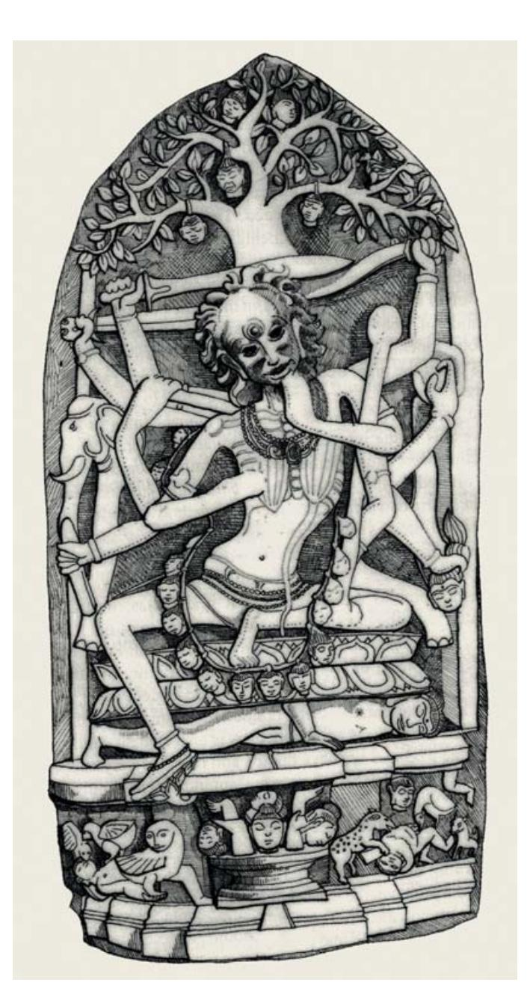
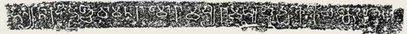
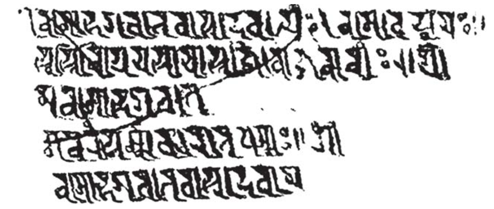
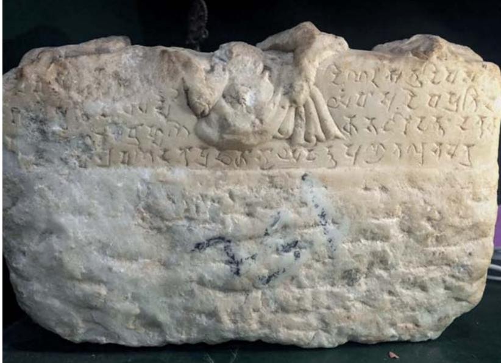
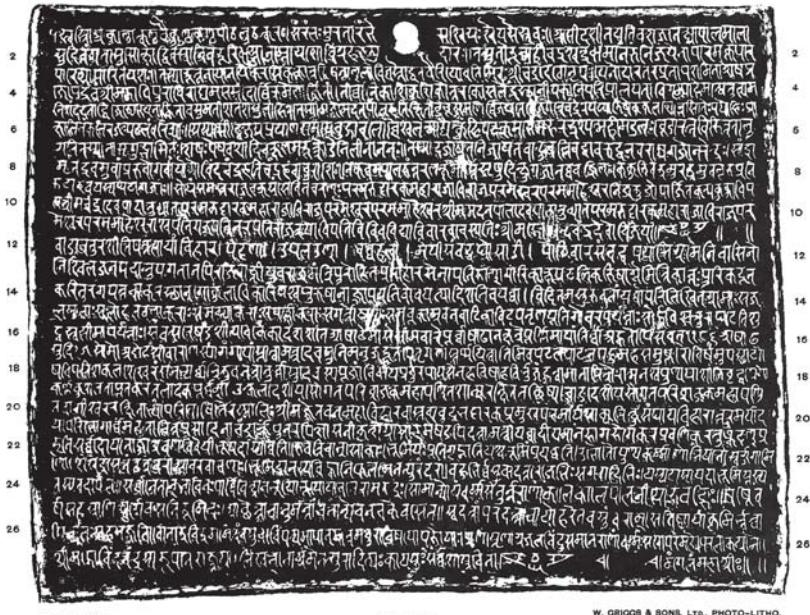

# What Happened To Buddhism In India?

(PRESIDENTIAL ADDRESS, IABS XVIII, TORONTO, AUGUST 20, 2017)

Richard Salomon

Journal of the International Association of Buddhist Studies
Volume 41 • 2018 • 1–25 • doi: 10.2143/JIABS.41.0.3285737

### ABSTRACT

The reasons for the decline and disappearance of Buddhism from its Indian homeland have long been the object of controversy. It is generally agreed that the assimilation of ideas and practices from the Brahmanical-Hindu environment must have played a major part in weakening the institutions and distinct identity of Buddhism, but authors have differed as to whether this was a matter of “friendly embraces” or  hostile  persecution.  Some  representative  or  unusual  examples  of  inscriptions illustrating  convergences  of  Buddhism  and  Hinduism  are  presented,  and  some suggestions for new ways to approach the question are proposed.

## 1.  Introduction

Here are the bare facts, known to everyone concerned: from about the early thirteenth century CE, Buddhism ceased to exist in the Indian sub-continent, with the exception of some isolated pockets in which it seems to have survived into to the sixteenth century. Hence the question that has been asked, over and over: How is it that Buddhism virtually died out in its  home  after  thriving  there  for  a  millennium  and  a  half,  during  which time  it  spread  far  beyond  its  Indian  motherland  to  become  a  dominant religion in virtually all the rest of Asia?

This grand historical paradox has fascinated and vexed Buddhologists and historians since the beginning of the modern academic study of Buddhism in the nineteenth century. Yet for the most part it still remains a mystery. This is no doubt in part due to the usual problem of the insufficiency of the historically-oriented source materials which besets this, as most aspects of the historical study of Indian Buddhism. But there must also be deeper underlying problems, and I regret to have to confess that, after studying the opinions of many eminent scholars, I find myself no closer to an answer to the question. I therefore make no claim here to any revolutionary  new  insight  or  over-arching  new  theory.  Rather,  I  begin this essay with an old question, and will end it with the same old question; my only hope is that I will be able to make the question a little more interesting, and perhaps to shed some light on the nature of the question itself. For part of my frustration with this issue and the scholarship on it (only a fraction of which can be referred to here) seems to result from what is perhaps a misguided framing of the question. This has typically been framed, explicitly or implicitly, in the form “Why did Buddhism die out in  India?”  That  there  cannot  be  a  single  answer  to  such  an  immense question is obvious, and more or less agreed to by all of the authors whom I  have  consulted,  so  they  have  typically  presented  their  explanations  in the form of *sets of causes* in various combinations and permutations. Typical of the most frequently alleged causes are the following:

* Buddhist  institutions  failed  to  establish  deep  roots  and  commitment among the laity. For example, Edward Conze thought that “relations with  the  laity  were  already  precarious,  and  there  at  its  base  was  the Achilles heel of the whole soaring edifice” (Conze 1980: 41).
* Buddhism  was  excessively  centralized  in  large  monastic  institutions, figuratively or and literally walled off from the world. Thus, for instance, A. Skilton: “Buddhism seems to have become a religion for specialists, particularly monastic specialists occupying the increasingly grand universities” (Skilton 1994: 143).
* Buddhist  institutions  gradually  lost  the  patronage  of  the  kings,  royal families, and wealthy lay donors on which they depended: N.R. Reat, “It appears that Indian kings and the laity gradually lost interest in financing Buddhism’s expensive monastic institutions” (Reat 1994: 77).
* Lasting harm was inflicted on Buddhist institutions by the persecutions of hostile kings and invaders such as Puṣyamitra Śuṅga, who offered one hundred dīnāras to anyone who would give him the head of a Buddhist monk,[^1]  the  Hun  king  Mihirakula,  and  King Śaśāṅka  of  Gau&a.  In  the words of L.M. Joshi, “One of the really potent factors contributing to the decline of Buddhism in the country [India] was royal persecution” (Joshi 1977: 319).[^2]
* Internal decay, corruption, and depravity of various sorts – often associated with the rise of Tantrism and the Vajrayāna – have been associated with the demise of Buddhism, albeit mostly by authors of earlier generations, before a more open-minded attitude toward the Vajrayāna developed in recent decades. Thus no less a scholar than the venerable P.V. Kane quotes, approvingly, Swami Vivekananda: “I have neither the time nor the inclination to describe to you the hideousness that came in the wake of Buddhism. The most hideous ceremonies, the most horrible, the most obscene books that human hands ever wrote or the human brain ever conceived, the most bestial forms that ever passed under the name of  religion  have  all  been  the  creation  of  degraded  Buddhism”  (Kane 1962: 1030).
* Sectarian divisions and other structural defects, including the absence of a central authority, have been cited as inherent weaknesses that in the long term undermined the survival of Buddhism: Thus K.T.S. Sarao: “The refusal of the Buddha to appoint any person as his successor … must have given opportunities to centrifugal tendencies … leading to the formation of different groups” (Sarao 2012: 71).
* Many authors, citing the Buddha’s prediction (in its best-known formulation) that the Dharma was destined to be forgotten in a thousand years as a self-fulfilling prophecy, refer to a so-called “death-wish” which is allegedly deeply imbedded in Buddhist tradition; thus Sarao, “Such a mind-set  must  have  contributed  towards  the  saṃgha  not  thinking  or acting in terms of working towards a perennial survival of the Dhamma” (Sarao 2012: 271).
* Most  authors  cite,  in  one  form  or  another,  what  are  often  imprecisely referred to as “Muslim invasions” – more accurately, the conquests of the Ganges-Yamuna doab by Turkish adventurers in the late twelfth and early thirteenth centuries. These events are typically thought of in terms of  a  “coup  de  grâce”  for  Indian  Buddhism,  but  there  are  some  who maintain that it was a primary cause, most notably A.K. Warder: “The effect of the Arab and Turkish conquests was the destruction of most of the early schools of Buddhism” (Warder 1970: 517).[^3]
* Finally and perhaps most convincingly, many authorities have invoked as the real cause of Buddhism’s decline the hostility of Hinduism in its various manifestations toward Buddhism, or its peaceful subversion thereof, or some combination of the two; I shall have more to say on this topic later.

[^1]: *Divyāvadāna*, no. XXIX (*Aśokāvadāna*), p. 434: *yo me śramaṇaśiro dāsyati tasyāhaṃ dīnāraśataṃ dāsyāmi*. For further references see Lamotte 1988: 387–92.
[^2]: Most  historians  nowadays  deny  that  persecution  played  a  significant  role  in  the demise of Indian Buddhism, but Giovanni Verardi is a notable exception, as will be dis- cussed below (part 3).
[^3]:  For  the  most  recent  critique  of  the  widespread  notion  that  Islamic  invaders  were responsible for the death of Buddhism, and in particular of Warder’s extreme formulation thereof, see Truschke 2018, especially p. 430.

Besides these frequently cited causes, various authors have from time to time  proposed  other  explanations  intended  to  supplement  or  even  supersede the usual ones. To mention just one interesting example, Jaini argued that the development of the bodhisattva doctrine and its “enormous popularity  worked  for,  rather  than  against,  the  destruction  of  Buddhism  in India”  as  “the  place  of  the  historical  Buddha  himself  was  functionally usurped  by  these  figures,”  ultimately  leading  to  a  “subversive  synthesis with Hindu belief and practice” (Jaini 1980: 86).

But what is rarely if ever addressed, is how, or whether, these alleged causes  –  all  of  which,  I  hasten  to  add,  do  have  at  least  some  validity  – interacted.  The  strategy  of  invoking  multiple  causes for  Buddhism’s decline  is  a  virtual  constant  in  the  literature,  and  it  seems  to  be  simply assumed that they somehow interacted to have a cumulative effect; but this unspoken and perhaps unjustified assumption seems to me to weaken the entire structure of the argument. I have not been able to find any authors who address this problem in any more than a rather superficial way, typically  by  invoking  the  recurrent  metaphor  of  late  Indian  Buddhism  as a “sick man,” weakened by multiple “illnesses” – weak relations with the laity, loss of patronage, etc. – and finally done in by one last blow, namely, the “Muslim” invasions (see e.g., Pratt 1940: 113).

The  comparative  method  too  does  not  seem  to  bring  us  much  farther toward  a  comprehensive  explanation.  For  example,  it  has  been  observed by a few authors – most notably by R.C. Mitra (1954: 1), in an important publication that I will refer to in more detail later – that there is a curious parallel  with  Christianity,  which,  like  Buddhism,  conquered  half  of  the world  but  in  the  meantime  all  but  died  out  in  its  motherland.  However, other  than  this  broad  and  perhaps  only  coincidental  similarity,  the  two cases are not really comparable, as the geographical, historical, and cultural circumstances  entirely  different.  So  this  comparative  line  of  explanation too leads to a dead end.[^4]

[^4]:  One might also compare the Zoroastrian religion, which has virtually died out in its homeland in Iran but survives, albeit in small numbers, in India. But here too, the circumstances are very different from those that affected Indian Buddhism.

## 2.  Meta-theories: Thoughts on the decline of religions

It might be useful to look at the question in a broader theoretical framework, for example by asking bigger questions such as, “Why do religions die?” As far as I am aware, very little has been said about the death of religions in general or in comparative perspective,[^5] but there is a little-known  exception  in  the  works  of  the  American  philosopher  of  religion James  Bissett  Pratt.  Pratt  was  the  author  of  two  relevant  but  forgotten essays. The first, in 1921, briefly posed the question “Why do Religions Die?,” and was printed in *The Journal of Religion*, appropriately enough, under  the  sectional  rubric  “Unsolved  Problems.”  The  second,  in  1940, proposes  some  answers  to  the  question,  under  the  title  “Why  Religions Die.”  In  the  latter  essay,  after  surveying  the  “deaths”  of  various  major religions of the ancient world, Pratt enumerates, by way of conclusion, a list what he considers to be frequent causes of death. These include:

* Reabsorption into the mother faith, as in the case of Buddhism
* “Violence and persecution,” as in the case of Zoroastrianism in Iran
* “Intellectual and moral superiority of the victorious religion,” as in the case of the triumph of Christianity over paganism
* Conservatism and lack of elasticity, as in the case of ancient Egyptian religion (Pratt 1940: 121).

While  it  would  be  easy  scoff  at  some  of  Pratt’s  rather  naïve  and  old-fashioned – nearly 80 years old – ideas such as the “inherent superiority” of certain religions (particularly of Christianity) over others, he nevertheless deserves some credit for being the first to even address the general question of why religions die. He also makes, in his introductory comments, the important observation that it is only natural that religions should die: “The surprising thing … is not that religions die, but that they live” (Pratt 1940: 97–8; cf. n. 5 above). For it must be remembered that there have been uncountable religions, or perhaps rather, potential religions which have not survived beyond infancy, or at best childhood; one need only read about the bizarre doings of the latest “wacky cult” to prove the point. Only a chosen few survive to live forever – which really means only until the present, for in the grand sweep of history all religions, perhaps, must meet their end, as most already have. If this seems a rash prediction, let us call to mind those religions which survived into maturity, or at least adolescence, and came close in their time to becoming world religions. The classic example is the Manichaean religion, which, along with Mithraism, was Christianity’s main rival as the successor to paganism. Had the winds of history blown in a different direction at some critical moments, one of these faiths, now forgotten to all but some dusty scholars, might have dominated the western world.

[^5]: A  small  but  noteworthy  exception  in  the  Buddhological  literature  is  Robinson  and Johnson  1977:  124:  “It  is  not  unnatural  that  Buddhism  should  have  died  out  in  India. Mithraism and Manichaeism, widespread and powerful in their day, perished, yet scholars are not overly amazed.”

## 3.  A closer look at the literature: a few selected examples

Turning back now to the case of Buddhism: I do not propose to review in any detail the vast literature on the subject, including several books and innumerable scholarly articles. Merely by way of a sampling and an overview,  I  will  present  a  few  examples  of  some  particularly  influential  or interesting  contributions  to  the  subject.  I  begin  with  an  essay  by  a  very familiar figure, namely the redoubtable Monier Monier-Williams.

In  his  seventh  Duff  lecture  in  1888,  entitled  “Changes  in  Buddhism and its disappearance from India,”[^6] Monier-Williams cited what he held to be an inherent paradox in Buddhist doctrine, such that “every doctrine he [Buddha] taught developed by a kind of irony of fate into a complete contradiction of itself.” For example, “the effect of the Buddha’s leading men to believe that all supernatural revelation was unneeded” led to their “attributing infallibility to the Buddha’s own teaching, and worshipping the Law of Buddhism … with all the ardour of enthusiastic bibliolatrists” (Monier-Williams  1889:  153–54).  In  order  to  survive,  later  Buddhism “dropped its unnatural pessimistic theory of life and its unpopular atheistic character and accommodated itself” to Hinduism (Monier-Williams 1889: 165). But “Buddhism, in parting with its ultra-pessimism and its atheistic and agnostic ideas, lost its chief elements of individuality” and “It simply in the end … became blended with the systems which surrounded it,” so that “what ultimately happened … was, that Vaishṇavas and Śaivas crept up softly to their rival by close and friendly embraces, and that … Buddhism gradually and quietly lost itself” (Monier-Williams 1889: 165, 166–67, 170).

[^6]: Published in Monier-Williams 1889: 147–71.

For my next example, I jump ahead 65 years, to a much more developed stage of the study of Buddhism, manifested in R. C. Mitra’s aforementioned *The Decline of Buddhism in India*. It is, I think, generally agreed that this book, published in 1954 on the basis of the author’s dissertation written in Paris under the supervision of Louis Renou in 1949, remains in many respects the definitive work on the subject, especially as far as the basic collection of data is concerned. In this brief volume of 172 pages, Mitra compiled an enormous body of literary and especially inscriptional data  bearing  on  the  late  phases  and  decline  of  Buddhism  in  India,  and most of the many books and articles on the subject that have been published subsequently have relied heavily on Mitra’s material.

The  body  of  the  book  is  composed  of  a  series  of  detailed  regional surveys of the late stages of Buddhism, and concludes with a chapter on “Causes  of  Decline”  (Mitra  1954:  125–64,  chapter  X).  After  reviewing some of the causes of decline which had been invoked by previous authors, such as persecution, internal corruption, sectarian division, weak relations with  lay  followers,  and  Islamic  conquest,  Mitra  focuses  on  what  he  perceives as the inherent weaknesses of the Buddhist system of belief:

* Abstruse doctrines such as pratītyasamutpāda were “far too subtle to be ever comprehended by the common mind.”
* “The very moderation of Buddhism, its sane and severely rational outlook, made the religion … less acceptable to the masses.”
* “Another formidable handicap of Buddhism was its incurable pessimism.”
* “To the Indian mind, atheism was the original sin of Buddhism” (Mitra 1954: 161–63).

In short, according to Mitra, Buddhism was never suited to what he calls “the Indian mind,” which is innately and profoundly theistic and devotional, with the result that Buddhism – particularly Mahāyāna and Vajrayāna Buddhism – was increasingly infiltrated by Hindu beliefs and practices, so that  “The  dividing  lines  got  more  and  more  blurred”  (Mitra  1954:  157) until Buddhism essentially ceased to exist as a distinct entity.

There is in fact considerable evidence, as will be shown later, to support the  notion  that  Buddhism’s  disappearance  was  caused  or  at  least  promoted by its loss of distinct identity. But Mitra’s notion that Buddhism was inherently unsuitable to “the Indian mind” is problematic in several regards; for one thing, if this was so, why did Buddhism arise in India at all, and why did it win millions of followers for many centuries? I say this, not to diminish Mitra’s fundamental contribution to the question, but only to show how difficult – perhaps impossible – it is to formulate cogent explanations for Buddhism’s decline.

Thus although Mitra in the mid-twentieth century had access to a far greater corpus of textual and epigraphic information than did Monier-Williams in the late nineteenth, his conclusions are not very different from his  predecessor’s.  For  instance,  when  he  refers  to  “the  process  of  strangling Buddhism by a friendly embrace,”[^7] we hear a distinct, though probably unconscious echo of the words of Monier-Williams, already quoted above: “Vaishṇavas and Śaivas crept up softly to their rival by close and friendly embraces, and … Buddhism gradually and quietly lost itself.”

Most  of  what  has  been  written  about  the  disappearance  of  Buddhism since  Mitra  has  rested  on  various  combinations  and  permutations  of  his basic set of proposed causes which have been summarized above, sometimes with the addition of a novel idea or two to the mix. For example, in K.T.S. Sarao’s recent (2012) *The Decline of Buddhism in India: A Fresh Perspective*, the author collects a great of information, some of it new and interesting and much of it inevitably not; and it must be said that in the end he still rests heavily on the foundation erected by Mitra. After reviewing the data and re-evaluating the old theories, he concludes with a five-fold “model for decline,” the five factors being:

* Concentration in urban areas and lack of a mass-base
* Dependence on mercantile communities for patronage
* “Intellectual snobbery” and “social aloofness”
* “Death-wish mentality”
* Infiltration  of  “brahmanical  elements  in  the  saṃgha”  (Sarao  2012: 263–76).

[^7]: Mitra 1954: 118; here he is referring to the friezes in the Lakṣmīnārāyaṇa temple at Hosahaḷalu (ca. 1240 CE), where images of the Buddha are mingled with those of “Rāma, Paraśurāma, Halāyudha, etc.”

There is indeed something new in the mix, particularly in Sarao’s stress on the first two of these five points; but in balance it is hard to avoid the impression  that  for  the  most  part  this  is  more  a  matter  of  shuffling  the old cards than of bringing in new ones.

The same cannot however be said about Giovanni Verardi’s *Hardships and Downfall of Buddhism in India* (2011), which presents a refreshingly original, if controversial and questionable new treatment of the issue. In this book, the most recent major contribution to the question of the disappearance of Buddhism, Verardi argues vehemently and at length against the gentle, pacific imagery drawn by Monier-Williams, Mitra, and others. Moreover, unlike Sarao, he adduces a great deal of new material, especially  from  archaeology  and  art  history.  In  place  of  Monier-Williams’ “friendly embraces,” he sees relations between Buddhism on the one hand and Brahmanism and Jainism on the other as an uninterrupted struggle, characterized at best by bitter rivalry and at worst by physical violence and murder. For Verardi, persecution of Buddhists was real and pervasive. For example, the legend of Puṣyamitra’s attempts to uproot and destroy the Buddhist *saṅgha* is for him no mere rhetorically exaggerated metaphor  for  a  return  under  the  new  Śuṅga  dynasty  to  royal  patronage  of Brahmanism, as it is understood by most modern historians, but rather brute historical fact: Puṣyamitra “started a campaign aimed at dismantling the Buddhist monasteries, that were the nerve centres of the open society” (Verardi 2011: 99).

Verardi’s presentation is throughout conditioned by an unapologetically Marxist view of how society and history work. In his view, “The core of the  Brahmanical  system”  was  “the  preservation  at  any  cost  …  of  caste privileges,” whereas “late Buddhism had advocated the cause of the outcastes,  rousing  a  real  social  war,”  so  that  “if  Buddhism  was  eventually defeated, it was because the revolt of the natives and of the untouchables ended in failure” (Verardi 2011: 40, 49, 57).

In support of his unconventional standpoint, Verardi adduces a large number of archaeological and artistic artifacts which, in his interpretation, are indicative of bitter and undisguised hostility toward Buddhists; for  example,  the  image  of  Cāmuṇḍā  sitting  above  the  Buddha  shown in figure 1. Such images, according to him, are to be “read” not as representations of myth, but rather as allegories for history (Verardi 2011: 222): “For iconographies to be so explicit and renouncing their semantic ambiguity, we must be facing a final showdown where the cards are on the table … The stele is … a first-hand documentation of what happened in places after the tenth century and a symbolic funeral of Buddhism: the Buddha lies dead” (Verardi 2011: 289, 292).

Figure 1: Cāmuṇḍā sitting atop the dead Buddha.
(From Verardi 2011: fig. 13, p. 294.)

To an extent, Verardi’s arguments have force: he succeeds in adducing a considerable body of information indicating hostility and even violence on the part of Brahmanical society toward Buddhism, thereby providing a  thought-provoking  corrective  to  the  naïve  and  sentimentalist  “friendly embrace” of Monier-Williams and Mitra. But – as almost always seems to happen when a necessary corrective is applied – he has gone much too far in the other direction. The mass of evidence which he has compiled is – or so it seems to me – often forcibly shoe-horned into the preconceived Marxist-defined categories of class struggle, sometimes on the thinnest of grounds.

## 4.  A closer look at the data: some epigraphic examples

Surely  there  must  be  a  middle  way  between  the  diametrically  opposed views of Monier-Williams and Mitra on the one side and Verardi on the other. Why, one has to wonder, does it have to be one way or the other? Such absolutist solutions simplistically reduce the vast diversity, complexity, and sheer scope of a millennium and a half of Indian history to a single entity with a single attitude, whether a “friendly embrace” or a relentlessly hostile confrontation. Why should we expect consistent policies over this vast span? Surely attitudes and situations changed from time to time, from place to place, nearly *ad infinitum*. How can these possibly be reduced to a single cause, or even a set of causes which somehow – mysteriously – acted in concert?

The frustration and dissatisfaction that arose when reviewing the literature of a century and a half on the disappearance of Indian Buddhism have led me, a little reluctantly but irresistibly, to the conclusion that it is not fruitful to address the question in term of “why.” The phenomenon is far too complex to be reduced, not only to a single cause, but even to a complex of interacting causes. For the remainder of this article I propose, therefore, to reformulate the question, not as a matter of “why?,” but rather of how Buddhism died out in India. So, in lieu of a real answer, I present below a few examples of inscriptional testimonies – a miniscule fraction of the whole body of relevant material – in order to show how they may
help to illuminate the issue.[^8]

[^8]: The  fundamental  importance  of  inscriptions  to  this  (as  to  any  historical  issue  in pre-Islamic  India)  hardly  needs  explanation  or  justification;  this  was  eloquently  put  by R.C. Mitra, who aptly described them, in a characteristic *bon mot*, as “isolated points of light to illume [sic] an expanding darkness of centuries” (Mitra 1954: 36).

### Inscription A

The first example concerns the familiar issue of the date of the acceptance of the Buddha as the ninth of ten avatāras of Vi!(u. This list is attested in a well-known inscription in the Ādivarāha-Perumāḷ temple at Mahābalipuram (Tamil Nadu),[^9] shown in figure 2, which reads:

Figure 2: The daśāvatāra inscription in the Ādivarāha-Perumāḷ temple.
(From Krishna Sastri 1926, pl. I–C.)

> (\**matsyaḥ kūrmo var*)*āhasya narasiṃhaś ca vāmana*\<\**ḥ*\> \
> *rāmo rāmasya* [sic] *rāmasya* [sic] *buddha*[*ḥ*] *kalkī ca te daśa* //
> 
> (\*Fish, tortoise), boar, man-lion, dwarf; [Paraśu]rāma, Rāma, [Bala-]rāma, Buddha, and Kalk): these are the ten [*avatāras*].

The importance of the epigraphic version of this particular verse, – which also  occurs  in  several  *purāṇas*[^10]  as  well  as  in  some  manuscripts  of  the *Mahābhārata*[^11] – is that, as is so often the case, it is the epigraphic record which provides at least an approximate *terminus ante quem* for the notion of the Buddha-*avatāra*; this, in contrast to the epic and purāṇic texts whose dates  are  impossible  to  pin  down  with  any  precision  or  certainty.  The inscriptional version of the verse, in contrast, can be at least approximately dated  on  the  grounds  of  paleographic  estimation;  the  ornate  late  Pallava script of this record has been attributed to the late seventh[^12] or early eighth century (Sircar 1971: 194, n. 7).

[^9]:  Krishna Sastri 1926: 5–6 and pl. I–C. Cf. also, for example, Rocher 1986: 107, 111.
[^10]:  E.g., *Matsya Purāṇa* 285.6c–7b.
[^11]:  The verse appears in the Kumbhakonam edition of the *Mahābhārata* (XII.348.2) but not  in  the  other  editions,  and  it  was  not  accepted  into  the  main  text  of  the  Poona  critical edition, where it was relegated to the notes after XII.326.71 (vol. 16, p. 1859); cf. Gail 1969: 917, 923.
[^12]:  Rocher 1986: 107 (following Krishna Sastri 1926: 4).

So, we can at least be sure that the Buddha had been incorporated into the canonical list of *avatāras* by about that time.[^13] But it is important for our  main  subject  to  recall  that  the  acceptance  of  the  Buddha  into  the Vaiṣṇava  pantheon  was  something  of  a  grudging  one.  For  the  Buddha *avatāra*  is  explained  in  a  well-known  purāṇic  legend  according  to  which Viṣṇu incarnated himself as Buddha in order was to counteract the growing power of the asuras by confusing them with a false dharma.[^14] In this way, the  threatening  heterodox  doctrine  was  co-opted  into  the  Hindu/Vaiṣṇava world  view,  a  development  which  justifies  Mitra’s  fittingly  ambiguous image of Hinduism’s “strangling Buddhism by a friendly embrace.”

### Inscription B

Similarly inclusivist attitudes are abundantly attested in other inscriptions, including Jaina as well as Hindu. For example, a Kannada inscription in the Prasanna-Gadādhara temple (Tumkur District, Karnataka) of the Hoysaḷa period (mid-12 century CE) has the following opening verse in Sanskrit:[^15]

> *jayanti yasyāvadato ’pi bhāratī-vibhūtayas tīrthakrto ’pi* + + + / \
> *śivāya dhātre sugatāya viṣṇave jināya tasmai sakaḷātmane namaḥ* //
> 
> Victorious  are  the  verbal  powers  of  the  Ford-maker,  though  he  does  not speak: homage to that Victor, (who is) Śiva, the Creator [Brahman], Sugata [Buddha], and Viṣṇu – the soul of all!

### Inscription C

A unique inscription on a tortoise shell, found in the village of Vajrayo-ginipur  in  Dacca  District,  Bangladesh,  is  another  remarkable  document illustrating the intersection of Buddhist and Hindu beliefs.[^16] It reads, according to D.C. Sircar’s improved edition:

[^13]: This is not, however, the end of the story, for it has recently been pointed out by Johannes Schneider (2015: 88) that a similar verse is attested in the Tarkajvālā of the Buddhist author Bhavya/Bhāvaviveka, who lived between 500 and 570 CE. So we have here an encouraging case in which one of the standard “facts” of Buddhist history has been refined by recent textual research.
[^14]: E.g. *Bhāgavata Purāṇa* X.42.22ab: *namo buddhāya śuddhāya daityadānavamohine*.
[^15]: Rice 1904: 7 (text section), 3 (translation section).
[^16]: The inscription was first published by N.K. Bhattasali (1939–40: 7–8); an improved version was published by D.C. Sircar (1949), and a revised version of the latter article was printed as part II (pp. 189–200) of chapter XII, “Decline of Buddhism in India,” in Sircar 1971.

Figure 3: Inscription on a tortoise shell
from Vajrayoginipur, Dhaka District, Bangladesh.
(From Bhattasali 1939–40: pl. III.)

> *śrī namo bhagavate vāsudevāya* / *namo buddhāya* / \
> *svasti niśreyasāyāstu jino janānāṃ* // *śrī- \
> ma* [sic] *namo bhagavate \
> manaṃrasarma kārita dharmma* // *śi* [sic] \
> *namo bhagavate vāsudevāya*
> 
> Śri. Homage to Lord Vāsudeva. Homage to the Buddha. \
> May the Jina be for the well-being of the people. Śri. \
> Homage to the Lord. \
> [This] dharma was made by Manaṃrasarmma [?]. \
> Homage to Lord Vāsudeva.

Sircar comments that the inscriptions “no doubt point to a rapprochement between the worship of Vāsudeva and that of the Buddha” (Sircar 1949: 104  =  1971:  194).  This  much  is  clear  from  the  direct  juxtaposition  of declarations of homage to Vāsudeva (i.e., Kṛṣna) and Buddha. But what, we  are  left  to  wonder,  was  the  nature  of  this  “rapprochement”?  For example, are we to see this as evidence of Buddhism being absorbed into Vaiṣṇava Hinduism, or the other way round?

And  there  is  more  to  the  matter:  why  are  these  peculiar  inscriptions written on, of all things, tortoise shell, this being, to the best of my knowledge, the only such cases in the vast corpus of Indian inscriptions? But actually, the peculiar material itself answers the question, for there has existed in West Bengal, even into modern times, a local cult[^17] of a  deity  known  as  Dharma  whose  image  takes  the  form  of  a  tortoise. According to S.K. Chatterji, the association of the local tortoise god with “Dharma” derives from a folk-etymological connection with an Austric word *daram or the like (Chatterji 1945: 79–80). In any case, the ethnographic data shows that the “dharmma” cited in the inscription refers to the tortoise-shell on which it is engraved, conceived as an image of the god Dharma.

Thus we have in this curious document a three-way confluence of beliefs  from  Buddhism,  from  mainstream  Vaiṣṇava  Hinduism,  and from local folk religion. In this case at least, the “absorption” theory, according  to  which  Buddhism  was  absorbed,  or  as  some  might  say, reabsorbed into the Brahmanical/Hindu milieu from which it had arisen some  fifteen  centuries  earlier,  seems  to  have  some  validity.  In  fact, the next inscription will demonstrate the same point cast in a broader light.

### Inscription D

The juxtaposition, if not identification – we cannot know exactly how its author conceived of their relationship – of Buddha and Vāsudeva in the tortoise-shell inscription is hardly surprising, given its late date. But another, as yet unpublished inscription seems to indicate that the veneration of Vāsudeva by Buddhists had already begun much earlier, and in a far distant part of the Indian world. The inscription in question is on the base of a white marble image, of which only the feet and a portion of a  hanging  garment  survive.  The  provenance  of  the  object,  which  is  in private hands in Pakistan, is not securely known, but it is likely to have come from at or near the site of B)rko,-Ghwa(&ai in Swat, on the basis of its similarity to another fragmentary pedestal which was found at the same site.[^18]

[^17]: Apparently centered in Burdwan District (Sen 1945: 669, Sircar 1971: 195).
[^18]: See Taddei 2003: II.586–87 and figs. 13–14. I wish to thank Anna Filigenzi for bringing this reference to my attention.

Figure 4: Inscribed marble pedestal from Pakistan.
(Photograph courtesy of Mark Kenoyer.)

The purpose of the fragmentary inscription[^19] was to record the dedication of an image of Vāsudeva, as shown by the text at the end of the second  line,  clearly  reading  *vāsudeva-pratimā*.  But  what  is  remarkable about  the  inscription  is  the  distinctly  Buddhist  phrasing.  First,  the  text straddling the hem of the hanging garment in the middle of the second line reads *deyadharmmo yaṃ*, “this is the pious gift [of …].” Second, the inscription apparently ends at the right side of the fourth line with *yad attra puṇya ta X bhavatu*, “Whatever merit there is in this, may it be [for …].”[^20] Both of these expressions are so characteristic of Buddhist donative  inscriptions[^21]  that  we  can  hardly  doubt  that  this  is  a  Buddhist record[^22] – that is to say, an inscription recording a pious donation in or to a Buddhist institution, and in a Buddhist cultural context.

[^19]: For the present context, I have not undertaken a complete edition of the inscription, which  must  await  a  future  occasion,  but  only  wish  to  mention  the  points  in  it  that  are particularly relevant to the issues at hand.
[^20]: The  wording  here  is  an  abbreviated  form  of  the  typical  formula  for  sharing  the merit  of  a  donation,  which  would  read  in  full  as,  for  example,  *yad attra puṇya tad bhavatu sarvasattvānām anuttarajñānāvāptaye ’stu*. Presumably the formula was left incomplete because the engraver ran out of space; compare a possibly similar case in  Lüders  1961:  113  (§78).  But  I  am  unable  to  explain  the  unusual  sign  between  *ta* and  *bhavatu*, which  is  noted  here  with  “X.”  It  can  hardly  be  meant  to  represent  a vowelless *d*, as might be expected from its position. It somewhat resembles certain forms of the numeral 4, but that has no place here. Could it be some sort of abbreviation marker, indicating the deletion of the rest of the beneficiary formula? (The verb *bhavatu* usually comes before the intended purpose, but in at least one early inscription [Lüders 1961:  62]  (*agrapratyaśatāye bhavatu sarvvasatvānāṃ* [*hita*]*sukhā*[*rthaṃ*]*bhavatu*)  it follows.)

In and of itself, it is not surprising to find Vāsudeva mentioned in a Buddhist inscription, for we have just  seen that this has been attested in later Buddhist records. The surprise is to find it in this one, which is datable on paleographic grounds[^23] to around the sixth century CE, that is, some five centuries earlier than the tortoise shell inscriptions from Bangladesh. So this new inscription not only shows us that Buddhists were  venerating  Vāsudeva/Kṛṣṇa  at  an  earlier  time  than  might  have been  expected,  but  also  that  this  practice  prevailed  in  the  geographical extremes of the continent, from modern Pakistan in the far northwest to the eastern fringe of the Indian world in what is now Bangladesh. Thus the infiltration of paradigmatically “Hindu” cults in Buddhism cult practice appears to have been wider and deeper than is usually thought.

[^21]: Compare, for example, von Hinüber 2004: 177–86.
[^22]: *Deyadharma* “pious gift” and its variants are strongly characteristic of Buddhist inscriptions (see Lüders 1940: 24–25 and Bhattacharya 1987), but also occur occasionally  in  non-Buddhist  inscriptions;  see  the  exceptions  noted  by  Lüders,  to  which  should now be added the inscription on a Vaiṣṇava image of the fifth century CE (Srinivasan and Sander 1997 ≅ Srinivasan 2016: 153–216). But in the inscription at hand here, the collocation of the term deyadharma with the *yad atra puṇyam* … formula makes it certain that the inscription is Buddhist.
[^23]: The  relatively  early  date  is  proposed  on  the  grounds  of,  for  example,  the  older (tripartite) form of ya. The script is comparable to that of the inscription on the Ganeśa image from Gardez, Afghanistan, which D.C. Sircar (1963–64: 44) dated, with characteristic  conservatism,  to  the  sixth  or  seventh  century.  The  inscription  introduced  here was originally dated, but unfortunately most of the dating formula, including the prior part which would have stated the year and month, is lost in the obliterated left side of the first line. The right side of the line reads *diṇe* [sic] 9 *attra divase* (“… day 9; on this day …”).

### Inscription E

For  a  last  epigraphic  sample,  we  return  to  the  late  phase  of  Indian  Buddhism and to a well-known but particularly interesting inscription, namely the  Saheṭh-Maheṭh  copper  plate  of  the  Gāhaḍavāla  king  Govindacandra, dated Vikrama *saṃvat* 1186 = 1128–9 CE, This inscription, first published by D.R. Sahni in 1911, was found at the archaeological site of Saheṭh-Maheṭh, which has been definitively identified with ancient Śrāvastī, the capital of the Kosala kingdom of King Prasenajit and one of the most important shrines of Buddhism, where the Buddha spent much of his teaching life. The inscription provides in several regards a remarkable picture of the state of the Dharma at a critical moment in its last decades in northern India, during the rule of one of the last great Hindu kings of the northern heartland. Among its several points of interest is the juxtaposition in it of Hindu and Buddhist motifs, with the starkest contrast and yet in the most intimate relationship.

Figure 5: Saheth-Maheth (Śrāvastī) copper plate of Gāhaḍavāla
Govindacandra, 1128–9 CE.
(From *Epigraphia Indica* 11, plate facing p. 24.)

The plate begins with the usual maṅgala verse of Gāhaḍavāla inscriptions:

> akuṇ-hotkaṇ-ha-vaikuṇ-ha-kaṇ-hapī-ha-lu-hatkaraḥ / \
> saṃrambhaḥ suratārambhe sa śriyaḥ śreyase stu vaḥ //
> 
> May  the  excitement  of  Śrī  [Lakṣmī]  at  the  inception  of  their  loveplay,  as her hands caress the throat of Vaikuṇṭha [Viṣṇu] whose desire is irresistible, be a blessing to you!

Thus  the  document  begins  with  a  verse  whose  sentiments  are  at  once quintessentially Hindu and about as un-Buddhist as one could imagine. This  verse  is  followed  by  the  usual  long  genealogical  preamble,  after which  the  text  turns,  in  the  sixteenth  line,  to  the  actual  matter  at  hand, namely the donative formula. This portion begins with a detailed descrip- tion of the king’s elaborate ritual preparations for the ceremony:

> On this day, after bathing in the Ganges here at Vārā(as), satiating all of the mantras, gods, sages, humans, ghosts, and ancestors, paying his respects to the burning-rayed sun which easily slashes through the masses of darkness, worshipping  the  one  [Śiva]  who  wears  the  crescent  moon  on  his  crest,  and praying to Vāsudeva, savior of the three worlds …[^24]

– once again, archetypically Hindu in every word and thought.[^25] The text then announces the real matter at hand, namely a royal land grant of six villages, not to the usual learned brahmans as in thousands of other copper plate charters, but rather to the saṅgha of the Mahāvihāra at Śrāvastī. The king explains that he did this because he had been “gratified by the Buddhist  monk  and  great  scholar  Śākyarakṣita  from  the  land  of  Utkala and by his student, the Buddhist monk and great scholar Vāgīśvararakṣita from the Coṣa land.”[^26]

So here we find, on the surface at least, Hinduism and Buddhism living together happily and harmoniously hand-in-hand; and this, quite literally, since  we  know  from  another  important  Gāha&avāla  inscription[^27]  that King Govindacandra’s wife Kumaradev) was a devout Buddhist. So we can  suspect  that  it  was  she  who  provided  the  motivation  for  her  husband’s  largess  to  the  Dharma,  notwithstanding  his  personal  ideological stance as an orthodox Vaiṣṇava Hindu.

[^24]: Lines 17–18: … *adyeha śrī-vārāṇasyāṃ gaṅgāyāṃ snātvā mantra-deva-muni-manuja-bhūta-pitr-gaṇāṃs tarppayitvā timira-pa-ala-pā-ana-pa-u-mahasam uṣṇarociṣaṃm* [sic] *upasthāyauṣadhipati-śakala-śekharaṃ samabhyarccya tribhuvana-trātur vāsudevasya pūjāṃ vidhāya* …
[^25]: For other examples of Brahmanical formulae in inscriptions recording donations to Buddhists, see Sanderson 2009: 116 and n. 256.
[^26]: Lines  19–20,  *utkaladeśīya-saugataparivrājaka-mahāpaṇḍita-śākyarakṣita-tacchiṣya-coḍadeśīya-saugataparivrājaka-mahāpaṇḍita-vāgīśvararakṣitābhyāṃ paritoṣitair asmābhiḥ* …

It is also of interest that the two Buddhist *mahāpaṇḍitas* who won the favor of the king (or rather, of his wife) and thereby inspired the donation were by no means locals, but rather hailed from regions far distant to the south, namely Utkala in Odisha and “the Coḷa land,” that is, the Tamil country.  Such  references  to  travels  across  vast  distances  by  Buddhist teachers  and  followers  are  found  quite  frequently  in  inscriptions  of  the late Buddhist centuries (that is, from about the ninth to twelfth centuries). At first blush, this might seem to suggest the continued vitality of Buddhism in this period, but it can also be seen to point in the opposite direction. For such inscriptions are typically found at major pilgrimage centers and holy places, such as Śrāvastī in the present case, Nālandā, and especially at Bodh Gaya, and this can be taken to suggest that Buddhism had shrunk into a limited number of strongholds in and around its most holy and historic places. For example, the inscriptions on the Kurkihar bronzes (Gupta 1965: 125–59) testify to a community of Buddhist monks and lay followers from as far away as Kāñcī in the Tamil country at the shrine of Kukkuṭapāda in Bihar during the Pāla period; the Ghosrawan inscription (Kielhorn 1888) records the career of a monk from Nagarahāra in Afghanistan  who  became  the  abbot  of  the  Nālandā  monastery;  and  several  late inscriptions at Bodh Gaya, such as the inscription of Mahānāman, a native of Sri Lanka (Fleet 1888: 274–78, Tournier 2014), attest to the settlement there of pilgrims from various distant lands.

One thus gets the impression that Buddhism was at this point contracting into its traditional strongholds – returning to its roots, as it were. In broad terms at least, the distribution of Buddhist inscriptions of the later centuries does point in this direction. This reminds us of the theory, often invoked in connection with the disappearance of Buddhism in India, that Buddhism tended to wall itself into its great monastic institutions such as Nālandā and Vikramaś)la, effectively cutting itself off from the surrounding communities. The geographical details are different in these two developments, but in both we can discern a process of contraction and reduction in the geographical and institutional scope of late Indian Buddhism.

[^27]: The Sarnath stone inscription of Govindacandra’s queen Kumaradev) (Konow 1907–08).

## 5.  What have we learned?

Not  very  much,  perhaps.  Many  months  spent  reviewing  the  scholarly literature have been, in the end, somewhat disappointing. After sipping, over  and  over  again,  a  lot  of  old  wine  in  new  bottles,  or  occasionally tasting some new wine but often finding its flavor slightly “off,” I have reluctantly  come  to  the  conclusion  that  posing  the  question  “Why  did Buddhism die out in India?” is one that remains and always will remain without a cogent answer. All of the factors which are typically invoked are to some degree true, but each one is insufficient in and of itself; nor has anyone has been able to formulate a pratītyasamutpāda for them collectively, that is, an explanation of how they might have acted in concert to achieve the actual outcome. The question, in short, is too big, too complex to  ever  yield  a  satisfactory  answer;  there  can  never  be  a  single  master solution.

But for all that, it is still a question that is worth asking, especially if, as  proposed  at  the  outset,  we  approach  it  in  terms  of  “how”  Buddhism withered and died in its homeland, rather than in terms of the unanswerable “why.” I have here presented a tiny sampling of relevant information from the vast and widely scattered data bearing on the question, and these items, along with many others that could have been cited, do tend to support  the  notion  that  Buddhism  was  increasingly  assimilated  to  and  thus absorbed into that complex of belief systems which we call, for lack of a  better  term,  “Hinduism.”  This,  as  we  have  seen,  is  not  at  all  a  new idea, having been long ago adduced, albeit in what nowadays must seem a somewhat naïve manner, by M. Monier-Williams, among others; so, if we  have  to  pick  one  “best”  answer  from  the  grab-bag  presented  in  the first part of this paper, it would have to be this one.

In conclusion, I would certainly not suggest that any ambitious young Buddhist scholar – or, for that matter, any learned senior savant – undertake another comprehensive study of the decline of Buddhism. This would hardly be likely to be conducive to enlightenment. Any brave soul who nevertheless  wishes  to  confront  the  matter  would  be  better  advised  to approach it in terms of a close-up case study of some particular aspect – geographical, chronological, or methodological – of the entire problem.[^28] Here a carefully chosen and judiciously conceived study could well lead to new insights which are applicable to the larger question. Even though the  larger  question  can  never  be  answered,  that  does  not  mean  that  it should not be asked. Such a question is of value insofar as it stimulates our thoughts and illuminates what we know and do not know about late Indian Buddhism. With this said, I leave the challenge to the next generations of scholars, should any among them may be brave enough to take it up.

[^28]: Truschke, in an article on related topics which was published shortly before this one (2018: 433–35), reaches partially similar conclusions: “Instead of analyzing ‘Indian Bud- dhism,’ we are better off talking about Indian Buddhists … It is perhaps more useful to ask what happened to specific Buddhist communities in specific parts of the subcontinent … [M]aking the questions and answers more specific and people-focused may help scholars  do  away  with  the  unfounded  presumption  that  there  is  a  single  life  cycle  to  Indian Buddhism as a tradition.”

### References

#### Primary Sources

*Bhāgavata Purāṇa. Maharṣivedavyāsapraṇītaṃ Śrīmadbhāgavatamahāpurāṇam.* Vikrama 2008. Gorakhpur: Gītāpres.

*Divyāvadāna*. E.B. Cowell and R.A. Neil (eds.) 1886. *The Divyâvadâna. A Collection of Early Buddhist Legends.* Cambridge: Cambridge University Press.

*Matsya Purāṇa. Matsyapurāṇam.* 1907. Ānandāśrama Sanskrit Series 54. Poona: Ānandāśrama Mudraṇālaya.

*Mahābhārata*. Kumbhakonam edition: T.R. Krishnacharya and T.R. Vyasacharya (eds.). 1906-14. *Sriman Mahabharatam. A New Edition Mainly Based on the South Indian Texts with Footnotes and Readings.* 19 vols. Bombay: Javaji  Dadaji’s  “Nir(aya-Sāgar”  Press,  Poona  Critical  Edition:  Vishnu S. Sukthankar et al. (eds.). 1933-59. *The Mahābhārata for the First Time Critically Edited.* 19 vols. Poona: Bhandarkar Oriental Research Institute.

#### Secondary Sources

Bhattacharya, G. 1987. “Dāna-Deyadharma: Donation in Early Buddhist Records (in Brāhmī).” In Marianne Yaldiz and Wibke Lobo, eds., *Investigating Indian Art: Proceedings of a Symposium on the Development of Early Buddhist and Hindu Iconography Held at the Museum of Indian Art Berlin in May 1986.* Veröffentlichungen des Museums für Indische Kunst 8. Berlin: Museum für Indische Kunst/Staatliche Museen, Preußischer Kulturbesitz: 39–60.

Bhattasali, N.K. 1939–40. “5. Archaeological Section: (a) Sculpture and Epigraphs.” *Annual Report of the Dacca Museum for the year 1939–40*: 5–8.

Chatterji, Suniti Kumar. 1945. “Buddhist Survivals in Bengal.” In D.R. Bhandarkar et al., eds., B.C. Law Volume. Part 1. Calcutta: The Indian Research Institute: 75–87.

Chhabra, Bahadur Chand and Govind Swamirao Gai, eds. 1981. Inscriptions of  the  Early  Gupta  Kings.  Revised  by  Devadatta  Ramakrishna  Bhandarkar. Corpus Inscriptionum Indicarum 3. Delhi: The Director General, Archaeo- logical Survey of India. (Revised edition of Fleet 1888.)

Conze, Edward. 1980. A Short History of Buddhism. London: George Allen & Unwin.

Fleet,  John  Faithfull.  1888.  Inscriptions  of  the  Early  Gupta  Kings  and  Their  Successors. Corpus Inscriptionum Indicarum 3. Calcutta: Superintendent of Government  Printing.  (See  also  the  revised  edition  by  Chhabra  and  Gai 1981.)

Gail,  Adalbert  J.  1969.  “Buddha  als  Avatāra  Vi (us  im  Spiegel  der  Purā(as.” Zeitschrift der Deutschen Morgenländischen Gesellschaft, Supplement I, 3: XVII.  Deutscher  Orientalistentag  vom  21.  bis  27.  Juli  1968  in  Würzburg.  Wiesbaden: Franz Steiner Verlag: 917–23.

Gupta, Parmeshwari Lal. 1965. Patna Museum Catalogue of Antiquities (Stone  sculptures, metal images, terracottas and minor antiquities). Patna: Patna Museum.

Hinüber,  Oskar  von.  2004.  Die  Palola  Ṣāhis:  ihre  Steininschriften,  Inschriften  auf  Bronzen, Handschriftenkolophone und Schutzzauber .  Materialen  zur  Geschichte von Gilgit und Chilas. Antiquities of Northern Pakistan, Reports and Studies 5. Mainz: Philipp von Zabern.

Jaini, Padmanabh S. 1980. “The Disappearance of Buddhism and The Survival of Jainism: A Study in Contrast.” In A.K. Narain, ed., Studies in the History of  Buddhism. Papers presented at the International Conference on the History  of  Buddhism  at  the  University  of  Wisconsin,  Madison,  WIS,  USA,  August,  19–21, 1976. Delhi: B.R. Publishing Corporation: 81–91.

Joshi, Lal Mani. 1977. Studies in the Buddhistic Culture of India (During the 7th  and 8th centuries A.D.). 2nd ed. Delhi: Motilal Banarsidass.

Kane, Pandurang Vaman. 1962. History of Dharmaśāstra (Ancient and Mediæval  Religious  and  Civil  Law  in  India).  Vol.  V,  part  II.  Government  Oriental Series, Class B, no. 6. Poona: Bhandarkar Oriental Research Institute.

Kielhorn, F. 1888. “A Buddhist Stone Inscription from Ghosrawa.” Indian Antiquary 17: 307–12.

Konow, Sten. 1907–08. “Sarnath Inscription of Kumaradevi.” Epigraphia India 9: 319–28.

Krishna Sastri, H. 1926. Two Statues of Pallava Kings and Five Pallava Inscriptions in a Rock-Temple at Mahabalipuram. Memoirs of the Archaeological Society  of  India  26.  Calcutta:  Government  of  India  Central  Publication Branch.

Lamotte, Étienne. 1988. History of Indian Buddhism from the Origins to the Śaka  Era. Translated by Sara Webb-Boin. Publications de l’Institut Orientaliste de Louvain 36. Louvain-la-Neuve: Université Catholique de Louvain, Institut Orientaliste.

Lüders, Heinrich. 1940. “Zu und aus den Kharo ,h)-Urkunden.”  Acta Orien- talia 18: 15–49.

Lüders, Heinrich. 1961. Mathurā Inscriptions. Unpublished Papers Edited by Klaus  L. Janert .  Abhandlungen  der  Akademie  der  Wissenschaften  in  Göttingen, Philologisch-historische Klasse, Folge 3, Nr. 47. Göttingen: Vandenhoeck & Ruprecht.

Mitra, R. C. 1954. The Decline of Buddhism in India. Visva-Bharati Studies 20. Santiniketan: Visva-Bharati.

Monier-Williams,  M.  1889:  Buddhism,  in  its  Connexion  with  Brāhmanism  and  Hindūism, and in its Contrast with Christianity. New York: Macmillan and Co. Pratt, James Bissett. 1921. “Why Do Religions Die?” The Journal of Religion 1: 76–78.

Pratt, James Bissett. 1940. “Why Religions Die.” University of California Publications in Philosophy 16(5): 95–124.

Reat, Noble Ross. 1994. Buddhism: A History. Berkeley CA: Asian Humanities Press.

Rice, B. Lewis. 1904. Epigraphia Carnatica, Vol. XII: Inscriptions in the Tumkur  District.  Mysore  Archaeological  Series.  Bangalore:  Mysore  Government  Central Press.

Robinson, Richard H. and Willard L. Johnson. 1977. The Buddhist Religion. A  Historical Introduction. 2nd ed. North Scituate MA: Duxbury Press. Rocher, Ludo. 1986. The Purāṇas. A History of Indian Literature, Vol. II, Fasc. 3. Wiesbaden: Otto Harrassowitz.

Sahni, Pandit Daya Ram. 1911–12. “Saheth-Maheth Plate of Govindachandra; [Vikrama-] Samvat 1186.” Epigraphia Indica 11: 20–26.

Sanderson, Alexis. 2009. “The Śaiva Age. The Rise and Dominance of Śaivism During  the  Early  Medieval  Period.”  In  Shingo  Einoo,  ed.,  Genesis  and  Development  of  Tantrism.  Institute  of  Oriental  Culture  Special  Series  23. Tokyo: Institute of Oriental Culture, University of Tokyo: 41–349.

Sarao, K.T.S. 2012. The Decline of Buddhism in India. A Fresh Perspective. New Delhi: Munshiram Manoharlal.

Schneider,  Johannes.  2015.  “Eine  buddhistische  Sicht  auf  den  Buddhāvatāra.” Berliner Indologische Studien/Berlin Indological Studies 22: 87–102.

Sen,  Sukumar.  1945.  “Is  the  Cult  of  Dharma  a  Living  Relic  of  Buddhism  in Bengal?” In D.R. Bhandarkar et al., eds., B.C. Law Volume. Part 1. Calcutta: The Indian Research Institute: 669–74.

Sircar,  Dines  Chandra.  1949.  “Two  Tortoise-shell  Inscriptions  in  the  Dacca Museum.”  Journal  of  the  Royal  Asiatic  Society  of  Bengal, Letters   3(15): 101–08.

Sircar,  D[ines]  C[handra].  1963–64.  “Three  Early  Medieval  Inscriptions.” Epigraphia Indica 35: 44–54.

Sircar,  D[ines]  C[handra].  1971.  Studies  in  the  Religious  Life  of  Ancient  and  Medieval India. Delhi: Motilal Banarsidass.

Skilton, Andrew. 1994. A Concise History of Buddhism. New York: Barnes & Noble.

Srinivasan,  Doris  Meth  and  Lore  Sander.  1997.  “Visvar.pa  Vy.ha  Avatāra: Reappraisals  Based  on  an  Inscribed  Bronze  from  the  Northwest  Dated  to the Early 5th Century A.D.” East and West 47: 105–70.

Srinivasan, Doris Meth. 2016. Listening to Icons, Vol. I: Indian Iconographic & Iconological Studies. New Delhi: Aryan Books International.

Taddei, Maurizio. 2003. On Gandhāra: Collected Articles. Edited by Giovanni Verardi and Anna Filigenzi. Collana “Collectanea” III. 2 vols. Naples: Università degli Studi di Napoli “L’Orientale.”

Tournier, Vincent. 2014. “Mahākāśyapa, His Lineage, and the Wish for Buddha- hood.  Reading  Anew  the  Bodhgayā  Inscriptions  of  Mahānāman.”  Indo-  Iranian Journal 57: 1–60.

Truschke,  Audrey.  2018.  “The  Power  of  the  Islamic  Sword  in  Narrating  the Death of Indian Buddhism.” History of Religions 57: 406–35.

Verardi,  Giovanni.  2011.  Hardships  and  Downfall  of  Buddhism  in  India.  New Delhi: Manohar.

Warder, A.K. 1970. *Indian Buddhism.* Delhi: Motilal Banarsidass.
