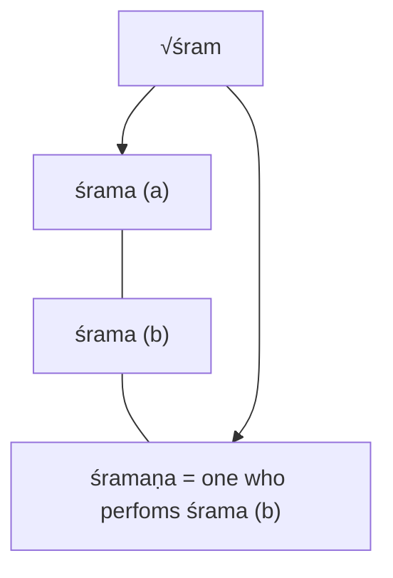
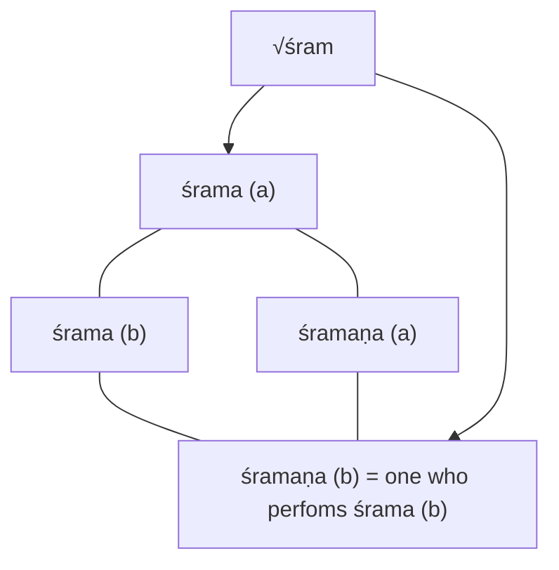
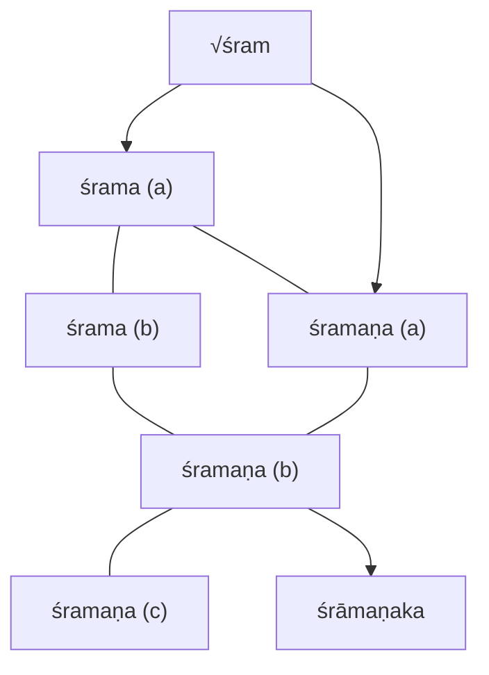

# A Note on Śramaṇa in Vedic Texts 

## Brett Shults

JOCBS. 2016(5): 113–127. 2016 Brett Shults

## Abstract

The recent publication of a book by Christopher Beckwith provides an opportunity to reconsider the use and meaning of the term śramana in vedic texts. In this note some of Beckwith's claims will be examined and refuted. This note will also expound on a model for understanding the verb √śram and its derivatives, placing the term śramana in its semantic context. Such a model may contribute to the explanation of certain facts better than alternative theories.

## Introduction

Christopher Beckwith's Greek Buddha: Pyrrho's Encounter with Early Buddhism in Central Asia (2015) is a thought-provoking work. One of its provocative features is the manner in which Beckwith insists on a specific meaning of the term śramaṇa in antiquity and ancient sources. That understanding can be summarized as follows: "This word śramaṇa always and only meant 'Buddhist practitioner' in Antiquity" (129 n. 69). Beckwith's claim about the term śramaṇa is central to his revisionist account of the development of religious traditions in India, and it is a claim that is restated throughout Greek Buddha. In one passage the claim is expressed this way: "The word Śramaṇa was the unambiguous term for 'Buddhists', and was still used exclusively in that sense in the Middle Ages" (54 n. 123). Another version of the claim appears in this form (69):

> Individuals who practiced Buddhism, including Buddha and his followers, were called Śramanas, a term that specifically and exclusively meant 'Buddhist practitioners'.

In another passage the reader is told (96-97):

> The word śramaṇa is never used in ancient texts of any kind as a generic with the meaning 'ascetic' used for practitioners of any and all traditions. It meant specifically and only 'Buddhist practitioner'.

Another strong form of the claim appears in a discussion of "Devānāmpriya Priyadarśi" and his "Thirteenth Rock Edict." Here Beckwith uses italics to emphasize the point (130):

> This passage, from the earliest and best Indian written evidence, confirms that the word Śramaṇa (variously spelled) means specifically and exclusively 'Buddhist practitioner' in all testimonies, including Indian sources as well as those in Greek, Chinese, Persian, Sogdian, Tokharian, and Arabic, among others, from Antiquity on, well into the Islamic Middle Ages ...

Beckwith tacitly admits in a footnote that the Bṛhadāraṇyaka Upaniṣad contradicts such claims. [^1] But Beckwith is apparently able to set aside this contradictory evidence because, as he sees it, Johannes Bronkhorst (1986) has demonstrated "conclusively" that the Bṛhadāraṇyaka Upaniṣad "imitates Buddhism and dates to well after the time of the Buddha." [^2] There is no need to rehearse here the erudite criticism that has been directed against Bronkhorst's ideas on the relative dating of the early Upaniṣads, [^3] because whatever else Bronkhorst has or has not achieved, he has not shown - nor has he tried to show - that every word of the Bṛhadāraṇyaka Upaniṣad "imitates Buddhism," was borrowed from Buddhists, or post-dates the advent of Buddhism. More to the point, Bronkhorst has not shown and apparently does not believe that the term śramaṇa referred only to Buddhists. [^4] The issue at hand is the provenance of the word śramana, and for the purposes of this note what is most remarkable is how Beckwith characterizes the Bṛhadāraṇyaka Upaniṣad as (69 n. 25):

[^1]: See Beckwith (2015: 69 n. 25). The contradictory passage at Bṛhadāraṇyaka Upaniṣad 4.3.22 contains the wording: śramaṇo 'śramanas tāpaso tāpasah (Limaye and Vadekar, 1958: 243); cf. Olivelle (1998: 114). Olivelle translates this: "a recluse is not a recluse, and an ascetic is not an ascetic" (1998: 115).
[^2]: Beckwith (2015: 69 n. 25).
[^3]: Criticism that Beckwith does not mention.

> the only supposed "Vedic" text in which the term śramaṇa is not used specifically to mean 'Buddhist practitioner'

The claim about the use and meaning of term śramaṇa expressed in this quotation is the point of departure for what follows. It is a bold claim, indeed an intriguing claim. But it is demonstrably false.

## The Indian context of śram and its derivatives 

Greek Buddha contains no reference to Olivelle (1993), so Beckwith may not be aware that Olivelle has located and written about a use of the term śramana in the Taittirīya Āraṇyaka. [^5] The Taittirīya Āraṇyaka, like the Bṛhadāraṇyaka Upaniṣad, is commonly supposed to be a vedic text. [^6] The word śramaṇa occurs in Taittirīya Āraṇyaka 2.7 as shown here in Olivelle's translation:

> The vātaraśana seers (ṛ̣̦i) were śramanas and celibates (ürdhvamanthinah). The seers went to them in supplication, but they absconded, entering the Kūṣmāṇḍa verses one after another. (The seers) found them there by means of faith and austerity. [^7]

[^4]: I cannot speak for the 1986 edition of The Two Traditions of Meditation in Ancient India that Beckwith cites, but in a reprinted edition of the same work Bronkhorst (2000) has virtually nothing to say about the word śramana. Elsewhere Bronkhorst has affirmed that in "the religious context in which Buddhism arose ... The Ājīvikas, like the early Jainas and Buddhists, were Śramanas" (2003: 153). Bronkhorst (2009) purports to show how the Buddha's "goal of liberation grew out of the śramana ascetic movements of his day" (xi). Bronkhorst also has written of "the religious mendicants from Greater Magadha, the Śramanas"; the next sentence indicates that these are "Buddhists, Jainas, and Ājīvikas" (2011: 320). The clear inference is that after Bronkhorst produced the work that Beckwith cites, Bronkhorst himself did not regard the term śramana in the Bṛhadāraṇyaka Upaniṣad to be an imitation or borrowing of specifically Buddhist terminology.
[^5]: Olivelle was not the first to do so; see the discussion and works cited in Olivelle (1993). Cf. Laddu (1993).
[^6]: On what counts or ought to count as "vedic" texts for the purposes of scholarship I basically follow Witzel (2005); cf. Jamison and Witzel (2003).
[^7]: Translation including italics and parenthetical comments from Olivelle (1993: 12). Sanskrit text according to Olivelle (1993: 12 n. 20): vātaraśanā ha vā ṛṣayah śramanāa ūrdhvamanthino babhūvus tān ṛṣayo 'rtham āyaṃs te nilāyam acaraṃs te 'nupraviśuḥ kūṣmāṇ̂āni tāṃs teṣv anvavindañ chraddhayā ca tapasā ca.

It is not clear if Beckwith is aware of this passage, in which the term śramaṇa surely does not mean "Buddhist practitioner." But Beckwith does identify the Taittirīya Āranyaka as a text that contains elements that are "patently late and have nothing to do with traditional Brahmanism" (69 n. 25). Beckwith does not say exactly what these elements are, how they differ from the elements of "traditional Brahmanism," or why they are late, "patently" or otherwise. Much like the Bṛhadāraṇyaka Upaniṣad with its inconvenient evidence, the alleged non-traditional elements in the Taittirīya Āraṇyaka are said to be "modeled on Buddhism" (69 n. 25), again without an adequate discussion of evidence for the claim. [^8] In these examples we see a tendency: textual evidence that conflicts with theory is summarily dismissed as late and somehow derived from Buddhism. Even the term śramana is said to come from the Buddhists (104):

> There is absolutely no evidence for the usage of the word śramana by any non-Buddhist traditions in sources actually attested and dated to Antiquity through the early Middle Ages. The other traditions adopted the term - and much else - from Buddhism, in the SakaKushan period or later times.

The dating of Indian texts is indeed a serious problem, and it is one that Beckwith exploits to cast serious doubt on what can be learned from the study of Indian texts. As the above quote and many other passages in Greek Buddha indicate, Beckwith's inclination is to ignore all Indian texts that he believes cannot be "actually attested and dated," and thus most vedic texts. The principle of excluding what is not firmly dated may stem from the best of intentions, but we need to consider what is lost in ignoring potentially valuable evidence.

For there is good reason to believe that the composers of vedic texts did not borrow the word śramana from Buddhists, but developed the term out of the linguistic resources and usages of the vedic tradition. Olivelle has studied usages of "the verb √śram and its nominal derivative śrama," [^9] examples of which appear in several vedic texts, including the Rgveda Saṃhitā; and he has shown how √śram and śrama were variously associated with vedic gods, including the creator god Prajāpati, religious austerity (tapas), the seers (ṛṣi), the sacrifice (yajña), and other typically vedic tropes. [^10] The term śramaṇa too was used in association with typically vedic tropes, as Olivelle has shown. [^11] A passage in Baudhāyana Śrautasūtra 16.30 furnishes an example:

[^8]: Hopefully Beckwith will elaborate in an indicated forthcoming article (see Beckwith, 2015: 69, n. 25).
[^9]: Olivelle (1993: 9).

> Now is explained the Munyayana. (The sacrificer), a wanderer carrying a shoulder-yoke of eighteen Dronas of grains offers a cake on eight potsherds to Vratapati Agni at the lower end of the river Sarasvatī. [^12]

Here is yet another vedic text in which the term śramaṇa does not mean "Buddhist practitioner." There is no reason to suppose that the composer of this passage modeled the idea of a sacrificing śramaṇa ("wanderer" in Kashikar's translation shown above) on some real or imagined Buddhist. Nor, as we will see, is there any need to suppose that the composer's vocabulary came from Buddhists either directly or indirectly.

At issue is the plausibility of the idea that all usages of the term śramaṇa are based ultimately on the Buddhist use of the term. The Buddha was a śramaṇa, according to Beckwith, but Beckwith offers no explanation for why the Buddha was called a śramaṇa, i.e. why this particular term was applied to the Buddha. In Beckwith's account the term śramaṇa used in reference to Buddha and his followers appears in the Indian context ex nihilo.

Ideas about the term śramaṇa put forth in Greek Buddha can be seen in opposition to what might be called the "development model." As indicated above, Olivelle has sketched out a framework for understanding the background and use of the term śramaṇa in vedic texts, and for our purposes Olivelle's work forms the basis of the development model. It is not necessary to reprise the whole of Olivelle's account here, but it will be useful to make a few related points. The first is that forms of √śram were used in vedic texts with the meanings "to become weary, tired, or exhausted" and also "to labor, to toil, or to exert oneself." [^13] Similarly, according to Olivelle, the derivative śrama was used in two senses: (a) "weariness" and (b) "toil." [^14] According to Olivelle the term śramaṇa was "etymologically derived from the verb √śram," [^15] but understood in relation to the latter sense of śrama. As Olivelle explains: "We need to search for [the meaning of śramaṇa] within the context of the vedic use of the related terms √śram and śrama. Śramaṇa in that context obviously means a person who is in the habit of performing śrama. [^16] The main lines of the development model established by Olivelle can be represented as follows:

[^10]: See Olivelle (1993: 9-11).
[^11]: See Olivelle (1993: 11-15).
[^12]: Translation including parenthetical comment from Kashikar (2003, vol. 3: 1061). Transliterated text (based on Kashikar, 2003, vol. 3: 1060): athāto munyayanam ity ācaksate | śramaṇah khārīvivadhī sarasvatyai jaghany odake 'gnaye vratapataye puroḍāśam aṣtākapālaṃ nirvapati.
[^13]: Olivelle (1993: 9). Cf. Monier-Williams (2005, s.v. śram).

Figure 1

Olivelle's full account is coherent and more than plausible, but it rests on comparatively few citations of the word śramaṇa in vedic texts. [^17] Though some might see this a weakness, it actually turns out to be advantageous for the researcher. For Olivelle's account can be thought of as a kind of predictive theory. If Olivelle's account is correct then "out of sample" examples of śramaṇa in vedic texts should conform to it. In what follows I will introduce previously neglected evidence that supports Olivelle's account and strengthens the development model.

## Variations on a vedic theme 

The Jaiminīya Brāhmaṇa is commonly supposed to be a vedic text produced by Brahmins. When we read the text of Jaiminīya Brāhmaṇa 1.75 we should ask if it is likely that the composer of this text borrowed anything from Buddhists:

> He said: "Homage, Brahmins. I have just completed the sacrifice before the morning-recitation by means of the Gāyatra melody sung on the Viśvarūpā verses. Just as someone who drives cattle may bring together the weak and the tired, we bring together this body of the sacrifice." [^18]

[^14]: Olivelle (1993: 9). Cf. Monier-Williams (2005, s.v. śrama).
[^15]: Olivelle (1993: 11).
[^16]: Olivelle (1993: 14).
[^17]: As scholars including Bronkhorst (1998: 79) and McGovern (2013: 96) have noted.

Recall that according to Beckwith the term śramaṇa only means "Buddhist" or "Buddhist practitioner." But surely the cow(s) in question in Jaiminīya Brāhmaṇa 1.75 would not be Buddhist. Surely the cow(s) in question must be "tired" (śramaṇa) for reasons related to why the composer also uses the word "weak" (abala). Is it likely that the composer of this passage recognized something in the idea of "Buddhist practitioner" - or even in the idea of religious toil more generally - that could be applied with good effect to the idea of sub-optimal cattle for the purpose of explaining part of a soma ritual? Or is it more likely that the composer of the passage is drawing upon the ideas and very terminology of weariness (śrama) and becoming weary ( √śram) attested in vedic texts and pointed out by Olivelle? Much the same could be asked with respect to the use of the term śramaṇa in Jaiminīya Brāhmaṇa 3.31, another passage in which a simile of controlling or leading the weak is used to explain an aspect of vedic ritual. [^19] This raises an important point. Beckwith, again using italics, claims that the term śramaṇa "retained its original meaning in the Indian context even after the development of Normative Buddhism" (99 n. 130). But what was the original meaning of śramaṇa? Beckwith seems to be unaware that in the Indian context the term śramaṇa was used in different senses. The Rgveda Saṃhitā (R) helps shed light on the matter. In a passage equally neglected previously, the poet of R V 10.94 .11 has this to say:

[^18]: This is a modified version of Bodewitz's translation (1990: 42). On what the speaker (anudgātṛ) might mean by saying that he "completed" the sacrifice, see Bodewitz (1990: 218 n. 16). Transliterated text based on Vira and Chandra (1986: 33-34): sa hovāca namo brāhmaṇā astu purā vā aham adya prātar anuvākād gāyatreṇa viśvarūpāsu yajñaṃ samasthāpayam | sa yathā gobhir gavāyam itvā śramaṇam abalam anusaṃnuded evaṃ vāvedaṃ yajñaśarīram anusaṃnudāma iti. Cf. Oertel (1902: 327).
[^19]: yathā ha vā idaṃ śramaṇam ... nayed evaṃ ha ... (Vira and Chandra, 1986: 367). It must be noted that for śramanaṃ in JB 3.31 Vira and Chandra provide a variant reading śravanaṃ. On the other hand, there is manuscript evidence for śramanā at JB 2.84 where Vira and Chandra print śravanā (Gerhard Ehlers, personal communication, April 2016; in the latter case Ehlers prefers śravanā standing for śronā). More work on these passages is needed.

> Drilled or undrilled, you stones are unwearying, unslackened, immortal, unailing, unaging, unbudgeable, very stout, unthirsty, unthirsting. [^20]

The stem form of the word translated as "unwearying" in this passage is aśramaṇa, [^21] the prefix *a* - making a standard negative form that presupposes śramaṇa, the latter understood in the sense of "wearying" or a like adjective. The use and meaning of the negative aśramaṇa in this passage, like the use and meaning of śramaṇa in the Jaiminīya Brāhmaṇa, is perfectly in line with the development model proposed by Olivelle. Indeed, the testimony of these texts can be used to help refine the model. By incorporating the additional evidence we can build upon the previous representation of the development model, adding another attested sense of śramaṇa (a) so that our picture becomes:

Figure 2

With this view in mind it is even harder to believe that śramaṇa (b) was borrowed or somehow derived from Buddhists, independently of śramaṇa (a), which clearly has nothing to do with describing Buddhists or any other religious practitioners. In reality we are dealing with one word, śramaṇa, used in more than one sense, and it is far easier to believe that senses (a) and (b) of śramaṇa were developed by composers of vedic texts who built on vedic usages in order to describe that which is involved with or stands in relation to śrama (a) and śrama (b). Recall that śrama (a) and śrama (b) mean "weariness" and "toil" respectively, with the latter also carrying overtones of strenuous work for some higher or religious purpose. Such considerations help us see why the Buddha was called a śramaṇa. In short: he was recognized as one who performs śrama (b), probably because there were others before him who were known to have performed śrama (b). To put it another way, the Buddha could only be recognized as a śramana by persons who had a conceptual and linguistic framework in place that allowed for such a recognition. That conceptual and linguistic framework is found in vedic texts.

[^20]: Translation by Jamison and Brereton (2014, vol. 3: 1547). Cf. Wilson: "you, O stones, are untiring" (1888: 266); Doniger: "the stones never tire" (2005: 125). The Sanskrit text reads: trdilā àtrdilāso àdrayo 'śramaṇā̄ ... (see Aufrecht, 1877, vol. 2: 394).
[^21]: See Monier-Williams (2005, s.v. aśramaṇa).

But we can go further and ask the following: by whom was the Buddha recognized as a śramana? In Pāli discourses it is frequently Brahmins, the custodians of vedic lore, who call the Buddha a samana (the Pāli form of śramana). This proves little but it opens up a further question: did the earliest Buddhists understand why a śramaṇa was called a śramaṇa? More investigation is necessary, but it is interesting to note in passing that the Pali-English Dictionary refers to only one instance of the word sama in the sense of "fatigue," akin to śrama (a), and it is located in a Jātaka text. [^22] The Pali-English Dictionary does not have an entry for \* sama as the expected analogue of śrama (b). Moreover, creators of Buddhist texts might have mixed up ideas that in vedic texts are distinguishable as expressions of √śram and √śam. [^23] If so, that too would be perfectly in line with the idea that usages of √śram and its derivatives were developed in Brahmanical circles, and that the term śramana was adopted but imperfectly understood by Buddhists - but again more research is necessary.

The population of √śram and its derivatives in vedic and related texts extends well beyond the examples mentioned above. In Vaikhānasa Dharmasūtra 2.5 the term śramaṇa is used in the phrase tapasām śramanam, [^24] which refers not to a "Buddhist practitioner" but to "the toiling of various kinds of mortification." [^25] Similarly, a passage in Sāñkhāyana Śrautasūtra 15.19 contains the term śramaṇa in reference to the toil of the sun. [^26] In these passages we find a third sense of śramana (c) that is apparently synonymous with śrama (b), a circumstance that invites further investigation and refinement of the development model. Elsewhere, a passage in Āgniveśya Gṛhyasūtra 2.7.10 uses the term śramaṇa to refer to a sacred fire. [^27]

[^22]: See Rhys Davids and Stede (2004, s.v. sama [^2] ).
[^23]: See Rhys Davids and Stede (2004, s.v. samana).
[^24]: Caland (1927: 125).
[^25]: According to the translation of Caland (1929: 203).
[^26]: sūryasya ... śramanam (Hillebrandt, 1888: 191). Evidently Monier-Williams was satisfied that this passage could support the definition "toil, labour, exertion" (Monier-Williams, 2005, s.v. śramana). But we are indebted to Keith for suggesting that there is manuscript evidence for an alternative reading (Keith, 1920: 303 n. 7).
[^27]: In the phrase śramanam agnim ādhāya (Varma, 1940: 118). See also Olivelle (1993: 15 n. 33).

Several examples of śrāmanaka (an adjectival form derived from śramaṇa) also cast doubt on the idea that śramaṇa only means "Buddhist practitioner." This is because the term śrāmanaka meaning "pertaining to a śramana" (and thus "pertaining to one who performs śrama") is used in several texts to designate the sacrifice, [^28] the sacred fire, [^29] or a method of building the sacred fire. [^30] One cannot believe that śramana only meant "Buddhist practitioner" to the creators of the texts in question. [^31]

Integrating the preceding remarks into the visual representation of √śram and its derivatives that we have been developing in this note, the following emerges:

Figure 3

[^28]: The term śrāmanakayajña ("the śrāmanaka-sacrifice") appears in the Vaikhānasa Dharmasūtra (Caland, 1927: 115); cf. Caland (1929: 188, 189); Olivelle (1993: 15 n. 33).
[^29]: The compound śrāmanakāgni appears several times in the Vaikhānasa Gṛhyasūtra and Dharmasūtra (Caland, 1927: 9, 115, 116, 124); cf. Caland (1929: 17, 188, 189, 190, 200); these examples are by no means exhaustive. See also Olivelle (1993: 15). The term śrāmanakāgni also appears in Samūrtārcanādhikaraṇa 29.10-13 (Murti, 1993: 33-34). The term śramana as well as the term śrāmanaka (applied to the fire) appear in Samūrtārcanādhikaraṇa 29.58-59 (Murti, 1993: 34).
[^30]: The term śrāmanakena in the instrumental "according to the śramana way" appears in Gautama Dharmasūtra 3.27 (Stenzler, 1876: 5). Olivelle, after rejecting Bühler's understanding of the term śrāmanakena (Olivelle, 1993: 15), subsequently translated śrāmanakena in Gautama Dharmasūtra 3.27 as "according to the procedure for recluses" (Olivelle, 2005: 272). See the parallel phrase śrāmanakenāgnim ādhāya in Vasiṣṭha Dharmasūtra 9.10 (Führer, 1930: 26) and Baudhāyana Dharmasūtra 2.11.17 (Śastri, 1934: 177). Cf. śrāmanakavidhānaṃ in Vaikhānasa Dharmasūtra 2.1 (Caland, 1927: 122); cf. Caland (1929: 197); cf. Fitzgerald's translation of vidhinā śrāmanena at M 12.21.15 as "in accordance with the prescriptions of ascetics" (Fitzgerald, 2004: 212).
[^31]: See Olivelle's pertinent comments on śramana and śrāmanaka (1993: 15).

Figure 3 represents a set of plausible inferences about word formation, but also a set of facts: in vedic and related texts there are many usages of √śram, śrama, śrāmanaka, and śramaṇa - the latter in at least three senses. Nothing about any of this suggests that the creators of vedic and related texts borrowed anything from Buddhists. The inferences and facts represented in the above figure hang together in a coherent way that is consistent with prevailing theories about the development of vedic texts and their related Brahmanical institutions over time, [^32] many of which [oral] texts and institutions are thought with good reason to pre-date the Buddha. [^33]

## Conclusion 

Certainty about many aspects of Indian religious history eludes the openminded researcher, and it is doubtful that mechanically excluding potentially valuable evidence for the sake of achieving certainty necessarily results in a superior account of the past. As we have seen in this note, which is but an exploratory foray into the topic, there is much in vedic texts that bears on the question of the use and meaning of the term śramaṇa in the Indian context. In theorizing about the history of religious traditions in India, is it wise to dismiss the testimony of the texts mentioned in this note? And what of still other works in which the word śramaṇa or a cognate appears? Such works would include the Mahābhārata, [^34] the Rāmāyaṇa, [^35] Pāṇini’s Aṣṭādhyāyī, [^36] Patañjali’s Mahābhāṣya, [^37] the Arthaśāstra, [^38] the Kāma Sūtra, [^39] the Bhāgavata Purāṇa, [^40] and the Liñga Purāṇa, [^41] to say nothing of Jain and Buddhist texts. These are diverse texts composed by diverse authors for diverse purposes. Do we fully understand what all these authors meant? More to the point: can anyone say that all examples of the word śramaṇa in vedic and other texts have been discovered, and that we know all there is to know about the word and how it was used in antiquity? Such questions and many more remain for any who care to take up the topic with the seriousness it deserves. [^42]

[^32]: See, for example, Witzel (1987; 1997; 2005); Olivelle (1998: 3-27).
[^33]: See, for example, Witzel (2009).
[^34]: Some examples include: M 1.3.136-137; 1.206.3; 12.150.18; 13.135.104.
[^35]: Some examples include: R 1.1.46; 1.13.8; 3.69.19; 3.70.7.
[^36]: See Pāṇini’s Aṣṭādhyāyī 2.1.70.
[^37]: As many have pointed out, Patañjali’s Mahābhāṣya (on Pāṇini’s Aṣṭādhyāyī 2.4.9-12) contains the compound śramaṇabrāhmaṇa (Kielhorn, 1880: 476); see Limaye and Vadekar (1958: 243, 511). For pertinent remarks with contextual and grammatical analysis of the compound see McGovern (2013: 57, 74-95, 194).
[^38]: See Arthaśāstra 1.12.23.
[^39]: See Kāma Sūtra 4.1.9.
[^40]: See BP 11.2.20; 11.4.19; 11.6.47; 12.03.019.
[^41]: See LP 1.91.17.

## Abbreviations 

| | |
| :-- | :-- |
| JB | Jaiminīya Brāhmaṇa. |
| BP | Bhāgavata Purāṇa. |
| RV | Rgveda Saṃhitā. |
| M | Mahābhārata. |
| R | Rāmāyaṇa. |
| LP | Liṅga Purāṇa. |

[^42]: The author is well aware that texts cited in this note might not have been edited to the highest extent possible or desirable. Because the printed facts relied on in the writing of this note are not incorrigible, the author would be grateful if someone were to decisively negate on textual grounds any readings of śramaṇa indicated herein.

## References

* Aufrecht, Theodor, ed. Die Hymnen des Rigveda. 2 vols. Bonn: Adolph Marcus, 1877.
* Beckwith, Christopher I. Greek Buddha: Pyrrho's Encounter with Early Buddhism in Central Asia. Princeton: Princeton University Press, 2015.
* Bodewitz, H. W. The Jyotistoma Ritual: Jaiminīya Brāhmaṇa I, 66-364. Introduction, Translation, and Commentary. Leiden: E. J. Brill, 1990.
* Bronkhorst, Johannes. "Ājīvika Doctrine Reconsidered." In Essays in Jaina Philosophy and Religion, edited by Piotr Balcerowicz, 153-178. Delhi: Motilal Banarsidass, 2003.
* __- Buddhist Teaching in India. Somerville: Wisdom, 2009.
* __ - "The Brāhmanical Contribution to Yoga." International Journal of Hindu Studies 15, no. 3 (2011): 318-322.
* __ - The Two Sources of Indian Asceticism. First Indian ed. Delhi: Motilal Banarsidass, 1998.
* - The Two Traditions of Meditation in Ancient India. Stuttgart: Franz Steiner Verlag Wiesbaden, 1986.
* - The Two Traditions of Meditation in Ancient India. Reprint. Delhi: Motilal Banarsidass, 2000.
* Caland, W., tr. Vaikhānasasmārtasūtram. The Domestic Rules and Sacred Laws of the Vaikhānasa School Belonging to the Black Yajurveda. Calcutta: Asiatic Society of Bengal, 1929.
* —_ ed. Vaikhānasasmārtasūtram, The Domestic Rules of the Vaikhānasa School Belonging to the Black Yajurveda. Calcutta: Asiatic Society of Bengal, 1927.
* Doniger, Wendy, tr. The Rig Veda: An Anthology. Reprint. London: Penguin Books, 2005.
* Fitzgerald, James L., tr. The Mahābhārata. vol. 7. Chicago: The University of Chicago Press, 2004.
* Führer, Alois Anton, ed. Aphorisms on the Sacred Law of the Āryas, as Taught in the School of Vasisstha. Poona: B. O. R. I. Institute, 1930.
* Hillebrandt, Alfred, ed. The Śānkhāyana Śrauta Sūtra: Together with the Commentary of Varadattasuta Ānartīya. vol. 1. Calcutta: Published for the Bibliotheca Indica, 1888.
* Jamison, Stephanie W., and Joel P. Brereton, trs. The Rigveda: The Earliest Religious Poetry of India. 3 vols. New York: Oxford University Press, 2014.
* Jamison, Stephanie W., and Michael Witzel. "Vedic Hinduism." In The Study of Hinduism, edited by Arvind Sharma, 65-113. Columbia: University of South Carolina Press, 2003.
* Kashikar, C. G., ed., tr. The Baudhāyana Śrautasūtra: Critically Edited and Translated. 4 vols. New Delhi: Indira Gandhi National Centre for the Arts / Delhi: Motilal Banarsidass, 2003.
* Keith, Arthur Berriedale. Rigveda Brahmanas: The Aitareya and Kauṣitaki Brāhmaṇas of the Rigveda. Cambridge: Harvard University Press, 1920.
* Kielhorn, F., ed. The Vyākaraṇa-Mahābhāshya of Patanjali. vol. 1. Bombay: Government Central Book Depôt, 1880.
* Laddu, S. D. "Śramaṇa vis-à-vis Brāhmaṇa in Early History." Annals of the Bhandarkar Oriental Research Institute 72-73 [for the years 1991 and 1992] (1993): 719-736.
* Limaye, V. P., and R. D. Vadekar, eds. Eighteen Principal Upaniṣads. Poona: Vaidika Saṁśodhana Maṇ̣ala, 1958.
* McGovern, Nathan Michael. Buddhists, Brahmans, and Buddhist Brahmans: Negotiating Identities in Indian Antiquity. Doctoral Dissertation. Santa Barbara: University of California, 2013.
* Monier-Williams, Monier. A Sanskrit-English Dictionary: Etymologically and Philologically Arranged with Special Reference to Cognate Indo-European Languages. Reprint. Delhi: Motilal Banarsidass, 2005.
* Murti, M. Srimannarayana, ed. Kaiñkaryaratnāvali of Paravastu Krṣnamācārya. Tirupati: Oriental Research Institute, Sri Venkateswara University, 1993.
* Oertel, Hanns. "Contributions from the Jāiminīya Brāhmaṇa to the History of the Brāhmaṇa Literature." Fourth Series: Specimens of verbal correspondences of the Jāiminīya Brāhmaṇa with other Brāhmaṇas. Journal of the American Oriental Society 23 (1902): 325-349.
* Olivelle, Patrick. The Āśrama System: The History and Hermeneutics of a Religious Institution. New York: Oxford University Press, 1993.
* __ ed., tr. The Early Upaniṣads: Annotated Text and Translation. New York: Oxford University Press, 1998.
* __ "The Renouncer Tradition." In The Blackwell Companion to Hinduism, edited by Gavin Flood, 271-287. Malden, Oxford, Carlton: Blackwell, 2005.
* Rhys Davids, T. W., and William Stede, eds. The Pali Text Society's Pali-English Dictionary. Reprint. Oxford: Pali Text Society, 2004.
* Śastri, A. Chinnaswami, ed. The Boudhāyana Dharmasutra: with the Vivarana Commentary by Śri Govinda Swāmī. Benares: Jai Krishnadas - Haridas Gupta, 1934.
* Stenzler, Adolf Friedrich, ed. The Institutes of Gautama. London: Trübner, 1876.
* Varma, L. A. Ravi, ed. Āgniveśyagrhyasutra. Trivandrum Sanskrit Series 144: Trivandrum, 1940.
* Vira, Raghu, and Lokesh Chandra, eds. Jaiminīya Brāhmaṇa of the Sāmaveda. 2nd revised ed. Delhi: Motilal Banarsidass, 1986.
* Wilson, H. H., tr. Rig-Veda Sanhitā: A Collection of Ancient Hindu Hymns, Constituting Part of the Seventh and the Eighth Ashtaka, of the Rig-Veda. London: Trübner, 1888.
* Witzel, Michael. "Moving Targets? Texts, Language, Archaeology and History in the Late Vedic and Early Buddhist Periods." Indo-Iranian Journal 52 (2009): 287-310.
* ___ "On the Localisation of Vedic Texts and Schools (Materials on Vedic Śakhas, 7)." In India and the Ancient World: History, Trade and Culture Before AD. 650, edited by Gilbert Pollet, 173-213. Leuven: Departement Oriëntalistiek, 1987.
* __ "The Development of the Vedic Canon and its Schools: The Social and Political Milieu (Materials on Vedic Śākhās, 8)." In Inside the Texts Beyond the Texts: New Approaches to the Study of the Vedas, edited by Michael Witzel, 257-345. Cambridge: Department of Sanskrit and Indian Studies, Harvard University, 1997.
* __ "Vedas and Upaniṣads." In The Blackwell Companion to Hinduism, edited by Gavin Flood, 68-101. Malden, Oxford, Carlton: Blackwell, 2005.
