Original text: [World Tipitaka Edition](https://tipitaka2500.github.io/tipitaka/3V/1/1.1.html)

> [!INFO]
> Image generated by Imagen 4, representing the Buddha contemplating dependent origination under a tree during the night.

Pali text (click to view)

(1.)

2\. Tena samayena buddho bhagavā uruvelāyaṃ viharati najjā nerañjarāya tīre bodhirukkhamūle paṭhamābhisambuddho. Atha kho bhagavā bodhirukkhamūle sattāhaṃ ekapallaṅkena nisīdi vimuttisukhapaṭisaṃvedī. Atha kho bhagavā rattiyā paṭhamaṃ yāmaṃ paṭiccasamuppādaṃ anulomapaṭilomaṃ manasākāsi—

3\. “Avijjāpaccayā saṅkhārā, saṅkhārapaccayā viññāṇaṃ, viññāṇapaccayā nāmarūpaṃ, nāmarūpapaccayā saḷāyatanaṃ, saḷāyatanapaccayā phasso, phassapaccayā vedanā, vedanāpaccayā taṇhā, taṇhāpaccayā upādānaṃ, upādānapaccayā bhavo, bhavapaccayā jāti, jātipaccayā jarāmaraṇaṃ sokaparidevadukkhadomanassupāyāsā sambhavanti. Evametassa kevalassa dukkhakkhandhassa samudayo hoti.

4\. Avijjāya tveva asesavirāganirodhā saṅkhāranirodho, saṅkhāranirodhā viññāṇanirodho, viññāṇanirodhā nāmarūpanirodho, nāmarūpanirodhā saḷāyatananirodho, saḷāyatananirodhā phassanirodho, phassanirodhā vedanānirodho, vedanānirodhā taṇhānirodho, taṇhānirodhā upādānanirodho, upādānanirodhā bhavanirodho, bhavanirodhā jātinirodho, jātinirodhā jarāmaraṇaṃ sokaparidevadukkhadomanassupāyāsā nirujjhanti. Evametassa kevalassa dukkhakkhandhassa nirodho hotī”ti.

5\. Atha kho bhagavā etamatthaṃ viditvā tāyaṃ velāyaṃ imaṃ udānaṃ udānesi—
 \
6\. _“Yadā have pātubhavanti dhammā,_ \
_Ātāpino jhāyato brāhmaṇassa;_ \
_Athassa kaṅkhā vapayanti sabbā,_ \
_Yato pajānāti sahetudhamman”ti._

(2.)

7\. Atha kho bhagavā rattiyā majjhimaṃ yāmaṃ paṭiccasamuppādaṃ anulomapaṭilomaṃ manasākāsi—  “avijjāpaccayā saṅkhārā, saṅkhārapaccayā viññāṇaṃ, viññāṇapaccayā nāmarūpaṃ…pe…  evametassa kevalassa dukkhakkhandhassa samudayo hoti…pe…  nirodho hotī”ti.

8\. Atha kho bhagavā etamatthaṃ viditvā tāyaṃ velāyaṃ imaṃ udānaṃ udānesi—

9\. _“Yadā have pātubhavanti dhammā,_ \
_Ātāpino jhāyato brāhmaṇassa;_ \
_Athassa kaṅkhā vapayanti sabbā,_ \
_Yato khayaṃ paccayānaṃ avedī”ti._

(3.)

10\. Atha kho bhagavā rattiyā pacchimaṃ yāmaṃ paṭiccasamuppādaṃ anulomapaṭilomaṃ manasākāsi—  “avijjāpaccayā saṅkhārā, saṅkhārapaccayā viññāṇaṃ, viññāṇapaccayā nāmarūpaṃ…pe…  evametassa kevalassa dukkhakkhandhassa samudayo hoti…pe…  nirodho hotī”ti.

11\. Atha kho bhagavā etamatthaṃ viditvā tāyaṃ velāyaṃ imaṃ udānaṃ udānesi—

12\. _“Yadā have pātubhavanti dhammā,_ \
_Ātāpino jhāyato brāhmaṇassa;_ \
_Vidhūpayaṃ tiṭṭhati mārasenaṃ,_ \
_Sūriyova obhāsayamantalikkhan”ti._

---

13\. Bodhikathā niṭṭhitā.

## Summary

Immediately after attaining full enlightenment at Uruvelā under the Bodhi tree, the Buddha (`Bhagavā`) spent a night contemplating `paṭiccasamuppādaṃ` (dependent origination) in three watches. He systematically understood how ignorance (`avijjā`) initiates a chain of conditioned phenomena (`saṅkhārā`, `viññāṇaṃ`, etc.) culminating in the entire mass of suffering (`dukkha`), and conversely, how the cessation of ignorance leads to the cessation of this chain and thus the end of suffering. This profound realisation, led him to utter inspired verses affirming that understanding the conditioned nature of phenomena and the destruction of these conditions dispels all doubts.

## Diagram

```mermaid
graph TB
    subgraph "at Uruvelā"
        direction LR
        note(("under the Bodhi tree"))
        A[First Watch of the Night];
        B[Second Watch of the Night];
        C[Third Watch of the Night];
        A --> B --> C
    end
    V1 & V2 & V3 -.- Paticcasamuppada
    A -.- V1
    B -.- V2
    C -.- V3
    V1["_“When indeed dhammā (phenomena) become manifest_  <br>
_To the ardent, contemplating brāhmaṇa;_  <br>
_Then all his kaṅkhā (doubts) disappear,_  <br>
_Since he understands the dependent nature of phenomena.”_ "]
    V2["_“When indeed dhammā (phenomena) become manifest_  <br>
_To the ardent, contemplating brāhmaṇa;_  <br>
_Then all his kaṅkhā (doubts) disappear,_  <br>
_Since he has understood the destruction of conditions.”_  "]
V3["_“When indeed dhammā (phenomena) become manifest_  <br>
_To the ardent, contemplating brāhmaṇa;_  <br>
_He stands dispelling Māra’s army,_  <br>
_Like the sun illuminating the sky.”_  "]

    subgraph Paticcasamuppada ["Paṭiccasamuppāda (Dependent Origination)"]
        direction LR
        subgraph Forward ["Forward Order: Origin of Suffering"]
            direction TB
            A0@{ shape: sm-circ, label: "Start" }
            A0 -->|arising| A1[["Avijjā<br/>(Ignorance)"]];
            A1 -->|arising| A2[["Saṅkhārā<br/>(Mental Constructions)"]];
            A2 -->|arising| A3[["Viññāṇaṃ<br/>(Consciousness)"]];
            A3 -->|arising| A4[["Nāmarūpaṃ<br/>(Name-and-form)"]];
            A4 -->|arising| A5[["Saḷāyatanaṃ<br/>(Six Sense Bases)"]];
            A5 -->|arising| A6[["Phasso<br/>(Contact)"]];
            A6 -->|arising| A7[["Vedanā<br/>(Feeling)"]];
            A7 -->|arising| A8[["Taṇhā<br/>(Craving)"]];
            A8 -->|arising| A9[["Upādānaṃ<br/>(Attachment)"]];
            A9 -->|arising| A10[["Bhavo<br/>(Becoming)"]];
            A10 -->|arising| A11[["Jāti<br/>(Birth)"]];
            A11 -->|arising| A12[["Jarāmaraṇaṃ (Aging/Death) etc."]];
            A12 -->|arising| A13[["<b>Dukkha (Suffering)</b>"]];
        end

        subgraph Reverse ["Reverse Order: Cessation of Suffering"]
            direction TB
            P0@{ shape: sm-circ, label: "Start" }
            P0 -->|cessation| P1[["Avijjā<br/>(Ignorance)"]];
            P1 -->|cessation| P2[["Saṅkhārā<br/>(Mental Constructions)"]];
            P2 -->|cessation| P3[["Viññāṇaṃ<br/>(Consciousness)"]];
            P3 -->|cessation| P4[["Nāmarūpaṃ<br/>(Name-and-form)"]];
            P4 -->|cessation| P5[["Saḷāyatanaṃ<br/>(Six Sense Bases)"]];
            P5 -->|cessation| P6[["Phasso<br/>(Contact)"]];
            P6 -->|cessation| P7[["Vedanā<br/>(Feeling)"]];
            P7 -->|cessation| P8[["Taṇhā<br/>(Craving)"]];
            P8 -->|cessation| P9[["Upādānaṃ<br/>(Attachment)"]];
            P9 -->|cessation| P10[["Bhavo<br/>(Becoming)"]];
            P10 -->|cessation| P11[["Jāti<br/>(Birth)"]];
            P11 -->|cessation| P12[["Jarāmaraṇaṃ (Aging/Death) etc."]];
            P12 -->|cessation| P13[["<b>Dukkha (Suffering)</b>"]];
        end
        Forward ~~~ Reverse
    end
```

## Text

(1.)

2\. At that time the Buddha, the Bhagavā, was dwelling at Uruvelā on the bank of the Nerañjarā river at the root of the Bodhi tree, having just attained full understanding (`abhisambuddha`). Then the Bhagavā sat at the root of the Bodhi tree for seven days in one cross-legged posture, experiencing the bliss of liberation (`vimuttisukhapaṭisaṃvedī`). Then the Bhagavā, during the first watch of the night, attended to `paṭiccasamuppādaṃ` (dependent origination) in forward and reverse order —

3\. “With `avijjā` (ignorance) as condition, `saṅkhārā` (mental constructions) [arise]; with `saṅkhārā` (formations) as condition, `viññāṇaṃ` (consciousness) [arises]; with `viññāṇaṃ` (consciousness) as condition, `nāmarūpaṃ` (name-and-form) [arises]; with `nāmarūpaṃ` (name-and-form) as condition, `saḷāyatanaṃ` (the six sense bases) [arise]; with `saḷāyatanaṃ` (the six sense bases) as condition, `phasso` (contact) [arises]; with `phasso` (contact) as condition, `vedanā` (feeling) [arises]; with `vedanā` (feeling) as condition, `taṇhā` (craving) [arises]; with `taṇhā` (craving) as condition, `upādānaṃ` (attachment) [arises]; with `upādānaṃ` (attachment) as condition, `bhavo` (becoming) [arises]; with `bhavo` (becoming) as condition, `jāti` (birth) [arises]; with `jāti` (birth) as condition, `jarāmaraṇaṃ` (aging and death), `soka` (sorrow), `parideva` (lamentation), `dukkha` (pain), `domanassa` (grief), and `upāyāsā` (despair) come into being. Thus is the origin of this whole mass of `dukkha` (suffering).

4\. But with the remainderless fading away and cessation of `avijjā` (ignorance) comes the cessation of `saṅkhārā` (mental constructions); with the cessation of `saṅkhārā` (formations) comes the cessation of `viññāṇaṃ` (consciousness); with the cessation of `viññāṇaṃ` (consciousness) comes the cessation of `nāmarūpaṃ` (name-and-form); with the cessation of `nāmarūpaṃ` (name-and-form) comes the cessation of `saḷāyatanaṃ` (the six sense bases); with the cessation of `saḷāyatanaṃ` (the six sense bases) comes the cessation of `phasso` (contact); with the cessation of `phasso` (contact) comes the cessation of `vedanā` (feeling); with the cessation of `vedanā` (feeling) comes the cessation of `taṇhā` (craving); with the cessation of `taṇhā` (craving) comes the cessation of `upādānaṃ` (attachment); with the cessation of `upādānaṃ` (attachment) comes the cessation of `bhavo` (becoming); with the cessation of `bhavo` (becoming) comes the cessation of `jāti` (birth); with the cessation of `jāti` (birth), `jarāmaraṇaṃ` (aging and death), `soka` (sorrow), `parideva` (lamentation), `dukkha` (pain), `domanassa` (grief), and `upāyāsā` (despair) cease. Thus is the cessation of this whole mass of `dukkha` (suffering).”

5\. Then the Bhagavā, having understood this matter, on that occasion uttered this inspired utterance (`udāna`) —

6\. _“When indeed `dhammā` (phenomena) become manifest_  \
_To the ardent, contemplating `brāhmaṇa`;_  \
_Then all his `kaṅkhā` (doubts) disappear,_  \
_Since he understands the dependent nature of phenomena.”_

(2.)

7\. Then the Bhagavā, during the middle watch of the night, attended to `paṭiccasamuppādaṃ` (dependent origination) in forward and reverse order— “With `avijjā` (ignorance) as condition, `saṅkhārā` (mental constructions) [arise]; with `saṅkhārā` (formations) as condition, `viññāṇaṃ` (consciousness) [arises]; with `viññāṇaṃ` (consciousness) as condition, `nāmarūpaṃ` (name-and-form) [arises]… and so on … Thus is the origin of this whole mass of `dukkha` (suffering)… and so on … cessation of this whole mass of `dukkha` (suffering).”

8\. Then the Bhagavā, having understood this matter, on that occasion uttered this inspired utterance (`udāna`) —

9\. _“When indeed `dhammā` (phenomena) become manifest_  \
_To the ardent, contemplating `brāhmaṇa`;_  \
_Then all his `kaṅkhā` (doubts) disappear,_  \
_Since he has understood the destruction of conditions.”_

(3.)

10\. Then the Bhagavā, during the last watch of the night, attended to `paṭiccasamuppādaṃ` (dependent origination) in forward and reverse order— “With `avijjā` (ignorance) as condition, `saṅkhārā` (mental constructions) [arise]; with `saṅkhārā` (formations) as condition, `viññāṇaṃ` (consciousness) [arises]; with `viññāṇaṃ` (consciousness) as condition, `nāmarūpaṃ` (name-and-form) [arises]… and so on … Thus is the origin of this whole mass of `dukkha` (suffering)… and so on … cessation of this whole mass of `dukkha` (suffering).”

11\. Then the Bhagavā, having understood this matter, on that occasion uttered this inspired utterance (`udāna`) —

12\. _“When indeed `dhammā` (phenomena) become manifest_  \
_To the ardent, contemplating `brāhmaṇa`;_  \
_He stands dispelling Māra’s army,_  \
_Like the sun illuminating the sky.”_

---

13\. The Account of the Bodhi Tree is finished.

## Commentary

`paṭiccasamuppādaṃ` (dependent origination) is allegedly the thought process that led to the Buddha's liberation, 'awakening', or 'enlightenment'. The concept is the central thesis and core of the Buddha's teachings and basis for the soteriology.

### The phenomenological framework of dependent origination

At it's heart `paṭiccasamuppādaṃ` is a phenomenological framework. Our perception of the world around us (and our concept of "reality") is formed from our experiences and our perception of "phenomena" through our senses (and also imagined by our minds).

Therefore our `viññāṇaṁ` (consciousness and sense of "identity" or "self") is "constructed" and ephemeral, and based on the aggregation of `saṅkhārā` (mental constructions). Furthermore, we are unaware or ignorant of the "constructed" or transient nature of our consciousness, and hence `avijjā` (ignorance) is the starting point of this chain of dependencies.

| Condition | Description |
| :-: | --- |
|*avijjā* | a lack of clarity regarding the nature of one's own experience and nature of "reality" |
| *saṅkhārā* | mental formations, conditioned patterns of thought and volition, past experiences, mental states, ideas, thoughts, perceptions, biases, prejudices. |
| *viññāṇa* | moment-to-moment consciousness, that result in our "personality" and sense of identity |
| *nāmarūpa* | a collection of sensed "forms" that can be "named", leading to a "subject-object duality" - separation between ourselves and the external world |
| *saḷāyatana* | our experience of these forms through the six sense bases – the faculties of seeing, hearing, smelling, tasting, touching, and thinking |
| *phassa* | "contact" or "interface" between sense base, object, and consciousness |
| *vedanā* | our resultant reaction or feeling to that contact – pleasant, unpleasant, or neutral |
| *taṇhā* | craving or aversion – a reactive desire for pleasant feelings to continue or unpleasant ones to cease |
| *upādāna* | our attachment to craving acts as a source or fuel to a survival instinct or "will to live" |
| *bhava* | our "will to live" - the process of perpetuating these patterns and the sense of an ongoing self caught within them |
| *jāti* | phenomenologically, the "birth" or arising of a new cycle of identification and experience |
| *jarāmaraṇa* | (aging and death), understood here as the decay and cessation inherent in all conditioned phenomena |
| *dukkha* | the associated emotional and psychological dissatisfaction and suffering: sorrow, lamentation, pain, grief, and despair |

From the above analsysi, our ignorance of the ephemeral and conditioned nature of our consciousness is what ultimately leads to `dukkha`, which is a general dissatisfaction and unease regarding the nature of our existence. We crave for what we cannot have, permanence, comfort and stability but our sense of "self" is impermanent, perennially uncomfortable and unstable.

Therefore, armed with the knowledge of the above, we can dispell our ignorance, cease production of non-optimal mental formations, the entire structure of `dukkha` collapses and in this way we will no longer experience `dukkha`.

This was what the Buddha experienced, which led to "the bliss of liberation" which allowed him to dispell "Mara's army" (Mara is the personification of all the accumulated sub-optimal factors that have clouded his consciousness and created craving, attachment and ultimately suffering).

### Concentric cycles

`paṭiccasamuppādaṃ` can represent a chain of causes that form a cycle, although it is not explicitly stated as a cycle here. The last component of the chain leads back to the first, and hence the cycle repeats itself ad infinitum.

The concentric set of cycles represent processes. The processes have increased span and duration as we move outwards from the innermost cycle to the outermost cycle. In theory there are an infinite number of these cycles, but in practice we only need to detail the most significant ones, that can be easily analysed.

The innermost cycle is the span of a single thought process, from it's arising to it's cessation. The next cycle of importance is the span of a single day, representing the arising and cessation of consciousness. After that is the cycle of a single lifetime, and beyond that is the cycle of multiple lifetimes and ultimately the cycle of the universe itself (in terms of the birth and death of stars and galaxies). In between are many other cycles (months, seasons, years etc.) but for the purposes of understanding we are less concerned with those.

The following table illustrates how `paṭiccasamuppādaṃ` works across the different cycles:

| Cause | Thought | Day | Lifetime | Multiple Lifetimes |
| --- | --- | --- | --- | --- |
| avijjā | pre thought "blankness"| awake from sleep | our birth, with no recollection of previous lives | ignorance of previous lives |
| saṅkhārā | previous thoughts | reflections from previous days | mental constructions for this lifetime | constructions are per life |
| viññāṇaṁ | "environment" or context of thought | disposition for the day | consciousness for this lifetime | multiple consciousness, no permanent self |
| nāmarūpaṁ | stimuli or trigger to a thought | daily stimuli | lifetime stimuli | each lifetime has unique identities and forms |
| saḷāyatanaṁ | perception of stimuli | perception of stimuli | lifetime perceptions | consciousness in each lifetime shaped by unique stimuli |
| phasso | cognisance of stimuli | recognition of experiences | lifetime experiences | symbolic representations or processing of perceptions |
| vedanā | reaction to perception | reaction to experiences| reaction to experiences | transformation of symbolic representations |
| taṇhā | desire, or intention | our wants and needs for the day | lifetime goals and objectives | each lifetime has unique desires |
| upādānaṃ | willpower to execute desire | attachment to wants and needs | survival instinct | each lifetime has it's own "fuel" |
| bhavo | plan of execution | action plan for the day | lifetime path | each lifetime is a unique path or existence |
| jāti | action out of thought process | actions during the day | this existence | rebirth of beings |
| dukkha | results of action, termination of thought | results of actions, followed by sleep | dissatisfaction and death | saṃsāra, or the cycle of rebirths |

### The Buddha as a `brāhmaṇa`

In [Gombrich - How Buddhism Began (1996,2006)](<../Books/Gombrich - How Buddhism Began (2006).md>) [@HowBuddhismBegan] Gombrich notes that the Buddha's attainments are stated from the perspective of calling himself a `brāhmaṇa` (brahmin):

> This attainment is expressed in a set of three verses (Vin I, 2) in which he repeatedly refers to himself as a brahmin. The Buddha was not a brahmin in the literal sense, i.e. born as one, but the Sutta Pitaka contains several passages in which he argues that brahmin, properly understood, is not a social character but a moral one, referring to a person who is wise and virtuous.

In [Gombrich - What the Buddha Thought (2009)](../Books/Gombrich%20-%20What%20the%20Buddha%20Thought%20(2009).md), Gombrich writes:

> The Khandhaka section of the Pali Vinaya begins as follows. On gaining Enlightenment, the Buddha sits under the Bodhi tree for a week, experiencing the bliss of liberation. In the three watches of the night (presumably of each night) he contemplates the Chain of Dependent Origination, and then utters a stanza, of which the first half is the same each time. In this repeated verse he refers to himself as a brahmin.

This reference to the Buddha as a `brāhmaṇa` is common in Buddhist literature, and the Buddha often references brahmanical concepts and have debates with brahmins.

However, in [Bronkhorst - Greater Magadha (2007)](../Books/Bronkhorst%20-%20Greater%20Magadha%20(2007).md)  [@GreaterMagadha], Bronkhorst notes that:

> the region east of the confluence of the Gangā and the Yamunā was not considered Brahmanical territory at the time of Patañjali.

Bronkhorst calls this area "Greater Magadha" - covering Magadha and its surrounding lands: roughly the geographical area in which the Buddha and Mahāvīra lived. Bronkhorst claims the the Brahmins may have only settled in Greater Magadha around 185 BCE. Therefore it is unlikely the Buddha would have wanted to refer to himself as a brahmin, as brahmins were relatively uncommon in the area where he resided and he may not have encountered many brahmins or even aware of what they represent. Therefore, the verse is probably a late addition by the compiler of the Khandhaka, in order to set the scene for future comparisons between the Buddha and brahmanism.

### The significance of the three watches of the night

Parallel versions of this story references the Buddha's attainment of the three higher knowledges (`abhiññā`s), corresponding with the three watches of the night:

- ability to recollect one's own past lives
- the divine eye, which stands for the ability to perceive, with the mental eye as it were, the passing away and being reborn of other living beings
- liberation of the mind from the influxes

Also, Koṇḍañña's attainment of the divine eye in [Section 1.6](1.6.md) seems to be a different attainment.

Given these disprecancies, I suggest the three higher knowledges (`abhiññā`s) [@Clough2010] were not originally claimed by the Buddha but are a later addition. Of course, it could also be argued that the Pāli version translated here is redacted because the Therāvadins did not believe in the `abhiññā`s but given the concept of the three knowledges is included elsewhere in the Pāli canon this position does not seem plausible.

I can understand that the structure of the three watches of the night can lead one to speculate on whether there is a deeper meaning or significance in the three watches, because the literal interpretation - that the Buddha simply recited the elements of the dependent origination chain forwards and backwards three times - seems rather superfluous and redundant. The inspired verses at the end of each watch implies a progressive 'awakening': first, by understanding the nature of dependent arising, secondly by achieving the cessation of the conditions, and thirdly a full liberation once the conditions are no longer generated.

My personal interpretation is that the watches correspond to the past, present and future:

1. In the first watch, the Buddha reviews his recollections (potentially including past lives) and realises how past actions and intentions have resulted in his current situation.
2. In the second watch, the Buddha examines in detail the operation of dependent origination on his current thoughts and confirms that mental constructions lead to future consciousness and mental dispositions.
3. In the third watch, the Buddha confirms eliminating non optimal thoughts will result in the cessation of `dukkha` and hence attain full understanding.

### Conscious Awakening

One aspect of the Buddha's awakening which has curiously been overlooked by generations of Buddhists after him is that he was clearly conscious throughout the awakening process as described in this narrative. Contrast this with later descriptions of the steps to awakening including "neither perception nor non perception" (`nevasaññānāsaññāyatanasaññaṁ`), "signless concentration of mind" (`animittaṁ cetosamādhiṁ`) or profound emptiness (`suññata`). Clearly these are states that have been invented after the Buddha's death, when the Buddha's teachings and the awakening process were no longer understood.

This is not to suggest that awakening is strictly an intellectual exercise - it seems the Buddha expended significant effort throughout the three watches of the night to first fully understand the dependent origination process, but also to analyse how it works in the here and now. Finally, the Buddha expended effort in eradicating the conditions that lead to dukkha, before finally proclaiming that he has achieved cessation and therefore liberation.

More importantly, this narrative shows that the Buddha's awakening process is not a result of meditation. Yes, the Buddha was no doubt calm, composed, reflective, focused, contemplative, self-introspective. But he was not counting or observing his breath, nor was he imagining coloured discs, or engaging in any of the popular meditation techniques. Contemplating dependent origination forwards and backwards requires a fully conscious, inquiring, and rational mind.

### Absence of morals and ethics

It is also important to point out something that again generations of Buddhists have somehow missed or ignored - the narrative of the Buddha's awakening through dependent origination does not involve any discussion of moral principles or ethical frameworks.

The root cause of `dukkha` is ignorance, not bad or unethical behaviour., or even "evil" thoughts. In this, the Buddha is clearly very different from religious practitioners. Dependent origination does not prescribe a set of rituals or exemplary behaviours, or even attitudes. Indeed, it prescribes the opposite - the cessation of non optimal thoughts, behaviours and activities that inevitably lead to dukkha.

Although the Buddha has not spelled out what these non-optimal thoughts or behaviours might be, it is clear that after extensive analysis and reflection, he no longer had any `kaṅkhā` (doubts) about what they were and also the efficacy of the cessation process in eliminating dukkha.

In other words, any mental construction that may result in dukkha is a non-optimal construction and should not be generated. It would be tempting to regard these non-optimal mental constructions from a moral perspective. "Bad" thoughts lead to "bad" consequences. But who gets to define what is "bad" and what is "good"?

Obviously, these sub-optimal mental constructions would differ from individual to individual, hence the Buddha did not articulate what they were. Therefore there can be no universal moral principles or ethical frameworks that would apply to everyone. This is consistent with the Buddha's phenomenological framework - clearly this framework instantiates uniquely for each individual and therefore what is considered optimal or non-optimal is also unique to that individual. However, this did not stop later generations of Buddhists from inventing a set of moral principles, or "precepts", or even spending time classifying what is "good" and what is "bad." However, as can be noticed from this narrative, these principles and classifications were not established nor articulated in the Buddha's awakening process.

### Awakening is not a supramundane state

In constrast to later additions to the Buddha's teachings, it is clear from this narrative description of the Buddha's awakening that it is not a religious experience, an exalted spiritual attainment, or a supramundane state of consciousness or existence.

The Buddha's awakening is simply an understanding of the phenomenal nature of perception and his subjective experience of the world, and therefore by controlling and curating his mental constructions, he was able to achieve an optimal living experience devoid of `dukkha`.

Although he has not yet commenced teaching at this stage, it seems clear (and verified later in the narrative) that potentially others could also follow the same path and achieve the same outcome. It does not require a specific moral stance or ethical behaviour, nor does it depend on past behaviour, only future intentions and actions.

### The Buddha's liberation as an case study of Theory of Planned Behaviour (TPB)

In this, the Buddha's phenomenological framework and subsequent liberation is consistent with modern theories of perception and behavioural science. For example in **Pessoa - The Entangled Brain: How Perception, Cognition, and Emotion Are Woven Together (2022)** [@EntangledBrain], the Theory of Planned Behaviour (TPB) says that:

> ... only two things matter: our intentions and our control. When we have a strong intention to engage in a behavior and perceive that we have control over that behavior, then we will do it. Take smoking cessation as an example: people who intend to give up smoking and perceive that they have control over whether they smoke will give up, whereas those without either the intention or the perception of control (or both) will not. The theory in addition says that intentions come from three sources. First, we are very strongly influenced by subjective norms, our internalization of the views of other people whose opinions matter to us. If your partner's views matter to you and your partner takes a dim view of your smoking, you're more likely to form the intention to give up. Second, our attitudes to the behavior are important. The better you feel about giving up smoking, the more likely you are to form the intention to give up. Finally, your estimation of how easy or difficult it will be to give up will also influence your intention. This sense of control is the same factor mentioned above: it is assumed to have a direct impact on behavior as well as an indirect impact via intentions.
>
> According to TPB, it is only these factors, and no others, that matter. You might object, for example, that surely personality matters. Aren't extroverts less likely to quit smoking than introverts? The theory doesn't deny that such factors could be associated with giving up smoking, but it says that the only pathways by which they can do so are via subjective norms, attitudes, or perceived control. Thus, if extroverts do indeed struggle to stop smoking, it must be because they feel less pressure from other people's views, or they have a less favorable attitude to stopping smoking, or they do not feel they have adequate control.
> 
> The precise details of the theory are not crucial; what matters is that the theory is eminently testable (and indeed it has survived more or less intact despite thirty years of extensive testing) and that all its ingredients are conscious, reportable aspects of behavior.  When researchers set out to test the theory, they do so by constructing questionnaires comprising many items, all of which attempt to measure different aspects of the person's subjective norms, attitudes, and perceived control. Each item (such as Most people who are important to me think I should give up smoking in the next 12 months) is accompanied by a rating scale on which the respondent indicates their agreement or disagreement with the statement, and the different items under each type are averaged to give a single measure of the three predictors for that person. Then an analysis is conducted to determine whether those individuals with strong subjective norms, attitudes, and perceived control for quitting smoking are indeed more likely to quit. Clearly, the questionnaires elicit conscious, reportable beliefs and attitudes; this is a theory that fundamentally attributes behavior to a combination of fully conscious factors.

Indeed, later on in following sections in the narrative, the Buddha espouses precisely this view. His teachings are very closely aligned with TPB:

- Our intentions and control over future behaviour are crucial in our ability to achieve the same liberation as the Buddha.
- The Buddha supports this intention by forming a community where members of the community can support each other by creating subjective norms around desired behaviour.
- The Buddha augments our attitude towards optimal behaviour by emphasising the positive aspects of achieving the outcome.
- Lastly, the narrative stresses the achievability of the outcome by documenting case studies of more than a thousand people who were also able to achieve liberation within a short time of hearing the Buddha's teachings.

Over the following sections of the narrative, we will see aspects of the above implementation of TPB come into fruition.

## Parallels

In [Anālayo - Meditator Life of the Buddha (2017)](<../Books/Anālayo - Meditator Life of the Buddha (2017).md>) [@MeditatorLifeBuddha], Anālayo analyses the parallels to this text in the other sects and mentions that other versions include not only the three higher knowledges (which are missing from the Pāli text) but also go into detail on the eradication of the three "influxes" (_āsava_) of sensuality, existence, and ignorance.

Anālayo writes:

> According to the Sañghabhedavastu, once the bodhisattva had recollected his past lives and with the help of the divine eye come to witness the impact of karma on the process of passing away and being reborn, he realized that the operating mechanism behind the round of samsāra is to be found in the three influxes (āsava). These need to be eradicated in order to reach the final goal of full liberation.

The Bhayabherava-sutta goes into even more detail and describes the insight into dukkha with the help of the scheme of four truths. The Ekottarika-āgama version draws out the implications of the Buddha's awakening in terms of delivering benefit to incalculable sentient beings [by setting an example for them]. Instead of referring to incalculable sentient beings, the Bhayabherava-sutta speaks of compassion for later generations. Alongside such minor variations, the two versions agree in presenting the realisation of awakening in terms of the total removal of defilements, in other words, the eradication of the three influxes, āsava.

## Other opinions

- [Quiles - Nirvana and Metaphysical Experience (1979)](../Articles/Quiles%20-%20Nirvana%20and%20Metaphysical%20Experience%20(JIABS-2-1-91).md) [@Quiles1979] \
  The Buddhist concept of Nirvana is fundamentally a metaphysical experience, defined not as an abstract or rational conclusion but as a direct, immediate, and felt knowledge of ultimate reality or "Being." This experience, which transcends sensory perception, is the goal of Buddhism, aiming for a special wisdom (`prajñā`) or intuitive understanding of the Ultimate Truth that underlies all phenomena. Evidence from early texts like the `Buddha-carita`, which describes the Buddha's enlightenment as a perfect, intuitive knowledge of all things, and interpretations from scholars like D.T. Suzuki, who characterizes Satori as a profound, non-conceptual awakening, both support the view of Nirvana as an experiential encounter with the metaphysical foundation of existence itself.
- [Sopa - The Special Theory of Pratītyasamutpāda: The Cycle of Dependent Origination (1986)](../Articles/Sopa%20-%20The%20Special%20Theory%20of%20Pratītyasamutpāda%20(JIABS-9-1-105).md) [@Sopa1986] \
  The special theory of dependent origination explains the genesis of a sentient being in samsāra through a twelve-part cycle, beginning with `avidyā` (ignorance), a fundamental misperception of reality as having a permanent self, which motivates `saṃskāra` (formative actions or karma). These actions implant a seed in `vijñāna` (consciousness), which carries this potential into a new existence, giving rise to `nāmarūpa` (name and form, or mind and body). This new being then develops the `ṣaḍāyatana` (six sense organs), leading to `sparśa` (contact) with the world and the subsequent experience of `vedanā` (feeling). These feelings, in turn, trigger `tṛṣṇā` (craving) and its intensified form, `upādāna` (clinging), which fuels `bhava` (becoming), the karmic force that actualizes the next life. This process culminates in `jāti` (birth), which inevitably leads to `jarāmaraṇa` (aging and death), the suffering of which perpetuates the cycle, driven by the initial ignorance.
- [Bucknell - Conditioned Arising Evolves: Variation and Change in Textual Accounts of the Paṭicca-samuppāda Doctrine (JIABS-22-2-311)](../Articles/Bucknell%20-%20Conditioned%20Arising%20Evolves%20(JIABS-22-2-311).md) [@Bucknell1999] \
  Roderick S. Bucknell's article argues that the well-known twelve-link chain of Conditioned Arising (paṭicca-samuppāda) is a simplified and structurally distorted version of a more complex, branching ancestral doctrine that was altered during early oral transmission. He posits that different textual versions, such as the "looped," "branched," and "Sutta-nipāta" accounts, represent fragments or derivatives of this original form, in which consciousness (viññāṇa) arose from two distinct causal sources: one from ignorance and activities, and another from the interaction of sense organs (saḷāyatana) and sense objects, for which `nāma-rūpa` was the original collective term. The process of memorization and recitation, particularly in reverse, likely flattened this branching structure into a linear sequence, which in turn necessitated a scholastic reinterpretation of key terms like `nāma-rūpa` (as mind-body) and `viññāṇa` (as rebirth consciousness) to make the new, simplified chain coherent.
- [Jurewicz- Playing with Fire: The pratītyasamutpāda from the Perspective of Vedic Thought (2000)](../Articles/Jurewicz%20-%20Playing%20with%20Fire%20(JPTS-XXVI-5).md) [@Jurewicz2000] \
  In her analysis, Joanna Jurewicz posits that the Buddhist law of dependent origination (pratītyasamutpāda) is a polemical reinterpretation of Vedic cosmogony, which shares a similar structure and even specific concepts but is stripped of its positive value by the Buddhist doctrine of no-self (anattā). The twelve links of the Buddhist chain are shown to parallel stages of Vedic creation, where concepts like `avidyā` (ignorance) and `saṃskāra` (volition) mirror the Creator's initial state and subsequent will, and later links like `nāmarūpa` (name-and-form) and the sense bases (`ṣaḍāyatana`) map onto the `ātman's` differentiation into the cognized world. The central Vedic metaphor of a creative, divine fire (Agni) is deliberately inverted, with its "thirst" to create becoming the destructive fire of craving (`tṛṣṇā`) and its need for fuel becoming clinging (`upādāna`). By systematically removing the `ātman` as the divine agent, the Buddha reframes the entire desirable Vedic creative process as a meaningless and absurd chain of events that inevitably culminates in suffering through becoming, birth, and death (`bhava`, `jāti`, `jarāmaraṇa`).
- [Gombrich - How Buddhism Began: The conditioned genesis of the early teachings (2006)](<../Books/Gombrich - How Buddhism Began (2006).md>) [@HowBuddhismBegan] \
  The Buddha's teaching of `pațicca-samuppāda`, or conditioned origination, is the core of his emphasis on processes over static objects. Although central to his teaching and enlightenment, the doctrine is also portrayed as profoundly difficult to understand, leading to varied interpretations and even the Buddha's initial hesitation to teach it. The Buddha clarified that consciousness is a dependently originated process, using the analogy of fire: just as a fire is named for its fuel (e.g., a "wood fire") and cannot exist without it, consciousness is named for its sensory cause (e.g., "eye consciousness") and cannot arise without an object.
- [Gombrich - What the Buddha Thought (2009)](../Books/Gombrich%20-%20What%20the%20Buddha%20Thought%20(2009).md) [@WhatTheBuddhaThought] \
  In the Buddhist tradition, the Buddha's central discovery was the law of causation, encapsulated in the difficult and often misinterpreted doctrine known as the Chain of Dependent Origination (`pațiccasamuppāda`). While traditionally seen as a twelve-link psychological sequence explaining the origin of suffering (from ignorance to death), the text argues for a new interpretation proposed by scholar Joanna Jurewicz. This view posits that the Chain is primarily an ironic refutation of Vedic (Brahminical) cosmogony. The Buddha purposefully adopted the structure and terminology of Vedic creation myths—tracing a path from a void of "ignorance" to individuated "name and form" — but crucially removed the Vedic concept of a divine creator self (`ātman`).
- [Eltschinger - Ignorance, epistemology and soteriology Part I (2009)](../Articles/Eltschinger%20-%20Ignorance,%20epistemology%20and%20soteriology%201%20(JIABS-32-39).md) [@Eltschinger2009] \
  In his analysis of the 7th-century Buddhist philosopher Dharmakīrti, Vincent Eltschinger argues that Dharmakīrti's epistemology is fundamentally intertwined with his soteriological project, centering on the concept of ignorance (`avidyā`). Dharmakīrti defines ignorance not as a mere lack of knowledge but as an active, erroneous cognition (mithyopalabdhi) that functions as a counter-knowledge, obstructing the perception of reality. This error is identified with conceptual thought (`vikalpa`) itself, which, through a process of 'concealment' (`saṃvṛti`), superimposes unifying constructs onto reality's diverse particulars. To explain how this cognitive error leads to suffering, Dharmakīrti specifies that the most crucial form of ignorance is the 'personalistic false view' (`satkāyadrṣṭi`)—the innate, conceptual belief in a self. He explicitly equates this false view with ignorance, arguing it is the root of all defilements and rebirth, and that its direct antidote — the perception of selflessness — is the key to liberation. While drawing on earlier scriptural traditions, Dharmakīrti was innovative in systematically equating the two and developing exegetical strategies to defend this unorthodox position.
- [Eltschinger - Ignorance, epistemology and soteriology Part II (2010)](../Articles/Eltschinger%20-%20Ignorance,%20epistemology%20and%20soteriology%202%20(JIABS-33-27).md) [@Eltschinger2010] \
  In the philosophy of Dharmakīrti, ignorance (`avidyā`) is defined as a "counter-knowledge" or conceptual construction that superimposes erroneous ideas onto reality, becoming soteriologically significant as the "personalistic false view" (`satkāyadrṣṭi`) — the mistaken belief in a "self" and "one's own." This specific form of ignorance is the root cause of all defilements like craving and aversion, thereby generating the cycle of rebirth and suffering (`samsāra`). Dharmakīrti's path to salvation is built upon two means of valid cognition: perception, which is true, direct, non-conceptual knowledge that grasps reality's selfless and momentary nature, and inference. Although inference is itself a conceptual process and thus part of ignorance, its crucial function is corrective. It does not aim to discover new truths, which perception has already accessed, but rather to eliminate the erroneous superimpositions that obscure perception. By systematically using inference to exclude false notions like permanence and selfhood, a practitioner achieves determinate cognition and purifies the mind, ultimately restoring perception to its inherently radiant and liberated state, free from the counteracting influence of ignorance.
- [Clough - The higher knowledges in the Pāli Nikāyas and Vinaya (2010)](../Articles/Clough%20-%20The%20higher%20knowledges%20in%20the%20Pāli%20Nikāyas%20and%20Vinaya%20(JIABS-33-409).md) [@Clough2010] \
  In early Buddhist texts like the Pāli Nikāyas and Vinaya, the `abhiññā`s or "higher knowledges" are an integral, though often overlooked, component of the path to liberation. These extraordinary abilities, attained in advanced states of meditation, typically include five mundane powers: supernormal feats (`iddhi`), divine ear, mind-reading, recollection of past lives, and the divine eye. A sixth, supermundane knowledge—the destruction of the mental defilements (`āsavakkhayañāna`) — is uniquely Buddhist and constitutes enlightenment itself. Although the Buddha expressed wariness about their pursuit and display, and they were not always considered essential for liberation, the `abhiññā`s served crucial pedagogical, epistemological, and soteriological functions. They acted as signs of meditative progress, tools for teaching, and, most importantly, as a means to experientially verify core Buddhist doctrines like kamma, rebirth, and the Four Noble Truths, with the final three knowledges being central to the traditional account of the Buddha's own awakening.
- [Blanchard - Burning Yourself: Paṭicca Samuppāda as a Description of the Arising of a False Sense of Self Modeled on Vedic Rituals (2012)](../Articles/Blanchard%20-%20Burning%20Yourself%20(14-62-1-PB).md) [@Blanchard2012] \
  This paper proposes that the Buddhist teaching of Dependent Arising (`paṭicca samuppāda`) is structured as a polemic modeled on the Vedic fire rituals of the Buddha's time, particularly the Agnicayana, which were intended to create and perfect an eternal self (`ātman`) by re-enacting creation myths like that of Prajāpati. The author argues that the Buddha co-opted this familiar ritualistic framework to demonstrate how individuals, through their own habitual psychological "rituals"—such as clinging to feelings (`vedanā`), craving (`taṇhā`), and forming views (`upādāna`) — construct a false and impermanent sense of self. This constructed self, born from ignorance (`avijjā`), is what undergoes the cycle of "birth" (`jāti`) and "aging and death" (`jarāmaraṇa`), which is presented as a metonym for suffering (`dukkha`). By using this model, the Buddha refutes the Vedic worldview, showing that its methods, when understood as psychological processes, lead not to an eternal, blissful self but to the creation of a transient, suffering identity, a context that, once lost, made the teaching's structure obscure to later generations.
- [Anālayo - Dependent Arising (2020)](../Articles/Anālayo%20-%20Dependent%20Arising%20(2020).md)  [@Anālayo2020] \
  The doctrine of dependent arising refers to the fundamental principle of specific conditionality ("this being, that is"), an invariable law that is distinct from its various applications, such as the common twelve-link chain leading from ignorance to old age and death. These links are considered impermanent "dependently arisen states," not the principle itself, and the teaching's purpose is to identify the specific conditions for suffering (`dukkha`) in order to bring about their cessation. The prevalence of the twelve-link formula may stem from its reinterpretation of a Vedic creation myth, used to show how the process of existence could be undone. This principle operates within the five aggregates to reveal the absence of a self, and grasping this specific conditionality and its potential for cessation is more crucial than debates over whether the links span a single moment or multiple lifetimes.
- [Anālayo - Consciousness and Dependent Arising (2020)](../Articles/Anālayo%20-%20Consciousness%20and%20Dependent%20Arising%20(2020).md) [@Anālayo2020a] \
  In the Buddhist concept of dependent arising, consciousness and name-and-form share a unique, reciprocal relationship, mutually conditioning each other like two bundles of reeds that can only stand by leaning together. This dynamic, where consciousness requires name-and-form for its content and name-and-form requires consciousness to be experienced, creates the continuous matrix of subjective experience. When this consciousness becomes "established" through desire, it perpetuates the cycle of rebirth, but the "unestablished consciousness" of an enlightened one (`arahant`) is no longer dependent on name-and-form, thereby ending future re-becoming. Ultimately, the text argues that consciousness is not a solution but a conditioned, impermanent, and potentially deluding part of the human predicament (`dukkha`), and its cessation is integral to achieving liberation.
- [Anālayo - Dependent Arising and Interdependence (2021)](../Articles/Anālayo%20-%20Dependent%20Arising%20and%20Interdependence%20(2020).md) [@Anālayo2021] \
  The early Buddhist doctrine of "dependent arising" posits a specific conditionality, where particular phenomena arise due to identifiable causes, with the primary aim of understanding and eradicating the specific conditions, such as ignorance, that lead to human suffering. This principle is distinct from the concept of "interdependence" or "interconnectedness" — the idea that all phenomena are mutually related in a vast web — which is a later development from Mahāyāna traditions like Huayan philosophy. The text argues that modern interpretations often conflate these two divergent concepts, a confusion that diminishes the practical focus of the original teaching and is exemplified by contemporary research tools like the "Interconnectedness Scale," which incorrectly mixes items reflecting both specific conditionality and universal interdependence.
- [Anālayo - Awakening or Enlightenment? On the Significance of bodhi (2021)](../Articles/Anālayo%20-%20Awakening%20or%20Enlightenment%20(2021).md) [@Anālayo2021a] \
  In this article, Bhikkhu Anālayo argues that the Pāli term `bodhi` is more accurately translated as "awakening" than "enlightenment," refuting arguments made by Bhikkhu Bodhi. Anālayo contends that the experience of `bodhi` is a sudden realization of Nirvana, which is metaphorically a "quenching" of a flame rather than an illumination, making "awakening" a more fitting description than a term implying comprehensive knowledge. He points out that while the etymological root `budh` does mean "to know," its primary sense is "to wake up," a crucial nuance that "enlightenment" misses. Anālayo also asserts that scriptural imagery involving light and radiance typically relates to the Buddha's teaching activities or preliminary meditative states, not the core experience of `bodhi` itself, which is the destruction of defilements. Finally, he warns that "enlightenment" carries problematic historical connotations with the European Enlightenment, further supporting the preference for "awakening."
- [Anālayo - The Buddha's Awakening (2021)](../Articles/Anālayo%20-%20The%20Buddha's%20Awakening%20(2021).md)  [@Anālayo2021b] \
  A comparative study of early Buddhist texts suggests that differing accounts of the Buddha's awakening do not represent competing theories of realisation, but rather evolving methods of describing a single, non-conceptual event. The author argues that the awakening was a direct, non-conceptual breakthrough to the experience of Nirvana, which is fundamentally beyond words.
- [Polak - The Pleasure of Not Experiencing Anything: Some Reflections on Consciousness in the Context of the Early Buddhist Nikāyas (2023)](../Articles/Polak%20-%20The%20Pleasure%20of%20Not%20Experiencing%20Anything%20(2023).md) [@Polak2023] \
  Grzegorz Polak's article reconstructs the philosophical basis for the early Buddhist claim that the pleasure (`sukha`) of nibbāna lies in the absence of experience (`vedayita`). The author argues that `vedayita` and the five aggregates (`khandha`s) do not represent all cognition but a specific type of introspectable, reportable "access consciousness" that is inherently fabricated (`saṅkhāra`) and tied to a mistaken sense of self. Drawing on modern cognitive science, the paper posits that this form of consciousness is not continuous and its very generation is correlated with a subtle tension and fundamental discomfort (`dukkha`). Consequently, states of deep absorption or "flow" are pleasurable due to a lower frequency of this self-conscious awareness. The ultimate psychological transformation, therefore, involves ceasing to identify with one's consciousness, which allows for its absence to be realized not as annihilation, but as a profound, non-introspectable comfort (`sukha`) while the organism remains intelligently and receptively engaged with the world.
- [Polak - Can Cessation Be a Cognitive State? Philosophical Implications of the Apophatic Teachings of the Early Buddhist Nikāyas (2023)](../Articles/Polak%20-%20Can%20Cessation%20Be%20A%20Cognitive%20State%20(2023).md) [@Polak2023a] \
  In the early Buddhist Nikāyas, the concept of `nirodha` (cessation) describes a special meditative state, achievable in life, that should be understood not as insentience but as a unique form of cognition. This state involves the cessation of the psychophysical constituents (`khandha`s and `salāyatana`s), which the article interprets, using modern philosophy of mind, as the cessation of ordinary, constructed phenomenal consciousness (`viññāna`). While this reportable, self-referential experience is suspended, a deeper, functional mind (`citta`) continues to operate in a non-introspectable, globally unavailable way. The soteriological purpose of this is to bypass the distorting nature of phenomenal consciousness—which is a constructed representation rather than a direct perception of the present—thereby allowing for a tacit, ineffable insight into reality as it is. This cognitive state is thus apophatic, transcending the familiar categories of self, time, and space that structure phenomenal experience, and results in a profound but non-reportable transformation.

[Go to parent page (Khandhaka)](../Khandhaka) / [Go to next page (2. Ajapālakathā)](1.2.md)

## References