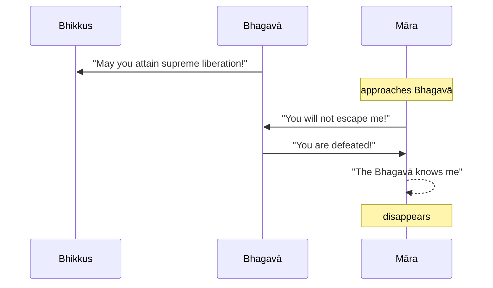

Original text: [World Tipitaka Edition](https://tipitaka2500.github.io/tipitaka/3V/1/1.10.html)

> [!INFO]
> Image generated by Imagen 4.

Pali text (click to view)

(35.)

147\. Atha kho bhagavā vassaṃvuṭṭho bhikkhū āmantesi—  “mayhaṃ kho, bhikkhave, yoniso manasikārā yoniso sammappadhānā anuttarā vimutti anuppattā, anuttarā vimutti sacchikatā. Tumhepi, bhikkhave, yoniso manasikārā yoniso sammappadhānā anuttaraṃ vimuttiṃ anupāpuṇātha, anuttaraṃ vimuttiṃ sacchikarothā”ti. Atha kho māro pāpimā yena bhagavā tenupasaṅkami, upasaṅkamitvā bhagavantaṃ gāthāya ajjhabhāsi—

148\. _“Baddhosi mārapāsehi,_  
_ye dibbā ye ca mānusā;_  
_Mahābandhanabaddhosi,_  
_na me samaṇa mokkhasī”ti._  

149\. _“Muttāhaṃ mārapāsehi,_  
_Ye dibbā ye ca mānusā;_  
_Mahābandhanamuttomhi,_  
_Nihato tvamasi antakā”ti._  

150\. Atha kho māro pāpimā—  “jānāti maṃ bhagavā, jānāti maṃ sugato”ti dukkhī dummano tatthevantaradhāyi.

---

151\. Dutiyamārakathā niṭṭhitā.

## Summary

After completing the rains retreat (`vassa`), the Bhagavā announced to the bhikkhus his attainment of supreme liberation (`vimutti`) through wise attention (`manasikāra`) and right effort (`sammappadhāna`), encouraging them to achieve the same. Māra the evil one then appeared, claiming the Bhagavā was still bound by his snares, both divine and human. However, the Bhagavā confidently declared his complete freedom from all such bonds, asserting Māra's defeat. Recognising that the Bhagavā knew him and his powerlessness, Māra vanished in disappointment.

## Diagram

## Text

(35.)

147\. Then indeed the bhagavā, having completed the rains retreat (`vassa`), addressed the bhikkhus: “For me indeed, bhikkhave, through wise `manasikāra` (attention), through wise `sammappadhāna` (right effort), supreme `vimutti` (liberation) has been attained, supreme `vimutti` (liberation) has been realized. You too, bhikkhave, through wise `manasikāra` (attention), through wise `sammappadhāna` (right effort), may you attain supreme `vimutti` (liberation), may you realize supreme `vimutti` (liberation).” Then indeed Māra the evil one approached the bhagavā; having approached, he addressed the bhagavā with a verse:

148\. _“You are bound by Māra’s snares,_ \
_Those divine and those human;_ \
_You are bound by a great bond,_ \
_You will not escape me, ascetic.”_

149\. _“I am freed from Māra’s snares,_ \
_Those divine and those human;_ \
_I am freed from the great bond,_ \
_You are defeated, Death!”_

150\. Then indeed Māra the evil one— “The bhagavā knows me, the sugata knows me,”— distressed, dejected, vanished right there.

---

151\. The second story of Māra is finished.

## Commentary

Once again the Buddha's nemesis, Māra, makes an appearance to question the stability of the new structure for the community, with satellite communities operating independently of the Buddha. Note that the Buddha is addressing a significantly expanded congregation and no longer making the assumption that they are all liberated.

The risk here is even greater than previous - those who are not yet liberated may succumb to temptation and stray from the path, whilst those that are liberated may revert to old ways.

Once again, the narrative signals confidence that the Buddha's new organisational structure is strong and should be able to resist these tendencies.

However, as we can see from the history of Buddhism, this stability did not last once the Buddha passed away. The community broke into various sects who could not agree on the interpretation of the Buddha's teachings and rules, and gradually the communities started misinterpreting his teachings and as a consequence fewer and fewer were liberated and eventually it was no longer possible to achieve liberation, causing a shift in later texts to emphasise that liberation is a gradual process taking many lifetimes, in the case of Therāvada, or a radical shift in the soteriological goal, in the case of Mahāyana.

[Go to previous page (9. Pabbajjūpasampadākathā)](1.9.md) / [Go to parent page (Khandhaka)](../Khandhaka) / [Go to next page (11. Bhaddavaggiyavatthu)](1.11.md)

