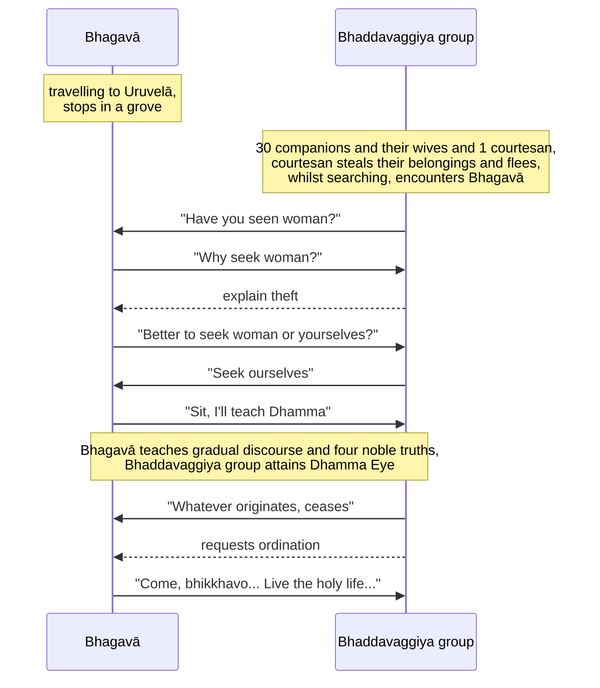

Original text: [World Tipitaka Edition](https://tipitaka2500.github.io/tipitaka/3V/1/1.11.html)

> [!INFO]
> Image generated by Imagen 4, representing a courtesan running away from the Bhaddavaggiya group, and the group decided to ask the Buddha for advice.

Pali text (click to view)

(36.)

152\. Atha kho bhagavā bārāṇasiyaṃ yathābhirantaṃ viharitvā yena uruvelā tena cārikaṃ pakkāmi. Atha kho bhagavā maggā okkamma yena aññataro vanasaṇḍo tenupasaṅkami, upasaṅkamitvā taṃ vanasaṇḍaṃ ajjhogāhetvā aññatarasmiṃ rukkhamūle nisīdi. Tena kho pana samayena tiṃsamattā bhaddavaggiyā sahāyakā sapajāpatikā tasmiṃ vanasaṇḍe paricārenti. Ekassa pajāpati nāhosi; tassa atthāya vesī ānītā ahosi. Atha kho sā vesī tesu pamattesu paricārentesu bhaṇḍaṃ ādāya palāyittha. Atha kho te sahāyakā sahāyakassa veyyāvaccaṃ karontā, taṃ itthiṃ gavesantā, taṃ vanasaṇḍaṃ āhiṇḍantā addasaṃsu bhagavantaṃ aññatarasmiṃ rukkhamūle nisinnaṃ. Disvāna yena bhagavā tenupasaṅkamiṃsu, upasaṅkamitvā bhagavantaṃ etadavocuṃ—  “api, bhante, bhagavā ekaṃ itthiṃ passeyyā”ti? “Kiṃ pana vo, kumārā, itthiyā”ti? “Idha mayaṃ, bhante, tiṃsamattā bhaddavaggiyā sahāyakā sapajāpatikā imasmiṃ vanasaṇḍe paricārimhā. Ekassa pajāpati nāhosi; tassa atthāya vesī ānītā ahosi. Atha kho sā, bhante, vesī amhesu pamattesu paricārentesu bhaṇḍaṃ ādāya palāyittha. Te mayaṃ, bhante, sahāyakā sahāyakassa veyyāvaccaṃ karontā, taṃ itthiṃ gavesantā, imaṃ vanasaṇḍaṃ āhiṇḍāmā”ti. “Taṃ kiṃ maññatha vo, kumārā, katamaṃ nu kho tumhākaṃ varaṃ—  yaṃ vā tumhe itthiṃ gaveseyyātha, yaṃ vā attānaṃ gaveseyyāthā”ti? “Etadeva, bhante, amhākaṃ varaṃ yaṃ mayaṃ attānaṃ gaveseyyāmā”ti. “Tena hi vo, kumārā, nisīdatha, dhammaṃ vo desessāmī”ti. “Evaṃ, bhante”ti kho te bhaddavaggiyā sahāyakā bhagavantaṃ abhivādetvā ekamantaṃ nisīdiṃsu.

153\. Tesaṃ bhagavā anupubbiṃ kathaṃ kathesi, seyyathidaṃ—  dānakathaṃ sīlakathaṃ saggakathaṃ kāmānaṃ ādīnavaṃ okāraṃ saṃkilesaṃ nekkhamme ānisaṃsaṃ pakāsesi. Yadā te bhagavā aññāsi kallacitte muducitte vinīvaraṇacitte udaggacitte pasannacitte, atha yā buddhānaṃ sāmukkaṃsikā dhammadesanā, taṃ pakāsesi dukkhaṃ samudayaṃ nirodhaṃ maggaṃ. Seyyathāpi nāma suddhaṃ vatthaṃ apagatakāḷakaṃ sammadeva rajanaṃ paṭiggaṇheyya; evameva tesaṃ tasmiṃyeva āsane virajaṃ vītamalaṃ dhammacakkhuṃ udapādi—  “yaṃ kiñci samudayadhammaṃ sabbaṃ taṃ nirodhadhamman”ti. Te diṭṭhadhammā pattadhammā viditadhammā pariyogāḷhadhammā tiṇṇavicikicchā vigatakathaṃkathā vesārajjappattā aparappaccayā satthusāsane bhagavantaṃ etadavocuṃ—  “labheyyāma mayaṃ, bhante, bhagavato santike pabbajjaṃ, labheyyāma upasampadan”ti. “Etha bhikkhavo”ti bhagavā avoca—  “svākkhāto dhammo, caratha brahmacariyaṃ sammā dukkhassa antakiriyāyā”ti. Sāva tesaṃ āyasmantānaṃ upasampadā ahosi.

---

154\. Bhaddavaggiyasahāyakānaṃ vatthu niṭṭhitaṃ.

  
Dutiyabhāṇavāro.

## Summary

While traveling, the Bhagavā encountered about thirty Bhaddavaggiya (a fine group) companions searching for a courtesan who had stolen their belongings. He redirected their focus, asking if it was better to search for the woman or for themselves, to which they agreed the latter was preferable. The Bhagavā then delivered a gradual discourse, starting with topics like giving and virtue, progressing to the dangers of sensual pleasures and the benefits of renunciation. When he perceived their minds were receptive, he taught them the core Dhamma: suffering, its origin, its cessation, and the path. Upon hearing this, the companions attained the "Dhamma-eye", understanding that whatever originates is subject to cessation, and subsequently requested and received ordination from the Bhagavā to live the holy life for the complete ending of suffering.

## Diagram

## Text

(36.)

152\. Then indeed, the Bhagavā, having dwelt in Bārāṇasī for as long as he wished, set out on a journey to where Uruvelā was. Then indeed, the Bhagavā, having turned aside from the road, approached a certain grove, and having approached and entered that grove, sat down at the foot of a certain tree. Now at that time, about thirty companions of the Bhaddavaggiya (a fine group), with their wives, were amusing themselves in that grove. For one of them, there was no wife; for his sake, a courtesan had been brought. Then indeed, that courtesan, while they were heedlessly amusing themselves, having taken their belongings, ran away. Then indeed, those companions, doing a service for their companion, searching for that woman, wandering about that grove, saw the Bhagavā sitting at the foot of a certain tree. Having seen him, they approached where the Bhagavā was, and having approached, they said this to the Bhagavā — “Bhante, did the Bhagavā perhaps see a woman?” “But what, kumārā (young man), have you to do with a woman?” “Here we, Bhante, about thirty companions of the Bhaddavaggiya group, with our wives, were amusing ourselves in this grove. For one, there was no wife; for his sake, a courtesan had been brought. Then indeed, Bhante, that courtesan, while we were heedlessly amusing ourselves, having taken our belongings, ran away. We, Bhante, companions, doing a service for our companion, searching for that woman, are wandering about this grove.”ti. “What do you think, kumārā, which indeed is better for you — that you should search for the woman, or that you should search for yourselves?” “This indeed, Bhante, is better for us, that we should search for ourselves.” “In that case, kumārā, sit down, I will teach you the Dhamma.” “Yes, Bhante,” the Bhaddavaggiyā group, having paid respects to the Bhagavā, sat down to one side.

153\. To them the Bhagavā gave a gradual discourse, that is to say — talk on generosity (`dānakathaṃ`), talk on ethical behaviour (`sīlakathaṃ`), talk on heaven (`saggakathaṃ`); he explained the danger, degradation, and defilement of sensual pleasures, and the benefit of renunciation. When the Bhagavā knew them to have receptive minds, pliable minds, minds free from nīvaraṇa (hindrances), uplifted minds, confident minds, then he proclaimed that Dhamma teaching which is the special instruction of the Buddhas: `dukkha` (suffering), `samudaya` (its origin), `nirodha` (its cessation), `magga` (the path). Just as indeed a clean cloth free from stains would rightly receive dye; even so for them, right on that very seat, the dust-free, stainless Dhammacakkhu (eye of Dhamma) arose — “whatever is `samudayadhamma` (subject to origination) is all `nirodhadhamma` (subject to cessation).” They, who have seen the Dhamma (`diṭṭhadhammo`), attained the Dhamma (`pattadhammo`), understood the Dhamma (`pariyogāḷhadhammo`), penetrated the Dhamma (`pariyogāḷhadhammo`), overcome doubt (`tiṇṇavicikiccho`), dispelled uncertainty (`vigatakathaṃkatho`), attained confidence (`vesārajjappatto`), and and not relying on another teacher's instructions (`aparappaccaya satthusāsane`), said this to the Bhagavā — “May we, Bhante, receive the `pabbajja` (going forth) in the Bhagavā's presence, may we receive the upasampadā (higher ordination)?” “Come, bhikkhavo,” the Bhagavā said - “Well-proclaimed is the Dhamma. Live the `brahmacariya` (disciplined life) for the complete ending of `dukkha` (suffering).” That itself for those `āyasmant`s (venerables) was the upasampadā (higher ordination).

---

154\. The story of the Bhaddavaggiya companions is finished.

  
Dutiyabhāṇavāro.

## Commentary

The narrative illustrates a shift in focus from external, object-oriented seeking to internal, phenomenological self-investigation. The men's initial state is one of agitation and distress, their consciousness directed entirely towards a lost object (the woman and belongings) representing frustrated desire. The Bhagavā’s intervention redirects their intentionality: the question "which is better... search for the woman, or that you should search for yourselves?" prompts a bracketing of the immediate external concern and an turn towards the experiencing subject.

The subsequent "gradual discourse" can be understood as a structured method for examining and transforming lived experience. Talk of "giving," "virtue," and "heaven" establishes a baseline of mental calm and ethical orientation, preparing the phenomenal field for deeper inquiry. Highlighting the "danger of sensual pleasures" and the "benefit of renunciation" encourages a direct assessment of how attachment to transient sensory experiences inherently leads to dissatisfaction and instability, while detachment offers a more stable mode of being.

The core teaching — suffering (`dukkha`), its origin (`samudaya`), its cessation (`nirodha`), and the path (`magga`) — provides a framework for understanding the structure of their subjective experience of distress.

The "arising of the dust-free, stainless Dhammacakkhu" signifies a profound insight: "whatever is subject to origination is all subject to cessation." This is not an abstract belief but a direct, unmediated perception of the impermanent and conditioned nature of all phenomena as they appear in experience. This insight restructures their understanding of reality and self, dissolving the foundations of their previous clinging and leading to a desire to fully embody this transformed mode of experiencing through ordination.

The significance of this narrative is that this is the first group of ordained bhikkhus that appear not to be liberated, although each member of the group apparently gained the "Dhamma eye" (understanding). Hence this establishes that the saṅgha now contains a mixture of those that are liberated (`arahant`s) as well as those that are not but ordained.

## Other opinions

- [Brekke - The Early Samgha and the Laity (1996)](<../Articles/Brekke - The Early Samgha and the Laity (1996).md>) [@Brekke1996] \
  This article argues that early Buddhism transformed from an open, conversionist movement into a more withdrawn, introversionist sect due to the persistent problem of individuals joining the Saṃgha for extrinsic, worldly motivations. Initially, the Saṃgha actively sought converts, competing with other religious groups for followers. However, as people began joining to escape debt, military service, or simply to attain an easy life, the community's purity and reputation were threatened, jeopardizing the crucial material support it received from the laity. In response, the Saṃgha developed introversionist characteristics by implementing stricter admission rules, emphasizing internal unity, regulating the appearance and conduct of monks to project an image of holiness, and establishing fixed monasteries for physical separation. This created a self-enforcing cycle where the Saṃgha's enhanced purity attracted greater lay support, which in turn made it a more appealing refuge for the extrinsically motivated, necessitating a continuous process of purification to maintain its stability.

[Go to previous page (10. Dutiyamārakathā)](1.10.md) / [Go to parent page (Khandhaka)](../Khandhaka) / [Go to next page (12. Uruvelapāṭihāriyakathā)](1.12.md)

## References
