Original text: [World Tipitaka Edition](https://tipitaka2500.github.io/tipitaka/3V/1/1.12.html)

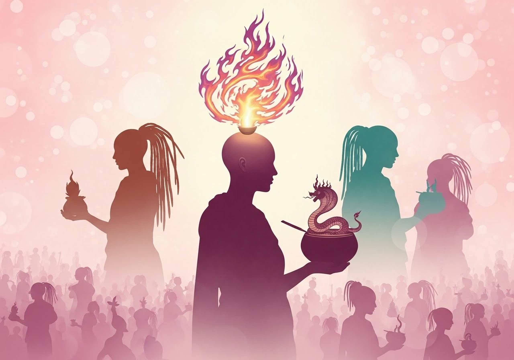

> [!INFO]
> Image generated by Imagen 4.

Pali text (click to view)

(37.)

155\. Atha kho Bhagavā anupubbena cārikaṃ caramāno yena uruvelā tadavasari. Tena kho pana samayena uruvelāyaṃ tayo jaṭilā paṭivasanti—  uruvelakassapo, nadīkassapo, gayākassapoti. Tesu uruvelakassapo jaṭilo pañcannaṃ jaṭilasatānaṃ nāyako hoti, vināyako aggo pamukho pāmokkho. Nadīkassapo jaṭilo tiṇṇaṃ jaṭilasatānaṃ nāyako hoti, vināyako aggo pamukho pāmokkho. Gayākassapo jaṭilo dvinnaṃ jaṭilasatānaṃ nāyako hoti, vināyako aggo pamukho pāmokkho.

156\. Atha kho Bhagavā yena uruvelakassapassa jaṭilassa assamo tenupasaṅkami, upasaṅkamitvā uruvelakassapaṃ jaṭilaṃ etadavoca—  “sace te, kassapa, agaru, vaseyyāma ekarattaṃ agyāgāre”ti? “Na kho me, mahāsamaṇa, garu, caṇḍettha nāgarājā iddhimā āsiviso ghoraviso, so taṃ mā viheṭhesī”ti.

157\. Dutiyampi kho Bhagavā uruvelakassapaṃ jaṭilaṃ etadavoca—  “sace te, kassapa, agaru, vaseyyāma ekarattaṃ agyāgāre”ti? “Na kho me, mahāsamaṇa, garu, caṇḍettha nāgarājā iddhimā āsiviso ghoraviso, so taṃ mā viheṭhesī”ti.

158\. Tatiyampi kho Bhagavā uruvelakassapaṃ jaṭilaṃ etadavoca—  “sace te, kassapa, agaru, vaseyyāma ekarattaṃ agyāgāre”ti? “Na kho me, mahāsamaṇa, garu, caṇḍettha nāgarājā iddhimā āsiviso ghoraviso, so taṃ mā viheṭhesī”ti. “Appeva maṃ na viheṭheyya, iṅgha tvaṃ, kassapa, anujānāhi agyāgāran”ti. “Vihara, mahāsamaṇa, yathāsukhan”ti. Atha kho Bhagavā agyāgāraṃ pavisitvā tiṇasanthārakaṃ paññapetvā nisīdi pallaṅkaṃ ābhujitvā ujuṃ kāyaṃ paṇidhāya parimukhaṃ satiṃ upaṭṭhapetvā.

(38.)

159\. Addasā kho so nāgo bhagavantaṃ paviṭṭhaṃ, disvāna dummano padhūpāyi. Atha kho bhagavato etadahosi—  “yannūnāhaṃ imassa nāgassa anupahacca chaviñca cammañca maṃsañca nhāruñca aṭṭhiñca aṭṭhimiñjañca tejasā tejaṃ pariyādiyeyyan”ti. Atha kho Bhagavā tathārūpaṃ iddhābhisaṅkhāraṃ abhisaṅkharitvā padhūpāyi. Atha kho so nāgo makkhaṃ asahamāno pajjali. Bhagavāpi tejodhātuṃ samāpajjitvā pajjali. Ubhinnaṃ sajotibhūtānaṃ agyāgāraṃ ādittaṃ viya hoti sampajjalitaṃ sajotibhūtaṃ. Atha kho te jaṭilā agyāgāraṃ parivāretvā evamāhaṃsu—  “abhirūpo vata bho mahāsamaṇo nāgena viheṭhiyatī”ti. Atha kho Bhagavā tassā rattiyā accayena tassa nāgassa anupahacca chaviñca cammañca maṃsañca nhāruñca aṭṭhiñca aṭṭhimiñjañca tejasā tejaṃ pariyādiyitvā patte pakkhipitvā uruvelakassapassa jaṭilassa dassesi—  “ayaṃ te, kassapa, nāgo pariyādinno assa tejasā tejo”ti. Atha kho uruvelakassapassa jaṭilassa etadahosi—  “mahiddhiko kho mahāsamaṇo mahānubhāvo, yatra hi nāma caṇḍassa nāgarājassa iddhimato āsivisassa ghoravisassa tejasā tejaṃ pariyādiyissati, na tveva ca kho arahā yathā ahan”ti.

(39.)

160\. _Nerañjarāyaṃ Bhagavā,_  \
_Uruvelakassapaṃ jaṭilaṃ avoca;_  \
_“Sace te kassapa agaru,_  \
_Viharemu ajjaṇho aggisālamhī”ti._  

161\. _“Na kho me mahāsamaṇa garu,_  \
_Phāsukāmova taṃ nivāremi;_  \
_Caṇḍettha nāgarājā,_  \
_Iddhimā āsiviso ghoraviso;_  \
_So taṃ mā viheṭhesī”ti._  

162\. _“Appeva maṃ na viheṭheyya,_  \
_Iṅgha tvaṃ kassapa anujānāhi agyāgāran”ti;_  \
_Dinnanti naṃ viditvā,_  \
_Abhīto pāvisi bhayamatīto._  

163\. _Disvā isiṃ paviṭṭhaṃ,_  \
_Ahināgo dummano padhūpāyi;_  \
_Sumanamanaso adhimano,_  \
_Manussanāgopi tattha padhūpāyi._  

164\. _Makkhañca asahamāno,_  \
_Ahināgo pāvakova pajjali;_  \
_Tejodhātusukusalo,_  \
_Manussanāgopi tattha pajjali._  

165\. _Ubhinnaṃ sajotibhūtānaṃ,_  \
_Agyāgāraṃ ādittaṃ hoti sampajjalitaṃ sajotibhūtaṃ;_  \
_Udicchare jaṭilā,_  \
_“Abhirūpo vata bho mahāsamaṇo;_  \
_Nāgena viheṭhiyatī”ti bhaṇanti._  

166\. _Atha tassā rattiyā accayena,_  \
_Hatā nāgassa acciyo honti;_  \
_Iddhimato pana ṭhitā,_  \
_Anekavaṇṇā acciyo honti._  

167\. _Nīlā atha lohitikā,_  \
_Mañjiṭṭhā pītakā phalikavaṇṇāyo;_  \
_Aṅgīrasassa kāye,_  \
_Anekavaṇṇā acciyo honti._  

168\. _Pattamhi odahitvā,_  \
_Ahināgaṃ brāhmaṇassa dassesi;_  \
_“Ayaṃ te kassapa nāgo,_  \
_Pariyādinno assa tejasā tejo”ti._  

169\. Atha kho uruvelakassapo jaṭilo bhagavato iminā iddhipāṭihāriyena abhippasanno bhagavantaṃ etadavoca—  “idheva, mahāsamaṇa, vihara, ahaṃ te dhuvabhattenā”ti.

---

170\. Paṭhamaṃ pāṭihāriyaṃ.

(40.)

171\. Atha kho Bhagavā uruvelakassapassa jaṭilassa assamassa avidūre aññatarasmiṃ vanasaṇḍe vihāsi. Atha kho cattāro mahārājāno abhikkantāya rattiyā abhikkantavaṇṇā kevalakappaṃ vanasaṇḍaṃ obhāsetvā yena Bhagavā tenupasaṅkamiṃsu, upasaṅkamitvā bhagavantaṃ abhivādetvā catuddisā aṭṭhaṃsu seyyathāpi mahantā aggikkhandhā.

172\. Atha kho uruvelakassapo jaṭilo tassā rattiyā accayena yena Bhagavā tenupasaṅkami, upasaṅkamitvā bhagavantaṃ etadavoca—  “kālo, mahāsamaṇa, niṭṭhitaṃ bhattaṃ. Ke nu kho te, mahāsamaṇa, abhikkantāya rattiyā abhikkantavaṇṇā kevalakappaṃ vanasaṇḍaṃ obhāsetvā yena tvaṃ tenupasaṅkamiṃsu, upasaṅkamitvā taṃ abhivādetvā catuddisā aṭṭhaṃsu seyyathāpi mahantā aggikkhandhā”ti. “Ete kho, kassapa, cattāro mahārājāno yenāhaṃ tenupasaṅkamiṃsu dhammassavanāyā”ti. Atha kho uruvelakassapassa jaṭilassa etadahosi—  “mahiddhiko kho mahāsamaṇo mahānubhāvo, yatra hi nāma cattāropi mahārājāno upasaṅkamissanti dhammassavanāya, na tveva ca kho arahā yathā ahan”ti. Atha kho Bhagavā uruvelakassapassa jaṭilassa bhattaṃ bhuñjitvā tasmiṃyeva vanasaṇḍe vihāsi.

---

173\. Dutiyaṃ pāṭihāriyaṃ.

(41.)

174\. Atha kho sakko devānamindo abhikkantāya rattiyā abhikkantavaṇṇo kevalakappaṃ vanasaṇḍaṃ obhāsetvā yena Bhagavā tenupasaṅkami, upasaṅkamitvā bhagavantaṃ abhivādetvā ekamantaṃ aṭṭhāsi seyyathāpi mahāaggikkhandho, purimāhi vaṇṇanibhāhi abhikkantataro ca paṇītataro ca.

175\. Atha kho uruvelakassapo jaṭilo tassā rattiyā accayena yena Bhagavā tenupasaṅkami, upasaṅkamitvā bhagavantaṃ etadavoca—  “kālo, mahāsamaṇa, niṭṭhitaṃ bhattaṃ. Ko nu kho so, mahāsamaṇa, abhikkantāya rattiyā abhikkantavaṇṇo kevalakappaṃ vanasaṇḍaṃ obhāsetvā yena tvaṃ tenupasaṅkami, upasaṅkamitvā taṃ abhivādetvā ekamantaṃ aṭṭhāsi seyyathāpi mahāaggikkhandho, purimāhi vaṇṇanibhāhi abhikkantataro ca paṇītataro cā”ti? “Eso kho, kassapa, sakko devānamindo yenāhaṃ tenupasaṅkami dhammassavanāyā”ti. Atha kho uruvelakassapassa jaṭilassa etadahosi—  “mahiddhiko kho mahāsamaṇo mahānubhāvo, yatra hi nāma sakkopi devānamindo upasaṅkamissati dhammassavanāya, na tveva ca kho arahā yathā ahan”ti. Atha kho Bhagavā uruvelakassapassa jaṭilassa bhattaṃ bhuñjitvā tasmiṃyeva vanasaṇḍe vihāsi.

---

176\. Tatiyaṃ pāṭihāriyaṃ.

(42.)

177\. Atha kho brahmā sahampati abhikkantāya rattiyā abhikkantavaṇṇo kevalakappaṃ vanasaṇḍaṃ obhāsetvā yena Bhagavā tenupasaṅkami, upasaṅkamitvā bhagavantaṃ abhivādetvā ekamantaṃ aṭṭhāsi seyyathāpi mahāaggikkhandho, purimāhi vaṇṇanibhāhi abhikkantataro ca paṇītataro ca.

178\. Atha kho uruvelakassapo jaṭilo tassā rattiyā accayena yena Bhagavā tenupasaṅkami, upasaṅkamitvā bhagavantaṃ etadavoca—  “kālo, mahāsamaṇa, niṭṭhitaṃ bhattaṃ. Ko nu kho so, mahāsamaṇa, abhikkantāya rattiyā abhikkantavaṇṇo kevalakappaṃ vanasaṇḍaṃ obhāsetvā yena tvaṃ tenupasaṅkami, upasaṅkamitvā taṃ abhivādetvā ekamantaṃ aṭṭhāsi seyyathāpi mahāaggikkhandho, purimāhi vaṇṇanibhāhi abhikkantataro ca paṇītataro cā”ti? “Eso kho, kassapa, brahmā sahampati yenāhaṃ tenupasaṅkami dhammassavanāyā”ti. Atha kho uruvelakassapassa jaṭilassa etadahosi—  “mahiddhiko kho mahāsamaṇo mahānubhāvo, yatra hi nāma brahmāpi sahampati upasaṅkamissati dhammassavanāya, na tveva ca kho arahā yathā ahan”ti. Atha kho Bhagavā uruvelakassapassa jaṭilassa bhattaṃ bhuñjitvā tasmiṃyeva vanasaṇḍe vihāsi.

---

179\. Catutthaṃ pāṭihāriyaṃ.

(43.)

180\. Tena kho pana samayena uruvelakassapassa jaṭilassa mahāyañño paccupaṭṭhito hoti, kevalakappā ca aṅgamagadhā pahūtaṃ khādanīyaṃ bhojanīyaṃ ādāya abhikkamitukāmā honti. Atha kho uruvelakassapassa jaṭilassa etadahosi—  “etarahi kho me mahāyañño paccupaṭṭhito, kevalakappā ca aṅgamagadhā pahūtaṃ khādanīyaṃ bhojanīyaṃ ādāya abhikkamissanti. Sace mahāsamaṇo mahājanakāye iddhipāṭihāriyaṃ karissati, mahāsamaṇassa lābhasakkāro abhivaḍḍhissati, mama lābhasakkāro parihāyissati. Aho nūna mahāsamaṇo svātanāya nāgaccheyyā”ti. Atha kho Bhagavā uruvelakassapassa jaṭilassa cetasā cetoparivitakkamaññāya uttarakuruṃ gantvā tato piṇḍapātaṃ āharitvā anotattadahe paribhuñjitvā tattheva divāvihāraṃ akāsi.

181\. Atha kho uruvelakassapo jaṭilo tassā rattiyā accayena yena Bhagavā tenupasaṅkami, upasaṅkamitvā bhagavantaṃ etadavoca—  “kālo, mahāsamaṇa, niṭṭhitaṃ bhattaṃ. Kiṃ nu kho, mahāsamaṇa, hiyyo nāgamāsi? Api ca mayaṃ taṃ sarāma—  kiṃ nu kho mahāsamaṇo nāgacchatīti? Khādanīyassa ca bhojanīyassa ca te paṭivīso ṭhapito”ti. “Nanu te, kassapa, etadahosi—  ‘etarahi kho me mahāyañño paccupaṭṭhito, kevalakappā ca aṅgamagadhā pahūtaṃ khādanīyaṃ bhojanīyaṃ ādāya abhikkamissanti, sace mahāsamaṇo mahājanakāye iddhipāṭihāriyaṃ karissati, mahāsamaṇassa lābhasakkāro abhivaḍḍhissati, mama lābhasakkāro parihāyissati, aho nūna mahāsamaṇo svātanāya nāgaccheyyā’ti. So kho ahaṃ, kassapa, tava cetasā cetoparivitakkamaññāya uttarakuruṃ gantvā tato piṇḍapātaṃ āharitvā anotattadahe paribhuñjitvā tattheva divāvihāraṃ akāsin”ti. Atha kho uruvelakassapassa jaṭilassa etadahosi—  “mahiddhiko kho mahāsamaṇo mahānubhāvo, yatra hi nāma cetasāpi cittaṃ pajānissati, na tveva ca kho arahā yathā ahan”ti. Atha kho Bhagavā uruvelakassapassa jaṭilassa bhattaṃ bhuñjitvā tasmiṃyeva vanasaṇḍe vihāsi.

---

182\. Pañcamaṃ pāṭihāriyaṃ.

(44.)

183\. Tena kho pana samayena bhagavato paṃsukūlaṃ uppannaṃ hoti. Atha kho bhagavato etadahosi—  “kattha nu kho ahaṃ paṃsukūlaṃ dhoveyyan”ti? Atha kho sakko devānamindo bhagavato cetasā cetoparivitakkamaññāya pāṇinā pokkharaṇiṃ khaṇitvā bhagavantaṃ etadavoca—  “idha, bhante, Bhagavā paṃsukūlaṃ dhovatū”ti. Atha kho bhagavato etadahosi—  “kimhi nu kho ahaṃ paṃsukūlaṃ parimaddeyyan”ti? Atha kho sakko devānamindo bhagavato cetasā cetoparivitakkamaññāya mahatiṃ silaṃ upanikkhipi—  “idha, bhante, Bhagavā paṃsukūlaṃ parimaddatū”ti. Atha kho bhagavato etadahosi—  “kimhi nu kho ahaṃ ālambitvā uttareyyan”ti? Atha kho kakudhe adhivatthā devatā bhagavato cetasā cetoparivitakkamaññāya sākhaṃ onāmesi—  “idha, bhante, Bhagavā ālambitvā uttaratū”ti. Atha kho bhagavato etadahosi—  “kimhi nu kho ahaṃ paṃsukūlaṃ vissajjeyyan”ti? Atha kho sakko devānamindo bhagavato cetasā cetoparivitakkamaññāya mahatiṃ silaṃ upanikkhipi—  “idha, bhante, Bhagavā paṃsukūlaṃ vissajjetū”ti.

184\. Atha kho uruvelakassapo jaṭilo tassā rattiyā accayena yena Bhagavā tenupasaṅkami, upasaṅkamitvā bhagavantaṃ etadavoca—  “kālo, mahāsamaṇa, niṭṭhitaṃ bhattaṃ. Kiṃ nu kho, mahāsamaṇa, nāyaṃ pubbe idha pokkharaṇī, sāyaṃ idha pokkharaṇī. Nayimā silā pubbe upanikkhittā. Kenimā silā upanikkhittā? Nayimassa kakudhassa pubbe sākhā onatā, sāyaṃ sākhā onatā”ti. “Idha me, kassapa, paṃsukūlaṃ uppannaṃ ahosi. Tassa mayhaṃ, kassapa, etadahosi—  ‘kattha nu kho ahaṃ paṃsukūlaṃ dhoveyyan’ti? Atha kho, kassapa, sakko devānamindo mama cetasā cetoparivitakkamaññāya pāṇinā pokkharaṇiṃ khaṇitvā maṃ etadavoca—  ‘idha, bhante, Bhagavā paṃsukūlaṃ dhovatū’ti. Sāyaṃ, kassapa, amanussena pāṇinā khaṇitā pokkharaṇī. Tassa mayhaṃ, kassapa, etadahosi—  ‘kimhi nu kho ahaṃ paṃsukūlaṃ parimaddeyyan’ti? Atha kho, kassapa, sakko devānamindo mama cetasā cetoparivitakkamaññāya mahatiṃ silaṃ upanikkhipi—  ‘idha, bhante, Bhagavā paṃsukūlaṃ parimaddatū’ti. Sāyaṃ, kassapa, amanussena upanikkhittā silā. Tassa mayhaṃ, kassapa, etadahosi—  ‘kimhi nu kho ahaṃ ālambitvā uttareyyan’ti? Atha kho, kassapa, kakudhe adhivatthā devatā mama cetasā cetoparivitakkamaññāya sākhaṃ onāmesi—  ‘idha, bhante, Bhagavā ālambitvā uttaratū’ti. Svāyaṃ āharahattho kakudho. Tassa mayhaṃ, kassapa, etadahosi—  ‘kimhi nu kho ahaṃ paṃsukūlaṃ vissajjeyyan’ti? Atha kho, kassapa, sakko devānamindo mama cetasā cetoparivitakkamaññāya mahatiṃ silaṃ upanikkhipi—  ‘idha, bhante, Bhagavā paṃsukūlaṃ vissajjetū’ti. Sāyaṃ, kassapa, amanussena upanikkhittā silā” Atha kho uruvelakassapassa jaṭilassa etadahosi—  “mahiddhiko kho mahāsamaṇo mahānubhāvo, yatra hi nāma sakkopi devānamindo veyyāvaccaṃ karissati, na tveva ca kho arahā yathā ahan”ti. Atha kho Bhagavā uruvelakassapassa jaṭilassa bhattaṃ bhuñjitvā tasmiṃyeva vanasaṇḍe vihāsi.

185\. Atha kho uruvelakassapo jaṭilo tassā rattiyā accayena yena Bhagavā tenupasaṅkami, upasaṅkamitvā bhagavato kālaṃ ārocesi—  “kālo, mahāsamaṇa, niṭṭhitaṃ bhattan”ti. “Gaccha tvaṃ, kassapa, āyāmahan”ti uruvelakassapaṃ jaṭilaṃ uyyojetvā yāya jambuyā “jambudīpo” paññāyati, tato phalaṃ gahetvā paṭhamataraṃ āgantvā agyāgāre nisīdi. Addasā kho uruvelakassapo jaṭilo bhagavantaṃ agyāgāre nisinnaṃ, disvāna bhagavantaṃ etadavoca—  “katamena tvaṃ, mahāsamaṇa, maggena āgato? Ahaṃ tayā paṭhamataraṃ pakkanto, so tvaṃ paṭhamataraṃ āgantvā agyāgāre nisinno”ti. “Idhāhaṃ, kassapa, taṃ uyyojetvā yāya jambuyā ‘jambudīpo’ paññāyati, tato phalaṃ gahetvā paṭhamataraṃ āgantvā agyāgāre nisinno. Idaṃ kho, kassapa, jambuphalaṃ vaṇṇasampannaṃ gandhasampannaṃ rasasampannaṃ. Sace ākaṅkhasi paribhuñjā”ti. “Alaṃ, mahāsamaṇa, tvaṃyeva taṃ arahasi, tvaṃyeva taṃ paribhuñjāhī”ti. Atha kho uruvelakassapassa jaṭilassa etadahosi—  “mahiddhiko kho mahāsamaṇo mahānubhāvo, yatra hi nāma maṃ paṭhamataraṃ uyyojetvā yāya jambuyā ‘jambudīpo’ paññāyati, tato phalaṃ gahetvā paṭhamataraṃ āgantvā agyāgāre nisīdissati, na tveva ca kho arahā yathā ahan”ti. Atha kho Bhagavā uruvelakassapassa jaṭilassa bhattaṃ bhuñjitvā tasmiṃyeva vanasaṇḍe vihāsi.

(45.)

186\. Atha kho uruvelakassapo jaṭilo tassā rattiyā accayena yena Bhagavā tenupasaṅkami, upasaṅkamitvā bhagavato kālaṃ ārocesi—  “kālo, mahāsamaṇa, niṭṭhitaṃ bhattan”ti. “Gaccha tvaṃ, kassapa, āyāmahan”ti uruvelakassapaṃ jaṭilaṃ uyyojetvā yāya jambuyā “jambudīpo” paññāyati, tassā avidūre ambo…pe…  tassā avidūre āmalakī…pe…  tassā avidūre harītakī…pe…  tāvatiṃsaṃ gantvā pāricchattakapupphaṃ gahetvā paṭhamataraṃ āgantvā agyāgāre nisīdi. Addasā kho uruvelakassapo jaṭilo bhagavantaṃ agyāgāre nisinnaṃ, disvāna bhagavantaṃ etadavoca—  “katamena tvaṃ, mahāsamaṇa, maggena āgato? Ahaṃ tayā paṭhamataraṃ pakkanto, so tvaṃ paṭhamataraṃ āgantvā agyāgāre nisinno”ti. “Idhāhaṃ, kassapa, taṃ uyyojetvā tāvatiṃsaṃ gantvā pāricchattakapupphaṃ gahetvā paṭhamataraṃ āgantvā agyāgāre nisinno. Idaṃ kho, kassapa, pāricchattakapupphaṃ vaṇṇasampannaṃ gandhasampannaṃ. Sace ākaṅkhasi gaṇhā”ti. “Alaṃ, mahāsamaṇa, tvaṃyeva taṃ arahasi, tvaṃyeva taṃ gaṇhā”ti. Atha kho uruvelakassapassa jaṭilassa etadahosi—  “mahiddhiko kho mahāsamaṇo mahānubhāvo, yatra hi nāma maṃ paṭhamataraṃ uyyojetvā tāvatiṃsaṃ gantvā pāricchattakapupphaṃ gahetvā paṭhamataraṃ āgantvā agyāgāre nisīdissati, na tveva ca kho arahā yathā ahan”ti.

(46.)

187\. Tena kho pana samayena te jaṭilā aggiṃ paricaritukāmā na sakkonti kaṭṭhāni phāletuṃ. Atha kho tesaṃ jaṭilānaṃ etadahosi—  “nissaṃsayaṃ kho mahāsamaṇassa iddhānubhāvo, yathā mayaṃ na sakkoma kaṭṭhāni phāletun”ti. Atha kho Bhagavā uruvelakassapaṃ jaṭilaṃ etadavoca—  “phāliyantu, kassapa, kaṭṭhānī”ti. “Phāliyantu, mahāsamaṇā”ti. Sakideva pañca kaṭṭhasatāni phāliyiṃsu. Atha kho uruvelakassapassa jaṭilassa etadahosi—  “mahiddhiko kho mahāsamaṇo mahānubhāvo, yatra hi nāma kaṭṭhānipi phāliyissanti, na tveva ca kho arahā yathā ahan”ti.

(47.)

188\. Tena kho pana samayena te jaṭilā aggiṃ paricaritukāmā na sakkonti aggiṃ ujjaletuṃ. Atha kho tesaṃ jaṭilānaṃ etadahosi—  “nissaṃsayaṃ kho mahāsamaṇassa iddhānubhāvo, yathā mayaṃ na sakkoma aggiṃ ujjaletun”ti. Atha kho Bhagavā uruvelakassapaṃ jaṭilaṃ etadavoca—  “ujjaliyantu, kassapa, aggī”ti. “Ujjaliyantu, mahāsamaṇā”ti. Sakideva pañca aggisatāni ujjaliyiṃsu. Atha kho uruvelakassapassa jaṭilassa etadahosi—  “mahiddhiko kho mahāsamaṇo mahānubhāvo, yatra hi nāma aggīpi ujjaliyissanti, na tveva ca kho arahā yathā ahan”ti.

(48.)

189\. Tena kho pana samayena te jaṭilā aggiṃ paricaritvā na sakkonti aggiṃ vijjhāpetuṃ. Atha kho tesaṃ jaṭilānaṃ etadahosi—  “nissaṃsayaṃ kho mahāsamaṇassa iddhānubhāvo, yathā mayaṃ na sakkoma aggiṃ vijjhāpetun”ti. Atha kho Bhagavā uruvelakassapaṃ jaṭilaṃ etadavoca—  “vijjhāyantu, kassapa, aggī”ti. “Vijjhāyantu, mahāsamaṇā”ti. Sakideva pañca aggisatāni vijjhāyiṃsu. Atha kho uruvelakassapassa jaṭilassa etadahosi—  “mahiddhiko kho mahāsamaṇo mahānubhāvo, yatra hi nāma aggīpi vijjhāyissanti, na tveva ca kho arahā yathā ahan”ti.

(49.)

190\. Tena kho pana samayena te jaṭilā sītāsu hemantikāsu rattīsu antaraṭṭhakāsu himapātasamaye najjā nerañjarāya ummujjantipi, nimujjantipi, ummujjananimujjanampi karonti. Atha kho Bhagavā pañcamattāni mandāmukhisatāni abhinimmini, yattha te jaṭilā uttaritvā visibbesuṃ. Atha kho tesaṃ jaṭilānaṃ etadahosi—  “nissaṃsayaṃ kho mahāsamaṇassa iddhānubhāvo, yathayimā mandāmukhiyo nimmitā”ti. Atha kho uruvelakassapassa jaṭilassa etadahosi—  “mahiddhiko kho mahāsamaṇo mahānubhāvo, yatra hi nāma tāva bahū mandāmukhiyopi abhinimminissati, na tveva ca kho arahā yathā ahan”ti.

(50.)

191\. Tena kho pana samayena mahā akālamegho pāvassi, mahā udakavāhako sañjāyi. Yasmiṃ padese Bhagavā viharati, so padeso udakena na otthaṭo hoti. Atha kho bhagavato etadahosi—  “yannūnāhaṃ samantā udakaṃ ussāretvā majjhe reṇuhatāya bhūmiyā caṅkameyyan”ti. Atha kho Bhagavā samantā udakaṃ ussāretvā majjhe reṇuhatāya bhūmiyā caṅkami. Atha kho uruvelakassapo jaṭilo—  “mā heva kho mahāsamaṇo udakena vūḷho ahosī”ti nāvāya sambahulehi jaṭilehi saddhiṃ yasmiṃ padese Bhagavā viharati taṃ padesaṃ agamāsi. Addasā kho uruvelakassapo jaṭilo bhagavantaṃ samantā udakaṃ ussāretvā majjhe reṇuhatāya bhūmiyā caṅkamantaṃ, disvāna bhagavantaṃ etadavoca—  “idaṃ nu tvaṃ, mahāsamaṇā”ti? “Ayamahamasmi, kassapā”ti Bhagavā vehāsaṃ abbhuggantvā nāvāya paccuṭṭhāsi. Atha kho uruvelakassapassa jaṭilassa etadahosi—  “mahiddhiko kho mahāsamaṇo mahānubhāvo, yatra hi nāma udakampi na pavāhissati, na tveva ca kho arahā yathā ahan”ti.

(51.)

192\. Atha kho bhagavato etadahosi—  “cirampi kho imassa moghapurisassa evaṃ bhavissati—  ‘mahiddhiko kho mahāsamaṇo mahānubhāvo, na tveva ca kho arahā yathā ahan’ti; yannūnāhaṃ imaṃ jaṭilaṃ saṃvejeyyan”ti. Atha kho Bhagavā uruvelakassapaṃ jaṭilaṃ etadavoca—  “neva ca kho tvaṃ, kassapa, arahā, nāpi arahattamaggasamāpanno. Sāpi te paṭipadā natthi, yāya tvaṃ arahā vā assasi, arahattamaggaṃ vā samāpanno”ti. Atha kho uruvelakassapo jaṭilo bhagavato pādesu sirasā nipatitvā bhagavantaṃ etadavoca—  “labheyyāhaṃ, bhante, bhagavato santike pabbajjaṃ, labheyyaṃ upasampadan”ti. “Tvaṃ khosi, kassapa, pañcannaṃ jaṭilasatānaṃ nāyako vināyako aggo pamukho pāmokkho. Tepi tāva apalokehi, yathā te maññissanti tathā te karissantī”ti.

193\. Atha kho uruvelakassapo jaṭilo yena te jaṭilā tenupasaṅkami, upasaṅkamitvā te jaṭile etadavoca—  “icchāmahaṃ, bho, mahāsamaṇe brahmacariyaṃ carituṃ, yathā bhavanto maññanti tathā karontū”ti. “Cirapaṭikā mayaṃ, bho, mahāsamaṇe abhippasannā, sace bhavaṃ, mahāsamaṇe brahmacariyaṃ carissati, sabbeva mayaṃ mahāsamaṇe brahmacariyaṃ carissāmā”ti. Atha kho te jaṭilā kesamissaṃ jaṭāmissaṃ khārikājamissaṃ aggihutamissaṃ udake pavāhetvā yena Bhagavā tenupasaṅkamiṃsu, upasaṅkamitvā bhagavato pādesu sirasā nipatitvā bhagavantaṃ etadavocuṃ—  “labheyyāma mayaṃ, bhante, bhagavato santike pabbajjaṃ, labheyyāma upasampadan”ti. “Etha bhikkhavo”ti Bhagavā avoca—  “svākkhāto dhammo, caratha brahmacariyaṃ sammā dukkhassa antakiriyāyā”ti. Sāva tesaṃ āyasmantānaṃ upasampadā ahosi.

(52.)

194\. Addasā kho nadīkassapo jaṭilo kesamissaṃ jaṭāmissaṃ khārikājamissaṃ aggihutamissaṃ udake vuyhamāne, disvānassa etadahosi—  “mā heva me bhātuno upasaggo ahosī”ti. Jaṭile pāhesi—  “gacchatha me bhātaraṃ jānāthā”ti. Sāmañca tīhi jaṭilasatehi saddhiṃ yenāyasmā uruvelakassapo tenupasaṅkami, upasaṅkamitvā āyasmantaṃ uruvelakassapaṃ etadavoca—  “idaṃ nu kho, kassapa, seyyo”ti? “Āmāvuso, idaṃ seyyo”ti. Atha kho te jaṭilā kesamissaṃ jaṭāmissaṃ khārikājamissaṃ aggihutamissaṃ udake pavāhetvā yena Bhagavā tenupasaṅkamiṃsu, upasaṅkamitvā bhagavato pādesu sirasā nipatitvā bhagavantaṃ etadavocuṃ—  “labheyyāma mayaṃ, bhante, bhagavato santike pabbajjaṃ, labheyyāma upasampadan”ti. “Etha bhikkhavo”ti Bhagavā avoca—  “svākkhāto dhammo, caratha brahmacariyaṃ sammā dukkhassa antakiriyāyā”ti. Sāva tesaṃ āyasmantānaṃ upasampadā ahosi.

(53.)

195\. Addasā kho gayākassapo jaṭilo kesamissaṃ jaṭāmissaṃ khārikājamissaṃ aggihutamissaṃ udake vuyhamāne, disvānassa etadahosi—  “mā heva me bhātūnaṃ upasaggo ahosī”ti. Jaṭile pāhesi—  “gacchatha me bhātaro jānāthā”ti. Sāmañca dvīhi jaṭilasatehi saddhiṃ yenāyasmā uruvelakassapo tenupasaṅkami, upasaṅkamitvā āyasmantaṃ uruvelakassapaṃ etadavoca—  “idaṃ nu kho, kassapa, seyyo”ti? “Āmāvuso, idaṃ seyyo”ti. Atha kho te jaṭilā kesamissaṃ jaṭāmissaṃ khārikājamissaṃ aggihutamissaṃ udake pavāhetvā yena Bhagavā tenupasaṅkamiṃsu, upasaṅkamitvā bhagavato pādesu sirasā nipatitvā bhagavantaṃ etadavocuṃ—  “labheyyāma mayaṃ, bhante, bhagavato santike pabbajjaṃ, labheyyāma upasampadan”ti. “Etha bhikkhavo”ti Bhagavā avoca—  “svākkhāto dhammo, caratha brahmacariyaṃ sammā dukkhassa antakiriyāyā”ti. Sāva tesaṃ āyasmantānaṃ upasampadā ahosi.

196\. Bhagavato adhiṭṭhānena pañca kaṭṭhasatāni na phāliyiṃsu, phāliyiṃsu; aggī na ujjaliyiṃsu, ujjaliyiṃsu; na vijjhāyiṃsu, vijjhāyiṃsu; pañcamandāmukhisatāni abhinimmini. Etena nayena aḍḍhuḍḍhapāṭihāriyasahassāni honti.

(54.)

197\. Atha kho Bhagavā uruvelāyaṃ yathābhirantaṃ viharitvā yena gayāsīsaṃ tena pakkāmi mahatā bhikkhusaṃghena saddhiṃ bhikkhusahassena sabbeheva purāṇajaṭilehi. Tatra sudaṃ Bhagavā gayāyaṃ viharati gayāsīse saddhiṃ bhikkhusahassena. Tatra kho Bhagavā bhikkhū āmantesi—

198\. “Sabbaṃ, bhikkhave, ādittaṃ. Kiñca, bhikkhave, sabbaṃ ādittaṃ? Cakkhu ādittaṃ, rūpā ādittā, cakkhuviññāṇaṃ ādittaṃ, cakkhusamphasso āditto, yamidaṃ cakkhusamphassapaccayā uppajjati vedayitaṃ sukhaṃ vā dukkhaṃ vā adukkhamasukhaṃ vā tampi ādittaṃ. Kena ādittaṃ? Rāgagginā dosagginā mohagginā ādittaṃ, jātiyā jarāya maraṇena sokehi paridevehi dukkhehi domanassehi upāyāsehi ādittanti vadāmi. Sotaṃ ādittaṃ, saddā ādittā, sotaviññāṇaṃ ādittaṃ, sotasamphasso āditto, yamidaṃ sotasamphassapaccayā uppajjati vedayitaṃ sukhaṃ vā dukkhaṃ vā adukkhamasukhaṃ vā tampi ādittaṃ. Kena ādittaṃ? Rāgagginā dosagginā mohagginā ādittaṃ, jātiyā jarāya maraṇena sokehi paridevehi dukkhehi domanassehi upāyāsehi ādittanti vadāmi. Ghānaṃ ādittaṃ, gandhā ādittā, ghānaviññāṇaṃ ādittaṃ, ghānasamphasso āditto, yamidaṃ ghānasamphassapaccayā uppajjati vedayitaṃ sukhaṃ vā dukkhaṃ vā adukkhamasukhaṃ vā tampi ādittaṃ. Kena ādittaṃ? Rāgagginā dosagginā mohagginā ādittaṃ, jātiyā jarāya maraṇena sokehi paridevehi dukkhehi domanassehi upāyāsehi ādittanti vadāmi. Jivhā ādittā, rasā ādittā, jivhāviññāṇaṃ ādittaṃ jivhāsamphasso āditto, yamidaṃ jivhāsamphassapaccayā uppajjati vedayitaṃ sukhaṃ vā dukkhaṃ vā adukkhamasukhaṃ vā tampi ādittaṃ. Kena ādittaṃ? Rāgagginā dosagginā mohagginā ādittaṃ, jātiyā jarāya maraṇena sokehi paridevehi dukkhehi domanassehi upāyāsehi ādittanti vadāmi. Kāyo āditto, phoṭṭhabbā ādittā, kāyaviññāṇaṃ ādittaṃ kāyasamphasso āditto, yamidaṃ kāyasamphassapaccayā uppajjati vedayitaṃ sukhaṃ vā dukkhaṃ vā adukkhamasukhaṃ vā tampi ādittaṃ. Kena ādittaṃ? Rāgagginā dosagginā mohagginā ādittaṃ, jātiyā jarāya maraṇena sokehi paridevehi dukkhehi domanassehi upāyāsehi ādittanti vadāmi. Mano āditto, dhammā ādittā, manoviññāṇaṃ ādittaṃ manosamphasso āditto, yamidaṃ manosamphassapaccayā uppajjati vedayitaṃ sukhaṃ vā dukkhaṃ vā adukkhamasukhaṃ vā tampi ādittaṃ. Kena ādittaṃ? Rāgagginā dosagginā mohagginā ādittaṃ, jātiyā jarāya maraṇena sokehi paridevehi dukkhehi domanassehi upāyāsehi ādittanti vadāmi.

199\. Evaṃ passaṃ, bhikkhave, sutavā ariyasāvako cakkhusmimpi nibbindati, rūpesupi nibbindati, cakkhuviññāṇepi nibbindati, cakkhusamphassepi nibbindati, yamidaṃ cakkhusamphassapaccayā uppajjati vedayitaṃ sukhaṃ vā dukkhaṃ vā adukkhamasukhaṃ vā, tasmimpi nibbindati. Sotasmimpi nibbindati, saddesupi nibbindati…pe…  ghānasmimpi nibbindati, gandhesupi nibbindati…pe…  jivhāyapi nibbindati, rasesupi nibbindati…pe…  kāyasmimpi nibbindati, phoṭṭhabbesupi nibbindati…pe…  manasmimpi nibbindati, dhammesupi nibbindati, manoviññāṇepi nibbindati, manosamphassepi nibbindati, yamidaṃ manosamphassapaccayā uppajjati vedayitaṃ sukhaṃ vā dukkhaṃ vā adukkhamasukhaṃ vā tasmimpi nibbindati, nibbindaṃ virajjati, virāgā vimuccati, vimuttasmiṃ vimuttamiti ñāṇaṃ hoti. Khīṇā jāti, vusitaṃ brahmacariyaṃ, kataṃ karaṇīyaṃ, nāparaṃ itthattāyāti pajānātī”ti.

200\. Imasmiñca pana veyyākaraṇasmiṃ bhaññamāne tassa bhikkhusahassassa anupādāya āsavehi cittāni vimucciṃsu.

---

201\. Ādittapariyāyasuttaṃ niṭṭhitaṃ.

  
Uruvelapāṭihāriyaṃ tatiyabhāṇavāro niṭṭhito.

## Summary

The Bhagavā (Buddha) journeyed to Uruvelā, encountering three dreadlocked ascetic brothers — Uruvelakassapa, Nadīkassapo, and Gayākassapo — who were leaders of one thousand ascetics. To overcome Uruvelakassapa's pride and belief in his own spiritual superiority, the Bhagavā performed a series of miracles, including subduing a fierce nāga, being visited by divine beings (Four Great Kings, Sakka, Brahmā Sahampati), discerning Uruvelakassapa's thoughts, and demonstrating control over natural elements and phenomena. Despite each miracle, Uruvelakassapa, while impressed by the Bhagavā's power, repeatedly concluded that the Bhagavā was not an arahant like himself. Finally, the Bhagavā directly challenged Uruvelakassapa's delusion, leading to the conversion of all three brothers and their one thousand followers, who then received ordination. Subsequently, the Bhagavā delivered the Fire Discourse at Gayāsīsa, explaining how all sensory experiences are "burning" with passion, aversion, and delusion, which led to the liberation of all one thousand newly ordained bhikkhus.

## Diagram

### The Kassapa brothers and their followers

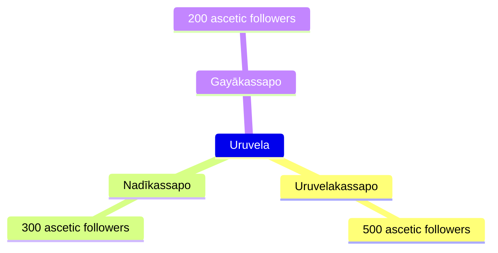
```mermaid
mindmap
Uruvela
	Uruvelakassapo
		500 ascetic followers
	Nadīkassapo
		300 ascetic followers
	Gayākassapo
		200 ascetic followers
```

### The Battle with the Naga King

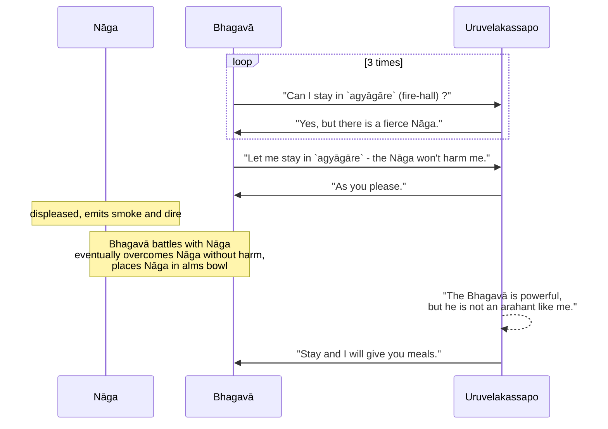
```mermaid
sequenceDiagram
	participant N as Nāga
	participant B as Bhagavā
	participant A1 as Uruvelakassapo
	loop 3 times
		B->>A1: "Can I stay in `agyāgāre` (fire-hall) ?"
		A1->>B: "Yes, but there is a fierce Nāga."
	end
	B->>A1: "Let me stay in `agyāgāre` - the Nāga won't harm me."
	A1->>B: "As you please."
	note over N: displeased, emits smoke and dire
	note over B, N: Bhagavā battles with Nāga <br> eventually overcomes Nāga without harm, <br> places Nāga in alms bowl
	A1-->>A1: "The Bhagavā is powerful, <br>but he is not an arahant like me."
	A1->>B: "Stay and I will give you meals."
```

### The First Miracle

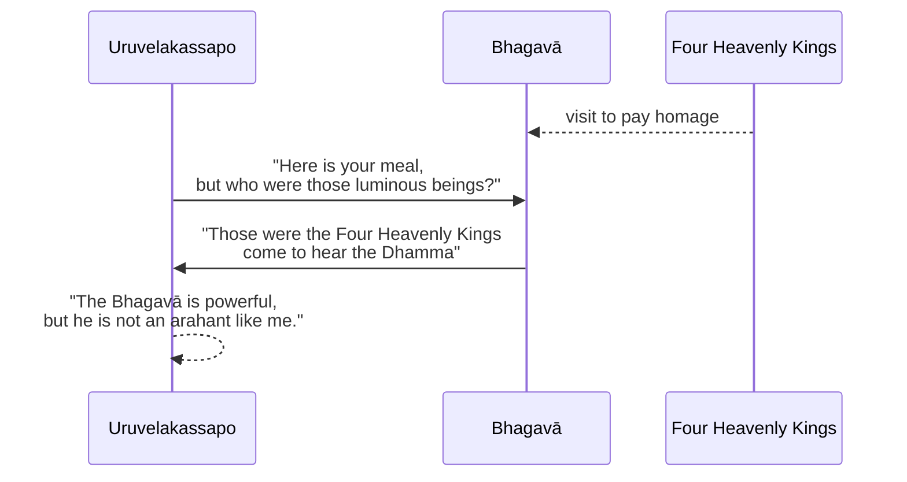
```mermaid
sequenceDiagram
	participant A1 as Uruvelakassapo
	participant B as Bhagavā
	participant X as Four Heavenly Kings
	X-->>B: visit to pay homage
	A1->>B: "Here is your meal, <br>but who were those luminous beings?"
	B->>A1: "Those were the Four Heavenly Kings<br>come to hear the Dhamma"
	A1-->>A1: "The Bhagavā is powerful, <br>but he is not an arahant like me."
```

### The Second Miracle

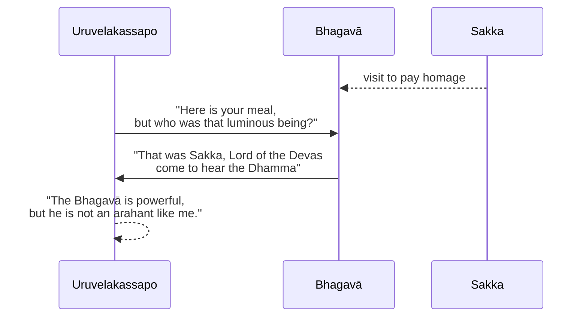
```mermaid
sequenceDiagram
	participant A1 as Uruvelakassapo
	participant B as Bhagavā
	participant X as Sakka
	X-->>B: visit to pay homage
	A1->>B: "Here is your meal, <br>but who was that luminous being?"
	B->>A1: "That was Sakka, Lord of the Devas<br>come to hear the Dhamma"
	A1-->>A1: "The Bhagavā is powerful, <br>but he is not an arahant like me."
```

### The Third Miracle

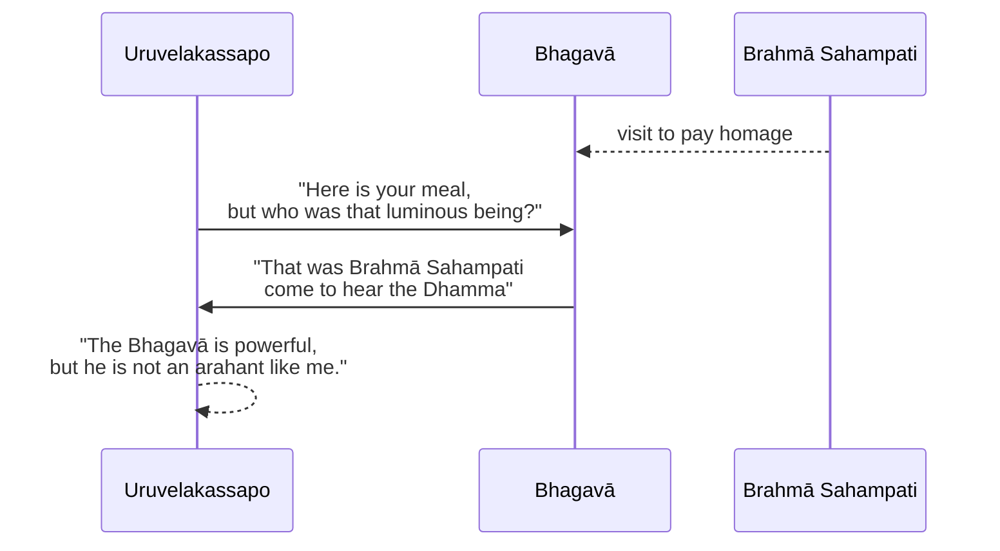
```mermaid
sequenceDiagram
	participant A1 as Uruvelakassapo
	participant B as Bhagavā
	participant X as Brahmā Sahampati
	X-->>B: visit to pay homage
	A1->>B: "Here is your meal, <br>but who was that luminous being?"
	B->>A1: "That was Brahmā Sahampati<br>come to hear the Dhamma"
	A1-->>A1: "The Bhagavā is powerful, <br>but he is not an arahant like me."
```

### The Fourth Miracle

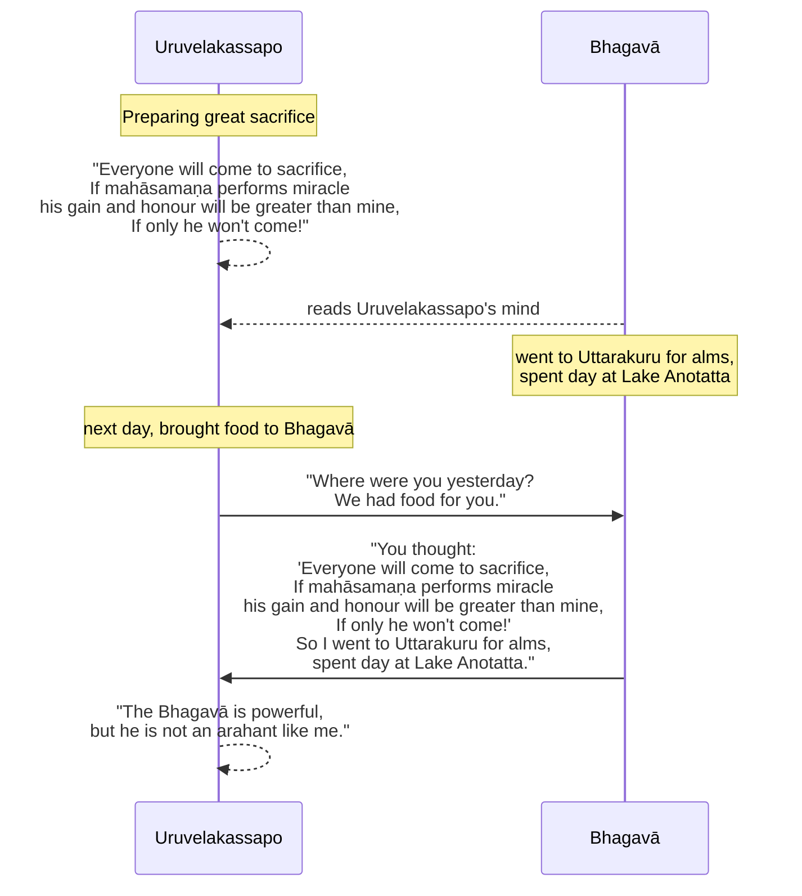
```mermaid
sequenceDiagram
	participant A1 as Uruvelakassapo
	participant B as Bhagavā
	note over A1: Preparing great sacrifice
	A1-->>A1: "Everyone will come to sacrifice,<br>If mahāsamaṇa performs miracle<br> his gain and honour will be greater than mine,<br>If only he won't come!"
	B-->>A1: reads Uruvelakassapo's mind
	note over B: went to Uttarakuru for alms,<br>spent day at Lake Anotatta
	note over A1: next day, brought food to Bhagavā
	A1->>B: "Where were you yesterday?<br>We had food for you."
	B->>A1: "You thought:<br>'Everyone will come to sacrifice,<br>If mahāsamaṇa performs miracle<br> his gain and honour will be greater than mine,<br>If only he won't come!'<br>So I went to Uttarakuru for alms,<br>spent day at Lake Anotatta."
	A1-->>A1: "The Bhagavā is powerful, <br>but he is not an arahant like me."
```

### The Fifth Miracle

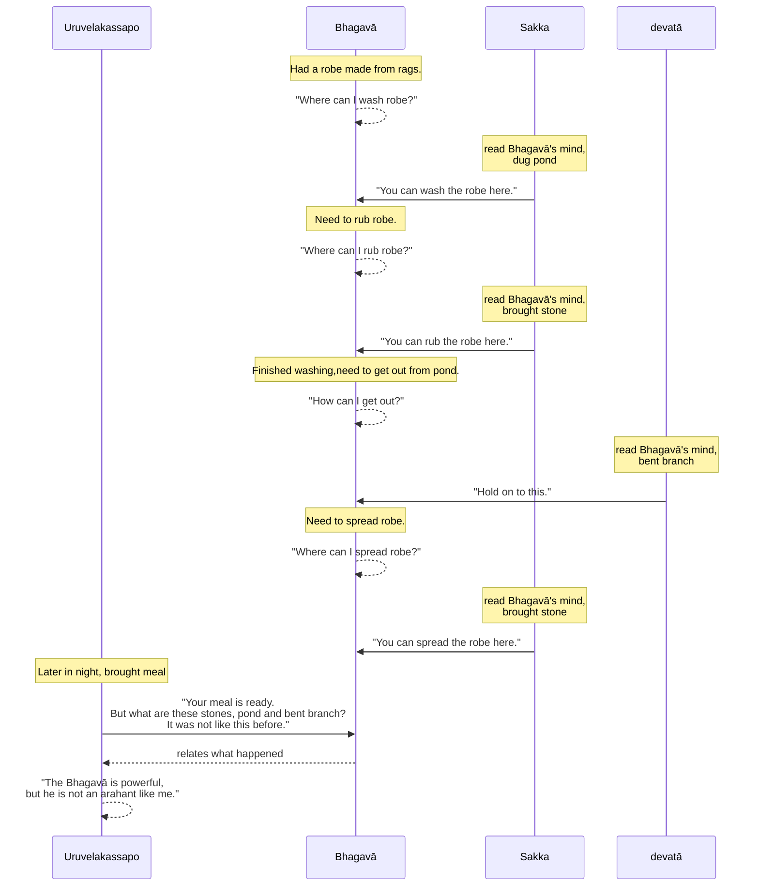
```mermaid
sequenceDiagram
	participant A1 as Uruvelakassapo
	participant B as Bhagavā
	participant S as Sakka
	participant D as devatā
	note over B: Had a robe made from rags.
	B-->>B: "Where can I wash robe?"
	note over S: read Bhagavā's mind,<br>dug pond
	S->>B: "You can wash the robe here."
	note over B: Need to rub robe.
	B-->>B: "Where can I rub robe?"
	note over S: read Bhagavā's mind,<br>brought stone
	S->>B: "You can rub the robe here."
	note over B: Finished washing,need to get out from pond.
	B-->>B: "How can I get out?"
	note over D: read Bhagavā's mind,<br>bent branch
	D->>B: "Hold on to this."
	note over B: Need to spread robe.
	B-->>B: "Where can I spread robe?"
	note over S: read Bhagavā's mind,<br>brought stone
	S->>B: "You can spread the robe here."
	note over A1: Later in night, brought meal
	A1->>B: "Your meal is ready.<br>But what are these stones, pond and bent branch?<br>It was not like this before."
	B-->>A1: relates what happened
	A1-->>A1: "The Bhagavā is powerful, <br>but he is not an arahant like me."
```

### Other Miracles

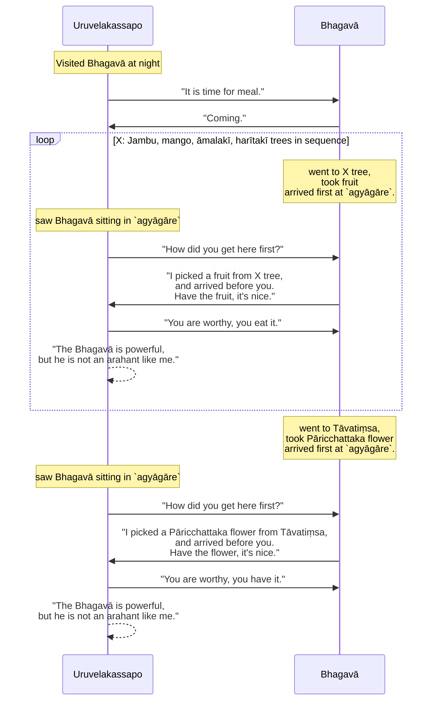
```mermaid
sequenceDiagram
	participant A1 as Uruvelakassapo
	participant B as Bhagavā
	note over A1: Visited Bhagavā at night
	A1->>B: "It is time for meal."
	B->>A1: "Coming."
	loop X: Jambu, mango, āmalakī, harītakī trees in sequence
		note over B: went to X tree,<br>took fruit<br>arrived first at `agyāgāre`.
		note over A1: saw Bhagavā sitting in `agyāgāre`
		A1->>B: "How did you get here first?"
		B->>A1: "I picked a fruit from X tree,<br>and arrived before you.<br>Have the fruit, it's nice."
		A1->>B: "You are worthy, you eat it."
		A1-->>A1: "The Bhagavā is powerful, <br>but he is not an arahant like me."
	end
	note over B: went to Tāvatiṃsa,<br>took Pāricchattaka flower<br>arrived first at `agyāgāre`.
	note over A1: saw Bhagavā sitting in `agyāgāre`
	A1->>B: "How did you get here first?"
	B->>A1: "I picked a Pāricchattaka flower from Tāvatiṃsa,<br>and arrived before you.<br>Have the flower, it's nice."
	A1->>B: "You are worthy, you have it."
	A1-->>A1: "The Bhagavā is powerful, <br>but he is not an arahant like me."
```

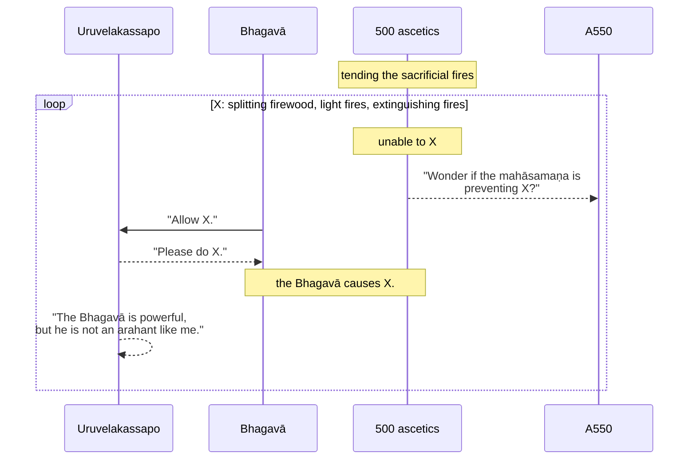
```mermaid
sequenceDiagram
	participant A1 as Uruvelakassapo
	participant B as Bhagavā
	participant A500 as 500 ascetics
	note over A500: tending the sacrificial fires
	loop X: splitting firewood, light fires, extinguishing fires
		note over A500: unable to X
		A500-->>A550: "Wonder if the mahāsamaṇa is <br>preventing X?"
		B->>A1: "Allow X."
		A1-->>B: "Please do X."
		note over B, A500: the Bhagavā causes X.
		A1-->>A1: "The Bhagavā is powerful, <br>but he is not an arahant like me."
	end
```

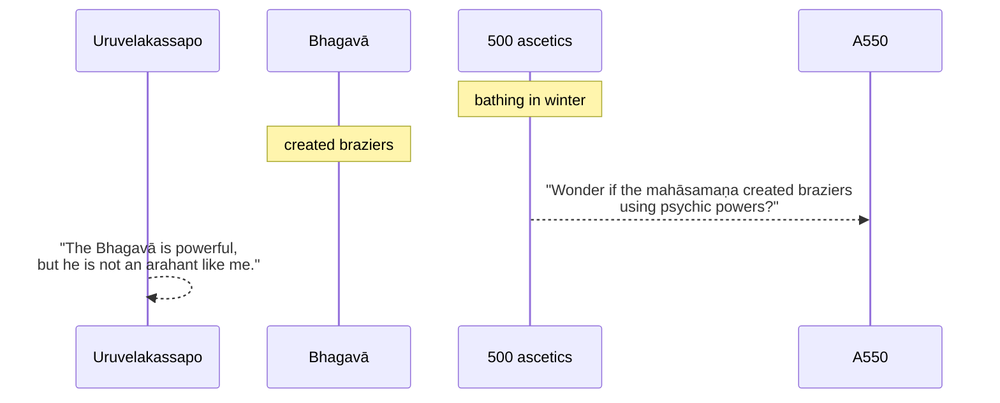
```mermaid
sequenceDiagram
	participant A1 as Uruvelakassapo
	participant B as Bhagavā
	participant A500 as 500 ascetics
	note over A500: bathing in winter
	note over B: created braziers
	A500-->>A550: "Wonder if the mahāsamaṇa created braziers<br> using psychic powers?"
	A1-->>A1: "The Bhagavā is powerful, <br>but he is not an arahant like me."
```

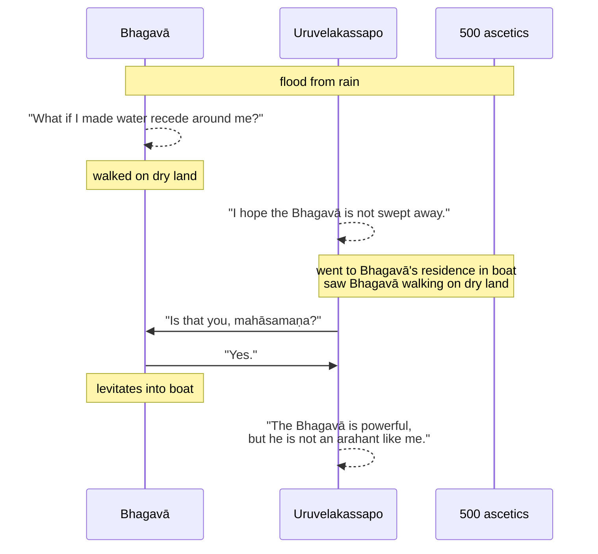
```mermaid
sequenceDiagram
	participant B as Bhagavā
	participant A1 as Uruvelakassapo
	participant A500 as 500 ascetics
	note over B, A500: flood from rain
	B-->>B: "What if I made water recede around me?"
	note over B: walked on dry land
	A1-->>A1: "I hope the Bhagavā is not swept away."
	note over A1, A500: went to Bhagavā's residence in boat<br>saw Bhagavā walking on dry land
	A1->>B: "Is that you, mahāsamaṇa?"
	B->>A1: "Yes."
	note over B: levitates into boat
	A1-->>A1: "The Bhagavā is powerful, <br>but he is not an arahant like me."
```

### Summary of the Buddha's  Miracles

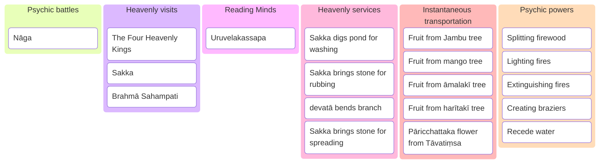
```mermaid
kanban
Psychic battles
	Nāga
Heavenly visits
	The Four Heavenly Kings
	Sakka
	Brahmā Sahampati
Reading Minds
	Uruvelakassapa
Heavenly services
	Sakka digs pond for washing
	Sakka brings stone for rubbing
	devatā bends branch
	Sakka brings stone for spreading
Instantaneous transportation
	Fruit from Jambu tree
	Fruit from mango tree
	Fruit from āmalakī tree
	Fruit from harītakī tree
	Pāricchattaka flower from Tāvatiṃsa
Psychic powers
	Splitting firewood
	Lighting fires
	Extinguishing fires
	Creating braziers
	Recede water
```

### The Conversion of Uruvelakassapo and followers

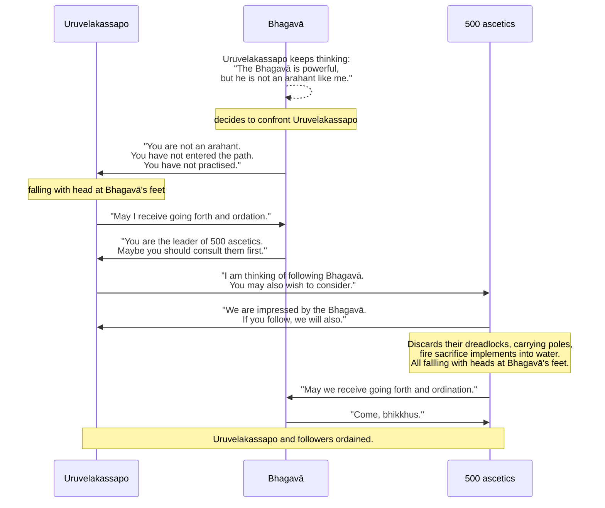
```mermaid
sequenceDiagram
	participant A1 as Uruvelakassapo
	participant B as Bhagavā
	participant A500 as 500 ascetics
	B-->>B: Uruvelakassapo keeps thinking:<br>"The Bhagavā is powerful, <br>but he is not an arahant like me."
	note over B: decides to confront Uruvelakassapo
	B->>A1: "You are not an arahant.<br>You have not entered the path.<br>You have not practised."
	note over A1: falling with head at Bhagavā's feet
	A1->>B: "May I receive going forth and ordation."
	B->>A1: "You are the leader of 500 ascetics.<br>Maybe you should consult them first."
	A1->>A500: "I am thinking of following Bhagavā.<br>You may also wish to consider."
	A500->>A1: "We are impressed by the Bhagavā.<br>If you follow, we will also."
	note over A500: Discards their dreadlocks, carrying poles, <br>fire sacrifice implements into water.<br>All fallling with heads at Bhagavā's feet.
	A500->>B: "May we receive going forth and ordination."
	B->>A500: "Come, bhikkhus."
	note over A1, A500: Uruvelakassapo and followers ordained.
```

### The Conversion of the other ascetics

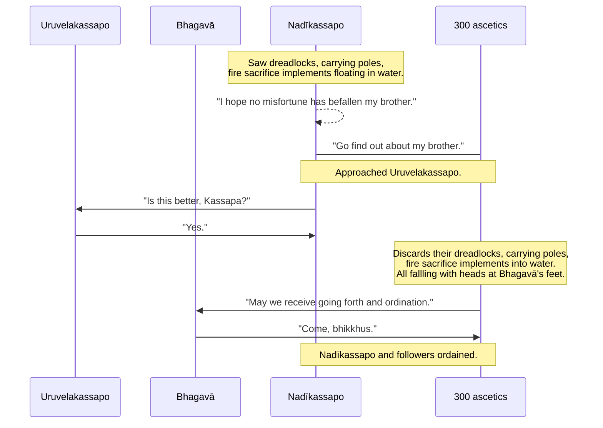
```mermaid
sequenceDiagram
	participant A1 as Uruvelakassapo
	participant B as Bhagavā
	participant A2 as Nadīkassapo
	participant A300 as 300 ascetics
	note over A2: Saw dreadlocks, carrying poles, <br>fire sacrifice implements floating in water.
	A2-->>A2: "I hope no misfortune has befallen my brother."
	A2->A300: "Go find out about my brother."
	note over A2, A300: Approached Uruvelakassapo.
	A2->>A1: "Is this better, Kassapa?"
	A1->>A2: "Yes."
	note over A300: Discards their dreadlocks, carrying poles, <br>fire sacrifice implements into water.<br>All fallling with heads at Bhagavā's feet.
	A300->>B: "May we receive going forth and ordination."
	B->>A300: "Come, bhikkhus."
	note over A2, A300: Nadīkassapo and followers ordained.
```

```mermaid
sequenceDiagram
	participant A1 as Uruvelakassapo
	participant B as Bhagavā
	participant A3 as Gayākassapo
	participant A200 as 200 ascetics
	note over A3: Saw dreadlocks, carrying poles, <br>fire sacrifice implements floating in water.
	A3-->>A3: "I hope no misfortune has befallen my brother."
	A3->A200: "Go find out about my brother."
	note over A3, A200: Approached Uruvelakassapo.
	A3->>A1: "Is this better, Kassapa?"
	A1->>A3: "Yes."
	note over A200: Discards their dreadlocks, carrying poles, <br>fire sacrifice implements into water.<br>All fallling with heads at Bhagavā's feet.
	A200->>B: "May we receive going forth and ordination."
	B->>A200: "Come, bhikkhus."
	note over A3, A200: Nadīkassapo and followers ordained.
```

### The Fire Sermon

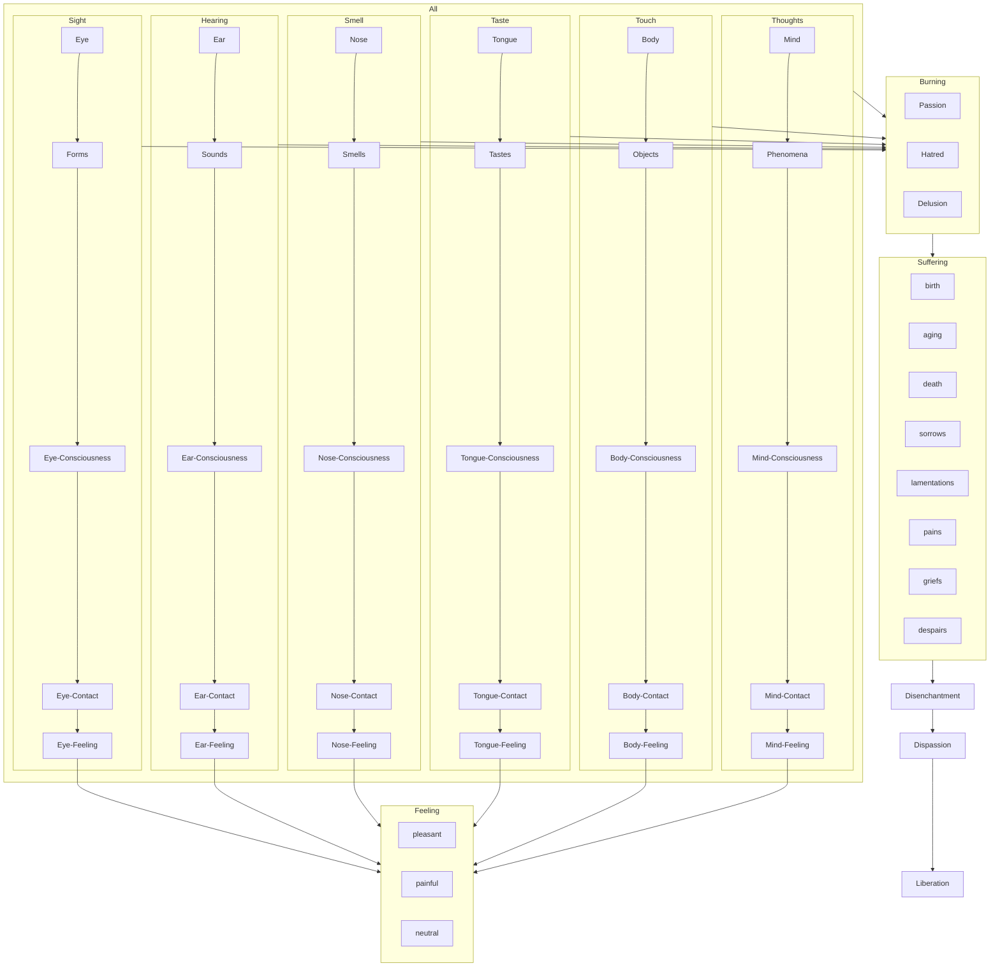
```mermaid
graph
subgraph All
	subgraph Sight
		Eye --> Forms --> Eye-Consciousness --> Eye-Contact --> Eye-Feeling
	end
	subgraph Hearing
		Ear --> Sounds --> Ear-Consciousness --> Ear-Contact --> Ear-Feeling
	end
	subgraph Smell
		Nose --> Smells --> Nose-Consciousness --> Nose-Contact --> Nose-Feeling
	end	
	subgraph Taste
		Tongue --> Tastes --> Tongue-Consciousness --> Tongue-Contact --> Tongue-Feeling
	end
	subgraph Touch
		Body --> Objects --> Body-Consciousness --> Body-Contact --> Body-Feeling
	end
	subgraph Thoughts
		Mind --> Phenomena --> Mind-Consciousness --> Mind-Contact --> Mind-Feeling
	end
end
	Eye-Feeling & Ear-Feeling & Nose-Feeling & Tongue-Feeling & Body-Feeling & Mind-Feeling --> Feeling
	subgraph Feeling
		pleasant
		painful
		neutral
	end
	Sight & Hearing & Smell & Taste & Touch & Thoughts --> B --> Suffering
	subgraph B[Burning]
		Passion
		Hatred
		Delusion
	end
	subgraph Suffering
		birth
		aging
		death
		sorrows
		lamentations
		pains
		griefs
		despairs
	end
Suffering --> Disenchantment --> Dispassion --> Liberation
```

## Text

(37.)

155\. Then the Bhagavā, wandering on tour in stages, arrived at Uruvelā. Now at that time, three dreadlocked ascetics were dwelling in Uruvelā — Uruvelakassapo, Nadīkassapo, and Gayākassapo. Among them, the dreadlocked ascetic Uruvelakassapo was the leader of five hundred dreadlocked ascetics, their guide, chief, foremost, and principal. The dreadlocked ascetic Nadīkassapo was the leader of three hundred dreadlocked ascetics, their guide, chief, foremost, and principal. The dreadlocked ascetic Gayākassapo was the leader of two hundred dreadlocked ascetics, their guide, chief, foremost, and principal.

156\. Then the Bhagavā approached the hermitage of the dreadlocked ascetic Uruvelakassapa, and having approached, said this to the dreadlocked ascetic Uruvelakassapa: “If it is not inconvenient for you, Kassapa, we would like to stay one night in the `agyāgāre` (room for keeping the sacred fire).” “It is not inconvenient for me, mahāsamaṇa (Great Ascetic), but there is a fierce `nāga` king there, powerful, a venomous serpent of dreadful venom; may he not harm you.”

157\. A second time the Bhagavā said this to the dreadlocked ascetic Uruvelakassapa: “If it is not inconvenient for you, Kassapa, we would like to stay one night in the `agyāgāre`.” “It is not inconvenient for me, mahāsamaṇa, but there is a fierce nāga king there, powerful, a venomous serpent of dreadful venom; may he not harm you.”

158\. A third time the Bhagavā said this to the dreadlocked ascetic Uruvelakassapa: “If it is not inconvenient for you, Kassapa, we would like to stay one night in the `agyāgāre`.” “It is not inconvenient for me, mahāsamaṇa, but there is a fierce nāga king there, powerful, a venomous serpent of dreadful venom; may he not harm you.” “It is unlikely he would harm me. Come now, Kassapa, allow me the `agyāgāre`.” “Dwell, mahāsamaṇa, as you please.” Then the Bhagavā entered the `agyāgāre`, spread a grass mat, and sat down, folding his legs crosswise, setting his body erect, and establishing awareness in front of him.

(38.)

159\. That nāga saw the Bhagavā enter, and seeing him, displeased, he emitted smoke. Then this occurred to the Bhagavā: “What if I, without harming this nāga’s skin, hide, flesh, sinews, bones, or marrow, were to overcome his fire with my fire?” Then the Bhagavā, having performed such a feat of psychic power, emitted smoke. Then that nāga, unable to endure the irritation, blazed forth. The Bhagavā also, entering the fire-element, blazed forth. With both of them ablaze, the `agyāgāre` was as if on fire, blazing, ablaze. Then those dreadlocked ascetics, surrounding the `agyāgāre`, said this: “Alas, the handsome mahāsamaṇa is being harmed by the nāga!” Then the Bhagavā, at the end of that night, without harming that nāga’s skin, hide, flesh, sinews, bones, or marrow, having overcome his fire with his fire, placed him in his alms-bowl and showed him to the dreadlocked ascetic Uruvelakassapa: “This, Kassapa, is your nāga, his fire overcome by my fire.” Then this occurred to the dreadlocked ascetic Uruvelakassapa: “The mahāsamaṇa is of great psychic power, of great might, in that he can overcome the fire of a fierce nāga king, powerful, a venomous serpent of dreadful venom, with his fire; but he is not an arahant (Worthy One) like I am.”

(39.)

160\. _At the Nerañjarā (river), the Bhagavā,_ \
_To Uruvelakassapa, the dreadlocked ascetic, spoke;_ \
_“If it is not inconvenient for you, Kassapa,_ \
_Let us stay today in the `aggisāla` (fire-hall).”_

161\. _“It is not inconvenient for me, mahāsamaṇa,_ \
_Wishing for your comfort, I prevent you;_ \
_There is a fierce nāga king here,_ \
_Powerful, a venomous serpent of dreadful venom;_ \
_May he not harm you.”_

162\. _“It is unlikely he would harm me,_ \
_Come now, Kassapa, allow me the `aggisāla`;”_ \
_Knowing it was given to him,_ \
_Fearless he entered, past fear._

163\. _Seeing the sage enter,_ \
_The nāga serpent, displeased, emitted smoke;_ \
_With a well-disposed mind, with a superior mind,_ \
_The nāga of men also there emitted smoke._

164\. _And unable to endure the irritation,_ \
_The nāga serpent blazed like fire;_ \
_Skilled in the fire-element,_ \
_The nāga of men also there blazed._

165\. _With both of them ablaze,_ \
_The `agyāgāre` was on fire, blazing, ablaze;_ \
_The dreadlocked ascetics exclaimed,_ \
_“Alas, the handsome mahāsamaṇa;_ \
_Is being harmed by the nāga!” they said._

166\. _Then at the end of that night,_ \
_The nāga’s flames were extinguished;_ \
_But of the powerful one, there remained,_ \
_Flames of many colors._

167\. _Blue and then crimson,_ \
_Madder, yellow, crystal-colored;_ \
_On Aṅgīrasa’s body,_ \
_Were flames of many colors._

168\. _Placing it in his bowl,_ \
_He showed the nāga serpent to the brahmin;_ \
_“This, Kassapa, is your nāga,_ \
_His fire overcome by my fire.”_

169\. Then the dreadlocked ascetic Uruvelakassapo, deeply impressed by this miracle of psychic power of the Bhagavā, said this to the Bhagavā: “Stay here, mahāsamaṇa, I will provide you with regular meals.”

---

170\. The first miracle.

(40.)

171\. Then the Bhagavā dwelt in a certain forest grove not far from the hermitage of the dreadlocked ascetic Uruvelakassapa. Then the Four Great Kings (`cattāro mahārājāno`), when the night was advanced, with their surpassing beauty, illuminating the entire forest grove, approached the Bhagavā; having approached and paid homage to the Bhagavā, they stood in the four directions like great masses of fire.

172\. Then the dreadlocked ascetic Uruvelakassapa, at the end of that night, approached the Bhagavā; having approached, he said this to the Bhagavā: “It is time, mahāsamaṇa, the meal is ready. Who were they, mahāsamaṇa, who, when the night was advanced, with their surpassing beauty, illuminating the entire forest grove, approached you, and having approached and paid homage to you, stood in the four directions like great masses of fire?” “Those, Kassapa, were the Four Great Kings, who approached me to hear the Dhamma.” Then this occurred to the dreadlocked ascetic Uruvelakassapa: “The mahāsamaṇa is of great psychic power, of great might, in that even the Four Great Kings approach him to hear the Dhamma; but he is not an arahant like I am.” Then the Bhagavā, having eaten the meal of the dreadlocked ascetic Uruvelakassapa, dwelt in that same forest grove.

---

173\. The second miracle.

(41.)

174\. Then Sakka, lord of the `deva`s (deities), when the night was advanced, with his surpassing beauty, illuminating the entire forest grove, approached the Bhagavā; having approached and paid homage to the Bhagavā, he stood to one side like a great mass of fire, more surpassing and more exquisite than the previous splendors.

175\. Then the dreadlocked ascetic Uruvelakassapa, at the end of that night, approached the Bhagavā; having approached, he said this to the Bhagavā: “It is time, mahāsamaṇa, the meal is ready. Who was he, mahāsamaṇa, who, when the night was advanced, with his surpassing beauty, illuminating the entire forest grove, approached you, and having approached and paid homage to you, stood to one side like a great mass of fire, more surpassing and more exquisite than the previous splendors?” “That, Kassapa, was Sakka, lord of the `deva`s, who approached me to hear the Dhamma.” Then this occurred to the dreadlocked ascetic Uruvelakassapa: “The mahāsamaṇa is of great psychic power, of great might, in that even Sakka, lord of the `deva`s, approaches him to hear the Dhamma; but he is not an arahant like I am.” Then the Bhagavā, having eaten the meal of the dreadlocked ascetic Uruvelakassapa, dwelt in that same forest grove.

---

176\. The third miracle.

(42.)

177\. Then Brahmā Sahampati, when the night was advanced, with his surpassing beauty, illuminating the entire forest grove, approached the Bhagavā; having approached and paid homage to the Bhagavā, he stood to one side like a great mass of fire, more surpassing and more exquisite than the previous splendors.

178\. Then the dreadlocked ascetic Uruvelakassapa, at the end of that night, approached the Bhagavā; having approached, he said this to the Bhagavā: “It is time, mahāsamaṇa, the meal is ready. Who was he, mahāsamaṇa, who, when the night was advanced, with his surpassing beauty, illuminating the entire forest grove, approached you, and having approached and paid homage to you, stood to one side like a great mass of fire, more surpassing and more exquisite than the previous splendors?” “That, Kassapa, was Brahmā Sahampati, who approached me to hear the Dhamma.” Then this occurred to the dreadlocked ascetic Uruvelakassapa: “The mahāsamaṇa is of great psychic power, of great might, in that even Brahmā Sahampati approaches him to hear the Dhamma; but he is not an arahant like I am.” Then the Bhagavā, having eaten the meal of the dreadlocked ascetic Uruvelakassapa, dwelt in that same forest grove.

---

179\. The fourth miracle.

(43.)

180\. Now at that time, a great sacrifice was prepared for the dreadlocked ascetic Uruvelakassapa, and all of Aṅga and Magadha, bringing abundant food and drink, were intending to come. Then this occurred to the dreadlocked ascetic Uruvelakassapa: “Now my great sacrifice is prepared, and people of Aṅga and Magadha, bringing abundant food and drink, will come. If the mahāsamaṇa performs a miracle of psychic power in the great assembly, the mahāsamaṇa’s gain and honor will increase, and my gain and honor will decrease. Oh, if only the mahāsamaṇa would not come tomorrow!” Then the Bhagavā, knowing with his mind the thought of the dreadlocked ascetic Uruvelakassapa, went to Uttarakuru, sought almsfood there, ate it by Lake Anotatta, and spent the day there.

181\. Then the dreadlocked ascetic Uruvelakassapa, at the end of that night, approached the Bhagavā; having approached, he said this to the Bhagavā: “It is time, mahāsamaṇa, the meal is ready. Why, mahāsamaṇa, did you not come yesterday? We were indeed thinking of you: ‘Why does the mahāsamaṇa not come?’ A share of the food and drink was set aside for you.” “Did you not think thus, Kassapa: ‘Now my great sacrifice is prepared, and people Aṅga and Magadha, bringing abundant food and drink, will come. If the mahāsamaṇa performs a miracle of psychic power in the great assembly, the mahāsamaṇa’s gain and honor will increase, and my gain and honor will decrease. Oh, if only the mahāsamaṇa would not come tomorrow!’ So I, Kassapa, knowing with my mind your thought, went to Uttarakuru, brought almsfood from there, ate it by Lake Anotatta, and spent the day there.” Then this occurred to the dreadlocked ascetic Uruvelakassapa: “The mahāsamaṇa is of great psychic power, of great might, in that he knows even the thoughts of others with his mind; but he is not an arahant like I am.” Then the Bhagavā, having eaten the meal of the dreadlocked ascetic Uruvelakassapa, dwelt in that same forest grove.

---

182\. The fifth miracle.

(44.)

183\. Now at that time, the Bhagavā had a robe made from rags. Then this occurred to the Bhagavā: “Where now shall I wash the rag-robe?” Then Sakka, lord of the `deva`s, knowing with his mind the thought in the Bhagavā’s mind, dug a pond with his hand and said this to the Bhagavā: “Here, bhante, may the Bhagavā wash the rag-robe.” Then this occurred to the Bhagavā: “On what now shall I rub the rag-robe?” Then Sakka, lord of the `deva`s, knowing with his mind the thought in the Bhagavā’s mind, brought up a large stone: “Here, bhante, may the Bhagavā rub the rag-robe.” Then this occurred to the Bhagavā: “Holding on to what now shall I get out?” Then the `devatā` inhabiting the Kakudha tree, knowing with his mind the thought in the Bhagavā’s mind, bent down a branch: “Here, bhante, holding on, may the Bhagavā get out.” Then this occurred to the Bhagavā: “On what now shall I spread out the rag-robe?” Then Sakka, lord of the `deva`s, knowing with his mind the thought in the Bhagavā’s mind, brought up a large stone: “Here, bhante, may the Bhagavā spread out the rag-robe.”

184\. Then the dreadlocked ascetic Uruvelakassapa, at the end of that night, approached the Bhagavā; having approached, he said this to the Bhagavā: “It is time, mahāsamaṇa, the meal is ready. Why, mahāsamaṇa, was this pond not here before, but now this pond is here? These stones were not brought up before. By whom were these stones brought up? The branch of this Kakudha tree was not bent down before, but now this branch is bent down.” “Here, Kassapa, a rag-robe had arisen for me. To me, Kassapa, this occurred: ‘Where now shall I wash the rag-robe?’ Then, Kassapa, Sakka, lord of the `deva`s, knowing with his mind my thought, dug a pond with his hand and said this to me: ‘Here, bhante, may the Bhagavā wash the rag-robe.’ That, Kassapa, is the pond dug by a non-human hand. To me, Kassapa, this occurred: ‘On what now shall I rub the rag-robe?’ Then, Kassapa, Sakka, lord of the `deva`s, knowing with his mind my thought, brought up a large stone: ‘Here, bhante, may the Bhagavā rub the rag-robe.’ That, Kassapa, is the stone brought up by a non-human. To me, Kassapa, this occurred: ‘Holding on to what now shall I get out?’ Then, Kassapa, the `devatā` inhabiting the Kakudha tree, knowing with his mind my thought, bent down a branch: ‘Here, bhante, holding on, may the Bhagavā get out.’ That is the Kakudha tree with its branch brought within reach. To me, Kassapa, this occurred: ‘On what now shall I spread out the rag-robe?’ Then, Kassapa, Sakka, lord of the `deva`s, knowing with his mind my thought, brought up a large stone: ‘Here, bhante, may the Bhagavā spread out the rag-robe.’ That, Kassapa, is the stone brought up by a non-human.” Then this occurred to the dreadlocked ascetic Uruvelakassapa: “The mahāsamaṇa is of great psychic power, of great might, in that even Sakka, lord of the `deva`s, will perform services for him; but he is not an arahant like I am.” Then the Bhagavā, having eaten the meal of the dreadlocked ascetic Uruvelakassapa, dwelt in that same forest grove.

185\. Then the dreadlocked ascetic Uruvelakassapa, at the end of that night, approached the Bhagavā, and having approached, announced the time to the Bhagavā: “It is time, mahāsamaṇa, the meal is ready.” “You go, Kassapa, I am coming,” and having sent off the dreadlocked ascetic Uruvelakassapa, he went to the Jambu tree from which Jambudīpa (the Indian continent) is known, took a fruit from there, and arriving first, sat in the `agyāgāre`. The dreadlocked ascetic Uruvelakassapa saw the Bhagavā sitting in the `agyāgāre`, and seeing him, said this to the Bhagavā: “By which path did you come, mahāsamaṇa? I departed before you, yet you, arriving first, are sitting in the `agyāgāre`.” “Here, Kassapa, having sent you off, I went to the Jambu tree from which Jambudīpa is known, took a fruit from there, and arriving first, am sitting in the `agyāgāre`. This, Kassapa, is a Jambu fruit, endowed with color, endowed with fragrance, endowed with taste. If you wish, eat it.” “Enough, mahāsamaṇa, you yourself are worthy of it, you yourself eat it.” Then this occurred to the dreadlocked ascetic Uruvelakassapa: “The mahāsamaṇa is of great psychic power, of great might, in that having sent me off first, he went to the Jambu tree from which ‘Jambudīpa’ is known, took a fruit from there, and arriving first, will sit in the `agyāgāre`; but he is not an arahant like I am.” Then the Bhagavā, having eaten the meal of the dreadlocked ascetic Uruvelakassapa, dwelt in that same forest grove.

(45.)

186\. Then the dreadlocked ascetic Uruvelakassapa, at the end of that night, approached the Bhagavā, and having approached, announced the time to the Bhagavā: “It is time, mahāsamaṇa, the meal is ready.” “You go, Kassapa, I am coming,” and having sent off the dreadlocked ascetic Uruvelakassapa, not far from that Jambu tree from which ‘Jambudīpa’ is known, a mango tree… and so on… not far from it, an āmalakī fruit tree… and so on… not far from it, a harītakī fruit tree… and so on… having gone to Tāvatiṃsa and taken a Pāricchattaka flower, he arrived first and sat in the `agyāgāre`. The dreadlocked ascetic Uruvelakassapa saw the Bhagavā sitting in the `agyāgāre`, and seeing him, said this to the Bhagavā: “By which path did you come, mahāsamaṇa? I departed before you, yet you, arriving first, are sitting in the `agyāgāre`.” “Here, Kassapa, having sent you off, I went to Tāvatiṃsa, took a Pāricchattaka flower, and arriving first, am sitting in the `agyāgāre`. This, Kassapa, is a Pāricchattaka flower, endowed with color, endowed with fragrance. If you wish, take it.” “Enough, mahāsamaṇa, you yourself are worthy of it, you yourself take it.” Then this occurred to the dreadlocked ascetic Uruvelakassapa: “The mahāsamaṇa is of great psychic power, of great might, in that having sent me off first, he went to Tāvatiṃsa, took a Pāricchattaka flower, and arriving first, will sit in the `agyāgāre`; but he is not an arahant like I am.”

(46.)

187\. Now at that time, those dreadlocked ascetics, wishing to tend the sacrificial fire, were unable to split the firewood. Then this occurred to those dreadlocked ascetics: “Without a doubt, it is due to the psychic power of the mahāsamaṇa that we are unable to split the firewood.” Then the Bhagavā said this to the dreadlocked ascetic Uruvelakassapa: “Let the firewood to be split, Kassapa.” “Let them be split, mahāsamaṇa.” At once, five hundred pieces of firewood were split. Then this occurred to the dreadlocked ascetic Uruvelakassapa: “The mahāsamaṇa is of great psychic power, of great might, in that even firewood will be split; but he is not an arahant like I am.”

(47.)

188\. Now at that time, those dreadlocked ascetics, wishing to tend the fire, were unable to light the fires. Then this occurred to those dreadlocked ascetics: “Without a doubt, it is due to the psychic power of the mahāsamaṇa that we are unable to light the fires.” Then the Bhagavā said this to the dreadlocked ascetic Uruvelakassapa: “Let the fires be lit, Kassapa.” “Let them be lit, mahāsamaṇa.” At once, five hundred fires were lit. Then this occurred to the dreadlocked ascetic Uruvelakassapa: “The mahāsamaṇa is of great psychic power, of great might, in that even fires will be lit; but he is not an arahant like I am.”

(48.)

189\. Now at that time, those dreadlocked ascetics, having tended the fire, were unable to extinguish the fires. Then this occurred to those dreadlocked ascetics: “Without a doubt, it is due to the psychic power of the mahāsamaṇa that we are unable to extinguish the fires.” Then the Bhagavā said this to the dreadlocked ascetic Uruvelakassapa: “Let the fires be extinguished, Kassapa.” “Let them be extinguished, mahāsamaṇa.” At once, five hundred fires were extinguished. Then this occurred to the dreadlocked ascetic Uruvelakassapa: “The mahāsamaṇa is of great psychic power, of great might, in that even fires will be extinguished; but he is not an arahant like I am.”

(49.)

190\. Now at that time, those dreadlocked ascetics, on cold winter nights, during the eight days between seasons, at the time of snowfall, were plunging into the river Nerañjarā, emerging, and plunging and emerging. Then the Bhagavā magically procured five hundred coal pans, where those dreadlocked ascetics, having come out, warmed themselves. Then this occurred to those dreadlocked ascetics: “Without a doubt, it is due to the psychic power of the mahāsamaṇa that these coal pans have been created.” Then this occurred to the dreadlocked ascetic Uruvelakassapa: “The mahāsamaṇa is of great psychic power, of great might, in that he can create so many coal pans; but he is not an arahant like I am.”

(50.)

191\. Now at that time, a great unseasonal rain poured down, a great flood arose. The place where the Bhagavā was dwelling was not inundated by water. Then this occurred to the Bhagavā: “What if I were to make the water recede all around and walk on dry, dusty ground in the middle?” Then the Bhagavā made the water recede all around and walked on dry, dusty ground in the middle. Then the dreadlocked ascetic Uruvelakassapa, thinking, “May the mahāsamaṇa not have been swept away by the water,” went with many dreadlocked ascetics in a boat to the place where the Bhagavā was dwelling. The dreadlocked ascetic Uruvelakassapa saw the Bhagavā making the water recede all around and walking on dry, dusty ground in the middle, and seeing him, said this to the Bhagavā: “Is this you, mahāsamaṇa?” “It is I, Kassapa,” said the Bhagavā, and rising into the air, he alighted in the boat. Then this occurred to the dreadlocked ascetic Uruvelakassapa: “The mahāsamaṇa is of great psychic power, of great might, in that even water will not carry him away; but he is not an arahant like I am.”

(51.)

192\. Then this occurred to the Bhagavā: “For a long time this foolish man will think: ‘The mahāsamaṇa is of great psychic power, of great might, but he is not an arahant like I am’; what if I were to provoke this dreadlocked ascetic?” Then the Bhagavā said this to the dreadlocked ascetic Uruvelakassapa: “You are not an arahant, Kassapa, nor have you entered the path to arahatship. Nor do you have that practice by which you would be an arahant or would have entered the path to arahatship.” Then the dreadlocked ascetic Uruvelakassapa, falling with his head at the Bhagavā’s feet, said this to the Bhagavā: “May I, Bhante, receive the going forth in the Bhagavā’s presence, may I receive the higher ordination.” “You, Kassapa, are the leader of five hundred dreadlocked ascetics, their guide, chief, foremost, and principal. First consult them; as they think fit, so they will do.”

193\. Then the dreadlocked ascetic Uruvelakassapa approached those dreadlocked ascetics, and having approached, said this to those dreadlocked ascetics: “I wish, sirs, to live the disciplined life under the mahāsamaṇa; as you sirs think fit, so do.” “For a long time, sir, we have been deeply impressed by the mahāsamaṇa. If you, sir, will live the disciplined life under the mahāsamaṇa, we all will live the disciplined life under the mahāsamaṇa.” Then those dreadlocked ascetics, having thrown their hair-tufts, matted locks, carrying-poles, and fire-sacrifice implements into the water, approached the Bhagavā, and having approached, falling with their heads at the Bhagavā’s feet, said this to the Bhagavā: “May we, bhante, receive the going forth in the Bhagavā’s presence, may we receive the higher ordination.” “Come, bhikkhus,” said the Bhagavā, “the Dhamma is well-proclaimed. Live the disciplined life for the complete ending of suffering (`dukkha`).” That itself was the higher ordination of those venerable ones.

(52.)

194\. The dreadlocked ascetic Nadīkassapo saw the hair-tufts, matted locks, carrying-poles, and fire-sacrifice implements being carried away by the water, and seeing them, this occurred to him: “May no misfortune have befallen my brother.” He sent dreadlocked ascetics: “Go, find out about my brother.” And he himself, with three hundred dreadlocked ascetics, approached the venerable Uruvelakassapo, and having approached, said this to the venerable Uruvelakassapo: “Is this indeed better, Kassapa?” “Yes, friend, this is better.” Then those dreadlocked ascetics, having thrown their hair-tufts, matted locks, carrying-poles, and fire-sacrifice implements into the water, approached the Bhagavā, and having approached, falling with their heads at the Bhagavā’s feet, said this to the Bhagavā: “May we, bhante, receive the going forth in the Bhagavā’s presence, may we receive the higher ordination.” “Come, bhikkhus,” said the Bhagavā, “the Dhamma is well-proclaimed. Live the holy life for the complete ending of suffering (`dukkha`).” That itself was the higher ordination of those venerable ones.

(53.)

195\. The dreadlocked ascetic Gayākassapo saw the hair-tufts, matted locks, carrying-poles, and fire-sacrifice implements being carried away by the water, and seeing them, this occurred to him: “May no misfortune have befallen my brothers.” He sent dreadlocked ascetics: “Go, find out about my brothers.” And he himself, with two hundred dreadlocked ascetics, approached the venerable Uruvelakassapo, and having approached, said this to the venerable Uruvelakassapo: “Is this indeed better, Kassapa?” “Yes, friend, this is better.” Then those dreadlocked ascetics, having thrown their hair-tufts, matted locks, carrying-poles, and fire-sacrifice implements into the water, approached the Bhagavā, and having approached, falling with their heads at the Bhagavā’s feet, said this to the Bhagavā: “May we, bhante, receive the going forth in the Bhagavā’s presence, may we receive the higher ordination.” “Come, bhikkhus,” said the Bhagavā, “the Dhamma is well-proclaimed. Live the holy life for the complete ending of suffering (`dukkha`).” That itself was the higher ordination of those venerable ones.

196\. By the Bhagavā’s determination, five hundred pieces of firewood were not split, then were split; fires were not lit, then were lit; were not extinguished, then were extinguished; he created five hundred braziers. In this way, there are one thousand five hundred miracles.

(54.)

197\. Then the Bhagavā, having dwelt in Uruvelā as long as he wished, departed for Gayāsīsa with a great Saṅgha of bhikkhus, with a thousand bhikkhus, all former dreadlocked ascetics. There the Bhagavā dwelt in Gayā at Gayāsīsa with a thousand bhikkhus. There the Bhagavā addressed the bhikkhus:

198\. “All, bhikkhave, is burning (`ādittaṃ`). And what, bhikkhave, is the all that is burning? The eye (`cakkhu`) is burning, things (`rūpā`) are burning, eye-consciousness (`cakkhuviññāṇaṃ`) is burning, eye-contact (`cakkhusamphasso`) is burning, and whatever feeling (`vedayitaṃ`) arises conditioned by eye-contact — whether pleasant or painful or neutral — that too is burning. Burning with what? Burning with the fire of passion (`rāgaggi`), with the fire of hatred (`dosaggi`), with the fire of delusion (`mohaggi`); burning with birth, aging, death, with sorrows, lamentations, pains, griefs, and despairs, I say. The ear is burning, sounds are burning, ear-consciousness is burning, ear-contact is burning, and whatever feeling arises conditioned by ear-contact — whether pleasant or painful or neutral — that too is burning. Burning with what? Burning with the fire of passion, with the fire of hatred, with the fire of delusion; burning with birth, aging, death, with sorrows, lamentations, pains, griefs, and despairs, I say. The nose is burning, odors are burning, nose-consciousness is burning, nose-contact is burning, and whatever feeling arises conditioned by nose-contact — whether pleasant or painful or neutral — that too is burning. Burning with what? Burning with the fire of passion, with the fire of hatred, with the fire of delusion; burning with birth, aging, death, with sorrows, lamentations, pains, griefs, and despairs, I say. The tongue is burning, tastes are burning, tongue-consciousness is burning, tongue-contact is burning, and whatever feeling arises conditioned by tongue-contact — whether pleasant or painful or neutral — that too is burning. Burning with what? Burning with the fire of passion, with the fire of hatred, with the fire of delusion; burning with birth, aging, death, with sorrows, lamentations, pains, griefs, and despairs, I say. The body is burning, tangibles are burning, body-consciousness is burning, body-contact is burning, and whatever feeling arises conditioned by body-contact — whether pleasant or painful or neutral — that too is burning. Burning with what? Burning with the fire of passion, with the fire of hatred, with the fire of delusion; burning with birth, aging, death, with sorrows, lamentations, pains, griefs, and despairs, I say. The mind is burning, mental phenomena (`dhammā`) are burning, mind-consciousness is burning, mind-contact is burning, and whatever feeling arises conditioned by mind-contact — whether pleasant or painful or neutral — that too is burning. Burning with what? Burning with the fire of passion, with the fire of hatred, with the fire of delusion; burning with birth, aging, death, with sorrows, lamentations, pains, griefs, and despairs, I say.

199\. Seeing thus, bhikkhave, the instructed noble disciple becomes disenchanted with the eye, becomes disenchanted with forms, becomes disenchanted with eye-consciousness, becomes disenchanted with eye-contact, and whatever feeling arises conditioned by eye-contact — whether pleasant or painful or neutral — with that too he becomes disenchanted. He becomes disenchanted with the ear, becomes disenchanted with sounds… and so on… he becomes disenchanted with the nose, becomes disenchanted with odors… and so on… he becomes disenchanted with the tongue, becomes disenchanted with tastes… and so on… he becomes disenchanted with the body, becomes disenchanted with tangibles… and so on… he becomes disenchanted with the mind, becomes disenchanted with mental phenomena (`dhammā`), becomes disenchanted with mind-consciousness, becomes disenchanted with mind-contact, and whatever feeling arises conditioned by mind-contact — whether pleasant or painful or neutral — with that too he becomes disenchanted. Becoming disenchanted, he becomes dispassionate. Through dispassion, he is liberated. In the liberated, the knowledge ‘it is liberated’ arises. Destroyed is birth, the holy life has been lived, what had to be done has been done, there is no more of this state of being, he understands.”

200\. And while this exposition was being spoken, the minds of that thousand bhikkhus were liberated from the defilements (āsava) without grasping (anupādā).

---

201\. The Fire Sermon Discourse is finished.

  
The Uruvelā Miracles, the third recital portion, is finished.

## Commentary

This section contains one of the more unusual and fantastical stories in the Khandhaka. Previously, we've had a few glimpses as the cosmology of Buddhism, with various deities such as the Mucalinda the `nāga` king, a `devatā`, the Four Heavenly Kings, Brahmā, but the Buddha did not exhibit any supernatural or magical powers. This narrative , however, features the Buddha acting as a superhero (`Aṅgīrasa`) battling and subduing a `nāga` king, being visited by various heavenly beings (the Four Heavenly Kings, Sakka lord of the devas and Brahmā Sahampati), and finally exercising multiple forms of magical powers all in the service of converting three ascetics and their thousand followers to the Buddha's path. The story could almost be the basis for a fantasy action film.

### Rationalist interpretation

This text narrates the Bhagavā’s strategic engagement with Uruvelakassapa, a respected ascetic leader, culminating in the conversion of the Kassapa brothers and their followers, followed by the pivotal Fire Sermon.

The initial encounter depicts a contest of perceived authority. The "nāga" in the `agyāgāre` can be understood phenomenologically as a representation of a potent, perhaps fear-inducing, local belief or even a real danger that Kassapa believes only he can manage. The Bhagavā’s insistence on staying and his subsequent "overcoming" of the nāga with "his fire" is experienced by Kassapa as a demonstration of superior power or mastery. From a rationalist viewpoint, this "psychic power" signifies a profound understanding of phenomena — perhaps natural elements, animal behavior, or even human psychology — that appears extraordinary to the uninitiated. Kassapa’s repeated internal assertion, "but he is not an arahant like I am," reveals his ego clinging to his established status despite witnessing events that challenge his experiential framework.

The subsequent "miracles" are a series of phenomenologically impactful events designed to dismantle Kassapa's self-assuredness. The appearances of "deities" as "masses of fire" describe intense, awe-inspiring subjective experiences for Kassapa, regardless of their objective source; they represent encounters that transcend his ordinary understanding. The Bhagavā’s "mind-reading" can be seen as astute psychological perception. The manipulation of the environment (creating a pond, moving stones, fetching distant fruits instantaneously, controlling firewood and fires, creating braziers, parting floodwaters) are all experienced by Kassapa as demonstrations of abilities far exceeding his own. Rationally, these could be interpreted as highly skillful applications of knowledge, perhaps exaggerated in the retelling, or events whose natural causes were not apparent to Kassapa, thus appearing "psychic." Each event chips away at Kassapa’s conviction in his own spiritual supremacy, though his ego-defense ("but he is not an arahant like I am") persists.

The turning point occurs when the Bhagavā directly confronts Kassapa’s internal state: "You are not an arahant, Kassapa..." This direct intervention, after a sustained campaign of impressive displays, shatters Kassapa's self-conception. The weight of the accumulated extraordinary experiences, coupled with this direct address, leads to a cognitive and emotional shift. His decision to "go forth" is a complete reorientation of his experiential world and values, a phenomenon mirrored by his followers who shared in witnessing these events and their leader's transformation.

The Fire Sermon then provides the conceptual framework for this transformation. "All is burning" is a profound phenomenological description of subjective experience when conditioned by unskillful reactions. The "eye is burning, forms are burning... mind is burning, mental phenomena are burning" refers to the agitated, unsatisfactory quality (`dukkha`) that arises when sensory and mental experiences are met with "passion, hatred, and delusion." This "burning" is not a metaphysical state but the directly felt experience of suffering. The path to cessation involves "seeing thus" — a direct, phenomenological insight into this process. This insight leads to "disenchantment" (a shift in how phenomena are perceived and valued), then "dispassion" (a cooling of reactive clinging and hatred), and finally "liberation" (a state of being where the mind is no longer fuel for these "fires"). It is an experiential path to understanding and transforming the very structure of one's subjective reality.

The overall message is literally describing a burning platform fueled and stoked by the five khandhas, thus stressing the urgency and priority to quench the fire.

### The role of magic in Buddhism

[Fiordalis - Miracles in Indian Buddhist narratives and doctrine (2010)](../Articles/Fiordalis%20-%20Miracles%20in%20Indian%20Buddhist%20narratives%20and%20doctrine%20(JIABS-33-381).md) [@Fiordalis2010]  states that modern day scholars are often reluctant to talk about magic and magical powers in Buddhism. What they generally mean by preferring magic to miracle is that, in Buddhism, extraordinary powers are not thought to be violations of natural law. They can be acquired through the use of mantras or meditation, and these are thought to be quite natural processes. Therefore, goes the argument, it is more appropriate to speak of marvels or wonders or magical powers in Buddhism.

Curiously, the Buddha is sometimes referred to as a magician by rival ascetics, thus implying that he often did perform seeming acts of "magic" in order to attract disciples or convert followers of other religious teachers. Fiordalis writes:

> In the Upāli-sutta of the Majjhimanikāya, for instance, a Jain ascetic tries to dissuade Mahāvīra from sending his lay disciple, Upāli, to refute the Buddha's doctrine, saying: "For the ascetic (i.e., the Buddha) is a magician (māyāvin). He knows a concealing magic by which he deceives the disciples of other ascetics' teachers." In the Sphuṭārthavyākhyā, Yaśomitra's sub-commentary on the Abhidharmakośabhāsya, the question is raised, "How do the other rival ascetics, such as Maskari Gośāla and others, criticize the Buddha?" Yaśomitra then gives two citations:
> 
> > In a treatise of the Nirgranthas, it is said: "Who displays his superhuman powers (ṛddhi)? The magician Gotama does." Also, they say, "Every hundred ages a magician of this type appears in the world and cause the people to be consumed by his magic."
> 
> In these examples, being called a magician carries a pejorative connotation, but it also portrays the grudging respect and resentment that the Buddha's rivals appear to feel towards him, at least as seen through the eyes of the Buddha's own followers. The Buddha is called a magician, because he displays his superhuman powers, but the quotes also suggest that the Buddha succeeds at winning a large following by doing so.

Hence this narrative may be one of the earliest examples of the Buddha not afraid to showcase his ability to manipulate the perceptions of others to sway them to his cause. Clearly the Kassapa brothers and their 1000 followers are a worthy conversion prize for the Buddha, otherwise he would surely not have gone into so much trouble.

Yet, as this narrative shows, none of the Buddha's displays of magic of increasing sophistication convinces Uruvelakassapa. Perhaps the real point of this story is that display of magic or supernatural powers are not effective at convincing people. At the end Uruvelakassapa is only convinced when the Buddha confronted him and declared him an impostor. Only then does Uruvelakassapa lose his confidence and request ordination from the Buddha.

### The authenticity of the narrative

This story is clearly composed after the Buddha has died, in a region other than the one he lived in. As pointed out in [Bronkhorst - Greater Magadha (2007)](../Books/Bronkhorst%20-%20Greater%20Magadha%20(2007).md) [@GreaterMagadha], the Buddha lived during a period when the Brahmins have not yet settled in Greater Magadha, the region where he lived and taught.

Fire worshipping, as Gombrich points out in [Gombrich - How Buddhism Began: The conditioned genesis of the early teachings (2006)](<../Books/Gombrich - How Buddhism Began (2006).md>) [@HowBuddhismBegan] is a characteristic of Shiva worship, which is common around 200 BCE to 100 CE.[@flood2007] Given the Khandhaka was written around 2nd century BCE (refer to [My Motivation for Translating the Khandhaka](../Khandhaka-motivation.md)), it is most likely this narrative was composed around that time.

### Origin of the narrative

It could perhaps be argued that this narrative is an invention by the author of the Khandhaka. However, it is written in a different linguistic tone and style, and does not quite fit in the rest of the Khandhaka narrative.

Firstly, the previous story shows the Buddha acquiring at least 30 new disciples, and yet they are not featured in the story because the Buddha arrives alone into Uruvela. This discontinuity could be explained by the Buddha having sent the newly ordained bhikkhus to perform missionary activity, but it would seem strange to do so given they were not liberated, having only achieved the Dhamma eye. Surely the Buddha would have wanted to keep a close "eye" on them.

Secondly, the Buddha ordains the dreadlocked ascetics using the old formula starting with `etha bhikkhavo` ("Come, bhikkhus") when he had already prescribed a new procedure in [Pabbajjūpasampadākathā (The Account of the Going Forth and Undertaking)](1.9.md). Although the Buddha is certainly entitled to revert to an "older" method of ordination if he so chooses, this inconsistency suggests the narrative predates the compilation of the Khandhaka.

Thirdly, the account of the battle with the nāga is repeated, once in prose and then in verse. The verse versions suggests Uruvelakassapa was deeply impressed by the Buddha and on that basis decided to provide meals to the Buddha, whereas the prose version has Uruvelakassapa arrogantly believing he is still superior compared to the Buddha. This suggests there were two versions of the narrative, and the author of the Khandhaka decided to include both in the text.

There are also some transcription errors, possibly stemming from the author. The story of picking fruit from the Jambu tree is repeated twice, and the counting of miracles stopped after five. The full count of miracles in paragraph 196 is wrong, as there were more than 1,500 miracles performed, as 500 split firewoods + 500 lit fires + 500 extinguished fires + 500 coal pans = 2000, and that is excluding the other miracles mentioned in the narrative.

Therefore the story seems to be an adaptation of an established tale, obviously well known and deemed important enough to be included in the Khandhaka by the author/compiler. This story would confirm the composition of the Khandhaka to just before the spread of Buddhism by missionaries around 2nd century BCE.

The pre-sectarian dating of the story does yield an interesting observation: that stories of the Buddha having psychic powers have emerged very early. It is also possible these stories were elaborated over time (the narrative of the miracles appear to be quite extended) and suggest multiple means of oral transmission of the Buddha's teachings -  lists such as the structure of the Fire Sermon vs free form elaborated narrations (the miracles). The narrative contains a mixture of both, and the Khandhaka as a whole seems to be a mixture of rules and free form narratives with verse, suggesting at least there are three ways of memorisation: lists, prose stories and verse.

## Parallels

In [Fiordalis - Miracles in Indian Buddhist narratives and doctrine (2010)](../Articles/Fiordalis%20-%20Miracles%20in%20Indian%20Buddhist%20narratives%20and%20doctrine%20(JIABS-33-381).md) [@Fiordalis2010] , Fiordalis states that the narrative cycle is also present in the Vinaya collections of other mainstream Buddhist schools and in the Catuṣpariṣat-sūtra, while the Mahāvastu contains an alternate version of the story of the three Kāśyapas. Comparing several versions of this story not only clarifies the relationship that was thought to exist between the three types of miracles; it illustrates that different Buddhists conceived this relationship differently.

- **Cause of Conversion:** In the Pāli Mahāvagga and Catuṣpariṣat-sūtra, physical miracles fail to convert Kāśyapa, creating an "impasse" that is only overcome when the Buddha uses telepathy to reveal Kāśyapa's pride. In contrast, the Mahāvastu version has no impasse; Kāśyapa is converted directly by the snake-taming miracle.
- **Narrative Structure:** In the Mahāvastu, the story is a "wonder-working contest" where both the Buddha and Kāśyapa display powers, and the decisive snake-taming miracle occurs at the end. In most other versions, Kāśyapa does not perform miracles, and the snake-taming occurs at the beginning of a long, unsuccessful series of displays by the Buddha.
- **Blending of Miracle Types:** While some versions suggest a clear hierarchy where telepathy and teaching are superior to physical feats, others blur these distinctions. The Mahīśāsaka version has the Buddha using telepathy _while levitating_, combining two types of miracles. The Catuṣpariṣat-sūtra merges the standard descriptions of mind-reading and teaching into a single passage, collapsing the distinction that is central to other texts like the Kevaṭṭa-sutta.

## Other opinions

- [Fiordalis - Miracles in Indian Buddhist narratives and doctrine (2010)](../Articles/Fiordalis%20-%20Miracles%20in%20Indian%20Buddhist%20narratives%20and%20doctrine%20(JIABS-33-381).md) [@Fiordalis2010] \
	The narrative of the Kāśyapa brothers' conversion, a cornerstone of early Buddhist texts like the Mahāvagga, illustrates a "thaumaturgical impasse" where the Buddha initially fails to convert rival ascetics through numerous displays of superhuman power, such as taming a fire-breathing serpent, but fails to convert the ascetic Kāśyapa, who remains convinced of his own spiritual superiority. The impasse is only broken when the Buddha employs telepathy to read Kāśyapa's prideful thoughts and confronts him directly, which finally leads to his conversion and is followed by the Buddha's "Fire Sermon." By comparing alternate versions of this story from different Buddhist schools, the author demonstrates that while some accounts suggest a hierarchy in which telepathy and teaching are superior to physical miracles, other versions blend these categories, indicating that early Buddhists did not hold a single, unified view on the relationship and effectiveness of the three types of miracles — superhuman power, mind-reading, and teaching the Dharma.
- [Anālayo - The Buddha's Fire Miracles (127-463-1-PB)](../Articles/Anālayo%20-%20The%20Buddha's%20Fire%20Miracles%20(127-463-1-PB).md) [@Anālayo2015] \
	Through a comparative study of early Buddhist discourses and their parallel versions, the author argues that depictions of the Buddha performing fire miracles are likely later textual developments rather than original elements. By examining narratives such as Sakka's visit, a visit to Brahmā, and the Pāṭikaputta challenge, the text demonstrates a pattern where earlier versions lack fire displays, which are then added or amplified in other recensions, suggesting a gradual embellishment over time. The author posits that these miracles may have arisen from a literal interpretation of the fire motif, which was originally used metaphorically in both texts and art to symbolize the power of meditation or the Buddha's radiance. This conclusion is supported by the observation that the "fire element" in most early discourses refers to the physical experience of bodily heat as a meditative object, not an external manifestation of flames, with the latter usage appearing to be a later innovation.
- [Gombrich - How Buddhism Began: The conditioned genesis of the early teachings (2006)](<../Books/Gombrich - How Buddhism Began (2006).md>) [@HowBuddhismBegan] \
	Gombrich argues that a central, extended fire metaphor, originating from the Buddha's symbolic reinterpretation of the three sacred fires of Brahmin householders, is foundational to understanding core Buddhist concepts. In this framework, Nirvana is the "blowing out" of the fires of passion, hatred, and delusion. The author contends that the forgetting of this original context led to significant doctrinal shifts, such as the transformation of the "three fires" into the "three poisons" and the Mahāyāna's subsequent separation of nirvana from bodhi (Enlightenment). This metaphor also extended to concepts like `khandha` (aggregates as "bundles of firewood") and `upādāna` (grasping as "fuel"), with misunderstandings of this imagery even giving rise to new schools of thought. Even after the metaphor's specifics were lost, the theme endured in the narrative frame of the Fire Sermon itself, where the Buddha performs fire-related miracles to convert fire-worshippers, thereby symbolically co-opting and superseding their own religious practices.
- [Gombrich - What the Buddha Thought (2009)](../Books/Gombrich%20-%20What%20the%20Buddha%20Thought%20(2009).md) [@WhatTheBuddhaThought] \
	The Buddha's core teaching on suffering and liberation is built upon a pervasive fire metaphor, as explained in his "Fire Sermon," where he declares that "everything" — the totality of our experience — is ablaze with the three fires of passion, hatred, and delusion, which he metaphorically connected to the three Vedic household fires. The ultimate goal, `nirvana` (`nibbāna`), is the "going out" of these fires. This central metaphor extends further to the concept of the five `upādāna-khandhā`, which, the author argues, should not be translated as "aggregates of grasping" but rather as "blazing masses of fuel," since `upādāna` means fuel and `khandha` means mass. This interpretation reframes our experiences as the very fuel that sustains the fire of suffering. When we stop "feeding the fire" by ending a thirst for things, the fire of suffering is extinguished (`nibbāna`), leading to bliss (`nibbuti`), and this clarifies the two types of nirvana as states with or without a remaining "residue of fuel" (`upādi`) after enlightenment.

[Go to previous page (11. Bhaddavaggiyavatthu)](1.11.md) / [Go to parent page (Khandhaka)](../Khandhaka) / [Go to next page (13. Bimbisārasamāgamakathā)](1.13.md)

## References
