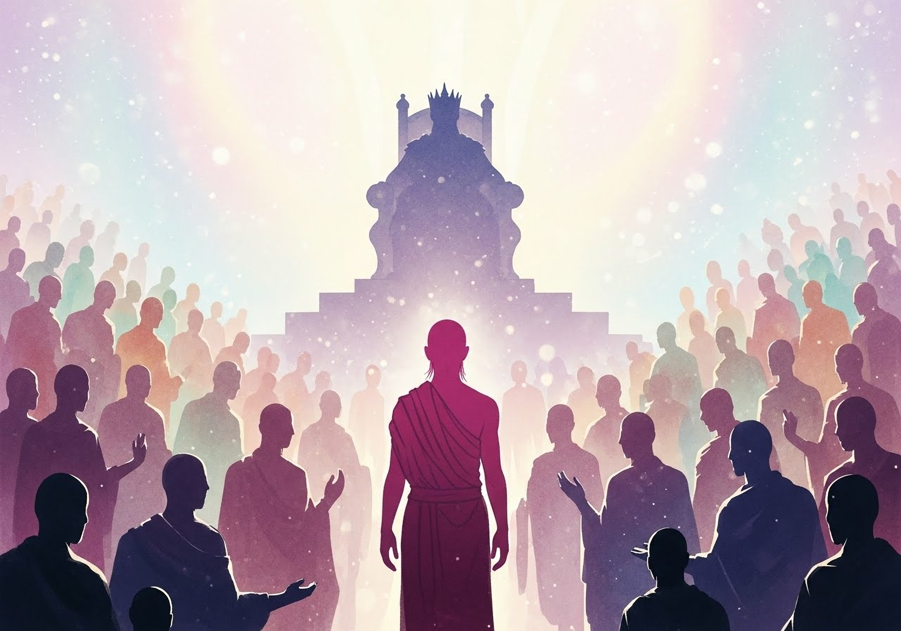
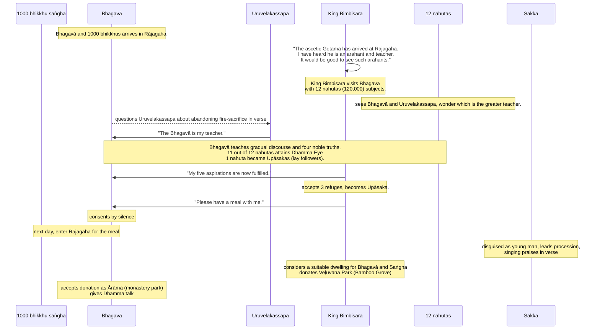

Original text: [World Tipitaka Edition](https://tipitaka2500.github.io/tipitaka/3V/1/1.13.html)

> [!INFO]
> Image generated by Imagen 4.

Pali text (click to view)

(55.)

202\. Atha kho bhagavā gayāsīse yathābhirantaṃ viharitvā yena rājagahaṃ tena cārikaṃ pakkāmi, mahatā bhikkhusaṃghena saddhiṃ bhikkhusahassena sabbeheva purāṇajaṭilehi. Atha kho bhagavā anupubbena cārikaṃ caramāno yena rājagahaṃ tadavasari. Tatra sudaṃ bhagavā rājagahe viharati laṭṭhivane suppatiṭṭhe cetiye. Assosi kho rājā māgadho seniyo bimbisāro—  “samaṇo khalu bho gotamo sakyaputto sakyakulā pabbajito rājagahaṃ anuppatto rājagahe viharati laṭṭhivane suppatiṭṭhe cetiye. Taṃ kho pana bhagavantaṃ gotamaṃ evaṃ kalyāṇo kittisaddo abbhuggato—  itipi so bhagavā arahaṃ sammāsambuddho vijjācaraṇasampanno sugato lokavidū anuttaro purisadammasārathi satthā devamanussānaṃ buddho bhagavā. So imaṃ lokaṃ sadevakaṃ samārakaṃ sabrahmakaṃ sassamaṇabrāhmaṇiṃ pajaṃ sadevamanussaṃ sayaṃ abhiññā sacchikatvā pavedeti. So dhammaṃ deseti ādikalyāṇaṃ majjhekalyāṇaṃ pariyosānakalyāṇaṃ sātthaṃ sabyañjanaṃ kevalaparipuṇṇaṃ parisuddhaṃ brahmacariyaṃ pakāseti. Sādhu kho pana tathārūpānaṃ arahataṃ dassanaṃ hotī”ti.

203\. Atha kho rājā māgadho seniyo bimbisāro dvādasanahutehi māgadhikehi brāhmaṇagahapatikehi parivuto yena bhagavā tenupasaṅkami, upasaṅkamitvā bhagavantaṃ abhivādetvā ekamantaṃ nisīdi. Tepi kho dvādasanahutā māgadhikā brāhmaṇagahapatikā appekacce bhagavantaṃ abhivādetvā ekamantaṃ nisīdiṃsu, appekacce bhagavatā saddhiṃ sammodiṃsu, sammodanīyaṃ kathaṃ sāraṇīyaṃ vītisāretvā ekamantaṃ nisīdiṃsu, appekacce yena bhagavā tenañjaliṃ paṇāmetvā ekamantaṃ nisīdiṃsu, appekacce bhagavato santike nāmagottaṃ sāvetvā ekamantaṃ nisīdiṃsu, appekacce tuṇhībhūtā ekamantaṃ nisīdiṃsu. Atha kho tesaṃ dvādasanahutānaṃ māgadhikānaṃ brāhmaṇagahapatikānaṃ etadahosi—  “kiṃ nu kho mahāsamaṇo uruvelakassape brahmacariyaṃ carati, udāhu uruvelakassapo mahāsamaṇe brahmacariyaṃ caratī”ti? Atha kho bhagavā tesaṃ dvādasanahutānaṃ māgadhikānaṃ brāhmaṇagahapatikānaṃ cetasā cetoparivitakkamaññāya āyasmantaṃ uruvelakassapaṃ gāthāya ajjhabhāsi—

204\. _“Kimeva disvā uruvelavāsi,_  
_Pahāsi aggiṃ kisakovadāno;_  
_Pucchāmi taṃ kassapa etamatthaṃ,_  
_Kathaṃ pahīnaṃ tava aggihuttan”ti._  

205\. _“Rūpe ca sadde ca atho rase ca,_  
_Kāmitthiyo cābhivadanti yaññā;_  
_Etaṃ malanti upadhīsu ñatvā,_  
_Tasmā na yiṭṭhe na hute arañjin”ti._  

206\. _“Ettheva te mano na ramittha, __(kassapāti bhagavā)___  
_Rūpesu saddesu atho rasesu;_  
_Atha ko carahi devamanussaloke,_  
_Rato mano kassapa brūhi metan”ti._  

207\. _“Disvā padaṃ santamanūpadhīkaṃ,_  
_Akiñcanaṃ kāmabhave asattaṃ;_  
_Anaññathābhāvimanaññaneyyaṃ,_  
_Tasmā na yiṭṭhe na hute arañjin”ti._  

(56.)

208\. Atha kho āyasmā uruvelakassapo uṭṭhāyāsanā ekaṃsaṃ uttarāsaṅgaṃ karitvā bhagavato pādesu sirasā nipatitvā bhagavantaṃ etadavoca—  “satthā me, bhante, bhagavā, sāvakohamasmi; satthā me, bhante, bhagavā, sāvakohamasmī”ti. Atha kho tesaṃ dvādasanahutānaṃ māgadhikānaṃ brāhmaṇagahapatikānaṃ etadahosi—  “uruvelakassapo mahāsamaṇe brahmacariyaṃ caratī”ti. Atha kho bhagavā tesaṃ dvādasanahutānaṃ māgadhikānaṃ brāhmaṇagahapatikānaṃ cetasā cetoparivitakkamaññāya anupubbiṃ kathaṃ kathesi, seyyathidaṃ—  dānakathaṃ sīlakathaṃ saggakathaṃ kāmānaṃ ādīnavaṃ okāraṃ saṃkilesaṃ nekkhamme ānisaṃsaṃ pakāsesi. Yadā te bhagavā aññāsi kallacitte muducitte vinīvaraṇacitte udaggacitte pasannacitte, atha yā buddhānaṃ sāmukkaṃsikā dhammadesanā, taṃ pakāsesi—  dukkhaṃ, samudayaṃ, nirodhaṃ, maggaṃ. Seyyathāpi nāma suddhaṃ vatthaṃ apagatakāḷakaṃ sammadeva rajanaṃ paṭiggaṇheyya; evameva ekādasanahutānaṃ māgadhikānaṃ brāhmaṇagahapatikānaṃ bimbisārappamukhānaṃ tasmiṃyeva āsane virajaṃ vītamalaṃ dhammacakkhuṃ udapādi—  “yaṃ kiñci samudayadhammaṃ sabbaṃ taṃ nirodhadhamman”ti. Ekanahutaṃ upāsakattaṃ paṭivedesi.

(57.)

209\. Atha kho rājā māgadho seniyo bimbisāro diṭṭhadhammo pattadhammo viditadhammo pariyogāḷhadhammo tiṇṇavicikiccho vigatakathaṃkatho vesārajjappatto aparappaccayo satthusāsane bhagavantaṃ etadavoca—  “pubbe me, bhante, kumārassa sato pañca assāsakā ahesuṃ, te me etarahi samiddhā. Pubbe me, bhante, kumārassa sato etadahosi—  ‘aho vata maṃ rajje abhisiñceyyun’ti, ayaṃ kho me, bhante, paṭhamo assāsako ahosi, so me etarahi samiddho. ‘Tassa ca me vijitaṃ arahaṃ sammāsambuddho okkameyyā’ti, ayaṃ kho me, bhante, dutiyo assāsako ahosi, so me etarahi samiddho. ‘Tañcāhaṃ bhagavantaṃ payirupāseyyan’ti, ayaṃ kho me, bhante, tatiyo assāsako ahosi, so me etarahi samiddho. ‘So ca me bhagavā dhammaṃ deseyyā’ti, ayaṃ kho me, bhante, catuttho assāsako ahosi, so me etarahi samiddho. ‘Tassa cāhaṃ bhagavato dhammaṃ ājāneyyan’ti, ayaṃ kho me, bhante, pañcamo assāsako ahosi, so me etarahi samiddho. Pubbe me, bhante, kumārassa sato ime pañca assāsakā ahesuṃ, te me etarahi samiddhā. Abhikkantaṃ, bhante, abhikkantaṃ, bhante. Seyyathāpi, bhante, nikkujjitaṃ vā ukkujjeyya, paṭicchannaṃ vā vivareyya, mūḷhassa vā maggaṃ ācikkheyya, andhakāre vā telapajjotaṃ dhāreyya—  ‘cakkhumanto rūpāni dakkhantī’ti; evamevaṃ bhagavatā anekapariyāyena dhammo pakāsito. Esāhaṃ, bhante, bhagavantaṃ saraṇaṃ gacchāmi, dhammañca, bhikkhusaṃghañca. Upāsakaṃ maṃ, bhagavā dhāretu ajjatagge pāṇupetaṃ saraṇaṃ gataṃ, adhivāsetu ca me, bhante, bhagavā, svātanāya bhattaṃ saddhiṃ bhikkhusaṃghenā”ti. Adhivāsesi bhagavā tuṇhībhāvena. Atha kho rājā māgadho seniyo bimbisāro bhagavato adhivāsanaṃ viditvā uṭṭhāyāsanā bhagavantaṃ abhivādetvā padakkhiṇaṃ katvā pakkāmi. Atha kho rājā māgadho seniyo bimbisāro tassā rattiyā accayena paṇītaṃ khādanīyaṃ bhojanīyaṃ paṭiyādāpetvā bhagavato kālaṃ ārocāpesi—  “kālo, bhante, niṭṭhitaṃ bhattan”ti.

(58.)

210\. Atha kho bhagavā pubbaṇhasamayaṃ nivāsetvā pattacīvaramādāya rājagahaṃ pāvisi mahatā bhikkhusaṃghena saddhiṃ bhikkhusahassena sabbeheva purāṇajaṭilehi. Tena kho pana samayena sakko devānamindo māṇavakavaṇṇaṃ abhinimminitvā buddhappamukhassa bhikkhusaṃghassa purato purato gacchati imā gāthāyo gāyamāno—

211\. _“Danto dantehi saha purāṇajaṭilehi,_  
_Vippamutto vippamuttehi;_  
_Siṅgīnikkhasavaṇṇo,_  
_Rājagahaṃ pāvisi bhagavā._  

212\. _Mutto muttehi saha purāṇajaṭilehi,_  
_Vippamutto vippamuttehi;_  
_Siṅgīnikkhasavaṇṇo,_  
_Rājagahaṃ pāvisi bhagavā._  

213\. _Tiṇṇo tiṇṇehi saha purāṇajaṭilehi,_  
_Vippamutto vippamuttehi;_  
_Siṅgīnikkhasavaṇṇo,_  
_Rājagahaṃ pāvisi bhagavā._  

214\. _Santo santehi saha purāṇajaṭilehi,_  
_Vippamutto vippamuttehi;_  
_Siṅgīnikkhasavaṇṇo,_  
_Rājagahaṃ pāvisi bhagavā._  

215\. _Dasavāso dasabalo,_  
_Dasadhammavidū dasabhi cupeto;_  
_So dasasataparivāro,_  
_Rājagahaṃ pāvisi bhagavā”ti._  

216\. Manussā sakkaṃ devānamindaṃ passitvā evamāhaṃsu—  “abhirūpo vatāyaṃ māṇavako, dassanīyo vatāyaṃ māṇavako, pāsādiko vatāyaṃ māṇavako. Kassa nu kho ayaṃ māṇavako”ti? Evaṃ vutte, sakko devānamindo te manusse gāthāya ajjhabhāsi—

217\. _“Yo dhīro sabbadhi danto,_  
_suddho appaṭipuggalo;_  
_Arahaṃ sugato loke,_  
_tassāhaṃ paricārako”ti._  

(59.)

218\. Atha kho bhagavā yena rañño māgadhassa seniyassa bimbisārassa nivesanaṃ tenupasaṅkami, upasaṅkamitvā paññatte āsane nisīdi saddhiṃ bhikkhusaṃghena. Atha kho rājā māgadho seniyo bimbisāro buddhappamukhaṃ bhikkhusaṃghaṃ paṇītena khādanīyena bhojanīyena sahatthā santappetvā sampavāretvā bhagavantaṃ bhuttāviṃ onītapattapāṇiṃ ekamantaṃ nisīdi. Ekamantaṃ nisinnassa kho rañño māgadhassa seniyassa bimbisārassa etadahosi—  “kattha nu kho bhagavā vihareyya? Yaṃ assa gāmato neva atidūre na accāsanne, gamanāgamanasampannaṃ, atthikānaṃ atthikānaṃ manussānaṃ abhikkamanīyaṃ, divā appākiṇṇaṃ, rattiṃ appasaddaṃ appanigghosaṃ vijanavātaṃ, manussarāhasseyyakaṃ, paṭisallānasāruppan”ti. Atha kho rañño māgadhassa seniyassa bimbisārassa etadahosi—  “idaṃ kho amhākaṃ veḷuvanaṃ uyyānaṃ gāmato neva atidūre na accāsanne gamanāgamanasampannaṃ atthikānaṃ atthikānaṃ manussānaṃ abhikkamanīyaṃ divā appākiṇṇaṃ rattiṃ appasaddaṃ appanigghosaṃ vijanavātaṃ manussarāhasseyyakaṃ paṭisallānasāruppaṃ. Yannūnāhaṃ veḷuvanaṃ uyyānaṃ buddhappamukhassa bhikkhusaṃghassa dadeyyan”ti. Atha kho rājā māgadho seniyo bimbisāro sovaṇṇamayaṃ bhiṅkāraṃ gahetvā bhagavato oṇojesi—  “etāhaṃ, bhante, veḷuvanaṃ uyyānaṃ buddhappamukhassa bhikkhusaṃghassa dammī”ti. Paṭiggahesi bhagavā ārāmaṃ. Atha kho bhagavā rājānaṃ māgadhaṃ seniyaṃ bimbisāraṃ dhammiyā kathāya sandassetvā samādapetvā samuttejetvā sampahaṃsetvā uṭṭhāyāsanā pakkāmi. Atha kho bhagavā etasmiṃ nidāne etasmiṃ pakaraṇe dhammiṃ kathaṃ katvā bhikkhū āmantesi—  “anujānāmi, bhikkhave, ārāman”ti.

---

219\. Bimbisārasamāgamakathā niṭṭhitā.

## Summary

The Bhagavā, accompanied by a thousand converted matted-hair ascetics, arrived in Rājagaha, where his renowned virtues attracted King Seniya Bimbisāra and a large assembly. To clarify his supreme spiritual authority, the Buddha elicited a public declaration of discipleship from Uruvelakassapa, a prominent ascetic. Following this, the Buddha delivered a Dhamma discourse, leading King Bimbisāra and many others to attain the Dhamma-eye". The deeply moved king, whose long-held aspirations were now fulfilled, took refuge in the Triple Gem, invited the Buddha for a meal, and subsequently donated the Veḷuvana (Bamboo Grove) park, which the Buddha accepted, thereby establishing the first monastery and allowing the Saṅgha to accept such offerings.

## Diagram

## Text

(55.)

202. Then the Bhagavā, having dwelt at Gayāsīsa as long as he pleased, set out on a journey towards Rājagaha with a great Saṅgha of bhikkhus, with a thousand bhikkhus, all of whom were former matted-hair ascetics. Then the Bhagavā, journeying by stages, arrived at Rājagaha. There the Bhagavā dwelt in Rājagaha, at the Suppatiṭṭha cetiya in the Laṭṭhivana (Palm Grove). King Seniya Bimbisāra of Magadha heard: “Indeed, friends, the recluse Gotama, the son of the Sakyans, who went forth from the Sakyan clan, has arrived in Rājagaha and is dwelling in Rājagaha at the Suppatiṭṭha cetiya in the Laṭṭhivana. And this good report concerning the Bhagavā Gotama has spread: ‘Such indeed is the Bhagavā: an arahaṃ (worthy one), sammāsambuddho (fully self-awakened), vijjācaraṇasampanno (perfect in knowledge and conduct), sugato (well-gone), lokavidū (knower of the world), anuttaro purisadammasārathi (unexcelled trainer of persons to be tamed), satthā devamanussānaṃ (teacher of gods and humans), buddho (awakened), bhagavā (blessed one).’ He, having realized it himself through direct knowledge, makes known this world with its devas, its Māra, and its Brahmā, this generation with its recluses and brahmins, its devas and humans. He teaches the Dhamma (doctrine) that is good in the beginning, good in the middle, and good in the end, with its meaning and phrasing; he proclaims the holy life, utterly complete and pure. Indeed, it is good to see such arahants.”

203. Then King Seniya Bimbisāra of Magadha, surrounded by twelve nahutas of Magadhan brahmins and householders, approached the Bhagavā. Having approached, he paid homage to the Bhagavā and sat down to one side. Those twelve nahutas of Magadhan brahmins and householders—some paid homage to the Bhagavā and sat down to one side; some exchanged greetings with the Bhagavā, and after exchanging friendly and courteous talk, sat down to one side; some raised their joined hands in salutation towards the Bhagavā and sat down to one side; some announced their name and clan in the Bhagavā’s presence and sat down to one side; some, remaining silent, sat down to one side. Then this thought occurred to those twelve nahutas of Magadhan brahmins and householders: “Does the great recluse live the holy life under Uruvelakassapa, or does Uruvelakassapa live the holy life under the great recluse?” Then the Bhagavā, knowing with his own mind the thought in the minds of those twelve nahutas of Magadhan brahmins and householders, addressed the venerable Uruvelakassapa in verse:

204\. _“Seeing what, O dweller in Uruvelā,_
_Renouncer of the fire, you who were lean from austerities;_
_I ask you this, Kassapa,_
_How was your fire-sacrifice abandoned?”_

205\. _“Forms and sounds and also tastes,_
_And sensual pleasures with women, sacrifices proclaim;_
_Knowing this to be a stain in the upadhis (substrates of existence),_
_Therefore, I delighted not in offerings nor in sacrifices.”_

206\. _“If your mind did not delight right there, (said the Bhagavā to Kassapa)_
_In forms, in sounds, and also in tastes;_
_Then in what, Kassapa, in the world of gods and humans,_
_Does your mind now delight? Tell me this.”_

207\. _“Having seen the state of peace, without upadhi (substrate),_
_The state of nothingness, unattached to sensual existence;_
_Unalterable, not to be led otherwise,_
_Therefore, I delighted not in offerings nor in sacrifices.”_

(56.)

208. Then the venerable Uruvelakassapa, rising from his seat, arranging his upper robe over one shoulder, fell with his head at the Bhagavā’s feet and said to the Bhagavā: “Bhante, the Bhagavā is my teacher, I am a disciple; Bhante, the Bhagavā is my teacher, I am a disciple.” Then this thought occurred to those twelve nahutas of Magadhan brahmins and householders: “Uruvelakassapa lives the holy life under the great recluse.” Then the Bhagavā, knowing with his own mind the thought in the minds of those twelve nahutas of Magadhan brahmins and householders, gave a gradual discourse, that is to say: talk on dāna (giving), talk on sīla (morality), talk on sagga (heaven); he explained the ādīnava (danger), okāra (degradation), and saṃkilesa (defilement) of kāmā (sensual pleasures), and the ānisaṃsa (benefit) of nekkhamma (renunciation). When the Bhagavā knew that their minds were ready, supple, free from nīvaraṇa (hindrances), uplifted, and confident, he then proclaimed that Dhamma teaching which is unique to the Buddhas: dukkhaṃ (suffering), samudayaṃ (its origin), nirodhaṃ (its cessation), maggaṃ (the path). Just as a clean cloth, free of stains, would rightly receive dye, even so, to eleven nahutas of Magadhan brahmins and householders, with Bimbisāra at their head, while seated on that very seat, the dust-free, stainless dhammacakkhu (eye of Dhamma) arose: “Whatever is subject to origination is all subject to cessation.” One nahuta declared themselves upāsakas (lay followers).

(57.)

209. Then King Seniya Bimbisāra of Magadha, who had seen the Dhamma, attained the Dhamma, understood the Dhamma, fathomed the Dhamma, overcome doubt, dispelled uncertainty, gained full confidence, and become independent of others in the Teacher's Sāsana (dispensation), said this to the Bhagavā: “Bhante, formerly, when I was a prince, I had five aspirations, and these have now been fulfilled for me. Formerly, Bhante, when I was a prince, this thought occurred to me: ‘Oh, may I be anointed to kingship!’ This, Bhante, was my first aspiration, and it has now been fulfilled for me. ‘And may an arahaṃ, a sammāsambuddho, come to my kingdom!’ This, Bhante, was my second aspiration, and it has now been fulfilled for me. ‘And may I attend upon that Bhagavā!’ This, Bhante, was my third aspiration, and it has now been fulfilled for me. ‘And may that Bhagavā teach me the Dhamma!’ This, Bhante, was my fourth aspiration, and it has now been fulfilled for me. ‘And may I understand the Dhamma of that Bhagavā!’ This, Bhante, was my fifth aspiration, and it has now been fulfilled for me. Bhante, formerly, when I was a prince, I had these five aspirations, and they have now been fulfilled for me. Excellent, Bhante! Excellent, Bhante! Just as, Bhante, one might set upright what has been overturned, or reveal what is hidden, or show the way to one who is lost, or hold up an oil lamp in the darkness so that those with eyes might see forms; even so, the Dhamma has been made clear by the Bhagavā in many ways. I, Bhante, go for saraṇa (refuge) to the Bhagavā, to the Dhamma, and to the Bhikkhusaṅgha. May the Bhagavā remember me as an upāsaka (lay follower) who has gone for refuge for life, from this day forth. And, Bhante, may the Bhagavā consent to accept a meal from me tomorrow, together with the Bhikkhusaṅgha.” The Bhagavā consented by remaining silent. Then King Seniya Bimbisāra of Magadha, having understood the Bhagavā’s consent, rose from his seat, paid homage to the Bhagavā, circumambulated him keeping his right side towards him, and departed. Then King Seniya Bimbisāra of Magadha, after that night had passed, had exquisite hard and soft food prepared, and had the time announced to the Bhagavā: “Bhante, it is time; the meal is ready.”

(58.)

210. Then the Bhagavā, having dressed in the morning, taking his bowl and robe, entered Rājagaha with a great Saṅgha of bhikkhus, with a thousand bhikkhus, all of whom were former matted-hair ascetics. Now at that time, Sakka, lord of the devas, having created the appearance of a young man, walked in front of the Bhikkhusaṅgha headed by the Buddha, singing these verses:

211\. _“Tamed, with the tamed former matted-hair ascetics,_
_Liberated, with the liberated ones;_
_Like the color of Jambu-river gold,_
_The Bhagavā entered Rājagaha._

212\. _Freed, with the freed former matted-hair ascetics,_
_Liberated, with the liberated ones;_
_Like the color of Jambu-river gold,_
_The Bhagavā entered Rājagaha._

213\. _Crossed over, with the crossed-over former matted-hair ascetics,_
_Liberated, with the liberated ones;_
_Like the color of Jambu-river gold,_
_The Bhagavā entered Rājagaha._

214\. _Peaceful, with the peaceful former matted-hair ascetics,_
_Liberated, with the liberated ones;_
_Like the color of Jambu-river gold,_
_The Bhagavā entered Rājagaha._

215\. _Dweller in the ten, possessor of the ten powers,_
_Knower of the ten dhammas, endowed with the ten;_
_He, with a retinue of a thousand,_
_The Bhagavā entered Rājagaha.”_

216. People, seeing Sakka, lord of the devas, said this: “Indeed, this young man is handsome! Indeed, this young man is fair to see! Indeed, this young man is inspiring! Whose young man is he?” When this was said, Sakka, lord of the devas, addressed those people in verse:

217\. _“He who is wise, everywhere tamed,_
_Pure, without an equal;_
_An arahaṃ, a sugato in the world,_
_I am his attendant.”_

(59.)

218. Then the Bhagavā approached the residence of King Seniya Bimbisāra of Magadha. Having approached, he sat down on the prepared seat together with the Bhikkhusaṅgha. Then King Seniya Bimbisāra of Magadha, with his own hands, satisfied and served the Bhikkhusaṅgha headed by the Buddha with exquisite hard and soft food. When the Bhagavā had finished eating and had withdrawn his hand from the bowl, the king sat down to one side. As King Seniya Bimbisāra of Magadha sat to one side, this thought occurred to him: “Where now might the Bhagavā dwell? A place that would be neither too far from a village nor too near, suitable for coming and going, accessible to people who wish to visit, not crowded by day, with little sound and little noise by night, with undisturbed air, secluded from people, suitable for paṭisallāna (seclusion/meditation)?” Then this thought occurred to King Seniya Bimbisāra of Magadha: “This Veḷuvana (Bamboo Grove) park of ours is neither too far from a village nor too near, suitable for coming and going, accessible to people who wish to visit, not crowded by day, with little sound and little noise by night, with undisturbed air, secluded from people, suitable for paṭisallāna (seclusion/meditation). What if I were to give the Veḷuvana park to the Bhikkhusaṅgha headed by the Buddha?” Then King Seniya Bimbisāra of Magadha, taking a golden water-pitcher, dedicated it to the Bhagavā, saying: “Bhante, I give this Veḷuvana park to the Bhikkhusaṅgha headed by the Buddha.” The Bhagavā accepted the ārāma (monastery park). Then the Bhagavā, having instructed, roused, inspired, and gladdened King Seniya Bimbisāra of Magadha with a Dhamma talk, rose from his seat and departed. Then the Bhagavā, on this occasion, in this connection, having given a Dhamma talk, addressed the bhikkhus: “Bhikkhave, I consent to an ārāma (monastery park).”

---

219. The account of the meeting with Bimbisāra is finished.

## Commentary

This narrative is notable in introducing King Bimbisāra, who will be one of the Buddha's primary benefactors. The gaining of royal support turns out to be a pivotal moment in establishing Buddhism as a dominant religion in Magadha, which the Buddha would probably not have achieved if he had not converted the Kassapa brothers and the 1000 dreadlocked ascetics earlier. Now we understand why the Buddha was willing to perform all the miracles in the previous section - he understood what was at stake.

The narrative depicts the Buddha's arrival in Rājagaha, his reputation already established. King Bimbisāra, a figure of authority, seeks him out, reflecting an interest in understanding the Buddha's distinct approach. The assembly's curiosity about the hierarchical relationship between Gotama (the Buddha) and Uruvelakassapa, a respected ascetic, highlights the social dynamics at play.

Gotama’s questioning of Uruvelakassapa serves to publicly elucidate Kassapa's phenomenological shift: a conscious turning away from the experienced unsatisfactoriness ("stain") inherent in sensory engagements and ritualistic practices ("fire-sacrifice," "forms and sounds and also tastes, and sensual pleasures"). Kassapa articulates his new focus on an internal state described as "peace, without upadhi (substrate), the state of nothingness, unattached to sensual existence," a subjective experience of profound tranquility and detachment achieved through a re-evaluation of what constitutes genuine well-being. This public declaration by Kassapa, affirming Gotama as his guide, resolves the crowd's uncertainty through direct testimony of a transformed experiential state.

Gotama then tailors his discourse to the assembly's receptive state, leading to a cognitive restructuring for many, including Bimbisāra. The arising of the "dust-free, stainless dhammacakkhu" signifies a direct, unmediated insight into the fundamental characteristic of experienced reality: "Whatever is subject to origination is all subject to cessation."

Bimbisāra’s subsequent actions — expressing the fulfillment of his personal aspirations through understanding Gotama’s teaching, and the practical donation of the Veḷuvana park — are logical outcomes of this cognitive and affective shift. The park is chosen based on rational criteria for a contemplative environment. The appearance of "Sakka" can be understood as a symbolic narrative device emphasising the perceived extraordinary impact and purity of Gotama and his followers, reflecting the profound awe and positive affect they inspired in observers, rather than a literal divine intervention.

[Go to previous page (1.12 Uruvelapāṭihāriyakathā)](1.12.md) / [Go to parent page (1 Mahākhandhaka)](../Khandhaka) / [Go to next page (1.14 Sāriputtamoggallānapabbajjākathā)](1.14.md)

