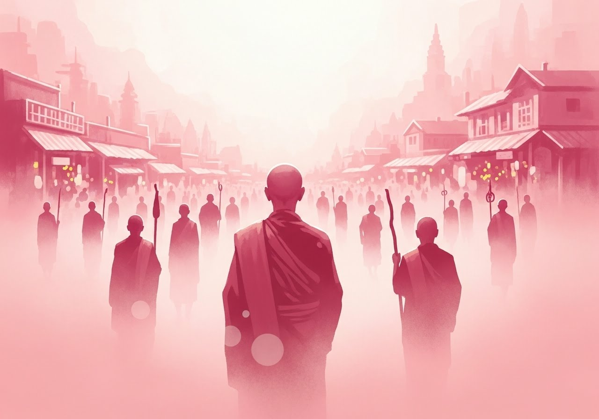
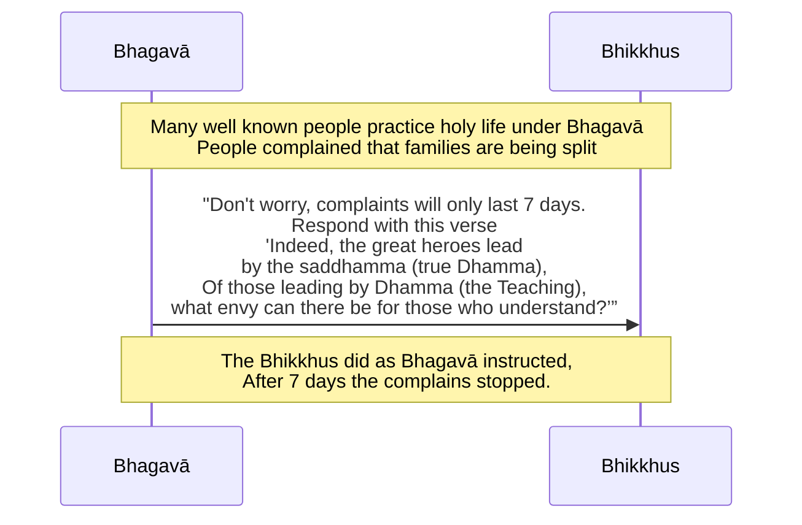

Original text: [World Tipitaka Edition](https://tipitaka2500.github.io/tipitaka/3V/1/1.14/1.14.1.html)

> [!INFO]
> Image generated by Imagen 4, representing the Buddha's success in converting many distinguished followers, which causes fear amongst the general population.

Pali text (click to view)

(63.)

239\. Tena kho pana samayena abhiññātā abhiññātā māgadhikā kulaputtā bhagavati brahmacariyaṃ caranti. Manussā ujjhāyanti khiyyanti vipācenti—  “aputtakatāya paṭipanno samaṇo gotamo, vedhabyāya paṭipanno samaṇo gotamo, kulupacchedāya paṭipanno samaṇo gotamo, idāni anena jaṭilasahassaṃ pabbājitaṃ, imāni ca aḍḍhateyyāni paribbājakasatāni sañcayāni pabbājitāni. Ime ca abhiññātā abhiññātā māgadhikā kulaputtā samaṇe gotame brahmacariyaṃ carantī”ti. Apissu bhikkhū disvā imāya gāthāya codenti—

240\. _“Āgato kho mahāsamaṇo,_  \
_māgadhānaṃ giribbajaṃ;_  \
_Sabbe sañcaye netvāna,_  \
_kaṃsu dāni nayissatī”ti._  

241\. Assosuṃ kho bhikkhū tesaṃ manussānaṃ ujjhāyantānaṃ khiyyantānaṃ vipācentānaṃ. Atha kho te bhikkhū bhagavato etamatthaṃ ārocesuṃ…pe…  “na, bhikkhave, so saddo ciraṃ bhavissati, sattāhameva bhavissati, sattāhassa accayena antaradhāyissati. Tena hi, bhikkhave, ye tumhe imāya gāthāya codenti—

242\. _‘Āgato kho mahāsamaṇo,_  \
_māgadhānaṃ giribbajaṃ;_  \
_Sabbe sañcaye netvāna,_  \
_kaṃsu dāni nayissatī’ti._  

243\. Te tumhe imāya gāthāya paṭicodetha—

244\. _‘Nayanti ve mahāvīrā,_  \
_saddhammena tathāgatā;_  \
_Dhammena nayamānānaṃ,_  \
_kā usūyā vijānatan’”ti._  

245\. Tena kho pana samayena manussā bhikkhū disvā imāya gāthāya codenti—

246\. _“Āgato kho mahāsamaṇo,_  \
_māgadhānaṃ giribbajaṃ;_  \
_Sabbe sañcaye netvāna,_  \
_kaṃsu dāni nayissatī”ti._  

247\. Bhikkhū te manusse imāya gāthāya paṭicodenti—

248\. _“Nayanti ve mahāvīrā,_  \
_saddhammena tathāgatā;_  \
_Dhammena nayamānānaṃ,_  \
_kā usūyā vijānatan”ti._  

249\. Manussā dhammena kira samaṇā sakyaputtiyā nenti no adhammenāti sattāhameva so saddo ahosi, sattāhassa accayena antaradhāyi.

---

250\. Sāriputtamoggallānapabbajjākathā niṭṭhitā.

  
Catutthabhāṇavāro niṭṭhito.

## Summary

The Bhagavā's success in attracting distinguished Magadhan young men and former followers of Sañjaya (like Sāriputta and Moggallāna) to the holy life sparked public criticism, with people accusing him of making individuals childless, women widows, and breaking up families, even taunting his bhikkhus with a verse. The Bhagavā predicted this outcry would only last seven days and instructed his bhikkhus to respond with a counter-verse emphasizing that Tathāgatas lead by the true Dhamma, which should not cause envy in those who understand. When the bhikkhus used this response, public opinion shifted to acknowledge that the Sakyaputtiya ascetics led by Dhamma, and the complaints ceased within the predicted timeframe.

## Diagram

## Text

(63.)

239\. At that time, well-known, distinguished Magadhan young men of good family were practicing the `brahmacariya`(disciplined life) under the Bhagavā. People complained, grumbled, and spread it about — “The ascetic Gotama is practicing to make people childless, the ascetic Gotama is practicing to make women widows, the ascetic Gotama is practicing for the cutting off of families. Now by him a thousand matted-hair ascetics have been given the `pabbajjā` (going forth), and these two hundred and fifty wanderers of Sañjaya's group have been given the `pabbajjā` (going forth). And these well-known, distinguished Magadhan young men of good family are practicing the `brahmacariya` (disciplined life) under the ascetic Gotama.” Moreover, seeing the bhikkhus, they reproached them with this verse —

240\. _“The great ascetic has indeed come,_ \
_to Giribbaja of the Magadhans;_ \
_Having led away all of Sañjaya's (followers),_ \
_whom now will he lead away?”_  

241\. The bhikkhus heard those people complaining, grumbling, and spreading it about. Then those bhikkhus reported this matter to the Bhagavā … and so on … “No, bhikkhave, that sound will not last long; it will last only seven days. After seven days it will disappear. Therefore, bhikkhave, those who reproach you with this verse—

242\. _‘The great ascetic has indeed come,_  \
_to Giribbaja of the Magadhans;_  \
_Having led away all of Sañjaya's (followers),_  \
_whom now will he lead away?’_  

243\. You should reproach them in return with this verse—

244\. _‘Indeed, the great heroes lead,_  \
_Tathāgatas, by the `saddhamma` (true Dhamma);_  \
_Of those leading by `Dhamma` (the Teaching),_  \
_what envy can there be for those who understand?’”_  

245\. At that time, people, seeing the bhikkhus, reproached them with this verse—

246\. _“The great ascetic has indeed come,_  \
_to Giribbaja of the Magadhans;_  \
_Having led away all of Sañjaya's (followers),_  \
_whom now will he lead away?”_  

247\. The bhikkhus reproached those people in return with this verse—

248\. _“Indeed, the great heroes lead,_  \
_Tathāgatas, by the `saddhamma` (true Dhamma);_  \
_Of those leading by `Dhamma` (the Teaching),_  \
_what envy can there be for those who understand?”_  

249\. People (thought/said): "Indeed, the Sakyaputtiya ascetics lead by `Dhamma` (the Teaching), not by non-Dhamma." That sound lasted only seven days; after seven days it disappeared.

---

250\. The story of the `pabbajjā` (going forth) of Sāriputta and Moggallāna is finished.

  
The fourth recitation section is finished.

## Commentary

This narrative is important in highlighting that the rapid rise of Buddhism was not always favourably received. The public's anxiety — fearing childlessness, widowhood, and the dissolution of families — stems from the disruption caused by many well-known individuals choosing the `brahmacariya` (disciplined life). The taunting verse reflects the community's perception of Gotama as an external force actively altering their social fabric by "leading away" its members.

Gotama's strategy involves a reframing. He predicts the transient nature of the outcry. The counter-verse repositions the "leading" not as arbitrary enticement, but as guidance by "Dhamma" — a coherent soteriological system of principles and practices. For those who grasp this system ("those who understand"), the choice to follow is rational, and should be envied rather than a cause for distress. The resolution, where the public acknowledges the ascetics "lead by Dhamma," signifies a shift in the their understanding.

[Go to previous page (14. Sāriputtamoggallānapabbajjākathā)](./1.14.md) / [Go to parent page (Khandhaka)](../Khandhaka)

