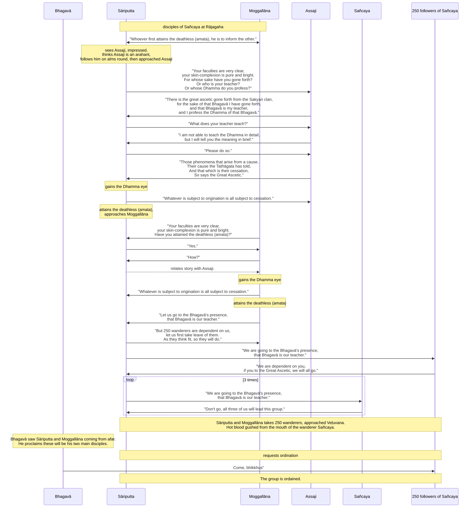

Original text: [World Tipitaka Edition](https://tipitaka2500.github.io/tipitaka/3V/1/1.14.html)

> [!INFO]
> Image generated by Imagen 4, representing the Buddha meeting his two key disciples, Sāriputta and Moggallāna.

Pali text (click to view)

(60.)

220\. Tena kho pana samayena sañcayo paribbājako rājagahe paṭivasati mahatiyā paribbājakaparisāya saddhiṃ aḍḍhateyyehi paribbājakasatehi. Tena kho pana samayena sāriputtamoggallānā sañcaye paribbājake brahmacariyaṃ caranti. Tehi katikā katā hoti—  “yo paṭhamaṃ amataṃ adhigacchati, so itarassa ārocetū”ti.

* Mahākhandhaka

* Sāriputtamoggallānapabbajjākathā

221\. Atha kho āyasmā assaji pubbaṇhasamayaṃ nivāsetvā pattacīvaramādāya rājagahaṃ piṇḍāya pāvisi pāsādikena abhikkantena paṭikkantena ālokitena vilokitena samiñjitena pasāritena, okkhittacakkhu iriyāpathasampanno. Addasā kho sāriputto paribbājako āyasmantaṃ assajiṃ rājagahe piṇḍāya carantaṃ pāsādikena abhikkantena paṭikkantena ālokitena vilokitena samiñjitena pasāritena okkhittacakkhuṃ iriyāpathasampannaṃ. Disvānassa etadahosi—  “ye vata loke arahanto vā arahattamaggaṃ vā samāpannā, ayaṃ tesaṃ bhikkhu aññataro. Yannūnāhaṃ imaṃ bhikkhuṃ upasaṅkamitvā puccheyyaṃ—  ‘kaṃsi tvaṃ, āvuso, uddissa pabbajito, ko vā te satthā, kassa vā tvaṃ dhammaṃ rocesī’”ti? Atha kho sāriputtassa paribbājakassa etadahosi—  “akālo kho imaṃ bhikkhuṃ pucchituṃ, antaragharaṃ paviṭṭho piṇḍāya carati. Yannūnāhaṃ imaṃ bhikkhuṃ piṭṭhito piṭṭhito anubandheyyaṃ, atthikehi upaññātaṃ maggan”ti. Atha kho āyasmā assaji rājagahe piṇḍāya caritvā piṇḍapātaṃ ādāya paṭikkami. Atha kho sāriputtopi paribbājako yenāyasmā assaji tenupasaṅkami, upasaṅkamitvā āyasmatā assajinā saddhiṃ sammodi, sammodanīyaṃ kathaṃ sāraṇīyaṃ vītisāretvā ekamantaṃ aṭṭhāsi. Ekamantaṃ ṭhito kho sāriputto paribbājako āyasmantaṃ assajiṃ etadavoca—  “vippasannāni kho te, āvuso, indriyāni, parisuddho chavivaṇṇo pariyodāto. Kaṃsi tvaṃ, āvuso, uddissa pabbajito, ko vā te satthā, kassa vā tvaṃ dhammaṃ rocesī”ti? “Atthāvuso, mahāsamaṇo sakyaputto sakyakulā pabbajito, tāhaṃ bhagavantaṃ uddissa pabbajito, so ca me bhagavā satthā, tassa cāhaṃ bhagavato dhammaṃ rocemī”ti. “Kiṃvādī panāyasmato satthā, kimakkhāyī”ti? “Ahaṃ kho, āvuso, navo acirapabbajito, adhunāgato imaṃ dhammavinayaṃ, na tāhaṃ sakkomi vitthārena dhammaṃ desetuṃ, api ca te saṃkhittena atthaṃ vakkhāmī”ti. Atha kho sāriputto paribbājako āyasmantaṃ assajiṃ etadavoca—  “hotu, āvuso—

222\. _Appaṃ vā bahuṃ vā bhāsassu,_  \
_Atthaṃyeva me brūhi;_  \
_Attheneva me attho,_  \
_Kiṃ kāhasi byañjanaṃ bahun”ti._  

223\. Atha kho āyasmā assaji sāriputtassa paribbājakassa imaṃ dhammapariyāyaṃ abhāsi—

224\. _“Ye dhammā hetuppabhavā,_  \
_Tesaṃ hetuṃ tathāgato āha;_  \
_Tesañca yo nirodho,_  \
_Evaṃvādī mahāsamaṇo”ti._  

225\. Atha kho sāriputtassa paribbājakassa imaṃ dhammapariyāyaṃ sutvā virajaṃ vītamalaṃ dhammacakkhuṃ udapādi—  “yaṃ kiñci samudayadhammaṃ sabbaṃ taṃ nirodhadhamman”ti.

226\. _“Eseva dhammo yadi tāvadeva,_  \
_Paccabyattha padamasokaṃ;_  \
_Adiṭṭhaṃ abbhatītaṃ,_  \
_Bahukehi kappanahutehī”ti._  

(61.)

227\. Atha kho sāriputto paribbājako yena moggallāno paribbājako tenupasaṅkami. Addasā kho moggallāno paribbājako sāriputtaṃ paribbājakaṃ dūratova āgacchantaṃ, disvāna sāriputtaṃ paribbājakaṃ etadavoca—  “vippasannāni kho te, āvuso, indriyāni, parisuddho chavivaṇṇo pariyodāto. Kacci no tvaṃ, āvuso, amataṃ adhigato”ti? “Āmāvuso, amataṃ adhigato”ti. “Yathākathaṃ pana tvaṃ, āvuso, amataṃ adhigato”ti? “Idhāhaṃ, āvuso, addasaṃ assajiṃ bhikkhuṃ rājagahe piṇḍāya carantaṃ pāsādikena abhikkantena paṭikkantena ālokitena vilokitena samiñjitena pasāritena okkhittacakkhuṃ iriyāpathasampannaṃ. Disvāna me etadahosi—  ‘ye vata loke arahanto vā arahattamaggaṃ vā samāpannā, ayaṃ tesaṃ bhikkhu aññataro. Yannūnāhaṃ imaṃ bhikkhuṃ upasaṅkamitvā puccheyyaṃ—  kaṃsi tvaṃ, āvuso, uddissa pabbajito, ko vā te satthā, kassa vā tvaṃ dhammaṃ rocesī’ti. Tassa mayhaṃ, āvuso, etadahosi—  ‘akālo kho imaṃ bhikkhuṃ pucchituṃ antaragharaṃ paviṭṭho piṇḍāya carati, yannūnāhaṃ imaṃ bhikkhuṃ piṭṭhito piṭṭhito anubandheyyaṃ atthikehi upaññātaṃ maggan’ti. Atha kho, āvuso, assaji bhikkhu rājagahe piṇḍāya caritvā piṇḍapātaṃ ādāya paṭikkami. Atha khvāhaṃ, āvuso, yena assaji bhikkhu tenupasaṅkamiṃ, upasaṅkamitvā assajinā bhikkhunā saddhiṃ sammodiṃ, sammodanīyaṃ kathaṃ sāraṇīyaṃ vītisāretvā ekamantaṃ aṭṭhāsiṃ. Ekamantaṃ ṭhito kho ahaṃ, āvuso, assajiṃ bhikkhuṃ etadavocaṃ—  ‘vippasannāni kho te, āvuso, indriyāni, parisuddho chavivaṇṇo pariyodāto. Kaṃsi tvaṃ, āvuso, uddissa pabbajito, ko vā te satthā, kassa vā tvaṃ dhammaṃ rocesī’ti? ‘Atthāvuso, mahāsamaṇo sakyaputto sakyakulā pabbajito, tāhaṃ bhagavantaṃ uddissa pabbajito, so ca me bhagavā satthā, tassa cāhaṃ bhagavato dhammaṃ rocemī’ti. ‘Kiṃvādī panāyasmato satthā kimakkhāyī’ti. ‘Ahaṃ kho, āvuso, navo acirapabbajito adhunāgato imaṃ dhammavinayaṃ, na tāhaṃ sakkomi vitthārena dhammaṃ desetuṃ, api ca te saṃkhittena atthaṃ vakkhāmī’ti. Atha khvāhaṃ, āvuso, assajiṃ bhikkhuṃ etadavocaṃ—  ‘hotu, āvuso,

228\. _Appaṃ vā bahuṃ vā bhāsassu,_  \
_Atthaṃyeva me brūhi;_  \
_Attheneva me attho,_  \
_Kiṃ kāhasi byañjanaṃ bahun’ti._  

229\. Atha kho, āvuso, assaji bhikkhu imaṃ dhammapariyāyaṃ abhāsi—

230\. _‘Ye dhammā hetuppabhavā,_  \
_Tesaṃ hetuṃ tathāgato āha;_  \
_Tesañca yo nirodho,_  \
_Evaṃvādī mahāsamaṇo’”ti._  

231\. Atha kho moggallānassa paribbājakassa imaṃ dhammapariyāyaṃ sutvā virajaṃ vītamalaṃ dhammacakkhuṃ udapādi—  “yaṃ kiñci samudayadhammaṃ sabbaṃ taṃ nirodhadhammanti.

232\. _Eseva dhammo yadi tāvadeva,_  \
_Paccabyattha padamasokaṃ;_  \
_Adiṭṭhaṃ abbhatītaṃ,_  \
_Bahukehi kappanahutehī”ti._  

(62.)

233\. Atha kho moggallāno paribbājako sāriputtaṃ paribbājakaṃ etadavoca—  “gacchāma mayaṃ, āvuso, bhagavato santike, so no bhagavā satthā”ti. “Imāni kho, āvuso, aḍḍhateyyāni paribbājakasatāni amhe nissāya amhe sampassantā idha viharanti, tepi tāva apalokema. Yathā te maññissanti, tathā te karissantī”ti. Atha kho sāriputtamoggallānā yena te paribbājakā tenupasaṅkamiṃsu, upasaṅkamitvā te paribbājake etadavocuṃ—  “gacchāma mayaṃ, āvuso, bhagavato santike, so no bhagavā satthā”ti. “Mayaṃ āyasmante nissāya āyasmante sampassantā idha viharāma, sace āyasmantā mahāsamaṇe brahmacariyaṃ carissanti, sabbeva mayaṃ mahāsamaṇe brahmacariyaṃ carissāmā”ti.

234\. Atha kho sāriputtamoggallānā yena sañcayo paribbājako tenupasaṅkamiṃsu, upasaṅkamitvā sañcayaṃ paribbājakaṃ etadavocuṃ—  “gacchāma mayaṃ, āvuso, bhagavato santike, so no bhagavā satthā”ti. “Alaṃ, āvuso, mā agamittha, sabbeva tayo imaṃ gaṇaṃ pariharissāmā”ti. Dutiyampi kho…pe…  tatiyampi kho sāriputtamoggallānā sañcayaṃ paribbājakaṃ etadavocuṃ—  “gacchāma mayaṃ, āvuso, bhagavato santike, so no bhagavā satthā”ti. “Alaṃ, āvuso, mā agamittha, sabbeva tayo imaṃ gaṇaṃ pariharissāmā”ti. Atha kho sāriputtamoggallānā tāni aḍḍhateyyāni paribbājakasatāni ādāya yena veḷuvanaṃ tenupasaṅkamiṃsu. Sañcayassa pana paribbājakassa tattheva uṇhaṃ lohitaṃ mukhato uggañchi.

235\. Addasā kho bhagavā sāriputtamoggallāne dūratova āgacchante, disvāna bhikkhū āmantesi—  “ete, bhikkhave, dve sahāyakā āgacchanti, kolito upatisso ca. Etaṃ me sāvakayugaṃ bhavissati aggaṃ bhaddayugan”ti.

236\. _Gambhīre ñāṇavisaye,_  \
_Anuttare upadhisaṅkhaye;_  \
_Vimutte appatte veḷuvanaṃ,_  \
_Atha ne satthā byākāsi._  

237\. _“Ete dve sahāyakā,_  \
_Āgacchanti kolito upatisso ca;_  \
_Etaṃ me sāvakayugaṃ,_  \
_Bhavissati aggaṃ bhaddayugan”ti._  

238\. Atha kho sāriputtamoggallānā yena bhagavā tenupasaṅkamiṃsu, upasaṅkamitvā bhagavato pādesu sirasā nipatitvā bhagavantaṃ etadavocuṃ—  “labheyyāma mayaṃ, bhante, bhagavato santike pabbajjaṃ, labheyyāma upasampadan”ti. “Etha bhikkhavo”ti bhagavā avoca—  “svākkhāto dhammo, caratha brahmacariyaṃ sammā dukkhassa antakiriyāyā”ti. Sāva tesaṃ āyasmantānaṃ upasampadā ahosi.

* [1.14.1 Abhiññātānaṃpabbajjā](1.14.1.md)

## Summary

Sāriputta and Moggallāna, disciples of the wanderer Sañcaya, had agreed to inform each other if one attained the "deathless." Sāriputta, impressed by the venerable Assaji's demeanor, learned from him the core teaching: phenomena arise from a cause, and the Buddha (Tathāgata) teaches their cause and cessation. This insight led both Sāriputta and Moggallāna to attain the insight into the Dhamma. Consequently, they and 250 followers left Sañcaya to join the Buddha, who recognized them as his future chief disciples and ordained them.

## Diagram

## Text

(60.)

220\. Now at that time the wanderer Sañcaya was dwelling in Rājagaha together with a great assembly of wanderers, with two hundred and fifty wanderers. Now at that time Sāriputta and Moggallāna were living the holy life with the wanderer Sañcaya. They had made an agreement: "Whoever first attains the deathless (`amata`), he is to inform the other."

221\. Then the venerable Assaji, having dressed in the morning time, taking his bowl and robe, entered Rājagaha for alms, with graceful going forward, returning, looking ahead, looking aside, bending, stretching, with downcast eyes, possessed of deportment. The wanderer Sāriputta saw the venerable Assaji going for alms in Rājagaha, with graceful going forward, returning, looking ahead, looking aside, bending, stretching, with downcast eyes, possessed of deportment. Having seen him, this occurred to him: "Those in the world who are Arahants or have entered the path to Arahantship, this bhikkhu is one of them. What if I were to approach this bhikkhu and ask: 'For whose sake, `āvuso` (friend), have you gone forth? Or who is your teacher? Or whose Dhamma do you profess?'" Then to the wanderer Sāriputta this occurred: "It is not the time to question this bhikkhu, he has entered among the houses, going for alms. What if I were to follow this bhikkhu from behind, the path pointed out by those in need?" Then the venerable Assaji, having gone for alms in Rājagaha, taking his almsfood, returned. Then the wanderer Sāriputta approached the venerable Assaji; having approached, he exchanged greetings with the venerable Assaji, having exchanged courteous and memorable talk, he stood to one side. Standing to one side, the wanderer Sāriputta said this to the venerable Assaji: "Your faculties, āvuso, are very clear, your skin-complexion is pure and bright. For whose sake, āvuso, have you gone forth? Or who is your teacher? Or whose Dhamma do you profess?" "There is, āvuso, the great ascetic, the Sakyan son, gone forth from the Sakyan clan; for the sake of that Bhagavā I have gone forth, and that Bhagavā is my teacher, and I profess the Dhamma of that Bhagavā." "But what does your teacher teach, venerable sir, what does he declare?" "I, āvuso, am new, not long gone forth, recently come to this Dhamma and Vinaya; I am not able to teach the Dhamma in detail, but I will tell you the meaning in brief." Then the wanderer Sāriputta said this to the venerable Assaji: "Let it be, āvuso —

222\. _Whether little or much you say,_  \
_Tell me just the meaning;_  \
_The meaning is what I need,_  \
_What will you do with much wording?"_  

223\. Then the venerable Assaji spoke this Dhamma exposition to the wanderer Sāriputta —

224\. _"Those phenomena that arise from a cause,_  \
_Their cause the Tathāgata has told;_  \
_And that which is their cessation,_  \
_So says the Great Ascetic."_  

225\. Then to the wanderer Sāriputta, on hearing this Dhamma exposition, there arose the dust-free, stainless insight into the Dhamma (`dhammacakkhu`): "Whatever is subject to origination is all subject to cessation."

226\. _"If this alone is the Dhamma,_  \
_You have thereby reached the sorrowless state;_  \
_Unseen, surpassed,_  \
_For many myriads of aeons."_  

(61.)

227\. Then the wanderer Sāriputta approached the wanderer Moggallāna. The wanderer Moggallāna saw the wanderer Sāriputta coming from afar; having seen him, he said this to the wanderer Sāriputta: "Your faculties, āvuso, are very clear, your skin-complexion is pure and bright. Have you, āvuso, attained the deathless (`amata`)?" "Yes, āvuso, I have attained the deathless (`amata`)." "But how, āvuso, did you attain the deathless (`amata`)?" "Here, āvuso, I saw the bhikkhu Assaji going for alms in Rājagaha, with graceful going forward, returning, looking ahead, looking aside, bending, stretching, with downcast eyes, possessed of deportment. Having seen him, this occurred to me: 'Those in the world who are Arahants or have entered the path to Arahantship, this bhikkhu is one of them. What if I were to approach this bhikkhu and ask: For whose sake, āvuso, have you gone forth? Or who is your teacher? Or whose Dhamma do you profess?' To me, āvuso, this occurred: 'It is not the time to question this bhikkhu, he has entered among the houses, going for alms, what if I were to follow this bhikkhu from behind, the path pointed out by those in need?' Then, āvuso, the bhikkhu Assaji, having gone for alms in Rājagaha, taking his almsfood, returned. Then I, āvuso, approached the bhikkhu Assaji; having approached, I exchanged greetings with the bhikkhu Assaji, having exchanged courteous and memorable talk, I stood to one side. Standing to one side, I, āvuso, said this to the bhikkhu Assaji: 'Your faculties, āvuso, are very clear, your skin-complexion is pure and bright. For whose sake, āvuso, have you gone forth? Or who is your teacher? Or whose Dhamma do you profess?' 'There is, āvuso, the great ascetic, the Sakyan son, gone forth from the Sakyan clan; for the sake of that Bhagavā I have gone forth, and that Bhagavā is my teacher, and I profess the Dhamma of that Bhagavā.' 'But what does your teacher teach, venerable sir, what does he declare?' 'I, āvuso, am new, not long gone forth, recently come to this Dhamma and Vinaya; I am not able to teach the Dhamma in detail, but I will tell you the meaning in brief.' Then I, āvuso, said this to the bhikkhu Assaji: 'Let it be, āvuso,

228\. _Whether little or much you say,_  \
_Tell me just the meaning;_  \
_The meaning is what I need,_  \
_What will you do with much wording?'_  

229\. Then, āvuso, the bhikkhu Assaji spoke this Dhamma exposition—

230\. _'Those phenomena that arise from a cause,_  \
_Their cause the Tathāgata has told;_  \
_And that which is their cessation,_  \
_So says the Great Ascetic.'"_  

231\. Then to the wanderer Moggallāna, on hearing this Dhamma exposition, there arose the dust-free, stainless insight into the Dhamma (`dhammacakkhu`): "Whatever is subject to origination is all subject to cessation.

232\. _If this alone is the Dhamma,_  \
_You have thereby reached the sorrowless state;_  \
_Unseen, surpassed,_  \
_For many myriads of aeons."_  

(62.)

233\. Then the wanderer Moggallāna said this to the wanderer Sāriputta: "Let us go, āvuso, to the Bhagavā's presence; that Bhagavā is our teacher." "These, āvuso, two hundred and fifty wanderers are dwelling here relying on us, looking to us; let us first take leave of them. As they think fit, so they will do." Then Sāriputta and Moggallāna approached those wanderers; having approached, they said this to those wanderers: "We are going, āvuso, to the Bhagavā's presence; that Bhagavā is our teacher." "We, venerable sirs, are dwelling here relying on you, looking to you; if you, venerable sirs, will live the holy life under the Great Ascetic, we all will live the holy life under the Great Ascetic."

234\. Then Sāriputta and Moggallāna approached the wanderer Sañcaya; having approached, they said this to the wanderer Sañcaya: "We are going, āvuso, to the Bhagavā's presence; that Bhagavā is our teacher." "Enough, āvuso, do not go; all three of us will lead this group." A second time... A third time Sāriputta and Moggallāna said this to the wanderer Sañcaya: "We are going, āvuso, to the Bhagavā's presence; that Bhagavā is our teacher." "Enough, āvuso, do not go; all three of us will lead this group." Then Sāriputta and Moggallāna, taking those two hundred and fifty wanderers, approached Veḷuvana. But hot blood gushed from the mouth of the wanderer Sañcaya right there.

235\. The Bhagavā saw Sāriputta and Moggallāna coming from afar. Having seen them, he addressed the bhikkhus: "These, bhikkhave, two companions are coming, Kolita and Upatissa. This will be my chief, auspicious pair of disciples."

236\. _In the profound sphere of knowledge,_  \
_In the unsurpassed cessation of attachment;_  \
_Liberated, not yet arrived at Veḷuvana,_  \
_Then the Teacher declared about them._  

237\. _"These two companions,_  \
_Are coming, Kolita and Upatissa;_  \
_This will be my pair of disciples,_  \
_The chief, auspicious pair."_  

238\. Then Sāriputta and Moggallāna approached the Bhagavā. Having approached, they bowed with their heads at the Bhagavā's feet and said to the Bhagavā: "May we, bhante, receive the going forth (`pabbajjā`) in the Bhagavā's presence, may we receive the higher ordination (`upasampadā`)." "Come, bhikkhus," the Bhagavā said. "Well-proclaimed is the Dhamma. Live the holy life for the complete ending of suffering (`dukkha`)." That itself was the higher ordination (`upasampadā`) of those venerables.

## Commentary

This narrative contains the well known origin story of how the Buddha's two chief disciples gained liberation (apparently from a short verse uttered by Assaji, one of the 5 ascetics initially taught the Buddha). It illustrates that some ascetics, such as these two, are so close to awakening that they only needed a liberating insight. Unfortunately, their former teacher Sañcaya was not able to gain this insight and suffered an adverse physical reaction upon failing to dissuade Sāriputta and Moggallāna from leaving with 250 ascetics to seek ordination with the Buddha.

This narrative is also important in that it highlights the original set of disciples that the Buddha acquired, from the [The Five Ascetics](1.6.md) to [Yasa and his friends](1.7.md), have left the Buddha and wandering on their own in accordance to the Buddha's instructions in [The Account of the Going Forth](1.8.md).

[Go to previous page (13. Bimbisārasamāgamakathā)](1.13.md) / [Go to parent page (Khandhaka)](../Khandhaka) / [Go to next page (Epilogue - Abhiññātānaṃpabbajjā)](1.14.1.md)

