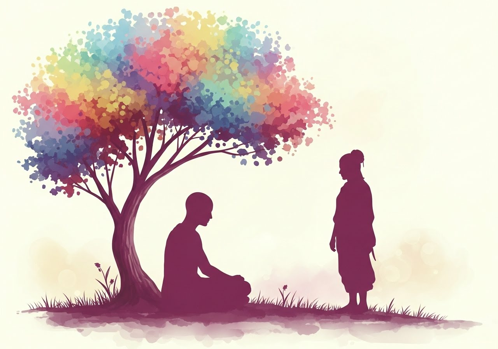
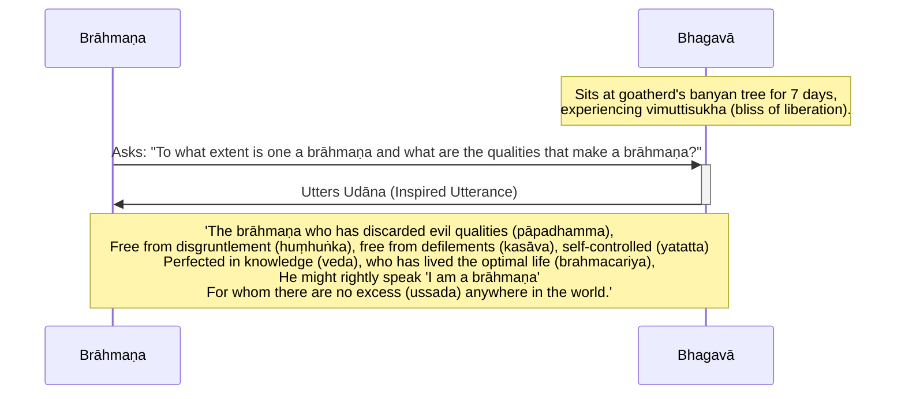

Original text: [World Tipitaka Edition](https://tipitaka2500.github.io/tipitaka/3V/1/1.2.html)

> [!INFO]
> Image generated by Imagen 4, representing the Buddha being visited by a proud brahmin.

Pali text (click to view)

(4.)

14\. Atha kho bhagavā sattāhassa accayena tamhā samādhimhā vuṭṭhahitvā bodhirukkhamūlā yena ajapālanigrodho tenupasaṅkami, upasaṅkamitvā ajapālanigrodhamūle sattāhaṃ ekapallaṅkena nisīdi vimuttisukhapaṭisaṃvedī. Atha kho aññataro huṃhuṅkajātiko brāhmaṇo yena bhagavā tenupasaṅkami. Upasaṅkamitvā bhagavatā saddhiṃ sammodi. Sammodanīyaṃ kathaṃ sāraṇīyaṃ vītisāretvā ekamantaṃ aṭṭhāsi. Ekamantaṃ ṭhito kho so brāhmaṇo bhagavantaṃ etadavoca—  “kittāvatā nu kho, bho gotama, brāhmaṇo hoti, katame ca pana brāhmaṇakaraṇā dhammā”ti? Atha kho bhagavā etamatthaṃ viditvā tāyaṃ velāyaṃ imaṃ udānaṃ udānesi—

15\. _“Yo brāhmaṇo bāhitapāpadhammo,_  \
_Nihuṃhuṅko nikkasāvo yatatto;_  \
_Vedantagū vusitabrahmacariyo,_  \
_Dhammena so brahmavādaṃ vadeyya;_  \
_Yassussadā natthi kuhiñci loke”ti._  

---

16\. Ajapālakathā niṭṭhitā.

## Summary

After emerging from seven days of concentration, the Bhagavā relocated from the Bodhi tree to the goatherd's banyan Tree, where he sat for another seven days experiencing the bliss of liberation. Here, a disapproving `brāhmaṇa` approached and asked what defines a true brāhmaṇa and their qualities. The Bhagavā responded with an inspired utterance, stating that a true brāhmaṇa is one who has discarded evil qualities, is free from arrogance and defilements, is self-controlled, perfected in knowledge, has lived the holy life, and has no worldly attachments, thus rightly able to claim the title 'brāhmaṇa'.

## Diagram

## Text

(4.)

14\. Then indeed the Bhagavā, after the passing of seven days, having emerged from that `samādhi` (mental composure), from the root of the Bodhi tree approached where the goatherd's banyan tree was. Having approached, at the root of the goatherd's banyan tree, he sat for seven days in one cross-legged posture, experiencing the bliss of liberation (`vimuttisukhapaṭisaṃvedī`). Then indeed a certain disgruntled `brāhmaṇa` approached where the Bhagavā was. Having approached, he exchanged courteous greetings with the Bhagavā. Having exchanged pleasant and memorable talk, he stood to one side. Standing to one side, that brāhmaṇa said this to the Bhagavā: “To what extent, indeed, O Gotama, is one a brāhmaṇa, and what, then, are the qualities that make a brāhmaṇa?” Then indeed the Bhagavā, understanding this matter, on that occasion uttered this inspired utterance (`udāna`):

15\. _“The brāhmaṇa who has discarded evil qualities (`pāpadhamma`),_  \
_Free from disgruntlement (`huṃhuṅka`), free from defilements (`kasāva`), self-controlled (`yatatta`);_  \
_Perfected in knowledge (`veda`), who has lived the optimal life (`brahmacariya`),_  \
_He might rightly speak 'I am a brāhmaṇa';_  \
_For whom there are no excess (`ussada`) anywhere in the world.”_  

---

16\. The Account of the Goatherd's Banyan Tree is finished.

## Commentary

The core of this passage is the redefinition of `brāhmaṇa`.

A `brāhmaṇa` (brahmin) who noticed the Buddha under the tree decides to humiliate the Buddha by asking him a rhetorical question:

> “To what extent, indeed, O Gotama, is one a brāhmaṇa, and what, then, are the qualities that make a brāhmaṇa?”

The implication here is that the Buddha is not a true brāhmaṇa and therefore an impostor. The word `huṃhuṅkajātika` (literaly, someone with a "huṃ huṃ" nature who is inclined to say "humph" disapprovingly) indicates that the brāhmaṇa disapproves of the Buddha.

The conventional definition of a `brāhmaṇa` is of course someone from the brahmin caste who engages and performs rituals in accordance to Vedic traditions. In other words, one can only be born a brahmin, one can not become a brahmin.

The Bhagavā’s response shifts the criteria entirely to internal, verifiable characteristics. A "true brāhmaṇa" is defined by an achieved psychological state: the absence of detrimental mental states (`kasāva`, or "bad qualities," "defilements" etc.), the presence of cultivated self-control (`yatatta`), and a deep, experiential understanding (`vedantagū`) of one's own mind and its workings, developed through a disciplined mode of living (`brahmacariya`). The crucial element is the internal landscape — a conscious experience free from "excess," which can be understood as entangling mental preoccupations, attachments, or cognitive biases that obscure clarity and generate distress. Thus, the ideal is framed not by external or intrinsic markers but by a transformed and purified subjective experience.

As a bit of humour, the Buddha gently teases the brāhmaṇa by saying a true brāhmaṇa should be "free from disgruntlement or arrogance" (`nihuṃhuṅko`).

In [Gombrich - How Buddhism Began: The conditioned genesis of the early teachings (2006)](<../Books/Gombrich - How Buddhism Began (2006).md>) [@HowBuddhismBegan], Gombrich states:

> In the Mahāvagga a snooty brahmin then comes along and asks him by virtue of what he can claim to be a brahmin. The Buddha answers in a verse, his fourth, which includes puns on brahminical terms, one of them a pun on the word brāhmaṇa (in a Prakritic form)

In [Gombrich - What the Buddha Thought (2009)](../Books/Gombrich%20-%20What%20the%20Buddha%20Thought%20(2009).md) [@WhatTheBuddhaThought], Gombrich writes:

> At the end of the week the Buddha moves to a banyan tree, where he spends another week in a similar manner. Then a brahmin happens along. He is the Buddha's first human contact since Enlightenment. This brahmin is not named, but the text characterizes him by a word found only in this passage, *huhuńka*; this seems to be onomatopoeic and to mean something like 'snooty'. The brahmin asks the Buddha what features make a brahmin - a question found elsewhere in the Canon too. The Buddha answers that a man can rightly claim to be a brahmin if he has seven features: he has expelled evil characteristics (bāhita-pāpadhammo), he is not snooty (huhuńka), he has no moral stains, he restrains himself, he has reached the end (that is, the perfection) of knowledge (vedanta-gu), he has lived the holy life (vusita-brahmacariyo) and has no arrogance towards anyone in the world. Obviously, these seven features overlap. Three terms in the list - bāhita-pāpadhammo, vedanta-gu and vusita-brahma-cariyo - play on brahmin terminology. For the brahmin, Vedānta refers to the Upaniṣads, but the Buddha takes it more generally to refer to the culmination of true knowledge. Similarly, 'brahman conduct', which is the literal meaning of brahma-cariyā, has likewise been given a different referent by the Buddha (see the Appendix). The message of the list as a whole is plain. The Buddha is telling brahmins that they have no right to be proud, because all the virtues and accomplishments that they claim he has in full measure - indeed, in fuller measure, because he understands what the terms should really refer to.

As per the previous narrative, it is unlikely the Buddha would have encountered a visiting brahmin at Uruvelā - this story is probably invented by the compiler of the Khandhaka in order to contrast the peaceful, serene Buddha under the bliss of liberation with the disgruntled brahmin, who despite being born in the brahmin caste, does not seem to have avoided dissatisfaction.

However, given that the author/compiler of the Khandhaka was born a brahmin, as suggested by Frauwallner, it seems to me this section is a clever way of introducing the personality of the author into the text. Hence, this narrative could be a reference to the personal biography of the author, who was formerly a practising brahmin who knew the Vedic texts, but perhaps was not satisfied with Brahmanism and hence became disgruntled. The narrative is then a touching reference to the author, having converted to Buddhism, finally understanding the true meaning of the word `brāhmaṇa`.

## Other Opinons

- [Bronkhorst - Greater Magadha (2007)](../Books/Bronkhorst%20-%20Greater%20Magadha%20(2007).md) [@GreaterMagadha] \
	Bronkhorst posits that ancient India hosted two distinct, coexisting cultures: the ritual-focused, rural Vedic culture of the western Gangetic plain, and a separate culture in "Greater Magadha" to the east, which was the source of Buddhism, Jainism, and Ājīvikism. This eastern culture was defined by core beliefs in rebirth and karmic retribution, the use of round funerary mounds (`stūpa`s), an "empirico-rational" approach to medicine, and a concept of cyclic time. Bronkhorst argues that these ideas were foreign to early Brahmanism and were only gradually absorbed, ignored, or actively rejected by different Brahmanical groups over many centuries. Challenging traditional Vedic chronology, he presents evidence that many late-Vedic texts, including parts of the Upaniṣads, are much later than commonly thought and were composed during a long period of interaction with this eastern culture, concluding that classical Indian civilization is not a linear development from Vedic antecedents but a synthesis of these two fundamentally different cultural worlds.

[Go to previous page (1. Bodhikathā)](1.1.md) / [Go to parent page (Khandhaka)](../Khandhaka) / [Go to next page (3. Mucalindakathā)](1.3.md)

## References
