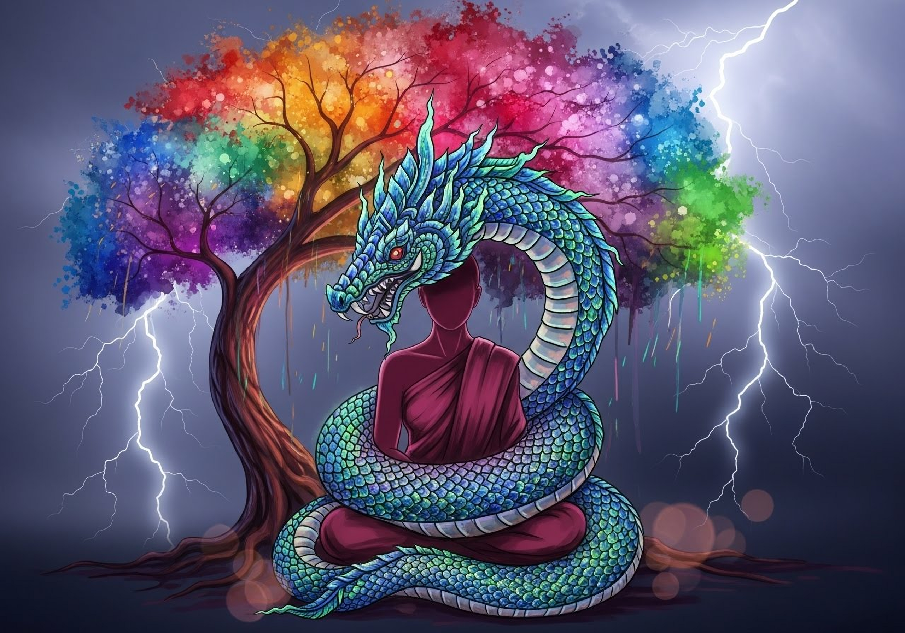
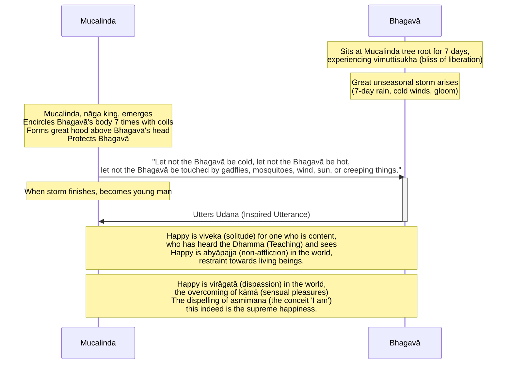

Original text: [World Tipitaka Edition](https://tipitaka2500.github.io/tipitaka/3V/1/1.3.html)

> [!INFO]
> Image generated by Imagen 4, representing Mucalinda, the nāga king, protecting the Buddha during an unseasonal storm.

Pali text (click to view)

(5.)

17\. Atha kho bhagavā sattāhassa accayena tamhā samādhimhā vuṭṭhahitvā ajapālanigrodhamūlā yena mucalindo tenupasaṅkami, upasaṅkamitvā mucalindamūle sattāhaṃ ekapallaṅkena nisīdi vimuttisukhapaṭisaṃvedī. Tena kho pana samayena mahā akālamegho udapādi, sattāhavaddalikā sītavātaduddinī. Atha kho mucalindo nāgarājā sakabhavanā nikkhamitvā bhagavato kāyaṃ sattakkhattuṃ bhogehi parikkhipitvā uparimuddhani mahantaṃ phaṇaṃ karitvā aṭṭhāsi—  “mā bhagavantaṃ sītaṃ, mā bhagavantaṃ uṇhaṃ, mā bhagavantaṃ ḍaṃsamakasavātātapasarīsapasamphasso”ti. Atha kho mucalindo nāgarājā sattāhassa accayena viddhaṃ vigatavalāhakaṃ devaṃ viditvā bhagavato kāyā bhoge viniveṭhetvā sakavaṇṇaṃ paṭisaṃharitvā māṇavakavaṇṇaṃ abhinimminitvā bhagavato purato aṭṭhāsi pañjaliko bhagavantaṃ namassamāno. Atha kho bhagavā etamatthaṃ viditvā tāyaṃ velāyaṃ imaṃ udānaṃ udānesi—

18\. _“Sukho viveko tuṭṭhassa,_  \
_sutadhammassa passato;_  \
_Abyāpajjaṃ sukhaṃ loke,_  \
_pāṇabhūtesu saṃyamo._  

19\. _Sukhā virāgatā loke,_  \
_kāmānaṃ samatikkamo;_  \
_Asmimānassa yo vinayo,_  \
_etaṃ ve paramaṃ sukhan”ti._  

---

20\. Mucalindakathā niṭṭhitā.

## Summary

After emerging from seven days of `samādhi` (mental composure), the Bhagavā spent another seven days at the Mucalinda tree experiencing the bliss of liberation (`vimuttisukhapaṭisaṃvedī`). During this period, an unseasonal storm arose, prompting Mucalinda, the nāga king, to protect the Bhagavā by coiling around his body and spreading a hood over his head for seven days. Once the storm cleared, Mucalinda transformed into a young man and paid homage. In response, the Bhagavā uttered an `udāna` (inspired utterance) extolling the happiness of `viveka` (solitude) for the content who have heard the Dhamma, `abyāpajja` (non-affliction) towards beings, `virāgatā` (dispassion) from sensual pleasures, and identifying the dispelling of `asmimāna` (the conceit 'I am') as the supreme happiness.

## Diagram

## Text

(5.)

17\. Then, indeed, the Bhagavā, after the passing of seven days, having emerged from that `samādhi` (mental composure), from the root of the Ajapāla banyan tree, approached where the Mucalinda tree was. Having approached, he sat at the root of the Mucalinda tree for seven days in one cross-legged posture, experiencing the bliss of liberation (`vimuttisukhapaṭisaṃvedī`). Now, at that time, a great unseasonal storm cloud arose, a seven-day rain, with cold winds and gloom. Then, indeed, Mucalinda, the `nāga` (serpent deity) king, having come out from his own abode, encircled the Bhagavā's body seven times with his coils, and having made a great hood above his head, he stood, thinking, "Let not the Bhagavā be cold, let not the Bhagavā be hot, let not the Bhagavā be touched by gadflies, mosquitoes, wind, sun, or creeping things." Then, indeed, Mucalinda, the `nāga` king, after the passing of seven days, knowing the sky to be clear and free of clouds, having unwound his coils from the Bhagavā's body, having withdrawn his own form and created the form of a young man, stood before the Bhagavā with clasped hands, paying homage to the Bhagavā. Then, indeed, the Bhagavā, understanding this matter, at that time uttered this `udāna` (inspired utterance):

18\. _“Happy is `viveka` (solitude) for one who is content,_ \
_who has heard the `Dhamma` (Teaching) and sees;_ \
_Happy is `abyāpajja` (non-affliction) in the world,_ \
_restraint towards living beings._

19\. _Happy is `virāgatā` (dispassion) in the world,_ \
_the overcoming of `kāmā` (sensual pleasures);_ \
_The dispelling of `asmimāna` (the conceit 'I am'),_ \
_this indeed is the supreme happiness.”_

---

20\. The acount of the Mucalinda tree is finished.

## Commentary

The "unseasonal storm" and the protective "Mucalinda `nāga`" (often translated as "dragon king") can be interpreted as a symbolic depiction of navigating intense adversity while maintaining this liberated awareness. From a rational perspective, Mucalinda's intervention isn't a literal supernatural event but could represent the powerful, almost instinctual, self-regulating and protective capacity of a deeply concentrated and equanimous mind. The "coils" and "hood" vividly portray how such a state can feel encompassing and shielding from external or internal disturbances. Mucalinda’s later transformation and homage signify an intuitive recognition and integration of this profound protective experience.

The `udāna` articulates the core insights from this state. `Viveka` (solitude) is valued for the contentment and clarity it affords, allowing for direct experiential insight ("sees" the Dhamma). `Abyāpajja` (non-affliction) describes the lived experience of benevolence. `Virāgatā` (dispassion) refers to the phenomenological freedom from the drive of sensual pleasures (`kāmā`). The "dispelling of `asmimāna` (the conceit 'I am')" is paramount. Psychologically, this is the deconstruction of a fixed, reified self-concept. The realisation that the "I" is a construct, and the subsequent release from the anxieties and attachments bound to it, constitutes the "supreme happiness."

In [Gombrich - How Buddhism Began: The conditioned genesis of the early teachings (2006)](<../Books/Gombrich - How Buddhism Began (2006).md>) [@HowBuddhismBegan], Gombrich notes:

> Shortly after his Enlightenment, the Buddha is sitting in the bliss of meditation when a great storm arises (Vin I, 3). To protect him, the nāga king Mucalinda comes and wraps his coils round the Buddha and spreads his hood over the Buddha's head.  When the storm has passed, he takes the form of a young brahmin and renders homage to the Buddha. He does not say anything, and we cannot tell why he takes human form; but this episode too has the air of being an allegory of religious rivalry.

## Other opinions

- [Gombrich - How Buddhism Began: The conditioned genesis of the early teachings (2006)](<../Books/Gombrich - How Buddhism Began (2006).md>) [@HowBuddhismBegan] \
	Gombrich posits a historical rivalry between early Buddhism and the pre-existing cult of `nāga` (supernatural serpent) worship, a theory supported by both ambiguous scriptural narratives and archaeological evidence of ancient `nāga` shrines. While one story depicts the `nāga` king Mucalinda cooperatively protecting the Buddha, another from the Vinaya explicitly bars a `nāga` from ordination, stating it lacks the capacity for spiritual progress within the doctrine. The author suggests that Buddhists engaged in a "contest" by strategically appropriating the term `nāga`, which was also used metaphorically as an honorific for enlightened monks. By re-defining `nāga` as one who commits no "offence" (`āgu`), Buddhists infused their rival's term with a new, superior meaning, effectively arguing that "their `nāga`s were better." This linguistic reappropriation would also explain the origin of later, otherwise confusing customs, such as the Sri Lankan practice of calling ordination candidates '`nāga`'.

[Go to previous page (2. Ajapālakathā)](1.2.md) / [Go to parent page (Khandhaka)](../Khandhaka) / [Go to next page (4. Rājāyatanakathā)](1.4.md)

## References
