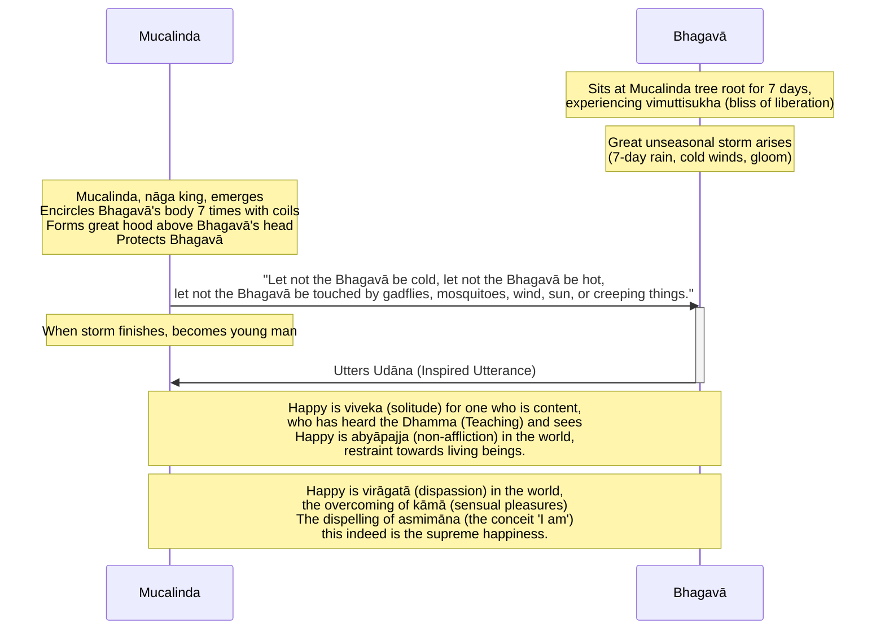

Original text: [World Tipitaka Edition](https://tipitaka2500.github.io/tipitaka/3V/1/1.3.html)

> [!INFO]
> Image generated by Imagen 4, representing Mucalinda, the nāga king, protecting the Buddha during an unseasonal storm.

Pali text (click to view)

(5.)

17\. Atha kho bhagavā sattāhassa accayena tamhā samādhimhā vuṭṭhahitvā ajapālanigrodhamūlā yena mucalindo tenupasaṅkami, upasaṅkamitvā mucalindamūle sattāhaṃ ekapallaṅkena nisīdi vimuttisukhapaṭisaṃvedī. Tena kho pana samayena mahā akālamegho udapādi, sattāhavaddalikā sītavātaduddinī. Atha kho mucalindo nāgarājā sakabhavanā nikkhamitvā bhagavato kāyaṃ sattakkhattuṃ bhogehi parikkhipitvā uparimuddhani mahantaṃ phaṇaṃ karitvā aṭṭhāsi—  “mā bhagavantaṃ sītaṃ, mā bhagavantaṃ uṇhaṃ, mā bhagavantaṃ ḍaṃsamakasavātātapasarīsapasamphasso”ti. Atha kho mucalindo nāgarājā sattāhassa accayena viddhaṃ vigatavalāhakaṃ devaṃ viditvā bhagavato kāyā bhoge viniveṭhetvā sakavaṇṇaṃ paṭisaṃharitvā māṇavakavaṇṇaṃ abhinimminitvā bhagavato purato aṭṭhāsi pañjaliko bhagavantaṃ namassamāno. Atha kho bhagavā etamatthaṃ viditvā tāyaṃ velāyaṃ imaṃ udānaṃ udānesi—

18\. _“Sukho viveko tuṭṭhassa,_  \
_sutadhammassa passato;_  \
_Abyāpajjaṃ sukhaṃ loke,_  \
_pāṇabhūtesu saṃyamo._  

19\. _Sukhā virāgatā loke,_  \
_kāmānaṃ samatikkamo;_  \
_Asmimānassa yo vinayo,_  \
_etaṃ ve paramaṃ sukhan”ti._  

---

20\. Mucalindakathā niṭṭhitā.

## Summary

After emerging from seven days of `samādhi` (mental composure), the Bhagavā spent another seven days at the Mucalinda tree experiencing the bliss of liberation (`vimuttisukhapaṭisaṃvedī`). During this period, an unseasonal storm arose, prompting Mucalinda, the nāga king, to protect the Bhagavā by coiling around his body and spreading a hood over his head for seven days. Once the storm cleared, Mucalinda transformed into a young man and paid homage. In response, the Bhagavā uttered an `udāna` (inspired utterance) extolling the happiness of `viveka` (solitude) for the content who have heard the Dhamma, `abyāpajja` (non-affliction) towards beings, `virāgatā` (dispassion) from sensual pleasures, and identifying the dispelling of `asmimāna` (the conceit 'I am') as the supreme happiness.

## Diagram

## Text

(5.)

17\. Then, indeed, the Bhagavā, after the passing of seven days, having emerged from that `samādhi` (mental composure), from the root of the Ajapāla banyan tree, approached where the Mucalinda tree was. Having approached, he sat at the root of the Mucalinda tree for seven days in one cross-legged posture, experiencing the bliss of liberation (`vimuttisukhapaṭisaṃvedī`). Now, at that time, a great unseasonal storm cloud arose, a seven-day rain, with cold winds and gloom. Then, indeed, Mucalinda, the `nāga` (serpent deity) king, having come out from his own abode, encircled the Bhagavā's body seven times with his coils, and having made a great hood above his head, he stood, thinking, "Let not the Bhagavā be cold, let not the Bhagavā be hot, let not the Bhagavā be touched by gadflies, mosquitoes, wind, sun, or creeping things." Then, indeed, Mucalinda, the `nāga` king, after the passing of seven days, knowing the sky to be clear and free of clouds, having unwound his coils from the Bhagavā's body, having withdrawn his own form and created the form of a young man, stood before the Bhagavā with clasped hands, paying homage to the Bhagavā. Then, indeed, the Bhagavā, understanding this matter, at that time uttered this `udāna` (inspired utterance):

18\. _“Happy is `viveka` (solitude) for one who is content,_ \
_who has heard the `Dhamma` (Teaching) and sees;_ \
_Happy is `abyāpajja` (non-affliction) in the world,_ \
_restraint towards living beings._

19\. _Happy is `virāgatā` (dispassion) in the world,_ \
_the overcoming of `kāmā` (sensual pleasures);_ \
_The dispelling of `asmimāna` (the conceit 'I am'),_ \
_this indeed is the supreme happiness.”_

---

20\. The acount of the Mucalinda tree is finished.

## Commentary

The "unseasonal storm" and the protective "Mucalinda `nāga`" (often translated as "dragon king") can be interpreted as a symbolic depiction of navigating intense adversity while maintaining this liberated awareness. From a rational perspective, Mucalinda's intervention isn't a literal supernatural event but could represent the powerful, almost instinctual, self-regulating and protective capacity of a deeply concentrated and equanimous mind. The "coils" and "hood" vividly portray how such a state can feel encompassing and shielding from external or internal disturbances. Mucalinda’s later transformation and homage signify an intuitive recognition and integration of this profound protective experience.

The `udāna` articulates the core insights from this state. `Viveka` (solitude) is valued for the contentment and clarity it affords, allowing for direct experiential insight ("sees" the Dhamma). `Abyāpajja` (non-affliction) describes the lived experience of benevolence. `Virāgatā` (dispassion) refers to the phenomenological freedom from the drive of sensual pleasures (`kāmā`). The "dispelling of `asmimāna` (the conceit 'I am')" is paramount. Psychologically, this is the deconstruction of a fixed, reified self-concept. The realisation that the "I" is a construct, and the subsequent release from the anxieties and attachments bound to it, constitutes the "supreme happiness."

In [Gombrich - How Buddhism Began: The conditioned genesis of the early teachings (2006)](<../Books/Gombrich - How Buddhism Began (2006).md>) [@HowBuddhismBegan], Gombrich notes:

> Shortly after his Enlightenment, the Buddha is sitting in the bliss of meditation when a great storm arises (Vin I, 3). To protect him, the nāga king Mucalinda comes and wraps his coils round the Buddha and spreads his hood over the Buddha's head.  When the storm has passed, he takes the form of a young brahmin and renders homage to the Buddha. He does not say anything, and we cannot tell why he takes human form; but this episode too has the air of being an allegory of religious rivalry.

[@Levman2014] explains that the reference to the nāga king Mucalinda may be linked to serpent worship amongst indigenous people. Similar to the inclusion of tree references, the intention by the author/compiler of the Khandhaka is to make Buddhism attractive to the local population by incorporating local worship practices.

[@Levman2014] writes:

> In the third week after his enlightenment, the Buddha re-experienced the bliss of liberation under a *mucalinda* tree (*Barringtonia Acutangula,* mangrove or Indian oak tree; a non-Aryan name per KEWA, vol. 2, 649), and when a storm arose Mucalinda, the serpent king — who was evidently also the tree deity — came and protected the Buddha by wrapping his coils seven times around him and covering his upper head with his hood; there he remained for seven days, protecting him from the inclement weather. This story is told in the Theravādin *Khandaka* (at Vin I 0311–31), considered by many to be a work containing some of the earliest layers of Buddhist tradition (Waldschmidt 1944–48, 335–337; Frauwallner 1956, 153; Pande 1974, 98; disagreeing, Lamotte 1988, 178–179). The earliest representation we have of the *nāga* cult occurs on the southern gate at Bhārhut where the Buddha is worshipped by the *nāga* king Erapato (Vogel 1926, 39; plate 3 facing page 40). The Mucalinda incident is alluded to on the western gateway at Sāñcī where the Buddha is represented by an empty platform underneath the *mucalinda* tree, and the *nāga* by a man wearing a five-part snake hood under the platform. A scene depicting the worshipping of the five-headed *nāga* is chiselled on Sāñcī’s eastern gateway (Fergusson 1868, 113). In the later *Mahāvastu*, the Mucilinda legend is also told, but the role of the *nāga*s is embellished: the Buddha spends the fourth week after his awakening in the abode of the *nāga* king Kāla and the fifth week in Muclinda’s abode where he is protected against unseasonable weather (Mvu III 30010–30107). On his way to set the wheel of *Dharma* turning at Benares, the Buddha is escorted by the Sudhāvāsa deities, the Suvarṇas, and the Nāga kings, and lodged along the way by the *yakṣa*s Cunda and Kandha, and by the *nāga* kings Sudarśana and Kamaṇḍaluka, as well as an unidentified householder (Mvu III 324–328). In the Amarāvatī monastic site (second century BCE) in south-eastern (Dravidian) India, the Buddha is represented as a *nāga* on a *stūpa* (Stern and Benisti 1961, plates 8a, 15b and 40b; the *nāga* in the former plate is contemporary with some of the earlier bas-reliefs of Sāñcī, p. 73).
> 
> Snake veneration was an aboriginal, not an Aryan cult — there is no trace of serpent worship in the *Veda*s and snakes do not become an important Aryan religious theme until the *Mahābhārata*, where they are usually treated as dangerous enemies (Fergusson 1868, 58; Macdonell 1897, 153); it was however, evidently part of Buddhism from the very beginning and an integral part of its founding mythology; the *nāga*s were both worshippers of the Buddha and important protective deities which were themselves venerated. In what is perhaps one of the earliest works of the canon (the *Sutta-nipāta*), the Buddha is addressed as a *nāga* as a mark of respect; however, by the time the commentary was written (fifth century CE), this snake epithet is something of an embarrassment (Norman 2006, 191–192), and attempts are made to explain away the snake connection with fake etymologies: *nāgan ti punabbhavaṃ n’ eva gantāraṃ, atha vā āgun na karotī ti pi nāgo, balavā ti pi nāgo, taṃ nāgaṃ* (Pj II 20812–13: ‘he is called *“nāga”* since he does not go to a new birth [taking the *ga-* in *nāga* as derived from the MI verb *gam*, ‘to go’ with *na-* as the negative adverb], or he does not commit a fault [*na-āgu,* ‘no, fault’] and also since he is strong’. In fact, the etymology of *nāga* is not well understood and may or may not be of IA origin. The meaning of the words *nāga* and *yakkha/yakṣa* seems to have worsened over time, and in some instances they also represented harmful demons. Whether this is an example of linguistic pejoration or ambiguity with respect to a *nāga*’s moral status is unknown. Later in the *Khandaka* story, for example, where Mucilinda protects the Buddha, the Buddha subdues a savage *nāga* king who lived in the fire room of the *jaṭila* (matted hair ascetic) Kassapa (Vin I 2410–2538).
> 
> Snake-worship is generally believed to be an aboriginal cult associated with a Mongolian or Tibeto-Burmese people who occupied North India before the advent of the Aryans (Minor 1981, 519). The *nāga*s (serpents or cobras) were also another pejorative name the Aryans used for the eastern tribes (along with *asura*s and *dasyu*s), and the cobra is to this day one of the totems of the Munda-speaking tribes of Jarkhand (Kosambi 1965, 86; Singh 1994, 850).

## Other opinions

- [Gombrich - How Buddhism Began: The conditioned genesis of the early teachings (2006)](<../Books/Gombrich - How Buddhism Began (2006).md>) [@HowBuddhismBegan] \
	Gombrich posits a historical rivalry between early Buddhism and the pre-existing cult of `nāga` (supernatural serpent) worship, a theory supported by both ambiguous scriptural narratives and archaeological evidence of ancient `nāga` shrines. While one story depicts the `nāga` king Mucalinda cooperatively protecting the Buddha, another from the Vinaya explicitly bars a `nāga` from ordination, stating it lacks the capacity for spiritual progress within the doctrine. The author suggests that Buddhists engaged in a "contest" by strategically appropriating the term `nāga`, which was also used metaphorically as an honorific for enlightened monks. By re-defining `nāga` as one who commits no "offence" (`āgu`), Buddhists infused their rival's term with a new, superior meaning, effectively arguing that "their `nāga`s were better." This linguistic reappropriation would also explain the origin of later, otherwise confusing customs, such as the Sri Lankan practice of calling ordination candidates '`nāga`'.
- [Levman - Cultural Remnants of the Indigenous Peoples in the Buddhist Scriptures (2014)](<../Articles/Levman - Cultural Remnants of the Indigenous Peoples in the Buddhist Scriptures (2014).md>) [@Levman2014] \
  Bryan Levman's article argues that Buddhist scriptures contain significant cultural remnants from India's indigenous Munda, Dravidian, and Tibeto-Burman peoples, which have been obscured by a later "brahmanization" that historicized the Buddha within the dominant Indo-Aryan (IA) tradition. The author identifies this indigenous influence by examining the hostility between IA immigrants and eastern ethnic groups like the Buddha's Sakya clan, whose distinct socio-political organization (*gaṇasaṅgha*), rejection of the Brahmanical class system, and non-Aryan marriage customs are evident in the texts. Furthermore, key Buddhist concepts and practices are traced to autochthonous roots, including the idea of the *Mahāpuruṣa* (Great Man), the veneration of trees and serpents (*nāgas*), the culture of sacred groves, and the unique funeral rites described for the Buddha's *parinibbāna*, all of which differ significantly from Vedic norms.

[Go to previous page (2. Ajapālakathā)](1.2.md) / [Go to parent page (Khandhaka)](../Khandhaka) / [Go to next page (4. Rājāyatanakathā)](1.4.md)

## References
