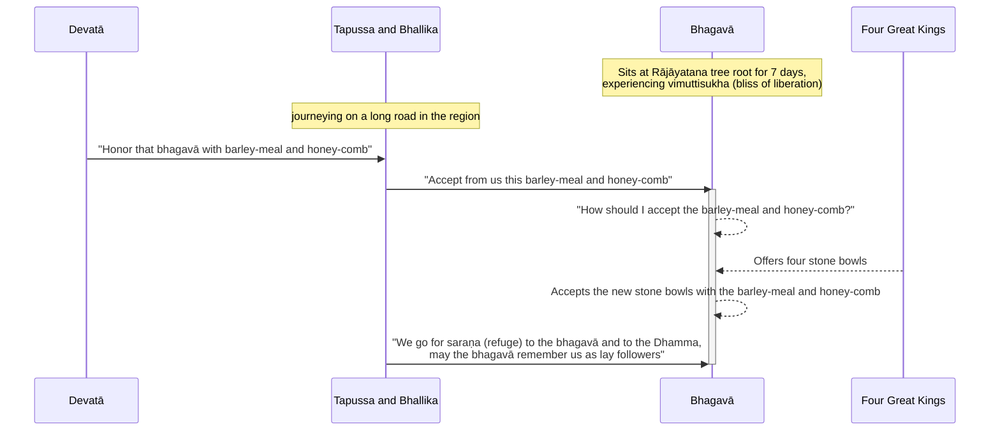

Original text: [World Tipitaka Edition](https://tipitaka2500.github.io/tipitaka/3V/1/1.4.html)

> [!INFO]
> Image generated by Google Imagen 4.

Pali text (click to view)

(6.)

21\. Atha kho bhagavā sattāhassa accayena tamhā samādhimhā vuṭṭhahitvā mucalindamūlā yena rājāyatanaṃ tenupasaṅkami, upasaṅkamitvā rājāyatanamūle sattāhaṃ ekapallaṅkena nisīdi vimuttisukhapaṭisaṃvedī. Tena kho pana samayena tapussa bhallikā vāṇijā ukkalā taṃ desaṃ addhānamaggappaṭipannā honti. Atha kho tapussabhallikānaṃ vāṇijānaṃ ñātisālohitā devatā tapussabhallike vāṇije etadavoca—  “ayaṃ, mārisā, bhagavā rājāyatanamūle viharati paṭhamābhisambuddho; gacchatha taṃ bhagavantaṃ manthena ca madhupiṇḍikāya ca patimānetha; taṃ vo bhavissati dīgharattaṃ hitāya sukhāyā”ti.

22\. Atha kho tapussabhallikā vāṇijā manthañca madhupiṇḍikañca ādāya yena bhagavā tenupasaṅkamiṃsu, upasaṅkamitvā bhagavantaṃ abhivādetvā ekamantaṃ aṭṭhaṃsu. Ekamantaṃ ṭhitā kho tapussabhallikā vāṇijā bhagavantaṃ etadavocuṃ—  “paṭiggaṇhātu no, bhante, bhagavā manthañca madhupiṇḍikañca, yaṃ amhākaṃ assa dīgharattaṃ hitāya sukhāyā”ti. Atha kho bhagavato etadahosi—  “na kho tathāgatā hatthesu paṭiggaṇhanti. Kimhi nu kho ahaṃ paṭiggaṇheyyaṃ manthañca madhupiṇḍikañcā”ti? Atha kho cattāro mahārājāno bhagavato cetasā cetoparivitakkamaññāya catuddisā cattāro selamaye patte bhagavato upanāmesuṃ—  “idha, bhante, bhagavā paṭiggaṇhātu manthañca madhupiṇḍikañcā”ti. Paṭiggahesi bhagavā paccagghe selamaye patte manthañca madhupiṇḍikañca, paṭiggahetvā paribhuñji.

23\. Atha kho tapussabhallikā vāṇijā bhagavantaṃ onītapattapāṇiṃ viditvā bhagavato pādesu sirasā nipatitvā bhagavantaṃ etadavocuṃ—  “ete mayaṃ, bhante, bhagavantaṃ saraṇaṃ gacchāma dhammañca, upāsake no bhagavā dhāretu ajjatagge pāṇupete saraṇaṃ gate”ti. Te ca loke paṭhamaṃ upāsakā ahesuṃ dvevācikā.

---

24\. Rājāyatanakathā niṭṭhitā.

## Summary

After emerging from another seven days of `samādhi` and spending a further seven days at the Rājāyatana tree experiencing liberation, the Bhagavā was approached by merchants Tapussa and Bhallika, who were guided by a `devatā` (deity) to offer him barley-meal and honey-comb. Pondering how to accept the food, as Tathāgatas (realised ones) do not receive offerings in their hands, the four Great Kings miraculously provided four stone bowls. The Bhagavā accepted and partook of the meal, after which Tapussa and Bhallika took refuge in the Bhagavā and the `Dhamma` (Buddha's teachings), becoming the first lay followers in the world with two utterances.

## Diagram

## Text

(6.)

21\. Then indeed, bhagavā, after the passing of seven days, having emerged from that *samādhi* (concentration), approached from the root of the Mucalinda tree to where the Rājāyatana tree was. Having approached, he sat at the root of the Rājāyatana tree for seven days in one cross-legged posture, experiencing the bliss of liberation. Now at that time, the merchants Tapussa and Bhallika from Ukkalā were journeying on a long road to that region. Then indeed, a *devatā* (deity) who was a blood-relative of the merchants Tapussa and Bhallika said this to the merchants Tapussa and Bhallika: “This, mārisā, is the bhagavā dwelling at the root of the Rājāyatana tree, newly fully awakened; go and honor that bhagavā with barley-meal and honey-comb; that will be for your welfare and happiness for a long time.”

22\. Then the merchants Tapussa and Bhallika, taking the barley-meal and honey-comb, approached where the bhagavā was. Having approached and paid homage to the bhagavā, they stood to one side. Standing to one side, the merchants Tapussa and Bhallika said this to the bhagavā: “May the bhagavā, bhante, accept from us this barley-meal and honey-comb, which for us would be for our welfare and happiness for a long time.” Then this occurred to the bhagavā: “Tathāgatas indeed do not accept in their hands. In what now indeed should I accept the barley-meal and honey-comb?” Then the four Great Kings, having known with their own minds the thought in the bhagavā’s mind, from the four directions offered four stone bowls to the bhagavā, saying: “In this, bhante, may the bhagavā accept the barley-meal and honey-comb.” The bhagavā accepted the new stone bowls with the barley-meal and honey-comb; having accepted, he partook.

23\. Then the merchants Tapussa and Bhallika, seeing that the bhagavā had withdrawn his hand from the bowl, having fallen with their heads at the bhagavā’s feet, said this to the bhagavā: “We here, bhante, go for *saraṇa* (refuge) to the bhagavā and to the Dhamma; may the bhagavā remember us as lay followers from this day forth, who have gone for *saraṇa* (refuge) for as long as life lasts.” And they were the first lay followers in the world with two utterances.

---

24. The account of the Rājāyatana tree is finished.

## Commentary

The narrative describes the Bhagavā interacting with merchants, Tapussa and Bhallika. Their arrival, seemingly guided by a `devatā` (deity) is significant as the merchants represent the Buddha's first lay followers, and the precedent that the procedure for becoming a disciple is the uttering the refuges (only 2, as the `saṅgha` has not yet been established). This episode also highlights the Buddha's relative inexperience, he has not yet established the rules of conduct that would be featured in the Vinaya, so this is his first tentative attempt to define what is appropriate and what is not appropriate behaviour when faced with an offering.

The narrative, by introducing the `devatā` and the Four Heavenly Kings, also is an introduction to the cosmology of Buddhism, with it's multiple realms of existence and hierarchy of classes of living beings. From a rational perspective, this has no relevance to the Buddha's soteriology, which can be understood purely from phenomenology, so can be seen to be a later addition to spice up the story.

[Go to previous page (1.3 Mucalindakathā)](1.3.md) / [Go to parent page (1 Mahākhandhaka)](../1.md) / [Go to next page (1.5 Brahmayācanakathā)](1.5.md)

