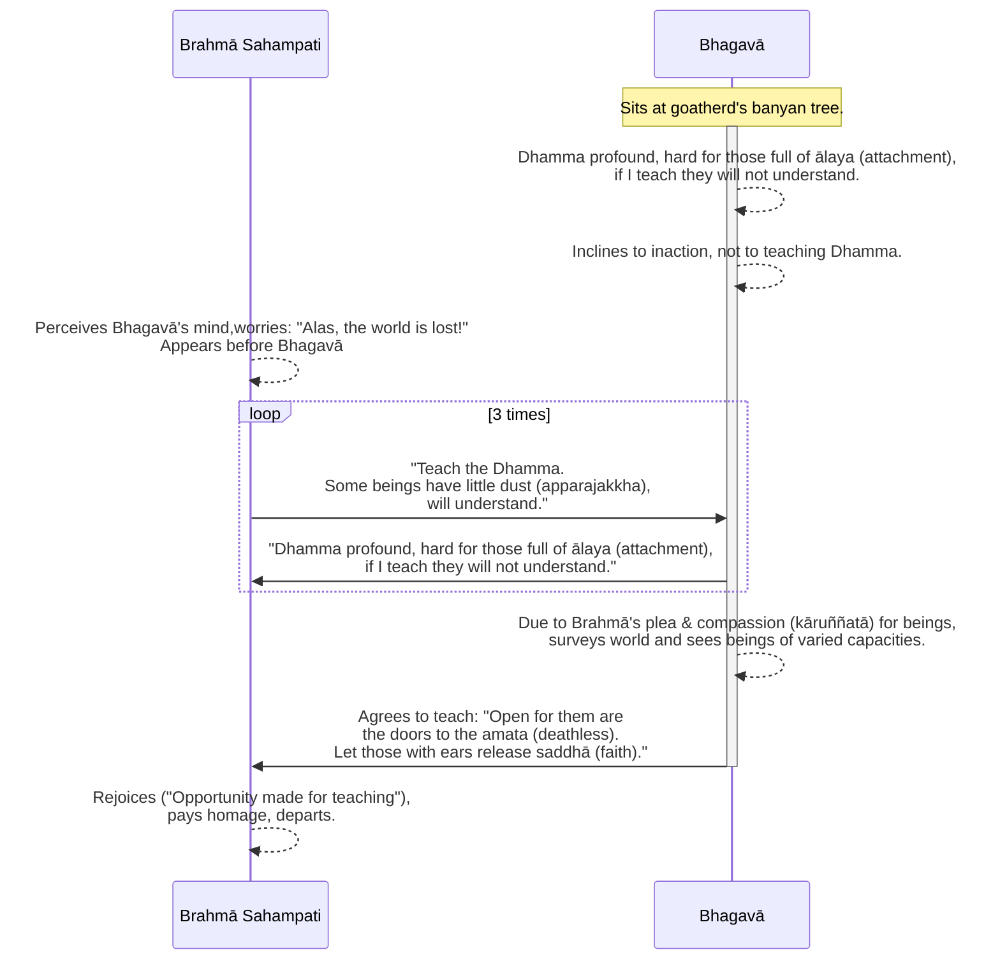

Original text: [World Tipitaka Edition](https://tipitaka2500.github.io/tipitaka/3V/1/1.5.html)

> [!INFO]
> Image generated by Google Imagen 4.

Pali text (click to view)

(7.)

25\. Atha kho bhagavā sattāhassa accayena tamhā samādhimhā vuṭṭhahitvā rājāyatanamūlā yena ajapālanigrodho tenupasaṅkami. Tatra sudaṃ bhagavā ajapālanigrodhamūle viharati. Atha kho bhagavato rahogatassa paṭisallīnassa evaṃ cetaso parivitakko udapādi—  “adhigato kho myāyaṃ dhammo gambhīro duddaso duranubodho santo paṇīto atakkāvacaro nipuṇo paṇḍitavedanīyo. Ālayarāmā kho panāyaṃ pajā ālayaratā ālayasammuditā. Ālayarāmāya kho pana pajāya ālayaratāya ālayasammuditāya duddasaṃ idaṃ ṭhānaṃ yadidaṃ idappaccayatāpaṭiccasamuppādo; idampi kho ṭhānaṃ sududdasaṃ yadidaṃ sabbasaṅkhārasamatho sabbūpadhipaṭinissaggo taṇhākkhayo virāgo nirodho nibbānaṃ. Ahañceva kho pana dhammaṃ deseyyaṃ, pare ca me na ājāneyyuṃ, so mamassa kilamatho, sā mamassa vihesā”ti. Apissu bhagavantaṃ imā anacchariyā gāthāyo paṭibhaṃsu pubbe assutapubbā—

26\. _“Kicchena me adhigataṃ,_  
_halaṃ dāni pakāsituṃ;_  
_Rāgadosaparetehi,_  
_nāyaṃ dhammo susambudho._  

27\. _Paṭisotagāmiṃ nipuṇaṃ,_  
_gambhīraṃ duddasaṃ aṇuṃ;_  
_Rāgarattā na dakkhanti,_  
_tamokhandhena āvuṭā”ti._  

28\. Itiha bhagavato paṭisañcikkhato appossukkatāya cittaṃ namati, no dhammadesanāya.

(8.)

29\. Atha kho brahmuno sahampatissa bhagavato cetasā cetoparivitakkamaññāya etadahosi—  “nassati vata bho loko, vinassati vata bho loko, yatra hi nāma tathāgatassa arahato sammāsambuddhassa appossukkatāya cittaṃ namati, no dhammadesanāyā”ti. Atha kho brahmā sahampati—  seyyathāpi nāma balavā puriso samiñjitaṃ vā bāhaṃ pasāreyya, pasāritaṃ vā bāhaṃ samiñjeyya; evameva—  brahmaloke antarahito bhagavato purato pāturahosi. Atha kho brahmā sahampati ekaṃsaṃ uttarāsaṅgaṃ karitvā dakkhiṇajāṇumaṇḍalaṃ pathaviyaṃ nihantvā yena bhagavā tenañjaliṃ paṇāmetvā bhagavantaṃ etadavoca—  “desetu, bhante, bhagavā dhammaṃ, desetu sugato dhammaṃ. Santi sattā apparajakkhajātikā, assavanatā dhammassa parihāyanti, bhavissanti dhammassa aññātāro”ti. Idamavoca brahmā sahampati, idaṃ vatvāna athāparaṃ etadavoca—

30\. _“Pāturahosi magadhesu pubbe,_  
_Dhammo asuddho samalehi cintito;_  
_Apāpuretaṃ amatassa dvāraṃ,_  
_Suṇantu dhammaṃ vimalenānubuddhaṃ._  

31\. _Sele yathā pabbatamuddhaniṭṭhito,_  
_Yathāpi passe janataṃ samantato;_  
_Tathūpamaṃ dhammamayaṃ sumedha,_  
_Pāsādamāruyha samantacakkhu;_  
_Sokāvatiṇṇaṃ janatamapetasoko,_  
_Avekkhassu jātijarābhibhūtaṃ._  

32\. _Uṭṭhehi vīra vijitasaṅgāma,_  
_Satthavāha aṇaṇa vicara loke;_  
_Desassu bhagavā dhammaṃ,_  
_Aññātāro bhavissantī”ti._  

33\. Evaṃ vutte, bhagavā brahmānaṃ sahampatiṃ etadavoca—  “mayhampi kho, brahme, etadahosi—  ‘adhigato kho myāyaṃ dhammo gambhīro duddaso duranubodho santo paṇīto atakkāvacaro nipuṇo paṇḍitavedanīyo. Ālayarāmā kho panāyaṃ pajā ālayaratā ālayasammuditā. Ālayarāmāya kho pana pajāya ālayaratāya ālayasammuditāya duddasaṃ idaṃ ṭhānaṃ yadidaṃ idappaccayatāpaṭiccasamuppādo; idampi kho ṭhānaṃ sududdasaṃ yadidaṃ sabbasaṅkhārasamatho sabbūpadhipaṭinissaggo taṇhākkhayo virāgo nirodho nibbānaṃ. Ahañceva kho pana dhammaṃ deseyyaṃ, pare ca me na ājāneyyuṃ, so mamassa kilamatho, sā mamassa vihesā’ti. Apissu maṃ, brahme, imā anacchariyā gāthāyo paṭibhaṃsu pubbe assutapubbā—

34\. _‘Kicchena me adhigataṃ,_  
_halaṃ dāni pakāsituṃ;_  
_Rāgadosaparetehi,_  
_nāyaṃ dhammo susambudho._  

35\. _Paṭisotagāmiṃ nipuṇaṃ,_  
_gambhīraṃ duddasaṃ aṇuṃ;_  
_Rāgarattā na dakkhanti,_  
_tamokhandhena āvuṭā’ti._  

36\. Itiha me, brahme, paṭisañcikkhato appossukkatāya cittaṃ namati no dhammadesanāyā”ti.

37\. Dutiyampi kho brahmā sahampati bhagavantaṃ etadavoca—  “desetu, bhante, bhagavā dhammaṃ, desetu sugato dhammaṃ; santi sattā apparajakkhajātikā, assavanatā dhammassa parihāyanti, bhavissanti dhammassa aññātāro”ti. Idamavoca brahmā sahampati, idaṃ vatvāna athāparaṃ etadavoca—

38\. _“Pāturahosi magadhesu pubbe,_  
_Dhammo asuddho samalehi cintito;_  
_Apāpuretaṃ amatassa dvāraṃ,_  
_Suṇantu dhammaṃ vimalenānubuddhaṃ._  

39\. _Sele yathā pabbatamuddhaniṭṭhito,_  
_Yathāpi passe janataṃ samantato;_  
_Tathūpamaṃ dhammamayaṃ sumedha,_  
_Pāsādamāruyha samantacakkhu;_  
_Sokāvatiṇṇaṃ janatamapetasoko,_  
_Avekkhassu jātijarābhibhūtaṃ._  

40\. _Uṭṭhehi vīra vijitasaṅgāma,_  
_Satthavāha aṇaṇa vicara loke;_  
_Desassu bhagavā dhammaṃ,_  
_Aññātāro bhavissantī”ti._  

41\. Dutiyampi kho bhagavā brahmānaṃ sahampatiṃ etadavoca—  “mayhampi kho, brahme, etadahosi—  ‘adhigato kho myāyaṃ dhammo gambhīro duddaso duranubodho santo paṇīto atakkāvacaro nipuṇo paṇḍitavedanīyo. Ālayarāmā kho panāyaṃ pajā ālayaratā ālayasammuditā. Ālayarāmāya kho pana pajāya ālayaratāya ālayasammuditāya duddasaṃ idaṃ ṭhānaṃ yadidaṃ idappaccayatāpaṭiccasamuppādo; idampi kho ṭhānaṃ sududdasaṃ yadidaṃ sabbasaṅkhārasamatho sabbūpadhipaṭinissaggo taṇhākkhayo virāgo nirodho nibbānaṃ. Ahañceva kho pana dhammaṃ deseyyaṃ, pare ca me na ājāneyyuṃ, so mamassa kilamatho, sā mamassa vihesā’ti. Apissu maṃ, brahme, imā anacchariyā gāthāyo paṭibhaṃsu pubbe assutapubbā—

42\. _‘Kicchena me adhigataṃ,_  
_halaṃ dāni pakāsituṃ;_  
_Rāgadosaparetehi,_  
_nāyaṃ dhammo susambudho._  

43\. _Paṭisotagāmiṃ nipuṇaṃ,_  
_gambhīraṃ duddasaṃ aṇuṃ;_  
_Rāgarattā na dakkhanti,_  
_tamokhandhena āvuṭā’ti._  

44\. Itiha me, brahme, paṭisañcikkhato appossukkatāya cittaṃ namati, no dhammadesanāyā”ti.

45\. Tatiyampi kho brahmā sahampati bhagavantaṃ etadavoca—  “desetu, bhante, bhagavā dhammaṃ, desetu sugato dhammaṃ. Santi sattā apparajakkhajātikā, assavanatā dhammassa parihāyanti, bhavissanti dhammassa aññātāro”ti. Idamavoca brahmā sahampati, idaṃ vatvāna athāparaṃ etadavoca—

46\. _“Pāturahosi magadhesu pubbe,_  
_Dhammo asuddho samalehi cintito;_  
_Apāpuretaṃ amatassa dvāraṃ,_  
_Suṇantu dhammaṃ vimalenānubuddhaṃ._  

47\. _Sele yathā pabbatamuddhaniṭṭhito,_  
_Yathāpi passe janataṃ samantato;_  
_Tathūpamaṃ dhammamayaṃ sumedha,_  
_Pāsādamāruyha samantacakkhu;_  
_Sokāvatiṇṇaṃ janatamapetasoko,_  
_Avekkhassu jātijarābhibhūtaṃ._  

48\. _Uṭṭhehi vīra vijitasaṅgāma,_  
_Satthavāha aṇaṇa vicara loke;_  
_Desassu bhagavā dhammaṃ,_  
_Aññātāro bhavissantī”ti._  

(9.)

49\. Atha kho bhagavā brahmuno ca ajjhesanaṃ viditvā sattesu ca kāruññataṃ paṭicca buddhacakkhunā lokaṃ volokesi. Addasā kho bhagavā buddhacakkhunā lokaṃ volokento satte apparajakkhe mahārajakkhe tikkhindriye mudindriye svākāre dvākāre suviññāpaye duviññāpaye, appekacce paralokavajjabhayadassāvine viharante, appekacce na paralokavajjabhayadassāvine viharante. Seyyathāpi nāma uppaliniyaṃ vā paduminiyaṃ vā puṇḍarīkiniyaṃ vā appekaccāni uppalāni vā padumāni vā puṇḍarīkāni vā udake jātāni udake saṃvaḍḍhāni udakānuggatāni anto nimuggaposīni, appekaccāni uppalāni vā padumāni vā puṇḍarīkāni vā udake jātāni udake saṃvaḍḍhāni samodakaṃ ṭhitāni, appekaccāni uppalāni vā padumāni vā puṇḍarīkāni vā udake jātāni udake saṃvaḍḍhāni udakaṃ accuggamma ṭhitāni anupalittāni udakena; evamevaṃ bhagavā buddhacakkhunā lokaṃ volokento addasa satte apparajakkhe mahārajakkhe tikkhindriye mudindriye svākāre dvākāre suviññāpaye duviññāpaye, appekacce paralokavajjabhayadassāvine viharante, appekacce na paralokavajjabhayadassāvine viharante; disvāna brahmānaṃ sahampatiṃ gāthāya paccabhāsi—

50\. _“Apārutā tesaṃ amatassa dvārā,_  
_Ye sotavanto pamuñcantu saddhaṃ;_  
_Vihiṃsasaññī paguṇaṃ na bhāsiṃ,_  
_Dhammaṃ paṇītaṃ manujesu brahme”ti._  

51\. Atha kho brahmā sahampati—  “katāvakāso khomhi bhagavatā dhammadesanāyā”ti bhagavantaṃ abhivādetvā padakkhiṇaṃ katvā tatthevantaradhāyi.

---

52\. Brahmayācanakathā niṭṭhitā.

## Summary

After emerging from deep concentration, the Bhagavā reflected that the profound `dhamma` (phenomenal nature of experience) he had attained would be too difficult for a generation delighting in attachment to understand, and thus inclined not to teach. However, Brahmā Sahampati (the Supreme Creator of Vedic tradition), perceiving the Bhagavā's reluctance and concerned for the world, appeared and repeatedly implored him to teach, arguing that some beings with "little dust" in their eyes would indeed comprehend the doctrine. Moved by compassion and Brahmā's persistent requests, the Bhagavā surveyed the world with his Buddha-eye, saw beings of varying spiritual capacities, much like lotuses in a pond at different stages of growth, and finally agreed to teach the *dhamma*, opening the "doors to the deathless."

## Diagram

## Text

(7.)

25\. Then the bhagavā, after the passing of seven days, having emerged from that *samādhi* (concentration), approached from the Rājāyatana tree to the goatherd's banyan tree. There the bhagavā dwelt at the root of the goatherd's banyan tree. Then, to the bhagavā, who was in seclusion, in solitude, this reflection arose in his mind: “This *dhamma* (phenomenal nature of experience) has been attained by me, profound, difficult to see, difficult to understand, peaceful, sublime, beyond the sphere of reason, subtle, to be experienced by the wise. This generation, however, delights in *ālaya* (attachment), is fond of *ālaya*, rejoices in *ālaya*. For a generation that delights in *ālaya* , is fond of *ālaya*, rejoices in *ālaya*, this state is difficult to see, that is to say, *idappaccayatāpaṭiccasamuppāda* (specific conditionality, dependent origination); this state too is extremely difficult to see, that is to say, *sabbasaṅkhārasamatha* (stilling of all formations), *sabbūpadhipaṭinissagga* (relinquishment of all acquisitions), *taṇhākkhaya* (destruction of craving), *virāga* (dispassion), *nirodha* (cessation), *nibbāna* (extinguishment). If I were to teach the *dhamma* (doctrine), and others were not to understand me, that would be weariness for me, that would be vexation for me.” And also, these amazing verses, never heard before, occurred to the bhagavā:

26\. _“With difficulty it was attained by me,_ \
_Enough now of making it known;_ \
_By those overcome by *rāgadosa* (passion and hatred),_ \
_This *dhamma* (doctrine) is not easily understood._

27\. _*Paṭisotagāmin* (Going against the stream), subtle,_ \
_Profound, difficult to see, minute;_ \
_*Rāgaratta* (Those dyed with passion) will not see it,_ \
_Covered by *tamokhandha* (a mass of darkness).”_

28\. Thus, as the bhagavā reflected, his mind inclined to inaction, not to teaching the *dhamma* (doctrine).

(8.)

29\. Then, to Brahmā Sahampati, having known with his mind the reflection in the bhagavā’s mind, this occurred: “Alas, the world is lost! Alas, the world is undone! In that the mind of the Tathāgata, the Arahant, the Sammāsambuddha, inclines to inaction, not to teaching the *dhamma* (doctrine).” Then Brahmā Sahampati— just as a strong man might stretch out his bent arm, or bend his outstretched arm; even so— disappeared from the Brahmā world and appeared before the bhagavā. Then Brahmā Sahampati, arranging his upper robe over one shoulder, placing his right kneecap on the ground, raising his joined hands in reverence towards the bhagavā, said this to the bhagavā: “Bhante, let the bhagavā teach the *dhamma* (doctrine), let the Sugato teach the *dhamma* (doctrine). There are beings *apparajakkha* (with little dust) in their nature; from not hearing the *dhamma* (doctrine), they decline. There will be understanders of the *dhamma* (doctrine).” Brahmā Sahampati said this, and having said this, he further said this:

30\. _“There appeared in Magadha in the past,_ \
_A *dhamma* (doctrine) impure, devised by the defiled;_ \
_Open this door to the *amata* (deathless),_ \
_Let them hear the *dhamma* (doctrine) understood by the Vimala._

31\. _As one standing on a rock, on a mountain top,_ \
_Might see the people all around;_ \
_Similarly, Sumedha, Samantacakkhu,_ \
_Having ascended the palace made of *dhamma* (doctrine),_ \
_Yourself free from sorrow, behold the people sunk in sorrow,_ \
_Overcome by birth and old age._

32\. _Arise, Vīra, Vijitasaṅgāma,_ \
_Satthavāha, Aṇaṇa, wander in the world;_ \
_Teach the *dhamma* (doctrine), bhagavā,_ \
_There will be understanders.”_

33\. When this was said, the bhagavā said this to Brahmā Sahampati: “To me also, brahme, this occurred: ‘This *dhamma* (doctrine) has been attained by me, profound, difficult to see, difficult to understand, peaceful, sublime, beyond the sphere of reason, subtle, to be experienced by the wise. This generation, however, delights in *ālaya* (attachment), is fond of *ālaya* (attachment), rejoices in *ālaya* (attachment). For a generation that delights in *ālaya* (attachment), is fond of *ālaya* (attachment), rejoices in *ālaya* (attachment), this state is difficult to see, that is to say, *idappaccayatāpaṭiccasamuppāda* (specific conditionality, dependent origination); this state too is extremely difficult to see, that is to say, *sabbasaṅkhārasamatha* (stilling of all formations), *sabbūpadhipaṭinissagga* (relinquishment of all acquisitions), *taṇhākkhaya* (destruction of craving), *virāga* (dispassion), *nirodha* (cessation), *nibbāna* (extinguishment). If I were to teach the *dhamma* (doctrine), and others were not to understand me, that would be weariness for me, that would be vexation for me.’ And also, brahme, these amazing verses, never heard before, occurred to me:

34\. _‘With difficulty it was attained by me,_ \
_Enough now of making it known;_ \
_By those overcome by *rāgadosa* (passion and hatred),_ \
_This *dhamma* (doctrine) is not easily understood._

35\. _*Paṭisotagāmin* (Going against the stream), subtle,_ \
_Profound, difficult to see, minute;_ \
_*Rāgaratta* (Those dyed with passion) will not see it,_ \
_Covered by *tamokhandha* (a mass of darkness).’_

36\. Thus, brahme, as I reflected, my mind inclined to inaction, not to teaching the *dhamma* (doctrine).”

37\. And a second time, Brahmā Sahampati said this to the bhagavā: “Bhante, let the bhagavā teach the *dhamma* (doctrine), let the Sugato teach the *dhamma* (doctrine); there are beings *apparajakkha* (with little dust) in their nature, from not hearing the *dhamma* (doctrine), they decline, there will be understanders of the *dhamma* (doctrine).” Brahmā Sahampati said this, and having said this, he further said this:

38\. _“There appeared in Magadha in the past,_ \
_A *dhamma* (doctrine) impure, devised by the defiled;_ \
_Open this door to the *amata* (deathless),_ \
_Let them hear the *dhamma* (doctrine) understood by the Vimala._ \

39\. _As one standing on a rock, on a mountain top,_ \
_Might see the people all around;_ \
_Similarly, Sumedha, Samantacakkhu,_ \
_Having ascended the palace made of *dhamma* (doctrine),_ \
_Yourself free from sorrow, behold the people sunk in sorrow,_ \
_Overcome by birth and old age._

40\. _Arise, Vīra, Vijitasaṅgāma,_ \
_Satthavāha, Aṇaṇa, wander in the world;_ \
_Teach the *dhamma* (doctrine), bhagavā,_ \
_There will be understanders.”_

41\. And a second time, the bhagavā said this to Brahmā Sahampati: “To me also, brahme, this occurred: ‘This *dhamma* (doctrine) has been attained by me, profound, difficult to see, difficult to understand, peaceful, sublime, beyond the sphere of reason, subtle, to be experienced by the wise. This generation, however, delights in *ālaya* (attachment), is fond of *ālaya* (attachment), rejoices in *ālaya* (attachment). For a generation that delights in *ālaya* (attachment), is fond of *ālaya* (attachment), rejoices in *ālaya* (attachment), this state is difficult to see, that is to say, *idappaccayatāpaṭiccasamuppāda* (specific conditionality, dependent origination); this state too is extremely difficult to see, that is to say, *sabbasaṅkhārasamatha* (stilling of all formations), *sabbūpadhipaṭinissagga* (relinquishment of all acquisitions), *taṇhākkhaya* (destruction of craving), *virāga* (dispassion), *nirodha* (cessation), *nibbāna* (extinguishment). If I were to teach the *dhamma* (doctrine), and others were not to understand me, that would be weariness for me, that would be vexation for me.’ And also, brahme, these amazing verses, never heard before, occurred to me:

42\. _‘With difficulty it was attained by me,_ \
_Enough now of making it known;_ \
_By those overcome by *rāgadosa* (passion and hatred),_ \
_This *dhamma* (doctrine) is not easily understood._

43\. _*Paṭisotagāmin* (Going against the stream), subtle,_ \
_Profound, difficult to see, minute;_ \
_*Rāgaratta* (Those dyed with passion) will not see it,_ \
_Covered by *tamokhandha* (a mass of darkness).’_

44\. Thus, brahme, as I reflected, my mind inclined to inaction, not to teaching the *dhamma* (doctrine).”

45\. And a third time, Brahmā Sahampati said this to the bhagavā: “Bhante, let the bhagavā teach the *dhamma* (doctrine), let the Sugato teach the *dhamma* (doctrine). There are beings *apparajakkha* (with little dust) in their nature, from not hearing the *dhamma* (doctrine), they decline, there will be understanders of the *dhamma* (doctrine).” Brahmā Sahampati said this, and having said this, he further said this:

46\. _“There appeared in Magadha in the past,_ \
_A *dhamma* (doctrine) impure, devised by the defiled;_ \
_Open this door to the *amata* (deathless),_ \
_Let them hear the *dhamma* (doctrine) understood by the Vimala._

47\. _As one standing on a rock, on a mountain top,_ \
_Might see the people all around;_ \
_Similarly, Sumedha, Samantacakkhu,_ \
_Having ascended the palace made of *dhamma* (doctrine),_ \
_Yourself free from sorrow, behold the people sunk in sorrow,_ \
_Overcome by birth and old age._

48\. _Arise, Vīra, Vijitasaṅgāma,_ \
_Satthavāha, Aṇaṇa, wander in the world;_ \
_Teach the *dhamma* (doctrine), bhagavā,_ \
_There will be understanders.”_

(9.)

49\. Then the bhagavā, having understood Brahmā’s request and out of *kāruññatā* (compassion) for beings, surveyed the world with the *buddhacakkhu* (Buddha-eye). The bhagavā, surveying the world with the *buddhacakkhu* (Buddha-eye), saw beings *apparajakkha* (with little dust), *mahārajakkha* (with much dust), *tikkhindriya* (sharp-facultied), *mudindriya* (dull-facultied), *svākāra* (of good disposition), *dvākāra* (of bad disposition), *suviññāpaya* (easy to instruct), *duviññāpaya* (difficult to instruct), some dwelling seeing fear in wrongdoing and the next world, some not dwelling seeing fear in wrongdoing and the next world. Just as in a pond of blue lotuses, or red lotuses, or white lotuses, some blue lotuses or red lotuses or white lotuses, born in the water, grown in the water, risen up in the water, are nourished submerged within the water; some blue lotuses or red lotuses or white lotuses, born in the water, grown in the water, stand at water level; some blue lotuses or red lotuses or white lotuses, born in the water, grown in the water, stand having risen above the water, unsullied by the water; even so, the bhagavā, surveying the world with the *buddhacakkhu* (Buddha-eye), saw beings *apparajakkha* (with little dust), *mahārajakkha* (with much dust), *tikkhindriya* (sharp-facultied), *mudindriya* (dull-facultied), *svākāra* (of good disposition), *dvākāra* (of bad disposition), *suviññāpaya* (easy to instruct), *duviññāpaya* (difficult to instruct), some dwelling seeing fear in wrongdoing and the next world, some not dwelling seeing fear in wrongdoing and the next world; having seen this, he addressed Brahmā Sahampati in verse:

50\. _“Open for them are the doors to the *amata* (deathless),_ \
_Let those with ears release their *saddhā* (faith);_ \
_Perceiving vexation, brahme, I did not speak_ \
_The excellent, sublime *dhamma* (doctrine) among humans.”_

51\. Then Brahmā Sahampati, thinking, “Opportunity has been made for me by the bhagavā for the teaching of the *dhamma* (doctrine),” having paid homage to the bhagavā and circumambulated him respectfully, disappeared right there.

---

52\. The Story of Brahmā’s Request is finished.

## Commentary

The text narrates a pivotal moment of internal deliberation following a profound phenomenological insight. The bhagavā's is initially hesitant to communicate his achievement. He perceives a vast gap between his clarified experiential state and that of most people, whose experience is structured by attachment and strong emotional reactions (*rāgadosa*). He anticipates that attempting to convey this subtle, counter-intuitive understanding ("going against the stream") to those "dyed with passion" would lead to misunderstanding, resulting in personal weariness.

The appearance of "Brahmā Sahampati" can be interpreted as a personification of an internal counter-argument or the emergence of a compelling compassionate imperative within the bhagavā's own consciousness. This "Brahmā" represents the recognition that, despite the general difficulty, some individuals possess a phenomenological readiness ("little dust") to comprehend such insights. The repeated entreaties highlight the internal tension between the perceived difficulty of teaching and the ethical call to share a beneficial understanding.

The resolution involves the bhagavā "surveying the world with the `buddhacakkhu` (Buddha-eye)." This is a metaphor for a refined, discerning phenomenological assessment of human psychological diversity. He perceives a spectrum of capacities for understanding, much like lotuses at different stages of growth. This nuanced observation confirms the "Brahmā" perspective: varying degrees of receptivity exist. Consequently, the decision to teach is made, not due to external divine intervention, but from a compassionate recognition of this potential within human experience, opening the possibility for others to experientially verify the path to the "deathless" (*amata*)—a state of being unconditioned by the usual sources of suffering.

Once again a strong brahmanitical motif is introduced - in this case none other than Brahmā the Supreme Creator. This is a gentle dig at brahmanism by suggesting even the Supreme Creator acknowledges the truth of the Buddha's understanding and encourages him to teach for the benefit of others.

In [Gombrich - How Buddhism Began (1996,2006)](<../Books/Gombrich - How Buddhism Began (2006).md>), Gombrich notes:

> Brahmā is the highest god of the brahmins, and more; he is also the personification of the principle, brahman, which on the one hand makes a brahmin a brahmin and on the other hand is disclosed by brahmin mysticism as the only true reality. So here the epitome of all that brahmins hold sacred is presented, in personified form, as humbling himself before the Buddha, declaring that the Buddha has opened the door to immortality (which brahmins had claimed to lie in or through Brahman), and begging him to reveal the truth to the world. 

In [Gombrich - What the Buddha Thought (2009)](../Books/Gombrich%20-%20What%20the%20Buddha%20Thought%20(2009).md) Gombrich writes:

> The Buddha hesitates about whether to preach. People are too full of desire (ālaya) and will not pay heed. Brahmā, the supreme creator god of brahminism, reads his mind and takes alarm. He appears before the Buddha, kneels before him on his right knee, and three times begs him to preach, promising that some will understand. Only when the Buddha agrees does he return to his heaven. The Buddhist claim to supersede brahmin teaching could not be more blatant.

## Parallels

In [Anālayo - Meditator Life of the Buddha (2017)](<../Books/Anālayo - Meditator Life of the Buddha (2017).md>), following his awakening, Anālayo writes that the Buddha's decision to teach is a pivotal event presented with significant variations across different early Buddhist texts. While some accounts, like the _Madhyama-āgama_, depict him immediately considering whom to teach, starting with his former masters Āḷāra Kālāma and Uddaka Rāmaputta (who he discovered had recently died), other prominent versions like the _Ariyapariyesanā-sutta_ report an initial hesitation. In this second narrative, the Buddha felt his discovered Dharma was too profound for others to grasp until the god Brahmā intervened, beseeching him to teach for the sake of those with "little dust in their eyes," using a simile of lotus flowers at different stages of growth to illustrate the varying capacities of beings. This episode of Brahmā's intervention, though famous, is not universally present in the canons, raising questions about its origin but highlighting that teaching was a compassionate choice rather than an automatic result of enlightenment, distinguishing a Buddha from a non-teaching _Paccekabuddha_. Ultimately, the act of discovering and teaching the path is what defines a Buddha in contrast to his arahant disciples, who achieve liberation by following the path he laid out and are then also encouraged to teach out of compassion for the welfare of many.
## Other opinions

- [Anālayo - Brahmā's Invitation (2-27-1-PB)](../Articles/Anālayo%20-%20Brahmā's%20Invitation%20(2-27-1-PB).md)
	In early Buddhist texts, the god Brahmā is incorporated through "inclusivism," being either satirized as a deluded creator or depicted as a subordinate protector of the Dharma. The most prominent example of this protector role is the story from the Pāli Ariyapariyesanā-sutta where Brahmā persuades the hesitant, newly-awakened Buddha to teach. This article highlights that this famous episode is completely absent from a parallel version of the discourse in the Chinese Madhyama-āgama. By comparing these texts and noting a similar pattern of absence in other parallel accounts, the analysis concludes that the story of Brahmā's intervention is likely a later addition to the tradition, rather than an original element that was subsequently lost. Therefore, this pivotal narrative, widely found in later texts and art, may not have been part of the earliest autobiographical account of the Buddha's awakening.

[Go to previous page (1.4 Rājāyatanakathā)](1.4.md) / [Go to parent page (1 Mahākhandhaka)](../1.md) / [Go to next page (1.6 Pañcavaggiyakathā)](1.6.md)

