Original text: [World Tipitaka Edition](https://tipitaka2500.github.io/tipitaka/3V/1/1.6.html)

> [!INFO]
> Image generated by Imagen 4, representing the Buddha rolling forth the Wheel of Dhamma to the five ascetics who were his former companions.

Pali text (click to view)

(10.)

53\. Atha kho bhagavato etadahosi—  “kassa nu kho ahaṃ paṭhamaṃ dhammaṃ deseyyaṃ? Ko imaṃ dhammaṃ khippameva ājānissatī”ti? Atha kho bhagavato etadahosi—  “ayaṃ kho āḷāro kālāmo paṇḍito byatto medhāvī dīgharattaṃ apparajakkhajātiko; yannūnāhaṃ āḷārassa kālāmassa paṭhamaṃ dhammaṃ deseyyaṃ, so imaṃ dhammaṃ khippameva ājānissatī”ti. Atha kho antarahitā devatā bhagavato ārocesi—  “sattāhakālaṅkato, bhante, āḷāro kālāmo”ti. Bhagavatopi kho ñāṇaṃ udapādi—  “sattāhakālaṅkato āḷāro kālāmo”ti. Atha kho bhagavato etadahosi—  “mahājāniyo kho āḷāro kālāmo; sace hi so imaṃ dhammaṃ suṇeyya, khippameva ājāneyyā”ti.

54\. Atha kho bhagavato etadahosi—  “kassa nu kho ahaṃ paṭhamaṃ dhammaṃ deseyyaṃ? Ko imaṃ dhammaṃ khippameva ājānissatī”ti? Atha kho bhagavato etadahosi—  “ayaṃ kho udako rāmaputto paṇḍito byatto medhāvī dīgharattaṃ apparajakkhajātiko; yannūnāhaṃ udakassa rāmaputtassa paṭhamaṃ dhammaṃ deseyyaṃ, so imaṃ dhammaṃ khippameva ājānissatī”ti. Atha kho antarahitā devatā bhagavato ārocesi—  “abhidosakālaṅkato, bhante, udako rāmaputto”ti. Bhagavatopi kho ñāṇaṃ udapādi—  “abhidosakālaṅkato udako rāmaputto”ti. Atha kho bhagavato etadahosi—  “mahājāniyo kho udako rāmaputto; sace hi so imaṃ dhammaṃ suṇeyya, khippameva ājāneyyā”ti.

55\. Atha kho bhagavato etadahosi—  “kassa nu kho ahaṃ paṭhamaṃ dhammaṃ deseyyaṃ? Ko imaṃ dhammaṃ khippameva ājānissatī”ti? Atha kho bhagavato etadahosi—  “bahukārā kho me pañcavaggiyā bhikkhū, ye maṃ padhānapahitattaṃ upaṭṭhahiṃsu; yannūnāhaṃ pañcavaggiyānaṃ bhikkhūnaṃ paṭhamaṃ dhammaṃ deseyyan”ti. Atha kho bhagavato etadahosi—  “kahaṃ nu kho etarahi pañcavaggiyā bhikkhū viharantī”ti? Addasā kho bhagavā dibbena cakkhunā visuddhena atikkantamānusakena pañcavaggiye bhikkhū bārāṇasiyaṃ viharante isipatane migadāye. Atha kho bhagavā uruvelāyaṃ yathābhirantaṃ viharitvā yena bārāṇasī tena cārikaṃ pakkāmi.

(11.)

56\. Addasā kho upako ājīvako bhagavantaṃ antarā ca gayaṃ antarā ca bodhiṃ addhānamaggappaṭipannaṃ, disvāna bhagavantaṃ etadavoca—  “vippasannāni kho te, āvuso, indriyāni, parisuddho chavivaṇṇo pariyodāto. Kaṃsi tvaṃ, āvuso, uddissa pabbajito? Ko vā te satthā? Kassa vā tvaṃ dhammaṃ rocesī”ti? Evaṃ vutte, bhagavā upakaṃ ājīvakaṃ gāthāhi ajjhabhāsi—

57\. _“Sabbābhibhū sabbavidūhamasmi,_  \
_Sabbesu dhammesu anūpalitto;_  \
_Sabbañjaho taṇhākkhaye vimutto,_  \
_Sayaṃ abhiññāya kamuddiseyyaṃ._  

58\. _Na me ācariyo atthi,_  \
_sadiso me na vijjati;_  \
_Sadevakasmiṃ lokasmiṃ,_  \
_natthi me paṭipuggalo._  

59\. _Ahañhi arahā loke,_  \
_ahaṃ satthā anuttaro;_  \
_Ekomhi sammāsambuddho,_  \
_sītibhūtosmi nibbuto._  

60\. _Dhammacakkaṃ pavattetuṃ,_  \
_Gacchāmi kāsinaṃ puraṃ;_  \
_Andhībhūtasmiṃ lokasmiṃ,_  \
_Āhañchaṃ amatadundubhin”ti._  

61\. “Yathā kho tvaṃ, āvuso, paṭijānāsi, arahasi anantajino”ti.

62\. _“Mādisā ve jinā honti,_  \
_ye pattā āsavakkhayaṃ;_  \
_Jitā me pāpakā dhammā,_  \
_tasmāhamupaka jino”ti._  

63\. Evaṃ vutte, upako ājīvako hupeyyapāvusoti vatvā sīsaṃ okampetvā ummaggaṃ gahetvā pakkāmi.

(12.)

64\. Atha kho bhagavā anupubbena cārikaṃ caramāno yena bārāṇasī isipatanaṃ migadāyo, yena pañcavaggiyā bhikkhū tenupasaṅkami. Addasaṃsu kho pañcavaggiyā bhikkhū bhagavantaṃ dūratova āgacchantaṃ; disvāna aññamaññaṃ katikaṃ saṇṭhapesuṃ—  “ayaṃ, āvuso, samaṇo gotamo āgacchati, bāhulliko padhānavibbhanto āvatto bāhullāya. So neva abhivādetabbo, na paccuṭṭhātabbo, nāssa pattacīvaraṃ paṭiggahetabbaṃ; api ca kho āsanaṃ ṭhapetabbaṃ, sace so ākaṅkhissati nisīdissatī”ti. Yathā yathā kho bhagavā pañcavaggiye bhikkhū upasaṅkamati tathā tathā pañcavaggiyā bhikkhū nāsakkhiṃsu sakāya katikāya saṇṭhātuṃ. Asaṇṭhahantā bhagavantaṃ paccuggantvā eko bhagavato pattacīvaraṃ paṭiggahesi, eko āsanaṃ paññapesi, eko pādodakaṃ, eko pādapīṭhaṃ, eko pādakaṭhalikaṃ upanikkhipi. Nisīdi bhagavā paññatte āsane; nisajja kho bhagavā pāde pakkhālesi. Apissu bhagavantaṃ nāmena ca āvusovādena ca samudācaranti.

65\. Evaṃ vutte, bhagavā pañcavaggiye bhikkhū etadavoca—  “mā, bhikkhave, tathāgataṃ nāmena ca āvusovādena ca samudācaratha. Arahaṃ, bhikkhave, tathāgato sammāsambuddho, odahatha, bhikkhave, sotaṃ, amatamadhigataṃ, ahamanusāsāmi, ahaṃ dhammaṃ desemi. Yathānusiṭṭhaṃ tathā paṭipajjamānā nacirasseva—  yassatthāya kulaputtā sammadeva agārasmā anagāriyaṃ pabbajanti, tadanuttaraṃ—  brahmacariyapariyosānaṃ diṭṭheva dhamme sayaṃ abhiññā sacchikatvā upasampajja viharissathā”ti. Evaṃ vutte, pañcavaggiyā bhikkhū bhagavantaṃ etadavocuṃ—  “tāyapi kho tvaṃ, āvuso gotama, iriyāya, tāya paṭipadāya, tāya dukkarakārikāya nevajjhagā uttari manussadhammā alamariyañāṇadassanavisesaṃ, kiṃ pana tvaṃ etarahi, bāhulliko padhānavibbhanto āvatto bāhullāya, adhigamissasi uttari manussadhammā alamariyañāṇadassanavisesan”ti? Evaṃ vutte, bhagavā pañcavaggiye bhikkhū etadavoca—  “na, bhikkhave, tathāgato bāhulliko, na padhānavibbhanto, na āvatto bāhullāya; arahaṃ, bhikkhave, tathāgato sammāsambuddho. Odahatha, bhikkhave, sotaṃ, amatamadhigataṃ ahamanusāsāmi, ahaṃ dhammaṃ desemi. Yathānusiṭṭhaṃ tathā paṭipajjamānā nacirasseva—  yassatthāya kulaputtā sammadeva agārasmā anagāriyaṃ pabbajanti, tadanuttaraṃ—  brahmacariyapariyosānaṃ diṭṭheva dhamme sayaṃ abhiññā sacchikatvā upasampajja viharissathā”ti.

66\. Dutiyampi kho pañcavaggiyā bhikkhū bhagavantaṃ etadavocuṃ…pe… . Dutiyampi kho bhagavā pañcavaggiye bhikkhū etadavoca…pe… . Tatiyampi kho pañcavaggiyā bhikkhū bhagavantaṃ etadavocuṃ—  “tāyapi kho tvaṃ, āvuso gotama, iriyāya, tāya paṭipadāya, tāya dukkarakārikāya nevajjhagā uttari manussadhammā alamariyañāṇadassanavisesaṃ, kiṃ pana tvaṃ etarahi, bāhulliko padhānavibbhanto āvatto bāhullāya, adhigamissasi uttari manussadhammā alamariyañāṇadassanavisesan”ti?

67\. Evaṃ vutte bhagavā pañcavaggiye bhikkhū etadavoca—  “abhijānātha me no tumhe, bhikkhave, ito pubbe evarūpaṃ pabhāvitametan”ti? “No hetaṃ, bhante”. “Arahaṃ, bhikkhave, tathāgato sammāsambuddho, odahatha, bhikkhave, sotaṃ, amatamadhigataṃ ahamanusāsāmi, ahaṃ dhammaṃ desemi. Yathānusiṭṭhaṃ tathā paṭipajjamānā nacirasseva—  yassatthāya kulaputtā sammadeva agārasmā anagāriyaṃ pabbajanti, tadanuttaraṃ—  brahmacariyapariyosānaṃ diṭṭheva dhamme sayaṃ abhiññā sacchikatvā upasampajja viharissathā”ti. Asakkhi kho bhagavā pañcavaggiye bhikkhū saññāpetuṃ. Atha kho pañcavaggiyā bhikkhū bhagavantaṃ sussūsiṃsu, sotaṃ odahiṃsu, aññā cittaṃ upaṭṭhāpesuṃ.

(13.)

68\. Atha kho bhagavā pañcavaggiye bhikkhū āmantesi—

69\. “Dveme, bhikkhave, antā pabbajitena na sevitabbā. Katame dve? Yo cāyaṃ kāmesu kāmasukhallikānuyogo hīno gammo pothujjaniko anariyo anatthasaṃhito, yo cāyaṃ attakilamathānuyogo dukkho anariyo anatthasaṃhito. Ete kho, bhikkhave, ubho ante anupagamma majjhimā paṭipadā tathāgatena abhisambuddhā cakkhukaraṇī ñāṇakaraṇī upasamāya abhiññāya sambodhāya nibbānāya saṃvattati.

70\. Katamā ca sā, bhikkhave, majjhimā paṭipadā tathāgatena abhisambuddhā, cakkhukaraṇī ñāṇakaraṇī upasamāya abhiññāya sambodhāya nibbānāya saṃvattati? Ayameva ariyo aṭṭhaṅgiko maggo, seyyathidaṃ—  sammādiṭṭhi, sammāsaṅkappo, sammāvācā, sammākammanto, sammāājīvo, sammāvāyāmo, sammāsati, sammāsamādhi. Ayaṃ kho sā, bhikkhave, majjhimā paṭipadā tathāgatena abhisambuddhā, cakkhukaraṇī ñāṇakaraṇī upasamāya abhiññāya sambodhāya nibbānāya saṃvattati.

(14.)

71\. Idaṃ kho pana, bhikkhave, dukkhaṃ ariyasaccaṃ. Jātipi dukkhā, jarāpi dukkhā, byādhipi dukkho, maraṇampi dukkhaṃ, appiyehi sampayogo dukkho, piyehi vippayogo dukkho, yampicchaṃ na labhati tampi dukkhaṃ. Saṃkhittena, pañcupādānakkhandhā dukkhā.

72\. Idaṃ kho pana, bhikkhave, dukkhasamudayaṃ ariyasaccaṃ—  yāyaṃ taṇhā ponobbhavikā nandīrāgasahagatā tatratatrābhinandinī, seyyathidaṃ—  kāmataṇhā, bhavataṇhā, vibhavataṇhā.

73\. Idaṃ kho pana, bhikkhave, dukkhanirodhaṃ ariyasaccaṃ—  yo tassāyeva taṇhāya asesavirāganirodho, cāgo, paṭinissaggo, mutti, anālayo.

74\. Idaṃ kho pana, bhikkhave, dukkhanirodhagāminī paṭipadā ariyasaccaṃ—  ayameva ariyo aṭṭhaṅgiko maggo, seyyathidaṃ—  sammādiṭṭhi, sammāsaṅkappo, sammāvācā, sammākammanto, sammāājīvo, sammāvāyāmo, sammāsati, sammāsamādhi.

(15.)

75\. Idaṃ dukkhaṃ ariyasaccanti me, bhikkhave, pubbe ananussutesu dhammesu cakkhuṃ udapādi, ñāṇaṃ udapādi, paññā udapādi, vijjā udapādi, āloko udapādi. Taṃ kho panidaṃ dukkhaṃ ariyasaccaṃ pariññeyyanti me, bhikkhave, pubbe ananussutesu dhammesu cakkhuṃ udapādi, ñāṇaṃ udapādi, paññā udapādi, vijjā udapādi, āloko udapādi. Taṃ kho panidaṃ dukkhaṃ ariyasaccaṃ pariññātanti me, bhikkhave, pubbe ananussutesu dhammesu cakkhuṃ udapādi, ñāṇaṃ udapādi, paññā udapādi, vijjā udapādi, āloko udapādi.

76\. Idaṃ dukkhasamudayaṃ ariyasaccanti me, bhikkhave, pubbe ananussutesu dhammesu cakkhuṃ udapādi, ñāṇaṃ udapādi, paññā udapādi, vijjā udapādi, āloko udapādi. Taṃ kho panidaṃ dukkhasamudayaṃ ariyasaccaṃ pahātabbanti me, bhikkhave, pubbe ananussutesu dhammesu cakkhuṃ udapādi, ñāṇaṃ udapādi, paññā udapādi, vijjā udapādi, āloko udapādi. Taṃ kho panidaṃ dukkhasamudayaṃ ariyasaccaṃ pahīnanti me, bhikkhave, pubbe ananussutesu dhammesu cakkhuṃ udapādi, ñāṇaṃ udapādi, paññā udapādi, vijjā udapādi, āloko udapādi.

77\. Idaṃ dukkhanirodhaṃ ariyasaccanti me, bhikkhave, pubbe ananussutesu dhammesu cakkhuṃ udapādi, ñāṇaṃ udapādi, paññā udapādi, vijjā udapādi, āloko udapādi. Taṃ kho panidaṃ dukkhanirodhaṃ ariyasaccaṃ sacchikātabbanti me, bhikkhave, pubbe ananussutesu dhammesu cakkhuṃ udapādi, ñāṇaṃ udapādi, paññā udapādi, vijjā udapādi, āloko udapādi. Taṃ kho panidaṃ dukkhanirodhaṃ ariyasaccaṃ sacchikatanti me, bhikkhave, pubbe ananussutesu dhammesu cakkhuṃ udapādi, ñāṇaṃ udapādi, paññā udapādi, vijjā udapādi, āloko udapādi.

78\. Idaṃ dukkhanirodhagāminī paṭipadā ariyasaccanti me, bhikkhave, pubbe ananussutesu dhammesu cakkhuṃ udapādi, ñāṇaṃ udapādi, paññā udapādi, vijjā udapādi, āloko udapādi. Taṃ kho panidaṃ dukkhanirodhagāminī paṭipadā ariyasaccaṃ bhāvetabbanti me, bhikkhave, pubbe ananussutesu dhammesu cakkhuṃ udapādi, ñāṇaṃ udapādi, paññā udapādi, vijjā udapādi, āloko udapādi. Taṃ kho panidaṃ dukkhanirodhagāminī paṭipadā ariyasaccaṃ bhāvitanti me, bhikkhave, pubbe ananussutesu dhammesu cakkhuṃ udapādi, ñāṇaṃ udapādi, paññā udapādi, vijjā udapādi, āloko udapādi.

(16.)

79\. Yāvakīvañca me, bhikkhave, imesu catūsu ariyasaccesu evaṃ tiparivaṭṭaṃ dvādasākāraṃ yathābhūtaṃ ñāṇadassanaṃ na suvisuddhaṃ ahosi, neva tāvāhaṃ, bhikkhave, sadevake loke samārake sabrahmake sassamaṇabrāhmaṇiyā pajāya sadevamanussāya anuttaraṃ sammāsambodhiṃ abhisambuddhoti paccaññāsiṃ.

80\. Yato ca kho me, bhikkhave, imesu catūsu ariyasaccesu evaṃ tiparivaṭṭaṃ dvādasākāraṃ yathābhūtaṃ ñāṇadassanaṃ suvisuddhaṃ ahosi, athāhaṃ, bhikkhave, sadevake loke samārake sabrahmake sassamaṇabrāhmaṇiyā pajāya sadevamanussāya anuttaraṃ sammāsambodhiṃ abhisambuddhoti paccaññāsiṃ. Ñāṇañca pana me dassanaṃ udapādi—  akuppā me vimutti, ayamantimā jāti, natthi dāni punabbhavo”ti. Idamavoca bhagavā attamanā pañcavaggiyā bhikkhū bhagavato bhāsitaṃ abhinandunti.

81\. Imasmiñca pana veyyākaraṇasmiṃ bhaññamāne āyasmato koṇḍaññassa virajaṃ vītamalaṃ dhammacakkhuṃ udapādi—  “yaṃ kiñci samudayadhammaṃ sabbaṃ taṃ nirodhadhamman”ti.

(17.)

82\. Pavattite ca pana bhagavatā dhammacakke, bhummā devā saddamanussāvesuṃ—  “etaṃ bhagavatā bārāṇasiyaṃ isipatane migadāye anuttaraṃ dhammacakkaṃ pavattitaṃ, appaṭivattiyaṃ samaṇena vā brāhmaṇena vā devena vā mārena vā brahmunā vā kenaci vā lokasmin”ti. Bhummānaṃ devānaṃ saddaṃ sutvā cātumahārājikā devā saddamanussāvesuṃ…pe…  cātumahārājikānaṃ devānaṃ saddaṃ sutvā tāvatiṃsā devā…pe…  yāmā devā…pe…  tusitā devā…pe…  nimmānaratī devā…pe…  paranimmitavasavattī devā…pe…  brahmakāyikā devā saddamanussāvesuṃ—  “etaṃ bhagavatā bārāṇasiyaṃ isipatane migadāye anuttaraṃ dhammacakkaṃ pavattitaṃ appaṭivattiyaṃ samaṇena vā brāhmaṇena vā devena vā mārena vā brahmunā vā kenaci vā lokasmin”ti.

83\. Itiha tena khaṇena, tena layena, tena muhuttena yāva brahmalokā saddo abbhuggacchi. Ayañca dasasahassilokadhātu saṅkampi sampakampi sampavedhi; appamāṇo ca uḷāro obhāso loke pāturahosi, atikkamma devānaṃ devānubhāvaṃ.

84\. Atha kho bhagavā imaṃ udānaṃ udānesi—  “aññāsi vata bho koṇḍañño, aññāsi vata bho koṇḍañño”ti. Iti hidaṃ āyasmato koṇḍaññassa “aññāsikoṇḍañño” tveva nāmaṃ ahosi.

(18.)

85\. Atha kho āyasmā aññāsikoṇḍañño diṭṭhadhammo pattadhammo viditadhammo pariyogāḷhadhammo tiṇṇavicikiccho vigatakathaṃkatho vesārajjappatto aparappaccayo satthusāsane bhagavantaṃ etadavoca—  “labheyyāhaṃ, bhante, bhagavato santike pabbajjaṃ, labheyyaṃ upasampadan”ti. “Ehi bhikkhū”ti bhagavā avoca—  “svākkhāto dhammo, cara brahmacariyaṃ sammā dukkhassa antakiriyāyā”ti. Sāva tassa āyasmato upasampadā ahosi.

(19.)

86\. Atha kho bhagavā tadavasese bhikkhū dhammiyā kathāya ovadi anusāsi. Atha kho āyasmato ca vappassa āyasmato ca bhaddiyassa bhagavatā dhammiyā kathāya ovadiyamānānaṃ anusāsiyamānānaṃ virajaṃ vītamalaṃ dhammacakkhuṃ udapādi—  “yaṃ kiñci samudayadhammaṃ sabbaṃ taṃ nirodhadhamman”ti. Te diṭṭhadhammā pattadhammā viditadhammā pariyogāḷhadhammā tiṇṇavicikicchā vigatakathaṃkathā vesārajjappattā aparappaccayā satthusāsane bhagavantaṃ etadavocuṃ—  “labheyyāma mayaṃ, bhante, bhagavato santike pabbajjaṃ, labheyyāma upasampadan”ti. “Etha bhikkhavo”ti bhagavā avoca—  “svākkhāto dhammo, caratha brahmacariyaṃ sammā dukkhassa antakiriyāyā”ti. Sāva tesaṃ āyasmantānaṃ upasampadā ahosi.

87\. Atha kho bhagavā tadavasese bhikkhū nīhārabhatto dhammiyā kathāya ovadi anusāsi. Yaṃ tayo bhikkhū piṇḍāya caritvā āharanti, tena chabbaggo yāpeti. Atha kho āyasmato ca mahānāmassa āyasmato ca assajissa bhagavatā dhammiyā kathāya ovadiyamānānaṃ anusāsiyamānānaṃ virajaṃ vītamalaṃ dhammacakkhuṃ udapādi—  “yaṃ kiñci samudayadhammaṃ sabbaṃ taṃ nirodhadhamman”ti. Te diṭṭhadhammā pattadhammā viditadhammā pariyogāḷhadhammā tiṇṇavicikicchā vigatakathaṃkathā vesārajjappattā aparappaccayā satthusāsane bhagavantaṃ etadavocuṃ—  “labheyyāma mayaṃ, bhante, bhagavato santike pabbajjaṃ, labheyyāma upasampadan”ti. “Etha bhikkhavo”ti bhagavā avoca—  “svākkhāto dhammo, caratha brahmacariyaṃ sammā dukkhassa antakiriyāyā”ti. Sāva tesaṃ āyasmantānaṃ upasampadā ahosi.

(20.)

88\. Atha kho bhagavā pañcavaggiye bhikkhū āmantesi—

89\. “Rūpaṃ, bhikkhave, anattā. Rūpañca hidaṃ, bhikkhave, attā abhavissa, nayidaṃ rūpaṃ ābādhāya saṃvatteyya, labbhetha ca rūpe—  ‘evaṃ me rūpaṃ hotu, evaṃ me rūpaṃ mā ahosī’ti. Yasmā ca kho, bhikkhave, rūpaṃ anattā, tasmā rūpaṃ ābādhāya saṃvattati, na ca labbhati rūpe—  ‘evaṃ me rūpaṃ hotu, evaṃ me rūpaṃ mā ahosī’ti.

90\. Vedanā anattā. Vedanā ca hidaṃ, bhikkhave, attā abhavissa, nayidaṃ vedanā ābādhāya saṃvatteyya, labbhetha ca vedanāya—  ‘evaṃ me vedanā hotu, evaṃ me vedanā mā ahosī’ti. Yasmā ca kho, bhikkhave, vedanā anattā, tasmā vedanā ābādhāya saṃvattati, na ca labbhati vedanāya—  ‘evaṃ me vedanā hotu, evaṃ me vedanā mā ahosī’ti.

91\. Saññā anattā. Saññā ca hidaṃ, bhikkhave, attā abhavissa, nayidaṃ saññā ābādhāya saṃvatteyya, labbhetha ca saññāya—  ‘evaṃ me saññā hotu, evaṃ me saññā mā ahosī’ti. Yasmā ca kho, bhikkhave, saññā anattā, tasmā saññā ābādhāya saṃvattati, na ca labbhati saññāya—  ‘evaṃ me saññā hotu, evaṃ me saññā mā ahosī’ti.

92\. Saṅkhārā anattā. Saṅkhārā ca hidaṃ, bhikkhave, attā abhavissaṃsu, nayidaṃ saṅkhārā ābādhāya saṃvatteyyuṃ, labbhetha ca saṅkhāresu—  ‘evaṃ me saṅkhārā hontu, evaṃ me saṅkhārā mā ahesun’ti. Yasmā ca kho, bhikkhave, saṅkhārā anattā, tasmā saṅkhārā ābādhāya saṃvattanti, na ca labbhati saṅkhāresu—  ‘evaṃ me saṅkhārā hontu, evaṃ me saṅkhārā mā ahesun’ti.

93\. Viññāṇaṃ anattā. Viññāṇañca hidaṃ, bhikkhave, attā abhavissa, nayidaṃ viññāṇaṃ ābādhāya saṃvatteyya, labbhetha ca viññāṇe—  ‘evaṃ me viññāṇaṃ hotu, evaṃ me viññāṇaṃ mā ahosī’ti. Yasmā ca kho, bhikkhave, viññāṇaṃ anattā, tasmā viññāṇaṃ ābādhāya saṃvattati, na ca labbhati viññāṇe—  ‘evaṃ me viññāṇaṃ hotu, evaṃ me viññāṇaṃ mā ahosī’ti.

(21.)

94\. Taṃ kiṃ maññatha, bhikkhave, rūpaṃ niccaṃ vā aniccaṃ vā”ti? “Aniccaṃ, bhante”. “Yaṃ panāniccaṃ dukkhaṃ vā taṃ sukhaṃ vā”ti? “Dukkhaṃ, bhante”. “Yaṃ panāniccaṃ dukkhaṃ vipariṇāmadhammaṃ, kallaṃ nu taṃ samanupassituṃ—  etaṃ mama, esohamasmi, eso me attā”ti? “No hetaṃ, bhante”.

95\. “Vedanā niccā vā aniccā vā”ti? “Aniccā, bhante”. “Yaṃ panāniccaṃ dukkhaṃ vā taṃ sukhaṃ vā”ti? “Dukkhaṃ, bhante”. “Yaṃ panāniccaṃ dukkhaṃ vipariṇāmadhammaṃ, kallaṃ nu taṃ samanupassituṃ—  etaṃ mama, esohamasmi, eso me attā”ti? “No hetaṃ, bhante”.

96\. “Saññā niccā vā aniccā vā”ti? “Aniccā, bhante”. “Yaṃ panāniccaṃ dukkhaṃ vā taṃ sukhaṃ vā”ti? “Dukkhaṃ, bhante”. “Yaṃ panāniccaṃ dukkhaṃ vipariṇāmadhammaṃ, kallaṃ nu taṃ samanupassituṃ—  etaṃ mama, esohamasmi, eso me attā”ti? “No hetaṃ, bhante”.

97\. “Saṅkhārā niccā vā aniccā vā”ti? “Aniccā, bhante”. “Yaṃ panāniccaṃ dukkhaṃ vā taṃ sukhaṃ vā”ti? “Dukkhaṃ, bhante”. “Yaṃ panāniccaṃ dukkhaṃ vipariṇāmadhammaṃ, kallaṃ nu taṃ samanupassituṃ—  etaṃ mama, esohamasmi, eso me attā”ti? “No hetaṃ, bhante”.

98\. “Viññāṇaṃ niccaṃ vā aniccaṃ vā”ti? “Aniccaṃ, bhante”. “Yaṃ panāniccaṃ dukkhaṃ vā taṃ sukhaṃ vā”ti? “Dukkhaṃ, bhante”. “Yaṃ panāniccaṃ dukkhaṃ vipariṇāmadhammaṃ, kallaṃ nu taṃ samanupassituṃ—  etaṃ mama, esohamasmi, eso me attā”ti? “No hetaṃ, bhante”.

(22.)

99\. “Tasmātiha, bhikkhave, yaṃ kiñci rūpaṃ atītānāgatapaccuppannaṃ ajjhattaṃ vā bahiddhā vā oḷārikaṃ vā sukhumaṃ vā hīnaṃ vā paṇītaṃ vā yaṃ dūre santike vā, sabbaṃ rūpaṃ—  netaṃ mama, nesohamasmi, na meso attāti—  evametaṃ yathābhūtaṃ sammappaññāya daṭṭhabbaṃ.

100\. Yā kāci vedanā atītānāgatapaccuppannā ajjhattaṃ vā bahiddhā vā oḷārikā vā sukhumā vā hīnā vā paṇītā vā yā dūre santike vā, sabbā vedanā—  netaṃ mama, nesohamasmi, na meso attāti—  evametaṃ yathābhūtaṃ sammappaññāya daṭṭhabbaṃ.

101\. Yā kāci saññā atītānāgatapaccuppannā ajjhattaṃ vā bahiddhā vā oḷārikā vā sukhumā vā hīnā vā paṇītā vā yā dūre santike vā, sabbā saññā—  netaṃ mama, nesohamasmi, na meso attāti—  evametaṃ yathābhūtaṃ sammappaññāya daṭṭhabbaṃ.

102\. Ye keci saṅkhārā atītānāgatapaccuppannā ajjhattaṃ vā bahiddhā vā oḷārikā vā sukhumā vā hīnā vā paṇītā vā ye dūre santike vā, sabbe saṅkhārā—  netaṃ mama, nesohamasmi, na meso attāti—  evametaṃ yathābhūtaṃ sammappaññāya daṭṭhabbaṃ.

103\. Yaṃ kiñci viññāṇaṃ atītānāgatapaccuppannaṃ ajjhattaṃ vā bahiddhā vā oḷārikaṃ vā sukhumaṃ vā hīnaṃ vā paṇītaṃ vā yaṃ dūre santike vā, sabbaṃ viññāṇaṃ—  netaṃ mama, nesohamasmi, na meso attāti—  evametaṃ yathābhūtaṃ sammappaññāya daṭṭhabbaṃ.

(23.)

104\. Evaṃ passaṃ, bhikkhave, sutavā ariyasāvako rūpasmimpi nibbindati, vedanāyapi nibbindati, saññāyapi nibbindati, saṅkhāresupi nibbindati, viññāṇasmimpi nibbindati; nibbindaṃ virajjati; virāgā vimuccati; vimuttasmiṃ vimuttamiti ñāṇaṃ hoti, ‘khīṇā jāti, vusitaṃ brahmacariyaṃ, kataṃ karaṇīyaṃ, nāparaṃ itthattāyā’ti pajānātī”ti.

(24.)

105\. Idamavoca bhagavā. Attamanā pañcavaggiyā bhikkhū bhagavato bhāsitaṃ abhinandunti. Imasmiñca pana veyyākaraṇasmiṃ bhaññamāne pañcavaggiyānaṃ bhikkhūnaṃ anupādāya āsavehi cittāni vimucciṃsu. Tena kho pana samayena cha loke arahanto honti.

---

106\. Pañcavaggiyakathā niṭṭhitā.

  
Paṭhamabhāṇavāro.

## Summary

After realising his first two choices for teaching the Dhamma had passed away, the Buddha (Bhagavā) decided to teach the group of five ascetics who had previously attended him. Journeying to Bārāṇasī, he encountered Upaka, to whom he declared his supreme enlightenment and status as a teacherless Arahant. The five ascetics were initially skeptical of the Buddha, whom they perceived as having reverted to luxury, but he convinced them of his attainment. He then delivered his first discourse, "Setting the Wheel of Dhamma in Motion," teaching them the Middle Way which avoids the extremes of sensual indulgence and self-mortification, and the Four Realisations: suffering, its origin in craving, its cessation, and the path to its cessation (the Noble Eightfold Path). Koṇḍañña was the first to gain the "Dhamma-eye," understanding that whatever is subject to origination is subject to cessation, followed by the other four, all of whom were then ordained. Subsequently, the Buddha taught them the second discourse - the doctrine of anattā (not-self) in relation to the five collections (form, feeling, perception, mental formations, consciousness), leading to all five ascetics achieving liberation as Arahants.

## Diagram

### Deciding who to teach
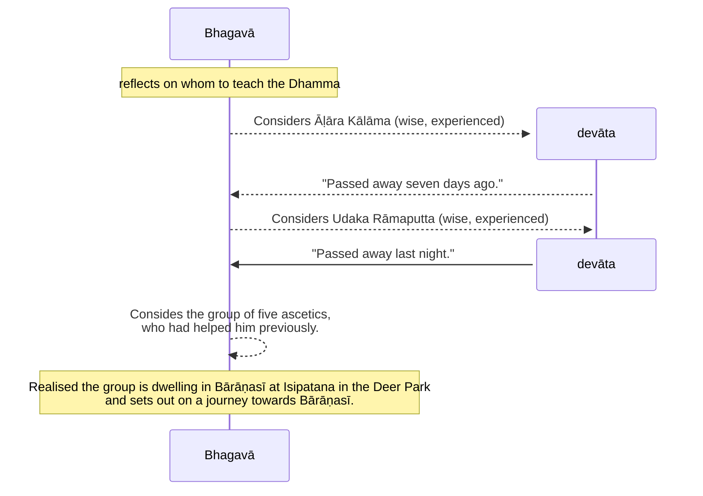

### Upaka

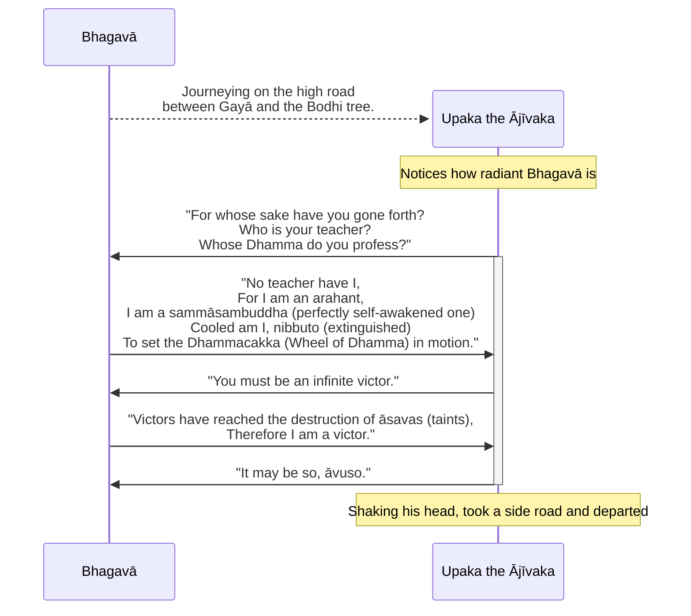

### The Five Ascetics

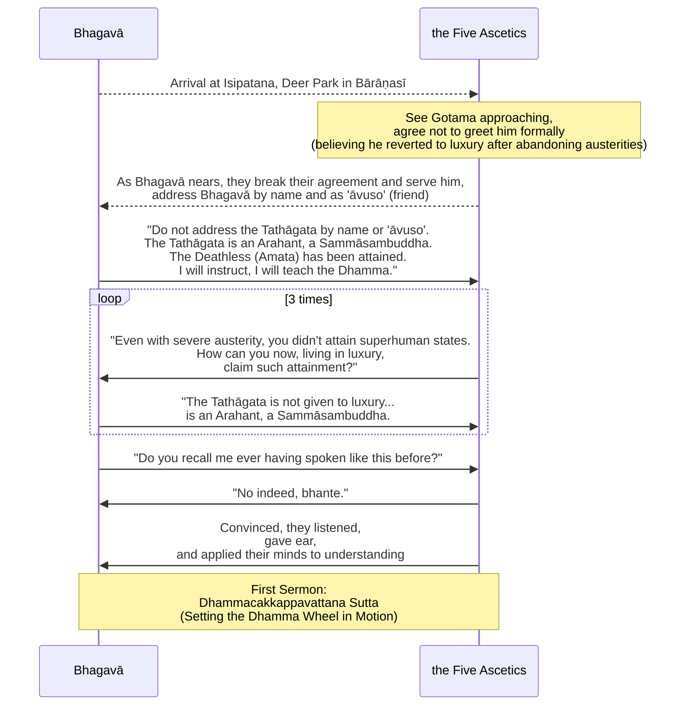

### The Middle Way (Majjhimā Paṭipadā)

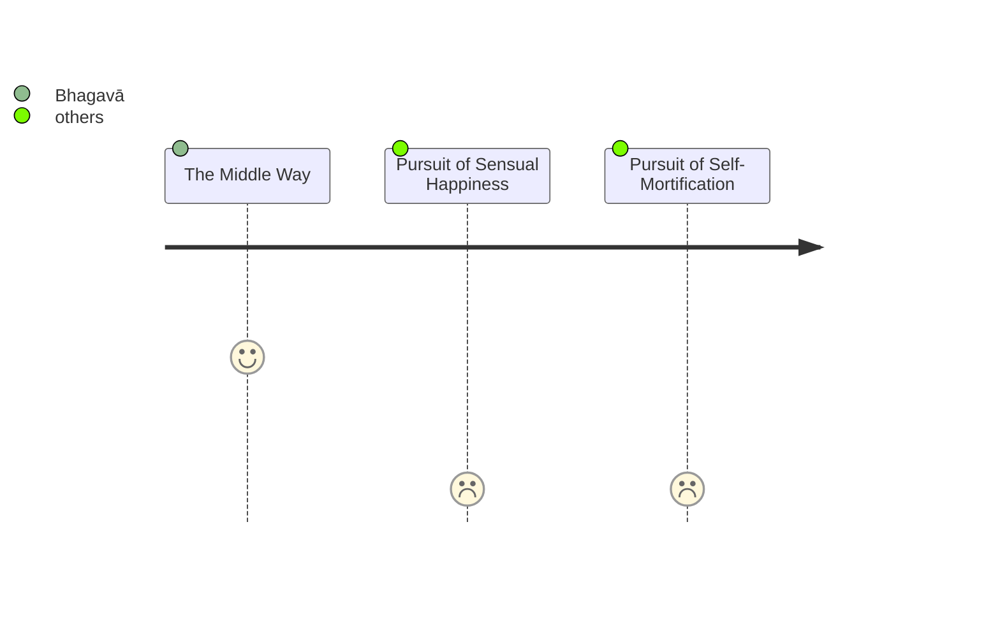

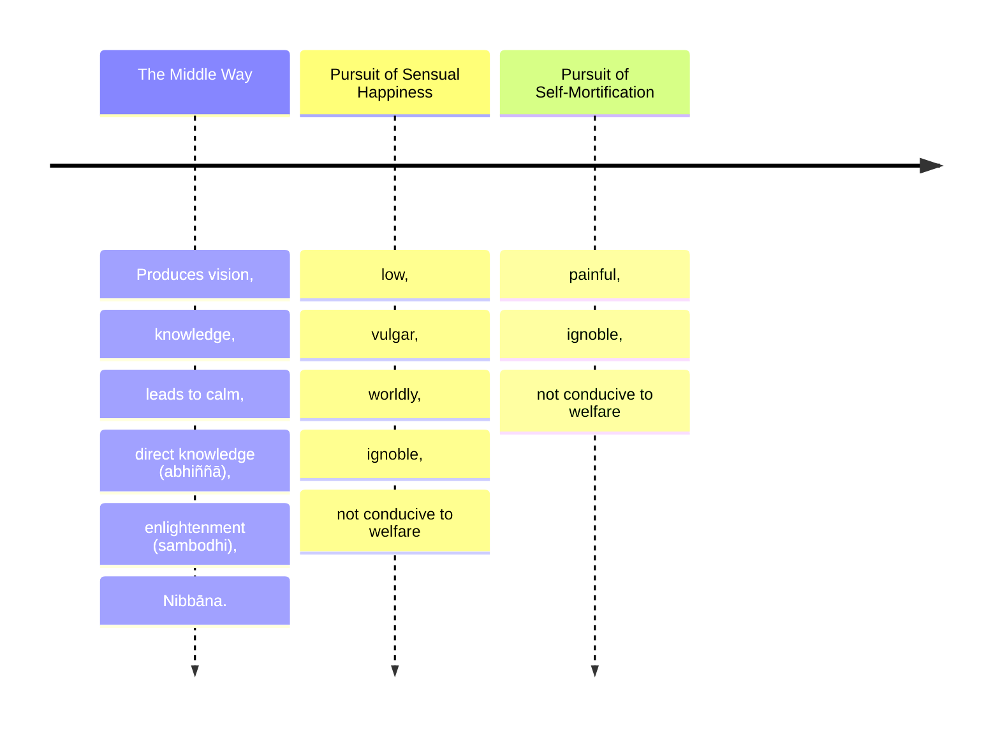

### The Ariya Eightfold Path (Ariyo Aṭṭhaṅgiko Maggo)

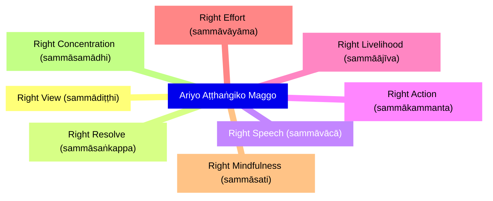

### The Four Realisations (caturāriyasaccāni)

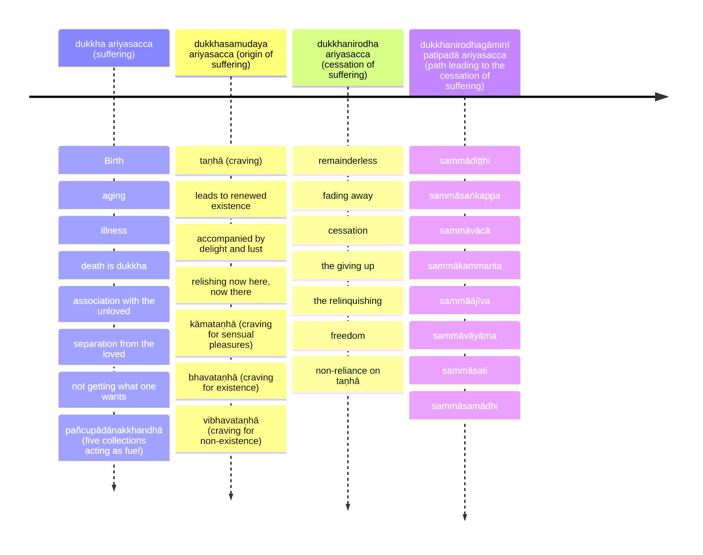

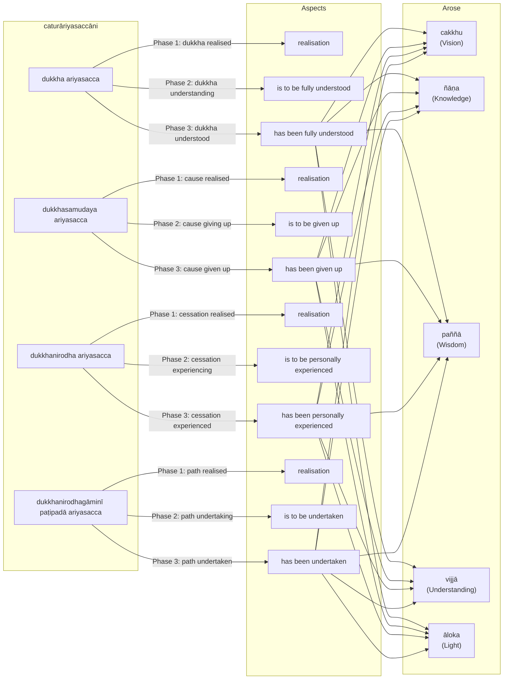

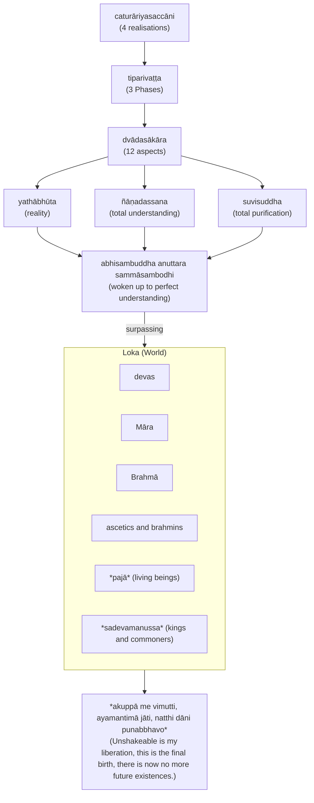

### Koṇḍañña has understood

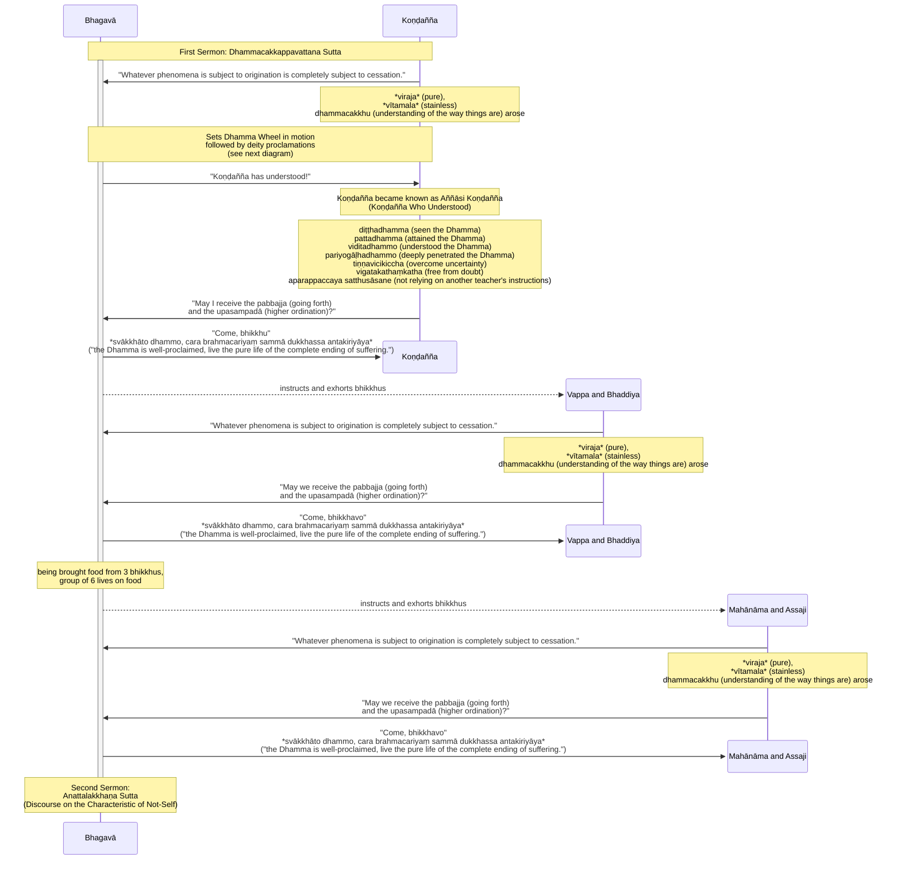

### Anattalakkhaṇa Sutta

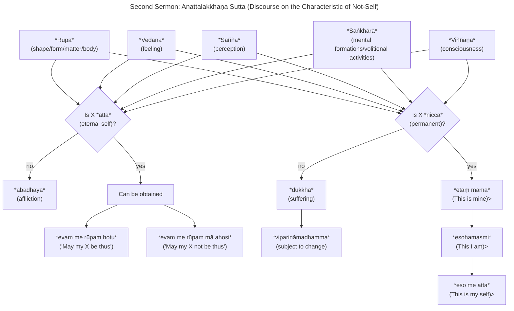

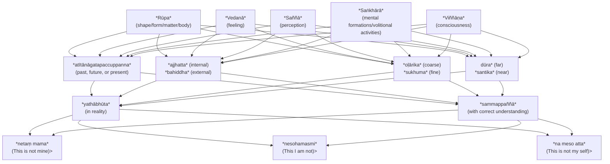

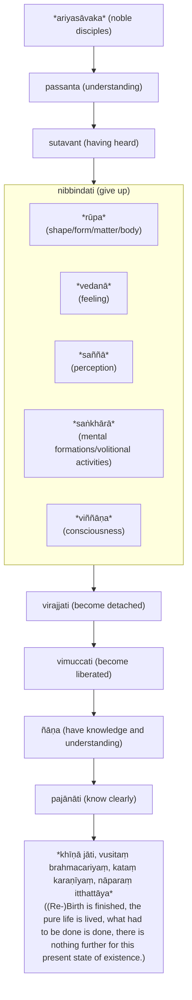

## Text

(10.)

53\. Then this occurred to the Bhagavā: "To whom indeed should I first teach the dhamma (teaching)? Who will understand this dhamma quickly?" Then this occurred to the Bhagavā: "This Āḷāra Kālāma is wise, experienced, intelligent, for a long time of a nature with little dust; what if I were to teach the dhamma first to Āḷāra Kālāma, he will understand this dhamma quickly." Then an invisible deity informed the Bhagavā: "Bhante, Āḷāra Kālāma passed away seven days ago." And to the Bhagavā also knowledge arose: "Āḷāra Kālāma passed away seven days ago." Then this occurred to the Bhagavā: "Āḷāra Kālāma was of great understanding; if indeed he had heard this dhamma, he would have understood it quickly."

54\. Then this occurred to the Bhagavā: "To whom indeed should I first teach the dhamma? Who will understand this dhamma quickly?" Then this occurred to the Bhagavā: "This Udaka Rāmaputta is wise, experienced, intelligent, for a long time of a nature with little dust; what if I were to teach the dhamma first to Udaka Rāmaputta, he will understand this dhamma quickly." Then an invisible deity informed the Bhagavā: "Bhante, Udaka Rāmaputta passed away last night." And to the Bhagavā also knowledge arose: "Udaka Rāmaputta passed away last night." Then this occurred to the Bhagavā: "Udaka Rāmaputta was of great understanding; if indeed he had heard this dhamma, he would have understood it quickly."

55\. Then this occurred to the Bhagavā: "To whom indeed should I first teach the dhamma? Who will understand this dhamma quickly?" Then this occurred to the Bhagavā: "The group of five bhikkhū (ascetics) were very helpful to me, who attended me when I was striving in exertion; what if I were to teach the dhamma first to the group of five bhikkhū." Then this occurred to the Bhagavā: "Where now are the group of five bhikkhū dwelling?" The Bhagavā saw with clear divine vision, surpassing normal human ability, the group of five bhikkhū dwelling in Bārāṇasī at Isipatana in the Deer Park. Then the Bhagavā, having dwelt in Uruvelā as long as he wished, set out on a journey towards Bārāṇasī.

(11.)

56\. Upaka the Ājīvaka saw the Bhagavā journeying on the high road between Gayā and the Bodhi tree, and having seen the Bhagavā, he said this: "Your faculties, āvuso, are very clear, your skin-complexion is pure and bright. For whose sake, āvuso, have you gone forth? Or who is your teacher? Or whose dhamma do you profess?" When this was said, the Bhagavā addressed Upaka the Ājīvaka in verses:

57\. _"All-conquering, all-knowing am I,_  \
_In all dhammas (phenomena) undefiled;_  \
_All-abandoning, liberated in the destruction of taṇhā (craving),_  \
_Having known for myself, whom should I point to?_  

58\. _No teacher have I,_  \
_One like me is not found;_  \
_In the world with its devas,_  \
_There is no one to rival me._  

59\. _For I am an arahant (worthy one) in the world,_  \
_I am the teacher unexcelled;_  \
_Alone I am a sammāsambuddha (perfectly self-awakened one),_  \
_Cooled am I, nibbuto (extinguished)._  

60\. _To set the Dhammacakka (Wheel of Dhamma) in motion,_  \
_I go to the city of Kāsī;_  \
_In a world become blind,_  \
_I shall beat the drum of the amata (deathless)."_  

61\. "As you, āvuso, declare, you must be an infinite victor."

62\. _"Victors indeed are those like me,_  \
_Who have reached the destruction of āsavas (taints);_  \
_Conquered by me are evil dhammas,_  \
_Therefore, Upaka, I am a victor."_  

63\. When this was said, Upaka the Ājīvaka, saying, "It may be so, āvuso," shaking his head, took a side road and departed.

(12.)

64\. Then the Bhagavā, journeying by stages, approached Bārāṇasī, Isipatana, the Deer Park, where the group of five bhikkhū were. The group of five bhikkhū saw the Bhagavā coming from afar; having seen him, they made an agreement among themselves: "āvuso, this ascetic Gotama is coming, who is given to luxury, has strayed from striving, and has reverted to luxury. He should not be greeted, nor stood up for, nor should his bowl and robe be received; however, a seat should be prepared, if he wishes, he will sit down." But as the Bhagavā approached the group of five bhikkhū, the group of five bhikkhū were not able to abide by their own agreement. Not abiding by it, they went to meet the Bhagavā: one took his bowl and robe, one prepared a seat, one brought water for the feet, one a footstool, one a foot-towel. The Bhagavā sat down on the prepared seat; having sat down, the Bhagavā washed his feet. And they addressed the Bhagavā by name and with the term 'āvuso'.

65\. When this was said, the Bhagavā said this to the group of five bhikkhū: "Do not, bhikkhave, address the Tathāgata by name and with the term 'āvuso'. The Tathāgata, bhikkhave, is an Arahant, a `sammāsambuddha`. Give ear, bhikkhave, the `amata` (deathless) has been attained, I will instruct, I will teach the dhamma. Practicing according to the instruction, you will soon — for the sake of which clansmen rightly go forth from home into homelessness, that unsurpassed—culmination of the `brahmacariya` (disciplined life), realise it for yourselves by `abhiññā` (direct knowledge) in this very life, and dwell having attained it." When this was said, the group of five bhikkhū said this to the Bhagavā: "Even with that conduct, āvuso Gotama, with that practice, with that difficult austerity, you did not attain any superhuman state, a distinction in knowledge and vision worthy of the noble ones; how then now, being given to luxury, having strayed from striving, having reverted to luxury, will you attain any superhuman state, a distinction in knowledge and vision worthy of the noble ones?" When this was said, the Bhagavā said this to the group of five bhikkhū: "No, bhikkhave, the Tathāgata is not given to luxury, has not strayed from striving, has not reverted to luxury; the Tathāgata, bhikkhave, is an Arahant, a `sammāsambuddha`. Give ear, bhikkhave, the `amata` has been attained, I will instruct, I will teach the dhamma. Practicing according to the instruction, you will soon — for the sake of which clansmen rightly go forth from home into homelessness, that unsurpassed—culmination of the `brahmacariya`, realize it for yourselves by `abhiññā` in this very life, and dwell having attained it."

66\. For a second time, the group of five bhikkhū said this to the Bhagavā: "Even with that conduct, āvuso Gotama, with that practice, with that difficult austerity, you did not attain any superhuman state, a distinction in knowledge and vision worthy of the noble ones; how then now, being given to luxury, having strayed from striving, having reverted to luxury, will you attain any superhuman state, a distinction in knowledge and vision worthy of the noble ones?" For a second time, the Bhagavā said this to the group of five bhikkhū: "No, bhikkhave, the Tathāgata is not given to luxury, has not strayed from striving, has not reverted to luxury; the Tathāgata, bhikkhave, is an Arahant, a `sammāsambuddha`. Give ear, bhikkhave, the `amata` has been attained, I will instruct, I will teach the dhamma. Practicing according to the instruction, you will soon — for the sake of which clansmen rightly go forth from home into homelessness, that unsurpassed—culmination of the `brahmacariya`, realise it for yourselves by `abhiññā` in this very life, and dwell having attained it." For a third time, the group of five bhikkhū said this to the Bhagavā: "Even with that conduct, āvuso Gotama, with that practice, with that difficult austerity, you did not attain any superhuman state, a distinction in knowledge and vision worthy of the noble ones; how then now, being given to luxury, having strayed from striving, having reverted to luxury, will you attain any superhuman state, a distinction in knowledge and vision worthy of the noble ones?"

67\. When this was said, the Bhagavā said this to the group of five bhikkhū: "Do you, bhikkhave, recall me ever having spoken like this before?" "No indeed, bhante." "The Tathāgata, bhikkhave, is an Arahant, a `sammāsambuddha`. Give ear, bhikkhave, the `amata` has been attained, I will instruct, I will teach the dhamma. Practicing according to the instruction, you will soon — for the sake of which clansmen rightly go forth from home into homelessness, that unsurpassed—culmination of the `brahmacariya`, realize it for yourselves by `abhiññā` in this very life, and dwell having attained it." The Bhagavā was able to convince the group of five bhikkhū. Then the group of five bhikkhū listened to the Bhagavā, gave ear, and applied their minds to understanding.

(13.)

68\. Then the Bhagavā addressed the group of five bhikkhū:

69\. "These two extremes, bhikkhave, should not be cultivated by one who has gone forth. What two? That which is this pursuit of sensual happiness in sensual pleasures, which is low, vulgar, worldly, ignoble, not conducive to welfare; and that which is this pursuit of self-mortification, which is painful, ignoble, not conducive to welfare. Without veering towards either of these two extremes, bhikkhave, the `majjhimā paṭipadā` (Middle Yay) has been `abhisambuddha` (fully awakened) by the Tathāgata, which produces vision, produces knowledge, leads to calm, to `abhiññā`, to `sambodhi` (enlightenment), to `nibbāna` (extinguishment).

70\. And what, bhikkhave, is that `majjhimā paṭipadā` (Middle Way) by the Tathāgata, which produces vision, produces knowledge, leads to calm, to `abhiññā`, to `sambodhi`, to `nibbāna`? It is this very `ariyo aṭṭhaṅgiko maggo` (Eightfold Path), that is to say: `sammādiṭṭhi` (right view), `sammāsaṅkappa` (right resolve), `sammāvācā` (right speech), `sammākammanta` (right action), `sammāājīva` (right livelihood), `sammāvāyāma` (right effort), `sammāsati` (right awareness), `sammāsamādhi` (right focus). This, bhikkhave, is that `majjhimā paṭipadā abhisambuddha` by the Tathāgata, which produces vision, produces knowledge, leads to calm, to `abhiññā`, to `sambodhi`, to nibbāna.

(14.)

71\. Now this, bhikkhave, is the `dukkha ariyasacca` (realisation of suffering). Birth is `dukkha` (suffering), aging is `dukkha`, illness is `dukkha`, death is `dukkha`, association with the unloved is `dukkha`, separation from the loved is `dukkha`, not getting what one wants is `dukkha`. In short, the `pañcupādānakkhandhā` (five collections acting as a fuel) are `dukkha`.

72\. Now this, bhikkhave, is the `dukkhasamudaya ariyasacca` (realisation of the origin of suffering): it is this `taṇhā` (craving) which leads to renewed existence, accompanied by delight and lust, relishing now here, now there; that is to say, `kāmataṇhā` (craving for sensual pleasures), `bhavataṇhā` (craving for existence), `vibhavataṇhā` (craving for non-existence).

73\. Now this, bhikkhave, is the `dukkhanirodha ariyasacca` (realisation of the cessation of suffering): it is the remainderless fading away and cessation of that same taṇhā, the giving up, the relinquishing of it, freedom from it, non-reliance on it.

74\. Now this, bhikkhave, is the `dukkhanirodhagāminī paṭipadā ariyasacca` (realisation of the path leading to the cessation of suffering): it is this very `ariyo aṭṭhaṅgiko maggo`, that is to say: `sammādiṭṭhi`, `sammāsaṅkappa`, `sammāvācā`, `sammākammanta`, `sammāājīva`, `sammāvāyāma`, `sammāsati`, `sammāsamādhi`.

(15.)

75\. 'This is the `dukkha ariyasacca`' (realisation of suffering): thus, bhikkhave, concerning dhammas not heard before, `cakkhuṃ` (insight) arose in me, `ñāṇaṃ` (knowledge) arose, `paññā` (wisdom) arose, `vijjā` (understanding) arose, `āloko` (light) arose. 'This dukkha ariyasacca should be `pariññeyyanti` (fully understood)': thus, bhikkhave, concerning dhammas not heard before, insight arose in me, knowledge arose, wisdom arose, understanding arose, light arose. 'This `dukkha ariyasacca` has been fully understood': thus, bhikkhave, concerning dhammas not heard before, insight arose in me, knowledge arose, wisdom arose, understanding arose, light arose.

76\. 'This is the `dukkhasamudaya ariyasacca`' (realisation of the origin of suffering): thus, bhikkhave, concerning dhammas not heard before, insight arose in me, knowledge arose, wisdom arose, understanding arose, light arose. 'This `dukkhasamudaya ariyasacca` should be `pahātabbanti` (given up)': thus, bhikkhave, concerning dhammas not heard before, insight arose in me, knowledge arose, wisdom arose, understanding arose, light arose. 'This `dukkhasamudaya ariyasacca` has been abandoned': thus, bhikkhave, concerning dhammas not heard before, insight arose in me, knowledge arose, wisdom arose, understanding arose, light arose.

77\. 'This is the `dukkhanirodha ariyasacca`' (realisation of the cessation of suffering): thus, bhikkhave, concerning dhammas not heard before, insight arose in me, knowledge arose, wisdom arose, understanding arose, light arose. 'This `dukkhanirodha ariyasacca` should be be `sacchikātabbanti` (personally experienced)': thus, bhikkhave, concerning dhammas not heard before, insight arose in me, knowledge arose, wisdom arose, understanding arose, light arose. 'This `dukkhanirodha ariyasacca` has been personally experienced': thus, bhikkhave, concerning dhammas not heard before, insight arose in me, knowledge arose, wisdom arose, understanding arose, light arose.

78\. 'This is the `dukkhanirodhagāminī paṭipadā ariyasacca`' (realisation of the path leading to the cessation of suffering): thus, bhikkhave, insight concerning dhammas not heard before  arose in me, knowledge arose, wisdom arose, understanding arose, light arose. 'This `dukkhanirodhagāminī paṭipadā ariyasacca` should be `bhāvetabbanti` (developed)': thus, bhikkhave, concerning dhammas not heard before, insight arose in me, knowledge arose, wisdom arose, understanding arose, light arose. 'This `dukkhanirodhagāminī paṭipadā ariyasacca` has been developed': thus, bhikkhave, concerning dhammas not heard before, insight arose in me, knowledge arose, wisdom arose, understanding arose, light arose.

(16.)

79\. And as long as, bhikkhave, I did not have `yathābhūta` (in reality) `ñāṇadassana` (total understanding) and `suvisuddha` (total purification) in these four realisations with `tiparivaṭṭa` (three phases) and `dvādasākāra` (twelve aspects), then, bhikkhave, I did not claim to have `abhisambuddha anuttara sammāsambodhi` (woken up to perfect understanding) in this world having devas, Māra, Brahmā, ascetics and brahmins, `pajā` (living beings), `sadevamanussa` (kings and commoners).

80\. But when, bhikkhave, I had `yathābhūta` (in reality) `ñāṇadassana` (total understanding) and `suvisuddha` (total purification) in these four realisations with `tiparivaṭṭa` (three phases) and `dvādasākāra` (twelve aspects), then, bhikkhave, I claimed to have abhisambuddha anuttara sammāsambodhi (woken up to perfect understanding unsurpassed by anything) in this world having devas, Māra, Brahmā, ascetics and brahmins, `pajā` (living beings), `sadevamanussa` (kings and commoners). And from my knowledge, the insight arose: `akuppā me vimutti, ayamantimā jāti, natthi dāni punabbhavo` ("Unshakeable is my liberation, this is the final birth, there is now no more future existences.") This the Bhagavā said, and the group of five bhikkhū, delighted, rejoiced in the Bhagavā's words.

81\. And while this detailed exposition was being spoken, there arose in āyasmant Koṇḍañña the `viraja` (pure), `vītamala` (stainless) `dhammacakkhu` (understanding of the way things are): `yaṃ kiñci samudayadhammaṃ sabbaṃ taṃ nirodhadhamman` ("Whatever phenomena is subject to origination is completely subject to cessation.")

(17.)

82\. And when the Dhammacakka (Dhamma wheel) had been set in motion by the Bhagavā, `bhummā devā` (the earth-dwelling devas) raised a cry: "This unsurpassed Dhammacakka has been set in motion by the Bhagavā in Bārāṇasī, at Isipatana in the Deer Park, which cannot be stopped by any ascetic or brahmin or deva or Māra or Brahmā or by anyone in the world." Hearing the cry of the earth-dwelling devas, the Cātumahārājikā devas raised a cry. Hearing the cry of the Cātumahārājikā devas, the Tāvatiṃsa devas raised a cry. Hearing the cry of the Tāvatiṃsa devas, the Yāma devas raised a cry. Hearing the cry of the Yāma devas, the Tusita devas raised a cry. Hearing the cry of the Tusita devas, the Nimmānaratī devas raised a cry. Hearing the cry of the Nimmānaratī devas, the Paranimmitavasavattī devas raised a cry. Hearing the cry of the Paranimmitavasavattī devas, the Brahmakāyika devas raised a cry: "This unsurpassed Dhammacakka has been set in motion by the Bhagavā in Bārāṇasī, at Isipatana in the Deer Park, which cannot be stopped by any ascetic or brahmin or deva or Māra or Brahmā or by anyone in the world."

83\. Thus indeed, in that moment, in that instant, in that flash, the sound arose up to `brahmalokā` (the Brahma world). And this `dasasahassilokadhātu` (ten thousand-fold world system) trembled, trembled, quaked; and an immeasurable and excellent `obhāso` (radiance) appeared in the world, surpassing the divine majesty of the deities.

84\. Then the Bhagavā uttered this inspired utterance: "Indeed, bho Koṇḍañña has understood! Indeed, bho Koṇḍañña has understood!" Thus it was that āyasmato Koṇḍañña came to be known as `Aññāsi Koṇḍañña` (Koṇḍañña Who Understood).

(18.)

85\. Then āyasmā Aññāsi Koṇḍañña, `diṭṭhadhamma` (who has seen the Dhamma), `pattadhamma` (attained the Dhamma), `viditadhammo` (understood the Dhamma), `pariyogāḷhadhammo` (deeply penetrated the Dhamma), `tiṇṇavicikiccha` (overcome uncertainty), `vigatakathaṃkatha` (free from doubt), `aparappaccaya satthusāsane` (not relying on another teacher's instructions), said this to the Bhagavā: "May I, bhante, receive the `pabbajja` (going forth) in the Bhagavā's presence, may I receive the `upasampadā` (higher ordination)?" "Come, bhikkhu," the Bhagavā said, `svākkhāto dhammo, cara brahmacariyaṃ sammā dukkhassa antakiriyāya` ("the Dhamma is well-proclaimed, live the optimal life of the complete ending of suffering.") That itself was the `upasampadā` for that āyasmant.

(19.)

86\. Then the Bhagavā instructed and exhorted the remaining bhikkhū with a Dhamma talk. Then, while āyasmant Vappa and āyasmant Bhaddiya were being instructed and exhorted by the Bhagavā with a Dhamma talk, the dust-free, stainless `dhammacakkhu` arose in them: "Whatever is subject to origination is all subject to cessation." They, `diṭṭhadhamma` (who has seen the Dhamma), `pattadhamma` (attained the Dhamma), `viditadhammo` (understood the Dhamma), `pariyogāḷhadhammo` (deeply penetrated the Dhamma), `tiṇṇavicikiccha` (overcome uncertainty), `vigatakathaṃkatha` (free from doubt), `aparappaccaya satthusāsane` (not relying on another teacher's instructions), said this to the Bhagavā: "May we, Bhante, receive the `pabbajja` in the Bhagavā's presence, may we receive the `upasampadā`?" "Come, bhikkhavo," the Bhagavā said, "the Dhamma is well-proclaimed, live the `brahmacariya` for the complete ending of `dukkha` (suffering)." That itself was the `upasampadā` for those āyasmants.

87\. Then the Bhagavā, being brought food, instructed and exhorted the remaining bhikkhū with a Dhamma talk. What the three bhikkhū bring from their alms round, with that the group of six sustain themselves. Then, while āyasmant Mahānāma and āyasmant Assaji were being instructed and exhorted by the Bhagavā with a Dhamma talk, the dust-free, stainless `dhammacakkhu` arose in them: "Whatever is subject to origination is all subject to cessation." They,  `diṭṭhadhamma` (who has seen the Dhamma), `pattadhamma` (attained the Dhamma), `viditadhammo` (understood the Dhamma), `pariyogāḷhadhammo` (deeply penetrated the Dhamma), `tiṇṇavicikiccha` (overcome uncertainty), `vigatakathaṃkatha` (free from doubt), `aparappaccaya satthusāsane` (not relying on another teacher's instructions), said this to the Bhagavā: "May we, Bhante, receive the `pabbajja` in the Bhagavā's presence, may we receive the `upasampadā`?" "Come, bhikkhavo," the Bhagavā said, "the Dhamma is well-proclaimed, live the `brahmacariya` for the complete ending of `dukkha` (suffering)." That itself was the `upasampadā` for those āyasmants.

(20.)

88\. Then the Bhagavā addressed the group of five bhikkhū:

89\. `Rūpa` (shape/form/matter/body), bhikkhave, is `anatta` (not-self). And indeed here, bhikkhave, if `rūpa` is `atta` (conception of an everlasting permanent self), this `rūpa` would not lead to `ābādhāya` (affliction), and `rūpa` can be obtained: `evaṃ me rūpaṃ hotu, evaṃ me rūpaṃ mā ahosī` ('May my form be thus, may my form not be thus.’) And because indeed, bhikkhave, `rūpa` is `anatta` (not-self), therefore `rūpa` leads to affliction, and it cannot be obtained: May my form be thus, may my form not be thus.’

90\. `Vedanā` (feeling), bhikkhave, is `anatta` (not-self). And indeed here, bhikkhave, if `vedanā` is `atta`, this `vedanā` would not lead to affliction, and `vedanā` can be obtained: 'May my `vedanā` be thus, may my `vedanā` not be thus.’ And because indeed, bhikkhave, `vedanā` is `anatta` (not-self), therefore `vedanā` leads to affliction, and it cannot be obtained: May my feelings be thus, may my feelings not be thus.’

91\. `Saññā` (perception), bhikkhave, is anatta (not-self). And indeed here, bhikkhave, if `saññā` is `atta`, this `saññā` would not lead to affliction, and `saññā` can be obtained: 'May my `saññā` be thus, may my `saññā` not be thus.’ And because indeed, bhikkhave, `saññā` is anatta (not-self), therefore `saññā` leads to affliction, and it cannot be obtained: May my `saññā` be thus, may my `saññā` not be thus.’

92\. `Saṅkhārā` (mental formations/volitional activities), bhikkhave, is `anatta` (not-self). And indeed here, bhikkhave, if `saṅkhārā` is `atta`, this `saṅkhārā` would not lead to affliction, and `saṅkhārā` can be obtained: 'May my `saṅkhārā` be thus, may my `saṅkhārā` not be thus.’ And because indeed, bhikkhave, `saṅkhārā` is anatta (not-self), therefore `saṅkhārā` leads to affliction, and it cannot be obtained: May my `saṅkhārā` be thus, may my `saṅkhārā` not be thus.’

93\. `Viññāṇa` (consciousness), bhikkhave, is `anatta` (not-self). And indeed here, bhikkhave, if `viññāṇa` is `atta`, this `viññāṇa` would not lead to affliction, and `viññāṇa` can be obtained: 'May my `viññāṇa` be thus, may my `viññāṇa` not be thus.’ And because indeed, bhikkhave, `viññāṇa` is anatta (not-self), therefore `viññāṇa` leads to affliction, and it cannot be obtained: May my `viññāṇa` be thus, may my `viññāṇa` not be thus.’

(21.)

94\. "Bhikkhave, what do you consider: is `rūpa` `nicca` (permanent) or `anicca` (impermanent)?" "`Anicca`, bhante." "Now, is that which is impermanent `dukkha` (suffering) or `sukha` (happiness)?" "`Dukkha`, bhante." "Now, is it proper to regard that which is `anicca`, `dukkha`, and `vipariṇāmadhamma` (subject to change), as: `etaṃ mama, esohamasmi, eso me atta` ('This is mine, this I am, this is my `attā` (self)')?" "Of course not, bhante.”

95\. "Bhikkhave, what do you consider: is `vedanā` permanent or impermanent?" "Impermanent, bhante." "Now, is that which is impermanent dissatisfaction or satisfaction ?" "Dissatisfaction, bhante." "Now, is it proper to regard that which is impermanent, dissatisfying, and subject to change, as: 'This is mine, this I am, this is my `attā` (self)'?" "Of course not, bhante.”

96\. "Bhikkhave, what do you consider: is `saññā` permanent or impermanent?" "Impermanent, bhante." "Now, is that which is impermanent dissatisfaction or satisfaction ?" "Dissatisfaction, bhante." "Now, is it proper to regard that which is impermanent, dissatisfying, and subject to change, as: 'This is mine, this I am, this is my `attā` (self)'?" "Of course not, bhante.”

97\. "Bhikkhave, what do you consider: is `saṅkhārā` permanent or impermanent?" "Impermanent, bhante." "Now, is that which is impermanent dissatisfaction or satisfaction ?" "Dissatisfaction, bhante." "Now, is it proper to regard that which is impermanent, dissatisfying, and subject to change, as: 'This is mine, this I am, this is my `attā` (self)'?" "Of course not, bhante.”

98\. "Bhikkhave, what do you consider: is `viññāṇa` permanent or impermanent?" "Impermanent, bhante." "Now, is that which is impermanent dissatisfaction or satisfaction ?" "Dissatisfaction, bhante." "Now, is it proper to regard that which is impermanent, dissatisfying, and subject to change, as: 'This is mine, this I am, this is my `attā` (self)'?" "Of course not, bhante.”

(22.)

99\. "Therefore, bhikkhave, whatever `rūpa` there is, `atītānāgatapaccuppanna` (past, future, or present), `ajjhatta` (internal) or `bahiddha` (external), `oḷārika` (coarse) or `sukhuma` (fine), `hīna` (inferior) or `paṇīta` (superior), `dūra` (far) or `santika` (near), all `rūpa` `daṭṭhabba` (should be regarded as) `yathābhūta` (in reality), `sammappaññā` (with correct understanding) thus: `netaṃ mama, nesohamasmi, na meso atta` ('This is not mine, this I am not, this is not my attā.')

100\. Whatever `vedanā` there is, past, future, or present, internal or external, coarse or fine, inferior or superior, far or near, all `vedanā` should be seen as it really is, with correct understand, thus: 'This is not mine, this I am not, this is not my attā.'

101\. Whatever `saññā` there is, past, future, or present, internal or external, coarse or fine, inferior or superior, far or near, all `saññā` should be seen as it really is, with correct understand, thus: 'This is not mine, this I am not, this is not my attā.'

102\. Whatever `saṅkhārā` there is, past, future, or present, internal or external, coarse or fine, inferior or superior, far or near, all `saṅkhārā` should be seen as it really is, with correct understand, thus: 'This is not mine, this I am not, this is not my attā.'

103\. Whatever `viññāṇa` there is, past, future, or present, internal or external, coarse or fine, inferior or superior, far or near, all `viññāṇa` should be seen as it really is, with correct understand, thus: 'This is not mine, this I am not, this is not my attā.'

(23.)

104\. Thus understanding, bhikkhave, `sutavā` (having heard), the  `ariyasāvaka` (noble disciples) `nibbindati` (give up) `rūpa`, `vedanā`, `saññā`, `saṅkhārā`, and `viññāṇa`; from giving up they `virajjati` (become detached), being detached they `vimuccati` (become liberated); through liberation, they have `ñāṇa` (knowledge and understanding) of liberation; they `pajānāti` (know clearly): `khīṇā jāti, vusitaṃ brahmacariyaṃ, kataṃ karaṇīyaṃ, nāparaṃ itthattāya` ("(Re-)Birth is finished, the pure life is lived, what had to be done is done, there is nothing further for this present state of existence.")

(24.)

105\. The Bhagavā said this. `Attamana` (with independent minds), the group of five bhikkhus `abhinandi` (approved of) the Buddha's statement. And moreover, when this `veyyākaraṇa` (detailed exposition) was being spoken, the `citta` (minds) of the five bhikkhus, `anupādāya āsavehi` (not grasping the defilements) `vimucci` (became liberated). Then, there were six arahants (worthy ones) in the world.

---

106\. The Story of the Group of Five is finished.

  
First Recitation Section.

## Commentary

The first two discourses to the group of five represent the core of the Buddha's initial teaching, and in this account the teaching was sufficient to result in liberation for all five.

### Deciding who to teach

Initially, his internal monologue reflects a rational assessment of potential recipients for his `dhamma` (teaching), based on their perceived intellectual acuity and experiential readiness. The "invisible deity" and subsequent "knowledge" arising can be understood rationally as moments of intuitive insight or the crystallisation of information, experienced as an external confirmation but rooted in his own cognitive processes.

### Encounter with Upaka

His encounter with Upaka showcases the Bhagavā's profound conviction in his self-achieved, unique understanding. His claims of being "all-conquering" and "all-knowing" refer to a mastery over his own experience and a comprehensive insight into the nature of `dhamma`s (phenomena as experienced), rather than objective omniscience in a metaphysical sense. He describes a state of liberation achieved through direct, personal investigation ("Having known for myself"), a core tenet of phenomenological inquiry.

Upaka, despite being initially interested and receptive, dismisses the Bhagavā for his seemingly arrogant and exalted claims of his achievements. This was a valuable lesson for the Bhagavā - he needed to temper and adjust his elocution style, otherwise he risks alienating potential followers. Later on the Bhagavā adopts an improved approach which brings him great success in educating [Yasa, his family and friends](./1.7.md), the [Bhaddavaggiya group](./1.11.md) and ultimately [King Seniya Bimbisāra](./1.13.md).

### The Five Ascetics

The initial skepticism of the five ascetics is a rational response based on their prior observation of his ascetic practices. Their eventual persuasion hinges not on supernatural displays, but on the perceived authenticity of his transformed state and the compelling nature of his new experiential framework. The Bhagavā’s argument rests on the observable change in his demeanour and the unprecedented nature of his current assertions. The Buddha has learnt from his mistake in his encounter with Upaka, but is still adjusting and tempering his teaching style.

### The Middle Way

The core teaching introduced, the "Middle Way," is a principle derived from direct experience: avoiding the extremes of sensual indulgence and self-mortification, both of which are found to be unproductive for achieving clarity and insight into the nature of experience. It leads to "vision" and "knowledge" — direct, experiential understanding.

### The Eightfold Path

The Middle Way is best undertaken by following the "Eightfold Path" (`ariyo aṭṭhaṅgiko maggo`). Note, the constituents of the eightfold path are not explained in the narrative, but they are explained elsewhere in the Suttapiṭaka. Therefore it is uncertain whether these explanations originated with the Buddha, or were later interpreted and expanded by disciples trying to understand his teachings. I prefer to adopt the conservative attitude that the Buddha did not originally explain the eightfold path, so the terms used reflect the common meaning of the words rather than the technical meanings in the explanations.

The Buddha may have many reasons for not explaining the path. Firstly, he may have felt the terms are self explanatory (see below). He also think it best to leave the terms unexplained, because the exact implementation of the path may depend on the individual (due to phenomenal and subjective perception). Finally, at this stage in his teaching career, he may not have yet thought too deeply what these terms may imply.

`ariya` can mean many things, such as "noble", "distinguished", of high birth, member of the Aryan race, etc. but in this instance is referring to those who are awakened or liberated. I have decided to leave this word untranslated as it is clear the path that is referred is being expounded by someone who is awakened and liberated and intended for those who wish to achieve the same goal.

Therefore the Buddha is simply saying the path to the cessation of `dukkha` can be guided by exemplary and optimal behaviour and actions - this is completely consistent with the insight from dependent origination.

`sammā` according to the PTS dictionary means "properly, rightly; in the right way, as it ought to be best, perfectly". 
Some Buddhists have weaponised the eightfold path, ie. they use it as a way of criticising those that do not agree with their views. Ie. if someone is articulating a view that they do not agree with, then they accuse their opponent of having "wrong" views, "wrong" speech etc. This is rather unfortunate, and reflects personal, unconscious bias, opinions and a judgemental attitude which is probably the opposite of what the Buddha was trying to say. `sammā` is probably better understood as "optimal" rather than "correct" or "ethical".

Let's examine the contituents using dictionary definitions:

1. `sammādiṭṭhi` (right view): `diṭṭhi` means "view, belief, opinion; theory, doctrine" so in this context is referring to holding correct beliefs or knowledge (which in accordance to dependent origination would be an understanding of the phenomenological framework and perception of reality, and the dependent or causal nature of `dukkha`).

2. `sammāsaṅkappa` (right resolve): `saṅkappa` means "intention; purpose" and it is clear those who wish to undertake the path should have the commitment and the determination to do so.

3. `sammāvācā` (right speech): `vācā` means "word, speech, saying" and could refer to an ethical manner of speaking (ie. avoiding lies and criticisms) but could simply mean saying the appropriate things at the appropriate times, avoiding unnecessary and untruthful and harmful statements etc. The Buddha was fond of twisting words and redefining their meanings, so perhaps right speech simply means the ability to use words skilfully and cleverly to an advantageous purpose.

4. `sammākammanta` (right action): `kammanta` means "what is done, what one does; deed, act, action" and this simply refers to "doing the right thing" where "right" probably refers to the appropriate or correct action from a rational perspective rather than just from a "moral" or "ethical" perspective.

5. `sammāājīva` (right livelihood): `ājīva` means "livelihood, means of subsistence; way of living" and again this is referring to living a way of life that is optimal for the purposes of liberation, and not necessary a specific class of professions. Nor does it necessarily imply a way of living based on renunciation, becoming a recluse or wanderer, or joining a monastic community. Clearly, some Buddhists have interpreted it this way, but at this stage there was no saṅgha and therefore no formal community, and the Buddha's path of becoming a renunciate wanderer was not necessarily a path he advocated to others (as implied by the Middle Way).

6. `sammāvāyāma` (right effort): `vāyāma` means "striving, effort, exertion, endeavour" and again it is fairly clear that those who wish to undertake the path should work diligently towards it.

7. `sammāsati` (right awareness): `sati` can mean many things. The primary meaning is "memory, recognition, consciousness" but it can also mean "intentness of mind, wakefulness of mind, mindfulness alertness, lucidity of mind, self-possession, conscience self-consciousness". This is often mistranslated as "mindfulness" implying a meditative state, but as we understand the Buddha's experience of awakening was not a result of meditation so this is not an exhortation to achieve meditative "mindfulness" but simply advice to be aware and conscious, remembering, recognising and analysing one's past and current mental constructions.

8. `sammāsamādhi` (right focus): PTS translates `samādhi` as "concentration; a concentrated, self-collected, intent state of mind and meditation which, concomitant with right living, is a necessary condition to the attainment of higher wisdom and emancipation" but clearly this is an over-reach and based on retro-fitting a meditative interpretation rather than common usage of the word. Probably a common-usage interpretation would be "concentration" or "focus." Following the eightfold path and replicating the Buddha's awakening and liberation requires a number of related attributes and disposition, including calmness, composure, reflection, focus, contemplation, self-introspection, and I believe this is what the Buddha intended here.

As can be seen from the above analysis, `ariyo aṭṭhaṅgiko maggo` (the eightfold path of the awakened or liberated) can be perfectly understood using commonplace and ordinary definitions of the underlying words and does not require additional explanation or technical definition.

[@Norman1997] claims that the eightfold path represents an "alternate" and more "gradual" way towards awakening:

> The fourth noble truth is about the path which leads to the destruction of suffering, and this was a more gradual way to release, making use of the precepts of the eight-fold path to gain a better rebirth. This is the so-called kammic way. One might hope in time, after entering the stream, by amassing good kamma, to get to the point where the number of future birth in this world would be limited. Rebirths after that would be heavenly rebirths, leading at last to release from samsāra.

This is certainly the way that a lot of Buddhists have interpreted it. However, I note at this stage in the narrative the Buddha has not really defined "kamma" so I don't believe this is an alternate or more gradual path, it simply states the optimal conditions by which awakening can be achieved.

### The Four Realisations

Next the Buddha explains the well known "Four Realisations" (caturāriyasaccāni). This has often been translated as "four noble truths" but, as [@Norman1997], [@Norman2008] and [@Harvey2009] points out, this is not quite the correct translation or interpretation. `sacca` can be translated as "truth" but equally it could mean  'real', 'actual thing', 'reality' (according to [@Harvey2009]). In other words, it is not an eternal or objective "truth" but something that has been realised by the Buddha. As before, I prefer to leave the term `ariya` untranslated as Norman speculates it is probably a later addition as there are some texts that omit it. Hence `caturāriyasaccāni` is best understood as "the four realisations of those who are awakened or liberated" which I shall simply refer as the "four realisations".

The Four Realisations are presented as a structured analysis of lived experience:

1.  **`Dukkha` (suffering/unsatisfactoriness)**: A phenomenological description of the inherent stress and unsatisfactoriness within conditioned existence, observable in birth, aging, illness, death, and the frustration of desires. The "five collections acting as a fuel" (form, feeling, perception, mental formations, consciousness) are identified as the locus of this experienced `dukkha`. Note that the five collections are often translated as "five aggregates" or even "five clinging aggregates" but again I prefer to use the common place definition - these are five "collections" or five "bundles."
2.  **`Samudaya` (origin of `dukkha`)**: The identification of `taṇhā` (craving/thirst) as the psychological mechanism, the experiential driver, behind `dukkha`. This is an observable pattern of attachment and aversion within conscious experience.
3.  **`Nirodha` (cessation of `dukkha`)**: The experiential possibility of `dukkha` ending through the cessation of its cause, `taṇhā`. Although this could point to a transformed state of consciousness, I prefer to describe it as a disposition, a framing of the conscious and the subconscious to instinctively avoid generating mental constructions based on `taṇhā` that would inevitably lead to `dukkha`.
4.  **`Magga` (path to cessation)**: The Eightfold Path, a practical guide to optimal conduct, mental discipline, and wisdom, designed to bring about this cessation by directly altering how one engages with and understands one's own experience.

### Are the Four Realisations a late addition or synthesis rather than what the Buddha may have originally thought?

Some scholars have speculated that the Four Realisations are a late invention, a synthesis and simplification of dependent origination into a framework reminiscent of a medical diagnosis and cure. Clues that the realisations may have been a later synthesis reformulated as the first discourse include the presence of various anomalies and anachronisms embedded within the text. For example, the five collections (`khandha`s) are mentioned as part of the the first noble truth, yet are not introduced and explained until the second discourse. The five ascetics should have been referred to as `samaṇa` (recluses or renunciants) rather than `bhikkhu`, as the `saṅgha` has not been formalised yet. Thirdly, the introduction of the proclamations of the various levels of deities seem fanciful and potentially inserted at a late stage when the Buddha has been reified and his teachings elevated to a religious doctrine.

[@Norman2003] also points out many editions that refer to the four realisations contain syntactic and grammatical errors, indicating a less than perfect mastery of the language, or possibly text that have originated in a local dialect and then converted or standardised into Pāḷi. This accounts for the possibly misleading translation of the four realisations as the "four noble truths" which leads to interpretative and translative difficulties.

For example, [@Bronkhorst2009] comments that "... in some versions of the first sermon — probably the older ones — the Four Noble Truths or other forms of liberating knowledge are not mentioned at all." He also adds that the three phases and 12 aspects are "probably later additions." [@RhysDavids1935] points out that the four realisations are absent from the Fours of the Añguttara-nikāya.

[@Anderson2001] concludes that "the Ariyapariyesana-sutta shows that certain redactors of the canon conceived of the Buddha's act of teaching without the four noble truths" and "... the four noble truths emerged into the canonical tradition at a particular point and slowly became recognized as the first teaching of the Buddha ... [being] a doctrine that came to be identified as the central teaching of the Buddha by the time of the commentaries".

However, [@Anālayo2012] argues against the theory that the Four Realisations are a late addition, proposing instead that the shorter texts are intentional extracts from a longer, multi-part discourse, and that the Mūlasarvāstivāda and Sarvāstivāda traditions considered the teaching on the "three turnings" to be the central element that set the wheel of Dharma in motion.

[@WhatTheBuddhaThought] speculates that "... there was an earlier, probably shorter, version, which contained the gist of the present version; and that the entire text rested on a memory in the Sangha, quite likely buttressed by the Buddha while he was still alive, that those were the topics he talked about on that occasion."

### The "turning" of the Dhamma Wheel

The Bhagavā’s repeated emphasis on "vision arose in me, knowledge arose" concerning these truths underscores the phenomenological basis of his realisation — it is a direct, unmediated seeing into the structure of his own experience, not a received doctrine. Koṇḍañña’s attainment of the "Dhamma-eye" signifies a similar profound shift in his own perceptual and conceptual framework, a direct insight into the principle that "whatever is subject to origination is all subject to cessation." The subsequent proclamation of devas and "world-system shaking" can be interpreted as powerful metaphors for the profound subjective impact and perceived universal significance of this breakthrough in understanding - the devas represent an internal hierarchy of consciousness states and frames of mind that were released by understanding, giving up, personally experiencing and practising the four realisations.

### `anattā` (not-self)

The teaching on `anattā` (not-self) is a detailed phenomenological deconstruction of the conventional notion of a permanent, independent self. By examining the five collections (`rūpa`, `vedanā`, `saññā`, `saṅkhārā`, `viññāṇa`) as they appear in direct experience, their impermanent, conditioned, and uncontrollable nature is revealed. The conclusion that "this is not mine, this I am not, this is not my `attā`" arises from this direct observation. This insight leads to disenchantment with the components of experience previously identified with a "self", followed by dispassion, and ultimately, a liberation from the suffering caused by clinging to these transient phenomena. This liberation is an experiential state, a fundamental alteration in one's relationship to one's own conscious experience.

`anattā` can be a difficult word to translate. Many take it as meaning "no self" (including, apparently, Buddhaghosa). However, [@Norman1997] writes:

> When the Buddha stated that everything was *anattā* "not self", we should expect that the view of *attā* "self" which he was denying was that held by other teachers at that time. We can, in fact, deduce, from what the Buddha rejected, the doctrine which the other teachers upheld. Once we know that the Buddha was using words in this way, then we are aided in our attempt to understand them and translate them.
> 
> The Buddha vigorously denied the brahmanical idea of the existence of the *ātman*, the idea that there is no difference between us and a world spirit, the standard *advaitavāda* "non-dual" doctrine, which is expressed in the Upaniṣads with the words *tat tvam asi* "You are that". You are that. You are identical with that world spirit - the view that we all have a portion of that spirit in us and when everything which hides that identity is removed then we can be absorbed into *ātman*/brahman.
> 
> The Buddha, on the other hand, specifically condemned the view that the world and the self were the same thing, and that after death one might become permanent, lasting, eternal and not liable to change, and he rejected the idea that one could look at the various aspects of the world and say "that is mine, I am that, that is my self', which is a clear echo of *tat tvam asi*, expressed from a different point of view. When the Buddha said: "*rūpa* 'form', etc., are not mine", he was denying the view that there is no distinction between knower and known.
> 
> The Buddha's rejection of the existence of the *attā*, i.e. his view that everything was "not self" (*anattā*), was based upon the brahmanical belief that the *ātman* was nitya "permanent" and sukha "happiness". Hence the Buddha could refute this by pointing out that the world, which was supposed to be part of *ātman*, was in fact anicca "impermanent" and dukkha "misery"[^2-23] - his belief that the world was dukkha was, of course, the first noble truth.
> 
> The Buddha's teaching about this is, however, not always understood. The word *anattā* is sometimes translated "having no soul", and various things which are specified to be *anattā* are thought of as having no soul. We can see the need for better understanding of this vital concept of Buddhism when we survey the range of translations given for the phrase *sabbe dhammā anattā* which occurs in the Dhammapada and elsewhere: "All forms are unreal" (Max Mūller); "All the elements of being are non-self" (Radhakrishnan); "All things are not self" (Acharya Buddharakkhita); "All phenomena are nonsubstantial" (Kalupahana); "All things are ego-less" (Jayasekera); "All dhammas are without self", says a very recent translation (Carter and Palihawadana).
> 
> Translations such as "without self" and "having no soul" cannot be correct, because the grammar and syntax show that *anattā* is not a possessive adjective, which it would need to be to have such a meaning. It is a descriptive compound, and if the correct translation for *attā* is "soul", then the word would mean that these various things are "not soul". This, however, cannot be correct, because the Buddha sometimes exhorted his followers to regard these things as *parato*, i.e. "as other". We cannot, however, co-relate "as other" and "not soul". It is clear that the only translation which it is possible to co-relate to "as other" is "not self". We are not to regard these things as part of the self, and to clarify the point the Buddha asked his followers whether, when they saw wood being burned, they felt any pain. The answer was "No", and the explanation given was that they did not feel any pain because the wood was not part of the self. It was other than the self. We might regard the Buddha's refutation of the *ātman*/*brahman* idea as being somewhat empirical - as was Dr Johnson's refutation of Bishop Berkeley's theory of the non-existence of matter - but it was no less effective for all that.

[@Wynne2010] also does an extensive analysis of "no self" vs "not self" and concludes the explicit "No Self" interpretation developed later, as seen in texts like the *Vajirā Sutta* and the Abhidharma, when this subtle philosophy gave way to a "reductionistic realism" that analyzes the person as a collection of essenceless components within an objectively real world, thus shifting the focus from a radical critique of conceptuality to the denial of a specific entity.

### Free will

It can be interpreted that if we don't have "control" over the five collections, and we mistake them for our notion of a "permanent self", then perhaps we do not have free will. In other words, we are not in control of our destiny, and therefore awakening is not possible until we have cleared ourselves of all impediments.

This is clearly again another unwarranted interpretation of the Buddha's teachings. The Buddha is clearly stating that awakening is possible, by us consciously making a decision to cease production of non-optimal mental constructions. This would also agree with the common view that as individuals we do possess the power of free will.

As per the "no self" view, the Buddha has not claimed that we have "no self" and therefore "no free will." The Buddha skirts around answering the question whether we do in fact have some notion of "self" that is beyond the five collections, and some have argued that there needs to be a concept of an "individual" possessing "free will" in order for the Buddha's teachings to be realised. This is a contentious view that has been argued against by many Buddhists who support the "no self" interpretation, but they have avoided answering the question: If there is no self beyond the five collections, then what is the "agent" responsible for ceasing mental constructions, since the Buddha has stated the five collections have no control over production?

For further discussion, [@Adam2010] argues perhaps it's not a question of "free will" but the degree of freedom in achieving awakening (due to the "burden" or kamma from past actions), and perhaps true freedom is not realised until after awakening. This is an interesting approach, but one that I ultimately reject since there nothing in the Buddha's discourses in the Khandhaka that suggests that there are impediments (from past actions, current circumstances etc.) that inhibit the ability to achieve realisation and awakening, and the concept of "kamma" representing such impediments is not a concept articulated by the Buddha in these discourses (notwithstanding that the concept of "kammma" is extensively explored in the suttas and widely believed by Buddhists).

### `yathābhūta` (reality)

This is a phrase that has often been misunderstood by Buddhists as somehow pertaining to the divine or mystical ability to "see things as they truly are", or perhaps to see things that cannot normally be seen, such as deities and non-human beings in different worlds or realms of existence, the ability to see past lives, other people's thoughts, the true nature of the universe, etc.

These are excessive speculations. What is meant here is clearly that the Buddha was able to perceive the phenomenal nature of our subjective experience of reality.

Was the Buddha a realist or anti-realist? Ie. did he believe that an "extrinsic reality" exists outside of our perceptual experience, and we able to determine what it is, or is "the world an illusion", purely constructed out of our lived experience?

The answer, from the discourses in the Khandhaka, is that the Buddha neither confirmed nor denied the existence of "true" reality. [Smith2015] argues that the Buddha was probably not an anti-realist but propounded 'an intentionally incomplete or "inchoate" metaphysics with realist suggestions'.

On one hand, it would seem the Buddha did experience a reality post awakening - he experienced sickness, physical pain and eventually death. He still needed to eat, rest and sleep. These are documented in the Khandhaka and various suttas. So it would seem `yathābhūta` does not exclude these very human experiences. Moreover, this reality was shared with the bhikkhus in the community. Living in peace post `nibbāna` does not exclude potentially unpleasant events. `nibbāna` simply represents what in "unconstructed", "ungenerated" and therefore "unexperienced." Physical pain need not result in feelings of suffering - the former is extrinsic reality, the latter are mental constructions.

On the other hand, it could be argued that the ability to perform "magic" or supernatural powers, or the ability to perceive and interact with non-human or celestial beings could imply reality is purely constructed, and can therefore be reconstructed or altered by the Buddha. Moreover, it could also imply the Buddha was able to influence the constructed reality of other beings. This is clearly possible if these other beings were also constructed by him, but then the Buddha's teachings would then be interpreted as him teaching other personality instances of himself.

Generations of Buddhists of different sects have probably speculated on the true nature of reality. Theravādins believe that reality (`dhamma`) can be ultimately deconstructed into "moments" - atomic mental constructions. The true nature of reality (or "ultimate reality") are simply these moments and nothing more. There is no other reality (that can be perceived by or known to us). Hence the `dhamma` of mind moments is reality.

The Sarvāstivādins extended the concept of these dhammas, or "mind moments", even further - not only do they postulate that ultimately reality is nothing more than these mind moments - they believe the past, present and future are nothing more than these `dhamma`s - they all simultaneously exist in our minds. This is true to an extent - our memories of the past coexist along with our present thoughts and conceptions about the future. However, the Sarvāstivādins are essentially claiming time itself is constructed, and subjectively experienced. This would imply a deterministic universe - that the future can be fully determined from the actions of the past and present. However, it does not necessarily imply we have no free will - by unconstructing these dhammas, we are essentially unconstructing the future.

In a sense, the Sarvāstivādin notion of `dhamma` resembles the [one-electron universe](https://en.wikipedia.org/wiki/One-electron_universe) theory, proposed by John Wheeler and further explored by Richard Feynman. This is a speculative hypothesis suggesting that all electrons and positrons (the antimatter counterpart of an electron) are actually manifestations of a single, fundamental entity traversing through time.

The Mahāyānans took this concept to it's ultimate conclusion: if our reality is nothing more than mind moments, which are constructed by us, then reality is nothing more than an illusion - there is no physical reality, only constructed reality. Therefore, `yathābhūta` ultimately is the experience of emptiness, or no experience at all. Once we realise everything is constructed, we can deconstruct it all and then there is nothing left (`suññatā`). This is the fundamental realisation in the Heart Sutra, a highly influential work that have been embraced by many, even today, though not all fully understand it's core thesis.

All these are extensions of the Buddha's teachings. As can be seen in these early discourses, they are not necessarily implied or explicitly articulated by him.

### `punabbhavo` (future existences)

> `akuppā me vimutti, ayamantimā jāti, natthi dāni punabbhavo` \
> ("Unshakeable is my liberation, this is the final birth, there is now no more future existences.")

This phrase has often been interpreted as the Buddha claiming he is no longer subject to `saṃsāra` (the endless cycle of births and rebirths).

However, note that up to this point the Buddha has not explicitly mentioned rebirth. Yes, `jāti` can be used to refer to a rebirth, but what the Buddha is referring to here is the liberation from `bhavataṇhā` (the craving for existence).

`punabbhavo` means "existence again, or repeated existence" so is apparently a clear reference to rebirth. However, given the context is `vimutti` (liberation), the Buddha is referring to the liberation from "dukkha", and therefore this phrase could be interpreted as "liberation from (worrying about) future existence, or ongoing existence." This does not necessarily endorse the concept of rebirth, simply that it is no longer something the Buddha is concerned about.

It is important to note that the Buddha did not invent the concept of rebirth, it was already a commonly-accepted notion during his time. He neither advocated it, nor rejected it, but felt that his soteriology was compatible with it. Here the Buddha is possibly addressing the potential criticism that liberation may not be permanent and the liberated person may be subject to dukkha in future lives, The Buddha is emphasising that if one is truly liberated, then this concern should also have ceased.

### Considerations and Interpretation

Points to note:

- It would have made more sense for the Buddha to reference dependent origination in the first discourse to the ascetics, as that was the process that led to his own liberation.
- It would seem at this stage that it is possible to gain almost instantaneous understanding upon hearing the Buddha teach, which is exemplified by Koṇḍañña. Yet, presumably it took some time (days and possibly weeks) for the group of five to be liberated, as the text refers to part of the group seeking alms while the others were taught by the Buddha. Even so, it is clear that liberation is achievable within a short period of time for those who are in the right frame of mind and disposition, and certainly achievable within a single lifetime. Contrast this with later teachings which seem to imply it is almost impossible to gain realisation in one lifetime and multiple stages are required (stream enterer etc.)
- More importantly, this discourse predates the development of the "four stages of awakening" that would come to dominate Therāvada thinking.
- The expansion of the four realisations into three phases and 12 aspects seem overly pedantic and does not really add much to the context. It would seem this may be yet another late addition to align with the notion of rolling out the Dhamma wheel.

In [Bronkhorst - The Buddhist Noble Truths: Are They True? (2023)](../Articles/Bronkhorst%20-%20The%20Buddhist%20Noble%20Truths%20(2023).md) [@Bronkhorst2023], Bronkhorst questions if the noble truths are true, using recent neuroscience (Mark Solms' theory) [@Solms2021] and psychology. As the truths are presented as verifiable psychological statements, Bronkhorst uses various tools to evaluate their truth claims as scientific hypotheses. Bronkhorst offers a hypothesis that dukkha can be interpreted as unresolved needs arising from perceived threats to an idealised homeostasis. Individual sensitivity to these unresolved needs varies, and it may be possible meditative or absorptive states can suspend awareness of these needs but don't solve underlying issues. Bronkhorst proposes a potential solution: memory reconsolidation allows consolidated emotional memories to be updated or erased if reactivated and met with a "prediction error" (mismatch) within a specific time window. Therefore, erasing the emotional charge of memories underlying conflicting needs could lead to suffering cessation. Desire or 'wanting' (motivation/desire) may create "mini-addictions" (habits/personality traits). Resolving these traits via memory reconsolidation reduces both suffering and 'wanting' (desire/thirst). Bronkhorst theorises that accessing these consolidated, often non-declarative, memories is a key challenge as they may reside in the domain of the sub-conscious. Bronkhorst then speculates that deep absorption might allow focus on normally unconscious memories by suspending competing needs/associations. Other elements of the eightfold path may facilitate deep absorption and the necessary mismatch (e.g., equanimity).

I find Bronkhorst's theory plausible, but question whether absorption allow access to unconscious memories. To me, the key question is how does one rewire and reduce innermost desires and needs embedded in the subconscious? Here the Theory of Planned Behaviour (TPB) in **Pessoa - The Entangled Brain: How Perception, Cognition, and Emotion Are Woven Together (2022)** [@EntangledBrain] may prove useful, as discussed in [1. Bodhikathā (The Account of the Bodhi Tree)](./1.1.md#the-buddhas-liberation-as-an-case-study-of-theory-of-planned-behaviour-tpb)

[@Polak2011] states:

> I would like to investigate the issue of the three doctrines, which are supposed to be the theoretical pinnacle of early Buddhism: the four noble truths, the dependant co-arising, and the five khandhas. Whenever one opens any popular book on the early Buddhism, one is due to bump into these concepts. All these concepts have already been evaluated by several scholars, including Schmithausen, Bronkhorst (1986: 101), and Wynne, as later developments not belonging to the earliest stratum of Buddhism. They have noted that insight into the four noble truths during the fourth jhāna, is impossible from the psychological standpoint. I will attempt to show that the acceptation of these concepts as the 'methods of insight' caused great problems for the ancient Buddhists. There are suttas, which report that many monks found these 'theoretical methods' inefficient in the dispelling of the 'self-view' and in attaining the ultimate breakthrough. There are also suttas presenting the four noble truths in opposition to the release from the āsavas, describing them as a preliminary insight attained at the initial stages of the path to liberation. I want to emphasize the fact that these three theories possess a very limited explanative power, when it comes to elucidating the causes of the arising of the ignorance and of the self-view. If we are to accept the fact, that these three concepts are the pinnacle of the theoretical background of early Buddhism, we must also accept the fact that it was a rather crude and primitive doctrine.

However, in [Polak - Language, Conscious Experience and the Self in Early Buddhism; A Cross-cultural Interdisciplinary Study (2018)](../Articles/Polak%20-%20Language%20Conscious%20Experience%20and%20the%20Self%20in%20Early%20Buddhism%20(2018).md) [@Polak2018], Polak explores how language and concepts shape conscious experience and influence human functioning, particularly the arising of the self (`attā`). It uses a cross-cultural, interdisciplinary approach, drawing parallels with Western philosophy and cognitive science to reconstruct Buddha's teachings, and examines the relationship between the five collections (`khandha`s) and the individual, discussing agency and subjectivity. These ideas form a framework for understanding the Buddha's second sermon.

In subsequent discourses following these initial sermons, the Buddha defines the "world" (`loko`) not just externally, but primarily in terms of the human cognitive apparatus and experience: the six senses, their objects, consciousness, contact, feeling, and the five strands of sensuality. Apperception (`saññā`) is a complex mental process involving labelling, categorizing, recognizing based on features (`nimitta`), interpreting sensory input, and conceptualizing abstract ideas. The common answer that a person is merely the five collections (`khandha`s) is likely a reductionist interpretation, not the original intent. `Khandha`s represent aspects of phenomenal experience used for contemplation (understanding `anicca`, `dukkha`, `anattā`), not a complete objective analysis of a human being. [@Hamilton2000], [@Gethin1986], [@Wynne2009]

`Khandha`s represent subjective, conscious experience. Identifying them as `attā` reflects the common-sense view that consciousness is the locus of agency and subjectivity. Cognitive science challenges this: most information processing is unconscious, parallel, and modular; consciousness has limited capacity (cf. Global Workspace Theory) [@Baars2003]. Thoughts, decisions, and acts of will largely originate non-consciously; conscious awareness often follows the neural readiness potential [@Libet1999], [@Wegner2017]. Consciousness serves more for global broadcast and integration into a narrative. The Buddha's critique of `attā` aligns with this: the "self" as speaker (`vado`) and feeler (`vedeyyo`) arises from misinterpreting the nature and content of conscious experience (`khandha`s), facilitated by language (`saññā`, `papañca`). The actual locus of agency and subjectivity may reside more holistically in the sentient body (`saviññāṇaka kāya`), not reducible to the `khandha`s. Concepts like `citta` and practices like `kāyānupassana` might point towards this.

Self-delusion isn't just theoretical; identifying with the narrative self maintained by inner speech causes suffering (`dukkha`). There's a correlation between self-reflexive consciousness, the subjective experience of psychological time, and suffering [@Zahavi2011], [@Thompson2011]. Increased Self-awareness often coincides with time dragging and unhappiness. Moments of happiness or "flow" [@Csikszentmihalyi1990] often involve reduced Self-awareness and distorted time perception (absorption). Misunderstanding this, people pursue external objects/activities associated with past pleasure, failing to see pleasure often lies in the temporary absence of Self-consciousness. This pursuit is doomed to fail. Absorption states might not leave declarative memory traces because they lack the self-reflexive conscious experience needed for such encoding [@Bronkhorst2012]. Self-delusion can be seen as a "virus" or harmful "software" running on the "hardware" of the sentient body, possibly an evolutionary adaptation for competitiveness but inherently causing suffering. The Buddha's soteriology aims to remove this "virus".

## Parallels

In [Anālayo - Meditator Life of the Buddha (2017)](<../Books/Anālayo - Meditator Life of the Buddha (2017).md>) [@MeditatorLifeBuddha] Anālayo writes:

> According to the Mahīśāsaka and Mūlasarvāstivāda Vinayas, these five former companions had been sent by the Buddha's father to look after the bodhisattva. A discourse in the Ekottarika-āgama reports that they had been following the bodhisattva since his birth. An alternative perspective emerges with the Lalitavistara, according to which the five, who were formerly disciples of Uddaka Rāmaputta, had witnessed how the bodhisattva quickly achieved what they had not reached after much practice. The fact that he was not satisfied with what he had achieved was what motivated them to follow him and also leave Uddaka.
>
>  Given that these five left the bodhisattva when he gave up his ascetic practices, the presentation in the Lalitavistara fits the narrative context well. Had these five been friends from his early youth or sent by his father to look after him, the fact that he decided to change his mode of practice would not really furnish sufficient reason for them to leave him. Such a decision makes more sense if they had followed him in the hope of benefiting from his realization. In such a case, once he had given up asceticism and thus what they considered necessary to reach realization, it would be natural if they decided to leave him and proceed on their own.
>
> The Ariyapariyesanā-sutta and its Madhyama-āgama parallel continue by relating that, on his way to teaching the five, the Buddha met a wanderer by the name of Upaka.

Upaka was originally appears quite inspired by the Buddha's impressive demeanour and appearance and seems almost ready for conversion. Yet the Buddha's claim to be supreme and have no teacher evidently failed to convince Upaka. Anālayo comments:

> Perhaps the present episode could be read as pointing to the need for the Buddha to find ways of communicating his realization that will convince others, beyond a simple claim to being the supreme victor.

By contrast, the five former companions made an agreement not to initially show respect to the Buddha. The Ariyapariyesanā-sutta and a partial parallel in the Ekottarikaāgama report a similar agreement made among the five. This episode shows that it was not going to be easy to convince them that, rather than being one who has reverted to a life of luxury, the Buddha had reached the final goal of liberation. Even though the five eventually did not keep their earlier agreement and were more welcoming to the Buddha than they had planned, when he claimed to have reached awakening they were not easily convinced. In the Ariyapariyesanā-sutta they even object three times.

The Pāli version continues right away with the delivery of the teaching on the four truths, which in the Ekottarika-āgama features in a separate discourse. The Madhyama-āgama parallel to the Ariyapariyesanāsutta also just reports the teaching on the two extremes, without proceeding to the four truths. The implication of this difference appears to be that, after the Buddha had first delivered the teaching on the two extremes, a break occurred that would have afforded the five monastics time to reflect and digest this for them rather new perspective, after which only the Buddha disclosed to them the four truths. Two biographies preserved in Chinese translation in fact report that the Buddha, having clarified the two extremes, examined the minds of the five to see if they were ready for the teaching he was to give them next.

## Other Opinions

- [Wayman - The Sixteen Aspects of the Four Noble Truths and Their Opposites (1980)](<../Articles/Wayman - The Sixteen Aspects of the Four Noble Truths and Their Opposites (2018).md>) [@Wayman1980] \
  The sixteen aspects of the Four Noble Truths are a non-canonical elaboration found in Northern Buddhist Abhidharma texts, such as those by Vasubandhu and Asanga, but absent from the Southern tradition. This system assigns four specific aspects to each of the Four Noble Truths—Suffering, Source, Cessation, and Path—which are treated as objects of insight (`prajñā`). A key element of this framework is a corresponding list of sixteen "adversaries" or "coverings," detailed by Tsong-kha-pa, which represent mistaken views that obscure each aspect. Analyzing these aspects and their opposites reveals significant doctrinal debates; for instance, the aspects of Suffering (`duhkha, anitya, śūnya, anātman`) raise challenges in distinguishing 'voidness' from 'non-self', while the aspects for the Source of Suffering are linked to Dependent Origination and their adversaries to non-Buddhist theories of causality. The author proposes a correlation where the aspects for the Path lead to the aspects of Cessation, mapping them onto the three core Buddhist instructions of morality, mental training, and insight, thereby showing how the study of this framework illuminates the diverse ways different traditions interpreted their foundational teachings.
- [Sharma - Rune E. A. Johansson's Analysis of Citta: A Criticism (1981)](<../Articles/Sharma - Analysis of Citta (2018).md>) [@Sharma1981] \
  In his critique of Rune E. A. Johansson's analysis, Arvind Sharma examines and refutes the theory that `citta` (mind) exists as a core personality factor separate from the five `skandha`s and survives death. Johansson argues that `citta` is an enduring element, distinct from `viññāna` (consciousness), which attains `nibbāna` and continues in a diluted, impersonal state after an `arahant`'s death, citing as evidence the ability of `arahant`s to recognize one another and scriptural accounts like the story of Vakkali. Sharma contends that this evidence is insufficient to challenge the standard Theravāda position that an `arahant's` post-mortem state is unpredictable. He counters that Johansson relies on a weak "argument from silence" and offers an alternative interpretation wherein an `arahant`'s enlightenment is recognized precisely through the `non-recognizability` of their consciousness, rather than through an identifiable, surviving *citta*.
- [Gombrich - What the Buddha Thought (2009)](../Books/Gombrich%20-%20What%20the%20Buddha%20Thought%20(2009).md) [@WhatTheBuddhaThought] \
  Gombrich argues that literal, word-for-word translations of Buddhist texts are obscure and prevent true understanding, using the doctrine of "No Self" (`anātman`) as a prime example. The key to clarity, the text suggests, is to understand that for the Buddha's original audience, the concept of a "self" (`ātman`) inherently meant something permanent and unchanging. Therefore, the doctrine is more accurately expressed for modern audiences as "no _unchanging_ self" or "no _unchanging_ soul." This principle extends to all of reality within our experience, forming an interlocking system of thought where nothing has a fixed essence. This is encapsulated by the "three hallmarks": because everything is impermanent (`anicca`), it lacks an unchanging essence (`anatta`) and is therefore ultimately unsatisfactory (`dukkha`). Ultimately, the author posits that the Buddha's core teaching is that everything is a non-random "process," a straightforward idea that was likely expressed figuratively in the original texts because Pali and Sanskrit may have lacked a precise word for this concept.
- [Bucknell - The Buddhist Path to Liberation: An Analysis of the Listing of Stages (1984)](<../Articles/Bucknell - The Buddhist Path to Liberation (1984).md>) [@Bucknell1984] \
  In his analysis, Rod Bucknell argues that the Noble Eightfold Path is an incomplete representation of the Buddhist course to liberation, as it omits the crucial final stages of "right insight" (`sammā-ñāṇa`) and "right liberation" (`sammā-vimutti`). By comparing the Eightfold Path with four other, similar lists of stages found in the Tipiṭaka, including a more comprehensive "tenfold path," he demonstrates that they all describe a consistent, sequential practice where morality (`sīla`) and concentration (`samādhi`) are followed by the development of insight. Bucknell refutes the common interpretation that insight is covered by "right view" (the first stage), positing that this is merely a preliminary understanding, whereas true liberating insight is an advanced practice undertaken only after mastering concentration. He concludes that the Eightfold Path is not the definitive summary of Gotama's teaching but one of many versions, and possibly a simplified one that omits the most advanced meditative stages.
- [Krishan - Buddhism and Belief in Ātman (1984)](<../Articles/Krishan - Buddhism and Belief in Ātman (1984).md>) [@Krishan1984] \
  The central question in Buddhism regarding a permanent soul, or `ātman`, presents a significant dilemma: the doctrine of `anattā` (no-soul) appears to contradict the belief in karma and rebirth, as it leaves no entity to bear the consequences of actions. The Buddha himself rejected the extreme views of both an eternal, unchanging soul and complete annihilation after death, instead advocating a middle path. Various Buddhist schools attempted to resolve this by proposing concepts that function like a soul without being one, such as a "rebirth-linking consciousness" (`patisandhi viññāna`), an "intermediate existence" (`antarābhava`), or an inexpressible "person" (`pudgala`). The author argues that the doctrine of `anattā` is primarily a rejection of the ego and the notions of "I" and "mine," which are the root of suffering, rather than a denial of a conscious principle. This is supported by the development of concepts like the "store-consciousness" (`ālaya-vijñāna`) and post-mortem rituals in Buddhist cultures, which imply belief in a transmigrating entity. Ultimately, Buddhism seems to deny a static, eternal soul but affirms a dynamic, impermanent yet continuous empirical self that carries karma and memory, likened to a river's current, which is only extinguished upon attaining *nirvāṇa*.
- [Vetter - Explanations of dukkha (1998)](<../Articles/Vetter - Explanations of dukkha (1984).md>) [@Vetter1998] \
  In a philological analysis of the First Noble Truth, Tilmann Vetter argues that the concluding statement on the five aggregates (`upādānakkhandhā`) is not a summary of suffering (`dukkha`), but rather another example of it. He bases this on the presence of the coordinating particle `pi` ("also") in this final statement in older Pāli manuscripts, such as those used in Hermann Oldenberg's edition of the Mahāvagga. Vetter contends that later editors and commentators, notably Buddhaghosa, worked from texts where this `pi` was missing, leading them to develop an anachronistic interpretation of the aggregates as a summary or foundation for all other forms of suffering. He asserts that the original reading with `pi` is more historically sound, presenting the five aggregates as a distinct, added item in the list of things that are `dukkha`, with the term `sankhittena` ("in brief") indicating it is a concise point requiring further explanation, not a summation of what precedes it.
- [Wynne - The ātman and its negation - A conceptual and chronological analysis of early Buddhist thought (2010)](<../Articles/Wynne - The ātman and its negation (2010).md>) [@Wynne2010] \
  The famous Buddhist "No Self" (`anātman`) doctrine is largely absent from the earliest texts because the original teachings were founded on a different and more subtle philosophy than the later, standard interpretation. Early critiques, such as the "Not-Self" (`anattā`) teaching, are grounded in a principle of "epistemological conditioning," where fundamental concepts including "self," "existence," and even space-time are not ultimate realities but are dependently originated through cognitive processes. This is why the early texts pragmatically avoid direct ontological statements like "the self does not exist," instead guiding practitioners to see that identifying with conditioned phenomena is "unsuitable" and thereby transcend the very conceptual framework that creates a sense of self. The explicit "No Self" doctrine developed later, as seen in texts like the *Vajirā Sutta* and the Abhidharma, when this subtle philosophy gave way to a "reductionistic realism" that analyzes the person as a collection of essenceless components within an objectively real world, thus shifting the focus from a radical critique of conceptuality to the denial of a specific entity.
- [Adam - No self, no free will, no problem  (2010)](<../Articles/Adam - No self, no free will, no problem (2010).md>) [@Adam2010] \
  Buddhist teachings, particularly the Anattalakkhana Sutta, reject the concept of a metaphysically free will based on the doctrine of not-self (*anattā*), arguing that since no aspect of a person — including the volitional formations (*sañkhāras*) that constitute the will — is subject to ultimate control, there can be no independent, controlling Self. This means that while a person can often do what they want, they cannot ultimately determine *what* they want, as their desires are themselves conditioned phenomena. Despite this, moral responsibility is upheld because Buddhism treats moral causality (*kamma*) as an inherent law where voluntary actions (*cetanā*) have inevitable consequences. Consequently, freedom is reconceived not as a property of the will but as a spiritual attainment of a person, understood as freedom from suffering and delusion, which exists in varying degrees corresponding to an individual's level of spiritual development from an unfree ordinary person to a fully liberated, enlightened being (*arahat*).
- [Anālayo - The Chinese Parallels to the Dhammacakkappavattana-sutta (1) (2012)](<../Articles/Anālayo - The Chinese Parallels to the Dhammacakkappavattana-sutta 1 (2012).md>) [@Anālayo2012] \
  This paper analyzes Chinese parallels to the Dhammacakkappavattana-sutta, focusing on Mūlasarvāstivāda and Sarvāstivāda versions, and reveals significant variations from the Pāli canon and among the parallels themselves. Some versions, such as the Saṃyukta-āgama discourse and the Sarvāstivāda Vinaya, omit the teaching on the two extremes and the explanation of the Four Noble Truths, focusing exclusively on the "three turnings" applied to each truth. Other versions present the teachings as separate components; for instance, the Mūlasarvāstivāda Vinaya includes the two extremes and the three turnings, but places the detailed explanation of the truths only after Kauṇḍinya's initial awakening. The author argues against the theory that the Four Noble Truths are a late addition, proposing instead that the shorter texts are intentional extracts from a longer, multi-part discourse, and that the Mūlasarvāstivāda and Sarvāstivāda traditions considered the teaching on the "three turnings" to be the central element that set the wheel of Dharma in motion.
- [Anālayo - The Chinese Parallels to the Dhammacakkappavattana-sutta (2) (2013)](<../Articles/Anālayo - The Chinese Parallels to the Dhammacakkappavattana-sutta 2 (2012).md>) [@Anālayo2013] \
  This academic paper analyzes Chinese parallels to the Dhammacakkappavattana-sutta, the Buddha's first sermon, to understand the text's development. By comparing versions from the Ekottarika-āgama, Mahīśāsaka Vinaya, and Dharmaguptaka Vinaya, the author argues that variations point to a history of oral transmission and gradual elaboration. The existence of both a short version focusing on the two extremes and a longer one including the Four Noble Truths within the same collection suggests the former is an extract, not evidence that the truths were a later addition. The analysis notes that features like the qualifier "noble" for the truths, elaborate miracles like earthquakes, and the full exposition of the "three turnings and twelve modes" may be later developments, while core elements like the celestial acclamations are consistently present. The text also explores the sermon's internal logic, framing the Four Noble Truths as a pragmatic medical diagnosis (disease, cause, cure, treatment), clarifying `duhkha` as "unsatisfactory" rather than just "suffering," and emphasizing that the "turning of the wheel" is complete only when an audience member achieves realization.
- [Smith - Was the Buddha an Anti-Realist? (2015)](../Articles/Smith%20-%20Was%20the%20Buddha%20an%20Anti-Realist%20(2015).md) [@Smith2015] \
  In his article, Douglass Smith argues against the view that the Buddha was an anti-realist, a position held by scholars who interpret certain apophatic passages in the Pāli Canon as a rejection of a mind-independent external world. Smith contends that while texts like the *Atthakavagga* critique "views" and "conceptualization," these should be understood not as metaphysical denials of reality but as ethical and meditative instructions for overcoming attachment and ending disputes. He reinterprets key passages cited by anti-realists, suggesting they describe deep *jhānic* states of absorption rather than the ineffability of reality itself. In contrast, Smith points to evidence for a realist-leaning perspective, such as the concept of "contact" (*phassa*) implying distinct mental and physical objects, the Buddha's ethical (rather than ontological) arguments against materialism, and the affirmation of objective truths like the Four Noble Truths. He concludes that the Buddha propounded an intentionally incomplete or "inchoate" metaphysics with realist suggestions, one that was primarily pragmatic and in service of his soteriological goal of ending suffering, rather than a fully developed anti-realist philosophy.
- [Polak - Language, Conscious Experience and the Self in Early Buddhism; A Cross-cultural Interdisciplinary Study (2018)](../Articles/Polak%20-%20Language%20Conscious%20Experience%20and%20the%20Self%20in%20Early%20Buddhism%20(2018).md) [@Polak2018] \
  This article reconstructs early Buddhist thought to argue that ordinary conscious experience is fundamentally shaped by language and conceptualization, a process that creates an illusory Self which is the root of suffering. This cognitive distortion begins with `saññā` (apperception), a labeling function that, through its inherent link to language, imposes a discrete, manifold structure (`papañca`) onto reality. The mind's tendency to reify grammatical forms is then misapplied to personal pronouns, constructing a continuous "narrative self" that is mistakenly identified as a real agent — a "speaker and feeler" (`vado vedeyyo`). Drawing on parallels in Western philosophy and modern cognitive science, the text argues this delusion involves misinterpreting phenomenal consciousness (represented by the five `khandha`-s) — which is merely a limited, unified representation of vast, non-conscious bodily processes—as the actual source of agency and subjectivity. This fundamental error of identifying with a fictional, linguistically-generated entity is psychologically taxing, distorts the experience of time, and constitutes the core of human suffering.
- [Anālayo - The Buddha's Awakening (2021)](../Articles/Anālayo%20-%20The%20Buddha's%20Awakening%20(2021).md)  [@Anālayo2021b] \
  The framework of the Four Noble Truths was not the literal content of Buddha's awakening experience but a pragmatic "diagnostic scheme," analogous to a medical diagnosis, used after the fact to effectively communicate the ineffable event's implications to others, as demonstrated in the first sermon. Therefore, textual variations, such as the inclusion or omission of the Four Truths, reflect a gradual development in how this experience was conceptualized for teaching, and the impression of doctrinal conflict arises from a later, literal reading of what was originally a metaphorical or explanatory device.
- [Bronkhorst - The Buddhist Noble Truths: Are They True? (2023)](../Articles/Bronkhorst%20-%20The%20Buddhist%20Noble%20Truths%20(2023).md) [@Bronkhorst2023] \
  The Buddhist Four Noble Truths can be interpreted as scientifically plausible psychological claims when viewed through modern neuroscience and psychology. In this framework, suffering arises from the conscious awareness of conflicting, unresolved needs, a state often masked by temporary distractions like mental "flow." These conflicts and their associated desires, or "thirst," are rooted in entrenched emotional memories that form our personality, functioning like "mini-addictions." The cessation of this suffering and desire is therefore possible through memory reconsolidation, a process where reactivating these core memories allows their emotional charge to be permanently erased. The path to this goal involves accessing these otherwise hidden memories, which the author proposes could be achieved through deep mental absorption, thereby enabling the reconsolidation process to resolve the underlying conflicts at their source.
- [Polak - Who Identifies with the Aggregates? Philosophical Implications of the Selected *Khandha* Passages in the Nikāyas (2023)](../Articles/Polak%20-%20Who%20Identifies%20with%20the%20Aggregates%20(2023).md) [@Polak2023b] \
  This paper analyzes the Buddhist concept of identifying with the five aggregates (`khandha`s) as "I am this," challenging the traditional view that the aggregates are the objective constituents of a person by proposing they are instead passive, phenomenal representations of subjective experience. Drawing on Nikāya similes that imply a distinction between the individual and the aggregates, the author argues that key cognitive faculties like the mind (`citta`) operate separately from the `khandha`s, which are better understood as the end-results of cognitive processes rather than active agents themselves. Consequently, the fundamental error of identifying with the aggregates is interpreted as a mistaken projection of agency and identity onto one's own phenomenal self-representation, a process which, by attaching to something inherently distorted and unsatisfactory (`dukkha`), becomes a primary source of suffering.

[Go to previous page (5. Brahmayācanakathā)](1.5.md) / [Go to parent page (Khandhaka)](../Khandhaka) / [Go to next page (7. Pabbajjākathā)](1.7.md)

## References
