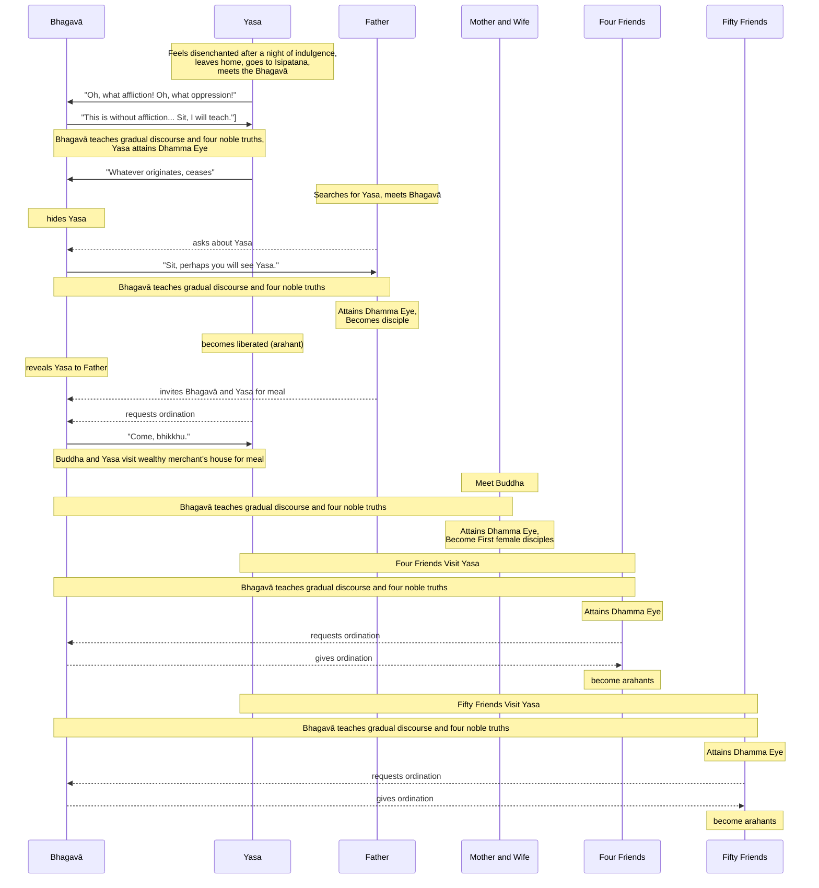

Original text: [World Tipitaka Edition](https://tipitaka2500.github.io/tipitaka/3V/1/1.7.html)

> [!INFO]
> Image generated by Imagen 4, representing Yasa, a young man from a wealthy family, being taught by the Buddha, surrounded by his parents and wife, four friends, and a further fifty friends in the background.

Pali text (click to view)

(25.)

107\. Tena kho pana samayena bārāṇasiyaṃ yaso nāma kulaputto seṭṭhiputto sukhumālo hoti. Tassa tayo pāsādā honti—  eko hemantiko, eko gimhiko, eko vassiko. So vassike pāsāde cattāro māse nippurisehi tūriyehi paricārayamāno na heṭṭhāpāsādaṃ orohati. Atha kho yasassa kulaputtassa pañcahi kāmaguṇehi samappitassa samaṅgībhūtassa paricārayamānassa paṭikacceva niddā okkami, parijanassapi niddā okkami, sabbarattiyo ca telapadīpo jhāyati. Atha kho yaso kulaputto paṭikacceva pabujjhitvā addasa sakaṃ parijanaṃ supantaṃ—  aññissā kacche vīṇaṃ, aññissā kaṇṭhe mudiṅgaṃ, aññissā kacche āḷambaraṃ, aññaṃ vikesikaṃ, aññaṃ vikkheḷikaṃ, aññā vippalapantiyo, hatthappattaṃ susānaṃ maññe. Disvānassa ādīnavo pāturahosi, nibbidāya cittaṃ saṇṭhāsi. Atha kho yaso kulaputto udānaṃ udānesi—  “upaddutaṃ vata bho, upassaṭṭhaṃ vata bho”ti.

108\. Atha kho yaso kulaputto suvaṇṇapādukāyo ārohitvā yena nivesanadvāraṃ tenupasaṅkami. Amanussā dvāraṃ vivariṃsu—  “mā yasassa kulaputtassa koci antarāyamakāsi agārasmā anagāriyaṃ pabbajjāyā”ti. Atha kho yaso kulaputto yena nagaradvāraṃ tenupasaṅkami. Amanussā dvāraṃ vivariṃsu—  “mā yasassa kulaputtassa koci antarāyamakāsi agārasmā anagāriyaṃ pabbajjāyā”ti. Atha kho yaso kulaputto yena isipatanaṃ migadāyo tenupasaṅkami.

(26.)

109\. Tena kho pana samayena bhagavā rattiyā paccūsasamayaṃ paccuṭṭhāya ajjhokāse caṅkamati. Addasā kho bhagavā yasaṃ kulaputtaṃ dūratova āgacchantaṃ, disvāna caṅkamā orohitvā paññatte āsane nisīdi. Atha kho yaso kulaputto bhagavato avidūre udānaṃ udānesi—  “upaddutaṃ vata bho, upassaṭṭhaṃ vata bho”ti. Atha kho bhagavā yasaṃ kulaputtaṃ etadavoca—  “idaṃ kho, yasa, anupaddutaṃ, idaṃ anupassaṭṭhaṃ. Ehi, yasa, nisīda, dhammaṃ te desessāmī”ti. Atha kho yaso kulaputto—  “idaṃ kira anupaddutaṃ, idaṃ anupassaṭṭhan”ti haṭṭho udaggo suvaṇṇapādukāhi orohitvā yena bhagavā tenupasaṅkami, upasaṅkamitvā bhagavantaṃ abhivādetvā ekamantaṃ nisīdi.

110\. Ekamantaṃ nisinnassa kho yasassa kulaputtassa bhagavā anupubbiṃ kathaṃ kathesi, seyyathidaṃ—  dānakathaṃ sīlakathaṃ saggakathaṃ, kāmānaṃ ādīnavaṃ okāraṃ saṃkilesaṃ, nekkhamme ānisaṃsaṃ pakāsesi. Yadā bhagavā aññāsi yasaṃ kulaputtaṃ kallacittaṃ, muducittaṃ, vinīvaraṇacittaṃ, udaggacittaṃ, pasannacittaṃ, atha yā buddhānaṃ sāmukkaṃsikā dhammadesanā taṃ pakāsesi—  dukkhaṃ, samudayaṃ, nirodhaṃ, maggaṃ. Seyyathāpi nāma suddhaṃ vatthaṃ apagatakāḷakaṃ sammadeva rajanaṃ paṭiggaṇheyya; evameva yasassa kulaputtassa tasmiṃyeva āsane virajaṃ vītamalaṃ dhammacakkhuṃ udapādi—  “yaṃ kiñci samudayadhammaṃ sabbaṃ taṃ nirodhadhamman”ti.

(27.)

111\. Atha kho yasassa kulaputtassa mātā pāsādaṃ abhiruhitvā yasaṃ kulaputtaṃ apassantī yena seṭṭhi gahapati tenupasaṅkami, upasaṅkamitvā seṭṭhiṃ gahapatiṃ etadavoca—  “putto te, gahapati, yaso na dissatī”ti. Atha kho seṭṭhi gahapati catuddisā assadūte uyyojetvā sāmaṃyeva yena isipatanaṃ migadāyo tenupasaṅkami. Addasā kho seṭṭhi gahapati suvaṇṇapādukānaṃ nikkhepaṃ, disvāna taṃyeva anugamāsi. Addasā kho bhagavā seṭṭhiṃ gahapatiṃ dūratova āgacchantaṃ, disvāna bhagavato etadahosi—  “yannūnāhaṃ tathārūpaṃ iddhābhisaṅkhāraṃ abhisaṅkhareyyaṃ yathā seṭṭhi gahapati idha nisinno idha nisinnaṃ yasaṃ kulaputtaṃ na passeyyā”ti. Atha kho bhagavā tathārūpaṃ iddhābhisaṅkhāraṃ abhisaṅkharesi.

112\. Atha kho seṭṭhi gahapati yena bhagavā tenupasaṅkami, upasaṅkamitvā bhagavantaṃ etadavoca—  “api, bhante, bhagavā yasaṃ kulaputtaṃ passeyyā”ti?

113\. “Tena hi, gahapati, nisīda, appeva nāma idha nisinno idha nisinnaṃ yasaṃ kulaputtaṃ passeyyāsī”ti. Atha kho seṭṭhi gahapati—  “idheva kirāhaṃ nisinno idha nisinnaṃ yasaṃ kulaputtaṃ passissāmī”ti haṭṭho udaggo bhagavantaṃ abhivādetvā ekamantaṃ nisīdi.

114\. Ekamantaṃ nisinnassa kho seṭṭhissa gahapatissa bhagavā anupubbiṃ kathaṃ kathesi, seyyathidaṃ—  dānakathaṃ sīlakathaṃ saggakathaṃ, kāmānaṃ ādīnavaṃ okāraṃ saṃkilesaṃ, nekkhamme ānisaṃsaṃ pakāsesi. Yadā bhagavā aññāsi seṭṭhiṃ gahapatiṃ kallacittaṃ, muducittaṃ, vinīvaraṇacittaṃ, udaggacittaṃ, pasannacittaṃ, atha yā buddhānaṃ sāmukkaṃsikā dhammadesanā, taṃ pakāsesi—  dukkhaṃ, samudayaṃ, nirodhaṃ, maggaṃ. Seyyathāpi nāma suddhaṃ vatthaṃ apagatakāḷakaṃ sammadeva rajanaṃ paṭiggaṇheyya; evameva seṭṭhissa gahapatissa tasmiṃyeva āsane virajaṃ vītamalaṃ dhammacakkhuṃ udapādi—  “yaṃ kiñci samudayadhammaṃ sabbaṃ taṃ nirodhadhamman”ti.

115\. Atha kho seṭṭhi gahapati diṭṭhadhammo pattadhammo viditadhammo pariyogāḷhadhammo tiṇṇavicikiccho vigatakathaṃkatho vesārajjappatto aparappaccayo satthusāsane bhagavantaṃ etadavoca—  “abhikkantaṃ, bhante, abhikkantaṃ, bhante. Seyyathāpi, bhante, nikkujjitaṃ vā ukkujjeyya, paṭicchannaṃ vā vivareyya, mūḷhassa vā `maggaṃ` ācikkheyya, andhakāre vā telapajjotaṃ dhāreyya—  ‘cakkhumanto rūpāni dakkhantī’ti; evamevaṃ bhagavatā anekapariyāyena dhammo pakāsito. Esāhaṃ, bhante, bhagavantaṃ saraṇaṃ gacchāmi, dhammañca, bhikkhusaṃghañca. Upāsakaṃ maṃ bhagavā dhāretu ajjatagge pāṇupetaṃ saraṇaṃ gatan”ti. Sova loke paṭhamaṃ upāsako ahosi tevāciko.

(28.)

116\. Atha kho yasassa kulaputtassa pituno dhamme desiyamāne yathādiṭṭhaṃ yathāviditaṃ bhūmiṃ paccavekkhantassa anupādāya āsavehi cittaṃ vimucci. Atha kho bhagavato etadahosi—  “yasassa kho kulaputtassa pituno dhamme desiyamāne yathādiṭṭhaṃ yathāviditaṃ bhūmiṃ paccavekkhantassa anupādāya āsavehi cittaṃ vimuttaṃ. Abhabbo kho yaso kulaputto hīnāyāvattitvā kāme paribhuñjituṃ, seyyathāpi pubbe agārikabhūto; yannūnāhaṃ taṃ iddhābhisaṅkhāraṃ paṭippassambheyyan”ti. Atha kho bhagavā taṃ iddhābhisaṅkhāraṃ paṭippassambhesi.

117\. Addasā kho seṭṭhi gahapati yasaṃ kulaputtaṃ nisinnaṃ disvāna, yasaṃ kulaputtaṃ etadavoca—  “mātā te, tāta yasa, paridevasokasamāpannā, dehi mātuyā jīvitan”ti. Atha kho yaso kulaputto bhagavantaṃ ullokesi. Atha kho bhagavā seṭṭhiṃ gahapatiṃ etadavoca—  “taṃ kiṃ maññasi, gahapati, yassa sekkhena ñāṇena sekkhena dassanena dhammo diṭṭho vidito seyyathāpi tayā, tassa yathādiṭṭhaṃ yathāviditaṃ bhūmiṃ paccavekkhantassa anupādāya āsavehi cittaṃ vimuttaṃ. Bhabbo nu kho so, gahapati, hīnāyāvattitvā kāme paribhuñjituṃ seyyathāpi pubbe agārikabhūto”ti? “No hetaṃ, bhante”. “Yasassa kho, gahapati, kulaputtassa sekkhena ñāṇena sekkhena dassanena dhammo diṭṭho vidito seyyathāpi tayā, tassa yathādiṭṭhaṃ yathāviditaṃ bhūmiṃ paccavekkhantassa anupādāya āsavehi cittaṃ vimuttaṃ. Abhabbo kho, gahapati, yaso kulaputto hīnāyāvattitvā kāme paribhuñjituṃ seyyathāpi pubbe agārikabhūto”ti. “Lābhā, bhante, yasassa kulaputtassa, suladdhaṃ, bhante, yasassa kulaputtassa, yathā yasassa kulaputtassa anupādāya āsavehi cittaṃ vimuttaṃ. Adhivāsetu me, bhante, bhagavā ajjatanāya bhattaṃ yasena kulaputtena pacchāsamaṇenā”ti. Adhivāsesi bhagavā tuṇhībhāvena.

118\. Atha kho seṭṭhi gahapati bhagavato adhivāsanaṃ viditvā uṭṭhāyāsanā bhagavantaṃ abhivādetvā padakkhiṇaṃ katvā pakkāmi. Atha kho yaso kulaputto acirapakkante seṭṭhimhi gahapatimhi bhagavantaṃ etadavoca—  “labheyyāhaṃ, bhante, bhagavato santike pabbajjaṃ, labheyyaṃ upasampadan”ti. “Ehi bhikkhū”ti bhagavā avoca—  “svākkhāto dhammo, cara brahmacariyaṃ sammā dukkhassa antakiriyāyā”ti. Sāva tassa āyasmato upasampadā ahosi. Tena kho pana samayena satta loke arahanto honti.

---

119\. Yasassa pabbajjā niṭṭhitā.

(29.)

120\. Atha kho bhagavā pubbaṇhasamayaṃ nivāsetvā pattacīvaramādāya āyasmatā yasena pacchāsamaṇena yena seṭṭhissa gahapatissa nivesanaṃ tenupasaṅkami, upasaṅkamitvā paññatte āsane nisīdi. Atha kho āyasmato yasassa mātā ca purāṇadutiyikā ca yena bhagavā tenupasaṅkamiṃsu, upasaṅkamitvā bhagavantaṃ abhivādetvā ekamantaṃ nisīdiṃsu.

121\. Tāsaṃ bhagavā anupubbiṃ kathaṃ kathesi, seyyathidaṃ—  dānakathaṃ sīlakathaṃ saggakathaṃ, kāmānaṃ ādīnavaṃ okāraṃ saṃkilesaṃ, nekkhamme ānisaṃsaṃ pakāsesi. Yadā tā bhagavā aññāsi kallacittā, muducittā, vinīvaraṇacittā, udaggacittā, pasannacittā, atha yā buddhānaṃ sāmukkaṃsikā dhammadesanā taṃ pakāsesi—  dukkhaṃ, samudayaṃ, nirodhaṃ, maggaṃ. Seyyathāpi nāma suddhaṃ vatthaṃ apagatakāḷakaṃ sammadeva rajanaṃ paṭiggaṇheyya; evameva tāsaṃ tasmiṃyeva āsane virajaṃ vītamalaṃ dhammacakkhuṃ udapādi—  “yaṃ kiñci samudayadhammaṃ sabbaṃ taṃ nirodhadhamman”ti. Tā diṭṭhadhammā pattadhammā viditadhammā pariyogāḷhadhammā tiṇṇavicikicchā vigatakathaṃkathā vesārajjappattā aparappaccayā satthusāsane bhagavantaṃ etadavocuṃ—  “abhikkantaṃ, bhante, abhikkantaṃ, bhante…pe…  etā mayaṃ, bhante, bhagavantaṃ saraṇaṃ gacchāma, dhammañca, bhikkhusaṃghañca. Upāsikāyo no bhagavā dhāretu ajjatagge pāṇupetā saraṇaṃ gatā”ti. Tā ca loke paṭhamaṃ upāsikā ahesuṃ tevācikā.

122\. Atha kho āyasmato yasassa mātā ca pitā ca purāṇadutiyikā ca bhagavantañca āyasmantañca yasaṃ paṇītena khādanīyena bhojanīyena sahatthā santappetvā sampavāretvā, bhagavantaṃ bhuttāviṃ onītapattapāṇiṃ, ekamantaṃ nisīdiṃsu. Atha kho bhagavā āyasmato yasassa mātarañca pitarañca purāṇadutiyikañca dhammiyā kathāya sandassetvā samādapetvā samuttejetvā sampahaṃsetvā uṭṭhāyāsanā pakkāmi.

(30.)

123\. Assosuṃ kho āyasmato yasassa cattāro gihisahāyakā bārāṇasiyaṃ seṭṭhānuseṭṭhīnaṃ kulānaṃ puttā—  vimalo, subāhu, puṇṇaji, gavampati—  yaso kira kulaputto kesamassuṃ ohāretvā kāsāyāni vatthāni acchādetvā agārasmā anagāriyaṃ pabbajitoti. Sutvāna nesaṃ etadahosi—  “na hi nūna so orako dhammavinayo, na sā orakā pabbajjā, yattha yaso kulaputto kesamassuṃ ohāretvā kāsāyāni vatthāni acchādetvā agārasmā anagāriyaṃ pabbajito”ti. Te yenāyasmā yaso tenupasaṅkamiṃsu, upasaṅkamitvā āyasmantaṃ yasaṃ abhivādetvā ekamantaṃ aṭṭhaṃsu.

124\. Atha kho āyasmā yaso te cattāro gihisahāyake ādāya yena bhagavā tenupasaṅkami, upasaṅkamitvā bhagavantaṃ abhivādetvā ekamantaṃ nisīdi. Ekamantaṃ nisinno kho āyasmā yaso bhagavantaṃ etadavoca—  “ime me, bhante, cattāro gihisahāyakā bārāṇasiyaṃ seṭṭhānuseṭṭhīnaṃ kulānaṃ puttā—  vimalo, subāhu, puṇṇaji, gavampati. Ime bhagavā ovadatu anusāsatū”ti.

125\. Tesaṃ bhagavā anupubbiṃ kathaṃ kathesi, seyyathidaṃ—  dānakathaṃ sīlakathaṃ saggakathaṃ kāmānaṃ ādīnavaṃ okāraṃ saṃkilesaṃ nekkhamme ānisaṃsaṃ pakāsesi. Yadā te bhagavā aññāsi kallacitte muducitte vinīvaraṇacitte udaggacitte pasannacitte, atha yā buddhānaṃ sāmukkaṃsikā dhammadesanā, taṃ pakāsesi dukkhaṃ samudayaṃ nirodhaṃ maggaṃ. Seyyathāpi nāma suddhaṃ vatthaṃ apagatakāḷakaṃ sammadeva rajanaṃ paṭiggaṇheyya; evameva tesaṃ tasmiṃyeva āsane virajaṃ vītamalaṃ dhammacakkhuṃ udapādi—  “yaṃ kiñci samudayadhammaṃ sabbaṃ taṃ nirodhadhamman”ti. Te diṭṭhadhammā pattadhammā viditadhammā pariyogāḷhadhammā tiṇṇavicikicchā vigatakathaṃkathā vesārajjappattā aparappaccayā satthusāsane bhagavantaṃ etadavocuṃ—  “labheyyāma mayaṃ, bhante, bhagavato santike pabbajjaṃ, labheyyāma upasampadan”ti. “Etha bhikkhavo”ti bhagavā avoca—  “svākkhāto dhammo, caratha brahmacariyaṃ sammā dukkhassa antakiriyāyā”ti. Sāva tesaṃ āyasmantānaṃ upasampadā ahosi. Atha kho bhagavā te bhikkhū dhammiyā kathāya ovadi anusāsi. Tesaṃ bhagavatā dhammiyā kathāya ovadiyamānānaṃ anusāsiyamānānaṃ anupādāya āsavehi cittāni vimucciṃsu. Tena kho pana samayena ekādasa loke arahanto honti.

---

126\. Catugihisahāyakapabbajjā niṭṭhitā.

(31.)

127\. Assosuṃ kho āyasmato yasassa paññāsamattā gihisahāyakā jānapadā pubbānupubbakānaṃ kulānaṃ puttā—  yaso kira kulaputto kesamassuṃ ohāretvā kāsāyāni vatthāni acchādetvā agārasmā anagāriyaṃ pabbajitoti. Sutvāna nesaṃ etadahosi—  “na hi nūna so orako dhammavinayo, na sā orakā pabbajjā, yattha yaso kulaputto kesamassuṃ ohāretvā kāsāyāni vatthāni acchādetvā agārasmā anagāriyaṃ pabbajito”ti. Te yenāyasmā yaso tenupasaṅkamiṃsu, upasaṅkamitvā āyasmantaṃ yasaṃ abhivādetvā ekamantaṃ aṭṭhaṃsu.

128\. Atha kho āyasmā yaso te paññāsamatte gihisahāyake ādāya yena bhagavā tenupasaṅkami, upasaṅkamitvā bhagavantaṃ abhivādetvā ekamantaṃ nisīdi. Ekamantaṃ nisinno kho āyasmā yaso bhagavantaṃ etadavoca—  “ime me, bhante, paññāsamattā gihisahāyakā jānapadā pubbānupubbakānaṃ kulānaṃ puttā. Ime bhagavā ovadatu anusāsatū”ti.

129\. Tesaṃ bhagavā anupubbiṃ kathaṃ kathesi, seyyathidaṃ—  dānakathaṃ sīlakathaṃ saggakathaṃ kāmānaṃ ādīnavaṃ okāraṃ saṃkilesaṃ nekkhamme ānisaṃsaṃ pakāsesi. Yadā te bhagavā aññāsi kallacitte muducitte vinīvaraṇacitte udaggacitte pasannacitte, atha yā buddhānaṃ sāmukkaṃsikā dhammadesanā, taṃ pakāsesi dukkhaṃ samudayaṃ nirodhaṃ maggaṃ. Seyyathāpi nāma suddhaṃ vatthaṃ apagatakāḷakaṃ sammadeva rajanaṃ paṭiggaṇheyya; evameva tesaṃ tasmiṃyeva āsane virajaṃ vītamalaṃ dhammacakkhuṃ udapādi—  “yaṃ kiñci samudayadhammaṃ sabbaṃ taṃ nirodhadhamman”ti. Te diṭṭhadhammā pattadhammā viditadhammā pariyogāḷhadhammā tiṇṇavicikicchā vigatakathaṃkathā vesārajjappattā aparappaccayā satthusāsane bhagavantaṃ etadavocuṃ—  “labheyyāma mayaṃ, bhante, bhagavato santike pabbajjaṃ, labheyyāma upasampadan”ti. “Etha bhikkhavo”ti bhagavā avoca—  “svākkhāto dhammo, caratha brahmacariyaṃ sammā dukkhassa antakiriyāyā”ti. Sāva tesaṃ āyasmantānaṃ upasampadā ahosi. Atha kho bhagavā te bhikkhū dhammiyā kathāya ovadi anusāsi. Tesaṃ bhagavatā dhammiyā kathāya ovadiyamānānaṃ anusāsiyamānānaṃ anupādāya āsavehi cittāni vimucciṃsu. Tena kho pana samayena ekasaṭṭhi loke arahanto honti.

---

130\. Paññāsagihisahāyakapabbajjā niṭṭhitā.

## Summary

Yasa, a wealthy young man, experiences profound revulsion at his life of sensual pleasure, exclaiming "Oh, what affliction!" and leaves home, encountering the Bhagavā (Buddha). The Buddha teaches Yasa a gradual discourse followed by the Four Noble Truths, leading Yasa to attain the "dust-free, stainless `dhammacakkhu` (insight into the Dhamma)" and, after his father also hears the Dhamma, full liberation as an Arahant and ordination as a bhikkhu. Yasa's father, initially searching for him, is also taught by the Buddha, attains the `dhammacakkhu`, and becomes the first lay follower; Yasa's mother and former wife similarly become the first laywomen followers. Inspired by Yasa, his four closest friends and later about fifty more also seek out the Buddha, receive the same progressive instruction, attain the `dhammacakkhu`, are ordained, and achieve Arahantship, significantly expanding the early Saṅgha.

## Diagram

## Text

(25.)

107\. At that time in Bārāṇasī, a young man of good family named Yasa, son of a wealthy merchant, was well brought up. He had three mansions — one for the cold season, one for the hot season, one for the rainy season. For four months in the rainy season mansion, being entertained by female musicians, he did not descend to the lower mansion. Then, while Yasa, the young man of good family, was furnished and endowed with the five strands of sensual pleasure, being entertained, sleep overcame him early, and sleep overcame his attendants too, and the oil lamp burned all night. Then Yasa, the young man of good family, woke up early and saw his own attendants sleeping — a lute in one’s lap, a small drum at another’s neck, a tabor in another’s lap, another with dishevelled hair, another drooling, others muttering — it seemed like he had arrived at a burial ground for bones of cremated corpses. Seeing this, the unsatisfactoriness of life occurred to him, his mind became established in dis-enchantment. Then Yasa, the young man of good family, uttered an exclamation: "Oh, what affliction! Oh, what oppression!"

108\. Then Yasa, the young man of good family, having put on his golden slippers, approached the door of his dwelling. Celestial beings opened the door, thinking: "Let no one cause an obstacle to Yasa, the young man of good family, for his going forth from home into homelessness." Then Yasa, the young man of good family, approached the city gate. Celestial beings opened the gate, thinking: "Let no one cause an obstacle to Yasa, the young man of good family, for his going forth from home into homelessness." Then Yasa, the young man of good family, approached Isipatana, the Deer Park.

(26.)

109\. At that time, the Bhagavā, having risen in the early hours of the night, was walking up and down in the open air. The Bhagavā saw Yasa, the young man of good family, coming from afar. Seeing him, he descended from his walking path and sat down on the prepared seat. Then Yasa, the young man of good family, not far from the Bhagavā, uttered an exclamation: "Oh, what affliction! Oh, what oppression!" Then the Bhagavā said this to Yasa, the young man of good family: "This, Yasa, is without affliction, this is without oppression. Come, Yasa, sit down, I will teach you the Dhamma." Then Yasa, the young man of good family, thinking, "This, it seems, is without affliction, this is without oppression," joyful and elated, took off his golden slippers, approached the Bhagavā, and after paying homage to the Bhagavā, sat down to one side.

110\. To Yasa, the young man of good family, seated to one side, the Bhagavā gave a gradual discourse, that is to say, talk on generosity (`dānakathaṃ`), talk on ethical behaviour (`sīlakathaṃ`), talk on heaven (`saggakathaṃ`); he explained the danger, degradation, and defilement of sensual pleasures, and the benefit of renunciation. When the Bhagavā knew Yasa, the young man of good family, to have a ready mind, a pliable mind, a mind free from hindrances, an uplifted mind, a confident mind, then he expounded that teaching of the Dhamma which is the Buddhas' own discovery — `dukkhaṃ` (suffering), `samudayaṃ` (origin), `nirodhaṃ` (cessation), `maggaṃ` (path). Just as a clean cloth, free from stains, would rightly receive dye; even so, for Yasa, the young man of good family, while sitting on that very seat, the dust-free, stainless insight into the Dhamma arose: "Whatever is subject to origination is all subject to cessation."

(27.)

111\. Then the mother of Yasa, the young man of good family, having ascended to the mansion and not seeing Yasa, the young man of good family, approached the wealthy merchant, and having approached, said this to the wealthy merchant: "Your son, master, Yasa, is not to be seen." Then the wealthy merchant, having sent horse-messengers in the four directions, himself approached Isipatana, the Deer Park. The wealthy merchant, saw the place where the golden slippers were left, and seeing it, he followed that very path. The Bhagavā saw the wealthy merchant, coming from afar. Seeing him, it occurred to the Bhagavā: "What if I were to perform such an illusion that the wealthy merchant, sitting here, would not see Yasa, the young man of good family, sitting here?" Then the Bhagavā performed such an illusion.

112\. Then the wealthy merchant, approached the Bhagavā, and having approached, said this to the Bhagavā: "Bhante, might the Bhagavā have seen Yasa, the young man of good family?"

113\. "Well then, merchant, sit down. Perhaps, sitting here, you might see Yasa, the young man of good family, sitting here." Then the wealthy merchant, thinking, "Indeed, sitting right here, I will see Yasa, the young man of good family, sitting here," joyful and elated, paid homage to the Bhagavā and sat down to one side.

114\. To the wealthy merchant, seated to one side, the Bhagavā gave a gradual discourse, that is to say, talk on generosity (`dānakathaṃ`), talk on ethical behaviour (`sīlakathaṃ`), talk on heaven (`saggakathaṃ`); he explained the danger, degradation, and defilement of sensual pleasures, and the benefit of renunciation. When the Bhagavā knew the wealthy merchant, to have a ready mind, a pliable mind, a mind free from hindrances, an uplifted mind, a confident mind, then he expounded that teaching of the Dhamma which is the Buddhas' own discovery — `dukkhaṃ` (suffering), `samudayaṃ` (origin), `nirodhaṃ` (cessation), `maggaṃ` (path). Just as a clean cloth, free from stains, would rightly receive dye; even so, for the wealthy merchant, while sitting on that very seat, the dust-free, stainless insight into the Dhamma arose: "Whatever is subject to origination is all subject to cessation."

115\. Then the wealthy merchant, who have seen the Dhamma (`diṭṭhadhammo`), attained the Dhamma (`pattadhammo`), understood the Dhamma (`pariyogāḷhadhammo`), penetrated the Dhamma (`pariyogāḷhadhammo`), overcome doubt (`tiṇṇavicikiccho`), dispelled uncertainty (`vigatakathaṃkatho`), attained confidence (`vesārajjappatto`), and and not relying on another teacher's instructions (`aparappaccaya satthusāsane`), said this to the Bhagavā: "Excellent, bhante! Excellent, bhante! Just as, bhante, one might set upright what has been overturned, or reveal what is hidden, or point out the path to one who is lost, or hold up an oil lamp in the darkness so that those with sight might see forms; even so, the Dhamma has been made clear in many ways by the Bhagavā. I go for refuge to the Bhagavā, bhante, to the Dhamma, and to the Bhikkhusaṅgha. May the Bhagavā remember me as a disciple who has gone for refuge for life, from this day forward." He was the first disciple in the world with the threefold utterance (The Three Refuges).

(28.)

116\. Then, for Yasa, the young man of good family, while the Dhamma was being taught to his father, as he reviewed the existence he had seen and known, his mind was liberated from the `āsava`s (non optimal flows) without clinging. Then it occurred to the Bhagavā: "For Yasa, the young man of good family, while the Dhamma was being taught to his father, as he reviewed the existence he had seen and known, his mind has been liberated from the `āsava`s without clinging. Yasa, the young man of good family, is incapable of reverting to a previous state and enjoying sensual pleasures as he did before when a merchant; what if I were to cause that psychic feat to cease?" Then the Bhagavā caused that psychic feat to cease.

117\. The wealthy merchant, saw Yasa, the young man of good family, sitting there, and seeing him, said this to Yasa, the young man of good family: "Your mother, dear Yasa, is overcome with lamentation and sorrow. Return to your mother." Then Yasa, the young man of good family, looked up at the Bhagavā. Then the Bhagavā said this to the wealthy merchant: "What do you think, merchant? For one by whom the Dhamma has been seen and known with the knowledge and vision of a trainee, just as by you, if, as he reviews the existence he has seen and known, his mind is liberated from the `āsava`s without clinging, is he, merchant, capable of reverting to a previous state and enjoying sensual pleasures as he did before when an ordinary person?" "Certainly not, bhante." "For Yasa, the young man of good family, merchant, the Dhamma has been seen and known with the knowledge and vision of a trainee, just as by you. For him, as he reviews the existence he has seen and known, his mind is liberated from the `āsava`s without clinging. Yasa, the young man of good family, merchant, is incapable of reverting to a previous state and enjoying sensual pleasures as he did before when an ordinary person." "A gain, bhante, for Yasa, the young man of good family! A great gain, bhante, for Yasa, the young man of good family, that Yasa, the young man of good family's mind is liberated from the `āsava`s without clinging. May the Bhagavā, bhante, consent to a meal from me for today, with Yasa, the young man of good family, as his attendant monk." The Bhagavā consented by silence.

118\. Then the wealthy merchant, having understood the Bhagavā's consent, rose from his seat, paid homage to the Bhagavā, circumambulated him keeping his right side towards him, and departed. Then Yasa, the young man of good family, not long after the wealthy merchant, had departed, said this to the Bhagavā: "Bhante, may I receive the going forth in the Bhagavā's presence, may I receive the higher ordination?" "Come, bhikkhu," the Bhagavā said, "the Dhamma is well-proclaimed. Live the disciplined life for the complete ending of dukkha (suffering)." That itself was the āyasmant one's higher ordination. At that time there were seven Arahants in the world.

---

119\. The going forth of Yasa is finished.

(29.)

120\. Then the Bhagavā, having dressed in the morning, taking his bowl and robe, with the āyasmant (venerable) Yasa as his attendant monk, approached the dwelling of the wealthy merchant, and having approached, sat down on the prepared seat. Then the mother and the former wife of the āyasmant Yasa approached the Bhagavā, and having approached, paid homage to the Bhagavā and sat down to one side.

121\. To them, the Bhagavā gave a gradual discourse, that is to say, talk on generosity (`dānakathaṃ`), talk on ethical behaviour (`sīlakathaṃ`), talk on heaven (`saggakathaṃ`); he explained the danger, degradation, and defilement of sensual pleasures, and the benefit of renunciation. When the Bhagavā knew them to have ready minds, pliable minds, minds free from hindrances, uplifted minds, confident minds, then he expounded that teaching of the Dhamma which is the Buddhas' own discovery — `dukkhaṃ` (suffering), `samudayaṃ` (origin), `nirodhaṃ` (cessation), `maggaṃ` (path). Just as a clean cloth, free from stains, would rightly receive dye; even so, for them, while sitting on that very seat, the dust-free, stainless insight into the Dhamma arose: "Whatever is subject to origination is all subject to cessation." They, who have seen the Dhamma (`diṭṭhadhammo`), attained the Dhamma (`pattadhammo`), understood the Dhamma (`pariyogāḷhadhammo`), penetrated the Dhamma (`pariyogāḷhadhammo`), overcome doubt (`tiṇṇavicikiccho`), dispelled uncertainty (`vigatakathaṃkatho`), attained confidence (`vesārajjappatto`), and not relying on another teacher's instructions (`aparappaccaya satthusāsane`), said this to the Bhagavā: "Excellent, bhante! Excellent, bhante! …pe… We, bhante, go for refuge to the Bhagavā, to the Dhamma, and to the Bhikkhusaṅgha. May the Bhagavā remember us as female disciples who have gone for refuge for life, from this day forward." And they were the first female disciples in the world with the threefold utterance.

122\. Then the mother, father, and former wife of the āyasmant Yasa, having satisfied and served the Bhagavā and the āyasmant Yasa with their own hands with fine hard and soft food, and the Bhagavā having finished his meal and withdrawn his hand from the bowl, sat down to one side. Then the Bhagavā, having instructed, roused, inspired, and gladdened the mother, father, and former wife of the āyasmant Yasa with a Dhamma talk, rose from his seat and departed.

(30.)

123\. Four friends of the āyasmant Yasa in Bārāṇasī, sons of leading wealthy families — Vimala, Subāhu, Puṇṇaji, and Gavampati — heard: "Yasa, the young man of good family, it is said, has shaved off his hair and beard, put on ochre robes, and gone forth from home into homelessness." Having heard, it occurred to them: "Surely that Dhamma and Discipline is not inferior, that going forth is not inferior, wherein Yasa, the young man of good family, has shaved off his hair and beard, put on ochre robes, and gone forth from home into homelessness." They approached the āyasmant Yasa, and having approached, paid homage to the āyasmant Yasa and stood to one side.

124\. Then the āyasmant Yasa, taking those four friends, approached the Bhagavā, and having approached, paid homage to the Bhagavā and sat down to one side. Seated to one side, the āyasmant Yasa said this to the Bhagavā: "These, bhante, are my four friends, sons of leading wealthy families in Bārāṇasī — Vimala, Subāhu, Puṇṇaji, and Gavampati. May the Bhagavā instruct and advise them."

125\. To them, the Bhagavā gave a gradual discourse, that is to say, talk on generosity (`dānakathaṃ`), talk on ethical behaviour (`sīlakathaṃ`), talk on heaven (`saggakathaṃ`); he explained the danger, degradation, and defilement of sensual pleasures, and the benefit of renunciation. When the Bhagavā knew them to have ready minds, pliable minds, minds free from hindrances, uplifted minds, confident minds, then he expounded that teaching of the Dhamma which is the Buddhas' own discovery — `dukkhaṃ` (suffering), `samudayaṃ` (origin), `nirodhaṃ` (cessation), `maggaṃ` (path). Just as a clean cloth, free from stains, would rightly receive dye; even so, for them, while sitting on that very seat, the dust-free, stainless insight into the Dhamma arose: "Whatever is subject to origination is all subject to cessation." They, who have seen the Dhamma (`diṭṭhadhammo`), attained the Dhamma (`pattadhammo`), understood the Dhamma (`pariyogāḷhadhammo`), penetrated the Dhamma (`pariyogāḷhadhammo`), overcome doubt (`tiṇṇavicikiccho`), dispelled uncertainty (`vigatakathaṃkatho`), attained confidence (`vesārajjappatto`), and and not relying on another teacher's instructions (`aparappaccaya satthusāsane`), said this to the Bhagavā: "Bhante, may we receive the going forth in the Bhagavā's presence, may we receive the higher ordination." "Come, bhikkhus," the Bhagavā said, "the Dhamma is well-proclaimed. Live the holy life for the complete ending of dukkha (suffering)." That itself was the āyasmant ones' higher ordination. Then the Bhagavā instructed and admonished those bhikkhus with a Dhamma talk. While they were being instructed and admonished by the Bhagavā with a Dhamma talk, their minds were liberated from the `āsava`s without clinging. At that time there were eleven Arahants in the world.

---

126\. The going forth of the four friends is finished.

(31.)

127\. About fifty friends of the āyasmant Yasa, country-dwelling sons of successively prominent families, heard: "Yasa, the young man of good family, it is said, has shaved off his hair and beard, put on ochre robes, and gone forth from home into homelessness." Having heard, it occurred to them: "Surely that Dhamma and Discipline is not inferior, that going forth is not inferior, wherein Yasa, the young man of good family, has shaved off his hair and beard, put on ochre robes, and gone forth from home into homelessness." They approached the āyasmant Yasa, and having approached, paid homage to the āyasmant Yasa and stood to one side.

128\. Then the āyasmant Yasa, taking those about fifty friends, approached the Bhagavā, and having approached, paid homage to the Bhagavā and sat down to one side. Seated to one side, the āyasmant Yasa said this to the Bhagavā: "These, bhante, are my about fifty friends, country-dwelling sons of successively prominent families. May the Bhagavā instruct and admonish them."

129\. To them, the Bhagavā gave a gradual discourse, that is to say, talk on generosity (`dānakathaṃ`), talk on ethical behaviour (`sīlakathaṃ`), talk on heaven (`saggakathaṃ`); he explained the danger, degradation, and defilement of sensual pleasures, and the benefit of renunciation. When the Bhagavā knew them to have ready minds, pliable minds, minds free from hindrances, uplifted minds, confident minds, then he expounded that teaching of the Dhamma which is the Buddhas' own discovery — `dukkhaṃ` (suffering), `samudayaṃ` (origin), `nirodhaṃ` (cessation), `maggaṃ` (path). Just as a clean cloth, free from stains, would rightly receive dye; even so, for them, while sitting on that very seat, the dust-free, stainless insight into the Dhamma arose: "Whatever is subject to origination is all subject to cessation." They, who have seen the Dhamma (`diṭṭhadhammo`), attained the Dhamma (`pattadhammo`), understood the Dhamma (`pariyogāḷhadhammo`), penetrated the Dhamma (`pariyogāḷhadhammo`), overcome doubt (`tiṇṇavicikiccho`), dispelled uncertainty (`vigatakathaṃkatho`), attained confidence (`vesārajjappatto`), and and not relying on another teacher's instructions (`aparappaccaya satthusāsane`), said this to the Bhagavā: "Bhante, may we receive the going forth in the Bhagavā's presence, may we receive the higher ordination." "Come, bhikkhus," the Bhagavā said, "the Dhamma is well-proclaimed. Live the holy life for the complete ending of dukkha (suffering)." That itself was the āyasmant ones' higher ordination. Then the Bhagavā instructed and admonished those bhikkhus with a Dhamma talk. While they were being instructed and admonished by the Bhagavā with a Dhamma talk, their minds were liberated from the `āsava`s without clinging. At that time there were sixty-one Arahants in the world.

---

130\. The going forth of the fifty lay friends is finished.

## Commentary

Yasa's narrative begins with a profound perceptual shift: the familiar objects of sensual pleasure — his attendants and their instruments — are suddenly perceived not as sources of delight but as a burial ground full of corpses. This intense revulsion signifies a crisis in his lived experience, where the previously positive valence of his surroundings inverts, generating feelings of "affliction" and "oppression." This isn't a moral judgment imposed from outside, but an immediate, visceral re-evaluation of his sensory world.

### Rational explanation

His encounter with the Bhagavā offers a framework to understand and transcend this newly perceived suffering. The "celestial beings" opening doors can be understood as a metaphor for the powerful, unimpeded intentionality arising from Yasa's acute distress and singular focus on escape, or simply fortunate circumstances interpreted through a lens of urgency. The Bhagavā’s gradual discourse — on generosity, virtue, and the drawbacks of sensual pleasures — systematically prepares Yasa's mind, altering his cognitive and affective state to one of receptivity. This "ready mind" is a state primed for a new understanding.

The arising of the "insight into the Dhamma" — "Whatever is subject to origination is all subject to cessation" — is a direct, non-inferential insight into the fundamental structure of experience itself. It's a cognitive restructuring where the impermanent nature of phenomena becomes self-evident. This isn't a mystical vision but a profound shift in the way Yasa perceives and relates to his own experiences.

The "psychic feat" preventing Yasa's father from initially seeing him can be interpreted rationally as the Bhagavā skillfully managing the father's perceptual field and attention, perhaps through engrossing discourse or subtle direction, ensuring the father is also in a receptive state before confronting his son's transformation. The father, too, undergoes the same process: a gradual discourse leading to a "ready mind" and the subsequent arising of the "insight into the Dhamma," demonstrating the replicability of this perceptual shift. Yasa’s later full liberation from "non optimal mental flows" (`āsava`s) signifies a deeper, stable transformation of his experiential baseline, a freedom from ingrained patterns of craving and aversion. The subsequent conversions of his family and friends follow this same pattern, highlighting how a structured presentation of these ideas can reliably induce similar profound shifts in understanding and lived experience when individuals are phenomenologically prepared.

This narrative highlights the Buddha's use of "skill in means" (upāya-kauśalya) by adapting his teaching to lay people as opposed to experienced ascetics in the previous episode. It is important to note the various people featured in the narrative are depicted as ordinary people (albeit wealthy) with a history of indulgence and not asceticism.

### Gradual discourse

The "gradual discourse" technique used by the Buddha on Yasa proved to be so successful the Buddha used the same approach for his parents, former wife, and friends, and subsequently for the Bhaddavaggiya group, all with excellent results.

The initial topics for the gradual discourse are:

1. `dānakathaṃ` (talk on generosity)
2. `sīlakathaṃ` (talk on ethical behaviour)
3. `saggakathaṃ` (talk about heaven)
4. `kāmānaṃ ādīnavaṃ okāraṃ saṃkilesaṃ` (danger, degradation, and defilement of sensual pleasures)
5. `nekkhamme ānisaṃsaṃ` (the benefit of renunciation).

It is only when the Buddha is confident Yasa is receptive to his teachings, that he introduces the 4 noble truths. Note that with the 5 ascetics, the Buddha did not need to introduce his teachings with concepts like generosity, ethical behaviour and heaven, but he probably feels this is a what ordinary people would expect from a `samaṇa` (renunciant) like himself.

Note that no details are provided for the introductory topics, because they are not deemed to be significant. From this, we can also conclude the Buddha, or at least the author of the narrative, do not consider these topics to be part of the soteriology.

### Achievability of liberation

This narrative is also significant in that it clearly depicts that ordinary people from different backgrounds - without prior instruction or renunciation - can achieve more or less spontaneous understanding, and perhaps liberation, purely from hearing the Buddha's teachings. And therefore the decision to join the `saṅgha` is a vocational one, and it is also possible to be a lay disciple and live relatively normal lives.

There are two possible paths when a person achieves the "Dhamma eye" - to continue as a disciple, or to ordain as a monastic. It is also clear in demonstrating that both men and women can achieve at least the Dhamma eye, and therefore potential liberation. Although the narrative is not clear whether Yasa's parents or his wife eventually attained liberation, the implication is that there is nothing preventing them from doing so.

This is of course in stark contrast to later tradition, which stipulates that awakening occurs over multiple stages across multiple lifetimes, and it is not possible for a lay person to achieve awakening without renunciation and leading a monastic life. Other versions of this narrative downplay the liberation of these early disciples and claim those who did not join the `saṅgha` (such as Yasa's parents) were in fact not liberated.

### Request for ordination

The narrative also seems to imply that if one achieves liberation, as Yasa and his fifty four friends did, one will automatically requests for and is granted ordination.

Of course, it is difficult to imagine that one who is successfully liberated will be able to adjust to a normal life with ease, but it is not impossible. So the community that the Buddha has established act as a support network for liberated ones, to enable them to continue existence with the minimum of temptation to lapse into old ways (the danger of which is illustrated in the very next section of the narrative).

### The Establishment of the Saṅgha

Although the [five ascetics](./1.6.md) requested and was granted the going forth (`pabbajja`) and ordination (`upasampadā`) by the Buddha, that was probably a later addition to the narrative, as the five ascetics obviously had already "gone forth" so they were merely joining the Buddha in living the optimal life (`brahmacariya`).

The Buddha eventually established the `saṅgha`, which is a community of renunciants who have chosen to "follow" him into `brahmacariya`. Yasa and his friends probably represent the beginning of this community.

[Brekke1996] says that the emphasis in the early sections of the Khandhaka is "... on the conversion of new members to the Saṃgha and the lack of restrictions in admittance. The early Buddhists seem to have engaged in fervent and competitive proselytizeing activity both toward other sects and toward Brahmins and other important members of society."

He adds:

> In the Khandhaka section of the Vinayapitaka we have the most detailed description of the early stages of the Buddhist Saṃgha available in Buddhist literature. Its account starts right after the enlightenment of Gotama. The young prince is now a Buddha, but he has no congregation yet. Initially, he does not want to experience the weariness and vexation caused by the dull intellects of his potential pupils and he must be persuaded by Brahmā Sahāmpati to teach the Dhamma. The first question which arises is to whom he should first preach. He decides to approach the group of five ascetics with whom he previously has practiced asceticism. These five form the first Saṃgha.
> 
> Part I. 7 of the MV is about the conversion and going forth of Yasa, the son of a rich merchant of Benares and about the conversion and going forth as a lay-disciple of Yasa's father. The Buddha uses his charisma to win over Yasa as a monk and his father as a lay-disciple. When the great merchant sees his son who has run away from home in order to join the Buddha's following he begs him to come home for his mother's sake. [^21] When the merchant asks his son to come back, the Buddha tells him that Yasa cannot turn back to the low life and enjoy sensual pleasures as he did before when he led the life of a householder. [^22]
> 
> In MV I.8. the mother and former wife of Yasa take refuge in the Buddha, the Dhamma and the Saṃgha as lay-disciples and become the first women lay-disciples using the three-word formula. [^23] In MV I. 9 four friends of Yasa approach the Lord and are ordained. In MV I. 10 sons of other families in Benares approach the Lord and are ordained.

In the early days, the `saṅgha` probably operated informally as a group of renunciants living together, supporting each other, and monitoring each other to ensure everyone is following the eightfold path and successfully eradicating the conditions that lead to `dukkha`. All members of the community will have achieved `dhammacakkhu` (insight into the dhamma) and therefore understand the phenomenological framework and nature of subjective experience of reality, the Middle Way, the Four Realisations and the Eightfold Path.

Over time, the community started accepting new members who may not have fully grasped the `dhammacakkhu` and therefore "preceptors" were assigned to guide them towards understanding.

Once the community grew, it became more and more important to prescribe "rules" to govern the community and ensure exemplary behaviour, and these rules expanded into the Vinaya we know today, and the Khandhaka also grew to encompass the description of the origin of many of these rules. Many rules were for the purpose of maintaining the "reputation" of the community and public perception of the `saṅgha` as the community became increasingly less reliant on individual alms-seeking and more and more on royal and wealthy benefactors.

## Other opinions

- [Brekke - The Early Samgha and the Laity (1996)](<../Articles/Brekke - The Early Samgha and the Laity (1996).md>) [@Brekke1996] \
  This article argues that early Buddhism transformed from an open, conversionist movement into a more withdrawn, introversionist sect due to the persistent problem of individuals joining the Saṃgha for extrinsic, worldly motivations. Initially, the Saṃgha actively sought converts, competing with other religious groups for followers. However, as people began joining to escape debt, military service, or simply to attain an easy life, the community's purity and reputation were threatened, jeopardizing the crucial material support it received from the laity. In response, the Saṃgha developed introversionist characteristics by implementing stricter admission rules, emphasizing internal unity, regulating the appearance and conduct of monks to project an image of holiness, and establishing fixed monasteries for physical separation. This created a self-enforcing cycle where the Saṃgha's enhanced purity attracted greater lay support, which in turn made it a more appealing refuge for the extrinsically motivated, necessitating a continuous process of purification to maintain its stability.

[Go to previous page (6. Pañcavaggiyakathā)](1.6.md) / [Go to parent page (Khandhaka)](../Khandhaka) / [Go to next page (8. Mārakathā)](1.8.md)

## References
