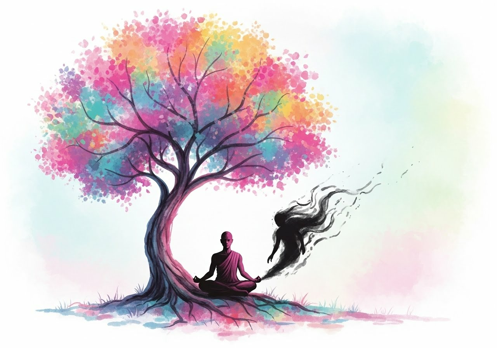
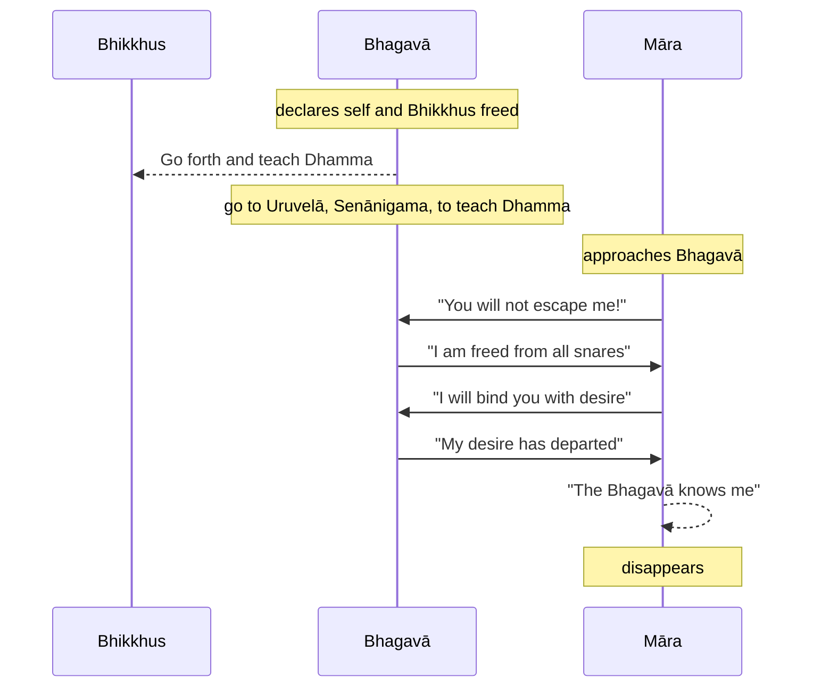

Original text: [World Tipitaka Edition](https://tipitaka2500.github.io/tipitaka/3V/1/1.8.html)

> [!INFO]
> Image generated by Imagen 4.

Pali text (click to view)

(32.)

131\. Atha kho bhagavā te bhikkhū āmantesi—  “muttāhaṃ, bhikkhave, sabbapāsehi, ye dibbā ye ca mānusā. Tumhepi, bhikkhave, muttā sabbapāsehi, ye dibbā ye ca mānusā. Caratha, bhikkhave, cārikaṃ bahujanahitāya bahujanasukhāya lokānukampāya atthāya hitāya sukhāya devamanussānaṃ. Mā ekena dve agamittha. Desetha, bhikkhave, dhammaṃ ādikalyāṇaṃ majjhekalyāṇaṃ pariyosānakalyāṇaṃ sātthaṃ sabyañjanaṃ kevalaparipuṇṇaṃ parisuddhaṃ brahmacariyaṃ pakāsetha. Santi sattā apparajakkhajātikā, assavanatā dhammassa parihāyanti, bhavissanti dhammassa aññātāro. Ahampi, bhikkhave, yena uruvelā senānigamo tenupasaṅkamissāmi dhammadesanāyā”ti.

(33.)

132\. Atha kho māro pāpimā yena bhagavā tenupasaṅkami, upasaṅkamitvā bhagavantaṃ gāthāya ajjhabhāsi—

133\. _“Baddhosi sabbapāsehi,_  
_ye dibbā ye ca mānusā;_  
_Mahābandhanabaddhosi,_  
_na me samaṇa mokkhasī”ti._  

134\. _“Muttāhaṃ sabbapāsehi,_  
_Ye dibbā ye ca mānusā;_  
_Mahābandhanamuttomhi,_  
_Nihato tvamasi antakā”ti._  

135\. _“Antalikkhacaro pāso,_  
_yvāyaṃ carati mānaso;_  
_Tena taṃ bādhayissāmi,_  
_na me samaṇa mokkhasī”ti._  

136\. _“Rūpā saddā rasā gandhā,_  
_Phoṭṭhabbā ca manoramā;_  
_Ettha me vigato chando,_  
_Nihato tvamasi antakā”ti._  

137\. Atha kho māro pāpimā—  “jānāti maṃ bhagavā, jānāti maṃ sugato”ti dukkhī dummano tatthevantaradhāyīti.

---

138\. Mārakathā niṭṭhitā.

## Summary

The Buddha, declaring both himself and his bhikkhus (monks) freed from all divine and human snares, instructs them to go forth and teach the Dhamma — a teaching good in its beginning, middle, and end, leading to a perfect holy life — for the welfare and happiness of all beings, as some are ready to understand it; he himself also intends to teach. This declaration of freedom is immediately challenged by Māra, who claims the Buddha is still bound. However, the Buddha refutes Māra's assertions, specifically stating his detachment from sensory desires (forms, sounds, tastes, smells, tangibles), which Māra intended as a "mental snare," causing Māra to recognise his defeat and vanish in distress.

## Diagram

## Text

(32.)

131\. Then the Bhagavā addressed those bhikkhus: “I am freed, bhikkhave, from all snares, both divine and human. You too, bhikkhave, are freed from all snares, both divine and human. Go forth, bhikkhave, on tour for the welfare of the many, for the happiness of the many, out of compassion for the world, for the good, welfare, and happiness of devas and humans. Let not two go by one way. Teach, bhikkhave, the Dhamma (Teaching) which is good in the beginning, good in the middle, good in the end, with its meaning and phrasing; make known the completely perfect and pure holy life. There are beings with little dust in their eyes; not hearing the Dhamma (Teaching), they decline; they will be understanders of the Dhamma (Teaching). I too, bhikkhave, will go to Uruvelā, to Senānigama, to teach the Dhamma (Teaching).”

(33.)

132\. Then Māra the Evil One approached the Bhagavā. Having approached, he addressed the Bhagavā in verse:

133\. _“You are bound by all snares,_
_both divine and human;_
_You are bound by a great bond,_
_You will not escape me, recluse!”_

134\. _“I am freed from all snares,_
_Both divine and human;_
_I am freed from the great bond,_
_You are struck down, End-maker!”_

135\. _“The snare that moves in the air,_
_this mental one that roams;_
_With that I will bind you,_
_You will not escape me, recluse!”_

136\. _“Forms, sounds, tastes, smells,_
_And delightful tangibles;_
_My chando (desire) for these has departed,_
_You are struck down, End-maker!”_

137\. Then Māra the Evil One— “The Bhagavā knows me, the Sugata knows me,” —distressed and dejected, vanished right there.

---

138\. The story of Māra is finished.

## Commentary

The narrative starts the scene by introducing the Buddha's decision to send forth his disciples to spread the Dhamma widely. This marks a turning point in the Buddha's teaching career - to transition from him personally teaching the Dhamma to authorising those who are liberated ('freed from all snares, both divine and human') to teach on his behalf.

This immediately raises the possibility and the risk that temptation may cause relapse either in the Buddha or in his disciples once they are geographically separated. The Buddha's nemesis Māra appears before him, challenging him and raising exactly this issue.

Note that Māra personifies the internal psychological forces that resist this liberation—the inertia of habitual thought, attachment, and aversion. Rationally, Māra is the voice of the ego-construct or established patterns of intentionality that perceive this shift as a threat. His challenge, "You are bound," is the reassertion of these old, binding structures within consciousness.

The Bhagavā’s refutation, particularly "My chando (desire) for these [sensory objects] has departed," identifies the core of this phenomenological freedom: a detachment from the compulsive urge towards or away from sensory stimuli. While phenomena are still perceived, their power to bind through craving or aversion is extinguished. "Māra," as the embodiment of these now-undermined internal compulsions, is "struck down" and "vanishes" when this clear, non-attached awareness is fully realised and acknowledged. His "distress" is the trace of these internal resistances losing their hold.

This narrative is highly significant because it once again implies that liberation is not permanent - residual tendencies to revert to old ways can reassert themselves, and therefore living a liberated life requires constant monitoring and assessment. This narrative signals confidence that the Buddha's initial community is strong and should be able to resist these tendencies.

## Other opinions

- [Gombrich - How Buddhism Began (1996,2006)](<../Books/Gombrich - How Buddhism Began (2006).md>)
	Gombrich analyzes the _Padhāna Sutta_, an early allegorical account of the Buddha's Enlightenment as a battle with Māra, the personification of death. It highlights a major contradiction with the later, more famous story: in this sutta, the Buddha defeats Māra _through_ extreme asceticism, directly opposing the orthodox "middle path" narrative where he rejects such practices. The author suggests this discrepancy reflects an early internal debate within Buddhism, possibly with Jain influence, regarding the value of asceticism. The text also explores the inconsistent portrayal of Māra, contrasting his serious role as the cosmic ruler of the world of desire with his more light-hearted and even humorous treatment in other Pali texts, where he is satirized, exorcised like a common demon, and comically defeated. This satirical approach, applied to figures like Māra and Brahmā, is presented as a method early Buddhists used to make serious theological points in a light-hearted manner.
[Go to previous page (1.7 Pabbajjākathā)](1.7.md) / [Go to parent page (1 Mahākhandhaka)](../1.md) / [Go to next page (1.9 Pabbajjūpasampadākathā)](1.9.md)

