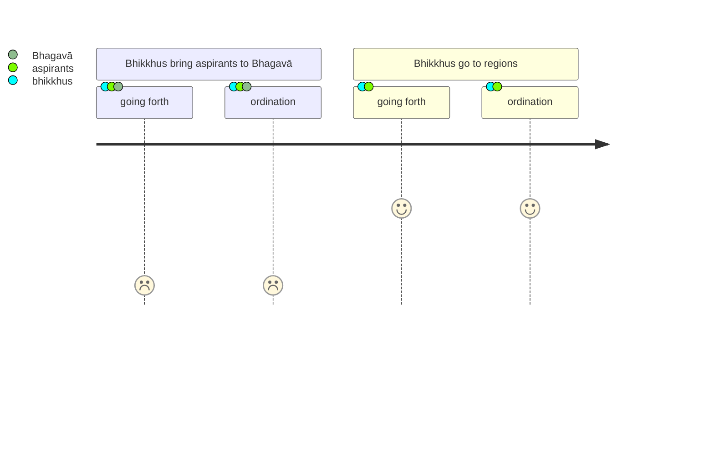
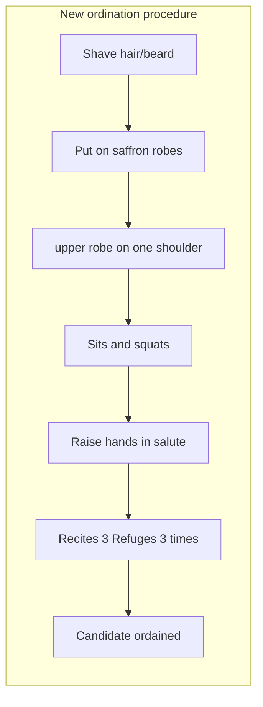

Original text: [World Tipitaka Edition](https://tipitaka2500.github.io/tipitaka/3V/1/1.9.html)

> [!INFO]
> Image generated by Imagen 4.

Pali text (click to view)

(34.)

139\. Tena kho pana samayena bhikkhū nānādisā nānājanapadā pabbajjāpekkhe ca upasampadāpekkhe ca ānenti—  “bhagavā ne pabbājessati upasampādessatī”ti. Tattha bhikkhū ceva kilamanti pabbajjāpekkhā ca upasampadāpekkhā ca. Atha kho bhagavato rahogatassa paṭisallīnassa evaṃ cetaso parivitakko udapādi—  “etarahi kho bhikkhū nānādisā nānājanapadā pabbajjāpekkhe ca upasampadāpekkhe ca ānenti—  ‘bhagavā ne pabbājessati upasampādessatī’ti. Tattha bhikkhū ceva kilamanti pabbajjāpekkhā ca upasampadāpekkhā ca. Yannūnāhaṃ bhikkhūnaṃ anujāneyyaṃ—  tumheva dāni, bhikkhave, tāsu tāsu disāsu tesu tesu janapadesu pabbājetha upasampādethā”ti.

140\. Atha kho bhagavā sāyanhasamayaṃ paṭisallānā vuṭṭhito etasmiṃ nidāne etasmiṃ pakaraṇe dhammiṃ kathaṃ katvā bhikkhū āmantesi—  “idha mayhaṃ, bhikkhave, rahogatassa paṭisallīnassa evaṃ cetaso parivitakko udapādi—  etarahi kho bhikkhū nānādisā nānājanapadā pabbajjāpekkhe ca upasampadāpekkhe ca ānenti—  ‘bhagavā ne pabbājessati upasampādessatī’ti, Tattha bhikkhū ceva kilamanti pabbajjāpekkhā ca upasampadāpekkhā ca. Yannūnāhaṃ bhikkhūnaṃ anujāneyyaṃ tumheva dāni, bhikkhave, tāsu tāsu disāsu tesu tesu janapadesu pabbājetha upasampādethāti, Anujānāmi, bhikkhave, tumheva dāni tāsu tāsu disāsu tesu tesu janapadesu pabbājetha upasampādetha. Evañca pana, bhikkhave, pabbājetabbo upasampādetabbo—

141\. Paṭhamaṃ kesamassuṃ ohārāpetvā, kāsāyāni vatthāni acchādāpetvā, ekaṃsaṃ uttarāsaṅgaṃ kārāpetvā, bhikkhūnaṃ pāde vandāpetvā, ukkuṭikaṃ nisīdāpetvā, añjaliṃ paggaṇhāpetvā ‘evaṃ vadehī’ti vattabbo—

142\. _‘Buddhaṃ saraṇaṃ gacchāmi,_  
_Dhammaṃ saraṇaṃ gacchāmi,_  
_Saṃghaṃ saraṇaṃ gacchāmi._  

143\. _Dutiyampi buddhaṃ saraṇaṃ gacchāmi,_  
_Dutiyampi dhammaṃ saraṇaṃ gacchāmi,_  
_Dutiyampi saṃghaṃ saraṇaṃ gacchāmi._  

144\. _Tatiyampi buddhaṃ saraṇaṃ gacchāmi,_  
_Tatiyampi dhammaṃ saraṇaṃ gacchāmi,_  
_Tatiyampi saṃghaṃ saraṇaṃ gacchāmī’ti._  

145\. Anujānāmi, bhikkhave, imehi tīhi saraṇagamanehi pabbajjaṃ upasampadan”ti.

---

146\. Tīhi saraṇagamanehi upasampadākathā niṭṭhitā.

## Summary

Due to the weariness experienced by both bhikkhus and aspirants traveling to the Bhagavā for ordination (`upasampadā`), the Bhagavā, after reflection, decided to authorise bhikkhus to conduct these ordinations themselves in their respective regions. He then detailed the ordination process, which includes preparatory actions like shaving and donning robes, paying homage, and culminates in the aspirant thrice reciting the Three Refuges (taking refuge in the Buddha, Dhamma, and Saṅgha). The Bhagavā declared that this act of taking the Three Refuges itself constitutes both `pabbajjā` (going forth) and `upasampadā` (higher ordination).

## Diagram

## Text

(34.)

139\. Now at that time, bhikkhus from various regions, from various countries, brought those wishing for pabbajjā (going forth) and those wishing for upasampadā (higher ordination), thinking, “The Bhagavā will give them pabbajjā, will give them upasampadā.” In that, both the bhikkhus became weary and those wishing for pabbajjā and those wishing for upasampadā. Then to the Bhagavā, who had gone into solitude, who was in seclusion, this thought arose in his mind: “Now bhikkhus from various regions, from various countries, bring those wishing for pabbajjā and those wishing for upasampadā, thinking, ‘The Bhagavā will give them pabbajjā, will give them upasampadā.’ In that, both the bhikkhus become weary and those wishing for pabbajjā and those wishing for upasampadā. What if I were to allow the bhikkhus: ‘You yourselves now, bhikkhave, in those various regions, in those various countries, may give pabbajjā, may give upasampadā.’”

140\. Then the Bhagavā, having arisen from seclusion in the evening, having given a Dhamma talk on this account, on this matter, addressed the bhikkhus: “Here, bhikkhave, when I had gone into solitude, was in seclusion, this thought arose in my mind: ‘Now bhikkhus from various regions, from various countries, bring those wishing for pabbajjā and those wishing for upasampadā, thinking, “The Bhagavā will give them pabbajjā, will give them upasampadā.” In that, both the bhikkhus become weary and those wishing for pabbajjā and those wishing for upasampadā. What if I were to allow the bhikkhus: “You yourselves now, bhikkhave, in those various regions, in those various countries, may give pabbajjā, may give upasampadā.”’ I allow, bhikkhave, you yourselves now in those various regions, in those various countries, to give pabbajjā, to give upasampadā. And in this way, bhikkhave, pabbajjā is to be given, upasampadā is to be given—

141\. First, having had the hair and beard shaved off, having had saffron robes put on, having had the upper robe arranged on one shoulder, having had homage paid to the feet of the bhikkhus, having had him sit in a squatting position, having had him raise his hands in añjali (reverential salutation), he should be told, ‘Speak thus’:

142\. _‘Buddhaṃ saraṇaṃ gacchāmi,_  
_Dhammaṃ saraṇaṃ gacchāmi,_  
_Saṃghaṃ saraṇaṃ gacchāmi._  

143\. _Dutiyampi buddhaṃ saraṇaṃ gacchāmi,_  
_Dutiyampi dhammaṃ saraṇaṃ gacchāmi,_  
_Dutiyampi saṃghaṃ saraṇaṃ gacchāmi._  

144\. _Tatiyampi buddhaṃ saraṇaṃ gacchāmi,_  
_Tatiyampi dhammaṃ saraṇaṃ gacchāmi,_  
_Tatiyampi saṃghaṃ saraṇaṃ gacchāmī’ti._  

145\. I allow, bhikkhave, by these three goings for refuge, the pabbajjā (going forth) and the upasampadā (higher ordination).”

---

146\. The discourse on upasampadā (higher ordination) by the three goings for refuge is finished.

## Commentary

This text describes a pragmatic organisational shift. Up till now, the Buddha's disciples had gone out individually - `Mā ekena dve agamittha` (Let not two go by one way.). This resulted in new recruits having to travel back along with the missionary to receive ordination from the Buddha, a situation that proved hard to scale.

The Buddha, experiencing the logistical strain of personally overseeing all new member initiations ("pabbajjā" and "upasampadā"), recognised the inefficiency. This recognition, framed as a thought arising during a period of focused reflection ("solitude," "seclusion"), represents a rational problem-solving process rather than a mystical insight. The observed "weariness" of both existing members and aspirants is the trigger prompting this re-evaluation.

The solution is a decentralisation of authority, empowering existing members to conduct initiations regionally. This is a logical adaptation to ensure the group's scalability and reduce systemic burden. The newly instituted ritual for initiation, involving specific physical actions (shaving, donning robes, prescribed postures) and verbal declarations, serves to structure the phenomenological experience of transition for the individual. These are not inherently spiritual acts but embodied practices that mark a clear shift in social identity and commitment.

The core of this new, simplified ordination is the threefold "going for refuge." Declaring "Buddhaṃ saraṇaṃ gacchāmi" is an individual's conscious alignment with an exemplary human model of inquiry and ethical living. "Dhammaṃ saraṇaṃ gacchāmi" signifies an experiential commitment to a specific set of teachings or principles as a framework for understanding and navigating lived experience. "Saṃghaṃ saraṇaṃ gacchāmi" represents the conscious decision to integrate into a community of like-minded individuals, seeking shared understanding and mutual support. The repetition intensifies this experiential commitment. Thus, the entire process is a rational response to practical challenges, formalising entry into a community through shared, observable actions and declarations that shape the individual's subjective experience of belonging and purpose.

Given my theory that the Khandhaka was possibly compiled and finalised immediately prior to the missions that spread Buddhism all across India during Emperor Aśoka's reign, this narrative could be a reference to the missionary effort, acting as a justification and motivation for the missionaries, and also setting forward the basic rules under which they operate. So, although the narrative is framed as the Buddha being still alive and making this decision for efficiency reasons, this narrative may also be covertly describing a situation when the Buddha has passed away. Previously, Buddhism probably spread organically, through the Buddha travelling to different regions and attracting disciples. Clearly, with the Buddha no longer present, the missionaries need an authority to be able to accept new members using the Refuges as a foundation.

[Go to previous page (1.8 Mārakathā)](1.8.md) / [Go to parent page (1 Mahākhandhaka)](../Khandhaka) / [Go to next page (1.10 Dutiyamārakathā)](1.10.md)

